# Predicting the beautiful game, with a game of the beautiful game

## Premier League Match Predictions with FIFA game data

Ever since playing the beautiful game as a child, watching my first football game of Liverpool FC and my first world cup in 1998, the game has not stopped fascinating me. Not surprisingly, this has also led to a fascination with the FIFA football game. The data collected by EA Sports for the FIFA football game has been ever expanding and becoming increasingly real time. Player and team statistics used to be updated once a year with the new game release, but nowadays, player and team statistics get updated regularly during the season, reflecting players and teams in and out of form, as well as new players emerging during the season. <br>

With the increasing close to real time data collected for the FIFA football game, I pose the question whether it is possible to predict the outcome of a match, based on data from the FIFA football game?

As a premise we put ourselves in the shoes of many football fans out there.
We are sitting in front of our game console, playing the latest FIFA game. It's one hour before kickoff of the match of our favorite Premier League football team. As usual, the team news for both teams has just been released.
Can we predict the outcome of the Premier League match, based on the FIFA game statistics of the announced starting eleven of both sides?

Before we can answer this question, we will have to prepare the data for analysis, which will be part 1 of this notebook.<br>

Part two will then continue with Exploratory Data Analysis, to gain some insights from the data. After we will run several machine learning algorithms, to try to predict the outcome of the game.


## Part 1 Data Pre-processing

Before we can start, we will first need a dataset. For this project I will be using the "European Soccer Database". <br>
The dataset can be found under the following link on Kaggle: [Dataset](https://www.kaggle.com/hugomathien/soccer)

The dataset contains match information for 25,000 matches, spanning seasons 2008/2009 to 2015/2016. In addition, it contains the player and team data for the same seasons from the FIFA football game. As the data is saved on an SQL database, in the first part of the next section we will extract the data from the database, before merging the match, player and team information into one data frame.

### Data Extraction from SQLlite Database
For the data extraction in SQL, I will be using the sqlite3 library. This offers a seamless transition from SQL to pandas, as we can directly extract the data from the database with sql queries into a Pandas Dataframe.


```python
import pandas as pd # data processing
import sqlite3 #SQL library to extract data from sql database

#display max columns and rows, to be able to inspect big data tables
pd.set_option('display.max_columns', None)
pd.set_option('display.max_rows', None)
```

Below line is to connect the google colab instance to google drive. If run outside colab, below code is ignored.


```python
# conntects to google drive if ran in colab
# ignored if ran outside of colab

if 'google.colab' in str(get_ipython()):
  from google.colab import drive
  drive.mount('/content/drive')
```

The following code first connects to the SQL database saved in the folder under the 'path' variable in case it is ran within colab. If ran outside of colab, the SQL database should be saved in the same folder as the notebook.


```python
# connect to SQL database in google drive if ran in colab. 
# connet to SQL database in notebook folder if ran outside of colab

if 'google.colab' in str(get_ipython()):
    path = '/content/drive/My Drive/Colab Notebooks/Python_Data_Programming_Coursework/'
else:
    path = str()
database = path + 'database.sqlite'
conn = sqlite3.connect(database)
```

The next few lines of code first extract an overview of all tables in the database. Then I download the tables from the SQL database into a dataframe with the sqlite3 library.

It may be possible to extract the data in a more efficient manner, merging several tables during the extraction. However, as the SQL query code would get involved, I decided to do most of the table merging activity in Pandas.

For the "Match" table, in the first download I only extract five entries, to get an understanding of the column structure. This is the base table which will be used to merge the player and team data on.


```python
# get overview of tables in SQL database
tables = pd.read_sql("""SELECT *
                      FROM sqlite_master
                      WHERE type='table';""", conn)
tables
```


<div>
<style scoped>
    .dataframe tbody tr th:only-of-type {
        vertical-align: middle;
    }

    .dataframe tbody tr th {
        vertical-align: top;
    }

    .dataframe thead th {
        text-align: right;
    }
</style>
<table border="1" class="dataframe">
  <thead>
    <tr style="text-align: right;">
      <th></th>
      <th>type</th>
      <th>name</th>
      <th>tbl_name</th>
      <th>rootpage</th>
      <th>sql</th>
    </tr>
  </thead>
  <tbody>
    <tr>
      <th>0</th>
      <td>table</td>
      <td>sqlite_sequence</td>
      <td>sqlite_sequence</td>
      <td>4</td>
      <td>CREATE TABLE sqlite_sequence(name,seq)</td>
    </tr>
    <tr>
      <th>1</th>
      <td>table</td>
      <td>Player_Attributes</td>
      <td>Player_Attributes</td>
      <td>11</td>
      <td>CREATE TABLE "Player_Attributes" (\n\t`id`\tIN...</td>
    </tr>
    <tr>
      <th>2</th>
      <td>table</td>
      <td>Player</td>
      <td>Player</td>
      <td>14</td>
      <td>CREATE TABLE `Player` (\n\t`id`\tINTEGER PRIMA...</td>
    </tr>
    <tr>
      <th>3</th>
      <td>table</td>
      <td>Match</td>
      <td>Match</td>
      <td>18</td>
      <td>CREATE TABLE `Match` (\n\t`id`\tINTEGER PRIMAR...</td>
    </tr>
    <tr>
      <th>4</th>
      <td>table</td>
      <td>League</td>
      <td>League</td>
      <td>24</td>
      <td>CREATE TABLE `League` (\n\t`id`\tINTEGER PRIMA...</td>
    </tr>
    <tr>
      <th>5</th>
      <td>table</td>
      <td>Country</td>
      <td>Country</td>
      <td>26</td>
      <td>CREATE TABLE `Country` (\n\t`id`\tINTEGER PRIM...</td>
    </tr>
    <tr>
      <th>6</th>
      <td>table</td>
      <td>Team</td>
      <td>Team</td>
      <td>29</td>
      <td>CREATE TABLE "Team" (\n\t`id`\tINTEGER PRIMARY...</td>
    </tr>
    <tr>
      <th>7</th>
      <td>table</td>
      <td>Team_Attributes</td>
      <td>Team_Attributes</td>
      <td>2</td>
      <td>CREATE TABLE `Team_Attributes` (\n\t`id`\tINTE...</td>
    </tr>
  </tbody>
</table>
</div>


```python
# extract Country table from database
countries = pd.read_sql("""SELECT *
                        FROM Country
                        """, conn)
countries
```


<div>
<style scoped>
    .dataframe tbody tr th:only-of-type {
        vertical-align: middle;
    }

    .dataframe tbody tr th {
        vertical-align: top;
    }

    .dataframe thead th {
        text-align: right;
    }
</style>
<table border="1" class="dataframe">
  <thead>
    <tr style="text-align: right;">
      <th></th>
      <th>id</th>
      <th>name</th>
    </tr>
  </thead>
  <tbody>
    <tr>
      <th>0</th>
      <td>1</td>
      <td>Belgium</td>
    </tr>
    <tr>
      <th>1</th>
      <td>1729</td>
      <td>England</td>
    </tr>
    <tr>
      <th>2</th>
      <td>4769</td>
      <td>France</td>
    </tr>
    <tr>
      <th>3</th>
      <td>7809</td>
      <td>Germany</td>
    </tr>
    <tr>
      <th>4</th>
      <td>10257</td>
      <td>Italy</td>
    </tr>
    <tr>
      <th>5</th>
      <td>13274</td>
      <td>Netherlands</td>
    </tr>
    <tr>
      <th>6</th>
      <td>15722</td>
      <td>Poland</td>
    </tr>
    <tr>
      <th>7</th>
      <td>17642</td>
      <td>Portugal</td>
    </tr>
    <tr>
      <th>8</th>
      <td>19694</td>
      <td>Scotland</td>
    </tr>
    <tr>
      <th>9</th>
      <td>21518</td>
      <td>Spain</td>
    </tr>
    <tr>
      <th>10</th>
      <td>24558</td>
      <td>Switzerland</td>
    </tr>
  </tbody>
</table>
</div>


```python
# extract League table from database
leagues = pd.read_sql("""SELECT *
                      FROM League
                       """, conn)
leagues
```


<div>
<style scoped>
    .dataframe tbody tr th:only-of-type {
        vertical-align: middle;
    }

    .dataframe tbody tr th {
        vertical-align: top;
    }

    .dataframe thead th {
        text-align: right;
    }
</style>
<table border="1" class="dataframe">
  <thead>
    <tr style="text-align: right;">
      <th></th>
      <th>id</th>
      <th>country_id</th>
      <th>name</th>
    </tr>
  </thead>
  <tbody>
    <tr>
      <th>0</th>
      <td>1</td>
      <td>1</td>
      <td>Belgium Jupiler League</td>
    </tr>
    <tr>
      <th>1</th>
      <td>1729</td>
      <td>1729</td>
      <td>England Premier League</td>
    </tr>
    <tr>
      <th>2</th>
      <td>4769</td>
      <td>4769</td>
      <td>France Ligue 1</td>
    </tr>
    <tr>
      <th>3</th>
      <td>7809</td>
      <td>7809</td>
      <td>Germany 1. Bundesliga</td>
    </tr>
    <tr>
      <th>4</th>
      <td>10257</td>
      <td>10257</td>
      <td>Italy Serie A</td>
    </tr>
    <tr>
      <th>5</th>
      <td>13274</td>
      <td>13274</td>
      <td>Netherlands Eredivisie</td>
    </tr>
    <tr>
      <th>6</th>
      <td>15722</td>
      <td>15722</td>
      <td>Poland Ekstraklasa</td>
    </tr>
    <tr>
      <th>7</th>
      <td>17642</td>
      <td>17642</td>
      <td>Portugal Liga ZON Sagres</td>
    </tr>
    <tr>
      <th>8</th>
      <td>19694</td>
      <td>19694</td>
      <td>Scotland Premier League</td>
    </tr>
    <tr>
      <th>9</th>
      <td>21518</td>
      <td>21518</td>
      <td>Spain LIGA BBVA</td>
    </tr>
    <tr>
      <th>10</th>
      <td>24558</td>
      <td>24558</td>
      <td>Switzerland Super League</td>
    </tr>
  </tbody>
</table>
</div>


```python
# extract Team table from database
teams = pd.read_sql("""SELECT *
                        FROM Team
                        """, conn)
teams.head(5)
```


<div>
<style scoped>
    .dataframe tbody tr th:only-of-type {
        vertical-align: middle;
    }

    .dataframe tbody tr th {
        vertical-align: top;
    }

    .dataframe thead th {
        text-align: right;
    }
</style>
<table border="1" class="dataframe">
  <thead>
    <tr style="text-align: right;">
      <th></th>
      <th>id</th>
      <th>team_api_id</th>
      <th>team_fifa_api_id</th>
      <th>team_long_name</th>
      <th>team_short_name</th>
    </tr>
  </thead>
  <tbody>
    <tr>
      <th>0</th>
      <td>1</td>
      <td>9987</td>
      <td>673.0</td>
      <td>KRC Genk</td>
      <td>GEN</td>
    </tr>
    <tr>
      <th>1</th>
      <td>2</td>
      <td>9993</td>
      <td>675.0</td>
      <td>Beerschot AC</td>
      <td>BAC</td>
    </tr>
    <tr>
      <th>2</th>
      <td>3</td>
      <td>10000</td>
      <td>15005.0</td>
      <td>SV Zulte-Waregem</td>
      <td>ZUL</td>
    </tr>
    <tr>
      <th>3</th>
      <td>4</td>
      <td>9994</td>
      <td>2007.0</td>
      <td>Sporting Lokeren</td>
      <td>LOK</td>
    </tr>
    <tr>
      <th>4</th>
      <td>5</td>
      <td>9984</td>
      <td>1750.0</td>
      <td>KSV Cercle Brugge</td>
      <td>CEB</td>
    </tr>
  </tbody>
</table>
</div>


```python
# extract Team Attributes table from database
team_attributes = pd.read_sql("""SELECT *
                        FROM Team_Attributes
                        """, conn)
team_attributes.head(5)
```


<div>
<style scoped>
    .dataframe tbody tr th:only-of-type {
        vertical-align: middle;
    }

    .dataframe tbody tr th {
        vertical-align: top;
    }

    .dataframe thead th {
        text-align: right;
    }
</style>
<table border="1" class="dataframe">
  <thead>
    <tr style="text-align: right;">
      <th></th>
      <th>id</th>
      <th>team_fifa_api_id</th>
      <th>team_api_id</th>
      <th>date</th>
      <th>buildUpPlaySpeed</th>
      <th>buildUpPlaySpeedClass</th>
      <th>buildUpPlayDribbling</th>
      <th>buildUpPlayDribblingClass</th>
      <th>buildUpPlayPassing</th>
      <th>buildUpPlayPassingClass</th>
      <th>buildUpPlayPositioningClass</th>
      <th>chanceCreationPassing</th>
      <th>chanceCreationPassingClass</th>
      <th>chanceCreationCrossing</th>
      <th>chanceCreationCrossingClass</th>
      <th>chanceCreationShooting</th>
      <th>chanceCreationShootingClass</th>
      <th>chanceCreationPositioningClass</th>
      <th>defencePressure</th>
      <th>defencePressureClass</th>
      <th>defenceAggression</th>
      <th>defenceAggressionClass</th>
      <th>defenceTeamWidth</th>
      <th>defenceTeamWidthClass</th>
      <th>defenceDefenderLineClass</th>
    </tr>
  </thead>
  <tbody>
    <tr>
      <th>0</th>
      <td>1</td>
      <td>434</td>
      <td>9930</td>
      <td>2010-02-22 00:00:00</td>
      <td>60</td>
      <td>Balanced</td>
      <td>NaN</td>
      <td>Little</td>
      <td>50</td>
      <td>Mixed</td>
      <td>Organised</td>
      <td>60</td>
      <td>Normal</td>
      <td>65</td>
      <td>Normal</td>
      <td>55</td>
      <td>Normal</td>
      <td>Organised</td>
      <td>50</td>
      <td>Medium</td>
      <td>55</td>
      <td>Press</td>
      <td>45</td>
      <td>Normal</td>
      <td>Cover</td>
    </tr>
    <tr>
      <th>1</th>
      <td>2</td>
      <td>434</td>
      <td>9930</td>
      <td>2014-09-19 00:00:00</td>
      <td>52</td>
      <td>Balanced</td>
      <td>48.0</td>
      <td>Normal</td>
      <td>56</td>
      <td>Mixed</td>
      <td>Organised</td>
      <td>54</td>
      <td>Normal</td>
      <td>63</td>
      <td>Normal</td>
      <td>64</td>
      <td>Normal</td>
      <td>Organised</td>
      <td>47</td>
      <td>Medium</td>
      <td>44</td>
      <td>Press</td>
      <td>54</td>
      <td>Normal</td>
      <td>Cover</td>
    </tr>
    <tr>
      <th>2</th>
      <td>3</td>
      <td>434</td>
      <td>9930</td>
      <td>2015-09-10 00:00:00</td>
      <td>47</td>
      <td>Balanced</td>
      <td>41.0</td>
      <td>Normal</td>
      <td>54</td>
      <td>Mixed</td>
      <td>Organised</td>
      <td>54</td>
      <td>Normal</td>
      <td>63</td>
      <td>Normal</td>
      <td>64</td>
      <td>Normal</td>
      <td>Organised</td>
      <td>47</td>
      <td>Medium</td>
      <td>44</td>
      <td>Press</td>
      <td>54</td>
      <td>Normal</td>
      <td>Cover</td>
    </tr>
    <tr>
      <th>3</th>
      <td>4</td>
      <td>77</td>
      <td>8485</td>
      <td>2010-02-22 00:00:00</td>
      <td>70</td>
      <td>Fast</td>
      <td>NaN</td>
      <td>Little</td>
      <td>70</td>
      <td>Long</td>
      <td>Organised</td>
      <td>70</td>
      <td>Risky</td>
      <td>70</td>
      <td>Lots</td>
      <td>70</td>
      <td>Lots</td>
      <td>Organised</td>
      <td>60</td>
      <td>Medium</td>
      <td>70</td>
      <td>Double</td>
      <td>70</td>
      <td>Wide</td>
      <td>Cover</td>
    </tr>
    <tr>
      <th>4</th>
      <td>5</td>
      <td>77</td>
      <td>8485</td>
      <td>2011-02-22 00:00:00</td>
      <td>47</td>
      <td>Balanced</td>
      <td>NaN</td>
      <td>Little</td>
      <td>52</td>
      <td>Mixed</td>
      <td>Organised</td>
      <td>53</td>
      <td>Normal</td>
      <td>48</td>
      <td>Normal</td>
      <td>52</td>
      <td>Normal</td>
      <td>Organised</td>
      <td>47</td>
      <td>Medium</td>
      <td>47</td>
      <td>Press</td>
      <td>52</td>
      <td>Normal</td>
      <td>Cover</td>
    </tr>
  </tbody>
</table>
</div>


```python
# extract Match table from database, limited to 5 matches, just to get a quick understanding of the table. 
matches = pd.read_sql("""SELECT *
                        FROM Match
                        JOIN Country ON Match.country_id = Country.id
                        WHERE Country.name = 'England'
                        LIMIT 5
                        """, conn)
matches
```


<div>
<style scoped>
    .dataframe tbody tr th:only-of-type {
        vertical-align: middle;
    }

    .dataframe tbody tr th {
        vertical-align: top;
    }

    .dataframe thead th {
        text-align: right;
    }
</style>
<table border="1" class="dataframe">
  <thead>
    <tr style="text-align: right;">
      <th></th>
      <th>id</th>
      <th>country_id</th>
      <th>league_id</th>
      <th>season</th>
      <th>stage</th>
      <th>date</th>
      <th>match_api_id</th>
      <th>home_team_api_id</th>
      <th>away_team_api_id</th>
      <th>home_team_goal</th>
      <th>away_team_goal</th>
      <th>home_player_X1</th>
      <th>home_player_X2</th>
      <th>home_player_X3</th>
      <th>home_player_X4</th>
      <th>home_player_X5</th>
      <th>home_player_X6</th>
      <th>home_player_X7</th>
      <th>home_player_X8</th>
      <th>home_player_X9</th>
      <th>home_player_X10</th>
      <th>home_player_X11</th>
      <th>away_player_X1</th>
      <th>away_player_X2</th>
      <th>away_player_X3</th>
      <th>away_player_X4</th>
      <th>away_player_X5</th>
      <th>away_player_X6</th>
      <th>away_player_X7</th>
      <th>away_player_X8</th>
      <th>away_player_X9</th>
      <th>away_player_X10</th>
      <th>away_player_X11</th>
      <th>home_player_Y1</th>
      <th>home_player_Y2</th>
      <th>home_player_Y3</th>
      <th>home_player_Y4</th>
      <th>home_player_Y5</th>
      <th>home_player_Y6</th>
      <th>home_player_Y7</th>
      <th>home_player_Y8</th>
      <th>home_player_Y9</th>
      <th>home_player_Y10</th>
      <th>home_player_Y11</th>
      <th>away_player_Y1</th>
      <th>away_player_Y2</th>
      <th>away_player_Y3</th>
      <th>away_player_Y4</th>
      <th>away_player_Y5</th>
      <th>away_player_Y6</th>
      <th>away_player_Y7</th>
      <th>away_player_Y8</th>
      <th>away_player_Y9</th>
      <th>away_player_Y10</th>
      <th>away_player_Y11</th>
      <th>home_player_1</th>
      <th>home_player_2</th>
      <th>home_player_3</th>
      <th>home_player_4</th>
      <th>home_player_5</th>
      <th>home_player_6</th>
      <th>home_player_7</th>
      <th>home_player_8</th>
      <th>home_player_9</th>
      <th>home_player_10</th>
      <th>home_player_11</th>
      <th>away_player_1</th>
      <th>away_player_2</th>
      <th>away_player_3</th>
      <th>away_player_4</th>
      <th>away_player_5</th>
      <th>away_player_6</th>
      <th>away_player_7</th>
      <th>away_player_8</th>
      <th>away_player_9</th>
      <th>away_player_10</th>
      <th>away_player_11</th>
      <th>goal</th>
      <th>shoton</th>
      <th>shotoff</th>
      <th>foulcommit</th>
      <th>card</th>
      <th>cross</th>
      <th>corner</th>
      <th>possession</th>
      <th>B365H</th>
      <th>B365D</th>
      <th>B365A</th>
      <th>BWH</th>
      <th>BWD</th>
      <th>BWA</th>
      <th>IWH</th>
      <th>IWD</th>
      <th>IWA</th>
      <th>LBH</th>
      <th>LBD</th>
      <th>LBA</th>
      <th>PSH</th>
      <th>PSD</th>
      <th>PSA</th>
      <th>WHH</th>
      <th>WHD</th>
      <th>WHA</th>
      <th>SJH</th>
      <th>SJD</th>
      <th>SJA</th>
      <th>VCH</th>
      <th>VCD</th>
      <th>VCA</th>
      <th>GBH</th>
      <th>GBD</th>
      <th>GBA</th>
      <th>BSH</th>
      <th>BSD</th>
      <th>BSA</th>
      <th>id</th>
      <th>name</th>
    </tr>
  </thead>
  <tbody>
    <tr>
      <th>0</th>
      <td>1729</td>
      <td>1729</td>
      <td>1729</td>
      <td>2008/2009</td>
      <td>1</td>
      <td>2008-08-17 00:00:00</td>
      <td>489042</td>
      <td>10260</td>
      <td>10261</td>
      <td>1</td>
      <td>1</td>
      <td>1</td>
      <td>2</td>
      <td>4</td>
      <td>6</td>
      <td>8</td>
      <td>2</td>
      <td>4</td>
      <td>6</td>
      <td>8</td>
      <td>4</td>
      <td>6</td>
      <td>1</td>
      <td>2</td>
      <td>4</td>
      <td>6</td>
      <td>8</td>
      <td>2</td>
      <td>4</td>
      <td>6</td>
      <td>8</td>
      <td>5</td>
      <td>5</td>
      <td>1</td>
      <td>3</td>
      <td>3</td>
      <td>3</td>
      <td>3</td>
      <td>7</td>
      <td>7</td>
      <td>7</td>
      <td>7</td>
      <td>10</td>
      <td>10</td>
      <td>1</td>
      <td>3</td>
      <td>3</td>
      <td>3</td>
      <td>3</td>
      <td>7</td>
      <td>7</td>
      <td>7</td>
      <td>7</td>
      <td>9</td>
      <td>11</td>
      <td>30726</td>
      <td>30362</td>
      <td>30620</td>
      <td>30865</td>
      <td>32569</td>
      <td>24148</td>
      <td>34944</td>
      <td>30373</td>
      <td>24154</td>
      <td>24157</td>
      <td>30829</td>
      <td>24224</td>
      <td>25518</td>
      <td>24228</td>
      <td>30929</td>
      <td>29581</td>
      <td>38807</td>
      <td>40565</td>
      <td>30360</td>
      <td>33852.0</td>
      <td>34574</td>
      <td>37799</td>
      <td>&lt;goal&gt;&lt;value&gt;&lt;comment&gt;n&lt;/comment&gt;&lt;stats&gt;&lt;goals...</td>
      <td>&lt;shoton&gt;&lt;value&gt;&lt;stats&gt;&lt;blocked&gt;1&lt;/blocked&gt;&lt;/st...</td>
      <td>&lt;shotoff&gt;&lt;value&gt;&lt;stats&gt;&lt;shotoff&gt;1&lt;/shotoff&gt;&lt;/s...</td>
      <td>&lt;foulcommit&gt;&lt;value&gt;&lt;stats&gt;&lt;foulscommitted&gt;1&lt;/f...</td>
      <td>&lt;card&gt;&lt;value&gt;&lt;comment&gt;y&lt;/comment&gt;&lt;stats&gt;&lt;ycard...</td>
      <td>&lt;cross&gt;&lt;value&gt;&lt;stats&gt;&lt;crosses&gt;1&lt;/crosses&gt;&lt;/sta...</td>
      <td>&lt;corner&gt;&lt;value&gt;&lt;stats&gt;&lt;corners&gt;1&lt;/corners&gt;&lt;/st...</td>
      <td>&lt;possession&gt;&lt;value&gt;&lt;comment&gt;56&lt;/comment&gt;&lt;event...</td>
      <td>1.29</td>
      <td>5.5</td>
      <td>11.00</td>
      <td>1.30</td>
      <td>4.75</td>
      <td>8.25</td>
      <td>1.3</td>
      <td>4.4</td>
      <td>8.50</td>
      <td>1.25</td>
      <td>4.5</td>
      <td>10.00</td>
      <td>None</td>
      <td>None</td>
      <td>None</td>
      <td>1.25</td>
      <td>4.5</td>
      <td>10.00</td>
      <td>1.25</td>
      <td>5.00</td>
      <td>10.00</td>
      <td>1.28</td>
      <td>5.5</td>
      <td>12.00</td>
      <td>1.30</td>
      <td>4.75</td>
      <td>10.0</td>
      <td>1.29</td>
      <td>4.50</td>
      <td>11.00</td>
      <td>1729</td>
      <td>England</td>
    </tr>
    <tr>
      <th>1</th>
      <td>1730</td>
      <td>1729</td>
      <td>1729</td>
      <td>2008/2009</td>
      <td>1</td>
      <td>2008-08-16 00:00:00</td>
      <td>489043</td>
      <td>9825</td>
      <td>8659</td>
      <td>1</td>
      <td>0</td>
      <td>1</td>
      <td>2</td>
      <td>4</td>
      <td>6</td>
      <td>8</td>
      <td>2</td>
      <td>4</td>
      <td>6</td>
      <td>8</td>
      <td>4</td>
      <td>6</td>
      <td>1</td>
      <td>2</td>
      <td>4</td>
      <td>6</td>
      <td>8</td>
      <td>5</td>
      <td>7</td>
      <td>9</td>
      <td>1</td>
      <td>3</td>
      <td>5</td>
      <td>1</td>
      <td>3</td>
      <td>3</td>
      <td>3</td>
      <td>3</td>
      <td>7</td>
      <td>7</td>
      <td>7</td>
      <td>7</td>
      <td>10</td>
      <td>10</td>
      <td>1</td>
      <td>3</td>
      <td>3</td>
      <td>3</td>
      <td>3</td>
      <td>7</td>
      <td>7</td>
      <td>7</td>
      <td>7</td>
      <td>7</td>
      <td>11</td>
      <td>23686</td>
      <td>26111</td>
      <td>38835</td>
      <td>30986</td>
      <td>31291</td>
      <td>31013</td>
      <td>30935</td>
      <td>39297</td>
      <td>26181</td>
      <td>30960</td>
      <td>36410</td>
      <td>36373</td>
      <td>36832</td>
      <td>23115</td>
      <td>37280</td>
      <td>24728</td>
      <td>24664</td>
      <td>31088</td>
      <td>23257</td>
      <td>24171.0</td>
      <td>25922</td>
      <td>27267</td>
      <td>&lt;goal&gt;&lt;value&gt;&lt;comment&gt;n&lt;/comment&gt;&lt;stats&gt;&lt;goals...</td>
      <td>&lt;shoton&gt;&lt;value&gt;&lt;stats&gt;&lt;blocked&gt;1&lt;/blocked&gt;&lt;/st...</td>
      <td>&lt;shotoff&gt;&lt;value&gt;&lt;stats&gt;&lt;shotoff&gt;1&lt;/shotoff&gt;&lt;/s...</td>
      <td>&lt;foulcommit&gt;&lt;value&gt;&lt;stats&gt;&lt;foulscommitted&gt;1&lt;/f...</td>
      <td>&lt;card /&gt;</td>
      <td>&lt;cross&gt;&lt;value&gt;&lt;stats&gt;&lt;crosses&gt;1&lt;/crosses&gt;&lt;/sta...</td>
      <td>&lt;corner&gt;&lt;value&gt;&lt;stats&gt;&lt;corners&gt;1&lt;/corners&gt;&lt;/st...</td>
      <td>&lt;possession&gt;&lt;value&gt;&lt;comment&gt;65&lt;/comment&gt;&lt;event...</td>
      <td>1.20</td>
      <td>6.5</td>
      <td>15.00</td>
      <td>1.22</td>
      <td>5.50</td>
      <td>10.00</td>
      <td>1.2</td>
      <td>5.2</td>
      <td>11.00</td>
      <td>1.20</td>
      <td>5.0</td>
      <td>11.00</td>
      <td>None</td>
      <td>None</td>
      <td>None</td>
      <td>1.17</td>
      <td>5.5</td>
      <td>12.00</td>
      <td>1.20</td>
      <td>5.50</td>
      <td>12.00</td>
      <td>1.25</td>
      <td>6.0</td>
      <td>13.00</td>
      <td>1.22</td>
      <td>5.50</td>
      <td>13.0</td>
      <td>1.22</td>
      <td>5.00</td>
      <td>13.00</td>
      <td>1729</td>
      <td>England</td>
    </tr>
    <tr>
      <th>2</th>
      <td>1731</td>
      <td>1729</td>
      <td>1729</td>
      <td>2008/2009</td>
      <td>1</td>
      <td>2008-08-16 00:00:00</td>
      <td>489044</td>
      <td>8472</td>
      <td>8650</td>
      <td>0</td>
      <td>1</td>
      <td>1</td>
      <td>2</td>
      <td>4</td>
      <td>6</td>
      <td>8</td>
      <td>2</td>
      <td>4</td>
      <td>6</td>
      <td>8</td>
      <td>4</td>
      <td>6</td>
      <td>1</td>
      <td>2</td>
      <td>4</td>
      <td>6</td>
      <td>8</td>
      <td>2</td>
      <td>4</td>
      <td>6</td>
      <td>8</td>
      <td>4</td>
      <td>6</td>
      <td>1</td>
      <td>3</td>
      <td>3</td>
      <td>3</td>
      <td>3</td>
      <td>7</td>
      <td>7</td>
      <td>7</td>
      <td>7</td>
      <td>10</td>
      <td>10</td>
      <td>1</td>
      <td>3</td>
      <td>3</td>
      <td>3</td>
      <td>3</td>
      <td>7</td>
      <td>7</td>
      <td>7</td>
      <td>7</td>
      <td>10</td>
      <td>10</td>
      <td>32562</td>
      <td>38836</td>
      <td>24446</td>
      <td>24408</td>
      <td>36786</td>
      <td>38802</td>
      <td>24655</td>
      <td>17866</td>
      <td>30352</td>
      <td>23927</td>
      <td>24410</td>
      <td>30660</td>
      <td>37442</td>
      <td>30617</td>
      <td>24134</td>
      <td>414792</td>
      <td>37139</td>
      <td>30618</td>
      <td>40701</td>
      <td>24800.0</td>
      <td>24635</td>
      <td>30853</td>
      <td>&lt;goal&gt;&lt;value&gt;&lt;comment&gt;n&lt;/comment&gt;&lt;stats&gt;&lt;goals...</td>
      <td>&lt;shoton&gt;&lt;value&gt;&lt;stats&gt;&lt;blocked&gt;1&lt;/blocked&gt;&lt;/st...</td>
      <td>&lt;shotoff&gt;&lt;value&gt;&lt;stats&gt;&lt;shotoff&gt;1&lt;/shotoff&gt;&lt;/s...</td>
      <td>&lt;foulcommit&gt;&lt;value&gt;&lt;stats&gt;&lt;foulscommitted&gt;1&lt;/f...</td>
      <td>&lt;card&gt;&lt;value&gt;&lt;comment&gt;y&lt;/comment&gt;&lt;stats&gt;&lt;ycard...</td>
      <td>&lt;cross&gt;&lt;value&gt;&lt;stats&gt;&lt;crosses&gt;1&lt;/crosses&gt;&lt;/sta...</td>
      <td>&lt;corner&gt;&lt;value&gt;&lt;stats&gt;&lt;corners&gt;1&lt;/corners&gt;&lt;/st...</td>
      <td>&lt;possession&gt;&lt;value&gt;&lt;comment&gt;45&lt;/comment&gt;&lt;event...</td>
      <td>5.50</td>
      <td>3.6</td>
      <td>1.67</td>
      <td>5.00</td>
      <td>3.35</td>
      <td>1.67</td>
      <td>4.5</td>
      <td>3.5</td>
      <td>1.65</td>
      <td>4.50</td>
      <td>3.3</td>
      <td>1.67</td>
      <td>None</td>
      <td>None</td>
      <td>None</td>
      <td>5.50</td>
      <td>3.3</td>
      <td>1.57</td>
      <td>4.33</td>
      <td>3.40</td>
      <td>1.73</td>
      <td>5.50</td>
      <td>3.8</td>
      <td>1.65</td>
      <td>5.00</td>
      <td>3.40</td>
      <td>1.7</td>
      <td>4.50</td>
      <td>3.40</td>
      <td>1.73</td>
      <td>1729</td>
      <td>England</td>
    </tr>
    <tr>
      <th>3</th>
      <td>1732</td>
      <td>1729</td>
      <td>1729</td>
      <td>2008/2009</td>
      <td>1</td>
      <td>2008-08-16 00:00:00</td>
      <td>489045</td>
      <td>8654</td>
      <td>8528</td>
      <td>2</td>
      <td>1</td>
      <td>1</td>
      <td>2</td>
      <td>4</td>
      <td>6</td>
      <td>8</td>
      <td>2</td>
      <td>4</td>
      <td>6</td>
      <td>8</td>
      <td>4</td>
      <td>6</td>
      <td>1</td>
      <td>2</td>
      <td>6</td>
      <td>8</td>
      <td>4</td>
      <td>2</td>
      <td>4</td>
      <td>6</td>
      <td>8</td>
      <td>4</td>
      <td>6</td>
      <td>1</td>
      <td>3</td>
      <td>3</td>
      <td>3</td>
      <td>3</td>
      <td>7</td>
      <td>7</td>
      <td>7</td>
      <td>7</td>
      <td>10</td>
      <td>10</td>
      <td>1</td>
      <td>3</td>
      <td>3</td>
      <td>3</td>
      <td>3</td>
      <td>7</td>
      <td>7</td>
      <td>7</td>
      <td>7</td>
      <td>10</td>
      <td>10</td>
      <td>36374</td>
      <td>30966</td>
      <td>23818</td>
      <td>37277</td>
      <td>30687</td>
      <td>36394</td>
      <td>37169</td>
      <td>24223</td>
      <td>24773</td>
      <td>34543</td>
      <td>23139</td>
      <td>34421</td>
      <td>34987</td>
      <td>35472</td>
      <td>111865</td>
      <td>25005</td>
      <td>35327</td>
      <td>25150</td>
      <td>97988</td>
      <td>41877.0</td>
      <td>127857</td>
      <td>34466</td>
      <td>&lt;goal&gt;&lt;value&gt;&lt;comment&gt;n&lt;/comment&gt;&lt;stats&gt;&lt;goals...</td>
      <td>&lt;shoton&gt;&lt;value&gt;&lt;stats&gt;&lt;shoton&gt;1&lt;/shoton&gt;&lt;/stat...</td>
      <td>&lt;shotoff&gt;&lt;value&gt;&lt;stats&gt;&lt;shotoff&gt;1&lt;/shotoff&gt;&lt;/s...</td>
      <td>&lt;foulcommit&gt;&lt;value&gt;&lt;stats&gt;&lt;foulscommitted&gt;1&lt;/f...</td>
      <td>&lt;card&gt;&lt;value&gt;&lt;comment&gt;y&lt;/comment&gt;&lt;stats&gt;&lt;ycard...</td>
      <td>&lt;cross&gt;&lt;value&gt;&lt;stats&gt;&lt;crosses&gt;1&lt;/crosses&gt;&lt;/sta...</td>
      <td>&lt;corner&gt;&lt;value&gt;&lt;stats&gt;&lt;corners&gt;1&lt;/corners&gt;&lt;/st...</td>
      <td>&lt;possession&gt;&lt;value&gt;&lt;comment&gt;50&lt;/comment&gt;&lt;event...</td>
      <td>1.91</td>
      <td>3.4</td>
      <td>4.20</td>
      <td>1.90</td>
      <td>3.20</td>
      <td>3.80</td>
      <td>1.8</td>
      <td>3.3</td>
      <td>3.80</td>
      <td>1.80</td>
      <td>3.2</td>
      <td>4.00</td>
      <td>None</td>
      <td>None</td>
      <td>None</td>
      <td>1.83</td>
      <td>3.2</td>
      <td>3.75</td>
      <td>1.91</td>
      <td>3.25</td>
      <td>3.75</td>
      <td>1.90</td>
      <td>3.5</td>
      <td>4.35</td>
      <td>1.91</td>
      <td>3.25</td>
      <td>4.0</td>
      <td>1.91</td>
      <td>3.25</td>
      <td>3.80</td>
      <td>1729</td>
      <td>England</td>
    </tr>
    <tr>
      <th>4</th>
      <td>1733</td>
      <td>1729</td>
      <td>1729</td>
      <td>2008/2009</td>
      <td>1</td>
      <td>2008-08-17 00:00:00</td>
      <td>489046</td>
      <td>10252</td>
      <td>8456</td>
      <td>4</td>
      <td>2</td>
      <td>1</td>
      <td>2</td>
      <td>4</td>
      <td>6</td>
      <td>8</td>
      <td>2</td>
      <td>4</td>
      <td>6</td>
      <td>8</td>
      <td>4</td>
      <td>6</td>
      <td>1</td>
      <td>2</td>
      <td>4</td>
      <td>6</td>
      <td>8</td>
      <td>1</td>
      <td>3</td>
      <td>5</td>
      <td>7</td>
      <td>9</td>
      <td>5</td>
      <td>1</td>
      <td>3</td>
      <td>3</td>
      <td>3</td>
      <td>3</td>
      <td>7</td>
      <td>7</td>
      <td>7</td>
      <td>7</td>
      <td>10</td>
      <td>10</td>
      <td>1</td>
      <td>3</td>
      <td>3</td>
      <td>3</td>
      <td>3</td>
      <td>7</td>
      <td>7</td>
      <td>7</td>
      <td>7</td>
      <td>7</td>
      <td>11</td>
      <td>30380</td>
      <td>30357</td>
      <td>24658</td>
      <td>43280</td>
      <td>23282</td>
      <td>38609</td>
      <td>24780</td>
      <td>23782</td>
      <td>23354</td>
      <td>23264</td>
      <td>26165</td>
      <td>31432</td>
      <td>46403</td>
      <td>24208</td>
      <td>23939</td>
      <td>33963</td>
      <td>47413</td>
      <td>40198</td>
      <td>42119</td>
      <td>NaN</td>
      <td>33633</td>
      <td>107216</td>
      <td>&lt;goal&gt;&lt;value&gt;&lt;comment&gt;n&lt;/comment&gt;&lt;stats&gt;&lt;goals...</td>
      <td>&lt;shoton&gt;&lt;value&gt;&lt;stats&gt;&lt;blocked&gt;1&lt;/blocked&gt;&lt;/st...</td>
      <td>&lt;shotoff&gt;&lt;value&gt;&lt;stats&gt;&lt;shotoff&gt;1&lt;/shotoff&gt;&lt;/s...</td>
      <td>&lt;foulcommit&gt;&lt;value&gt;&lt;stats&gt;&lt;foulscommitted&gt;1&lt;/f...</td>
      <td>&lt;card&gt;&lt;value&gt;&lt;comment&gt;y&lt;/comment&gt;&lt;stats&gt;&lt;ycard...</td>
      <td>&lt;cross&gt;&lt;value&gt;&lt;stats&gt;&lt;corners&gt;1&lt;/corners&gt;&lt;/sta...</td>
      <td>&lt;corner&gt;&lt;value&gt;&lt;stats&gt;&lt;corners&gt;1&lt;/corners&gt;&lt;/st...</td>
      <td>&lt;possession&gt;&lt;value&gt;&lt;comment&gt;51&lt;/comment&gt;&lt;event...</td>
      <td>1.91</td>
      <td>3.4</td>
      <td>4.33</td>
      <td>1.95</td>
      <td>3.20</td>
      <td>3.60</td>
      <td>2.0</td>
      <td>3.2</td>
      <td>3.30</td>
      <td>1.83</td>
      <td>3.2</td>
      <td>3.75</td>
      <td>None</td>
      <td>None</td>
      <td>None</td>
      <td>1.91</td>
      <td>3.2</td>
      <td>3.50</td>
      <td>1.91</td>
      <td>3.25</td>
      <td>3.75</td>
      <td>1.90</td>
      <td>3.5</td>
      <td>4.35</td>
      <td>1.91</td>
      <td>3.25</td>
      <td>4.0</td>
      <td>1.91</td>
      <td>3.30</td>
      <td>3.75</td>
      <td>1729</td>
      <td>England</td>
    </tr>
  </tbody>
</table>
</div>


```python
# extract Player Attributes table from database
Player_Attributes = pd.read_sql("""SELECT *
                        FROM Player_attributes
                        """, conn)
Player_Attributes.head(5)
```


<div>
<style scoped>
    .dataframe tbody tr th:only-of-type {
        vertical-align: middle;
    }

    .dataframe tbody tr th {
        vertical-align: top;
    }

    .dataframe thead th {
        text-align: right;
    }
</style>
<table border="1" class="dataframe">
  <thead>
    <tr style="text-align: right;">
      <th></th>
      <th>id</th>
      <th>player_fifa_api_id</th>
      <th>player_api_id</th>
      <th>date</th>
      <th>overall_rating</th>
      <th>potential</th>
      <th>preferred_foot</th>
      <th>attacking_work_rate</th>
      <th>defensive_work_rate</th>
      <th>crossing</th>
      <th>finishing</th>
      <th>heading_accuracy</th>
      <th>short_passing</th>
      <th>volleys</th>
      <th>dribbling</th>
      <th>curve</th>
      <th>free_kick_accuracy</th>
      <th>long_passing</th>
      <th>ball_control</th>
      <th>acceleration</th>
      <th>sprint_speed</th>
      <th>agility</th>
      <th>reactions</th>
      <th>balance</th>
      <th>shot_power</th>
      <th>jumping</th>
      <th>stamina</th>
      <th>strength</th>
      <th>long_shots</th>
      <th>aggression</th>
      <th>interceptions</th>
      <th>positioning</th>
      <th>vision</th>
      <th>penalties</th>
      <th>marking</th>
      <th>standing_tackle</th>
      <th>sliding_tackle</th>
      <th>gk_diving</th>
      <th>gk_handling</th>
      <th>gk_kicking</th>
      <th>gk_positioning</th>
      <th>gk_reflexes</th>
    </tr>
  </thead>
  <tbody>
    <tr>
      <th>0</th>
      <td>1</td>
      <td>218353</td>
      <td>505942</td>
      <td>2016-02-18 00:00:00</td>
      <td>67.0</td>
      <td>71.0</td>
      <td>right</td>
      <td>medium</td>
      <td>medium</td>
      <td>49.0</td>
      <td>44.0</td>
      <td>71.0</td>
      <td>61.0</td>
      <td>44.0</td>
      <td>51.0</td>
      <td>45.0</td>
      <td>39.0</td>
      <td>64.0</td>
      <td>49.0</td>
      <td>60.0</td>
      <td>64.0</td>
      <td>59.0</td>
      <td>47.0</td>
      <td>65.0</td>
      <td>55.0</td>
      <td>58.0</td>
      <td>54.0</td>
      <td>76.0</td>
      <td>35.0</td>
      <td>71.0</td>
      <td>70.0</td>
      <td>45.0</td>
      <td>54.0</td>
      <td>48.0</td>
      <td>65.0</td>
      <td>69.0</td>
      <td>69.0</td>
      <td>6.0</td>
      <td>11.0</td>
      <td>10.0</td>
      <td>8.0</td>
      <td>8.0</td>
    </tr>
    <tr>
      <th>1</th>
      <td>2</td>
      <td>218353</td>
      <td>505942</td>
      <td>2015-11-19 00:00:00</td>
      <td>67.0</td>
      <td>71.0</td>
      <td>right</td>
      <td>medium</td>
      <td>medium</td>
      <td>49.0</td>
      <td>44.0</td>
      <td>71.0</td>
      <td>61.0</td>
      <td>44.0</td>
      <td>51.0</td>
      <td>45.0</td>
      <td>39.0</td>
      <td>64.0</td>
      <td>49.0</td>
      <td>60.0</td>
      <td>64.0</td>
      <td>59.0</td>
      <td>47.0</td>
      <td>65.0</td>
      <td>55.0</td>
      <td>58.0</td>
      <td>54.0</td>
      <td>76.0</td>
      <td>35.0</td>
      <td>71.0</td>
      <td>70.0</td>
      <td>45.0</td>
      <td>54.0</td>
      <td>48.0</td>
      <td>65.0</td>
      <td>69.0</td>
      <td>69.0</td>
      <td>6.0</td>
      <td>11.0</td>
      <td>10.0</td>
      <td>8.0</td>
      <td>8.0</td>
    </tr>
    <tr>
      <th>2</th>
      <td>3</td>
      <td>218353</td>
      <td>505942</td>
      <td>2015-09-21 00:00:00</td>
      <td>62.0</td>
      <td>66.0</td>
      <td>right</td>
      <td>medium</td>
      <td>medium</td>
      <td>49.0</td>
      <td>44.0</td>
      <td>71.0</td>
      <td>61.0</td>
      <td>44.0</td>
      <td>51.0</td>
      <td>45.0</td>
      <td>39.0</td>
      <td>64.0</td>
      <td>49.0</td>
      <td>60.0</td>
      <td>64.0</td>
      <td>59.0</td>
      <td>47.0</td>
      <td>65.0</td>
      <td>55.0</td>
      <td>58.0</td>
      <td>54.0</td>
      <td>76.0</td>
      <td>35.0</td>
      <td>63.0</td>
      <td>41.0</td>
      <td>45.0</td>
      <td>54.0</td>
      <td>48.0</td>
      <td>65.0</td>
      <td>66.0</td>
      <td>69.0</td>
      <td>6.0</td>
      <td>11.0</td>
      <td>10.0</td>
      <td>8.0</td>
      <td>8.0</td>
    </tr>
    <tr>
      <th>3</th>
      <td>4</td>
      <td>218353</td>
      <td>505942</td>
      <td>2015-03-20 00:00:00</td>
      <td>61.0</td>
      <td>65.0</td>
      <td>right</td>
      <td>medium</td>
      <td>medium</td>
      <td>48.0</td>
      <td>43.0</td>
      <td>70.0</td>
      <td>60.0</td>
      <td>43.0</td>
      <td>50.0</td>
      <td>44.0</td>
      <td>38.0</td>
      <td>63.0</td>
      <td>48.0</td>
      <td>60.0</td>
      <td>64.0</td>
      <td>59.0</td>
      <td>46.0</td>
      <td>65.0</td>
      <td>54.0</td>
      <td>58.0</td>
      <td>54.0</td>
      <td>76.0</td>
      <td>34.0</td>
      <td>62.0</td>
      <td>40.0</td>
      <td>44.0</td>
      <td>53.0</td>
      <td>47.0</td>
      <td>62.0</td>
      <td>63.0</td>
      <td>66.0</td>
      <td>5.0</td>
      <td>10.0</td>
      <td>9.0</td>
      <td>7.0</td>
      <td>7.0</td>
    </tr>
    <tr>
      <th>4</th>
      <td>5</td>
      <td>218353</td>
      <td>505942</td>
      <td>2007-02-22 00:00:00</td>
      <td>61.0</td>
      <td>65.0</td>
      <td>right</td>
      <td>medium</td>
      <td>medium</td>
      <td>48.0</td>
      <td>43.0</td>
      <td>70.0</td>
      <td>60.0</td>
      <td>43.0</td>
      <td>50.0</td>
      <td>44.0</td>
      <td>38.0</td>
      <td>63.0</td>
      <td>48.0</td>
      <td>60.0</td>
      <td>64.0</td>
      <td>59.0</td>
      <td>46.0</td>
      <td>65.0</td>
      <td>54.0</td>
      <td>58.0</td>
      <td>54.0</td>
      <td>76.0</td>
      <td>34.0</td>
      <td>62.0</td>
      <td>40.0</td>
      <td>44.0</td>
      <td>53.0</td>
      <td>47.0</td>
      <td>62.0</td>
      <td>63.0</td>
      <td>66.0</td>
      <td>5.0</td>
      <td>10.0</td>
      <td>9.0</td>
      <td>7.0</td>
      <td>7.0</td>
    </tr>
  </tbody>
</table>
</div>


The below code forms our base match table, to later merge the player and team data into.
To enable us to merge the detailed player data and the team data into the match table later, I keep that player and team IDs, which will be used as keys to merge the match table with the Player Attributes and Team Attributes tables. <br>
To limit the download of unnecessary data, I join the Match table with the Country and League tables before extraction, then limit the extraction to matches where the Country name is "England". This limits the extraction to Premier League matches only.


```python
epl_matches = pd.read_sql("""SELECT
                                    season, 
                                    stage as 'match_day', 
                                    date as 'match_date',
                                    Country.name as 'country_name',
                                    League.name as 'league_name',
                                    tb1.team_long_name as 'home_team',
                                    tb2.team_long_name as 'away_team',
                                    home_team_goal,
                                    away_team_goal,
                                    home_team_api_id,
                                    away_team_api_id,
                                    match_api_id,
                                    home_player_1,
                                    home_player_2,
                                    home_player_3,
                                    home_player_4,
                                    home_player_5,
                                    home_player_6,
                                    home_player_7,
                                    home_player_8,
                                    home_player_9,
                                    home_player_10,
                                    home_player_11,
                                    away_player_1,
                                    away_player_2,
                                    away_player_3,
                                    away_player_4,
                                    away_player_5,
                                    away_player_6,
                                    away_player_7,
                                    away_player_8,
                                    away_player_9,
                                    away_player_10,
                                    away_player_11
                        FROM Match
                        
                        JOIN Country ON Match.country_id = Country.id 
                        JOIN League ON Match.league_id = League.id

                        JOIN Team tb1 ON Match.home_team_api_id = tb1.team_api_id
                        JOIN Team tb2 ON Match.away_team_api_id = tb2.team_api_id
            
                  
                        WHERE Country.name = 'England'
                         
                        """, conn)
epl_matches.head(5)
```


<div>
<style scoped>
    .dataframe tbody tr th:only-of-type {
        vertical-align: middle;
    }

    .dataframe tbody tr th {
        vertical-align: top;
    }

    .dataframe thead th {
        text-align: right;
    }
</style>
<table border="1" class="dataframe">
  <thead>
    <tr style="text-align: right;">
      <th></th>
      <th>season</th>
      <th>match_day</th>
      <th>match_date</th>
      <th>country_name</th>
      <th>league_name</th>
      <th>home_team</th>
      <th>away_team</th>
      <th>home_team_goal</th>
      <th>away_team_goal</th>
      <th>home_team_api_id</th>
      <th>away_team_api_id</th>
      <th>match_api_id</th>
      <th>home_player_1</th>
      <th>home_player_2</th>
      <th>home_player_3</th>
      <th>home_player_4</th>
      <th>home_player_5</th>
      <th>home_player_6</th>
      <th>home_player_7</th>
      <th>home_player_8</th>
      <th>home_player_9</th>
      <th>home_player_10</th>
      <th>home_player_11</th>
      <th>away_player_1</th>
      <th>away_player_2</th>
      <th>away_player_3</th>
      <th>away_player_4</th>
      <th>away_player_5</th>
      <th>away_player_6</th>
      <th>away_player_7</th>
      <th>away_player_8</th>
      <th>away_player_9</th>
      <th>away_player_10</th>
      <th>away_player_11</th>
    </tr>
  </thead>
  <tbody>
    <tr>
      <th>0</th>
      <td>2008/2009</td>
      <td>1</td>
      <td>2008-08-17 00:00:00</td>
      <td>England</td>
      <td>England Premier League</td>
      <td>Manchester United</td>
      <td>Newcastle United</td>
      <td>1</td>
      <td>1</td>
      <td>10260</td>
      <td>10261</td>
      <td>489042</td>
      <td>30726</td>
      <td>30362.0</td>
      <td>30620</td>
      <td>30865</td>
      <td>32569.0</td>
      <td>24148</td>
      <td>34944.0</td>
      <td>30373.0</td>
      <td>24154.0</td>
      <td>24157.0</td>
      <td>30829.0</td>
      <td>24224</td>
      <td>25518.0</td>
      <td>24228.0</td>
      <td>30929</td>
      <td>29581.0</td>
      <td>38807.0</td>
      <td>40565.0</td>
      <td>30360.0</td>
      <td>33852.0</td>
      <td>34574.0</td>
      <td>37799.0</td>
    </tr>
    <tr>
      <th>1</th>
      <td>2008/2009</td>
      <td>1</td>
      <td>2008-08-16 00:00:00</td>
      <td>England</td>
      <td>England Premier League</td>
      <td>Arsenal</td>
      <td>West Bromwich Albion</td>
      <td>1</td>
      <td>0</td>
      <td>9825</td>
      <td>8659</td>
      <td>489043</td>
      <td>23686</td>
      <td>26111.0</td>
      <td>38835</td>
      <td>30986</td>
      <td>31291.0</td>
      <td>31013</td>
      <td>30935.0</td>
      <td>39297.0</td>
      <td>26181.0</td>
      <td>30960.0</td>
      <td>36410.0</td>
      <td>36373</td>
      <td>36832.0</td>
      <td>23115.0</td>
      <td>37280</td>
      <td>24728.0</td>
      <td>24664.0</td>
      <td>31088.0</td>
      <td>23257.0</td>
      <td>24171.0</td>
      <td>25922.0</td>
      <td>27267.0</td>
    </tr>
    <tr>
      <th>2</th>
      <td>2008/2009</td>
      <td>1</td>
      <td>2008-08-16 00:00:00</td>
      <td>England</td>
      <td>England Premier League</td>
      <td>Sunderland</td>
      <td>Liverpool</td>
      <td>0</td>
      <td>1</td>
      <td>8472</td>
      <td>8650</td>
      <td>489044</td>
      <td>32562</td>
      <td>38836.0</td>
      <td>24446</td>
      <td>24408</td>
      <td>36786.0</td>
      <td>38802</td>
      <td>24655.0</td>
      <td>17866.0</td>
      <td>30352.0</td>
      <td>23927.0</td>
      <td>24410.0</td>
      <td>30660</td>
      <td>37442.0</td>
      <td>30617.0</td>
      <td>24134</td>
      <td>414792.0</td>
      <td>37139.0</td>
      <td>30618.0</td>
      <td>40701.0</td>
      <td>24800.0</td>
      <td>24635.0</td>
      <td>30853.0</td>
    </tr>
    <tr>
      <th>3</th>
      <td>2008/2009</td>
      <td>1</td>
      <td>2008-08-16 00:00:00</td>
      <td>England</td>
      <td>England Premier League</td>
      <td>West Ham United</td>
      <td>Wigan Athletic</td>
      <td>2</td>
      <td>1</td>
      <td>8654</td>
      <td>8528</td>
      <td>489045</td>
      <td>36374</td>
      <td>30966.0</td>
      <td>23818</td>
      <td>37277</td>
      <td>30687.0</td>
      <td>36394</td>
      <td>37169.0</td>
      <td>24223.0</td>
      <td>24773.0</td>
      <td>34543.0</td>
      <td>23139.0</td>
      <td>34421</td>
      <td>34987.0</td>
      <td>35472.0</td>
      <td>111865</td>
      <td>25005.0</td>
      <td>35327.0</td>
      <td>25150.0</td>
      <td>97988.0</td>
      <td>41877.0</td>
      <td>127857.0</td>
      <td>34466.0</td>
    </tr>
    <tr>
      <th>4</th>
      <td>2008/2009</td>
      <td>1</td>
      <td>2008-08-17 00:00:00</td>
      <td>England</td>
      <td>England Premier League</td>
      <td>Aston Villa</td>
      <td>Manchester City</td>
      <td>4</td>
      <td>2</td>
      <td>10252</td>
      <td>8456</td>
      <td>489046</td>
      <td>30380</td>
      <td>30357.0</td>
      <td>24658</td>
      <td>43280</td>
      <td>23282.0</td>
      <td>38609</td>
      <td>24780.0</td>
      <td>23782.0</td>
      <td>23354.0</td>
      <td>23264.0</td>
      <td>26165.0</td>
      <td>31432</td>
      <td>46403.0</td>
      <td>24208.0</td>
      <td>23939</td>
      <td>33963.0</td>
      <td>47413.0</td>
      <td>40198.0</td>
      <td>42119.0</td>
      <td>NaN</td>
      <td>33633.0</td>
      <td>107216.0</td>
    </tr>
  </tbody>
</table>
</div>


### Data merging and pre-processing in Pandas
Now that we have the base match table, the next challenge is to merge the team and player data into the match table. 

Our end goal is to have a table where each row represents a match, including the latest team and player data from the FIFA game, and the match result.
With this structure we can later use the table for Exploratory Data Analysis and Machine Learning.

To add the team data, I first check when the team data was updated.
Unfortunately, it seems like the team data was not updated regularly in our database. This may become problematic for the usefulness of the team data for match prediction.


```python
# unique dates of team data information
list(team_attributes.date.unique())
```


    ['2010-02-22 00:00:00',
     '2014-09-19 00:00:00',
     '2015-09-10 00:00:00',
     '2011-02-22 00:00:00',
     '2012-02-22 00:00:00',
     '2013-09-20 00:00:00']


To ensure that no information from the future is used in predicting the match outcome, it must be ensured that the team and player data used to predict the match outcome, is information from before the match.

To ensure this for the team data, I build a dictionary linking the latest update of the team data to the closest season after.

This will be used together with the team IDs to merge the team attributes data into the match table, for both the home team and the away team.


```python
#create team data dictionary to ensure no data leakage
dictionary_season = {'2010-02-22 00:00:00': '2010/2011',
                     '2011-02-22 00:00:00': '2011/2012',
                     '2012-02-22 00:00:00': '2012/2013',
                     '2013-09-20 00:00:00': '2013/2014',
                     '2014-09-19 00:00:00': '2014/2015',
                    '2015-09-10 00:00:00': '2015/2016'
                     }
```

The following next few lines of code add the season column to the player attributes data, based on above dictionary. <br>

Then I merge the team attributes table twice into the match table. Once for the home team based on the home team ID and once for the away team based on the away team ID. <br>

The new columns can be seen on the right side of the match table.


```python
# add season column to team attributes tablle, based on above dictionary mapping
team_attributes['season'] = team_attributes ['date'].map(dictionary_season)
```


```python
#merge home team attributes into the match table
epl_matches = epl_matches.merge(team_attributes, how='inner', left_on=['season', 'home_team_api_id'], right_on=['season', 'team_api_id'])

#add home team marker to home team attributes column
old_column_list = []
new_column_list = []
for column in team_attributes.columns.drop('season'):
  old_column_list.append(column)
  new_column_list.append(column+str('_home_team'))
for i in range(len(old_column_list)):
  epl_matches = epl_matches.rename(columns={old_column_list[i]: new_column_list[i]})

epl_matches.head(5)
```


<div>
<style scoped>
    .dataframe tbody tr th:only-of-type {
        vertical-align: middle;
    }

    .dataframe tbody tr th {
        vertical-align: top;
    }

    .dataframe thead th {
        text-align: right;
    }
</style>
<table border="1" class="dataframe">
  <thead>
    <tr style="text-align: right;">
      <th></th>
      <th>season</th>
      <th>match_day</th>
      <th>match_date</th>
      <th>country_name</th>
      <th>league_name</th>
      <th>home_team</th>
      <th>away_team</th>
      <th>home_team_goal</th>
      <th>away_team_goal</th>
      <th>home_team_api_id</th>
      <th>away_team_api_id</th>
      <th>match_api_id</th>
      <th>home_player_1</th>
      <th>home_player_2</th>
      <th>home_player_3</th>
      <th>home_player_4</th>
      <th>home_player_5</th>
      <th>home_player_6</th>
      <th>home_player_7</th>
      <th>home_player_8</th>
      <th>home_player_9</th>
      <th>home_player_10</th>
      <th>home_player_11</th>
      <th>away_player_1</th>
      <th>away_player_2</th>
      <th>away_player_3</th>
      <th>away_player_4</th>
      <th>away_player_5</th>
      <th>away_player_6</th>
      <th>away_player_7</th>
      <th>away_player_8</th>
      <th>away_player_9</th>
      <th>away_player_10</th>
      <th>away_player_11</th>
      <th>id_home_team</th>
      <th>team_fifa_api_id_home_team</th>
      <th>team_api_id_home_team</th>
      <th>date_home_team</th>
      <th>buildUpPlaySpeed_home_team</th>
      <th>buildUpPlaySpeedClass_home_team</th>
      <th>buildUpPlayDribbling_home_team</th>
      <th>buildUpPlayDribblingClass_home_team</th>
      <th>buildUpPlayPassing_home_team</th>
      <th>buildUpPlayPassingClass_home_team</th>
      <th>buildUpPlayPositioningClass_home_team</th>
      <th>chanceCreationPassing_home_team</th>
      <th>chanceCreationPassingClass_home_team</th>
      <th>chanceCreationCrossing_home_team</th>
      <th>chanceCreationCrossingClass_home_team</th>
      <th>chanceCreationShooting_home_team</th>
      <th>chanceCreationShootingClass_home_team</th>
      <th>chanceCreationPositioningClass_home_team</th>
      <th>defencePressure_home_team</th>
      <th>defencePressureClass_home_team</th>
      <th>defenceAggression_home_team</th>
      <th>defenceAggressionClass_home_team</th>
      <th>defenceTeamWidth_home_team</th>
      <th>defenceTeamWidthClass_home_team</th>
      <th>defenceDefenderLineClass_home_team</th>
    </tr>
  </thead>
  <tbody>
    <tr>
      <th>0</th>
      <td>2010/2011</td>
      <td>1</td>
      <td>2010-08-14 00:00:00</td>
      <td>England</td>
      <td>England Premier League</td>
      <td>Aston Villa</td>
      <td>West Ham United</td>
      <td>3</td>
      <td>0</td>
      <td>10252</td>
      <td>8654</td>
      <td>839796</td>
      <td>30380</td>
      <td>30357.0</td>
      <td>161414</td>
      <td>24211</td>
      <td>24136.0</td>
      <td>139671</td>
      <td>30892.0</td>
      <td>38609.0</td>
      <td>38807.0</td>
      <td>23354.0</td>
      <td>26165.0</td>
      <td>36374</td>
      <td>35110.0</td>
      <td>109897.0</td>
      <td>23818</td>
      <td>26348.0</td>
      <td>36394.0</td>
      <td>24223.0</td>
      <td>37169.0</td>
      <td>34590.0</td>
      <td>30734.0</td>
      <td>34543.0</td>
      <td>77</td>
      <td>2</td>
      <td>10252</td>
      <td>2010-02-22 00:00:00</td>
      <td>70</td>
      <td>Fast</td>
      <td>NaN</td>
      <td>Little</td>
      <td>59</td>
      <td>Mixed</td>
      <td>Organised</td>
      <td>65</td>
      <td>Normal</td>
      <td>70</td>
      <td>Lots</td>
      <td>50</td>
      <td>Normal</td>
      <td>Free Form</td>
      <td>30</td>
      <td>Deep</td>
      <td>70</td>
      <td>Double</td>
      <td>30</td>
      <td>Narrow</td>
      <td>Cover</td>
    </tr>
    <tr>
      <th>1</th>
      <td>2010/2011</td>
      <td>10</td>
      <td>2010-10-31 00:00:00</td>
      <td>England</td>
      <td>England Premier League</td>
      <td>Aston Villa</td>
      <td>Birmingham City</td>
      <td>0</td>
      <td>0</td>
      <td>10252</td>
      <td>8658</td>
      <td>839906</td>
      <td>30380</td>
      <td>30357.0</td>
      <td>24211</td>
      <td>24751</td>
      <td>24136.0</td>
      <td>24780</td>
      <td>161414.0</td>
      <td>23283.0</td>
      <td>30892.0</td>
      <td>23354.0</td>
      <td>34466.0</td>
      <td>24147</td>
      <td>24226.0</td>
      <td>34193.0</td>
      <td>23837</td>
      <td>23787.0</td>
      <td>35443.0</td>
      <td>24978.0</td>
      <td>25075.0</td>
      <td>77704.0</td>
      <td>26169.0</td>
      <td>38567.0</td>
      <td>77</td>
      <td>2</td>
      <td>10252</td>
      <td>2010-02-22 00:00:00</td>
      <td>70</td>
      <td>Fast</td>
      <td>NaN</td>
      <td>Little</td>
      <td>59</td>
      <td>Mixed</td>
      <td>Organised</td>
      <td>65</td>
      <td>Normal</td>
      <td>70</td>
      <td>Lots</td>
      <td>50</td>
      <td>Normal</td>
      <td>Free Form</td>
      <td>30</td>
      <td>Deep</td>
      <td>70</td>
      <td>Double</td>
      <td>30</td>
      <td>Narrow</td>
      <td>Cover</td>
    </tr>
    <tr>
      <th>2</th>
      <td>2010/2011</td>
      <td>12</td>
      <td>2010-11-10 00:00:00</td>
      <td>England</td>
      <td>England Premier League</td>
      <td>Aston Villa</td>
      <td>Blackpool</td>
      <td>3</td>
      <td>2</td>
      <td>10252</td>
      <td>8483</td>
      <td>839929</td>
      <td>30380</td>
      <td>30357.0</td>
      <td>24211</td>
      <td>24751</td>
      <td>24136.0</td>
      <td>139671</td>
      <td>161415.0</td>
      <td>161414.0</td>
      <td>30892.0</td>
      <td>23354.0</td>
      <td>139672.0</td>
      <td>72810</td>
      <td>113772.0</td>
      <td>NaN</td>
      <td>14551</td>
      <td>35983.0</td>
      <td>23736.0</td>
      <td>37651.0</td>
      <td>38857.0</td>
      <td>127133.0</td>
      <td>24772.0</td>
      <td>23299.0</td>
      <td>77</td>
      <td>2</td>
      <td>10252</td>
      <td>2010-02-22 00:00:00</td>
      <td>70</td>
      <td>Fast</td>
      <td>NaN</td>
      <td>Little</td>
      <td>59</td>
      <td>Mixed</td>
      <td>Organised</td>
      <td>65</td>
      <td>Normal</td>
      <td>70</td>
      <td>Lots</td>
      <td>50</td>
      <td>Normal</td>
      <td>Free Form</td>
      <td>30</td>
      <td>Deep</td>
      <td>70</td>
      <td>Double</td>
      <td>30</td>
      <td>Narrow</td>
      <td>Cover</td>
    </tr>
    <tr>
      <th>3</th>
      <td>2010/2011</td>
      <td>13</td>
      <td>2010-11-13 00:00:00</td>
      <td>England</td>
      <td>England Premier League</td>
      <td>Aston Villa</td>
      <td>Manchester United</td>
      <td>2</td>
      <td>2</td>
      <td>10252</td>
      <td>10260</td>
      <td>839936</td>
      <td>30380</td>
      <td>30357.0</td>
      <td>24211</td>
      <td>24751</td>
      <td>24136.0</td>
      <td>139671</td>
      <td>161415.0</td>
      <td>189074.0</td>
      <td>30892.0</td>
      <td>23354.0</td>
      <td>23264.0</td>
      <td>30726</td>
      <td>30362.0</td>
      <td>30620.0</td>
      <td>30865</td>
      <td>32569.0</td>
      <td>40945.0</td>
      <td>24148.0</td>
      <td>34944.0</td>
      <td>30802.0</td>
      <td>27430.0</td>
      <td>70409.0</td>
      <td>77</td>
      <td>2</td>
      <td>10252</td>
      <td>2010-02-22 00:00:00</td>
      <td>70</td>
      <td>Fast</td>
      <td>NaN</td>
      <td>Little</td>
      <td>59</td>
      <td>Mixed</td>
      <td>Organised</td>
      <td>65</td>
      <td>Normal</td>
      <td>70</td>
      <td>Lots</td>
      <td>50</td>
      <td>Normal</td>
      <td>Free Form</td>
      <td>30</td>
      <td>Deep</td>
      <td>70</td>
      <td>Double</td>
      <td>30</td>
      <td>Narrow</td>
      <td>Cover</td>
    </tr>
    <tr>
      <th>4</th>
      <td>2010/2011</td>
      <td>15</td>
      <td>2010-11-27 00:00:00</td>
      <td>England</td>
      <td>England Premier League</td>
      <td>Aston Villa</td>
      <td>Arsenal</td>
      <td>2</td>
      <td>4</td>
      <td>10252</td>
      <td>9825</td>
      <td>839957</td>
      <td>30380</td>
      <td>30357.0</td>
      <td>24211</td>
      <td>24751</td>
      <td>24136.0</td>
      <td>30892</td>
      <td>161414.0</td>
      <td>161415.0</td>
      <td>23354.0</td>
      <td>37478.0</td>
      <td>26165.0</td>
      <td>30973</td>
      <td>26111.0</td>
      <td>46539.0</td>
      <td>33812</td>
      <td>31291.0</td>
      <td>143793.0</td>
      <td>23678.0</td>
      <td>26181.0</td>
      <td>31435.0</td>
      <td>3520.0</td>
      <td>25537.0</td>
      <td>77</td>
      <td>2</td>
      <td>10252</td>
      <td>2010-02-22 00:00:00</td>
      <td>70</td>
      <td>Fast</td>
      <td>NaN</td>
      <td>Little</td>
      <td>59</td>
      <td>Mixed</td>
      <td>Organised</td>
      <td>65</td>
      <td>Normal</td>
      <td>70</td>
      <td>Lots</td>
      <td>50</td>
      <td>Normal</td>
      <td>Free Form</td>
      <td>30</td>
      <td>Deep</td>
      <td>70</td>
      <td>Double</td>
      <td>30</td>
      <td>Narrow</td>
      <td>Cover</td>
    </tr>
  </tbody>
</table>
</div>


```python
#merge away team attributes into the match table
epl_matches = epl_matches.merge(team_attributes, how='inner', left_on=['season', 'away_team_api_id'], right_on=['season', 'team_api_id'])

#add away team marker to home team attributes column
old_column_list = []
new_column_list = []
for column in team_attributes.columns.drop('season'):
  old_column_list.append(column)
  new_column_list.append(column+str('_away_team'))
for i in range(len(old_column_list)):
  epl_matches = epl_matches.rename(columns={old_column_list[i]: new_column_list[i]})

epl_matches.head(5)
```


<div>
<style scoped>
    .dataframe tbody tr th:only-of-type {
        vertical-align: middle;
    }

    .dataframe tbody tr th {
        vertical-align: top;
    }

    .dataframe thead th {
        text-align: right;
    }
</style>
<table border="1" class="dataframe">
  <thead>
    <tr style="text-align: right;">
      <th></th>
      <th>season</th>
      <th>match_day</th>
      <th>match_date</th>
      <th>country_name</th>
      <th>league_name</th>
      <th>home_team</th>
      <th>away_team</th>
      <th>home_team_goal</th>
      <th>away_team_goal</th>
      <th>home_team_api_id</th>
      <th>away_team_api_id</th>
      <th>match_api_id</th>
      <th>home_player_1</th>
      <th>home_player_2</th>
      <th>home_player_3</th>
      <th>home_player_4</th>
      <th>home_player_5</th>
      <th>home_player_6</th>
      <th>home_player_7</th>
      <th>home_player_8</th>
      <th>home_player_9</th>
      <th>home_player_10</th>
      <th>home_player_11</th>
      <th>away_player_1</th>
      <th>away_player_2</th>
      <th>away_player_3</th>
      <th>away_player_4</th>
      <th>away_player_5</th>
      <th>away_player_6</th>
      <th>away_player_7</th>
      <th>away_player_8</th>
      <th>away_player_9</th>
      <th>away_player_10</th>
      <th>away_player_11</th>
      <th>id_home_team</th>
      <th>team_fifa_api_id_home_team</th>
      <th>team_api_id_home_team</th>
      <th>date_home_team</th>
      <th>buildUpPlaySpeed_home_team</th>
      <th>buildUpPlaySpeedClass_home_team</th>
      <th>buildUpPlayDribbling_home_team</th>
      <th>buildUpPlayDribblingClass_home_team</th>
      <th>buildUpPlayPassing_home_team</th>
      <th>buildUpPlayPassingClass_home_team</th>
      <th>buildUpPlayPositioningClass_home_team</th>
      <th>chanceCreationPassing_home_team</th>
      <th>chanceCreationPassingClass_home_team</th>
      <th>chanceCreationCrossing_home_team</th>
      <th>chanceCreationCrossingClass_home_team</th>
      <th>chanceCreationShooting_home_team</th>
      <th>chanceCreationShootingClass_home_team</th>
      <th>chanceCreationPositioningClass_home_team</th>
      <th>defencePressure_home_team</th>
      <th>defencePressureClass_home_team</th>
      <th>defenceAggression_home_team</th>
      <th>defenceAggressionClass_home_team</th>
      <th>defenceTeamWidth_home_team</th>
      <th>defenceTeamWidthClass_home_team</th>
      <th>defenceDefenderLineClass_home_team</th>
      <th>id_away_team</th>
      <th>team_fifa_api_id_away_team</th>
      <th>team_api_id_away_team</th>
      <th>date_away_team</th>
      <th>buildUpPlaySpeed_away_team</th>
      <th>buildUpPlaySpeedClass_away_team</th>
      <th>buildUpPlayDribbling_away_team</th>
      <th>buildUpPlayDribblingClass_away_team</th>
      <th>buildUpPlayPassing_away_team</th>
      <th>buildUpPlayPassingClass_away_team</th>
      <th>buildUpPlayPositioningClass_away_team</th>
      <th>chanceCreationPassing_away_team</th>
      <th>chanceCreationPassingClass_away_team</th>
      <th>chanceCreationCrossing_away_team</th>
      <th>chanceCreationCrossingClass_away_team</th>
      <th>chanceCreationShooting_away_team</th>
      <th>chanceCreationShootingClass_away_team</th>
      <th>chanceCreationPositioningClass_away_team</th>
      <th>defencePressure_away_team</th>
      <th>defencePressureClass_away_team</th>
      <th>defenceAggression_away_team</th>
      <th>defenceAggressionClass_away_team</th>
      <th>defenceTeamWidth_away_team</th>
      <th>defenceTeamWidthClass_away_team</th>
      <th>defenceDefenderLineClass_away_team</th>
    </tr>
  </thead>
  <tbody>
    <tr>
      <th>0</th>
      <td>2010/2011</td>
      <td>1</td>
      <td>2010-08-14 00:00:00</td>
      <td>England</td>
      <td>England Premier League</td>
      <td>Aston Villa</td>
      <td>West Ham United</td>
      <td>3</td>
      <td>0</td>
      <td>10252</td>
      <td>8654</td>
      <td>839796</td>
      <td>30380</td>
      <td>30357.0</td>
      <td>161414</td>
      <td>24211</td>
      <td>24136.0</td>
      <td>139671</td>
      <td>30892.0</td>
      <td>38609.0</td>
      <td>38807.0</td>
      <td>23354.0</td>
      <td>26165.0</td>
      <td>36374</td>
      <td>35110.0</td>
      <td>109897.0</td>
      <td>23818</td>
      <td>26348.0</td>
      <td>36394.0</td>
      <td>24223.0</td>
      <td>37169.0</td>
      <td>34590.0</td>
      <td>30734.0</td>
      <td>34543.0</td>
      <td>77</td>
      <td>2</td>
      <td>10252</td>
      <td>2010-02-22 00:00:00</td>
      <td>70</td>
      <td>Fast</td>
      <td>NaN</td>
      <td>Little</td>
      <td>59</td>
      <td>Mixed</td>
      <td>Organised</td>
      <td>65</td>
      <td>Normal</td>
      <td>70</td>
      <td>Lots</td>
      <td>50</td>
      <td>Normal</td>
      <td>Free Form</td>
      <td>30</td>
      <td>Deep</td>
      <td>70</td>
      <td>Double</td>
      <td>30</td>
      <td>Narrow</td>
      <td>Cover</td>
      <td>1385</td>
      <td>19</td>
      <td>8654</td>
      <td>2010-02-22 00:00:00</td>
      <td>58</td>
      <td>Balanced</td>
      <td>NaN</td>
      <td>Little</td>
      <td>30</td>
      <td>Short</td>
      <td>Organised</td>
      <td>31</td>
      <td>Safe</td>
      <td>70</td>
      <td>Lots</td>
      <td>50</td>
      <td>Normal</td>
      <td>Organised</td>
      <td>30</td>
      <td>Deep</td>
      <td>70</td>
      <td>Double</td>
      <td>30</td>
      <td>Narrow</td>
      <td>Cover</td>
    </tr>
    <tr>
      <th>1</th>
      <td>2010/2011</td>
      <td>18</td>
      <td>2010-12-18 00:00:00</td>
      <td>England</td>
      <td>England Premier League</td>
      <td>Blackburn Rovers</td>
      <td>West Ham United</td>
      <td>1</td>
      <td>1</td>
      <td>8655</td>
      <td>8654</td>
      <td>839988</td>
      <td>30622</td>
      <td>30658.0</td>
      <td>19020</td>
      <td>23921</td>
      <td>30739.0</td>
      <td>23927</td>
      <td>30842.0</td>
      <td>30342.0</td>
      <td>23916.0</td>
      <td>72735.0</td>
      <td>34176.0</td>
      <td>104033</td>
      <td>23939.0</td>
      <td>109897.0</td>
      <td>23818</td>
      <td>24744.0</td>
      <td>70865.0</td>
      <td>24223.0</td>
      <td>30734.0</td>
      <td>30353.0</td>
      <td>33312.0</td>
      <td>26347.0</td>
      <td>173</td>
      <td>3</td>
      <td>8655</td>
      <td>2010-02-22 00:00:00</td>
      <td>55</td>
      <td>Balanced</td>
      <td>NaN</td>
      <td>Little</td>
      <td>70</td>
      <td>Long</td>
      <td>Organised</td>
      <td>60</td>
      <td>Normal</td>
      <td>70</td>
      <td>Lots</td>
      <td>55</td>
      <td>Normal</td>
      <td>Organised</td>
      <td>45</td>
      <td>Medium</td>
      <td>70</td>
      <td>Double</td>
      <td>45</td>
      <td>Normal</td>
      <td>Cover</td>
      <td>1385</td>
      <td>19</td>
      <td>8654</td>
      <td>2010-02-22 00:00:00</td>
      <td>58</td>
      <td>Balanced</td>
      <td>NaN</td>
      <td>Little</td>
      <td>30</td>
      <td>Short</td>
      <td>Organised</td>
      <td>31</td>
      <td>Safe</td>
      <td>70</td>
      <td>Lots</td>
      <td>50</td>
      <td>Normal</td>
      <td>Organised</td>
      <td>30</td>
      <td>Deep</td>
      <td>70</td>
      <td>Double</td>
      <td>30</td>
      <td>Narrow</td>
      <td>Cover</td>
    </tr>
    <tr>
      <th>2</th>
      <td>2010/2011</td>
      <td>32</td>
      <td>2011-04-09 00:00:00</td>
      <td>England</td>
      <td>England Premier League</td>
      <td>Bolton Wanderers</td>
      <td>West Ham United</td>
      <td>3</td>
      <td>0</td>
      <td>8559</td>
      <td>8654</td>
      <td>840172</td>
      <td>23932</td>
      <td>26454.0</td>
      <td>23783</td>
      <td>40128</td>
      <td>196169.0</td>
      <td>130670</td>
      <td>35532.0</td>
      <td>33633.0</td>
      <td>34261.0</td>
      <td>23934.0</td>
      <td>51553.0</td>
      <td>36374</td>
      <td>109897.0</td>
      <td>39658.0</td>
      <td>23818</td>
      <td>30635.0</td>
      <td>37169.0</td>
      <td>24223.0</td>
      <td>30628.0</td>
      <td>26347.0</td>
      <td>35411.0</td>
      <td>24635.0</td>
      <td>198</td>
      <td>4</td>
      <td>8559</td>
      <td>2010-02-22 00:00:00</td>
      <td>55</td>
      <td>Balanced</td>
      <td>NaN</td>
      <td>Little</td>
      <td>70</td>
      <td>Long</td>
      <td>Organised</td>
      <td>70</td>
      <td>Risky</td>
      <td>70</td>
      <td>Lots</td>
      <td>45</td>
      <td>Normal</td>
      <td>Organised</td>
      <td>35</td>
      <td>Medium</td>
      <td>70</td>
      <td>Double</td>
      <td>35</td>
      <td>Normal</td>
      <td>Cover</td>
      <td>1385</td>
      <td>19</td>
      <td>8654</td>
      <td>2010-02-22 00:00:00</td>
      <td>58</td>
      <td>Balanced</td>
      <td>NaN</td>
      <td>Little</td>
      <td>30</td>
      <td>Short</td>
      <td>Organised</td>
      <td>31</td>
      <td>Safe</td>
      <td>70</td>
      <td>Lots</td>
      <td>50</td>
      <td>Normal</td>
      <td>Organised</td>
      <td>30</td>
      <td>Deep</td>
      <td>70</td>
      <td>Double</td>
      <td>30</td>
      <td>Narrow</td>
      <td>Cover</td>
    </tr>
    <tr>
      <th>3</th>
      <td>2010/2011</td>
      <td>34</td>
      <td>2011-04-23 00:00:00</td>
      <td>England</td>
      <td>England Premier League</td>
      <td>Chelsea</td>
      <td>West Ham United</td>
      <td>3</td>
      <td>0</td>
      <td>8455</td>
      <td>8654</td>
      <td>840194</td>
      <td>30859</td>
      <td>31306.0</td>
      <td>52133</td>
      <td>30627</td>
      <td>38834.0</td>
      <td>30675</td>
      <td>32345.0</td>
      <td>30631.0</td>
      <td>31906.0</td>
      <td>30822.0</td>
      <td>30679.0</td>
      <td>36374</td>
      <td>26256.0</td>
      <td>24744.0</td>
      <td>39658</td>
      <td>30635.0</td>
      <td>118390.0</td>
      <td>37169.0</td>
      <td>30628.0</td>
      <td>33312.0</td>
      <td>35411.0</td>
      <td>34543.0</td>
      <td>307</td>
      <td>5</td>
      <td>8455</td>
      <td>2010-02-22 00:00:00</td>
      <td>70</td>
      <td>Fast</td>
      <td>NaN</td>
      <td>Little</td>
      <td>60</td>
      <td>Mixed</td>
      <td>Free Form</td>
      <td>56</td>
      <td>Normal</td>
      <td>70</td>
      <td>Lots</td>
      <td>70</td>
      <td>Lots</td>
      <td>Free Form</td>
      <td>30</td>
      <td>Deep</td>
      <td>60</td>
      <td>Press</td>
      <td>35</td>
      <td>Normal</td>
      <td>Cover</td>
      <td>1385</td>
      <td>19</td>
      <td>8654</td>
      <td>2010-02-22 00:00:00</td>
      <td>58</td>
      <td>Balanced</td>
      <td>NaN</td>
      <td>Little</td>
      <td>30</td>
      <td>Short</td>
      <td>Organised</td>
      <td>31</td>
      <td>Safe</td>
      <td>70</td>
      <td>Lots</td>
      <td>50</td>
      <td>Normal</td>
      <td>Organised</td>
      <td>30</td>
      <td>Deep</td>
      <td>70</td>
      <td>Double</td>
      <td>30</td>
      <td>Narrow</td>
      <td>Cover</td>
    </tr>
    <tr>
      <th>4</th>
      <td>2010/2011</td>
      <td>14</td>
      <td>2010-11-20 00:00:00</td>
      <td>England</td>
      <td>England Premier League</td>
      <td>Liverpool</td>
      <td>West Ham United</td>
      <td>3</td>
      <td>0</td>
      <td>8650</td>
      <td>8654</td>
      <td>839946</td>
      <td>30660</td>
      <td>34036.0</td>
      <td>30617</td>
      <td>22764</td>
      <td>24781.0</td>
      <td>37139</td>
      <td>25923.0</td>
      <td>32937.0</td>
      <td>33632.0</td>
      <td>30853.0</td>
      <td>41175.0</td>
      <td>36374</td>
      <td>26256.0</td>
      <td>24744.0</td>
      <td>23818</td>
      <td>26348.0</td>
      <td>26347.0</td>
      <td>37169.0</td>
      <td>34590.0</td>
      <td>30734.0</td>
      <td>24450.0</td>
      <td>34543.0</td>
      <td>743</td>
      <td>9</td>
      <td>8650</td>
      <td>2010-02-22 00:00:00</td>
      <td>50</td>
      <td>Balanced</td>
      <td>NaN</td>
      <td>Little</td>
      <td>35</td>
      <td>Mixed</td>
      <td>Organised</td>
      <td>50</td>
      <td>Normal</td>
      <td>60</td>
      <td>Normal</td>
      <td>70</td>
      <td>Lots</td>
      <td>Organised</td>
      <td>40</td>
      <td>Medium</td>
      <td>60</td>
      <td>Press</td>
      <td>40</td>
      <td>Normal</td>
      <td>Cover</td>
      <td>1385</td>
      <td>19</td>
      <td>8654</td>
      <td>2010-02-22 00:00:00</td>
      <td>58</td>
      <td>Balanced</td>
      <td>NaN</td>
      <td>Little</td>
      <td>30</td>
      <td>Short</td>
      <td>Organised</td>
      <td>31</td>
      <td>Safe</td>
      <td>70</td>
      <td>Lots</td>
      <td>50</td>
      <td>Normal</td>
      <td>Organised</td>
      <td>30</td>
      <td>Deep</td>
      <td>70</td>
      <td>Double</td>
      <td>30</td>
      <td>Narrow</td>
      <td>Cover</td>
    </tr>
  </tbody>
</table>
</div>


```python
team_non_attribute_columns = ['home_team_api_id', 'away_team_api_id', 'id_home_team', 'team_fifa_api_id_home_team', 'team_api_id_home_team', 'date_home_team','id_away_team', 'team_fifa_api_id_away_team', 'team_api_id_away_team', 'date_away_team']
epl_matches = epl_matches.drop(columns=team_non_attribute_columns)
epl_matches.head(5)
```


<div>
<style scoped>
    .dataframe tbody tr th:only-of-type {
        vertical-align: middle;
    }

    .dataframe tbody tr th {
        vertical-align: top;
    }

    .dataframe thead th {
        text-align: right;
    }
</style>
<table border="1" class="dataframe">
  <thead>
    <tr style="text-align: right;">
      <th></th>
      <th>season</th>
      <th>match_day</th>
      <th>match_date</th>
      <th>country_name</th>
      <th>league_name</th>
      <th>home_team</th>
      <th>away_team</th>
      <th>home_team_goal</th>
      <th>away_team_goal</th>
      <th>match_api_id</th>
      <th>home_player_1</th>
      <th>home_player_2</th>
      <th>home_player_3</th>
      <th>home_player_4</th>
      <th>home_player_5</th>
      <th>home_player_6</th>
      <th>home_player_7</th>
      <th>home_player_8</th>
      <th>home_player_9</th>
      <th>home_player_10</th>
      <th>home_player_11</th>
      <th>away_player_1</th>
      <th>away_player_2</th>
      <th>away_player_3</th>
      <th>away_player_4</th>
      <th>away_player_5</th>
      <th>away_player_6</th>
      <th>away_player_7</th>
      <th>away_player_8</th>
      <th>away_player_9</th>
      <th>away_player_10</th>
      <th>away_player_11</th>
      <th>buildUpPlaySpeed_home_team</th>
      <th>buildUpPlaySpeedClass_home_team</th>
      <th>buildUpPlayDribbling_home_team</th>
      <th>buildUpPlayDribblingClass_home_team</th>
      <th>buildUpPlayPassing_home_team</th>
      <th>buildUpPlayPassingClass_home_team</th>
      <th>buildUpPlayPositioningClass_home_team</th>
      <th>chanceCreationPassing_home_team</th>
      <th>chanceCreationPassingClass_home_team</th>
      <th>chanceCreationCrossing_home_team</th>
      <th>chanceCreationCrossingClass_home_team</th>
      <th>chanceCreationShooting_home_team</th>
      <th>chanceCreationShootingClass_home_team</th>
      <th>chanceCreationPositioningClass_home_team</th>
      <th>defencePressure_home_team</th>
      <th>defencePressureClass_home_team</th>
      <th>defenceAggression_home_team</th>
      <th>defenceAggressionClass_home_team</th>
      <th>defenceTeamWidth_home_team</th>
      <th>defenceTeamWidthClass_home_team</th>
      <th>defenceDefenderLineClass_home_team</th>
      <th>buildUpPlaySpeed_away_team</th>
      <th>buildUpPlaySpeedClass_away_team</th>
      <th>buildUpPlayDribbling_away_team</th>
      <th>buildUpPlayDribblingClass_away_team</th>
      <th>buildUpPlayPassing_away_team</th>
      <th>buildUpPlayPassingClass_away_team</th>
      <th>buildUpPlayPositioningClass_away_team</th>
      <th>chanceCreationPassing_away_team</th>
      <th>chanceCreationPassingClass_away_team</th>
      <th>chanceCreationCrossing_away_team</th>
      <th>chanceCreationCrossingClass_away_team</th>
      <th>chanceCreationShooting_away_team</th>
      <th>chanceCreationShootingClass_away_team</th>
      <th>chanceCreationPositioningClass_away_team</th>
      <th>defencePressure_away_team</th>
      <th>defencePressureClass_away_team</th>
      <th>defenceAggression_away_team</th>
      <th>defenceAggressionClass_away_team</th>
      <th>defenceTeamWidth_away_team</th>
      <th>defenceTeamWidthClass_away_team</th>
      <th>defenceDefenderLineClass_away_team</th>
    </tr>
  </thead>
  <tbody>
    <tr>
      <th>0</th>
      <td>2010/2011</td>
      <td>1</td>
      <td>2010-08-14 00:00:00</td>
      <td>England</td>
      <td>England Premier League</td>
      <td>Aston Villa</td>
      <td>West Ham United</td>
      <td>3</td>
      <td>0</td>
      <td>839796</td>
      <td>30380</td>
      <td>30357.0</td>
      <td>161414</td>
      <td>24211</td>
      <td>24136.0</td>
      <td>139671</td>
      <td>30892.0</td>
      <td>38609.0</td>
      <td>38807.0</td>
      <td>23354.0</td>
      <td>26165.0</td>
      <td>36374</td>
      <td>35110.0</td>
      <td>109897.0</td>
      <td>23818</td>
      <td>26348.0</td>
      <td>36394.0</td>
      <td>24223.0</td>
      <td>37169.0</td>
      <td>34590.0</td>
      <td>30734.0</td>
      <td>34543.0</td>
      <td>70</td>
      <td>Fast</td>
      <td>NaN</td>
      <td>Little</td>
      <td>59</td>
      <td>Mixed</td>
      <td>Organised</td>
      <td>65</td>
      <td>Normal</td>
      <td>70</td>
      <td>Lots</td>
      <td>50</td>
      <td>Normal</td>
      <td>Free Form</td>
      <td>30</td>
      <td>Deep</td>
      <td>70</td>
      <td>Double</td>
      <td>30</td>
      <td>Narrow</td>
      <td>Cover</td>
      <td>58</td>
      <td>Balanced</td>
      <td>NaN</td>
      <td>Little</td>
      <td>30</td>
      <td>Short</td>
      <td>Organised</td>
      <td>31</td>
      <td>Safe</td>
      <td>70</td>
      <td>Lots</td>
      <td>50</td>
      <td>Normal</td>
      <td>Organised</td>
      <td>30</td>
      <td>Deep</td>
      <td>70</td>
      <td>Double</td>
      <td>30</td>
      <td>Narrow</td>
      <td>Cover</td>
    </tr>
    <tr>
      <th>1</th>
      <td>2010/2011</td>
      <td>18</td>
      <td>2010-12-18 00:00:00</td>
      <td>England</td>
      <td>England Premier League</td>
      <td>Blackburn Rovers</td>
      <td>West Ham United</td>
      <td>1</td>
      <td>1</td>
      <td>839988</td>
      <td>30622</td>
      <td>30658.0</td>
      <td>19020</td>
      <td>23921</td>
      <td>30739.0</td>
      <td>23927</td>
      <td>30842.0</td>
      <td>30342.0</td>
      <td>23916.0</td>
      <td>72735.0</td>
      <td>34176.0</td>
      <td>104033</td>
      <td>23939.0</td>
      <td>109897.0</td>
      <td>23818</td>
      <td>24744.0</td>
      <td>70865.0</td>
      <td>24223.0</td>
      <td>30734.0</td>
      <td>30353.0</td>
      <td>33312.0</td>
      <td>26347.0</td>
      <td>55</td>
      <td>Balanced</td>
      <td>NaN</td>
      <td>Little</td>
      <td>70</td>
      <td>Long</td>
      <td>Organised</td>
      <td>60</td>
      <td>Normal</td>
      <td>70</td>
      <td>Lots</td>
      <td>55</td>
      <td>Normal</td>
      <td>Organised</td>
      <td>45</td>
      <td>Medium</td>
      <td>70</td>
      <td>Double</td>
      <td>45</td>
      <td>Normal</td>
      <td>Cover</td>
      <td>58</td>
      <td>Balanced</td>
      <td>NaN</td>
      <td>Little</td>
      <td>30</td>
      <td>Short</td>
      <td>Organised</td>
      <td>31</td>
      <td>Safe</td>
      <td>70</td>
      <td>Lots</td>
      <td>50</td>
      <td>Normal</td>
      <td>Organised</td>
      <td>30</td>
      <td>Deep</td>
      <td>70</td>
      <td>Double</td>
      <td>30</td>
      <td>Narrow</td>
      <td>Cover</td>
    </tr>
    <tr>
      <th>2</th>
      <td>2010/2011</td>
      <td>32</td>
      <td>2011-04-09 00:00:00</td>
      <td>England</td>
      <td>England Premier League</td>
      <td>Bolton Wanderers</td>
      <td>West Ham United</td>
      <td>3</td>
      <td>0</td>
      <td>840172</td>
      <td>23932</td>
      <td>26454.0</td>
      <td>23783</td>
      <td>40128</td>
      <td>196169.0</td>
      <td>130670</td>
      <td>35532.0</td>
      <td>33633.0</td>
      <td>34261.0</td>
      <td>23934.0</td>
      <td>51553.0</td>
      <td>36374</td>
      <td>109897.0</td>
      <td>39658.0</td>
      <td>23818</td>
      <td>30635.0</td>
      <td>37169.0</td>
      <td>24223.0</td>
      <td>30628.0</td>
      <td>26347.0</td>
      <td>35411.0</td>
      <td>24635.0</td>
      <td>55</td>
      <td>Balanced</td>
      <td>NaN</td>
      <td>Little</td>
      <td>70</td>
      <td>Long</td>
      <td>Organised</td>
      <td>70</td>
      <td>Risky</td>
      <td>70</td>
      <td>Lots</td>
      <td>45</td>
      <td>Normal</td>
      <td>Organised</td>
      <td>35</td>
      <td>Medium</td>
      <td>70</td>
      <td>Double</td>
      <td>35</td>
      <td>Normal</td>
      <td>Cover</td>
      <td>58</td>
      <td>Balanced</td>
      <td>NaN</td>
      <td>Little</td>
      <td>30</td>
      <td>Short</td>
      <td>Organised</td>
      <td>31</td>
      <td>Safe</td>
      <td>70</td>
      <td>Lots</td>
      <td>50</td>
      <td>Normal</td>
      <td>Organised</td>
      <td>30</td>
      <td>Deep</td>
      <td>70</td>
      <td>Double</td>
      <td>30</td>
      <td>Narrow</td>
      <td>Cover</td>
    </tr>
    <tr>
      <th>3</th>
      <td>2010/2011</td>
      <td>34</td>
      <td>2011-04-23 00:00:00</td>
      <td>England</td>
      <td>England Premier League</td>
      <td>Chelsea</td>
      <td>West Ham United</td>
      <td>3</td>
      <td>0</td>
      <td>840194</td>
      <td>30859</td>
      <td>31306.0</td>
      <td>52133</td>
      <td>30627</td>
      <td>38834.0</td>
      <td>30675</td>
      <td>32345.0</td>
      <td>30631.0</td>
      <td>31906.0</td>
      <td>30822.0</td>
      <td>30679.0</td>
      <td>36374</td>
      <td>26256.0</td>
      <td>24744.0</td>
      <td>39658</td>
      <td>30635.0</td>
      <td>118390.0</td>
      <td>37169.0</td>
      <td>30628.0</td>
      <td>33312.0</td>
      <td>35411.0</td>
      <td>34543.0</td>
      <td>70</td>
      <td>Fast</td>
      <td>NaN</td>
      <td>Little</td>
      <td>60</td>
      <td>Mixed</td>
      <td>Free Form</td>
      <td>56</td>
      <td>Normal</td>
      <td>70</td>
      <td>Lots</td>
      <td>70</td>
      <td>Lots</td>
      <td>Free Form</td>
      <td>30</td>
      <td>Deep</td>
      <td>60</td>
      <td>Press</td>
      <td>35</td>
      <td>Normal</td>
      <td>Cover</td>
      <td>58</td>
      <td>Balanced</td>
      <td>NaN</td>
      <td>Little</td>
      <td>30</td>
      <td>Short</td>
      <td>Organised</td>
      <td>31</td>
      <td>Safe</td>
      <td>70</td>
      <td>Lots</td>
      <td>50</td>
      <td>Normal</td>
      <td>Organised</td>
      <td>30</td>
      <td>Deep</td>
      <td>70</td>
      <td>Double</td>
      <td>30</td>
      <td>Narrow</td>
      <td>Cover</td>
    </tr>
    <tr>
      <th>4</th>
      <td>2010/2011</td>
      <td>14</td>
      <td>2010-11-20 00:00:00</td>
      <td>England</td>
      <td>England Premier League</td>
      <td>Liverpool</td>
      <td>West Ham United</td>
      <td>3</td>
      <td>0</td>
      <td>839946</td>
      <td>30660</td>
      <td>34036.0</td>
      <td>30617</td>
      <td>22764</td>
      <td>24781.0</td>
      <td>37139</td>
      <td>25923.0</td>
      <td>32937.0</td>
      <td>33632.0</td>
      <td>30853.0</td>
      <td>41175.0</td>
      <td>36374</td>
      <td>26256.0</td>
      <td>24744.0</td>
      <td>23818</td>
      <td>26348.0</td>
      <td>26347.0</td>
      <td>37169.0</td>
      <td>34590.0</td>
      <td>30734.0</td>
      <td>24450.0</td>
      <td>34543.0</td>
      <td>50</td>
      <td>Balanced</td>
      <td>NaN</td>
      <td>Little</td>
      <td>35</td>
      <td>Mixed</td>
      <td>Organised</td>
      <td>50</td>
      <td>Normal</td>
      <td>60</td>
      <td>Normal</td>
      <td>70</td>
      <td>Lots</td>
      <td>Organised</td>
      <td>40</td>
      <td>Medium</td>
      <td>60</td>
      <td>Press</td>
      <td>40</td>
      <td>Normal</td>
      <td>Cover</td>
      <td>58</td>
      <td>Balanced</td>
      <td>NaN</td>
      <td>Little</td>
      <td>30</td>
      <td>Short</td>
      <td>Organised</td>
      <td>31</td>
      <td>Safe</td>
      <td>70</td>
      <td>Lots</td>
      <td>50</td>
      <td>Normal</td>
      <td>Organised</td>
      <td>30</td>
      <td>Deep</td>
      <td>70</td>
      <td>Double</td>
      <td>30</td>
      <td>Narrow</td>
      <td>Cover</td>
    </tr>
  </tbody>
</table>
</div>


Before moving on to the player data, the next few lines check for missing data points, and delete columns with most team attribute values missing.

I also delete some rows where ID information is missing. As these are not measured values but arbitrary IDs, imputing the values is not an option is this case.


```python
# check for total number of matches in dataset
total_num_matches = epl_matches.shape[0]
total_num_matches
```


    2280


```python
# check for missing values
epl_matches.isna().sum()
```


    season                                         0
    match_day                                      0
    match_date                                     0
    country_name                                   0
    league_name                                    0
    home_team                                      0
    away_team                                      0
    home_team_goal                                 0
    away_team_goal                                 0
    match_api_id                                   0
    home_player_1                                  0
    home_player_2                                  7
    home_player_3                                  0
    home_player_4                                  0
    home_player_5                                  1
    home_player_6                                  0
    home_player_7                                  1
    home_player_8                                  2
    home_player_9                                  1
    home_player_10                                 4
    home_player_11                                 0
    away_player_1                                  0
    away_player_2                                  8
    away_player_3                                  1
    away_player_4                                  0
    away_player_5                                  3
    away_player_6                                  4
    away_player_7                                  2
    away_player_8                                  0
    away_player_9                                  0
    away_player_10                                 2
    away_player_11                                 3
    buildUpPlaySpeed_home_team                     0
    buildUpPlaySpeedClass_home_team                0
    buildUpPlayDribbling_home_team              1520
    buildUpPlayDribblingClass_home_team            0
    buildUpPlayPassing_home_team                   0
    buildUpPlayPassingClass_home_team              0
    buildUpPlayPositioningClass_home_team          0
    chanceCreationPassing_home_team                0
    chanceCreationPassingClass_home_team           0
    chanceCreationCrossing_home_team               0
    chanceCreationCrossingClass_home_team          0
    chanceCreationShooting_home_team               0
    chanceCreationShootingClass_home_team          0
    chanceCreationPositioningClass_home_team       0
    defencePressure_home_team                      0
    defencePressureClass_home_team                 0
    defenceAggression_home_team                    0
    defenceAggressionClass_home_team               0
    defenceTeamWidth_home_team                     0
    defenceTeamWidthClass_home_team                0
    defenceDefenderLineClass_home_team             0
    buildUpPlaySpeed_away_team                     0
    buildUpPlaySpeedClass_away_team                0
    buildUpPlayDribbling_away_team              1520
    buildUpPlayDribblingClass_away_team            0
    buildUpPlayPassing_away_team                   0
    buildUpPlayPassingClass_away_team              0
    buildUpPlayPositioningClass_away_team          0
    chanceCreationPassing_away_team                0
    chanceCreationPassingClass_away_team           0
    chanceCreationCrossing_away_team               0
    chanceCreationCrossingClass_away_team          0
    chanceCreationShooting_away_team               0
    chanceCreationShootingClass_away_team          0
    chanceCreationPositioningClass_away_team       0
    defencePressure_away_team                      0
    defencePressureClass_away_team                 0
    defenceAggression_away_team                    0
    defenceAggressionClass_away_team               0
    defenceTeamWidth_away_team                     0
    defenceTeamWidthClass_away_team                0
    defenceDefenderLineClass_away_team             0
    dtype: int64


```python
# remove two team attribute columns, as most values missing
epl_matches = epl_matches.drop(columns=['buildUpPlayDribbling_home_team', 'buildUpPlayDribbling_away_team'])
```


```python
# remove rows with missing values
epl_matches = epl_matches.dropna()
print(total_num_matches - epl_matches.shape[0],'out of',total_num_matches,'matches were deleted from the dataset due to missing team attribute or player ID information')
```

    39 out of 2280 matches were deleted from the dataset due to missing team attribute or player ID information
    

Next, I merge the player data for the 11 starting players on each side, in total 22 players into the match table. <br>

To do this I define a column list for the player ID columns in the match table, then loop through the column list and merge the player attributes list into the match table for each player ID.<br>

To ensure that we only merge player data into the match table, that was available before the match date, I use the pandas.merge_asof function.
Refer to following link in the [pandas documentation](https://pandas.pydata.org/pandas-docs/stable/reference/api/pandas.merge_asof.html). Quoting the pandas documentation:<em>" A backward search selects the last row in the right DataFrame whose on key is less than or equal to the lefts key."</em><br>

Therefore, if we sort both tables by the date key ascending, we can ensure that during the merge process, the date key in the right table, in this case player attributes, will be less than or equal to the date in the match table. With this we have ensured that the player data extracted is from before the match date.


```python
# number of unique update dates in player attribute table
Player_Attributes.date.unique().shape
```


    (197,)


```python
# generate player ID column list, which will be used as keys to merge the match table with the player attributes table
team_players = ['home_player_1',
                'home_player_2', 
                'home_player_3', 
                'home_player_4', 
                'home_player_5',
                'home_player_6', 
                'home_player_7', 
                'home_player_8', 
                'home_player_9',
                'home_player_10',
                'home_player_11',
                'away_player_1', 
                'away_player_2',
                'away_player_3', 
                'away_player_4', 
                'away_player_5', 
                'away_player_6',
                'away_player_7', 
                'away_player_8', 
                'away_player_9', 
                'away_player_10',
                'away_player_11']

#below two loops ensure player ID columns have the correct formatting
for player in team_players:
  epl_matches[player] = pd.to_numeric(epl_matches[player])

for player in team_players:
  epl_matches[player] = epl_matches[player].astype('int64')
```


```python
#ensure correct date formatting of date columns
epl_matches['match_date'] = pd.to_datetime(epl_matches['match_date'])
Player_Attributes['date'] = pd.to_datetime(Player_Attributes['date'])

#sort both match and player attribute tables by date ascending.
epl_matches = epl_matches.sort_values(by='match_date', ascending=True)
Player_Attributes = Player_Attributes.sort_values(by='date', ascending=True)
```


```python
# merge the player attributes of all 22 starting players into the match table
for player in team_players:
  epl_matches = pd.merge_asof(epl_matches, Player_Attributes, left_on='match_date', right_on='date', left_by = player, right_by ='player_api_id', direction='backward', suffixes= ("","_"+player))
```


```python
# add missing ending label for home player one column names
for i in epl_matches.columns[72:113]:
  epl_matches = epl_matches.rename(columns={i: i+str('_home_player_1')})
```

After merging the player attribute table 22 times into the match table, we have the player attributes for all 22 starting players for each match.
Refer to the columns on the right of below table, to see the player attributes.


```python
# overview of match table after merging in player data for 22 starting players
epl_matches.head(5)
```


<div>
<style scoped>
    .dataframe tbody tr th:only-of-type {
        vertical-align: middle;
    }

    .dataframe tbody tr th {
        vertical-align: top;
    }

    .dataframe thead th {
        text-align: right;
    }
</style>
<table border="1" class="dataframe">
  <thead>
    <tr style="text-align: right;">
      <th></th>
      <th>season</th>
      <th>match_day</th>
      <th>match_date</th>
      <th>country_name</th>
      <th>league_name</th>
      <th>home_team</th>
      <th>away_team</th>
      <th>home_team_goal</th>
      <th>away_team_goal</th>
      <th>match_api_id</th>
      <th>home_player_1</th>
      <th>home_player_2</th>
      <th>home_player_3</th>
      <th>home_player_4</th>
      <th>home_player_5</th>
      <th>home_player_6</th>
      <th>home_player_7</th>
      <th>home_player_8</th>
      <th>home_player_9</th>
      <th>home_player_10</th>
      <th>home_player_11</th>
      <th>away_player_1</th>
      <th>away_player_2</th>
      <th>away_player_3</th>
      <th>away_player_4</th>
      <th>away_player_5</th>
      <th>away_player_6</th>
      <th>away_player_7</th>
      <th>away_player_8</th>
      <th>away_player_9</th>
      <th>away_player_10</th>
      <th>away_player_11</th>
      <th>buildUpPlaySpeed_home_team</th>
      <th>buildUpPlaySpeedClass_home_team</th>
      <th>buildUpPlayDribblingClass_home_team</th>
      <th>buildUpPlayPassing_home_team</th>
      <th>buildUpPlayPassingClass_home_team</th>
      <th>buildUpPlayPositioningClass_home_team</th>
      <th>chanceCreationPassing_home_team</th>
      <th>chanceCreationPassingClass_home_team</th>
      <th>chanceCreationCrossing_home_team</th>
      <th>chanceCreationCrossingClass_home_team</th>
      <th>chanceCreationShooting_home_team</th>
      <th>chanceCreationShootingClass_home_team</th>
      <th>chanceCreationPositioningClass_home_team</th>
      <th>defencePressure_home_team</th>
      <th>defencePressureClass_home_team</th>
      <th>defenceAggression_home_team</th>
      <th>defenceAggressionClass_home_team</th>
      <th>defenceTeamWidth_home_team</th>
      <th>defenceTeamWidthClass_home_team</th>
      <th>defenceDefenderLineClass_home_team</th>
      <th>buildUpPlaySpeed_away_team</th>
      <th>buildUpPlaySpeedClass_away_team</th>
      <th>buildUpPlayDribblingClass_away_team</th>
      <th>buildUpPlayPassing_away_team</th>
      <th>buildUpPlayPassingClass_away_team</th>
      <th>buildUpPlayPositioningClass_away_team</th>
      <th>chanceCreationPassing_away_team</th>
      <th>chanceCreationPassingClass_away_team</th>
      <th>chanceCreationCrossing_away_team</th>
      <th>chanceCreationCrossingClass_away_team</th>
      <th>chanceCreationShooting_away_team</th>
      <th>chanceCreationShootingClass_away_team</th>
      <th>chanceCreationPositioningClass_away_team</th>
      <th>defencePressure_away_team</th>
      <th>defencePressureClass_away_team</th>
      <th>defenceAggression_away_team</th>
      <th>defenceAggressionClass_away_team</th>
      <th>defenceTeamWidth_away_team</th>
      <th>defenceTeamWidthClass_away_team</th>
      <th>defenceDefenderLineClass_away_team</th>
      <th>id_home_player_1</th>
      <th>player_fifa_api_id_home_player_1</th>
      <th>player_api_id_home_player_1</th>
      <th>date_home_player_1</th>
      <th>overall_rating_home_player_1</th>
      <th>potential_home_player_1</th>
      <th>preferred_foot_home_player_1</th>
      <th>attacking_work_rate_home_player_1</th>
      <th>defensive_work_rate_home_player_1</th>
      <th>crossing_home_player_1</th>
      <th>finishing_home_player_1</th>
      <th>heading_accuracy_home_player_1</th>
      <th>short_passing_home_player_1</th>
      <th>volleys_home_player_1</th>
      <th>dribbling_home_player_1</th>
      <th>curve_home_player_1</th>
      <th>free_kick_accuracy_home_player_1</th>
      <th>long_passing_home_player_1</th>
      <th>ball_control_home_player_1</th>
      <th>acceleration_home_player_1</th>
      <th>sprint_speed_home_player_1</th>
      <th>agility_home_player_1</th>
      <th>reactions_home_player_1</th>
      <th>balance_home_player_1</th>
      <th>shot_power_home_player_1</th>
      <th>jumping_home_player_1</th>
      <th>stamina_home_player_1</th>
      <th>strength_home_player_1</th>
      <th>long_shots_home_player_1</th>
      <th>aggression_home_player_1</th>
      <th>interceptions_home_player_1</th>
      <th>positioning_home_player_1</th>
      <th>vision_home_player_1</th>
      <th>penalties_home_player_1</th>
      <th>marking_home_player_1</th>
      <th>standing_tackle_home_player_1</th>
      <th>sliding_tackle_home_player_1</th>
      <th>gk_diving_home_player_1</th>
      <th>gk_handling_home_player_1</th>
      <th>gk_kicking_home_player_1</th>
      <th>gk_positioning_home_player_1</th>
      <th>gk_reflexes</th>
      <th>id_home_player_2</th>
      <th>player_fifa_api_id_home_player_2</th>
      <th>player_api_id_home_player_2</th>
      <th>date_home_player_2</th>
      <th>overall_rating_home_player_2</th>
      <th>potential_home_player_2</th>
      <th>preferred_foot_home_player_2</th>
      <th>attacking_work_rate_home_player_2</th>
      <th>defensive_work_rate_home_player_2</th>
      <th>crossing_home_player_2</th>
      <th>finishing_home_player_2</th>
      <th>heading_accuracy_home_player_2</th>
      <th>short_passing_home_player_2</th>
      <th>volleys_home_player_2</th>
      <th>dribbling_home_player_2</th>
      <th>curve_home_player_2</th>
      <th>free_kick_accuracy_home_player_2</th>
      <th>long_passing_home_player_2</th>
      <th>ball_control_home_player_2</th>
      <th>acceleration_home_player_2</th>
      <th>sprint_speed_home_player_2</th>
      <th>agility_home_player_2</th>
      <th>reactions_home_player_2</th>
      <th>balance_home_player_2</th>
      <th>shot_power_home_player_2</th>
      <th>jumping_home_player_2</th>
      <th>stamina_home_player_2</th>
      <th>strength_home_player_2</th>
      <th>long_shots_home_player_2</th>
      <th>aggression_home_player_2</th>
      <th>interceptions_home_player_2</th>
      <th>positioning_home_player_2</th>
      <th>vision_home_player_2</th>
      <th>penalties_home_player_2</th>
      <th>marking_home_player_2</th>
      <th>standing_tackle_home_player_2</th>
      <th>sliding_tackle_home_player_2</th>
      <th>gk_diving_home_player_2</th>
      <th>gk_handling_home_player_2</th>
      <th>gk_kicking_home_player_2</th>
      <th>gk_positioning_home_player_2</th>
      <th>gk_reflexes_home_player_2</th>
      <th>id_home_player_3</th>
      <th>player_fifa_api_id_home_player_3</th>
      <th>player_api_id_home_player_3</th>
      <th>date_home_player_3</th>
      <th>overall_rating_home_player_3</th>
      <th>potential_home_player_3</th>
      <th>preferred_foot_home_player_3</th>
      <th>attacking_work_rate_home_player_3</th>
      <th>defensive_work_rate_home_player_3</th>
      <th>crossing_home_player_3</th>
      <th>finishing_home_player_3</th>
      <th>heading_accuracy_home_player_3</th>
      <th>short_passing_home_player_3</th>
      <th>volleys_home_player_3</th>
      <th>dribbling_home_player_3</th>
      <th>curve_home_player_3</th>
      <th>free_kick_accuracy_home_player_3</th>
      <th>long_passing_home_player_3</th>
      <th>ball_control_home_player_3</th>
      <th>acceleration_home_player_3</th>
      <th>sprint_speed_home_player_3</th>
      <th>agility_home_player_3</th>
      <th>reactions_home_player_3</th>
      <th>balance_home_player_3</th>
      <th>shot_power_home_player_3</th>
      <th>jumping_home_player_3</th>
      <th>stamina_home_player_3</th>
      <th>strength_home_player_3</th>
      <th>long_shots_home_player_3</th>
      <th>aggression_home_player_3</th>
      <th>interceptions_home_player_3</th>
      <th>positioning_home_player_3</th>
      <th>vision_home_player_3</th>
      <th>penalties_home_player_3</th>
      <th>marking_home_player_3</th>
      <th>standing_tackle_home_player_3</th>
      <th>sliding_tackle_home_player_3</th>
      <th>gk_diving_home_player_3</th>
      <th>gk_handling_home_player_3</th>
      <th>gk_kicking_home_player_3</th>
      <th>gk_positioning_home_player_3</th>
      <th>gk_reflexes_home_player_3</th>
      <th>id_home_player_4</th>
      <th>player_fifa_api_id_home_player_4</th>
      <th>player_api_id_home_player_4</th>
      <th>date_home_player_4</th>
      <th>overall_rating_home_player_4</th>
      <th>potential_home_player_4</th>
      <th>preferred_foot_home_player_4</th>
      <th>attacking_work_rate_home_player_4</th>
      <th>defensive_work_rate_home_player_4</th>
      <th>crossing_home_player_4</th>
      <th>finishing_home_player_4</th>
      <th>heading_accuracy_home_player_4</th>
      <th>short_passing_home_player_4</th>
      <th>volleys_home_player_4</th>
      <th>dribbling_home_player_4</th>
      <th>curve_home_player_4</th>
      <th>free_kick_accuracy_home_player_4</th>
      <th>long_passing_home_player_4</th>
      <th>ball_control_home_player_4</th>
      <th>acceleration_home_player_4</th>
      <th>sprint_speed_home_player_4</th>
      <th>agility_home_player_4</th>
      <th>reactions_home_player_4</th>
      <th>balance_home_player_4</th>
      <th>shot_power_home_player_4</th>
      <th>jumping_home_player_4</th>
      <th>stamina_home_player_4</th>
      <th>strength_home_player_4</th>
      <th>long_shots_home_player_4</th>
      <th>aggression_home_player_4</th>
      <th>interceptions_home_player_4</th>
      <th>positioning_home_player_4</th>
      <th>vision_home_player_4</th>
      <th>penalties_home_player_4</th>
      <th>marking_home_player_4</th>
      <th>standing_tackle_home_player_4</th>
      <th>sliding_tackle_home_player_4</th>
      <th>gk_diving_home_player_4</th>
      <th>gk_handling_home_player_4</th>
      <th>gk_kicking_home_player_4</th>
      <th>gk_positioning_home_player_4</th>
      <th>gk_reflexes_home_player_4</th>
      <th>id_home_player_5</th>
      <th>player_fifa_api_id_home_player_5</th>
      <th>player_api_id_home_player_5</th>
      <th>date_home_player_5</th>
      <th>overall_rating_home_player_5</th>
      <th>potential_home_player_5</th>
      <th>preferred_foot_home_player_5</th>
      <th>attacking_work_rate_home_player_5</th>
      <th>defensive_work_rate_home_player_5</th>
      <th>crossing_home_player_5</th>
      <th>finishing_home_player_5</th>
      <th>heading_accuracy_home_player_5</th>
      <th>short_passing_home_player_5</th>
      <th>volleys_home_player_5</th>
      <th>dribbling_home_player_5</th>
      <th>curve_home_player_5</th>
      <th>free_kick_accuracy_home_player_5</th>
      <th>long_passing_home_player_5</th>
      <th>ball_control_home_player_5</th>
      <th>acceleration_home_player_5</th>
      <th>sprint_speed_home_player_5</th>
      <th>agility_home_player_5</th>
      <th>reactions_home_player_5</th>
      <th>balance_home_player_5</th>
      <th>shot_power_home_player_5</th>
      <th>jumping_home_player_5</th>
      <th>stamina_home_player_5</th>
      <th>strength_home_player_5</th>
      <th>long_shots_home_player_5</th>
      <th>aggression_home_player_5</th>
      <th>interceptions_home_player_5</th>
      <th>positioning_home_player_5</th>
      <th>vision_home_player_5</th>
      <th>penalties_home_player_5</th>
      <th>marking_home_player_5</th>
      <th>standing_tackle_home_player_5</th>
      <th>sliding_tackle_home_player_5</th>
      <th>gk_diving_home_player_5</th>
      <th>gk_handling_home_player_5</th>
      <th>gk_kicking_home_player_5</th>
      <th>gk_positioning_home_player_5</th>
      <th>gk_reflexes_home_player_5</th>
      <th>id_home_player_6</th>
      <th>player_fifa_api_id_home_player_6</th>
      <th>player_api_id_home_player_6</th>
      <th>date_home_player_6</th>
      <th>overall_rating_home_player_6</th>
      <th>potential_home_player_6</th>
      <th>preferred_foot_home_player_6</th>
      <th>attacking_work_rate_home_player_6</th>
      <th>defensive_work_rate_home_player_6</th>
      <th>crossing_home_player_6</th>
      <th>finishing_home_player_6</th>
      <th>heading_accuracy_home_player_6</th>
      <th>short_passing_home_player_6</th>
      <th>volleys_home_player_6</th>
      <th>dribbling_home_player_6</th>
      <th>curve_home_player_6</th>
      <th>free_kick_accuracy_home_player_6</th>
      <th>long_passing_home_player_6</th>
      <th>ball_control_home_player_6</th>
      <th>acceleration_home_player_6</th>
      <th>sprint_speed_home_player_6</th>
      <th>agility_home_player_6</th>
      <th>reactions_home_player_6</th>
      <th>balance_home_player_6</th>
      <th>shot_power_home_player_6</th>
      <th>jumping_home_player_6</th>
      <th>stamina_home_player_6</th>
      <th>strength_home_player_6</th>
      <th>long_shots_home_player_6</th>
      <th>aggression_home_player_6</th>
      <th>interceptions_home_player_6</th>
      <th>positioning_home_player_6</th>
      <th>vision_home_player_6</th>
      <th>penalties_home_player_6</th>
      <th>marking_home_player_6</th>
      <th>standing_tackle_home_player_6</th>
      <th>sliding_tackle_home_player_6</th>
      <th>gk_diving_home_player_6</th>
      <th>gk_handling_home_player_6</th>
      <th>gk_kicking_home_player_6</th>
      <th>gk_positioning_home_player_6</th>
      <th>gk_reflexes_home_player_6</th>
      <th>id_home_player_7</th>
      <th>player_fifa_api_id_home_player_7</th>
      <th>player_api_id_home_player_7</th>
      <th>date_home_player_7</th>
      <th>overall_rating_home_player_7</th>
      <th>potential_home_player_7</th>
      <th>preferred_foot_home_player_7</th>
      <th>attacking_work_rate_home_player_7</th>
      <th>defensive_work_rate_home_player_7</th>
      <th>crossing_home_player_7</th>
      <th>finishing_home_player_7</th>
      <th>heading_accuracy_home_player_7</th>
      <th>short_passing_home_player_7</th>
      <th>volleys_home_player_7</th>
      <th>dribbling_home_player_7</th>
      <th>curve_home_player_7</th>
      <th>free_kick_accuracy_home_player_7</th>
      <th>long_passing_home_player_7</th>
      <th>ball_control_home_player_7</th>
      <th>acceleration_home_player_7</th>
      <th>sprint_speed_home_player_7</th>
      <th>agility_home_player_7</th>
      <th>reactions_home_player_7</th>
      <th>balance_home_player_7</th>
      <th>shot_power_home_player_7</th>
      <th>jumping_home_player_7</th>
      <th>stamina_home_player_7</th>
      <th>strength_home_player_7</th>
      <th>long_shots_home_player_7</th>
      <th>aggression_home_player_7</th>
      <th>interceptions_home_player_7</th>
      <th>positioning_home_player_7</th>
      <th>vision_home_player_7</th>
      <th>penalties_home_player_7</th>
      <th>marking_home_player_7</th>
      <th>standing_tackle_home_player_7</th>
      <th>sliding_tackle_home_player_7</th>
      <th>gk_diving_home_player_7</th>
      <th>gk_handling_home_player_7</th>
      <th>gk_kicking_home_player_7</th>
      <th>gk_positioning_home_player_7</th>
      <th>gk_reflexes_home_player_7</th>
      <th>id_home_player_8</th>
      <th>player_fifa_api_id_home_player_8</th>
      <th>player_api_id_home_player_8</th>
      <th>date_home_player_8</th>
      <th>overall_rating_home_player_8</th>
      <th>potential_home_player_8</th>
      <th>preferred_foot_home_player_8</th>
      <th>attacking_work_rate_home_player_8</th>
      <th>defensive_work_rate_home_player_8</th>
      <th>crossing_home_player_8</th>
      <th>finishing_home_player_8</th>
      <th>heading_accuracy_home_player_8</th>
      <th>short_passing_home_player_8</th>
      <th>volleys_home_player_8</th>
      <th>dribbling_home_player_8</th>
      <th>curve_home_player_8</th>
      <th>free_kick_accuracy_home_player_8</th>
      <th>long_passing_home_player_8</th>
      <th>ball_control_home_player_8</th>
      <th>acceleration_home_player_8</th>
      <th>sprint_speed_home_player_8</th>
      <th>agility_home_player_8</th>
      <th>reactions_home_player_8</th>
      <th>balance_home_player_8</th>
      <th>shot_power_home_player_8</th>
      <th>jumping_home_player_8</th>
      <th>stamina_home_player_8</th>
      <th>strength_home_player_8</th>
      <th>long_shots_home_player_8</th>
      <th>aggression_home_player_8</th>
      <th>interceptions_home_player_8</th>
      <th>positioning_home_player_8</th>
      <th>vision_home_player_8</th>
      <th>penalties_home_player_8</th>
      <th>marking_home_player_8</th>
      <th>standing_tackle_home_player_8</th>
      <th>sliding_tackle_home_player_8</th>
      <th>gk_diving_home_player_8</th>
      <th>gk_handling_home_player_8</th>
      <th>gk_kicking_home_player_8</th>
      <th>gk_positioning_home_player_8</th>
      <th>gk_reflexes_home_player_8</th>
      <th>id_home_player_9</th>
      <th>player_fifa_api_id_home_player_9</th>
      <th>player_api_id_home_player_9</th>
      <th>date_home_player_9</th>
      <th>overall_rating_home_player_9</th>
      <th>potential_home_player_9</th>
      <th>preferred_foot_home_player_9</th>
      <th>attacking_work_rate_home_player_9</th>
      <th>defensive_work_rate_home_player_9</th>
      <th>crossing_home_player_9</th>
      <th>finishing_home_player_9</th>
      <th>heading_accuracy_home_player_9</th>
      <th>short_passing_home_player_9</th>
      <th>volleys_home_player_9</th>
      <th>dribbling_home_player_9</th>
      <th>curve_home_player_9</th>
      <th>free_kick_accuracy_home_player_9</th>
      <th>long_passing_home_player_9</th>
      <th>ball_control_home_player_9</th>
      <th>acceleration_home_player_9</th>
      <th>sprint_speed_home_player_9</th>
      <th>agility_home_player_9</th>
      <th>reactions_home_player_9</th>
      <th>balance_home_player_9</th>
      <th>shot_power_home_player_9</th>
      <th>jumping_home_player_9</th>
      <th>stamina_home_player_9</th>
      <th>strength_home_player_9</th>
      <th>long_shots_home_player_9</th>
      <th>aggression_home_player_9</th>
      <th>interceptions_home_player_9</th>
      <th>positioning_home_player_9</th>
      <th>vision_home_player_9</th>
      <th>penalties_home_player_9</th>
      <th>marking_home_player_9</th>
      <th>standing_tackle_home_player_9</th>
      <th>sliding_tackle_home_player_9</th>
      <th>gk_diving_home_player_9</th>
      <th>gk_handling_home_player_9</th>
      <th>gk_kicking_home_player_9</th>
      <th>gk_positioning_home_player_9</th>
      <th>gk_reflexes_home_player_9</th>
      <th>id_home_player_10</th>
      <th>player_fifa_api_id_home_player_10</th>
      <th>player_api_id_home_player_10</th>
      <th>date_home_player_10</th>
      <th>overall_rating_home_player_10</th>
      <th>potential_home_player_10</th>
      <th>preferred_foot_home_player_10</th>
      <th>attacking_work_rate_home_player_10</th>
      <th>defensive_work_rate_home_player_10</th>
      <th>crossing_home_player_10</th>
      <th>finishing_home_player_10</th>
      <th>heading_accuracy_home_player_10</th>
      <th>short_passing_home_player_10</th>
      <th>volleys_home_player_10</th>
      <th>dribbling_home_player_10</th>
      <th>curve_home_player_10</th>
      <th>free_kick_accuracy_home_player_10</th>
      <th>long_passing_home_player_10</th>
      <th>ball_control_home_player_10</th>
      <th>acceleration_home_player_10</th>
      <th>sprint_speed_home_player_10</th>
      <th>agility_home_player_10</th>
      <th>reactions_home_player_10</th>
      <th>balance_home_player_10</th>
      <th>shot_power_home_player_10</th>
      <th>jumping_home_player_10</th>
      <th>stamina_home_player_10</th>
      <th>strength_home_player_10</th>
      <th>long_shots_home_player_10</th>
      <th>aggression_home_player_10</th>
      <th>interceptions_home_player_10</th>
      <th>positioning_home_player_10</th>
      <th>vision_home_player_10</th>
      <th>penalties_home_player_10</th>
      <th>marking_home_player_10</th>
      <th>standing_tackle_home_player_10</th>
      <th>sliding_tackle_home_player_10</th>
      <th>gk_diving_home_player_10</th>
      <th>gk_handling_home_player_10</th>
      <th>gk_kicking_home_player_10</th>
      <th>gk_positioning_home_player_10</th>
      <th>gk_reflexes_home_player_10</th>
      <th>id_home_player_11</th>
      <th>player_fifa_api_id_home_player_11</th>
      <th>player_api_id_home_player_11</th>
      <th>date_home_player_11</th>
      <th>overall_rating_home_player_11</th>
      <th>potential_home_player_11</th>
      <th>preferred_foot_home_player_11</th>
      <th>attacking_work_rate_home_player_11</th>
      <th>defensive_work_rate_home_player_11</th>
      <th>crossing_home_player_11</th>
      <th>finishing_home_player_11</th>
      <th>heading_accuracy_home_player_11</th>
      <th>short_passing_home_player_11</th>
      <th>volleys_home_player_11</th>
      <th>dribbling_home_player_11</th>
      <th>curve_home_player_11</th>
      <th>free_kick_accuracy_home_player_11</th>
      <th>long_passing_home_player_11</th>
      <th>ball_control_home_player_11</th>
      <th>acceleration_home_player_11</th>
      <th>sprint_speed_home_player_11</th>
      <th>agility_home_player_11</th>
      <th>reactions_home_player_11</th>
      <th>balance_home_player_11</th>
      <th>shot_power_home_player_11</th>
      <th>jumping_home_player_11</th>
      <th>stamina_home_player_11</th>
      <th>strength_home_player_11</th>
      <th>long_shots_home_player_11</th>
      <th>aggression_home_player_11</th>
      <th>interceptions_home_player_11</th>
      <th>positioning_home_player_11</th>
      <th>vision_home_player_11</th>
      <th>penalties_home_player_11</th>
      <th>marking_home_player_11</th>
      <th>standing_tackle_home_player_11</th>
      <th>sliding_tackle_home_player_11</th>
      <th>gk_diving_home_player_11</th>
      <th>gk_handling_home_player_11</th>
      <th>gk_kicking_home_player_11</th>
      <th>gk_positioning_home_player_11</th>
      <th>gk_reflexes_home_player_11</th>
      <th>id_away_player_1</th>
      <th>player_fifa_api_id_away_player_1</th>
      <th>player_api_id_away_player_1</th>
      <th>date_away_player_1</th>
      <th>overall_rating_away_player_1</th>
      <th>potential_away_player_1</th>
      <th>preferred_foot_away_player_1</th>
      <th>attacking_work_rate_away_player_1</th>
      <th>defensive_work_rate_away_player_1</th>
      <th>crossing_away_player_1</th>
      <th>finishing_away_player_1</th>
      <th>heading_accuracy_away_player_1</th>
      <th>short_passing_away_player_1</th>
      <th>volleys_away_player_1</th>
      <th>dribbling_away_player_1</th>
      <th>curve_away_player_1</th>
      <th>free_kick_accuracy_away_player_1</th>
      <th>long_passing_away_player_1</th>
      <th>ball_control_away_player_1</th>
      <th>acceleration_away_player_1</th>
      <th>sprint_speed_away_player_1</th>
      <th>agility_away_player_1</th>
      <th>reactions_away_player_1</th>
      <th>balance_away_player_1</th>
      <th>shot_power_away_player_1</th>
      <th>jumping_away_player_1</th>
      <th>stamina_away_player_1</th>
      <th>strength_away_player_1</th>
      <th>long_shots_away_player_1</th>
      <th>aggression_away_player_1</th>
      <th>interceptions_away_player_1</th>
      <th>positioning_away_player_1</th>
      <th>vision_away_player_1</th>
      <th>penalties_away_player_1</th>
      <th>marking_away_player_1</th>
      <th>standing_tackle_away_player_1</th>
      <th>sliding_tackle_away_player_1</th>
      <th>gk_diving_away_player_1</th>
      <th>gk_handling_away_player_1</th>
      <th>gk_kicking_away_player_1</th>
      <th>gk_positioning_away_player_1</th>
      <th>gk_reflexes_away_player_1</th>
      <th>id_away_player_2</th>
      <th>player_fifa_api_id_away_player_2</th>
      <th>player_api_id_away_player_2</th>
      <th>date_away_player_2</th>
      <th>overall_rating_away_player_2</th>
      <th>potential_away_player_2</th>
      <th>preferred_foot_away_player_2</th>
      <th>attacking_work_rate_away_player_2</th>
      <th>defensive_work_rate_away_player_2</th>
      <th>crossing_away_player_2</th>
      <th>finishing_away_player_2</th>
      <th>heading_accuracy_away_player_2</th>
      <th>short_passing_away_player_2</th>
      <th>volleys_away_player_2</th>
      <th>dribbling_away_player_2</th>
      <th>curve_away_player_2</th>
      <th>free_kick_accuracy_away_player_2</th>
      <th>long_passing_away_player_2</th>
      <th>ball_control_away_player_2</th>
      <th>acceleration_away_player_2</th>
      <th>sprint_speed_away_player_2</th>
      <th>agility_away_player_2</th>
      <th>reactions_away_player_2</th>
      <th>balance_away_player_2</th>
      <th>shot_power_away_player_2</th>
      <th>jumping_away_player_2</th>
      <th>stamina_away_player_2</th>
      <th>strength_away_player_2</th>
      <th>long_shots_away_player_2</th>
      <th>aggression_away_player_2</th>
      <th>interceptions_away_player_2</th>
      <th>positioning_away_player_2</th>
      <th>vision_away_player_2</th>
      <th>penalties_away_player_2</th>
      <th>marking_away_player_2</th>
      <th>standing_tackle_away_player_2</th>
      <th>sliding_tackle_away_player_2</th>
      <th>gk_diving_away_player_2</th>
      <th>gk_handling_away_player_2</th>
      <th>gk_kicking_away_player_2</th>
      <th>gk_positioning_away_player_2</th>
      <th>gk_reflexes_away_player_2</th>
      <th>id_away_player_3</th>
      <th>player_fifa_api_id_away_player_3</th>
      <th>player_api_id_away_player_3</th>
      <th>date_away_player_3</th>
      <th>overall_rating_away_player_3</th>
      <th>potential_away_player_3</th>
      <th>preferred_foot_away_player_3</th>
      <th>attacking_work_rate_away_player_3</th>
      <th>defensive_work_rate_away_player_3</th>
      <th>crossing_away_player_3</th>
      <th>finishing_away_player_3</th>
      <th>heading_accuracy_away_player_3</th>
      <th>short_passing_away_player_3</th>
      <th>volleys_away_player_3</th>
      <th>dribbling_away_player_3</th>
      <th>curve_away_player_3</th>
      <th>free_kick_accuracy_away_player_3</th>
      <th>long_passing_away_player_3</th>
      <th>ball_control_away_player_3</th>
      <th>acceleration_away_player_3</th>
      <th>sprint_speed_away_player_3</th>
      <th>agility_away_player_3</th>
      <th>reactions_away_player_3</th>
      <th>balance_away_player_3</th>
      <th>shot_power_away_player_3</th>
      <th>jumping_away_player_3</th>
      <th>stamina_away_player_3</th>
      <th>strength_away_player_3</th>
      <th>long_shots_away_player_3</th>
      <th>aggression_away_player_3</th>
      <th>interceptions_away_player_3</th>
      <th>positioning_away_player_3</th>
      <th>vision_away_player_3</th>
      <th>penalties_away_player_3</th>
      <th>marking_away_player_3</th>
      <th>standing_tackle_away_player_3</th>
      <th>sliding_tackle_away_player_3</th>
      <th>gk_diving_away_player_3</th>
      <th>gk_handling_away_player_3</th>
      <th>gk_kicking_away_player_3</th>
      <th>gk_positioning_away_player_3</th>
      <th>gk_reflexes_away_player_3</th>
      <th>id_away_player_4</th>
      <th>player_fifa_api_id_away_player_4</th>
      <th>player_api_id_away_player_4</th>
      <th>date_away_player_4</th>
      <th>overall_rating_away_player_4</th>
      <th>potential_away_player_4</th>
      <th>preferred_foot_away_player_4</th>
      <th>attacking_work_rate_away_player_4</th>
      <th>defensive_work_rate_away_player_4</th>
      <th>crossing_away_player_4</th>
      <th>finishing_away_player_4</th>
      <th>heading_accuracy_away_player_4</th>
      <th>short_passing_away_player_4</th>
      <th>volleys_away_player_4</th>
      <th>dribbling_away_player_4</th>
      <th>curve_away_player_4</th>
      <th>free_kick_accuracy_away_player_4</th>
      <th>long_passing_away_player_4</th>
      <th>ball_control_away_player_4</th>
      <th>acceleration_away_player_4</th>
      <th>sprint_speed_away_player_4</th>
      <th>agility_away_player_4</th>
      <th>reactions_away_player_4</th>
      <th>balance_away_player_4</th>
      <th>shot_power_away_player_4</th>
      <th>jumping_away_player_4</th>
      <th>stamina_away_player_4</th>
      <th>strength_away_player_4</th>
      <th>long_shots_away_player_4</th>
      <th>aggression_away_player_4</th>
      <th>interceptions_away_player_4</th>
      <th>positioning_away_player_4</th>
      <th>vision_away_player_4</th>
      <th>penalties_away_player_4</th>
      <th>marking_away_player_4</th>
      <th>standing_tackle_away_player_4</th>
      <th>sliding_tackle_away_player_4</th>
      <th>gk_diving_away_player_4</th>
      <th>gk_handling_away_player_4</th>
      <th>gk_kicking_away_player_4</th>
      <th>gk_positioning_away_player_4</th>
      <th>gk_reflexes_away_player_4</th>
      <th>id_away_player_5</th>
      <th>player_fifa_api_id_away_player_5</th>
      <th>player_api_id_away_player_5</th>
      <th>date_away_player_5</th>
      <th>overall_rating_away_player_5</th>
      <th>potential_away_player_5</th>
      <th>preferred_foot_away_player_5</th>
      <th>attacking_work_rate_away_player_5</th>
      <th>defensive_work_rate_away_player_5</th>
      <th>crossing_away_player_5</th>
      <th>finishing_away_player_5</th>
      <th>heading_accuracy_away_player_5</th>
      <th>short_passing_away_player_5</th>
      <th>volleys_away_player_5</th>
      <th>dribbling_away_player_5</th>
      <th>curve_away_player_5</th>
      <th>free_kick_accuracy_away_player_5</th>
      <th>long_passing_away_player_5</th>
      <th>ball_control_away_player_5</th>
      <th>acceleration_away_player_5</th>
      <th>sprint_speed_away_player_5</th>
      <th>agility_away_player_5</th>
      <th>reactions_away_player_5</th>
      <th>balance_away_player_5</th>
      <th>shot_power_away_player_5</th>
      <th>jumping_away_player_5</th>
      <th>stamina_away_player_5</th>
      <th>strength_away_player_5</th>
      <th>long_shots_away_player_5</th>
      <th>aggression_away_player_5</th>
      <th>interceptions_away_player_5</th>
      <th>positioning_away_player_5</th>
      <th>vision_away_player_5</th>
      <th>penalties_away_player_5</th>
      <th>marking_away_player_5</th>
      <th>standing_tackle_away_player_5</th>
      <th>sliding_tackle_away_player_5</th>
      <th>gk_diving_away_player_5</th>
      <th>gk_handling_away_player_5</th>
      <th>gk_kicking_away_player_5</th>
      <th>gk_positioning_away_player_5</th>
      <th>gk_reflexes_away_player_5</th>
      <th>id_away_player_6</th>
      <th>player_fifa_api_id_away_player_6</th>
      <th>player_api_id_away_player_6</th>
      <th>date_away_player_6</th>
      <th>overall_rating_away_player_6</th>
      <th>potential_away_player_6</th>
      <th>preferred_foot_away_player_6</th>
      <th>attacking_work_rate_away_player_6</th>
      <th>defensive_work_rate_away_player_6</th>
      <th>crossing_away_player_6</th>
      <th>finishing_away_player_6</th>
      <th>heading_accuracy_away_player_6</th>
      <th>short_passing_away_player_6</th>
      <th>volleys_away_player_6</th>
      <th>dribbling_away_player_6</th>
      <th>curve_away_player_6</th>
      <th>free_kick_accuracy_away_player_6</th>
      <th>long_passing_away_player_6</th>
      <th>ball_control_away_player_6</th>
      <th>acceleration_away_player_6</th>
      <th>sprint_speed_away_player_6</th>
      <th>agility_away_player_6</th>
      <th>reactions_away_player_6</th>
      <th>balance_away_player_6</th>
      <th>shot_power_away_player_6</th>
      <th>jumping_away_player_6</th>
      <th>stamina_away_player_6</th>
      <th>strength_away_player_6</th>
      <th>long_shots_away_player_6</th>
      <th>aggression_away_player_6</th>
      <th>interceptions_away_player_6</th>
      <th>positioning_away_player_6</th>
      <th>vision_away_player_6</th>
      <th>penalties_away_player_6</th>
      <th>marking_away_player_6</th>
      <th>standing_tackle_away_player_6</th>
      <th>sliding_tackle_away_player_6</th>
      <th>gk_diving_away_player_6</th>
      <th>gk_handling_away_player_6</th>
      <th>gk_kicking_away_player_6</th>
      <th>gk_positioning_away_player_6</th>
      <th>gk_reflexes_away_player_6</th>
      <th>id_away_player_7</th>
      <th>player_fifa_api_id_away_player_7</th>
      <th>player_api_id_away_player_7</th>
      <th>date_away_player_7</th>
      <th>overall_rating_away_player_7</th>
      <th>potential_away_player_7</th>
      <th>preferred_foot_away_player_7</th>
      <th>attacking_work_rate_away_player_7</th>
      <th>defensive_work_rate_away_player_7</th>
      <th>crossing_away_player_7</th>
      <th>finishing_away_player_7</th>
      <th>heading_accuracy_away_player_7</th>
      <th>short_passing_away_player_7</th>
      <th>volleys_away_player_7</th>
      <th>dribbling_away_player_7</th>
      <th>curve_away_player_7</th>
      <th>free_kick_accuracy_away_player_7</th>
      <th>long_passing_away_player_7</th>
      <th>ball_control_away_player_7</th>
      <th>acceleration_away_player_7</th>
      <th>sprint_speed_away_player_7</th>
      <th>agility_away_player_7</th>
      <th>reactions_away_player_7</th>
      <th>balance_away_player_7</th>
      <th>shot_power_away_player_7</th>
      <th>jumping_away_player_7</th>
      <th>stamina_away_player_7</th>
      <th>strength_away_player_7</th>
      <th>long_shots_away_player_7</th>
      <th>aggression_away_player_7</th>
      <th>interceptions_away_player_7</th>
      <th>positioning_away_player_7</th>
      <th>vision_away_player_7</th>
      <th>penalties_away_player_7</th>
      <th>marking_away_player_7</th>
      <th>standing_tackle_away_player_7</th>
      <th>sliding_tackle_away_player_7</th>
      <th>gk_diving_away_player_7</th>
      <th>gk_handling_away_player_7</th>
      <th>gk_kicking_away_player_7</th>
      <th>gk_positioning_away_player_7</th>
      <th>gk_reflexes_away_player_7</th>
      <th>id_away_player_8</th>
      <th>player_fifa_api_id_away_player_8</th>
      <th>player_api_id_away_player_8</th>
      <th>date_away_player_8</th>
      <th>overall_rating_away_player_8</th>
      <th>potential_away_player_8</th>
      <th>preferred_foot_away_player_8</th>
      <th>attacking_work_rate_away_player_8</th>
      <th>defensive_work_rate_away_player_8</th>
      <th>crossing_away_player_8</th>
      <th>finishing_away_player_8</th>
      <th>heading_accuracy_away_player_8</th>
      <th>short_passing_away_player_8</th>
      <th>volleys_away_player_8</th>
      <th>dribbling_away_player_8</th>
      <th>curve_away_player_8</th>
      <th>free_kick_accuracy_away_player_8</th>
      <th>long_passing_away_player_8</th>
      <th>ball_control_away_player_8</th>
      <th>acceleration_away_player_8</th>
      <th>sprint_speed_away_player_8</th>
      <th>agility_away_player_8</th>
      <th>reactions_away_player_8</th>
      <th>balance_away_player_8</th>
      <th>shot_power_away_player_8</th>
      <th>jumping_away_player_8</th>
      <th>stamina_away_player_8</th>
      <th>strength_away_player_8</th>
      <th>long_shots_away_player_8</th>
      <th>aggression_away_player_8</th>
      <th>interceptions_away_player_8</th>
      <th>positioning_away_player_8</th>
      <th>vision_away_player_8</th>
      <th>penalties_away_player_8</th>
      <th>marking_away_player_8</th>
      <th>standing_tackle_away_player_8</th>
      <th>sliding_tackle_away_player_8</th>
      <th>gk_diving_away_player_8</th>
      <th>gk_handling_away_player_8</th>
      <th>gk_kicking_away_player_8</th>
      <th>gk_positioning_away_player_8</th>
      <th>gk_reflexes_away_player_8</th>
      <th>id_away_player_9</th>
      <th>player_fifa_api_id_away_player_9</th>
      <th>player_api_id_away_player_9</th>
      <th>date_away_player_9</th>
      <th>overall_rating_away_player_9</th>
      <th>potential_away_player_9</th>
      <th>preferred_foot_away_player_9</th>
      <th>attacking_work_rate_away_player_9</th>
      <th>defensive_work_rate_away_player_9</th>
      <th>crossing_away_player_9</th>
      <th>finishing_away_player_9</th>
      <th>heading_accuracy_away_player_9</th>
      <th>short_passing_away_player_9</th>
      <th>volleys_away_player_9</th>
      <th>dribbling_away_player_9</th>
      <th>curve_away_player_9</th>
      <th>free_kick_accuracy_away_player_9</th>
      <th>long_passing_away_player_9</th>
      <th>ball_control_away_player_9</th>
      <th>acceleration_away_player_9</th>
      <th>sprint_speed_away_player_9</th>
      <th>agility_away_player_9</th>
      <th>reactions_away_player_9</th>
      <th>balance_away_player_9</th>
      <th>shot_power_away_player_9</th>
      <th>jumping_away_player_9</th>
      <th>stamina_away_player_9</th>
      <th>strength_away_player_9</th>
      <th>long_shots_away_player_9</th>
      <th>aggression_away_player_9</th>
      <th>interceptions_away_player_9</th>
      <th>positioning_away_player_9</th>
      <th>vision_away_player_9</th>
      <th>penalties_away_player_9</th>
      <th>marking_away_player_9</th>
      <th>standing_tackle_away_player_9</th>
      <th>sliding_tackle_away_player_9</th>
      <th>gk_diving_away_player_9</th>
      <th>gk_handling_away_player_9</th>
      <th>gk_kicking_away_player_9</th>
      <th>gk_positioning_away_player_9</th>
      <th>gk_reflexes_away_player_9</th>
      <th>id_away_player_10</th>
      <th>player_fifa_api_id_away_player_10</th>
      <th>player_api_id_away_player_10</th>
      <th>date_away_player_10</th>
      <th>overall_rating_away_player_10</th>
      <th>potential_away_player_10</th>
      <th>preferred_foot_away_player_10</th>
      <th>attacking_work_rate_away_player_10</th>
      <th>defensive_work_rate_away_player_10</th>
      <th>crossing_away_player_10</th>
      <th>finishing_away_player_10</th>
      <th>heading_accuracy_away_player_10</th>
      <th>short_passing_away_player_10</th>
      <th>volleys_away_player_10</th>
      <th>dribbling_away_player_10</th>
      <th>curve_away_player_10</th>
      <th>free_kick_accuracy_away_player_10</th>
      <th>long_passing_away_player_10</th>
      <th>ball_control_away_player_10</th>
      <th>acceleration_away_player_10</th>
      <th>sprint_speed_away_player_10</th>
      <th>agility_away_player_10</th>
      <th>reactions_away_player_10</th>
      <th>balance_away_player_10</th>
      <th>shot_power_away_player_10</th>
      <th>jumping_away_player_10</th>
      <th>stamina_away_player_10</th>
      <th>strength_away_player_10</th>
      <th>long_shots_away_player_10</th>
      <th>aggression_away_player_10</th>
      <th>interceptions_away_player_10</th>
      <th>positioning_away_player_10</th>
      <th>vision_away_player_10</th>
      <th>penalties_away_player_10</th>
      <th>marking_away_player_10</th>
      <th>standing_tackle_away_player_10</th>
      <th>sliding_tackle_away_player_10</th>
      <th>gk_diving_away_player_10</th>
      <th>gk_handling_away_player_10</th>
      <th>gk_kicking_away_player_10</th>
      <th>gk_positioning_away_player_10</th>
      <th>gk_reflexes_away_player_10</th>
      <th>id_away_player_11</th>
      <th>player_fifa_api_id_away_player_11</th>
      <th>player_api_id_away_player_11</th>
      <th>date_away_player_11</th>
      <th>overall_rating_away_player_11</th>
      <th>potential_away_player_11</th>
      <th>preferred_foot_away_player_11</th>
      <th>attacking_work_rate_away_player_11</th>
      <th>defensive_work_rate_away_player_11</th>
      <th>crossing_away_player_11</th>
      <th>finishing_away_player_11</th>
      <th>heading_accuracy_away_player_11</th>
      <th>short_passing_away_player_11</th>
      <th>volleys_away_player_11</th>
      <th>dribbling_away_player_11</th>
      <th>curve_away_player_11</th>
      <th>free_kick_accuracy_away_player_11</th>
      <th>long_passing_away_player_11</th>
      <th>ball_control_away_player_11</th>
      <th>acceleration_away_player_11</th>
      <th>sprint_speed_away_player_11</th>
      <th>agility_away_player_11</th>
      <th>reactions_away_player_11</th>
      <th>balance_away_player_11</th>
      <th>shot_power_away_player_11</th>
      <th>jumping_away_player_11</th>
      <th>stamina_away_player_11</th>
      <th>strength_away_player_11</th>
      <th>long_shots_away_player_11</th>
      <th>aggression_away_player_11</th>
      <th>interceptions_away_player_11</th>
      <th>positioning_away_player_11</th>
      <th>vision_away_player_11</th>
      <th>penalties_away_player_11</th>
      <th>marking_away_player_11</th>
      <th>standing_tackle_away_player_11</th>
      <th>sliding_tackle_away_player_11</th>
      <th>gk_diving_away_player_11</th>
      <th>gk_handling_away_player_11</th>
      <th>gk_kicking_away_player_11</th>
      <th>gk_positioning_away_player_11</th>
      <th>gk_reflexes_away_player_11</th>
    </tr>
  </thead>
  <tbody>
    <tr>
      <th>0</th>
      <td>2010/2011</td>
      <td>1</td>
      <td>2010-08-14</td>
      <td>England</td>
      <td>England Premier League</td>
      <td>Aston Villa</td>
      <td>West Ham United</td>
      <td>3</td>
      <td>0</td>
      <td>839796</td>
      <td>30380</td>
      <td>30357</td>
      <td>161414</td>
      <td>24211</td>
      <td>24136</td>
      <td>139671</td>
      <td>30892</td>
      <td>38609</td>
      <td>38807</td>
      <td>23354</td>
      <td>26165</td>
      <td>36374</td>
      <td>35110</td>
      <td>109897</td>
      <td>23818</td>
      <td>26348</td>
      <td>36394</td>
      <td>24223</td>
      <td>37169</td>
      <td>34590</td>
      <td>30734</td>
      <td>34543</td>
      <td>70</td>
      <td>Fast</td>
      <td>Little</td>
      <td>59</td>
      <td>Mixed</td>
      <td>Organised</td>
      <td>65</td>
      <td>Normal</td>
      <td>70</td>
      <td>Lots</td>
      <td>50</td>
      <td>Normal</td>
      <td>Free Form</td>
      <td>30</td>
      <td>Deep</td>
      <td>70</td>
      <td>Double</td>
      <td>30</td>
      <td>Narrow</td>
      <td>Cover</td>
      <td>58</td>
      <td>Balanced</td>
      <td>Little</td>
      <td>30</td>
      <td>Short</td>
      <td>Organised</td>
      <td>31</td>
      <td>Safe</td>
      <td>70</td>
      <td>Lots</td>
      <td>50</td>
      <td>Normal</td>
      <td>Organised</td>
      <td>30</td>
      <td>Deep</td>
      <td>70</td>
      <td>Double</td>
      <td>30</td>
      <td>Narrow</td>
      <td>Cover</td>
      <td>22679</td>
      <td>11983</td>
      <td>30380</td>
      <td>2010-02-22</td>
      <td>82.0</td>
      <td>84.0</td>
      <td>right</td>
      <td>medium</td>
      <td>medium</td>
      <td>23.0</td>
      <td>23.0</td>
      <td>23.0</td>
      <td>24.0</td>
      <td>10.0</td>
      <td>23.0</td>
      <td>18.0</td>
      <td>19.0</td>
      <td>82.0</td>
      <td>22.0</td>
      <td>32.0</td>
      <td>53.0</td>
      <td>45.0</td>
      <td>69.0</td>
      <td>58.0</td>
      <td>22.0</td>
      <td>50.0</td>
      <td>65.0</td>
      <td>74.0</td>
      <td>23.0</td>
      <td>63.0</td>
      <td>65.0</td>
      <td>64.0</td>
      <td>63.0</td>
      <td>67.0</td>
      <td>23.0</td>
      <td>23.0</td>
      <td>11.0</td>
      <td>82.0</td>
      <td>86.0</td>
      <td>82.0</td>
      <td>86.0</td>
      <td>81.0</td>
      <td>107065</td>
      <td>51850</td>
      <td>30357</td>
      <td>2009-08-30</td>
      <td>78.0</td>
      <td>80.0</td>
      <td>right</td>
      <td>medium</td>
      <td>high</td>
      <td>75.0</td>
      <td>40.0</td>
      <td>70.0</td>
      <td>78.0</td>
      <td>65.0</td>
      <td>63.0</td>
      <td>43.0</td>
      <td>18.0</td>
      <td>77.0</td>
      <td>70.0</td>
      <td>78.0</td>
      <td>77.0</td>
      <td>59.0</td>
      <td>76.0</td>
      <td>76.0</td>
      <td>77.0</td>
      <td>73.0</td>
      <td>82.0</td>
      <td>74.0</td>
      <td>74.0</td>
      <td>80.0</td>
      <td>71.0</td>
      <td>80.0</td>
      <td>57.0</td>
      <td>74.0</td>
      <td>78.0</td>
      <td>82.0</td>
      <td>81.0</td>
      <td>9.0</td>
      <td>20.0</td>
      <td>77.0</td>
      <td>20.0</td>
      <td>20.0</td>
      <td>30600</td>
      <td>183129</td>
      <td>161414</td>
      <td>2010-02-22</td>
      <td>70.0</td>
      <td>77.0</td>
      <td>right</td>
      <td>medium</td>
      <td>medium</td>
      <td>50.0</td>
      <td>21.0</td>
      <td>66.0</td>
      <td>60.0</td>
      <td>21.0</td>
      <td>24.0</td>
      <td>27.0</td>
      <td>35.0</td>
      <td>56.0</td>
      <td>58.0</td>
      <td>64.0</td>
      <td>72.0</td>
      <td>49.0</td>
      <td>52.0</td>
      <td>60.0</td>
      <td>52.0</td>
      <td>74.0</td>
      <td>70.0</td>
      <td>71.0</td>
      <td>43.0</td>
      <td>72.0</td>
      <td>70.0</td>
      <td>67.0</td>
      <td>48.0</td>
      <td>37.0</td>
      <td>76.0</td>
      <td>74.0</td>
      <td>72.0</td>
      <td>6.0</td>
      <td>21.0</td>
      <td>56.0</td>
      <td>21.0</td>
      <td>21.0</td>
      <td>149211</td>
      <td>4111</td>
      <td>24211</td>
      <td>2010-02-22</td>
      <td>80.0</td>
      <td>82.0</td>
      <td>right</td>
      <td>low</td>
      <td>medium</td>
      <td>56.0</td>
      <td>31.0</td>
      <td>86.0</td>
      <td>52.0</td>
      <td>30.0</td>
      <td>27.0</td>
      <td>35.0</td>
      <td>24.0</td>
      <td>51.0</td>
      <td>58.0</td>
      <td>73.0</td>
      <td>78.0</td>
      <td>38.0</td>
      <td>75.0</td>
      <td>82.0</td>
      <td>53.0</td>
      <td>85.0</td>
      <td>77.0</td>
      <td>90.0</td>
      <td>25.0</td>
      <td>90.0</td>
      <td>73.0</td>
      <td>77.0</td>
      <td>52.0</td>
      <td>60.0</td>
      <td>75.0</td>
      <td>85.0</td>
      <td>79.0</td>
      <td>14.0</td>
      <td>21.0</td>
      <td>51.0</td>
      <td>21.0</td>
      <td>21.0</td>
      <td>166579</td>
      <td>53998</td>
      <td>24136</td>
      <td>2010-02-22</td>
      <td>79.0</td>
      <td>83.0</td>
      <td>left</td>
      <td>medium</td>
      <td>high</td>
      <td>79.0</td>
      <td>42.0</td>
      <td>70.0</td>
      <td>76.0</td>
      <td>34.0</td>
      <td>66.0</td>
      <td>34.0</td>
      <td>19.0</td>
      <td>70.0</td>
      <td>71.0</td>
      <td>76.0</td>
      <td>82.0</td>
      <td>57.0</td>
      <td>81.0</td>
      <td>68.0</td>
      <td>61.0</td>
      <td>72.0</td>
      <td>89.0</td>
      <td>77.0</td>
      <td>54.0</td>
      <td>79.0</td>
      <td>77.0</td>
      <td>80.0</td>
      <td>67.0</td>
      <td>71.0</td>
      <td>77.0</td>
      <td>83.0</td>
      <td>81.0</td>
      <td>9.0</td>
      <td>21.0</td>
      <td>70.0</td>
      <td>21.0</td>
      <td>21.0</td>
      <td>109432</td>
      <td>183130</td>
      <td>139671</td>
      <td>2010-02-22</td>
      <td>74.0</td>
      <td>77.0</td>
      <td>right</td>
      <td>high</td>
      <td>medium</td>
      <td>78.0</td>
      <td>39.0</td>
      <td>40.0</td>
      <td>73.0</td>
      <td>66.0</td>
      <td>78.0</td>
      <td>66.0</td>
      <td>31.0</td>
      <td>54.0</td>
      <td>79.0</td>
      <td>80.0</td>
      <td>82.0</td>
      <td>71.0</td>
      <td>71.0</td>
      <td>56.0</td>
      <td>71.0</td>
      <td>43.0</td>
      <td>77.0</td>
      <td>53.0</td>
      <td>65.0</td>
      <td>36.0</td>
      <td>62.0</td>
      <td>64.0</td>
      <td>76.0</td>
      <td>76.0</td>
      <td>21.0</td>
      <td>21.0</td>
      <td>23.0</td>
      <td>5.0</td>
      <td>21.0</td>
      <td>54.0</td>
      <td>21.0</td>
      <td>21.0</td>
      <td>167679</td>
      <td>54013</td>
      <td>30892</td>
      <td>2010-02-22</td>
      <td>81.0</td>
      <td>85.0</td>
      <td>left</td>
      <td>medium</td>
      <td>medium</td>
      <td>87.0</td>
      <td>73.0</td>
      <td>71.0</td>
      <td>79.0</td>
      <td>82.0</td>
      <td>84.0</td>
      <td>81.0</td>
      <td>86.0</td>
      <td>74.0</td>
      <td>82.0</td>
      <td>82.0</td>
      <td>80.0</td>
      <td>78.0</td>
      <td>79.0</td>
      <td>77.0</td>
      <td>75.0</td>
      <td>58.0</td>
      <td>77.0</td>
      <td>68.0</td>
      <td>74.0</td>
      <td>48.0</td>
      <td>69.0</td>
      <td>79.0</td>
      <td>82.0</td>
      <td>77.0</td>
      <td>37.0</td>
      <td>38.0</td>
      <td>36.0</td>
      <td>10.0</td>
      <td>21.0</td>
      <td>74.0</td>
      <td>21.0</td>
      <td>21.0</td>
      <td>167865</td>
      <td>2956</td>
      <td>38609</td>
      <td>2009-08-30</td>
      <td>81.0</td>
      <td>84.0</td>
      <td>right</td>
      <td>medium</td>
      <td>medium</td>
      <td>70.0</td>
      <td>60.0</td>
      <td>68.0</td>
      <td>87.0</td>
      <td>74.0</td>
      <td>76.0</td>
      <td>43.0</td>
      <td>70.0</td>
      <td>83.0</td>
      <td>82.0</td>
      <td>73.0</td>
      <td>74.0</td>
      <td>81.0</td>
      <td>76.0</td>
      <td>71.0</td>
      <td>86.0</td>
      <td>67.0</td>
      <td>80.0</td>
      <td>75.0</td>
      <td>85.0</td>
      <td>78.0</td>
      <td>70.0</td>
      <td>83.0</td>
      <td>84.0</td>
      <td>85.0</td>
      <td>74.0</td>
      <td>77.0</td>
      <td>69.0</td>
      <td>13.0</td>
      <td>21.0</td>
      <td>83.0</td>
      <td>21.0</td>
      <td>21.0</td>
      <td>76372</td>
      <td>138412</td>
      <td>38807</td>
      <td>2010-02-22</td>
      <td>82.0</td>
      <td>84.0</td>
      <td>right</td>
      <td>high</td>
      <td>high</td>
      <td>84.0</td>
      <td>70.0</td>
      <td>68.0</td>
      <td>82.0</td>
      <td>78.0</td>
      <td>84.0</td>
      <td>81.0</td>
      <td>79.0</td>
      <td>74.0</td>
      <td>79.0</td>
      <td>86.0</td>
      <td>84.0</td>
      <td>78.0</td>
      <td>71.0</td>
      <td>75.0</td>
      <td>83.0</td>
      <td>62.0</td>
      <td>88.0</td>
      <td>74.0</td>
      <td>82.0</td>
      <td>69.0</td>
      <td>77.0</td>
      <td>71.0</td>
      <td>83.0</td>
      <td>75.0</td>
      <td>30.0</td>
      <td>45.0</td>
      <td>74.0</td>
      <td>10.0</td>
      <td>22.0</td>
      <td>74.0</td>
      <td>22.0</td>
      <td>22.0</td>
      <td>17654</td>
      <td>152908</td>
      <td>23354</td>
      <td>2010-02-22</td>
      <td>84.0</td>
      <td>87.0</td>
      <td>right</td>
      <td>high</td>
      <td>medium</td>
      <td>91.0</td>
      <td>78.0</td>
      <td>40.0</td>
      <td>74.0</td>
      <td>74.0</td>
      <td>88.0</td>
      <td>83.0</td>
      <td>84.0</td>
      <td>71.0</td>
      <td>85.0</td>
      <td>93.0</td>
      <td>92.0</td>
      <td>83.0</td>
      <td>79.0</td>
      <td>62.0</td>
      <td>80.0</td>
      <td>47.0</td>
      <td>77.0</td>
      <td>51.0</td>
      <td>78.0</td>
      <td>41.0</td>
      <td>66.0</td>
      <td>70.0</td>
      <td>76.0</td>
      <td>60.0</td>
      <td>25.0</td>
      <td>30.0</td>
      <td>44.0</td>
      <td>14.0</td>
      <td>25.0</td>
      <td>71.0</td>
      <td>25.0</td>
      <td>25.0</td>
      <td>84493</td>
      <td>29488</td>
      <td>26165</td>
      <td>2010-02-22</td>
      <td>81.0</td>
      <td>85.0</td>
      <td>right</td>
      <td>medium</td>
      <td>medium</td>
      <td>61.0</td>
      <td>80.0</td>
      <td>92.0</td>
      <td>75.0</td>
      <td>78.0</td>
      <td>79.0</td>
      <td>74.0</td>
      <td>60.0</td>
      <td>41.0</td>
      <td>81.0</td>
      <td>83.0</td>
      <td>84.0</td>
      <td>67.0</td>
      <td>76.0</td>
      <td>90.0</td>
      <td>86.0</td>
      <td>91.0</td>
      <td>70.0</td>
      <td>89.0</td>
      <td>69.0</td>
      <td>77.0</td>
      <td>76.0</td>
      <td>85.0</td>
      <td>72.0</td>
      <td>82.0</td>
      <td>22.0</td>
      <td>30.0</td>
      <td>16.0</td>
      <td>5.0</td>
      <td>22.0</td>
      <td>41.0</td>
      <td>22.0</td>
      <td>22.0</td>
      <td>150375</td>
      <td>101880</td>
      <td>36374</td>
      <td>2010-02-22</td>
      <td>81.0</td>
      <td>83.0</td>
      <td>right</td>
      <td>medium</td>
      <td>medium</td>
      <td>20.0</td>
      <td>20.0</td>
      <td>20.0</td>
      <td>25.0</td>
      <td>11.0</td>
      <td>20.0</td>
      <td>15.0</td>
      <td>9.0</td>
      <td>78.0</td>
      <td>20.0</td>
      <td>54.0</td>
      <td>45.0</td>
      <td>43.0</td>
      <td>73.0</td>
      <td>61.0</td>
      <td>25.0</td>
      <td>76.0</td>
      <td>65.0</td>
      <td>72.0</td>
      <td>20.0</td>
      <td>56.0</td>
      <td>66.0</td>
      <td>62.0</td>
      <td>50.0</td>
      <td>69.0</td>
      <td>20.0</td>
      <td>20.0</td>
      <td>21.0</td>
      <td>83.0</td>
      <td>78.0</td>
      <td>78.0</td>
      <td>75.0</td>
      <td>87.0</td>
      <td>180240</td>
      <td>176285</td>
      <td>35110</td>
      <td>2010-02-22</td>
      <td>66.0</td>
      <td>78.0</td>
      <td>right</td>
      <td>medium</td>
      <td>high</td>
      <td>25.0</td>
      <td>27.0</td>
      <td>68.0</td>
      <td>53.0</td>
      <td>26.0</td>
      <td>42.0</td>
      <td>32.0</td>
      <td>37.0</td>
      <td>61.0</td>
      <td>60.0</td>
      <td>68.0</td>
      <td>76.0</td>
      <td>70.0</td>
      <td>59.0</td>
      <td>68.0</td>
      <td>51.0</td>
      <td>75.0</td>
      <td>71.0</td>
      <td>68.0</td>
      <td>42.0</td>
      <td>63.0</td>
      <td>48.0</td>
      <td>74.0</td>
      <td>59.0</td>
      <td>58.0</td>
      <td>64.0</td>
      <td>68.0</td>
      <td>72.0</td>
      <td>1.0</td>
      <td>23.0</td>
      <td>61.0</td>
      <td>23.0</td>
      <td>23.0</td>
      <td>76471</td>
      <td>173546</td>
      <td>109897</td>
      <td>2010-02-22</td>
      <td>69.0</td>
      <td>78.0</td>
      <td>right</td>
      <td>medium</td>
      <td>medium</td>
      <td>37.0</td>
      <td>30.0</td>
      <td>78.0</td>
      <td>57.0</td>
      <td>27.0</td>
      <td>38.0</td>
      <td>32.0</td>
      <td>29.0</td>
      <td>52.0</td>
      <td>51.0</td>
      <td>64.0</td>
      <td>61.0</td>
      <td>46.0</td>
      <td>61.0</td>
      <td>60.0</td>
      <td>38.0</td>
      <td>88.0</td>
      <td>64.0</td>
      <td>76.0</td>
      <td>27.0</td>
      <td>66.0</td>
      <td>58.0</td>
      <td>61.0</td>
      <td>38.0</td>
      <td>50.0</td>
      <td>66.0</td>
      <td>75.0</td>
      <td>71.0</td>
      <td>2.0</td>
      <td>23.0</td>
      <td>52.0</td>
      <td>23.0</td>
      <td>23.0</td>
      <td>119960</td>
      <td>50713</td>
      <td>23818</td>
      <td>2010-02-22</td>
      <td>80.0</td>
      <td>81.0</td>
      <td>left</td>
      <td>medium</td>
      <td>medium</td>
      <td>41.0</td>
      <td>20.0</td>
      <td>89.0</td>
      <td>65.0</td>
      <td>40.0</td>
      <td>39.0</td>
      <td>36.0</td>
      <td>21.0</td>
      <td>49.0</td>
      <td>60.0</td>
      <td>73.0</td>
      <td>75.0</td>
      <td>48.0</td>
      <td>74.0</td>
      <td>72.0</td>
      <td>20.0</td>
      <td>86.0</td>
      <td>79.0</td>
      <td>83.0</td>
      <td>30.0</td>
      <td>82.0</td>
      <td>74.0</td>
      <td>77.0</td>
      <td>59.0</td>
      <td>67.0</td>
      <td>79.0</td>
      <td>84.0</td>
      <td>79.0</td>
      <td>10.0</td>
      <td>20.0</td>
      <td>49.0</td>
      <td>20.0</td>
      <td>20.0</td>
      <td>70273</td>
      <td>146672</td>
      <td>26348</td>
      <td>2010-02-22</td>
      <td>74.0</td>
      <td>79.0</td>
      <td>left</td>
      <td>low</td>
      <td>medium</td>
      <td>70.0</td>
      <td>29.0</td>
      <td>72.0</td>
      <td>74.0</td>
      <td>33.0</td>
      <td>60.0</td>
      <td>64.0</td>
      <td>45.0</td>
      <td>63.0</td>
      <td>73.0</td>
      <td>80.0</td>
      <td>75.0</td>
      <td>70.0</td>
      <td>73.0</td>
      <td>74.0</td>
      <td>67.0</td>
      <td>77.0</td>
      <td>67.0</td>
      <td>77.0</td>
      <td>62.0</td>
      <td>76.0</td>
      <td>71.0</td>
      <td>74.0</td>
      <td>76.0</td>
      <td>77.0</td>
      <td>74.0</td>
      <td>78.0</td>
      <td>78.0</td>
      <td>7.0</td>
      <td>24.0</td>
      <td>63.0</td>
      <td>24.0</td>
      <td>24.0</td>
      <td>91765</td>
      <td>156726</td>
      <td>36394</td>
      <td>2010-02-22</td>
      <td>69.0</td>
      <td>80.0</td>
      <td>right</td>
      <td>high</td>
      <td>medium</td>
      <td>79.0</td>
      <td>60.0</td>
      <td>58.0</td>
      <td>70.0</td>
      <td>54.0</td>
      <td>77.0</td>
      <td>77.0</td>
      <td>52.0</td>
      <td>59.0</td>
      <td>73.0</td>
      <td>79.0</td>
      <td>81.0</td>
      <td>71.0</td>
      <td>73.0</td>
      <td>74.0</td>
      <td>75.0</td>
      <td>71.0</td>
      <td>68.0</td>
      <td>66.0</td>
      <td>62.0</td>
      <td>63.0</td>
      <td>65.0</td>
      <td>70.0</td>
      <td>75.0</td>
      <td>74.0</td>
      <td>69.0</td>
      <td>72.0</td>
      <td>63.0</td>
      <td>7.0</td>
      <td>20.0</td>
      <td>59.0</td>
      <td>20.0</td>
      <td>20.0</td>
      <td>158626</td>
      <td>8517</td>
      <td>24223</td>
      <td>2010-02-22</td>
      <td>78.0</td>
      <td>82.0</td>
      <td>right</td>
      <td>high</td>
      <td>high</td>
      <td>66.0</td>
      <td>70.0</td>
      <td>75.0</td>
      <td>85.0</td>
      <td>69.0</td>
      <td>67.0</td>
      <td>75.0</td>
      <td>55.0</td>
      <td>74.0</td>
      <td>79.0</td>
      <td>76.0</td>
      <td>75.0</td>
      <td>65.0</td>
      <td>84.0</td>
      <td>74.0</td>
      <td>74.0</td>
      <td>71.0</td>
      <td>92.0</td>
      <td>76.0</td>
      <td>71.0</td>
      <td>89.0</td>
      <td>83.0</td>
      <td>81.0</td>
      <td>81.0</td>
      <td>79.0</td>
      <td>75.0</td>
      <td>77.0</td>
      <td>85.0</td>
      <td>9.0</td>
      <td>22.0</td>
      <td>74.0</td>
      <td>22.0</td>
      <td>22.0</td>
      <td>114711</td>
      <td>152879</td>
      <td>37169</td>
      <td>2010-02-22</td>
      <td>74.0</td>
      <td>80.0</td>
      <td>right</td>
      <td>high</td>
      <td>high</td>
      <td>70.0</td>
      <td>58.0</td>
      <td>58.0</td>
      <td>83.0</td>
      <td>78.0</td>
      <td>68.0</td>
      <td>72.0</td>
      <td>61.0</td>
      <td>76.0</td>
      <td>74.0</td>
      <td>66.0</td>
      <td>69.0</td>
      <td>68.0</td>
      <td>78.0</td>
      <td>61.0</td>
      <td>72.0</td>
      <td>59.0</td>
      <td>84.0</td>
      <td>58.0</td>
      <td>67.0</td>
      <td>79.0</td>
      <td>72.0</td>
      <td>77.0</td>
      <td>80.0</td>
      <td>75.0</td>
      <td>61.0</td>
      <td>71.0</td>
      <td>68.0</td>
      <td>14.0</td>
      <td>25.0</td>
      <td>76.0</td>
      <td>25.0</td>
      <td>25.0</td>
      <td>145045</td>
      <td>53765</td>
      <td>34590</td>
      <td>2010-02-22</td>
      <td>69.0</td>
      <td>75.0</td>
      <td>right</td>
      <td>medium</td>
      <td>medium</td>
      <td>66.0</td>
      <td>71.0</td>
      <td>75.0</td>
      <td>73.0</td>
      <td>49.0</td>
      <td>65.0</td>
      <td>52.0</td>
      <td>60.0</td>
      <td>64.0</td>
      <td>70.0</td>
      <td>60.0</td>
      <td>60.0</td>
      <td>62.0</td>
      <td>57.0</td>
      <td>70.0</td>
      <td>54.0</td>
      <td>60.0</td>
      <td>81.0</td>
      <td>69.0</td>
      <td>56.0</td>
      <td>66.0</td>
      <td>63.0</td>
      <td>72.0</td>
      <td>68.0</td>
      <td>68.0</td>
      <td>70.0</td>
      <td>68.0</td>
      <td>65.0</td>
      <td>7.0</td>
      <td>21.0</td>
      <td>64.0</td>
      <td>21.0</td>
      <td>21.0</td>
      <td>105517</td>
      <td>2823</td>
      <td>30734</td>
      <td>2010-02-22</td>
      <td>74.0</td>
      <td>81.0</td>
      <td>left</td>
      <td>medium</td>
      <td>low</td>
      <td>73.0</td>
      <td>71.0</td>
      <td>59.0</td>
      <td>71.0</td>
      <td>76.0</td>
      <td>78.0</td>
      <td>67.0</td>
      <td>65.0</td>
      <td>66.0</td>
      <td>77.0</td>
      <td>82.0</td>
      <td>80.0</td>
      <td>84.0</td>
      <td>65.0</td>
      <td>69.0</td>
      <td>74.0</td>
      <td>60.0</td>
      <td>49.0</td>
      <td>73.0</td>
      <td>64.0</td>
      <td>60.0</td>
      <td>58.0</td>
      <td>68.0</td>
      <td>59.0</td>
      <td>75.0</td>
      <td>22.0</td>
      <td>40.0</td>
      <td>26.0</td>
      <td>6.0</td>
      <td>21.0</td>
      <td>66.0</td>
      <td>21.0</td>
      <td>21.0</td>
      <td>26439</td>
      <td>50588</td>
      <td>34543</td>
      <td>2010-02-22</td>
      <td>77.0</td>
      <td>83.0</td>
      <td>right</td>
      <td>high</td>
      <td>medium</td>
      <td>60.0</td>
      <td>83.0</td>
      <td>81.0</td>
      <td>67.0</td>
      <td>69.0</td>
      <td>73.0</td>
      <td>70.0</td>
      <td>25.0</td>
      <td>47.0</td>
      <td>78.0</td>
      <td>74.0</td>
      <td>76.0</td>
      <td>74.0</td>
      <td>81.0</td>
      <td>85.0</td>
      <td>78.0</td>
      <td>87.0</td>
      <td>78.0</td>
      <td>85.0</td>
      <td>69.0</td>
      <td>82.0</td>
      <td>76.0</td>
      <td>81.0</td>
      <td>70.0</td>
      <td>80.0</td>
      <td>20.0</td>
      <td>21.0</td>
      <td>17.0</td>
      <td>8.0</td>
      <td>20.0</td>
      <td>47.0</td>
      <td>20.0</td>
      <td>20.0</td>
    </tr>
    <tr>
      <th>1</th>
      <td>2010/2011</td>
      <td>1</td>
      <td>2010-08-14</td>
      <td>England</td>
      <td>England Premier League</td>
      <td>Bolton Wanderers</td>
      <td>Fulham</td>
      <td>0</td>
      <td>0</td>
      <td>839799</td>
      <td>23932</td>
      <td>26454</td>
      <td>23783</td>
      <td>40128</td>
      <td>24728</td>
      <td>130670</td>
      <td>35532</td>
      <td>33633</td>
      <td>24455</td>
      <td>34261</td>
      <td>23934</td>
      <td>35477</td>
      <td>37266</td>
      <td>23780</td>
      <td>26777</td>
      <td>33045</td>
      <td>24020</td>
      <td>25253</td>
      <td>30338</td>
      <td>34574</td>
      <td>24737</td>
      <td>24741</td>
      <td>55</td>
      <td>Balanced</td>
      <td>Little</td>
      <td>70</td>
      <td>Long</td>
      <td>Organised</td>
      <td>70</td>
      <td>Risky</td>
      <td>70</td>
      <td>Lots</td>
      <td>45</td>
      <td>Normal</td>
      <td>Organised</td>
      <td>35</td>
      <td>Medium</td>
      <td>70</td>
      <td>Double</td>
      <td>35</td>
      <td>Normal</td>
      <td>Cover</td>
      <td>60</td>
      <td>Balanced</td>
      <td>Little</td>
      <td>70</td>
      <td>Long</td>
      <td>Organised</td>
      <td>70</td>
      <td>Risky</td>
      <td>70</td>
      <td>Lots</td>
      <td>50</td>
      <td>Normal</td>
      <td>Organised</td>
      <td>40</td>
      <td>Medium</td>
      <td>35</td>
      <td>Press</td>
      <td>40</td>
      <td>Normal</td>
      <td>Cover</td>
      <td>92473</td>
      <td>7939</td>
      <td>23932</td>
      <td>2009-08-30</td>
      <td>80.0</td>
      <td>81.0</td>
      <td>right</td>
      <td>medium</td>
      <td>medium</td>
      <td>22.0</td>
      <td>22.0</td>
      <td>22.0</td>
      <td>25.0</td>
      <td>9.0</td>
      <td>22.0</td>
      <td>12.0</td>
      <td>15.0</td>
      <td>78.0</td>
      <td>23.0</td>
      <td>50.0</td>
      <td>52.0</td>
      <td>43.0</td>
      <td>44.0</td>
      <td>54.0</td>
      <td>26.0</td>
      <td>67.0</td>
      <td>68.0</td>
      <td>72.0</td>
      <td>22.0</td>
      <td>44.0</td>
      <td>75.0</td>
      <td>58.0</td>
      <td>70.0</td>
      <td>70.0</td>
      <td>22.0</td>
      <td>22.0</td>
      <td>11.0</td>
      <td>83.0</td>
      <td>81.0</td>
      <td>78.0</td>
      <td>79.0</td>
      <td>86.0</td>
      <td>67018</td>
      <td>105430</td>
      <td>26454</td>
      <td>2010-02-22</td>
      <td>74.0</td>
      <td>76.0</td>
      <td>right</td>
      <td>medium</td>
      <td>medium</td>
      <td>72.0</td>
      <td>33.0</td>
      <td>73.0</td>
      <td>62.0</td>
      <td>59.0</td>
      <td>60.0</td>
      <td>63.0</td>
      <td>55.0</td>
      <td>74.0</td>
      <td>65.0</td>
      <td>66.0</td>
      <td>64.0</td>
      <td>53.0</td>
      <td>72.0</td>
      <td>68.0</td>
      <td>57.0</td>
      <td>68.0</td>
      <td>74.0</td>
      <td>72.0</td>
      <td>56.0</td>
      <td>86.0</td>
      <td>85.0</td>
      <td>79.0</td>
      <td>78.0</td>
      <td>55.0</td>
      <td>77.0</td>
      <td>76.0</td>
      <td>82.0</td>
      <td>12.0</td>
      <td>20.0</td>
      <td>74.0</td>
      <td>20.0</td>
      <td>20.0</td>
      <td>61317</td>
      <td>164468</td>
      <td>23783</td>
      <td>2010-02-22</td>
      <td>78.0</td>
      <td>84.0</td>
      <td>right</td>
      <td>high</td>
      <td>medium</td>
      <td>28.0</td>
      <td>60.0</td>
      <td>84.0</td>
      <td>66.0</td>
      <td>66.0</td>
      <td>52.0</td>
      <td>48.0</td>
      <td>27.0</td>
      <td>53.0</td>
      <td>61.0</td>
      <td>68.0</td>
      <td>73.0</td>
      <td>56.0</td>
      <td>76.0</td>
      <td>68.0</td>
      <td>60.0</td>
      <td>75.0</td>
      <td>81.0</td>
      <td>76.0</td>
      <td>59.0</td>
      <td>78.0</td>
      <td>65.0</td>
      <td>71.0</td>
      <td>63.0</td>
      <td>73.0</td>
      <td>81.0</td>
      <td>83.0</td>
      <td>83.0</td>
      <td>13.0</td>
      <td>21.0</td>
      <td>53.0</td>
      <td>21.0</td>
      <td>21.0</td>
      <td>183184</td>
      <td>208944</td>
      <td>40128</td>
      <td>2007-02-22</td>
      <td>57.0</td>
      <td>65.0</td>
      <td>right</td>
      <td>None</td>
      <td>5</td>
      <td>25.0</td>
      <td>25.0</td>
      <td>55.0</td>
      <td>51.0</td>
      <td>30.0</td>
      <td>40.0</td>
      <td>28.0</td>
      <td>24.0</td>
      <td>36.0</td>
      <td>33.0</td>
      <td>68.0</td>
      <td>64.0</td>
      <td>50.0</td>
      <td>50.0</td>
      <td>60.0</td>
      <td>40.0</td>
      <td>71.0</td>
      <td>65.0</td>
      <td>61.0</td>
      <td>25.0</td>
      <td>38.0</td>
      <td>48.0</td>
      <td>31.0</td>
      <td>31.0</td>
      <td>33.0</td>
      <td>58.0</td>
      <td>70.0</td>
      <td>63.0</td>
      <td>11.0</td>
      <td>10.0</td>
      <td>11.0</td>
      <td>10.0</td>
      <td>14.0</td>
      <td>140460</td>
      <td>159490</td>
      <td>24728</td>
      <td>2009-08-30</td>
      <td>68.0</td>
      <td>69.0</td>
      <td>left</td>
      <td>medium</td>
      <td>high</td>
      <td>72.0</td>
      <td>29.0</td>
      <td>69.0</td>
      <td>63.0</td>
      <td>51.0</td>
      <td>49.0</td>
      <td>45.0</td>
      <td>43.0</td>
      <td>64.0</td>
      <td>63.0</td>
      <td>67.0</td>
      <td>63.0</td>
      <td>58.0</td>
      <td>70.0</td>
      <td>62.0</td>
      <td>66.0</td>
      <td>63.0</td>
      <td>85.0</td>
      <td>82.0</td>
      <td>46.0</td>
      <td>87.0</td>
      <td>59.0</td>
      <td>59.0</td>
      <td>67.0</td>
      <td>58.0</td>
      <td>61.0</td>
      <td>71.0</td>
      <td>76.0</td>
      <td>5.0</td>
      <td>20.0</td>
      <td>64.0</td>
      <td>20.0</td>
      <td>20.0</td>
      <td>30577</td>
      <td>155355</td>
      <td>130670</td>
      <td>2010-02-22</td>
      <td>74.0</td>
      <td>78.0</td>
      <td>right</td>
      <td>medium</td>
      <td>medium</td>
      <td>74.0</td>
      <td>69.0</td>
      <td>49.0</td>
      <td>74.0</td>
      <td>65.0</td>
      <td>75.0</td>
      <td>70.0</td>
      <td>60.0</td>
      <td>72.0</td>
      <td>68.0</td>
      <td>83.0</td>
      <td>83.0</td>
      <td>78.0</td>
      <td>71.0</td>
      <td>73.0</td>
      <td>64.0</td>
      <td>56.0</td>
      <td>68.0</td>
      <td>60.0</td>
      <td>59.0</td>
      <td>60.0</td>
      <td>74.0</td>
      <td>70.0</td>
      <td>78.0</td>
      <td>69.0</td>
      <td>41.0</td>
      <td>40.0</td>
      <td>44.0</td>
      <td>8.0</td>
      <td>20.0</td>
      <td>72.0</td>
      <td>20.0</td>
      <td>20.0</td>
      <td>53628</td>
      <td>167702</td>
      <td>35532</td>
      <td>2010-02-22</td>
      <td>76.0</td>
      <td>84.0</td>
      <td>right</td>
      <td>medium</td>
      <td>medium</td>
      <td>46.0</td>
      <td>41.0</td>
      <td>67.0</td>
      <td>72.0</td>
      <td>45.0</td>
      <td>58.0</td>
      <td>42.0</td>
      <td>37.0</td>
      <td>74.0</td>
      <td>69.0</td>
      <td>78.0</td>
      <td>77.0</td>
      <td>57.0</td>
      <td>82.0</td>
      <td>83.0</td>
      <td>59.0</td>
      <td>73.0</td>
      <td>83.0</td>
      <td>87.0</td>
      <td>54.0</td>
      <td>82.0</td>
      <td>77.0</td>
      <td>77.0</td>
      <td>67.0</td>
      <td>64.0</td>
      <td>73.0</td>
      <td>82.0</td>
      <td>77.0</td>
      <td>13.0</td>
      <td>22.0</td>
      <td>74.0</td>
      <td>22.0</td>
      <td>22.0</td>
      <td>116458</td>
      <td>17964</td>
      <td>33633</td>
      <td>2009-08-30</td>
      <td>79.0</td>
      <td>83.0</td>
      <td>left</td>
      <td>medium</td>
      <td>low</td>
      <td>85.0</td>
      <td>68.0</td>
      <td>43.0</td>
      <td>78.0</td>
      <td>73.0</td>
      <td>78.0</td>
      <td>77.0</td>
      <td>83.0</td>
      <td>75.0</td>
      <td>77.0</td>
      <td>84.0</td>
      <td>81.0</td>
      <td>72.0</td>
      <td>70.0</td>
      <td>73.0</td>
      <td>89.0</td>
      <td>50.0</td>
      <td>70.0</td>
      <td>64.0</td>
      <td>90.0</td>
      <td>51.0</td>
      <td>60.0</td>
      <td>67.0</td>
      <td>81.0</td>
      <td>75.0</td>
      <td>20.0</td>
      <td>22.0</td>
      <td>24.0</td>
      <td>7.0</td>
      <td>20.0</td>
      <td>75.0</td>
      <td>20.0</td>
      <td>20.0</td>
      <td>168063</td>
      <td>164827</td>
      <td>24455</td>
      <td>2010-02-22</td>
      <td>70.0</td>
      <td>77.0</td>
      <td>right</td>
      <td>medium</td>
      <td>medium</td>
      <td>73.0</td>
      <td>67.0</td>
      <td>62.0</td>
      <td>70.0</td>
      <td>60.0</td>
      <td>70.0</td>
      <td>83.0</td>
      <td>70.0</td>
      <td>59.0</td>
      <td>72.0</td>
      <td>84.0</td>
      <td>82.0</td>
      <td>74.0</td>
      <td>72.0</td>
      <td>72.0</td>
      <td>74.0</td>
      <td>59.0</td>
      <td>85.0</td>
      <td>61.0</td>
      <td>68.0</td>
      <td>57.0</td>
      <td>72.0</td>
      <td>69.0</td>
      <td>73.0</td>
      <td>73.0</td>
      <td>42.0</td>
      <td>33.0</td>
      <td>51.0</td>
      <td>10.0</td>
      <td>21.0</td>
      <td>59.0</td>
      <td>21.0</td>
      <td>21.0</td>
      <td>84110</td>
      <td>2155</td>
      <td>34261</td>
      <td>2010-02-22</td>
      <td>76.0</td>
      <td>81.0</td>
      <td>right</td>
      <td>high</td>
      <td>medium</td>
      <td>67.0</td>
      <td>74.0</td>
      <td>76.0</td>
      <td>75.0</td>
      <td>76.0</td>
      <td>76.0</td>
      <td>69.0</td>
      <td>67.0</td>
      <td>49.0</td>
      <td>74.0</td>
      <td>78.0</td>
      <td>80.0</td>
      <td>75.0</td>
      <td>80.0</td>
      <td>79.0</td>
      <td>81.0</td>
      <td>79.0</td>
      <td>70.0</td>
      <td>75.0</td>
      <td>71.0</td>
      <td>71.0</td>
      <td>73.0</td>
      <td>78.0</td>
      <td>77.0</td>
      <td>82.0</td>
      <td>21.0</td>
      <td>28.0</td>
      <td>22.0</td>
      <td>5.0</td>
      <td>21.0</td>
      <td>49.0</td>
      <td>21.0</td>
      <td>21.0</td>
      <td>95253</td>
      <td>11918</td>
      <td>23934</td>
      <td>2009-08-30</td>
      <td>77.0</td>
      <td>80.0</td>
      <td>right</td>
      <td>medium</td>
      <td>medium</td>
      <td>57.0</td>
      <td>80.0</td>
      <td>91.0</td>
      <td>75.0</td>
      <td>77.0</td>
      <td>69.0</td>
      <td>54.0</td>
      <td>63.0</td>
      <td>49.0</td>
      <td>76.0</td>
      <td>69.0</td>
      <td>70.0</td>
      <td>57.0</td>
      <td>74.0</td>
      <td>83.0</td>
      <td>79.0</td>
      <td>89.0</td>
      <td>85.0</td>
      <td>92.0</td>
      <td>65.0</td>
      <td>92.0</td>
      <td>75.0</td>
      <td>80.0</td>
      <td>75.0</td>
      <td>78.0</td>
      <td>41.0</td>
      <td>50.0</td>
      <td>53.0</td>
      <td>6.0</td>
      <td>23.0</td>
      <td>49.0</td>
      <td>23.0</td>
      <td>23.0</td>
      <td>40544</td>
      <td>182207</td>
      <td>35477</td>
      <td>2010-02-22</td>
      <td>67.0</td>
      <td>74.0</td>
      <td>right</td>
      <td>medium</td>
      <td>medium</td>
      <td>21.0</td>
      <td>21.0</td>
      <td>21.0</td>
      <td>23.0</td>
      <td>11.0</td>
      <td>21.0</td>
      <td>14.0</td>
      <td>26.0</td>
      <td>71.0</td>
      <td>21.0</td>
      <td>49.0</td>
      <td>54.0</td>
      <td>48.0</td>
      <td>47.0</td>
      <td>46.0</td>
      <td>21.0</td>
      <td>51.0</td>
      <td>49.0</td>
      <td>50.0</td>
      <td>21.0</td>
      <td>21.0</td>
      <td>23.0</td>
      <td>43.0</td>
      <td>23.0</td>
      <td>33.0</td>
      <td>21.0</td>
      <td>21.0</td>
      <td>6.0</td>
      <td>73.0</td>
      <td>62.0</td>
      <td>71.0</td>
      <td>64.0</td>
      <td>71.0</td>
      <td>84680</td>
      <td>149310</td>
      <td>37266</td>
      <td>2009-08-30</td>
      <td>75.0</td>
      <td>77.0</td>
      <td>right</td>
      <td>medium</td>
      <td>high</td>
      <td>76.0</td>
      <td>51.0</td>
      <td>65.0</td>
      <td>73.0</td>
      <td>68.0</td>
      <td>49.0</td>
      <td>51.0</td>
      <td>52.0</td>
      <td>68.0</td>
      <td>73.0</td>
      <td>78.0</td>
      <td>80.0</td>
      <td>69.0</td>
      <td>67.0</td>
      <td>70.0</td>
      <td>75.0</td>
      <td>74.0</td>
      <td>77.0</td>
      <td>78.0</td>
      <td>55.0</td>
      <td>77.0</td>
      <td>65.0</td>
      <td>72.0</td>
      <td>62.0</td>
      <td>67.0</td>
      <td>75.0</td>
      <td>78.0</td>
      <td>81.0</td>
      <td>14.0</td>
      <td>24.0</td>
      <td>68.0</td>
      <td>24.0</td>
      <td>24.0</td>
      <td>107</td>
      <td>17725</td>
      <td>23780</td>
      <td>2010-02-22</td>
      <td>78.0</td>
      <td>81.0</td>
      <td>right</td>
      <td>medium</td>
      <td>medium</td>
      <td>45.0</td>
      <td>57.0</td>
      <td>76.0</td>
      <td>66.0</td>
      <td>32.0</td>
      <td>53.0</td>
      <td>52.0</td>
      <td>24.0</td>
      <td>57.0</td>
      <td>66.0</td>
      <td>75.0</td>
      <td>77.0</td>
      <td>57.0</td>
      <td>70.0</td>
      <td>76.0</td>
      <td>47.0</td>
      <td>78.0</td>
      <td>78.0</td>
      <td>77.0</td>
      <td>25.0</td>
      <td>77.0</td>
      <td>77.0</td>
      <td>81.0</td>
      <td>60.0</td>
      <td>81.0</td>
      <td>82.0</td>
      <td>83.0</td>
      <td>77.0</td>
      <td>12.0</td>
      <td>20.0</td>
      <td>57.0</td>
      <td>20.0</td>
      <td>20.0</td>
      <td>23237</td>
      <td>46815</td>
      <td>26777</td>
      <td>2010-02-22</td>
      <td>83.0</td>
      <td>86.0</td>
      <td>right</td>
      <td>medium</td>
      <td>medium</td>
      <td>42.0</td>
      <td>40.0</td>
      <td>83.0</td>
      <td>83.0</td>
      <td>59.0</td>
      <td>39.0</td>
      <td>38.0</td>
      <td>59.0</td>
      <td>76.0</td>
      <td>70.0</td>
      <td>68.0</td>
      <td>74.0</td>
      <td>59.0</td>
      <td>81.0</td>
      <td>77.0</td>
      <td>73.0</td>
      <td>89.0</td>
      <td>80.0</td>
      <td>88.0</td>
      <td>58.0</td>
      <td>80.0</td>
      <td>87.0</td>
      <td>89.0</td>
      <td>68.0</td>
      <td>77.0</td>
      <td>85.0</td>
      <td>88.0</td>
      <td>76.0</td>
      <td>14.0</td>
      <td>25.0</td>
      <td>76.0</td>
      <td>25.0</td>
      <td>25.0</td>
      <td>166400</td>
      <td>152992</td>
      <td>33045</td>
      <td>2010-02-22</td>
      <td>70.0</td>
      <td>74.0</td>
      <td>right</td>
      <td>medium</td>
      <td>medium</td>
      <td>67.0</td>
      <td>34.0</td>
      <td>70.0</td>
      <td>63.0</td>
      <td>43.0</td>
      <td>52.0</td>
      <td>42.0</td>
      <td>41.0</td>
      <td>65.0</td>
      <td>65.0</td>
      <td>72.0</td>
      <td>75.0</td>
      <td>66.0</td>
      <td>74.0</td>
      <td>64.0</td>
      <td>62.0</td>
      <td>70.0</td>
      <td>73.0</td>
      <td>73.0</td>
      <td>51.0</td>
      <td>70.0</td>
      <td>61.0</td>
      <td>66.0</td>
      <td>52.0</td>
      <td>63.0</td>
      <td>71.0</td>
      <td>72.0</td>
      <td>75.0</td>
      <td>11.0</td>
      <td>25.0</td>
      <td>65.0</td>
      <td>25.0</td>
      <td>25.0</td>
      <td>162931</td>
      <td>50525</td>
      <td>24020</td>
      <td>2010-02-22</td>
      <td>75.0</td>
      <td>79.0</td>
      <td>right</td>
      <td>medium</td>
      <td>medium</td>
      <td>80.0</td>
      <td>58.0</td>
      <td>59.0</td>
      <td>74.0</td>
      <td>81.0</td>
      <td>80.0</td>
      <td>67.0</td>
      <td>72.0</td>
      <td>71.0</td>
      <td>79.0</td>
      <td>75.0</td>
      <td>77.0</td>
      <td>65.0</td>
      <td>64.0</td>
      <td>66.0</td>
      <td>75.0</td>
      <td>69.0</td>
      <td>78.0</td>
      <td>70.0</td>
      <td>68.0</td>
      <td>64.0</td>
      <td>70.0</td>
      <td>71.0</td>
      <td>75.0</td>
      <td>68.0</td>
      <td>30.0</td>
      <td>41.0</td>
      <td>39.0</td>
      <td>7.0</td>
      <td>20.0</td>
      <td>71.0</td>
      <td>20.0</td>
      <td>20.0</td>
      <td>43333</td>
      <td>100585</td>
      <td>25253</td>
      <td>2009-08-30</td>
      <td>76.0</td>
      <td>79.0</td>
      <td>right</td>
      <td>medium</td>
      <td>high</td>
      <td>47.0</td>
      <td>44.0</td>
      <td>74.0</td>
      <td>76.0</td>
      <td>59.0</td>
      <td>61.0</td>
      <td>39.0</td>
      <td>52.0</td>
      <td>68.0</td>
      <td>73.0</td>
      <td>73.0</td>
      <td>77.0</td>
      <td>58.0</td>
      <td>77.0</td>
      <td>79.0</td>
      <td>74.0</td>
      <td>85.0</td>
      <td>88.0</td>
      <td>87.0</td>
      <td>62.0</td>
      <td>89.0</td>
      <td>78.0</td>
      <td>77.0</td>
      <td>66.0</td>
      <td>63.0</td>
      <td>77.0</td>
      <td>75.0</td>
      <td>70.0</td>
      <td>11.0</td>
      <td>25.0</td>
      <td>68.0</td>
      <td>25.0</td>
      <td>25.0</td>
      <td>37498</td>
      <td>20232</td>
      <td>30338</td>
      <td>2010-02-22</td>
      <td>76.0</td>
      <td>79.0</td>
      <td>right</td>
      <td>medium</td>
      <td>medium</td>
      <td>80.0</td>
      <td>67.0</td>
      <td>70.0</td>
      <td>85.0</td>
      <td>67.0</td>
      <td>62.0</td>
      <td>79.0</td>
      <td>80.0</td>
      <td>82.0</td>
      <td>76.0</td>
      <td>60.0</td>
      <td>65.0</td>
      <td>56.0</td>
      <td>76.0</td>
      <td>72.0</td>
      <td>81.0</td>
      <td>60.0</td>
      <td>70.0</td>
      <td>74.0</td>
      <td>77.0</td>
      <td>86.0</td>
      <td>80.0</td>
      <td>76.0</td>
      <td>86.0</td>
      <td>69.0</td>
      <td>76.0</td>
      <td>73.0</td>
      <td>70.0</td>
      <td>6.0</td>
      <td>20.0</td>
      <td>82.0</td>
      <td>20.0</td>
      <td>20.0</td>
      <td>34223</td>
      <td>51287</td>
      <td>34574</td>
      <td>2010-02-22</td>
      <td>79.0</td>
      <td>81.0</td>
      <td>left</td>
      <td>medium</td>
      <td>medium</td>
      <td>83.0</td>
      <td>70.0</td>
      <td>51.0</td>
      <td>77.0</td>
      <td>80.0</td>
      <td>82.0</td>
      <td>68.0</td>
      <td>58.0</td>
      <td>70.0</td>
      <td>79.0</td>
      <td>85.0</td>
      <td>83.0</td>
      <td>83.0</td>
      <td>69.0</td>
      <td>83.0</td>
      <td>77.0</td>
      <td>51.0</td>
      <td>73.0</td>
      <td>64.0</td>
      <td>75.0</td>
      <td>34.0</td>
      <td>68.0</td>
      <td>72.0</td>
      <td>75.0</td>
      <td>73.0</td>
      <td>54.0</td>
      <td>58.0</td>
      <td>42.0</td>
      <td>13.0</td>
      <td>20.0</td>
      <td>70.0</td>
      <td>20.0</td>
      <td>20.0</td>
      <td>183817</td>
      <td>137089</td>
      <td>24737</td>
      <td>2010-02-22</td>
      <td>75.0</td>
      <td>84.0</td>
      <td>right</td>
      <td>medium</td>
      <td>high</td>
      <td>81.0</td>
      <td>70.0</td>
      <td>70.0</td>
      <td>71.0</td>
      <td>83.0</td>
      <td>79.0</td>
      <td>76.0</td>
      <td>81.0</td>
      <td>64.0</td>
      <td>80.0</td>
      <td>74.0</td>
      <td>78.0</td>
      <td>70.0</td>
      <td>62.0</td>
      <td>67.0</td>
      <td>75.0</td>
      <td>68.0</td>
      <td>76.0</td>
      <td>51.0</td>
      <td>72.0</td>
      <td>64.0</td>
      <td>68.0</td>
      <td>72.0</td>
      <td>74.0</td>
      <td>70.0</td>
      <td>35.0</td>
      <td>44.0</td>
      <td>33.0</td>
      <td>5.0</td>
      <td>22.0</td>
      <td>64.0</td>
      <td>22.0</td>
      <td>22.0</td>
      <td>21967</td>
      <td>53436</td>
      <td>24741</td>
      <td>2010-02-22</td>
      <td>76.0</td>
      <td>80.0</td>
      <td>left</td>
      <td>high</td>
      <td>medium</td>
      <td>59.0</td>
      <td>80.0</td>
      <td>78.0</td>
      <td>66.0</td>
      <td>76.0</td>
      <td>71.0</td>
      <td>72.0</td>
      <td>60.0</td>
      <td>56.0</td>
      <td>73.0</td>
      <td>77.0</td>
      <td>77.0</td>
      <td>74.0</td>
      <td>74.0</td>
      <td>85.0</td>
      <td>78.0</td>
      <td>86.0</td>
      <td>75.0</td>
      <td>81.0</td>
      <td>74.0</td>
      <td>59.0</td>
      <td>64.0</td>
      <td>74.0</td>
      <td>72.0</td>
      <td>78.0</td>
      <td>37.0</td>
      <td>48.0</td>
      <td>28.0</td>
      <td>5.0</td>
      <td>21.0</td>
      <td>56.0</td>
      <td>21.0</td>
      <td>21.0</td>
    </tr>
    <tr>
      <th>2</th>
      <td>2010/2011</td>
      <td>1</td>
      <td>2010-08-14</td>
      <td>England</td>
      <td>England Premier League</td>
      <td>Chelsea</td>
      <td>West Bromwich Albion</td>
      <td>6</td>
      <td>0</td>
      <td>839800</td>
      <td>30859</td>
      <td>30856</td>
      <td>26564</td>
      <td>30627</td>
      <td>38834</td>
      <td>30631</td>
      <td>32345</td>
      <td>30675</td>
      <td>37804</td>
      <td>30822</td>
      <td>30679</td>
      <td>36373</td>
      <td>49885</td>
      <td>37428</td>
      <td>30903</td>
      <td>25922</td>
      <td>24171</td>
      <td>71502</td>
      <td>23257</td>
      <td>23954</td>
      <td>32734</td>
      <td>32570</td>
      <td>70</td>
      <td>Fast</td>
      <td>Little</td>
      <td>60</td>
      <td>Mixed</td>
      <td>Free Form</td>
      <td>56</td>
      <td>Normal</td>
      <td>70</td>
      <td>Lots</td>
      <td>70</td>
      <td>Lots</td>
      <td>Free Form</td>
      <td>30</td>
      <td>Deep</td>
      <td>60</td>
      <td>Press</td>
      <td>35</td>
      <td>Normal</td>
      <td>Cover</td>
      <td>65</td>
      <td>Balanced</td>
      <td>Little</td>
      <td>40</td>
      <td>Mixed</td>
      <td>Organised</td>
      <td>70</td>
      <td>Risky</td>
      <td>70</td>
      <td>Lots</td>
      <td>55</td>
      <td>Normal</td>
      <td>Organised</td>
      <td>70</td>
      <td>High</td>
      <td>70</td>
      <td>Double</td>
      <td>70</td>
      <td>Wide</td>
      <td>Cover</td>
      <td>142885</td>
      <td>48940</td>
      <td>30859</td>
      <td>2010-02-22</td>
      <td>85.0</td>
      <td>90.0</td>
      <td>left</td>
      <td>medium</td>
      <td>medium</td>
      <td>20.0</td>
      <td>20.0</td>
      <td>20.0</td>
      <td>25.0</td>
      <td>17.0</td>
      <td>20.0</td>
      <td>9.0</td>
      <td>19.0</td>
      <td>79.0</td>
      <td>24.0</td>
      <td>39.0</td>
      <td>45.0</td>
      <td>49.0</td>
      <td>77.0</td>
      <td>60.0</td>
      <td>21.0</td>
      <td>79.0</td>
      <td>48.0</td>
      <td>74.0</td>
      <td>20.0</td>
      <td>57.0</td>
      <td>77.0</td>
      <td>40.0</td>
      <td>45.0</td>
      <td>61.0</td>
      <td>20.0</td>
      <td>20.0</td>
      <td>12.0</td>
      <td>88.0</td>
      <td>79.0</td>
      <td>79.0</td>
      <td>86.0</td>
      <td>88.0</td>
      <td>140822</td>
      <td>120202</td>
      <td>30856</td>
      <td>2010-02-22</td>
      <td>77.0</td>
      <td>80.0</td>
      <td>right</td>
      <td>medium</td>
      <td>medium</td>
      <td>80.0</td>
      <td>32.0</td>
      <td>76.0</td>
      <td>73.0</td>
      <td>47.0</td>
      <td>61.0</td>
      <td>67.0</td>
      <td>28.0</td>
      <td>63.0</td>
      <td>77.0</td>
      <td>76.0</td>
      <td>75.0</td>
      <td>69.0</td>
      <td>76.0</td>
      <td>75.0</td>
      <td>42.0</td>
      <td>73.0</td>
      <td>80.0</td>
      <td>71.0</td>
      <td>31.0</td>
      <td>69.0</td>
      <td>79.0</td>
      <td>81.0</td>
      <td>70.0</td>
      <td>72.0</td>
      <td>77.0</td>
      <td>79.0</td>
      <td>81.0</td>
      <td>8.0</td>
      <td>23.0</td>
      <td>63.0</td>
      <td>23.0</td>
      <td>23.0</td>
      <td>7496</td>
      <td>136130</td>
      <td>26564</td>
      <td>2010-02-22</td>
      <td>82.0</td>
      <td>84.0</td>
      <td>right</td>
      <td>medium</td>
      <td>medium</td>
      <td>38.0</td>
      <td>41.0</td>
      <td>90.0</td>
      <td>63.0</td>
      <td>63.0</td>
      <td>56.0</td>
      <td>48.0</td>
      <td>83.0</td>
      <td>52.0</td>
      <td>75.0</td>
      <td>68.0</td>
      <td>75.0</td>
      <td>55.0</td>
      <td>72.0</td>
      <td>78.0</td>
      <td>91.0</td>
      <td>89.0</td>
      <td>77.0</td>
      <td>91.0</td>
      <td>81.0</td>
      <td>85.0</td>
      <td>79.0</td>
      <td>84.0</td>
      <td>66.0</td>
      <td>82.0</td>
      <td>79.0</td>
      <td>82.0</td>
      <td>81.0</td>
      <td>12.0</td>
      <td>22.0</td>
      <td>52.0</td>
      <td>22.0</td>
      <td>22.0</td>
      <td>84851</td>
      <td>13732</td>
      <td>30627</td>
      <td>2010-02-22</td>
      <td>87.0</td>
      <td>90.0</td>
      <td>right</td>
      <td>medium</td>
      <td>high</td>
      <td>52.0</td>
      <td>46.0</td>
      <td>94.0</td>
      <td>68.0</td>
      <td>55.0</td>
      <td>45.0</td>
      <td>44.0</td>
      <td>31.0</td>
      <td>60.0</td>
      <td>60.0</td>
      <td>65.0</td>
      <td>70.0</td>
      <td>49.0</td>
      <td>81.0</td>
      <td>83.0</td>
      <td>61.0</td>
      <td>91.0</td>
      <td>75.0</td>
      <td>92.0</td>
      <td>33.0</td>
      <td>91.0</td>
      <td>84.0</td>
      <td>89.0</td>
      <td>63.0</td>
      <td>84.0</td>
      <td>88.0</td>
      <td>92.0</td>
      <td>87.0</td>
      <td>7.0</td>
      <td>23.0</td>
      <td>60.0</td>
      <td>23.0</td>
      <td>23.0</td>
      <td>17578</td>
      <td>34079</td>
      <td>38834</td>
      <td>2010-02-22</td>
      <td>84.0</td>
      <td>87.0</td>
      <td>left</td>
      <td>high</td>
      <td>medium</td>
      <td>85.0</td>
      <td>52.0</td>
      <td>69.0</td>
      <td>81.0</td>
      <td>63.0</td>
      <td>82.0</td>
      <td>68.0</td>
      <td>57.0</td>
      <td>79.0</td>
      <td>82.0</td>
      <td>86.0</td>
      <td>88.0</td>
      <td>83.0</td>
      <td>85.0</td>
      <td>73.0</td>
      <td>77.0</td>
      <td>77.0</td>
      <td>90.0</td>
      <td>69.0</td>
      <td>58.0</td>
      <td>78.0</td>
      <td>83.0</td>
      <td>84.0</td>
      <td>73.0</td>
      <td>79.0</td>
      <td>79.0</td>
      <td>87.0</td>
      <td>92.0</td>
      <td>7.0</td>
      <td>23.0</td>
      <td>79.0</td>
      <td>23.0</td>
      <td>23.0</td>
      <td>59275</td>
      <td>5471</td>
      <td>30631</td>
      <td>2010-02-22</td>
      <td>87.0</td>
      <td>88.0</td>
      <td>right</td>
      <td>high</td>
      <td>medium</td>
      <td>80.0</td>
      <td>90.0</td>
      <td>74.0</td>
      <td>88.0</td>
      <td>87.0</td>
      <td>79.0</td>
      <td>87.0</td>
      <td>86.0</td>
      <td>94.0</td>
      <td>87.0</td>
      <td>73.0</td>
      <td>75.0</td>
      <td>76.0</td>
      <td>87.0</td>
      <td>83.0</td>
      <td>92.0</td>
      <td>67.0</td>
      <td>92.0</td>
      <td>81.0</td>
      <td>93.0</td>
      <td>76.0</td>
      <td>84.0</td>
      <td>91.0</td>
      <td>89.0</td>
      <td>88.0</td>
      <td>53.0</td>
      <td>63.0</td>
      <td>64.0</td>
      <td>8.0</td>
      <td>22.0</td>
      <td>94.0</td>
      <td>22.0</td>
      <td>22.0</td>
      <td>84660</td>
      <td>164477</td>
      <td>32345</td>
      <td>2010-02-22</td>
      <td>81.0</td>
      <td>86.0</td>
      <td>right</td>
      <td>low</td>
      <td>high</td>
      <td>64.0</td>
      <td>51.0</td>
      <td>72.0</td>
      <td>86.0</td>
      <td>61.0</td>
      <td>70.0</td>
      <td>68.0</td>
      <td>58.0</td>
      <td>76.0</td>
      <td>82.0</td>
      <td>80.0</td>
      <td>81.0</td>
      <td>71.0</td>
      <td>72.0</td>
      <td>82.0</td>
      <td>70.0</td>
      <td>75.0</td>
      <td>89.0</td>
      <td>83.0</td>
      <td>62.0</td>
      <td>90.0</td>
      <td>81.0</td>
      <td>86.0</td>
      <td>78.0</td>
      <td>84.0</td>
      <td>79.0</td>
      <td>84.0</td>
      <td>76.0</td>
      <td>9.0</td>
      <td>21.0</td>
      <td>76.0</td>
      <td>21.0</td>
      <td>21.0</td>
      <td>123018</td>
      <td>45674</td>
      <td>30675</td>
      <td>2010-02-22</td>
      <td>86.0</td>
      <td>89.0</td>
      <td>right</td>
      <td>high</td>
      <td>high</td>
      <td>74.0</td>
      <td>75.0</td>
      <td>79.0</td>
      <td>90.0</td>
      <td>81.0</td>
      <td>79.0</td>
      <td>68.0</td>
      <td>58.0</td>
      <td>84.0</td>
      <td>85.0</td>
      <td>85.0</td>
      <td>83.0</td>
      <td>75.0</td>
      <td>90.0</td>
      <td>84.0</td>
      <td>86.0</td>
      <td>78.0</td>
      <td>95.0</td>
      <td>88.0</td>
      <td>85.0</td>
      <td>88.0</td>
      <td>86.0</td>
      <td>92.0</td>
      <td>85.0</td>
      <td>87.0</td>
      <td>83.0</td>
      <td>92.0</td>
      <td>88.0</td>
      <td>7.0</td>
      <td>25.0</td>
      <td>84.0</td>
      <td>25.0</td>
      <td>25.0</td>
      <td>132540</td>
      <td>5809</td>
      <td>37804</td>
      <td>2010-02-22</td>
      <td>85.0</td>
      <td>89.0</td>
      <td>right</td>
      <td>medium</td>
      <td>low</td>
      <td>75.0</td>
      <td>90.0</td>
      <td>81.0</td>
      <td>75.0</td>
      <td>80.0</td>
      <td>84.0</td>
      <td>76.0</td>
      <td>52.0</td>
      <td>40.0</td>
      <td>86.0</td>
      <td>89.0</td>
      <td>87.0</td>
      <td>74.0</td>
      <td>85.0</td>
      <td>80.0</td>
      <td>87.0</td>
      <td>79.0</td>
      <td>72.0</td>
      <td>80.0</td>
      <td>83.0</td>
      <td>57.0</td>
      <td>83.0</td>
      <td>87.0</td>
      <td>83.0</td>
      <td>88.0</td>
      <td>22.0</td>
      <td>32.0</td>
      <td>31.0</td>
      <td>9.0</td>
      <td>22.0</td>
      <td>40.0</td>
      <td>22.0</td>
      <td>22.0</td>
      <td>43447</td>
      <td>31432</td>
      <td>30822</td>
      <td>2010-02-22</td>
      <td>87.0</td>
      <td>91.0</td>
      <td>right</td>
      <td>high</td>
      <td>high</td>
      <td>74.0</td>
      <td>91.0</td>
      <td>93.0</td>
      <td>74.0</td>
      <td>86.0</td>
      <td>85.0</td>
      <td>75.0</td>
      <td>87.0</td>
      <td>51.0</td>
      <td>86.0</td>
      <td>86.0</td>
      <td>85.0</td>
      <td>73.0</td>
      <td>79.0</td>
      <td>90.0</td>
      <td>92.0</td>
      <td>91.0</td>
      <td>74.0</td>
      <td>94.0</td>
      <td>83.0</td>
      <td>88.0</td>
      <td>82.0</td>
      <td>88.0</td>
      <td>79.0</td>
      <td>88.0</td>
      <td>29.0</td>
      <td>32.0</td>
      <td>29.0</td>
      <td>8.0</td>
      <td>22.0</td>
      <td>51.0</td>
      <td>22.0</td>
      <td>22.0</td>
      <td>56914</td>
      <td>45601</td>
      <td>30679</td>
      <td>2010-02-22</td>
      <td>82.0</td>
      <td>86.0</td>
      <td>left</td>
      <td>medium</td>
      <td>medium</td>
      <td>83.0</td>
      <td>77.0</td>
      <td>51.0</td>
      <td>82.0</td>
      <td>77.0</td>
      <td>85.0</td>
      <td>83.0</td>
      <td>68.0</td>
      <td>73.0</td>
      <td>87.0</td>
      <td>86.0</td>
      <td>85.0</td>
      <td>82.0</td>
      <td>78.0</td>
      <td>82.0</td>
      <td>77.0</td>
      <td>72.0</td>
      <td>74.0</td>
      <td>80.0</td>
      <td>78.0</td>
      <td>75.0</td>
      <td>79.0</td>
      <td>80.0</td>
      <td>82.0</td>
      <td>77.0</td>
      <td>22.0</td>
      <td>27.0</td>
      <td>25.0</td>
      <td>8.0</td>
      <td>25.0</td>
      <td>73.0</td>
      <td>25.0</td>
      <td>25.0</td>
      <td>158428</td>
      <td>157804</td>
      <td>36373</td>
      <td>2010-02-22</td>
      <td>74.0</td>
      <td>79.0</td>
      <td>right</td>
      <td>medium</td>
      <td>medium</td>
      <td>20.0</td>
      <td>20.0</td>
      <td>20.0</td>
      <td>24.0</td>
      <td>25.0</td>
      <td>20.0</td>
      <td>25.0</td>
      <td>25.0</td>
      <td>73.0</td>
      <td>21.0</td>
      <td>47.0</td>
      <td>51.0</td>
      <td>33.0</td>
      <td>62.0</td>
      <td>42.0</td>
      <td>22.0</td>
      <td>75.0</td>
      <td>69.0</td>
      <td>71.0</td>
      <td>20.0</td>
      <td>44.0</td>
      <td>68.0</td>
      <td>60.0</td>
      <td>64.0</td>
      <td>72.0</td>
      <td>20.0</td>
      <td>20.0</td>
      <td>25.0</td>
      <td>80.0</td>
      <td>72.0</td>
      <td>73.0</td>
      <td>60.0</td>
      <td>83.0</td>
      <td>65840</td>
      <td>194795</td>
      <td>49885</td>
      <td>2010-02-22</td>
      <td>67.0</td>
      <td>69.0</td>
      <td>right</td>
      <td>medium</td>
      <td>medium</td>
      <td>58.0</td>
      <td>44.0</td>
      <td>62.0</td>
      <td>67.0</td>
      <td>27.0</td>
      <td>36.0</td>
      <td>27.0</td>
      <td>47.0</td>
      <td>61.0</td>
      <td>64.0</td>
      <td>74.0</td>
      <td>76.0</td>
      <td>61.0</td>
      <td>63.0</td>
      <td>67.0</td>
      <td>57.0</td>
      <td>75.0</td>
      <td>74.0</td>
      <td>71.0</td>
      <td>57.0</td>
      <td>83.0</td>
      <td>67.0</td>
      <td>62.0</td>
      <td>64.0</td>
      <td>66.0</td>
      <td>67.0</td>
      <td>66.0</td>
      <td>64.0</td>
      <td>8.0</td>
      <td>23.0</td>
      <td>61.0</td>
      <td>23.0</td>
      <td>23.0</td>
      <td>60474</td>
      <td>135537</td>
      <td>37428</td>
      <td>2010-02-22</td>
      <td>75.0</td>
      <td>82.0</td>
      <td>right</td>
      <td>medium</td>
      <td>medium</td>
      <td>55.0</td>
      <td>50.0</td>
      <td>75.0</td>
      <td>59.0</td>
      <td>35.0</td>
      <td>51.0</td>
      <td>52.0</td>
      <td>82.0</td>
      <td>60.0</td>
      <td>62.0</td>
      <td>64.0</td>
      <td>64.0</td>
      <td>56.0</td>
      <td>73.0</td>
      <td>57.0</td>
      <td>88.0</td>
      <td>79.0</td>
      <td>66.0</td>
      <td>81.0</td>
      <td>57.0</td>
      <td>69.0</td>
      <td>58.0</td>
      <td>74.0</td>
      <td>56.0</td>
      <td>59.0</td>
      <td>73.0</td>
      <td>79.0</td>
      <td>87.0</td>
      <td>9.0</td>
      <td>22.0</td>
      <td>60.0</td>
      <td>22.0</td>
      <td>22.0</td>
      <td>137904</td>
      <td>135606</td>
      <td>30903</td>
      <td>2010-02-22</td>
      <td>74.0</td>
      <td>85.0</td>
      <td>right</td>
      <td>low</td>
      <td>medium</td>
      <td>46.0</td>
      <td>22.0</td>
      <td>74.0</td>
      <td>72.0</td>
      <td>29.0</td>
      <td>44.0</td>
      <td>42.0</td>
      <td>47.0</td>
      <td>54.0</td>
      <td>59.0</td>
      <td>57.0</td>
      <td>58.0</td>
      <td>51.0</td>
      <td>67.0</td>
      <td>72.0</td>
      <td>61.0</td>
      <td>77.0</td>
      <td>70.0</td>
      <td>82.0</td>
      <td>37.0</td>
      <td>81.0</td>
      <td>74.0</td>
      <td>72.0</td>
      <td>65.0</td>
      <td>70.0</td>
      <td>75.0</td>
      <td>76.0</td>
      <td>72.0</td>
      <td>8.0</td>
      <td>22.0</td>
      <td>54.0</td>
      <td>22.0</td>
      <td>22.0</td>
      <td>112970</td>
      <td>162048</td>
      <td>25922</td>
      <td>2009-08-30</td>
      <td>70.0</td>
      <td>70.0</td>
      <td>left</td>
      <td>high</td>
      <td>medium</td>
      <td>68.0</td>
      <td>70.0</td>
      <td>64.0</td>
      <td>68.0</td>
      <td>57.0</td>
      <td>64.0</td>
      <td>58.0</td>
      <td>61.0</td>
      <td>69.0</td>
      <td>68.0</td>
      <td>78.0</td>
      <td>77.0</td>
      <td>66.0</td>
      <td>69.0</td>
      <td>70.0</td>
      <td>66.0</td>
      <td>70.0</td>
      <td>77.0</td>
      <td>64.0</td>
      <td>68.0</td>
      <td>62.0</td>
      <td>74.0</td>
      <td>70.0</td>
      <td>70.0</td>
      <td>71.0</td>
      <td>70.0</td>
      <td>69.0</td>
      <td>66.0</td>
      <td>7.0</td>
      <td>21.0</td>
      <td>69.0</td>
      <td>21.0</td>
      <td>21.0</td>
      <td>76398</td>
      <td>162981</td>
      <td>24171</td>
      <td>2009-08-30</td>
      <td>66.0</td>
      <td>76.0</td>
      <td>right</td>
      <td>medium</td>
      <td>medium</td>
      <td>66.0</td>
      <td>45.0</td>
      <td>43.0</td>
      <td>67.0</td>
      <td>74.0</td>
      <td>68.0</td>
      <td>43.0</td>
      <td>44.0</td>
      <td>58.0</td>
      <td>67.0</td>
      <td>74.0</td>
      <td>72.0</td>
      <td>63.0</td>
      <td>59.0</td>
      <td>63.0</td>
      <td>64.0</td>
      <td>51.0</td>
      <td>73.0</td>
      <td>54.0</td>
      <td>44.0</td>
      <td>68.0</td>
      <td>58.0</td>
      <td>62.0</td>
      <td>67.0</td>
      <td>63.0</td>
      <td>54.0</td>
      <td>48.0</td>
      <td>52.0</td>
      <td>5.0</td>
      <td>21.0</td>
      <td>58.0</td>
      <td>21.0</td>
      <td>21.0</td>
      <td>182640</td>
      <td>179544</td>
      <td>71502</td>
      <td>2010-02-22</td>
      <td>67.0</td>
      <td>77.0</td>
      <td>right</td>
      <td>medium</td>
      <td>high</td>
      <td>57.0</td>
      <td>32.0</td>
      <td>65.0</td>
      <td>70.0</td>
      <td>21.0</td>
      <td>46.0</td>
      <td>43.0</td>
      <td>52.0</td>
      <td>66.0</td>
      <td>62.0</td>
      <td>68.0</td>
      <td>74.0</td>
      <td>65.0</td>
      <td>66.0</td>
      <td>70.0</td>
      <td>71.0</td>
      <td>66.0</td>
      <td>82.0</td>
      <td>73.0</td>
      <td>45.0</td>
      <td>72.0</td>
      <td>55.0</td>
      <td>61.0</td>
      <td>49.0</td>
      <td>64.0</td>
      <td>68.0</td>
      <td>71.0</td>
      <td>69.0</td>
      <td>2.0</td>
      <td>20.0</td>
      <td>66.0</td>
      <td>20.0</td>
      <td>20.0</td>
      <td>28298</td>
      <td>52306</td>
      <td>23257</td>
      <td>2010-02-22</td>
      <td>68.0</td>
      <td>79.0</td>
      <td>left</td>
      <td>medium</td>
      <td>medium</td>
      <td>76.0</td>
      <td>61.0</td>
      <td>48.0</td>
      <td>76.0</td>
      <td>57.0</td>
      <td>60.0</td>
      <td>73.0</td>
      <td>75.0</td>
      <td>74.0</td>
      <td>69.0</td>
      <td>66.0</td>
      <td>64.0</td>
      <td>67.0</td>
      <td>59.0</td>
      <td>58.0</td>
      <td>82.0</td>
      <td>76.0</td>
      <td>68.0</td>
      <td>58.0</td>
      <td>78.0</td>
      <td>57.0</td>
      <td>59.0</td>
      <td>58.0</td>
      <td>68.0</td>
      <td>59.0</td>
      <td>45.0</td>
      <td>40.0</td>
      <td>25.0</td>
      <td>10.0</td>
      <td>20.0</td>
      <td>74.0</td>
      <td>20.0</td>
      <td>20.0</td>
      <td>81306</td>
      <td>156170</td>
      <td>23954</td>
      <td>2010-02-22</td>
      <td>71.0</td>
      <td>74.0</td>
      <td>right</td>
      <td>medium</td>
      <td>medium</td>
      <td>69.0</td>
      <td>63.0</td>
      <td>51.0</td>
      <td>64.0</td>
      <td>67.0</td>
      <td>78.0</td>
      <td>70.0</td>
      <td>27.0</td>
      <td>62.0</td>
      <td>74.0</td>
      <td>80.0</td>
      <td>83.0</td>
      <td>69.0</td>
      <td>60.0</td>
      <td>65.0</td>
      <td>68.0</td>
      <td>53.0</td>
      <td>65.0</td>
      <td>64.0</td>
      <td>59.0</td>
      <td>41.0</td>
      <td>49.0</td>
      <td>51.0</td>
      <td>66.0</td>
      <td>64.0</td>
      <td>36.0</td>
      <td>34.0</td>
      <td>33.0</td>
      <td>10.0</td>
      <td>20.0</td>
      <td>62.0</td>
      <td>20.0</td>
      <td>20.0</td>
      <td>66262</td>
      <td>171321</td>
      <td>32734</td>
      <td>2010-02-22</td>
      <td>74.0</td>
      <td>86.0</td>
      <td>right</td>
      <td>high</td>
      <td>medium</td>
      <td>72.0</td>
      <td>72.0</td>
      <td>68.0</td>
      <td>75.0</td>
      <td>68.0</td>
      <td>73.0</td>
      <td>70.0</td>
      <td>68.0</td>
      <td>72.0</td>
      <td>77.0</td>
      <td>74.0</td>
      <td>68.0</td>
      <td>78.0</td>
      <td>71.0</td>
      <td>61.0</td>
      <td>76.0</td>
      <td>66.0</td>
      <td>81.0</td>
      <td>72.0</td>
      <td>76.0</td>
      <td>74.0</td>
      <td>75.0</td>
      <td>77.0</td>
      <td>81.0</td>
      <td>76.0</td>
      <td>60.0</td>
      <td>68.0</td>
      <td>59.0</td>
      <td>25.0</td>
      <td>25.0</td>
      <td>72.0</td>
      <td>23.0</td>
      <td>23.0</td>
      <td>152897</td>
      <td>171392</td>
      <td>32570</td>
      <td>2010-02-22</td>
      <td>69.0</td>
      <td>75.0</td>
      <td>right</td>
      <td>medium</td>
      <td>medium</td>
      <td>50.0</td>
      <td>75.0</td>
      <td>76.0</td>
      <td>61.0</td>
      <td>60.0</td>
      <td>65.0</td>
      <td>47.0</td>
      <td>48.0</td>
      <td>53.0</td>
      <td>64.0</td>
      <td>70.0</td>
      <td>69.0</td>
      <td>61.0</td>
      <td>61.0</td>
      <td>59.0</td>
      <td>73.0</td>
      <td>70.0</td>
      <td>70.0</td>
      <td>74.0</td>
      <td>63.0</td>
      <td>73.0</td>
      <td>53.0</td>
      <td>60.0</td>
      <td>65.0</td>
      <td>68.0</td>
      <td>23.0</td>
      <td>23.0</td>
      <td>10.0</td>
      <td>12.0</td>
      <td>23.0</td>
      <td>53.0</td>
      <td>23.0</td>
      <td>23.0</td>
    </tr>
    <tr>
      <th>3</th>
      <td>2010/2011</td>
      <td>1</td>
      <td>2010-08-14</td>
      <td>England</td>
      <td>England Premier League</td>
      <td>Wolverhampton Wanderers</td>
      <td>Stoke City</td>
      <td>2</td>
      <td>1</td>
      <td>839805</td>
      <td>30669</td>
      <td>23099</td>
      <td>32581</td>
      <td>23334</td>
      <td>33138</td>
      <td>23538</td>
      <td>35466</td>
      <td>25415</td>
      <td>33620</td>
      <td>32627</td>
      <td>34433</td>
      <td>23794</td>
      <td>38899</td>
      <td>40005</td>
      <td>40695</td>
      <td>35467</td>
      <td>25668</td>
      <td>24411</td>
      <td>23253</td>
      <td>24773</td>
      <td>30988</td>
      <td>38755</td>
      <td>70</td>
      <td>Fast</td>
      <td>Little</td>
      <td>70</td>
      <td>Long</td>
      <td>Organised</td>
      <td>70</td>
      <td>Risky</td>
      <td>70</td>
      <td>Lots</td>
      <td>70</td>
      <td>Lots</td>
      <td>Organised</td>
      <td>70</td>
      <td>High</td>
      <td>70</td>
      <td>Double</td>
      <td>70</td>
      <td>Wide</td>
      <td>Cover</td>
      <td>65</td>
      <td>Balanced</td>
      <td>Little</td>
      <td>70</td>
      <td>Long</td>
      <td>Organised</td>
      <td>70</td>
      <td>Risky</td>
      <td>70</td>
      <td>Lots</td>
      <td>55</td>
      <td>Normal</td>
      <td>Organised</td>
      <td>35</td>
      <td>Medium</td>
      <td>70</td>
      <td>Double</td>
      <td>35</td>
      <td>Normal</td>
      <td>Cover</td>
      <td>112851</td>
      <td>53785</td>
      <td>30669</td>
      <td>2010-02-22</td>
      <td>73.0</td>
      <td>71.0</td>
      <td>right</td>
      <td>medium</td>
      <td>medium</td>
      <td>21.0</td>
      <td>21.0</td>
      <td>9.0</td>
      <td>29.0</td>
      <td>20.0</td>
      <td>7.0</td>
      <td>19.0</td>
      <td>17.0</td>
      <td>74.0</td>
      <td>22.0</td>
      <td>50.0</td>
      <td>53.0</td>
      <td>49.0</td>
      <td>64.0</td>
      <td>48.0</td>
      <td>25.0</td>
      <td>54.0</td>
      <td>62.0</td>
      <td>77.0</td>
      <td>21.0</td>
      <td>66.0</td>
      <td>56.0</td>
      <td>70.0</td>
      <td>59.0</td>
      <td>60.0</td>
      <td>21.0</td>
      <td>27.0</td>
      <td>24.0</td>
      <td>76.0</td>
      <td>71.0</td>
      <td>74.0</td>
      <td>68.0</td>
      <td>81.0</td>
      <td>95409</td>
      <td>139343</td>
      <td>23099</td>
      <td>2010-02-22</td>
      <td>67.0</td>
      <td>77.0</td>
      <td>right</td>
      <td>medium</td>
      <td>medium</td>
      <td>70.0</td>
      <td>30.0</td>
      <td>47.0</td>
      <td>65.0</td>
      <td>44.0</td>
      <td>52.0</td>
      <td>56.0</td>
      <td>35.0</td>
      <td>61.0</td>
      <td>63.0</td>
      <td>64.0</td>
      <td>63.0</td>
      <td>66.0</td>
      <td>70.0</td>
      <td>64.0</td>
      <td>62.0</td>
      <td>57.0</td>
      <td>73.0</td>
      <td>66.0</td>
      <td>40.0</td>
      <td>62.0</td>
      <td>68.0</td>
      <td>67.0</td>
      <td>67.0</td>
      <td>66.0</td>
      <td>71.0</td>
      <td>74.0</td>
      <td>71.0</td>
      <td>14.0</td>
      <td>23.0</td>
      <td>61.0</td>
      <td>23.0</td>
      <td>23.0</td>
      <td>30024</td>
      <td>156975</td>
      <td>32581</td>
      <td>2010-02-22</td>
      <td>72.0</td>
      <td>77.0</td>
      <td>right</td>
      <td>medium</td>
      <td>high</td>
      <td>20.0</td>
      <td>20.0</td>
      <td>76.0</td>
      <td>67.0</td>
      <td>27.0</td>
      <td>41.0</td>
      <td>24.0</td>
      <td>9.0</td>
      <td>65.0</td>
      <td>69.0</td>
      <td>67.0</td>
      <td>67.0</td>
      <td>52.0</td>
      <td>60.0</td>
      <td>60.0</td>
      <td>20.0</td>
      <td>78.0</td>
      <td>73.0</td>
      <td>73.0</td>
      <td>20.0</td>
      <td>66.0</td>
      <td>63.0</td>
      <td>60.0</td>
      <td>58.0</td>
      <td>57.0</td>
      <td>75.0</td>
      <td>77.0</td>
      <td>76.0</td>
      <td>10.0</td>
      <td>20.0</td>
      <td>65.0</td>
      <td>20.0</td>
      <td>20.0</td>
      <td>83255</td>
      <td>3235</td>
      <td>23334</td>
      <td>2010-02-22</td>
      <td>69.0</td>
      <td>73.0</td>
      <td>left</td>
      <td>medium</td>
      <td>medium</td>
      <td>29.0</td>
      <td>21.0</td>
      <td>71.0</td>
      <td>46.0</td>
      <td>51.0</td>
      <td>39.0</td>
      <td>23.0</td>
      <td>32.0</td>
      <td>57.0</td>
      <td>50.0</td>
      <td>52.0</td>
      <td>59.0</td>
      <td>47.0</td>
      <td>69.0</td>
      <td>73.0</td>
      <td>49.0</td>
      <td>82.0</td>
      <td>69.0</td>
      <td>73.0</td>
      <td>36.0</td>
      <td>77.0</td>
      <td>70.0</td>
      <td>70.0</td>
      <td>45.0</td>
      <td>67.0</td>
      <td>73.0</td>
      <td>69.0</td>
      <td>74.0</td>
      <td>6.0</td>
      <td>21.0</td>
      <td>57.0</td>
      <td>21.0</td>
      <td>21.0</td>
      <td>166553</td>
      <td>165321</td>
      <td>33138</td>
      <td>2010-02-22</td>
      <td>64.0</td>
      <td>70.0</td>
      <td>right</td>
      <td>high</td>
      <td>medium</td>
      <td>66.0</td>
      <td>69.0</td>
      <td>56.0</td>
      <td>59.0</td>
      <td>65.0</td>
      <td>64.0</td>
      <td>65.0</td>
      <td>46.0</td>
      <td>61.0</td>
      <td>65.0</td>
      <td>73.0</td>
      <td>70.0</td>
      <td>61.0</td>
      <td>67.0</td>
      <td>63.0</td>
      <td>61.0</td>
      <td>61.0</td>
      <td>66.0</td>
      <td>67.0</td>
      <td>55.0</td>
      <td>54.0</td>
      <td>63.0</td>
      <td>66.0</td>
      <td>58.0</td>
      <td>61.0</td>
      <td>63.0</td>
      <td>65.0</td>
      <td>66.0</td>
      <td>14.0</td>
      <td>21.0</td>
      <td>61.0</td>
      <td>21.0</td>
      <td>21.0</td>
      <td>119106</td>
      <td>163571</td>
      <td>23538</td>
      <td>2010-02-22</td>
      <td>71.0</td>
      <td>74.0</td>
      <td>left</td>
      <td>high</td>
      <td>low</td>
      <td>76.0</td>
      <td>65.0</td>
      <td>53.0</td>
      <td>74.0</td>
      <td>30.0</td>
      <td>74.0</td>
      <td>52.0</td>
      <td>42.0</td>
      <td>67.0</td>
      <td>73.0</td>
      <td>76.0</td>
      <td>77.0</td>
      <td>68.0</td>
      <td>68.0</td>
      <td>59.0</td>
      <td>60.0</td>
      <td>55.0</td>
      <td>66.0</td>
      <td>60.0</td>
      <td>57.0</td>
      <td>50.0</td>
      <td>56.0</td>
      <td>58.0</td>
      <td>65.0</td>
      <td>68.0</td>
      <td>31.0</td>
      <td>40.0</td>
      <td>45.0</td>
      <td>6.0</td>
      <td>21.0</td>
      <td>67.0</td>
      <td>21.0</td>
      <td>21.0</td>
      <td>93845</td>
      <td>100803</td>
      <td>35466</td>
      <td>2010-02-22</td>
      <td>70.0</td>
      <td>73.0</td>
      <td>right</td>
      <td>medium</td>
      <td>high</td>
      <td>67.0</td>
      <td>55.0</td>
      <td>55.0</td>
      <td>73.0</td>
      <td>45.0</td>
      <td>69.0</td>
      <td>51.0</td>
      <td>40.0</td>
      <td>70.0</td>
      <td>73.0</td>
      <td>64.0</td>
      <td>69.0</td>
      <td>65.0</td>
      <td>68.0</td>
      <td>66.0</td>
      <td>67.0</td>
      <td>62.0</td>
      <td>78.0</td>
      <td>77.0</td>
      <td>59.0</td>
      <td>68.0</td>
      <td>69.0</td>
      <td>70.0</td>
      <td>73.0</td>
      <td>72.0</td>
      <td>68.0</td>
      <td>67.0</td>
      <td>71.0</td>
      <td>11.0</td>
      <td>25.0</td>
      <td>70.0</td>
      <td>25.0</td>
      <td>25.0</td>
      <td>39768</td>
      <td>162891</td>
      <td>25415</td>
      <td>2010-02-22</td>
      <td>68.0</td>
      <td>77.0</td>
      <td>left</td>
      <td>medium</td>
      <td>high</td>
      <td>72.0</td>
      <td>68.0</td>
      <td>51.0</td>
      <td>73.0</td>
      <td>66.0</td>
      <td>63.0</td>
      <td>60.0</td>
      <td>41.0</td>
      <td>74.0</td>
      <td>73.0</td>
      <td>69.0</td>
      <td>69.0</td>
      <td>64.0</td>
      <td>65.0</td>
      <td>60.0</td>
      <td>60.0</td>
      <td>56.0</td>
      <td>74.0</td>
      <td>55.0</td>
      <td>62.0</td>
      <td>51.0</td>
      <td>69.0</td>
      <td>72.0</td>
      <td>73.0</td>
      <td>70.0</td>
      <td>64.0</td>
      <td>58.0</td>
      <td>58.0</td>
      <td>6.0</td>
      <td>21.0</td>
      <td>74.0</td>
      <td>21.0</td>
      <td>21.0</td>
      <td>80048</td>
      <td>53630</td>
      <td>33620</td>
      <td>2010-02-22</td>
      <td>72.0</td>
      <td>74.0</td>
      <td>left</td>
      <td>high</td>
      <td>high</td>
      <td>67.0</td>
      <td>57.0</td>
      <td>79.0</td>
      <td>65.0</td>
      <td>63.0</td>
      <td>62.0</td>
      <td>57.0</td>
      <td>51.0</td>
      <td>64.0</td>
      <td>61.0</td>
      <td>61.0</td>
      <td>74.0</td>
      <td>60.0</td>
      <td>65.0</td>
      <td>85.0</td>
      <td>77.0</td>
      <td>72.0</td>
      <td>91.0</td>
      <td>89.0</td>
      <td>56.0</td>
      <td>87.0</td>
      <td>74.0</td>
      <td>67.0</td>
      <td>73.0</td>
      <td>78.0</td>
      <td>67.0</td>
      <td>72.0</td>
      <td>72.0</td>
      <td>14.0</td>
      <td>21.0</td>
      <td>64.0</td>
      <td>21.0</td>
      <td>21.0</td>
      <td>167098</td>
      <td>164769</td>
      <td>32627</td>
      <td>2010-02-22</td>
      <td>77.0</td>
      <td>84.0</td>
      <td>left</td>
      <td>medium</td>
      <td>low</td>
      <td>54.0</td>
      <td>82.0</td>
      <td>69.0</td>
      <td>67.0</td>
      <td>65.0</td>
      <td>83.0</td>
      <td>35.0</td>
      <td>30.0</td>
      <td>56.0</td>
      <td>80.0</td>
      <td>80.0</td>
      <td>82.0</td>
      <td>77.0</td>
      <td>79.0</td>
      <td>58.0</td>
      <td>79.0</td>
      <td>57.0</td>
      <td>79.0</td>
      <td>74.0</td>
      <td>66.0</td>
      <td>38.0</td>
      <td>67.0</td>
      <td>74.0</td>
      <td>65.0</td>
      <td>74.0</td>
      <td>22.0</td>
      <td>26.0</td>
      <td>13.0</td>
      <td>9.0</td>
      <td>21.0</td>
      <td>56.0</td>
      <td>21.0</td>
      <td>21.0</td>
      <td>168694</td>
      <td>169102</td>
      <td>34433</td>
      <td>2010-02-22</td>
      <td>75.0</td>
      <td>83.0</td>
      <td>right</td>
      <td>medium</td>
      <td>low</td>
      <td>33.0</td>
      <td>83.0</td>
      <td>66.0</td>
      <td>67.0</td>
      <td>70.0</td>
      <td>75.0</td>
      <td>65.0</td>
      <td>34.0</td>
      <td>37.0</td>
      <td>74.0</td>
      <td>87.0</td>
      <td>85.0</td>
      <td>74.0</td>
      <td>79.0</td>
      <td>64.0</td>
      <td>76.0</td>
      <td>55.0</td>
      <td>70.0</td>
      <td>66.0</td>
      <td>54.0</td>
      <td>40.0</td>
      <td>64.0</td>
      <td>74.0</td>
      <td>59.0</td>
      <td>78.0</td>
      <td>22.0</td>
      <td>22.0</td>
      <td>31.0</td>
      <td>6.0</td>
      <td>22.0</td>
      <td>37.0</td>
      <td>22.0</td>
      <td>22.0</td>
      <td>170987</td>
      <td>135594</td>
      <td>23794</td>
      <td>2009-08-30</td>
      <td>74.0</td>
      <td>78.0</td>
      <td>right</td>
      <td>medium</td>
      <td>medium</td>
      <td>22.0</td>
      <td>22.0</td>
      <td>22.0</td>
      <td>25.0</td>
      <td>22.0</td>
      <td>22.0</td>
      <td>14.0</td>
      <td>11.0</td>
      <td>67.0</td>
      <td>22.0</td>
      <td>51.0</td>
      <td>52.0</td>
      <td>65.0</td>
      <td>71.0</td>
      <td>74.0</td>
      <td>23.0</td>
      <td>78.0</td>
      <td>64.0</td>
      <td>70.0</td>
      <td>22.0</td>
      <td>64.0</td>
      <td>62.0</td>
      <td>53.0</td>
      <td>51.0</td>
      <td>71.0</td>
      <td>22.0</td>
      <td>22.0</td>
      <td>8.0</td>
      <td>78.0</td>
      <td>74.0</td>
      <td>67.0</td>
      <td>72.0</td>
      <td>78.0</td>
      <td>150421</td>
      <td>137785</td>
      <td>38899</td>
      <td>2010-02-22</td>
      <td>75.0</td>
      <td>80.0</td>
      <td>right</td>
      <td>medium</td>
      <td>high</td>
      <td>22.0</td>
      <td>29.0</td>
      <td>87.0</td>
      <td>48.0</td>
      <td>45.0</td>
      <td>34.0</td>
      <td>29.0</td>
      <td>35.0</td>
      <td>58.0</td>
      <td>55.0</td>
      <td>62.0</td>
      <td>67.0</td>
      <td>58.0</td>
      <td>62.0</td>
      <td>77.0</td>
      <td>87.0</td>
      <td>80.0</td>
      <td>73.0</td>
      <td>95.0</td>
      <td>57.0</td>
      <td>82.0</td>
      <td>72.0</td>
      <td>69.0</td>
      <td>31.0</td>
      <td>61.0</td>
      <td>73.0</td>
      <td>78.0</td>
      <td>73.0</td>
      <td>5.0</td>
      <td>22.0</td>
      <td>58.0</td>
      <td>22.0</td>
      <td>22.0</td>
      <td>743</td>
      <td>100329</td>
      <td>40005</td>
      <td>2009-08-30</td>
      <td>76.0</td>
      <td>80.0</td>
      <td>right</td>
      <td>low</td>
      <td>medium</td>
      <td>36.0</td>
      <td>45.0</td>
      <td>80.0</td>
      <td>57.0</td>
      <td>34.0</td>
      <td>51.0</td>
      <td>30.0</td>
      <td>29.0</td>
      <td>63.0</td>
      <td>50.0</td>
      <td>69.0</td>
      <td>70.0</td>
      <td>58.0</td>
      <td>72.0</td>
      <td>77.0</td>
      <td>50.0</td>
      <td>80.0</td>
      <td>73.0</td>
      <td>83.0</td>
      <td>34.0</td>
      <td>84.0</td>
      <td>65.0</td>
      <td>74.0</td>
      <td>42.0</td>
      <td>58.0</td>
      <td>75.0</td>
      <td>79.0</td>
      <td>76.0</td>
      <td>11.0</td>
      <td>25.0</td>
      <td>63.0</td>
      <td>25.0</td>
      <td>25.0</td>
      <td>155679</td>
      <td>169596</td>
      <td>40695</td>
      <td>2010-02-22</td>
      <td>77.0</td>
      <td>80.0</td>
      <td>right</td>
      <td>medium</td>
      <td>high</td>
      <td>30.0</td>
      <td>56.0</td>
      <td>85.0</td>
      <td>59.0</td>
      <td>34.0</td>
      <td>31.0</td>
      <td>33.0</td>
      <td>23.0</td>
      <td>56.0</td>
      <td>59.0</td>
      <td>68.0</td>
      <td>66.0</td>
      <td>64.0</td>
      <td>79.0</td>
      <td>77.0</td>
      <td>55.0</td>
      <td>81.0</td>
      <td>73.0</td>
      <td>79.0</td>
      <td>42.0</td>
      <td>83.0</td>
      <td>76.0</td>
      <td>75.0</td>
      <td>41.0</td>
      <td>65.0</td>
      <td>77.0</td>
      <td>80.0</td>
      <td>79.0</td>
      <td>10.0</td>
      <td>22.0</td>
      <td>56.0</td>
      <td>22.0</td>
      <td>22.0</td>
      <td>37361</td>
      <td>4238</td>
      <td>35467</td>
      <td>2010-02-22</td>
      <td>74.0</td>
      <td>75.0</td>
      <td>left</td>
      <td>medium</td>
      <td>medium</td>
      <td>65.0</td>
      <td>34.0</td>
      <td>73.0</td>
      <td>64.0</td>
      <td>38.0</td>
      <td>61.0</td>
      <td>60.0</td>
      <td>55.0</td>
      <td>63.0</td>
      <td>66.0</td>
      <td>72.0</td>
      <td>71.0</td>
      <td>67.0</td>
      <td>68.0</td>
      <td>69.0</td>
      <td>63.0</td>
      <td>72.0</td>
      <td>73.0</td>
      <td>77.0</td>
      <td>31.0</td>
      <td>76.0</td>
      <td>68.0</td>
      <td>72.0</td>
      <td>46.0</td>
      <td>67.0</td>
      <td>76.0</td>
      <td>77.0</td>
      <td>75.0</td>
      <td>7.0</td>
      <td>21.0</td>
      <td>63.0</td>
      <td>21.0</td>
      <td>21.0</td>
      <td>153678</td>
      <td>2837</td>
      <td>25668</td>
      <td>2009-08-30</td>
      <td>72.0</td>
      <td>75.0</td>
      <td>right</td>
      <td>medium</td>
      <td>medium</td>
      <td>73.0</td>
      <td>64.0</td>
      <td>70.0</td>
      <td>75.0</td>
      <td>56.0</td>
      <td>68.0</td>
      <td>68.0</td>
      <td>60.0</td>
      <td>73.0</td>
      <td>72.0</td>
      <td>73.0</td>
      <td>72.0</td>
      <td>69.0</td>
      <td>69.0</td>
      <td>74.0</td>
      <td>70.0</td>
      <td>76.0</td>
      <td>77.0</td>
      <td>74.0</td>
      <td>68.0</td>
      <td>75.0</td>
      <td>68.0</td>
      <td>71.0</td>
      <td>69.0</td>
      <td>66.0</td>
      <td>64.0</td>
      <td>73.0</td>
      <td>69.0</td>
      <td>5.0</td>
      <td>21.0</td>
      <td>73.0</td>
      <td>21.0</td>
      <td>21.0</td>
      <td>41814</td>
      <td>19874</td>
      <td>24411</td>
      <td>2009-08-30</td>
      <td>72.0</td>
      <td>79.0</td>
      <td>right</td>
      <td>medium</td>
      <td>medium</td>
      <td>70.0</td>
      <td>59.0</td>
      <td>63.0</td>
      <td>75.0</td>
      <td>54.0</td>
      <td>65.0</td>
      <td>70.0</td>
      <td>77.0</td>
      <td>69.0</td>
      <td>75.0</td>
      <td>77.0</td>
      <td>74.0</td>
      <td>69.0</td>
      <td>70.0</td>
      <td>72.0</td>
      <td>80.0</td>
      <td>72.0</td>
      <td>81.0</td>
      <td>76.0</td>
      <td>79.0</td>
      <td>70.0</td>
      <td>67.0</td>
      <td>69.0</td>
      <td>74.0</td>
      <td>75.0</td>
      <td>47.0</td>
      <td>62.0</td>
      <td>68.0</td>
      <td>5.0</td>
      <td>20.0</td>
      <td>69.0</td>
      <td>20.0</td>
      <td>20.0</td>
      <td>65342</td>
      <td>163303</td>
      <td>23253</td>
      <td>2010-02-22</td>
      <td>72.0</td>
      <td>75.0</td>
      <td>right</td>
      <td>medium</td>
      <td>medium</td>
      <td>66.0</td>
      <td>68.0</td>
      <td>56.0</td>
      <td>78.0</td>
      <td>54.0</td>
      <td>67.0</td>
      <td>70.0</td>
      <td>73.0</td>
      <td>76.0</td>
      <td>74.0</td>
      <td>68.0</td>
      <td>67.0</td>
      <td>69.0</td>
      <td>66.0</td>
      <td>69.0</td>
      <td>71.0</td>
      <td>68.0</td>
      <td>72.0</td>
      <td>67.0</td>
      <td>72.0</td>
      <td>68.0</td>
      <td>68.0</td>
      <td>70.0</td>
      <td>76.0</td>
      <td>74.0</td>
      <td>56.0</td>
      <td>71.0</td>
      <td>63.0</td>
      <td>6.0</td>
      <td>21.0</td>
      <td>76.0</td>
      <td>21.0</td>
      <td>21.0</td>
      <td>119657</td>
      <td>50529</td>
      <td>24773</td>
      <td>2010-02-22</td>
      <td>74.0</td>
      <td>80.0</td>
      <td>left</td>
      <td>medium</td>
      <td>medium</td>
      <td>79.0</td>
      <td>66.0</td>
      <td>41.0</td>
      <td>73.0</td>
      <td>58.0</td>
      <td>79.0</td>
      <td>78.0</td>
      <td>79.0</td>
      <td>64.0</td>
      <td>77.0</td>
      <td>76.0</td>
      <td>75.0</td>
      <td>79.0</td>
      <td>62.0</td>
      <td>66.0</td>
      <td>64.0</td>
      <td>66.0</td>
      <td>73.0</td>
      <td>57.0</td>
      <td>55.0</td>
      <td>55.0</td>
      <td>64.0</td>
      <td>68.0</td>
      <td>74.0</td>
      <td>66.0</td>
      <td>45.0</td>
      <td>53.0</td>
      <td>36.0</td>
      <td>11.0</td>
      <td>20.0</td>
      <td>64.0</td>
      <td>20.0</td>
      <td>20.0</td>
      <td>95063</td>
      <td>158525</td>
      <td>30988</td>
      <td>2010-02-22</td>
      <td>78.0</td>
      <td>81.0</td>
      <td>right</td>
      <td>low</td>
      <td>medium</td>
      <td>39.0</td>
      <td>80.0</td>
      <td>91.0</td>
      <td>64.0</td>
      <td>70.0</td>
      <td>71.0</td>
      <td>55.0</td>
      <td>13.0</td>
      <td>36.0</td>
      <td>75.0</td>
      <td>82.0</td>
      <td>89.0</td>
      <td>71.0</td>
      <td>79.0</td>
      <td>80.0</td>
      <td>74.0</td>
      <td>86.0</td>
      <td>84.0</td>
      <td>90.0</td>
      <td>70.0</td>
      <td>86.0</td>
      <td>64.0</td>
      <td>78.0</td>
      <td>71.0</td>
      <td>74.0</td>
      <td>40.0</td>
      <td>24.0</td>
      <td>30.0</td>
      <td>12.0</td>
      <td>20.0</td>
      <td>36.0</td>
      <td>20.0</td>
      <td>20.0</td>
      <td>148486</td>
      <td>116197</td>
      <td>38755</td>
      <td>2010-02-22</td>
      <td>74.0</td>
      <td>78.0</td>
      <td>right</td>
      <td>medium</td>
      <td>low</td>
      <td>53.0</td>
      <td>79.0</td>
      <td>73.0</td>
      <td>64.0</td>
      <td>74.0</td>
      <td>81.0</td>
      <td>56.0</td>
      <td>56.0</td>
      <td>51.0</td>
      <td>77.0</td>
      <td>73.0</td>
      <td>72.0</td>
      <td>70.0</td>
      <td>65.0</td>
      <td>73.0</td>
      <td>79.0</td>
      <td>73.0</td>
      <td>65.0</td>
      <td>80.0</td>
      <td>67.0</td>
      <td>76.0</td>
      <td>57.0</td>
      <td>68.0</td>
      <td>71.0</td>
      <td>74.0</td>
      <td>31.0</td>
      <td>36.0</td>
      <td>29.0</td>
      <td>6.0</td>
      <td>22.0</td>
      <td>51.0</td>
      <td>22.0</td>
      <td>22.0</td>
    </tr>
    <tr>
      <th>4</th>
      <td>2010/2011</td>
      <td>1</td>
      <td>2010-08-14</td>
      <td>England</td>
      <td>England Premier League</td>
      <td>Wigan Athletic</td>
      <td>Blackpool</td>
      <td>0</td>
      <td>4</td>
      <td>840184</td>
      <td>34421</td>
      <td>35472</td>
      <td>11736</td>
      <td>25948</td>
      <td>111865</td>
      <td>101192</td>
      <td>40015</td>
      <td>106228</td>
      <td>22991</td>
      <td>71550</td>
      <td>18859</td>
      <td>24694</td>
      <td>24469</td>
      <td>35554</td>
      <td>40548</td>
      <td>23065</td>
      <td>39109</td>
      <td>40563</td>
      <td>46344</td>
      <td>23464</td>
      <td>24772</td>
      <td>23299</td>
      <td>70</td>
      <td>Fast</td>
      <td>Little</td>
      <td>70</td>
      <td>Long</td>
      <td>Organised</td>
      <td>70</td>
      <td>Risky</td>
      <td>70</td>
      <td>Lots</td>
      <td>50</td>
      <td>Normal</td>
      <td>Organised</td>
      <td>35</td>
      <td>Medium</td>
      <td>70</td>
      <td>Double</td>
      <td>35</td>
      <td>Normal</td>
      <td>Cover</td>
      <td>70</td>
      <td>Fast</td>
      <td>Little</td>
      <td>70</td>
      <td>Long</td>
      <td>Organised</td>
      <td>70</td>
      <td>Risky</td>
      <td>70</td>
      <td>Lots</td>
      <td>65</td>
      <td>Normal</td>
      <td>Organised</td>
      <td>70</td>
      <td>High</td>
      <td>70</td>
      <td>Double</td>
      <td>70</td>
      <td>Wide</td>
      <td>Cover</td>
      <td>28535</td>
      <td>13843</td>
      <td>34421</td>
      <td>2008-08-30</td>
      <td>77.0</td>
      <td>83.0</td>
      <td>right</td>
      <td>medium</td>
      <td>medium</td>
      <td>23.0</td>
      <td>23.0</td>
      <td>23.0</td>
      <td>26.0</td>
      <td>12.0</td>
      <td>23.0</td>
      <td>12.0</td>
      <td>10.0</td>
      <td>80.0</td>
      <td>22.0</td>
      <td>50.0</td>
      <td>51.0</td>
      <td>54.0</td>
      <td>67.0</td>
      <td>49.0</td>
      <td>22.0</td>
      <td>78.0</td>
      <td>67.0</td>
      <td>70.0</td>
      <td>23.0</td>
      <td>59.0</td>
      <td>77.0</td>
      <td>49.0</td>
      <td>69.0</td>
      <td>67.0</td>
      <td>23.0</td>
      <td>27.0</td>
      <td>23.0</td>
      <td>80.0</td>
      <td>78.0</td>
      <td>80.0</td>
      <td>73.0</td>
      <td>78.0</td>
      <td>50289</td>
      <td>11346</td>
      <td>35472</td>
      <td>2009-08-30</td>
      <td>73.0</td>
      <td>75.0</td>
      <td>right</td>
      <td>low</td>
      <td>medium</td>
      <td>63.0</td>
      <td>22.0</td>
      <td>66.0</td>
      <td>56.0</td>
      <td>20.0</td>
      <td>57.0</td>
      <td>22.0</td>
      <td>37.0</td>
      <td>45.0</td>
      <td>65.0</td>
      <td>68.0</td>
      <td>73.0</td>
      <td>46.0</td>
      <td>66.0</td>
      <td>62.0</td>
      <td>59.0</td>
      <td>75.0</td>
      <td>78.0</td>
      <td>77.0</td>
      <td>40.0</td>
      <td>65.0</td>
      <td>76.0</td>
      <td>77.0</td>
      <td>61.0</td>
      <td>64.0</td>
      <td>78.0</td>
      <td>77.0</td>
      <td>75.0</td>
      <td>12.0</td>
      <td>23.0</td>
      <td>45.0</td>
      <td>23.0</td>
      <td>23.0</td>
      <td>15053</td>
      <td>138949</td>
      <td>11736</td>
      <td>2010-02-22</td>
      <td>70.0</td>
      <td>72.0</td>
      <td>right</td>
      <td>medium</td>
      <td>medium</td>
      <td>47.0</td>
      <td>38.0</td>
      <td>72.0</td>
      <td>67.0</td>
      <td>34.0</td>
      <td>46.0</td>
      <td>20.0</td>
      <td>35.0</td>
      <td>65.0</td>
      <td>63.0</td>
      <td>53.0</td>
      <td>60.0</td>
      <td>53.0</td>
      <td>68.0</td>
      <td>71.0</td>
      <td>54.0</td>
      <td>65.0</td>
      <td>67.0</td>
      <td>75.0</td>
      <td>42.0</td>
      <td>69.0</td>
      <td>68.0</td>
      <td>76.0</td>
      <td>63.0</td>
      <td>77.0</td>
      <td>69.0</td>
      <td>74.0</td>
      <td>70.0</td>
      <td>6.0</td>
      <td>23.0</td>
      <td>65.0</td>
      <td>23.0</td>
      <td>23.0</td>
      <td>166726</td>
      <td>158285</td>
      <td>25948</td>
      <td>2010-02-22</td>
      <td>71.0</td>
      <td>75.0</td>
      <td>left</td>
      <td>None</td>
      <td>7</td>
      <td>39.0</td>
      <td>43.0</td>
      <td>71.0</td>
      <td>54.0</td>
      <td>37.0</td>
      <td>39.0</td>
      <td>23.0</td>
      <td>34.0</td>
      <td>43.0</td>
      <td>47.0</td>
      <td>74.0</td>
      <td>67.0</td>
      <td>58.0</td>
      <td>64.0</td>
      <td>70.0</td>
      <td>63.0</td>
      <td>76.0</td>
      <td>68.0</td>
      <td>74.0</td>
      <td>48.0</td>
      <td>73.0</td>
      <td>47.0</td>
      <td>69.0</td>
      <td>34.0</td>
      <td>50.0</td>
      <td>73.0</td>
      <td>75.0</td>
      <td>72.0</td>
      <td>12.0</td>
      <td>20.0</td>
      <td>43.0</td>
      <td>20.0</td>
      <td>20.0</td>
      <td>121749</td>
      <td>175092</td>
      <td>111865</td>
      <td>2010-02-22</td>
      <td>73.0</td>
      <td>78.0</td>
      <td>left</td>
      <td>medium</td>
      <td>medium</td>
      <td>77.0</td>
      <td>57.0</td>
      <td>50.0</td>
      <td>67.0</td>
      <td>66.0</td>
      <td>68.0</td>
      <td>47.0</td>
      <td>79.0</td>
      <td>62.0</td>
      <td>69.0</td>
      <td>83.0</td>
      <td>82.0</td>
      <td>63.0</td>
      <td>70.0</td>
      <td>60.0</td>
      <td>78.0</td>
      <td>69.0</td>
      <td>82.0</td>
      <td>78.0</td>
      <td>76.0</td>
      <td>72.0</td>
      <td>64.0</td>
      <td>71.0</td>
      <td>62.0</td>
      <td>64.0</td>
      <td>80.0</td>
      <td>77.0</td>
      <td>76.0</td>
      <td>12.0</td>
      <td>23.0</td>
      <td>62.0</td>
      <td>23.0</td>
      <td>23.0</td>
      <td>76264</td>
      <td>188253</td>
      <td>101192</td>
      <td>2010-02-22</td>
      <td>71.0</td>
      <td>86.0</td>
      <td>right</td>
      <td>medium</td>
      <td>medium</td>
      <td>76.0</td>
      <td>66.0</td>
      <td>33.0</td>
      <td>74.0</td>
      <td>61.0</td>
      <td>83.0</td>
      <td>64.0</td>
      <td>58.0</td>
      <td>74.0</td>
      <td>78.0</td>
      <td>64.0</td>
      <td>68.0</td>
      <td>66.0</td>
      <td>63.0</td>
      <td>72.0</td>
      <td>63.0</td>
      <td>66.0</td>
      <td>69.0</td>
      <td>49.0</td>
      <td>64.0</td>
      <td>46.0</td>
      <td>54.0</td>
      <td>69.0</td>
      <td>74.0</td>
      <td>74.0</td>
      <td>22.0</td>
      <td>22.0</td>
      <td>61.0</td>
      <td>2.0</td>
      <td>22.0</td>
      <td>74.0</td>
      <td>22.0</td>
      <td>22.0</td>
      <td>127841</td>
      <td>188556</td>
      <td>40015</td>
      <td>2010-02-22</td>
      <td>72.0</td>
      <td>77.0</td>
      <td>right</td>
      <td>high</td>
      <td>high</td>
      <td>57.0</td>
      <td>40.0</td>
      <td>74.0</td>
      <td>76.0</td>
      <td>42.0</td>
      <td>62.0</td>
      <td>40.0</td>
      <td>29.0</td>
      <td>59.0</td>
      <td>69.0</td>
      <td>75.0</td>
      <td>76.0</td>
      <td>63.0</td>
      <td>65.0</td>
      <td>72.0</td>
      <td>65.0</td>
      <td>80.0</td>
      <td>79.0</td>
      <td>86.0</td>
      <td>46.0</td>
      <td>77.0</td>
      <td>76.0</td>
      <td>73.0</td>
      <td>62.0</td>
      <td>60.0</td>
      <td>69.0</td>
      <td>76.0</td>
      <td>74.0</td>
      <td>3.0</td>
      <td>22.0</td>
      <td>59.0</td>
      <td>22.0</td>
      <td>22.0</td>
      <td>176905</td>
      <td>172962</td>
      <td>106228</td>
      <td>2010-02-22</td>
      <td>73.0</td>
      <td>83.0</td>
      <td>right</td>
      <td>high</td>
      <td>low</td>
      <td>69.0</td>
      <td>72.0</td>
      <td>56.0</td>
      <td>58.0</td>
      <td>60.0</td>
      <td>83.0</td>
      <td>74.0</td>
      <td>61.0</td>
      <td>56.0</td>
      <td>82.0</td>
      <td>84.0</td>
      <td>80.0</td>
      <td>72.0</td>
      <td>60.0</td>
      <td>68.0</td>
      <td>68.0</td>
      <td>62.0</td>
      <td>67.0</td>
      <td>74.0</td>
      <td>60.0</td>
      <td>42.0</td>
      <td>52.0</td>
      <td>52.0</td>
      <td>60.0</td>
      <td>66.0</td>
      <td>35.0</td>
      <td>29.0</td>
      <td>32.0</td>
      <td>6.0</td>
      <td>23.0</td>
      <td>56.0</td>
      <td>23.0</td>
      <td>23.0</td>
      <td>20018</td>
      <td>160292</td>
      <td>22991</td>
      <td>2010-02-22</td>
      <td>72.0</td>
      <td>76.0</td>
      <td>right</td>
      <td>medium</td>
      <td>high</td>
      <td>69.0</td>
      <td>67.0</td>
      <td>58.0</td>
      <td>77.0</td>
      <td>58.0</td>
      <td>69.0</td>
      <td>70.0</td>
      <td>75.0</td>
      <td>72.0</td>
      <td>73.0</td>
      <td>72.0</td>
      <td>69.0</td>
      <td>63.0</td>
      <td>70.0</td>
      <td>67.0</td>
      <td>73.0</td>
      <td>65.0</td>
      <td>74.0</td>
      <td>66.0</td>
      <td>68.0</td>
      <td>64.0</td>
      <td>67.0</td>
      <td>75.0</td>
      <td>72.0</td>
      <td>71.0</td>
      <td>56.0</td>
      <td>72.0</td>
      <td>67.0</td>
      <td>9.0</td>
      <td>21.0</td>
      <td>72.0</td>
      <td>21.0</td>
      <td>21.0</td>
      <td>71125</td>
      <td>168565</td>
      <td>71550</td>
      <td>2010-02-22</td>
      <td>77.0</td>
      <td>80.0</td>
      <td>right</td>
      <td>high</td>
      <td>medium</td>
      <td>75.0</td>
      <td>79.0</td>
      <td>78.0</td>
      <td>67.0</td>
      <td>76.0</td>
      <td>78.0</td>
      <td>68.0</td>
      <td>69.0</td>
      <td>63.0</td>
      <td>77.0</td>
      <td>79.0</td>
      <td>77.0</td>
      <td>78.0</td>
      <td>74.0</td>
      <td>74.0</td>
      <td>78.0</td>
      <td>80.0</td>
      <td>72.0</td>
      <td>75.0</td>
      <td>78.0</td>
      <td>71.0</td>
      <td>69.0</td>
      <td>73.0</td>
      <td>71.0</td>
      <td>78.0</td>
      <td>53.0</td>
      <td>55.0</td>
      <td>35.0</td>
      <td>11.0</td>
      <td>22.0</td>
      <td>63.0</td>
      <td>22.0</td>
      <td>22.0</td>
      <td>120796</td>
      <td>161938</td>
      <td>18859</td>
      <td>2007-08-30</td>
      <td>69.0</td>
      <td>78.0</td>
      <td>right</td>
      <td>medium</td>
      <td>medium</td>
      <td>53.0</td>
      <td>75.0</td>
      <td>82.0</td>
      <td>64.0</td>
      <td>61.0</td>
      <td>60.0</td>
      <td>57.0</td>
      <td>53.0</td>
      <td>55.0</td>
      <td>70.0</td>
      <td>64.0</td>
      <td>69.0</td>
      <td>67.0</td>
      <td>62.0</td>
      <td>69.0</td>
      <td>74.0</td>
      <td>80.0</td>
      <td>68.0</td>
      <td>68.0</td>
      <td>66.0</td>
      <td>47.0</td>
      <td>23.0</td>
      <td>70.0</td>
      <td>58.0</td>
      <td>68.0</td>
      <td>20.0</td>
      <td>32.0</td>
      <td>22.0</td>
      <td>6.0</td>
      <td>13.0</td>
      <td>5.0</td>
      <td>6.0</td>
      <td>13.0</td>
      <td>119675</td>
      <td>11381</td>
      <td>24694</td>
      <td>2010-02-22</td>
      <td>63.0</td>
      <td>65.0</td>
      <td>right</td>
      <td>None</td>
      <td>9</td>
      <td>23.0</td>
      <td>23.0</td>
      <td>23.0</td>
      <td>23.0</td>
      <td>17.0</td>
      <td>23.0</td>
      <td>11.0</td>
      <td>13.0</td>
      <td>62.0</td>
      <td>23.0</td>
      <td>35.0</td>
      <td>37.0</td>
      <td>57.0</td>
      <td>32.0</td>
      <td>59.0</td>
      <td>23.0</td>
      <td>64.0</td>
      <td>39.0</td>
      <td>46.0</td>
      <td>23.0</td>
      <td>49.0</td>
      <td>38.0</td>
      <td>12.0</td>
      <td>36.0</td>
      <td>27.0</td>
      <td>23.0</td>
      <td>23.0</td>
      <td>28.0</td>
      <td>65.0</td>
      <td>63.0</td>
      <td>62.0</td>
      <td>64.0</td>
      <td>66.0</td>
      <td>6832</td>
      <td>140422</td>
      <td>24469</td>
      <td>2010-02-22</td>
      <td>68.0</td>
      <td>79.0</td>
      <td>right</td>
      <td>high</td>
      <td>medium</td>
      <td>27.0</td>
      <td>23.0</td>
      <td>56.0</td>
      <td>40.0</td>
      <td>23.0</td>
      <td>23.0</td>
      <td>26.0</td>
      <td>15.0</td>
      <td>32.0</td>
      <td>49.0</td>
      <td>76.0</td>
      <td>75.0</td>
      <td>65.0</td>
      <td>71.0</td>
      <td>71.0</td>
      <td>27.0</td>
      <td>74.0</td>
      <td>66.0</td>
      <td>74.0</td>
      <td>23.0</td>
      <td>68.0</td>
      <td>74.0</td>
      <td>67.0</td>
      <td>53.0</td>
      <td>62.0</td>
      <td>68.0</td>
      <td>76.0</td>
      <td>75.0</td>
      <td>13.0</td>
      <td>23.0</td>
      <td>32.0</td>
      <td>23.0</td>
      <td>23.0</td>
      <td>71599</td>
      <td>139459</td>
      <td>35554</td>
      <td>2008-08-30</td>
      <td>66.0</td>
      <td>72.0</td>
      <td>right</td>
      <td>medium</td>
      <td>medium</td>
      <td>44.0</td>
      <td>42.0</td>
      <td>65.0</td>
      <td>52.0</td>
      <td>22.0</td>
      <td>38.0</td>
      <td>31.0</td>
      <td>41.0</td>
      <td>44.0</td>
      <td>56.0</td>
      <td>63.0</td>
      <td>53.0</td>
      <td>62.0</td>
      <td>59.0</td>
      <td>69.0</td>
      <td>47.0</td>
      <td>77.0</td>
      <td>64.0</td>
      <td>80.0</td>
      <td>29.0</td>
      <td>56.0</td>
      <td>55.0</td>
      <td>57.0</td>
      <td>51.0</td>
      <td>53.0</td>
      <td>73.0</td>
      <td>68.0</td>
      <td>66.0</td>
      <td>10.0</td>
      <td>23.0</td>
      <td>44.0</td>
      <td>23.0</td>
      <td>23.0</td>
      <td>32236</td>
      <td>180706</td>
      <td>40548</td>
      <td>2010-02-22</td>
      <td>65.0</td>
      <td>78.0</td>
      <td>right</td>
      <td>low</td>
      <td>medium</td>
      <td>38.0</td>
      <td>23.0</td>
      <td>67.0</td>
      <td>51.0</td>
      <td>29.0</td>
      <td>30.0</td>
      <td>38.0</td>
      <td>38.0</td>
      <td>26.0</td>
      <td>59.0</td>
      <td>60.0</td>
      <td>65.0</td>
      <td>57.0</td>
      <td>66.0</td>
      <td>54.0</td>
      <td>38.0</td>
      <td>68.0</td>
      <td>64.0</td>
      <td>57.0</td>
      <td>35.0</td>
      <td>64.0</td>
      <td>58.0</td>
      <td>53.0</td>
      <td>48.0</td>
      <td>58.0</td>
      <td>64.0</td>
      <td>70.0</td>
      <td>74.0</td>
      <td>4.0</td>
      <td>20.0</td>
      <td>26.0</td>
      <td>20.0</td>
      <td>20.0</td>
      <td>166248</td>
      <td>28108</td>
      <td>23065</td>
      <td>2009-08-30</td>
      <td>64.0</td>
      <td>68.0</td>
      <td>left</td>
      <td>medium</td>
      <td>medium</td>
      <td>68.0</td>
      <td>54.0</td>
      <td>60.0</td>
      <td>51.0</td>
      <td>48.0</td>
      <td>49.0</td>
      <td>59.0</td>
      <td>54.0</td>
      <td>54.0</td>
      <td>62.0</td>
      <td>63.0</td>
      <td>69.0</td>
      <td>67.0</td>
      <td>64.0</td>
      <td>62.0</td>
      <td>56.0</td>
      <td>58.0</td>
      <td>63.0</td>
      <td>70.0</td>
      <td>31.0</td>
      <td>61.0</td>
      <td>62.0</td>
      <td>60.0</td>
      <td>63.0</td>
      <td>55.0</td>
      <td>69.0</td>
      <td>65.0</td>
      <td>68.0</td>
      <td>7.0</td>
      <td>22.0</td>
      <td>54.0</td>
      <td>22.0</td>
      <td>22.0</td>
      <td>27735</td>
      <td>155976</td>
      <td>39109</td>
      <td>2010-02-22</td>
      <td>74.0</td>
      <td>83.0</td>
      <td>left</td>
      <td>medium</td>
      <td>low</td>
      <td>74.0</td>
      <td>76.0</td>
      <td>72.0</td>
      <td>75.0</td>
      <td>69.0</td>
      <td>68.0</td>
      <td>77.0</td>
      <td>77.0</td>
      <td>77.0</td>
      <td>73.0</td>
      <td>70.0</td>
      <td>72.0</td>
      <td>66.0</td>
      <td>76.0</td>
      <td>72.0</td>
      <td>77.0</td>
      <td>73.0</td>
      <td>73.0</td>
      <td>72.0</td>
      <td>78.0</td>
      <td>66.0</td>
      <td>64.0</td>
      <td>76.0</td>
      <td>80.0</td>
      <td>74.0</td>
      <td>26.0</td>
      <td>64.0</td>
      <td>60.0</td>
      <td>8.0</td>
      <td>20.0</td>
      <td>77.0</td>
      <td>20.0</td>
      <td>20.0</td>
      <td>40696</td>
      <td>657</td>
      <td>40563</td>
      <td>2010-02-22</td>
      <td>65.0</td>
      <td>74.0</td>
      <td>left</td>
      <td>medium</td>
      <td>high</td>
      <td>66.0</td>
      <td>61.0</td>
      <td>57.0</td>
      <td>68.0</td>
      <td>62.0</td>
      <td>70.0</td>
      <td>64.0</td>
      <td>60.0</td>
      <td>58.0</td>
      <td>66.0</td>
      <td>68.0</td>
      <td>70.0</td>
      <td>72.0</td>
      <td>62.0</td>
      <td>70.0</td>
      <td>62.0</td>
      <td>66.0</td>
      <td>73.0</td>
      <td>64.0</td>
      <td>64.0</td>
      <td>67.0</td>
      <td>65.0</td>
      <td>63.0</td>
      <td>69.0</td>
      <td>64.0</td>
      <td>61.0</td>
      <td>63.0</td>
      <td>69.0</td>
      <td>8.0</td>
      <td>21.0</td>
      <td>58.0</td>
      <td>21.0</td>
      <td>21.0</td>
      <td>48925</td>
      <td>169063</td>
      <td>46344</td>
      <td>2010-02-22</td>
      <td>69.0</td>
      <td>76.0</td>
      <td>right</td>
      <td>medium</td>
      <td>medium</td>
      <td>67.0</td>
      <td>70.0</td>
      <td>68.0</td>
      <td>66.0</td>
      <td>75.0</td>
      <td>75.0</td>
      <td>69.0</td>
      <td>46.0</td>
      <td>54.0</td>
      <td>72.0</td>
      <td>76.0</td>
      <td>74.0</td>
      <td>70.0</td>
      <td>74.0</td>
      <td>62.0</td>
      <td>73.0</td>
      <td>70.0</td>
      <td>61.0</td>
      <td>53.0</td>
      <td>44.0</td>
      <td>38.0</td>
      <td>60.0</td>
      <td>66.0</td>
      <td>73.0</td>
      <td>63.0</td>
      <td>23.0</td>
      <td>29.0</td>
      <td>26.0</td>
      <td>3.0</td>
      <td>22.0</td>
      <td>54.0</td>
      <td>22.0</td>
      <td>22.0</td>
      <td>61787</td>
      <td>19524</td>
      <td>23464</td>
      <td>2008-08-30</td>
      <td>65.0</td>
      <td>68.0</td>
      <td>right</td>
      <td>medium</td>
      <td>medium</td>
      <td>69.0</td>
      <td>65.0</td>
      <td>66.0</td>
      <td>65.0</td>
      <td>62.0</td>
      <td>60.0</td>
      <td>51.0</td>
      <td>48.0</td>
      <td>52.0</td>
      <td>59.0</td>
      <td>69.0</td>
      <td>81.0</td>
      <td>66.0</td>
      <td>66.0</td>
      <td>57.0</td>
      <td>59.0</td>
      <td>61.0</td>
      <td>73.0</td>
      <td>56.0</td>
      <td>67.0</td>
      <td>50.0</td>
      <td>55.0</td>
      <td>58.0</td>
      <td>65.0</td>
      <td>57.0</td>
      <td>28.0</td>
      <td>29.0</td>
      <td>43.0</td>
      <td>6.0</td>
      <td>20.0</td>
      <td>52.0</td>
      <td>20.0</td>
      <td>20.0</td>
      <td>115541</td>
      <td>104742</td>
      <td>24772</td>
      <td>2010-02-22</td>
      <td>71.0</td>
      <td>74.0</td>
      <td>right</td>
      <td>medium</td>
      <td>low</td>
      <td>44.0</td>
      <td>62.0</td>
      <td>71.0</td>
      <td>58.0</td>
      <td>57.0</td>
      <td>70.0</td>
      <td>44.0</td>
      <td>56.0</td>
      <td>25.0</td>
      <td>61.0</td>
      <td>81.0</td>
      <td>85.0</td>
      <td>52.0</td>
      <td>64.0</td>
      <td>51.0</td>
      <td>75.0</td>
      <td>71.0</td>
      <td>65.0</td>
      <td>86.0</td>
      <td>49.0</td>
      <td>78.0</td>
      <td>51.0</td>
      <td>59.0</td>
      <td>47.0</td>
      <td>58.0</td>
      <td>20.0</td>
      <td>31.0</td>
      <td>25.0</td>
      <td>5.0</td>
      <td>20.0</td>
      <td>25.0</td>
      <td>20.0</td>
      <td>20.0</td>
      <td>23355</td>
      <td>15639</td>
      <td>23299</td>
      <td>2010-02-22</td>
      <td>65.0</td>
      <td>70.0</td>
      <td>right</td>
      <td>medium</td>
      <td>medium</td>
      <td>45.0</td>
      <td>64.0</td>
      <td>70.0</td>
      <td>63.0</td>
      <td>63.0</td>
      <td>62.0</td>
      <td>53.0</td>
      <td>51.0</td>
      <td>25.0</td>
      <td>66.0</td>
      <td>70.0</td>
      <td>69.0</td>
      <td>66.0</td>
      <td>65.0</td>
      <td>64.0</td>
      <td>71.0</td>
      <td>68.0</td>
      <td>77.0</td>
      <td>70.0</td>
      <td>54.0</td>
      <td>70.0</td>
      <td>71.0</td>
      <td>68.0</td>
      <td>67.0</td>
      <td>64.0</td>
      <td>41.0</td>
      <td>32.0</td>
      <td>21.0</td>
      <td>9.0</td>
      <td>20.0</td>
      <td>25.0</td>
      <td>20.0</td>
      <td>20.0</td>
    </tr>
  </tbody>
</table>
</div>


```python
epl_matches.shape
```


    (2241, 996)


```python
# drop non player attribute columns from the match table

# list of colums to drop
columns_to_drop = ['home_player_1',	'home_player_2',	'home_player_3',	'home_player_4',	'home_player_5',	'home_player_6',
                   'home_player_7',	'home_player_8',	'home_player_9',	'home_player_10',	'home_player_11'	,
                   
                   'away_player_1',	'away_player_2',	'away_player_3',	'away_player_4',	'away_player_5',	'away_player_6',
                   'away_player_7',	'away_player_8',	'away_player_9',	'away_player_10',	'away_player_11',
                   
                   'id_home_player_1',	'player_fifa_api_id_home_player_1',	'player_api_id_home_player_1',	'date_home_player_1',
                   'id_home_player_2',	'player_fifa_api_id_home_player_2',	'player_api_id_home_player_2',	'date_home_player_2',	
                   'id_home_player_3',	'player_fifa_api_id_home_player_3',	'player_api_id_home_player_3',	'date_home_player_3',	
                   'id_home_player_4',	'player_fifa_api_id_home_player_4',	'player_api_id_home_player_4',	'date_home_player_4',	
                   'id_home_player_5',	'player_fifa_api_id_home_player_5',	'player_api_id_home_player_5',	'date_home_player_5',	
                   'id_home_player_6',	'player_fifa_api_id_home_player_6',	'player_api_id_home_player_6',	'date_home_player_6',	
                   'id_home_player_7',	'player_fifa_api_id_home_player_7',	'player_api_id_home_player_7',	'date_home_player_7',	
                   'id_home_player_8',	'player_fifa_api_id_home_player_8',	'player_api_id_home_player_8',	'date_home_player_8',	
                   'id_home_player_9',	'player_fifa_api_id_home_player_9',	'player_api_id_home_player_9',	'date_home_player_9',	
                   'id_home_player_10',	'player_fifa_api_id_home_player_10',	'player_api_id_home_player_10',	'date_home_player_10',	
                   'id_home_player_11',	'player_fifa_api_id_home_player_11',	'player_api_id_home_player_11',	'date_home_player_11',

                   'id_away_player_1',	'player_fifa_api_id_away_player_1',	'player_api_id_away_player_1',	'date_away_player_1',
                   'id_away_player_2',	'player_fifa_api_id_away_player_2',	'player_api_id_away_player_2',	'date_away_player_2',
                   'id_away_player_3',	'player_fifa_api_id_away_player_3',	'player_api_id_away_player_3',	'date_away_player_3',
                   'id_away_player_4',	'player_fifa_api_id_away_player_4',	'player_api_id_away_player_4',	'date_away_player_4',
                   'id_away_player_5',	'player_fifa_api_id_away_player_5',	'player_api_id_away_player_5',	'date_away_player_5',
                   'id_away_player_6',	'player_fifa_api_id_away_player_6',	'player_api_id_away_player_6',	'date_away_player_6',
                   'id_away_player_7',	'player_fifa_api_id_away_player_7',	'player_api_id_away_player_7',	'date_away_player_7',
                   'id_away_player_8',	'player_fifa_api_id_away_player_8',	'player_api_id_away_player_8',	'date_away_player_8',
                   'id_away_player_9',	'player_fifa_api_id_away_player_9',	'player_api_id_away_player_9',	'date_away_player_9',
                   'id_away_player_10',	'player_fifa_api_id_away_player_10',	'player_api_id_away_player_10',	'date_away_player_10',
                   'id_away_player_11',	'player_fifa_api_id_away_player_11',	'player_api_id_away_player_11',	'date_away_player_11'
                   
                   ]
# drop columns
epl_matches = epl_matches.drop(columns=columns_to_drop)
```


```python
# overview match table
epl_matches.head(5)
```


<div>
<style scoped>
    .dataframe tbody tr th:only-of-type {
        vertical-align: middle;
    }

    .dataframe tbody tr th {
        vertical-align: top;
    }

    .dataframe thead th {
        text-align: right;
    }
</style>
<table border="1" class="dataframe">
  <thead>
    <tr style="text-align: right;">
      <th></th>
      <th>season</th>
      <th>match_day</th>
      <th>match_date</th>
      <th>country_name</th>
      <th>league_name</th>
      <th>home_team</th>
      <th>away_team</th>
      <th>home_team_goal</th>
      <th>away_team_goal</th>
      <th>match_api_id</th>
      <th>buildUpPlaySpeed_home_team</th>
      <th>buildUpPlaySpeedClass_home_team</th>
      <th>buildUpPlayDribblingClass_home_team</th>
      <th>buildUpPlayPassing_home_team</th>
      <th>buildUpPlayPassingClass_home_team</th>
      <th>buildUpPlayPositioningClass_home_team</th>
      <th>chanceCreationPassing_home_team</th>
      <th>chanceCreationPassingClass_home_team</th>
      <th>chanceCreationCrossing_home_team</th>
      <th>chanceCreationCrossingClass_home_team</th>
      <th>chanceCreationShooting_home_team</th>
      <th>chanceCreationShootingClass_home_team</th>
      <th>chanceCreationPositioningClass_home_team</th>
      <th>defencePressure_home_team</th>
      <th>defencePressureClass_home_team</th>
      <th>defenceAggression_home_team</th>
      <th>defenceAggressionClass_home_team</th>
      <th>defenceTeamWidth_home_team</th>
      <th>defenceTeamWidthClass_home_team</th>
      <th>defenceDefenderLineClass_home_team</th>
      <th>buildUpPlaySpeed_away_team</th>
      <th>buildUpPlaySpeedClass_away_team</th>
      <th>buildUpPlayDribblingClass_away_team</th>
      <th>buildUpPlayPassing_away_team</th>
      <th>buildUpPlayPassingClass_away_team</th>
      <th>buildUpPlayPositioningClass_away_team</th>
      <th>chanceCreationPassing_away_team</th>
      <th>chanceCreationPassingClass_away_team</th>
      <th>chanceCreationCrossing_away_team</th>
      <th>chanceCreationCrossingClass_away_team</th>
      <th>chanceCreationShooting_away_team</th>
      <th>chanceCreationShootingClass_away_team</th>
      <th>chanceCreationPositioningClass_away_team</th>
      <th>defencePressure_away_team</th>
      <th>defencePressureClass_away_team</th>
      <th>defenceAggression_away_team</th>
      <th>defenceAggressionClass_away_team</th>
      <th>defenceTeamWidth_away_team</th>
      <th>defenceTeamWidthClass_away_team</th>
      <th>defenceDefenderLineClass_away_team</th>
      <th>overall_rating_home_player_1</th>
      <th>potential_home_player_1</th>
      <th>preferred_foot_home_player_1</th>
      <th>attacking_work_rate_home_player_1</th>
      <th>defensive_work_rate_home_player_1</th>
      <th>crossing_home_player_1</th>
      <th>finishing_home_player_1</th>
      <th>heading_accuracy_home_player_1</th>
      <th>short_passing_home_player_1</th>
      <th>volleys_home_player_1</th>
      <th>dribbling_home_player_1</th>
      <th>curve_home_player_1</th>
      <th>free_kick_accuracy_home_player_1</th>
      <th>long_passing_home_player_1</th>
      <th>ball_control_home_player_1</th>
      <th>acceleration_home_player_1</th>
      <th>sprint_speed_home_player_1</th>
      <th>agility_home_player_1</th>
      <th>reactions_home_player_1</th>
      <th>balance_home_player_1</th>
      <th>shot_power_home_player_1</th>
      <th>jumping_home_player_1</th>
      <th>stamina_home_player_1</th>
      <th>strength_home_player_1</th>
      <th>long_shots_home_player_1</th>
      <th>aggression_home_player_1</th>
      <th>interceptions_home_player_1</th>
      <th>positioning_home_player_1</th>
      <th>vision_home_player_1</th>
      <th>penalties_home_player_1</th>
      <th>marking_home_player_1</th>
      <th>standing_tackle_home_player_1</th>
      <th>sliding_tackle_home_player_1</th>
      <th>gk_diving_home_player_1</th>
      <th>gk_handling_home_player_1</th>
      <th>gk_kicking_home_player_1</th>
      <th>gk_positioning_home_player_1</th>
      <th>gk_reflexes</th>
      <th>overall_rating_home_player_2</th>
      <th>potential_home_player_2</th>
      <th>preferred_foot_home_player_2</th>
      <th>attacking_work_rate_home_player_2</th>
      <th>defensive_work_rate_home_player_2</th>
      <th>crossing_home_player_2</th>
      <th>finishing_home_player_2</th>
      <th>heading_accuracy_home_player_2</th>
      <th>short_passing_home_player_2</th>
      <th>volleys_home_player_2</th>
      <th>dribbling_home_player_2</th>
      <th>curve_home_player_2</th>
      <th>free_kick_accuracy_home_player_2</th>
      <th>long_passing_home_player_2</th>
      <th>ball_control_home_player_2</th>
      <th>acceleration_home_player_2</th>
      <th>sprint_speed_home_player_2</th>
      <th>agility_home_player_2</th>
      <th>reactions_home_player_2</th>
      <th>balance_home_player_2</th>
      <th>shot_power_home_player_2</th>
      <th>jumping_home_player_2</th>
      <th>stamina_home_player_2</th>
      <th>strength_home_player_2</th>
      <th>long_shots_home_player_2</th>
      <th>aggression_home_player_2</th>
      <th>interceptions_home_player_2</th>
      <th>positioning_home_player_2</th>
      <th>vision_home_player_2</th>
      <th>penalties_home_player_2</th>
      <th>marking_home_player_2</th>
      <th>standing_tackle_home_player_2</th>
      <th>sliding_tackle_home_player_2</th>
      <th>gk_diving_home_player_2</th>
      <th>gk_handling_home_player_2</th>
      <th>gk_kicking_home_player_2</th>
      <th>gk_positioning_home_player_2</th>
      <th>gk_reflexes_home_player_2</th>
      <th>overall_rating_home_player_3</th>
      <th>potential_home_player_3</th>
      <th>preferred_foot_home_player_3</th>
      <th>attacking_work_rate_home_player_3</th>
      <th>defensive_work_rate_home_player_3</th>
      <th>crossing_home_player_3</th>
      <th>finishing_home_player_3</th>
      <th>heading_accuracy_home_player_3</th>
      <th>short_passing_home_player_3</th>
      <th>volleys_home_player_3</th>
      <th>dribbling_home_player_3</th>
      <th>curve_home_player_3</th>
      <th>free_kick_accuracy_home_player_3</th>
      <th>long_passing_home_player_3</th>
      <th>ball_control_home_player_3</th>
      <th>acceleration_home_player_3</th>
      <th>sprint_speed_home_player_3</th>
      <th>agility_home_player_3</th>
      <th>reactions_home_player_3</th>
      <th>balance_home_player_3</th>
      <th>shot_power_home_player_3</th>
      <th>jumping_home_player_3</th>
      <th>stamina_home_player_3</th>
      <th>strength_home_player_3</th>
      <th>long_shots_home_player_3</th>
      <th>aggression_home_player_3</th>
      <th>interceptions_home_player_3</th>
      <th>positioning_home_player_3</th>
      <th>vision_home_player_3</th>
      <th>penalties_home_player_3</th>
      <th>marking_home_player_3</th>
      <th>standing_tackle_home_player_3</th>
      <th>sliding_tackle_home_player_3</th>
      <th>gk_diving_home_player_3</th>
      <th>gk_handling_home_player_3</th>
      <th>gk_kicking_home_player_3</th>
      <th>gk_positioning_home_player_3</th>
      <th>gk_reflexes_home_player_3</th>
      <th>overall_rating_home_player_4</th>
      <th>potential_home_player_4</th>
      <th>preferred_foot_home_player_4</th>
      <th>attacking_work_rate_home_player_4</th>
      <th>defensive_work_rate_home_player_4</th>
      <th>crossing_home_player_4</th>
      <th>finishing_home_player_4</th>
      <th>heading_accuracy_home_player_4</th>
      <th>short_passing_home_player_4</th>
      <th>volleys_home_player_4</th>
      <th>dribbling_home_player_4</th>
      <th>curve_home_player_4</th>
      <th>free_kick_accuracy_home_player_4</th>
      <th>long_passing_home_player_4</th>
      <th>ball_control_home_player_4</th>
      <th>acceleration_home_player_4</th>
      <th>sprint_speed_home_player_4</th>
      <th>agility_home_player_4</th>
      <th>reactions_home_player_4</th>
      <th>balance_home_player_4</th>
      <th>shot_power_home_player_4</th>
      <th>jumping_home_player_4</th>
      <th>stamina_home_player_4</th>
      <th>strength_home_player_4</th>
      <th>long_shots_home_player_4</th>
      <th>aggression_home_player_4</th>
      <th>interceptions_home_player_4</th>
      <th>positioning_home_player_4</th>
      <th>vision_home_player_4</th>
      <th>penalties_home_player_4</th>
      <th>marking_home_player_4</th>
      <th>standing_tackle_home_player_4</th>
      <th>sliding_tackle_home_player_4</th>
      <th>gk_diving_home_player_4</th>
      <th>gk_handling_home_player_4</th>
      <th>gk_kicking_home_player_4</th>
      <th>gk_positioning_home_player_4</th>
      <th>gk_reflexes_home_player_4</th>
      <th>overall_rating_home_player_5</th>
      <th>potential_home_player_5</th>
      <th>preferred_foot_home_player_5</th>
      <th>attacking_work_rate_home_player_5</th>
      <th>defensive_work_rate_home_player_5</th>
      <th>crossing_home_player_5</th>
      <th>finishing_home_player_5</th>
      <th>heading_accuracy_home_player_5</th>
      <th>short_passing_home_player_5</th>
      <th>volleys_home_player_5</th>
      <th>dribbling_home_player_5</th>
      <th>curve_home_player_5</th>
      <th>free_kick_accuracy_home_player_5</th>
      <th>long_passing_home_player_5</th>
      <th>ball_control_home_player_5</th>
      <th>acceleration_home_player_5</th>
      <th>sprint_speed_home_player_5</th>
      <th>agility_home_player_5</th>
      <th>reactions_home_player_5</th>
      <th>balance_home_player_5</th>
      <th>shot_power_home_player_5</th>
      <th>jumping_home_player_5</th>
      <th>stamina_home_player_5</th>
      <th>strength_home_player_5</th>
      <th>long_shots_home_player_5</th>
      <th>aggression_home_player_5</th>
      <th>interceptions_home_player_5</th>
      <th>positioning_home_player_5</th>
      <th>vision_home_player_5</th>
      <th>penalties_home_player_5</th>
      <th>marking_home_player_5</th>
      <th>standing_tackle_home_player_5</th>
      <th>sliding_tackle_home_player_5</th>
      <th>gk_diving_home_player_5</th>
      <th>gk_handling_home_player_5</th>
      <th>gk_kicking_home_player_5</th>
      <th>gk_positioning_home_player_5</th>
      <th>gk_reflexes_home_player_5</th>
      <th>overall_rating_home_player_6</th>
      <th>potential_home_player_6</th>
      <th>preferred_foot_home_player_6</th>
      <th>attacking_work_rate_home_player_6</th>
      <th>defensive_work_rate_home_player_6</th>
      <th>crossing_home_player_6</th>
      <th>finishing_home_player_6</th>
      <th>heading_accuracy_home_player_6</th>
      <th>short_passing_home_player_6</th>
      <th>volleys_home_player_6</th>
      <th>dribbling_home_player_6</th>
      <th>curve_home_player_6</th>
      <th>free_kick_accuracy_home_player_6</th>
      <th>long_passing_home_player_6</th>
      <th>ball_control_home_player_6</th>
      <th>acceleration_home_player_6</th>
      <th>sprint_speed_home_player_6</th>
      <th>agility_home_player_6</th>
      <th>reactions_home_player_6</th>
      <th>balance_home_player_6</th>
      <th>shot_power_home_player_6</th>
      <th>jumping_home_player_6</th>
      <th>stamina_home_player_6</th>
      <th>strength_home_player_6</th>
      <th>long_shots_home_player_6</th>
      <th>aggression_home_player_6</th>
      <th>interceptions_home_player_6</th>
      <th>positioning_home_player_6</th>
      <th>vision_home_player_6</th>
      <th>penalties_home_player_6</th>
      <th>marking_home_player_6</th>
      <th>standing_tackle_home_player_6</th>
      <th>sliding_tackle_home_player_6</th>
      <th>gk_diving_home_player_6</th>
      <th>gk_handling_home_player_6</th>
      <th>gk_kicking_home_player_6</th>
      <th>gk_positioning_home_player_6</th>
      <th>gk_reflexes_home_player_6</th>
      <th>overall_rating_home_player_7</th>
      <th>potential_home_player_7</th>
      <th>preferred_foot_home_player_7</th>
      <th>attacking_work_rate_home_player_7</th>
      <th>defensive_work_rate_home_player_7</th>
      <th>crossing_home_player_7</th>
      <th>finishing_home_player_7</th>
      <th>heading_accuracy_home_player_7</th>
      <th>short_passing_home_player_7</th>
      <th>volleys_home_player_7</th>
      <th>dribbling_home_player_7</th>
      <th>curve_home_player_7</th>
      <th>free_kick_accuracy_home_player_7</th>
      <th>long_passing_home_player_7</th>
      <th>ball_control_home_player_7</th>
      <th>acceleration_home_player_7</th>
      <th>sprint_speed_home_player_7</th>
      <th>agility_home_player_7</th>
      <th>reactions_home_player_7</th>
      <th>balance_home_player_7</th>
      <th>shot_power_home_player_7</th>
      <th>jumping_home_player_7</th>
      <th>stamina_home_player_7</th>
      <th>strength_home_player_7</th>
      <th>long_shots_home_player_7</th>
      <th>aggression_home_player_7</th>
      <th>interceptions_home_player_7</th>
      <th>positioning_home_player_7</th>
      <th>vision_home_player_7</th>
      <th>penalties_home_player_7</th>
      <th>marking_home_player_7</th>
      <th>standing_tackle_home_player_7</th>
      <th>sliding_tackle_home_player_7</th>
      <th>gk_diving_home_player_7</th>
      <th>gk_handling_home_player_7</th>
      <th>gk_kicking_home_player_7</th>
      <th>gk_positioning_home_player_7</th>
      <th>gk_reflexes_home_player_7</th>
      <th>overall_rating_home_player_8</th>
      <th>potential_home_player_8</th>
      <th>preferred_foot_home_player_8</th>
      <th>attacking_work_rate_home_player_8</th>
      <th>defensive_work_rate_home_player_8</th>
      <th>crossing_home_player_8</th>
      <th>finishing_home_player_8</th>
      <th>heading_accuracy_home_player_8</th>
      <th>short_passing_home_player_8</th>
      <th>volleys_home_player_8</th>
      <th>dribbling_home_player_8</th>
      <th>curve_home_player_8</th>
      <th>free_kick_accuracy_home_player_8</th>
      <th>long_passing_home_player_8</th>
      <th>ball_control_home_player_8</th>
      <th>acceleration_home_player_8</th>
      <th>sprint_speed_home_player_8</th>
      <th>agility_home_player_8</th>
      <th>reactions_home_player_8</th>
      <th>balance_home_player_8</th>
      <th>shot_power_home_player_8</th>
      <th>jumping_home_player_8</th>
      <th>stamina_home_player_8</th>
      <th>strength_home_player_8</th>
      <th>long_shots_home_player_8</th>
      <th>aggression_home_player_8</th>
      <th>interceptions_home_player_8</th>
      <th>positioning_home_player_8</th>
      <th>vision_home_player_8</th>
      <th>penalties_home_player_8</th>
      <th>marking_home_player_8</th>
      <th>standing_tackle_home_player_8</th>
      <th>sliding_tackle_home_player_8</th>
      <th>gk_diving_home_player_8</th>
      <th>gk_handling_home_player_8</th>
      <th>gk_kicking_home_player_8</th>
      <th>gk_positioning_home_player_8</th>
      <th>gk_reflexes_home_player_8</th>
      <th>overall_rating_home_player_9</th>
      <th>potential_home_player_9</th>
      <th>preferred_foot_home_player_9</th>
      <th>attacking_work_rate_home_player_9</th>
      <th>defensive_work_rate_home_player_9</th>
      <th>crossing_home_player_9</th>
      <th>finishing_home_player_9</th>
      <th>heading_accuracy_home_player_9</th>
      <th>short_passing_home_player_9</th>
      <th>volleys_home_player_9</th>
      <th>dribbling_home_player_9</th>
      <th>curve_home_player_9</th>
      <th>free_kick_accuracy_home_player_9</th>
      <th>long_passing_home_player_9</th>
      <th>ball_control_home_player_9</th>
      <th>acceleration_home_player_9</th>
      <th>sprint_speed_home_player_9</th>
      <th>agility_home_player_9</th>
      <th>reactions_home_player_9</th>
      <th>balance_home_player_9</th>
      <th>shot_power_home_player_9</th>
      <th>jumping_home_player_9</th>
      <th>stamina_home_player_9</th>
      <th>strength_home_player_9</th>
      <th>long_shots_home_player_9</th>
      <th>aggression_home_player_9</th>
      <th>interceptions_home_player_9</th>
      <th>positioning_home_player_9</th>
      <th>vision_home_player_9</th>
      <th>penalties_home_player_9</th>
      <th>marking_home_player_9</th>
      <th>standing_tackle_home_player_9</th>
      <th>sliding_tackle_home_player_9</th>
      <th>gk_diving_home_player_9</th>
      <th>gk_handling_home_player_9</th>
      <th>gk_kicking_home_player_9</th>
      <th>gk_positioning_home_player_9</th>
      <th>gk_reflexes_home_player_9</th>
      <th>overall_rating_home_player_10</th>
      <th>potential_home_player_10</th>
      <th>preferred_foot_home_player_10</th>
      <th>attacking_work_rate_home_player_10</th>
      <th>defensive_work_rate_home_player_10</th>
      <th>crossing_home_player_10</th>
      <th>finishing_home_player_10</th>
      <th>heading_accuracy_home_player_10</th>
      <th>short_passing_home_player_10</th>
      <th>volleys_home_player_10</th>
      <th>dribbling_home_player_10</th>
      <th>curve_home_player_10</th>
      <th>free_kick_accuracy_home_player_10</th>
      <th>long_passing_home_player_10</th>
      <th>ball_control_home_player_10</th>
      <th>acceleration_home_player_10</th>
      <th>sprint_speed_home_player_10</th>
      <th>agility_home_player_10</th>
      <th>reactions_home_player_10</th>
      <th>balance_home_player_10</th>
      <th>shot_power_home_player_10</th>
      <th>jumping_home_player_10</th>
      <th>stamina_home_player_10</th>
      <th>strength_home_player_10</th>
      <th>long_shots_home_player_10</th>
      <th>aggression_home_player_10</th>
      <th>interceptions_home_player_10</th>
      <th>positioning_home_player_10</th>
      <th>vision_home_player_10</th>
      <th>penalties_home_player_10</th>
      <th>marking_home_player_10</th>
      <th>standing_tackle_home_player_10</th>
      <th>sliding_tackle_home_player_10</th>
      <th>gk_diving_home_player_10</th>
      <th>gk_handling_home_player_10</th>
      <th>gk_kicking_home_player_10</th>
      <th>gk_positioning_home_player_10</th>
      <th>gk_reflexes_home_player_10</th>
      <th>overall_rating_home_player_11</th>
      <th>potential_home_player_11</th>
      <th>preferred_foot_home_player_11</th>
      <th>attacking_work_rate_home_player_11</th>
      <th>defensive_work_rate_home_player_11</th>
      <th>crossing_home_player_11</th>
      <th>finishing_home_player_11</th>
      <th>heading_accuracy_home_player_11</th>
      <th>short_passing_home_player_11</th>
      <th>volleys_home_player_11</th>
      <th>dribbling_home_player_11</th>
      <th>curve_home_player_11</th>
      <th>free_kick_accuracy_home_player_11</th>
      <th>long_passing_home_player_11</th>
      <th>ball_control_home_player_11</th>
      <th>acceleration_home_player_11</th>
      <th>sprint_speed_home_player_11</th>
      <th>agility_home_player_11</th>
      <th>reactions_home_player_11</th>
      <th>balance_home_player_11</th>
      <th>shot_power_home_player_11</th>
      <th>jumping_home_player_11</th>
      <th>stamina_home_player_11</th>
      <th>strength_home_player_11</th>
      <th>long_shots_home_player_11</th>
      <th>aggression_home_player_11</th>
      <th>interceptions_home_player_11</th>
      <th>positioning_home_player_11</th>
      <th>vision_home_player_11</th>
      <th>penalties_home_player_11</th>
      <th>marking_home_player_11</th>
      <th>standing_tackle_home_player_11</th>
      <th>sliding_tackle_home_player_11</th>
      <th>gk_diving_home_player_11</th>
      <th>gk_handling_home_player_11</th>
      <th>gk_kicking_home_player_11</th>
      <th>gk_positioning_home_player_11</th>
      <th>gk_reflexes_home_player_11</th>
      <th>overall_rating_away_player_1</th>
      <th>potential_away_player_1</th>
      <th>preferred_foot_away_player_1</th>
      <th>attacking_work_rate_away_player_1</th>
      <th>defensive_work_rate_away_player_1</th>
      <th>crossing_away_player_1</th>
      <th>finishing_away_player_1</th>
      <th>heading_accuracy_away_player_1</th>
      <th>short_passing_away_player_1</th>
      <th>volleys_away_player_1</th>
      <th>dribbling_away_player_1</th>
      <th>curve_away_player_1</th>
      <th>free_kick_accuracy_away_player_1</th>
      <th>long_passing_away_player_1</th>
      <th>ball_control_away_player_1</th>
      <th>acceleration_away_player_1</th>
      <th>sprint_speed_away_player_1</th>
      <th>agility_away_player_1</th>
      <th>reactions_away_player_1</th>
      <th>balance_away_player_1</th>
      <th>shot_power_away_player_1</th>
      <th>jumping_away_player_1</th>
      <th>stamina_away_player_1</th>
      <th>strength_away_player_1</th>
      <th>long_shots_away_player_1</th>
      <th>aggression_away_player_1</th>
      <th>interceptions_away_player_1</th>
      <th>positioning_away_player_1</th>
      <th>vision_away_player_1</th>
      <th>penalties_away_player_1</th>
      <th>marking_away_player_1</th>
      <th>standing_tackle_away_player_1</th>
      <th>sliding_tackle_away_player_1</th>
      <th>gk_diving_away_player_1</th>
      <th>gk_handling_away_player_1</th>
      <th>gk_kicking_away_player_1</th>
      <th>gk_positioning_away_player_1</th>
      <th>gk_reflexes_away_player_1</th>
      <th>overall_rating_away_player_2</th>
      <th>potential_away_player_2</th>
      <th>preferred_foot_away_player_2</th>
      <th>attacking_work_rate_away_player_2</th>
      <th>defensive_work_rate_away_player_2</th>
      <th>crossing_away_player_2</th>
      <th>finishing_away_player_2</th>
      <th>heading_accuracy_away_player_2</th>
      <th>short_passing_away_player_2</th>
      <th>volleys_away_player_2</th>
      <th>dribbling_away_player_2</th>
      <th>curve_away_player_2</th>
      <th>free_kick_accuracy_away_player_2</th>
      <th>long_passing_away_player_2</th>
      <th>ball_control_away_player_2</th>
      <th>acceleration_away_player_2</th>
      <th>sprint_speed_away_player_2</th>
      <th>agility_away_player_2</th>
      <th>reactions_away_player_2</th>
      <th>balance_away_player_2</th>
      <th>shot_power_away_player_2</th>
      <th>jumping_away_player_2</th>
      <th>stamina_away_player_2</th>
      <th>strength_away_player_2</th>
      <th>long_shots_away_player_2</th>
      <th>aggression_away_player_2</th>
      <th>interceptions_away_player_2</th>
      <th>positioning_away_player_2</th>
      <th>vision_away_player_2</th>
      <th>penalties_away_player_2</th>
      <th>marking_away_player_2</th>
      <th>standing_tackle_away_player_2</th>
      <th>sliding_tackle_away_player_2</th>
      <th>gk_diving_away_player_2</th>
      <th>gk_handling_away_player_2</th>
      <th>gk_kicking_away_player_2</th>
      <th>gk_positioning_away_player_2</th>
      <th>gk_reflexes_away_player_2</th>
      <th>overall_rating_away_player_3</th>
      <th>potential_away_player_3</th>
      <th>preferred_foot_away_player_3</th>
      <th>attacking_work_rate_away_player_3</th>
      <th>defensive_work_rate_away_player_3</th>
      <th>crossing_away_player_3</th>
      <th>finishing_away_player_3</th>
      <th>heading_accuracy_away_player_3</th>
      <th>short_passing_away_player_3</th>
      <th>volleys_away_player_3</th>
      <th>dribbling_away_player_3</th>
      <th>curve_away_player_3</th>
      <th>free_kick_accuracy_away_player_3</th>
      <th>long_passing_away_player_3</th>
      <th>ball_control_away_player_3</th>
      <th>acceleration_away_player_3</th>
      <th>sprint_speed_away_player_3</th>
      <th>agility_away_player_3</th>
      <th>reactions_away_player_3</th>
      <th>balance_away_player_3</th>
      <th>shot_power_away_player_3</th>
      <th>jumping_away_player_3</th>
      <th>stamina_away_player_3</th>
      <th>strength_away_player_3</th>
      <th>long_shots_away_player_3</th>
      <th>aggression_away_player_3</th>
      <th>interceptions_away_player_3</th>
      <th>positioning_away_player_3</th>
      <th>vision_away_player_3</th>
      <th>penalties_away_player_3</th>
      <th>marking_away_player_3</th>
      <th>standing_tackle_away_player_3</th>
      <th>sliding_tackle_away_player_3</th>
      <th>gk_diving_away_player_3</th>
      <th>gk_handling_away_player_3</th>
      <th>gk_kicking_away_player_3</th>
      <th>gk_positioning_away_player_3</th>
      <th>gk_reflexes_away_player_3</th>
      <th>overall_rating_away_player_4</th>
      <th>potential_away_player_4</th>
      <th>preferred_foot_away_player_4</th>
      <th>attacking_work_rate_away_player_4</th>
      <th>defensive_work_rate_away_player_4</th>
      <th>crossing_away_player_4</th>
      <th>finishing_away_player_4</th>
      <th>heading_accuracy_away_player_4</th>
      <th>short_passing_away_player_4</th>
      <th>volleys_away_player_4</th>
      <th>dribbling_away_player_4</th>
      <th>curve_away_player_4</th>
      <th>free_kick_accuracy_away_player_4</th>
      <th>long_passing_away_player_4</th>
      <th>ball_control_away_player_4</th>
      <th>acceleration_away_player_4</th>
      <th>sprint_speed_away_player_4</th>
      <th>agility_away_player_4</th>
      <th>reactions_away_player_4</th>
      <th>balance_away_player_4</th>
      <th>shot_power_away_player_4</th>
      <th>jumping_away_player_4</th>
      <th>stamina_away_player_4</th>
      <th>strength_away_player_4</th>
      <th>long_shots_away_player_4</th>
      <th>aggression_away_player_4</th>
      <th>interceptions_away_player_4</th>
      <th>positioning_away_player_4</th>
      <th>vision_away_player_4</th>
      <th>penalties_away_player_4</th>
      <th>marking_away_player_4</th>
      <th>standing_tackle_away_player_4</th>
      <th>sliding_tackle_away_player_4</th>
      <th>gk_diving_away_player_4</th>
      <th>gk_handling_away_player_4</th>
      <th>gk_kicking_away_player_4</th>
      <th>gk_positioning_away_player_4</th>
      <th>gk_reflexes_away_player_4</th>
      <th>overall_rating_away_player_5</th>
      <th>potential_away_player_5</th>
      <th>preferred_foot_away_player_5</th>
      <th>attacking_work_rate_away_player_5</th>
      <th>defensive_work_rate_away_player_5</th>
      <th>crossing_away_player_5</th>
      <th>finishing_away_player_5</th>
      <th>heading_accuracy_away_player_5</th>
      <th>short_passing_away_player_5</th>
      <th>volleys_away_player_5</th>
      <th>dribbling_away_player_5</th>
      <th>curve_away_player_5</th>
      <th>free_kick_accuracy_away_player_5</th>
      <th>long_passing_away_player_5</th>
      <th>ball_control_away_player_5</th>
      <th>acceleration_away_player_5</th>
      <th>sprint_speed_away_player_5</th>
      <th>agility_away_player_5</th>
      <th>reactions_away_player_5</th>
      <th>balance_away_player_5</th>
      <th>shot_power_away_player_5</th>
      <th>jumping_away_player_5</th>
      <th>stamina_away_player_5</th>
      <th>strength_away_player_5</th>
      <th>long_shots_away_player_5</th>
      <th>aggression_away_player_5</th>
      <th>interceptions_away_player_5</th>
      <th>positioning_away_player_5</th>
      <th>vision_away_player_5</th>
      <th>penalties_away_player_5</th>
      <th>marking_away_player_5</th>
      <th>standing_tackle_away_player_5</th>
      <th>sliding_tackle_away_player_5</th>
      <th>gk_diving_away_player_5</th>
      <th>gk_handling_away_player_5</th>
      <th>gk_kicking_away_player_5</th>
      <th>gk_positioning_away_player_5</th>
      <th>gk_reflexes_away_player_5</th>
      <th>overall_rating_away_player_6</th>
      <th>potential_away_player_6</th>
      <th>preferred_foot_away_player_6</th>
      <th>attacking_work_rate_away_player_6</th>
      <th>defensive_work_rate_away_player_6</th>
      <th>crossing_away_player_6</th>
      <th>finishing_away_player_6</th>
      <th>heading_accuracy_away_player_6</th>
      <th>short_passing_away_player_6</th>
      <th>volleys_away_player_6</th>
      <th>dribbling_away_player_6</th>
      <th>curve_away_player_6</th>
      <th>free_kick_accuracy_away_player_6</th>
      <th>long_passing_away_player_6</th>
      <th>ball_control_away_player_6</th>
      <th>acceleration_away_player_6</th>
      <th>sprint_speed_away_player_6</th>
      <th>agility_away_player_6</th>
      <th>reactions_away_player_6</th>
      <th>balance_away_player_6</th>
      <th>shot_power_away_player_6</th>
      <th>jumping_away_player_6</th>
      <th>stamina_away_player_6</th>
      <th>strength_away_player_6</th>
      <th>long_shots_away_player_6</th>
      <th>aggression_away_player_6</th>
      <th>interceptions_away_player_6</th>
      <th>positioning_away_player_6</th>
      <th>vision_away_player_6</th>
      <th>penalties_away_player_6</th>
      <th>marking_away_player_6</th>
      <th>standing_tackle_away_player_6</th>
      <th>sliding_tackle_away_player_6</th>
      <th>gk_diving_away_player_6</th>
      <th>gk_handling_away_player_6</th>
      <th>gk_kicking_away_player_6</th>
      <th>gk_positioning_away_player_6</th>
      <th>gk_reflexes_away_player_6</th>
      <th>overall_rating_away_player_7</th>
      <th>potential_away_player_7</th>
      <th>preferred_foot_away_player_7</th>
      <th>attacking_work_rate_away_player_7</th>
      <th>defensive_work_rate_away_player_7</th>
      <th>crossing_away_player_7</th>
      <th>finishing_away_player_7</th>
      <th>heading_accuracy_away_player_7</th>
      <th>short_passing_away_player_7</th>
      <th>volleys_away_player_7</th>
      <th>dribbling_away_player_7</th>
      <th>curve_away_player_7</th>
      <th>free_kick_accuracy_away_player_7</th>
      <th>long_passing_away_player_7</th>
      <th>ball_control_away_player_7</th>
      <th>acceleration_away_player_7</th>
      <th>sprint_speed_away_player_7</th>
      <th>agility_away_player_7</th>
      <th>reactions_away_player_7</th>
      <th>balance_away_player_7</th>
      <th>shot_power_away_player_7</th>
      <th>jumping_away_player_7</th>
      <th>stamina_away_player_7</th>
      <th>strength_away_player_7</th>
      <th>long_shots_away_player_7</th>
      <th>aggression_away_player_7</th>
      <th>interceptions_away_player_7</th>
      <th>positioning_away_player_7</th>
      <th>vision_away_player_7</th>
      <th>penalties_away_player_7</th>
      <th>marking_away_player_7</th>
      <th>standing_tackle_away_player_7</th>
      <th>sliding_tackle_away_player_7</th>
      <th>gk_diving_away_player_7</th>
      <th>gk_handling_away_player_7</th>
      <th>gk_kicking_away_player_7</th>
      <th>gk_positioning_away_player_7</th>
      <th>gk_reflexes_away_player_7</th>
      <th>overall_rating_away_player_8</th>
      <th>potential_away_player_8</th>
      <th>preferred_foot_away_player_8</th>
      <th>attacking_work_rate_away_player_8</th>
      <th>defensive_work_rate_away_player_8</th>
      <th>crossing_away_player_8</th>
      <th>finishing_away_player_8</th>
      <th>heading_accuracy_away_player_8</th>
      <th>short_passing_away_player_8</th>
      <th>volleys_away_player_8</th>
      <th>dribbling_away_player_8</th>
      <th>curve_away_player_8</th>
      <th>free_kick_accuracy_away_player_8</th>
      <th>long_passing_away_player_8</th>
      <th>ball_control_away_player_8</th>
      <th>acceleration_away_player_8</th>
      <th>sprint_speed_away_player_8</th>
      <th>agility_away_player_8</th>
      <th>reactions_away_player_8</th>
      <th>balance_away_player_8</th>
      <th>shot_power_away_player_8</th>
      <th>jumping_away_player_8</th>
      <th>stamina_away_player_8</th>
      <th>strength_away_player_8</th>
      <th>long_shots_away_player_8</th>
      <th>aggression_away_player_8</th>
      <th>interceptions_away_player_8</th>
      <th>positioning_away_player_8</th>
      <th>vision_away_player_8</th>
      <th>penalties_away_player_8</th>
      <th>marking_away_player_8</th>
      <th>standing_tackle_away_player_8</th>
      <th>sliding_tackle_away_player_8</th>
      <th>gk_diving_away_player_8</th>
      <th>gk_handling_away_player_8</th>
      <th>gk_kicking_away_player_8</th>
      <th>gk_positioning_away_player_8</th>
      <th>gk_reflexes_away_player_8</th>
      <th>overall_rating_away_player_9</th>
      <th>potential_away_player_9</th>
      <th>preferred_foot_away_player_9</th>
      <th>attacking_work_rate_away_player_9</th>
      <th>defensive_work_rate_away_player_9</th>
      <th>crossing_away_player_9</th>
      <th>finishing_away_player_9</th>
      <th>heading_accuracy_away_player_9</th>
      <th>short_passing_away_player_9</th>
      <th>volleys_away_player_9</th>
      <th>dribbling_away_player_9</th>
      <th>curve_away_player_9</th>
      <th>free_kick_accuracy_away_player_9</th>
      <th>long_passing_away_player_9</th>
      <th>ball_control_away_player_9</th>
      <th>acceleration_away_player_9</th>
      <th>sprint_speed_away_player_9</th>
      <th>agility_away_player_9</th>
      <th>reactions_away_player_9</th>
      <th>balance_away_player_9</th>
      <th>shot_power_away_player_9</th>
      <th>jumping_away_player_9</th>
      <th>stamina_away_player_9</th>
      <th>strength_away_player_9</th>
      <th>long_shots_away_player_9</th>
      <th>aggression_away_player_9</th>
      <th>interceptions_away_player_9</th>
      <th>positioning_away_player_9</th>
      <th>vision_away_player_9</th>
      <th>penalties_away_player_9</th>
      <th>marking_away_player_9</th>
      <th>standing_tackle_away_player_9</th>
      <th>sliding_tackle_away_player_9</th>
      <th>gk_diving_away_player_9</th>
      <th>gk_handling_away_player_9</th>
      <th>gk_kicking_away_player_9</th>
      <th>gk_positioning_away_player_9</th>
      <th>gk_reflexes_away_player_9</th>
      <th>overall_rating_away_player_10</th>
      <th>potential_away_player_10</th>
      <th>preferred_foot_away_player_10</th>
      <th>attacking_work_rate_away_player_10</th>
      <th>defensive_work_rate_away_player_10</th>
      <th>crossing_away_player_10</th>
      <th>finishing_away_player_10</th>
      <th>heading_accuracy_away_player_10</th>
      <th>short_passing_away_player_10</th>
      <th>volleys_away_player_10</th>
      <th>dribbling_away_player_10</th>
      <th>curve_away_player_10</th>
      <th>free_kick_accuracy_away_player_10</th>
      <th>long_passing_away_player_10</th>
      <th>ball_control_away_player_10</th>
      <th>acceleration_away_player_10</th>
      <th>sprint_speed_away_player_10</th>
      <th>agility_away_player_10</th>
      <th>reactions_away_player_10</th>
      <th>balance_away_player_10</th>
      <th>shot_power_away_player_10</th>
      <th>jumping_away_player_10</th>
      <th>stamina_away_player_10</th>
      <th>strength_away_player_10</th>
      <th>long_shots_away_player_10</th>
      <th>aggression_away_player_10</th>
      <th>interceptions_away_player_10</th>
      <th>positioning_away_player_10</th>
      <th>vision_away_player_10</th>
      <th>penalties_away_player_10</th>
      <th>marking_away_player_10</th>
      <th>standing_tackle_away_player_10</th>
      <th>sliding_tackle_away_player_10</th>
      <th>gk_diving_away_player_10</th>
      <th>gk_handling_away_player_10</th>
      <th>gk_kicking_away_player_10</th>
      <th>gk_positioning_away_player_10</th>
      <th>gk_reflexes_away_player_10</th>
      <th>overall_rating_away_player_11</th>
      <th>potential_away_player_11</th>
      <th>preferred_foot_away_player_11</th>
      <th>attacking_work_rate_away_player_11</th>
      <th>defensive_work_rate_away_player_11</th>
      <th>crossing_away_player_11</th>
      <th>finishing_away_player_11</th>
      <th>heading_accuracy_away_player_11</th>
      <th>short_passing_away_player_11</th>
      <th>volleys_away_player_11</th>
      <th>dribbling_away_player_11</th>
      <th>curve_away_player_11</th>
      <th>free_kick_accuracy_away_player_11</th>
      <th>long_passing_away_player_11</th>
      <th>ball_control_away_player_11</th>
      <th>acceleration_away_player_11</th>
      <th>sprint_speed_away_player_11</th>
      <th>agility_away_player_11</th>
      <th>reactions_away_player_11</th>
      <th>balance_away_player_11</th>
      <th>shot_power_away_player_11</th>
      <th>jumping_away_player_11</th>
      <th>stamina_away_player_11</th>
      <th>strength_away_player_11</th>
      <th>long_shots_away_player_11</th>
      <th>aggression_away_player_11</th>
      <th>interceptions_away_player_11</th>
      <th>positioning_away_player_11</th>
      <th>vision_away_player_11</th>
      <th>penalties_away_player_11</th>
      <th>marking_away_player_11</th>
      <th>standing_tackle_away_player_11</th>
      <th>sliding_tackle_away_player_11</th>
      <th>gk_diving_away_player_11</th>
      <th>gk_handling_away_player_11</th>
      <th>gk_kicking_away_player_11</th>
      <th>gk_positioning_away_player_11</th>
      <th>gk_reflexes_away_player_11</th>
    </tr>
  </thead>
  <tbody>
    <tr>
      <th>0</th>
      <td>2010/2011</td>
      <td>1</td>
      <td>2010-08-14</td>
      <td>England</td>
      <td>England Premier League</td>
      <td>Aston Villa</td>
      <td>West Ham United</td>
      <td>3</td>
      <td>0</td>
      <td>839796</td>
      <td>70</td>
      <td>Fast</td>
      <td>Little</td>
      <td>59</td>
      <td>Mixed</td>
      <td>Organised</td>
      <td>65</td>
      <td>Normal</td>
      <td>70</td>
      <td>Lots</td>
      <td>50</td>
      <td>Normal</td>
      <td>Free Form</td>
      <td>30</td>
      <td>Deep</td>
      <td>70</td>
      <td>Double</td>
      <td>30</td>
      <td>Narrow</td>
      <td>Cover</td>
      <td>58</td>
      <td>Balanced</td>
      <td>Little</td>
      <td>30</td>
      <td>Short</td>
      <td>Organised</td>
      <td>31</td>
      <td>Safe</td>
      <td>70</td>
      <td>Lots</td>
      <td>50</td>
      <td>Normal</td>
      <td>Organised</td>
      <td>30</td>
      <td>Deep</td>
      <td>70</td>
      <td>Double</td>
      <td>30</td>
      <td>Narrow</td>
      <td>Cover</td>
      <td>82.0</td>
      <td>84.0</td>
      <td>right</td>
      <td>medium</td>
      <td>medium</td>
      <td>23.0</td>
      <td>23.0</td>
      <td>23.0</td>
      <td>24.0</td>
      <td>10.0</td>
      <td>23.0</td>
      <td>18.0</td>
      <td>19.0</td>
      <td>82.0</td>
      <td>22.0</td>
      <td>32.0</td>
      <td>53.0</td>
      <td>45.0</td>
      <td>69.0</td>
      <td>58.0</td>
      <td>22.0</td>
      <td>50.0</td>
      <td>65.0</td>
      <td>74.0</td>
      <td>23.0</td>
      <td>63.0</td>
      <td>65.0</td>
      <td>64.0</td>
      <td>63.0</td>
      <td>67.0</td>
      <td>23.0</td>
      <td>23.0</td>
      <td>11.0</td>
      <td>82.0</td>
      <td>86.0</td>
      <td>82.0</td>
      <td>86.0</td>
      <td>81.0</td>
      <td>78.0</td>
      <td>80.0</td>
      <td>right</td>
      <td>medium</td>
      <td>high</td>
      <td>75.0</td>
      <td>40.0</td>
      <td>70.0</td>
      <td>78.0</td>
      <td>65.0</td>
      <td>63.0</td>
      <td>43.0</td>
      <td>18.0</td>
      <td>77.0</td>
      <td>70.0</td>
      <td>78.0</td>
      <td>77.0</td>
      <td>59.0</td>
      <td>76.0</td>
      <td>76.0</td>
      <td>77.0</td>
      <td>73.0</td>
      <td>82.0</td>
      <td>74.0</td>
      <td>74.0</td>
      <td>80.0</td>
      <td>71.0</td>
      <td>80.0</td>
      <td>57.0</td>
      <td>74.0</td>
      <td>78.0</td>
      <td>82.0</td>
      <td>81.0</td>
      <td>9.0</td>
      <td>20.0</td>
      <td>77.0</td>
      <td>20.0</td>
      <td>20.0</td>
      <td>70.0</td>
      <td>77.0</td>
      <td>right</td>
      <td>medium</td>
      <td>medium</td>
      <td>50.0</td>
      <td>21.0</td>
      <td>66.0</td>
      <td>60.0</td>
      <td>21.0</td>
      <td>24.0</td>
      <td>27.0</td>
      <td>35.0</td>
      <td>56.0</td>
      <td>58.0</td>
      <td>64.0</td>
      <td>72.0</td>
      <td>49.0</td>
      <td>52.0</td>
      <td>60.0</td>
      <td>52.0</td>
      <td>74.0</td>
      <td>70.0</td>
      <td>71.0</td>
      <td>43.0</td>
      <td>72.0</td>
      <td>70.0</td>
      <td>67.0</td>
      <td>48.0</td>
      <td>37.0</td>
      <td>76.0</td>
      <td>74.0</td>
      <td>72.0</td>
      <td>6.0</td>
      <td>21.0</td>
      <td>56.0</td>
      <td>21.0</td>
      <td>21.0</td>
      <td>80.0</td>
      <td>82.0</td>
      <td>right</td>
      <td>low</td>
      <td>medium</td>
      <td>56.0</td>
      <td>31.0</td>
      <td>86.0</td>
      <td>52.0</td>
      <td>30.0</td>
      <td>27.0</td>
      <td>35.0</td>
      <td>24.0</td>
      <td>51.0</td>
      <td>58.0</td>
      <td>73.0</td>
      <td>78.0</td>
      <td>38.0</td>
      <td>75.0</td>
      <td>82.0</td>
      <td>53.0</td>
      <td>85.0</td>
      <td>77.0</td>
      <td>90.0</td>
      <td>25.0</td>
      <td>90.0</td>
      <td>73.0</td>
      <td>77.0</td>
      <td>52.0</td>
      <td>60.0</td>
      <td>75.0</td>
      <td>85.0</td>
      <td>79.0</td>
      <td>14.0</td>
      <td>21.0</td>
      <td>51.0</td>
      <td>21.0</td>
      <td>21.0</td>
      <td>79.0</td>
      <td>83.0</td>
      <td>left</td>
      <td>medium</td>
      <td>high</td>
      <td>79.0</td>
      <td>42.0</td>
      <td>70.0</td>
      <td>76.0</td>
      <td>34.0</td>
      <td>66.0</td>
      <td>34.0</td>
      <td>19.0</td>
      <td>70.0</td>
      <td>71.0</td>
      <td>76.0</td>
      <td>82.0</td>
      <td>57.0</td>
      <td>81.0</td>
      <td>68.0</td>
      <td>61.0</td>
      <td>72.0</td>
      <td>89.0</td>
      <td>77.0</td>
      <td>54.0</td>
      <td>79.0</td>
      <td>77.0</td>
      <td>80.0</td>
      <td>67.0</td>
      <td>71.0</td>
      <td>77.0</td>
      <td>83.0</td>
      <td>81.0</td>
      <td>9.0</td>
      <td>21.0</td>
      <td>70.0</td>
      <td>21.0</td>
      <td>21.0</td>
      <td>74.0</td>
      <td>77.0</td>
      <td>right</td>
      <td>high</td>
      <td>medium</td>
      <td>78.0</td>
      <td>39.0</td>
      <td>40.0</td>
      <td>73.0</td>
      <td>66.0</td>
      <td>78.0</td>
      <td>66.0</td>
      <td>31.0</td>
      <td>54.0</td>
      <td>79.0</td>
      <td>80.0</td>
      <td>82.0</td>
      <td>71.0</td>
      <td>71.0</td>
      <td>56.0</td>
      <td>71.0</td>
      <td>43.0</td>
      <td>77.0</td>
      <td>53.0</td>
      <td>65.0</td>
      <td>36.0</td>
      <td>62.0</td>
      <td>64.0</td>
      <td>76.0</td>
      <td>76.0</td>
      <td>21.0</td>
      <td>21.0</td>
      <td>23.0</td>
      <td>5.0</td>
      <td>21.0</td>
      <td>54.0</td>
      <td>21.0</td>
      <td>21.0</td>
      <td>81.0</td>
      <td>85.0</td>
      <td>left</td>
      <td>medium</td>
      <td>medium</td>
      <td>87.0</td>
      <td>73.0</td>
      <td>71.0</td>
      <td>79.0</td>
      <td>82.0</td>
      <td>84.0</td>
      <td>81.0</td>
      <td>86.0</td>
      <td>74.0</td>
      <td>82.0</td>
      <td>82.0</td>
      <td>80.0</td>
      <td>78.0</td>
      <td>79.0</td>
      <td>77.0</td>
      <td>75.0</td>
      <td>58.0</td>
      <td>77.0</td>
      <td>68.0</td>
      <td>74.0</td>
      <td>48.0</td>
      <td>69.0</td>
      <td>79.0</td>
      <td>82.0</td>
      <td>77.0</td>
      <td>37.0</td>
      <td>38.0</td>
      <td>36.0</td>
      <td>10.0</td>
      <td>21.0</td>
      <td>74.0</td>
      <td>21.0</td>
      <td>21.0</td>
      <td>81.0</td>
      <td>84.0</td>
      <td>right</td>
      <td>medium</td>
      <td>medium</td>
      <td>70.0</td>
      <td>60.0</td>
      <td>68.0</td>
      <td>87.0</td>
      <td>74.0</td>
      <td>76.0</td>
      <td>43.0</td>
      <td>70.0</td>
      <td>83.0</td>
      <td>82.0</td>
      <td>73.0</td>
      <td>74.0</td>
      <td>81.0</td>
      <td>76.0</td>
      <td>71.0</td>
      <td>86.0</td>
      <td>67.0</td>
      <td>80.0</td>
      <td>75.0</td>
      <td>85.0</td>
      <td>78.0</td>
      <td>70.0</td>
      <td>83.0</td>
      <td>84.0</td>
      <td>85.0</td>
      <td>74.0</td>
      <td>77.0</td>
      <td>69.0</td>
      <td>13.0</td>
      <td>21.0</td>
      <td>83.0</td>
      <td>21.0</td>
      <td>21.0</td>
      <td>82.0</td>
      <td>84.0</td>
      <td>right</td>
      <td>high</td>
      <td>high</td>
      <td>84.0</td>
      <td>70.0</td>
      <td>68.0</td>
      <td>82.0</td>
      <td>78.0</td>
      <td>84.0</td>
      <td>81.0</td>
      <td>79.0</td>
      <td>74.0</td>
      <td>79.0</td>
      <td>86.0</td>
      <td>84.0</td>
      <td>78.0</td>
      <td>71.0</td>
      <td>75.0</td>
      <td>83.0</td>
      <td>62.0</td>
      <td>88.0</td>
      <td>74.0</td>
      <td>82.0</td>
      <td>69.0</td>
      <td>77.0</td>
      <td>71.0</td>
      <td>83.0</td>
      <td>75.0</td>
      <td>30.0</td>
      <td>45.0</td>
      <td>74.0</td>
      <td>10.0</td>
      <td>22.0</td>
      <td>74.0</td>
      <td>22.0</td>
      <td>22.0</td>
      <td>84.0</td>
      <td>87.0</td>
      <td>right</td>
      <td>high</td>
      <td>medium</td>
      <td>91.0</td>
      <td>78.0</td>
      <td>40.0</td>
      <td>74.0</td>
      <td>74.0</td>
      <td>88.0</td>
      <td>83.0</td>
      <td>84.0</td>
      <td>71.0</td>
      <td>85.0</td>
      <td>93.0</td>
      <td>92.0</td>
      <td>83.0</td>
      <td>79.0</td>
      <td>62.0</td>
      <td>80.0</td>
      <td>47.0</td>
      <td>77.0</td>
      <td>51.0</td>
      <td>78.0</td>
      <td>41.0</td>
      <td>66.0</td>
      <td>70.0</td>
      <td>76.0</td>
      <td>60.0</td>
      <td>25.0</td>
      <td>30.0</td>
      <td>44.0</td>
      <td>14.0</td>
      <td>25.0</td>
      <td>71.0</td>
      <td>25.0</td>
      <td>25.0</td>
      <td>81.0</td>
      <td>85.0</td>
      <td>right</td>
      <td>medium</td>
      <td>medium</td>
      <td>61.0</td>
      <td>80.0</td>
      <td>92.0</td>
      <td>75.0</td>
      <td>78.0</td>
      <td>79.0</td>
      <td>74.0</td>
      <td>60.0</td>
      <td>41.0</td>
      <td>81.0</td>
      <td>83.0</td>
      <td>84.0</td>
      <td>67.0</td>
      <td>76.0</td>
      <td>90.0</td>
      <td>86.0</td>
      <td>91.0</td>
      <td>70.0</td>
      <td>89.0</td>
      <td>69.0</td>
      <td>77.0</td>
      <td>76.0</td>
      <td>85.0</td>
      <td>72.0</td>
      <td>82.0</td>
      <td>22.0</td>
      <td>30.0</td>
      <td>16.0</td>
      <td>5.0</td>
      <td>22.0</td>
      <td>41.0</td>
      <td>22.0</td>
      <td>22.0</td>
      <td>81.0</td>
      <td>83.0</td>
      <td>right</td>
      <td>medium</td>
      <td>medium</td>
      <td>20.0</td>
      <td>20.0</td>
      <td>20.0</td>
      <td>25.0</td>
      <td>11.0</td>
      <td>20.0</td>
      <td>15.0</td>
      <td>9.0</td>
      <td>78.0</td>
      <td>20.0</td>
      <td>54.0</td>
      <td>45.0</td>
      <td>43.0</td>
      <td>73.0</td>
      <td>61.0</td>
      <td>25.0</td>
      <td>76.0</td>
      <td>65.0</td>
      <td>72.0</td>
      <td>20.0</td>
      <td>56.0</td>
      <td>66.0</td>
      <td>62.0</td>
      <td>50.0</td>
      <td>69.0</td>
      <td>20.0</td>
      <td>20.0</td>
      <td>21.0</td>
      <td>83.0</td>
      <td>78.0</td>
      <td>78.0</td>
      <td>75.0</td>
      <td>87.0</td>
      <td>66.0</td>
      <td>78.0</td>
      <td>right</td>
      <td>medium</td>
      <td>high</td>
      <td>25.0</td>
      <td>27.0</td>
      <td>68.0</td>
      <td>53.0</td>
      <td>26.0</td>
      <td>42.0</td>
      <td>32.0</td>
      <td>37.0</td>
      <td>61.0</td>
      <td>60.0</td>
      <td>68.0</td>
      <td>76.0</td>
      <td>70.0</td>
      <td>59.0</td>
      <td>68.0</td>
      <td>51.0</td>
      <td>75.0</td>
      <td>71.0</td>
      <td>68.0</td>
      <td>42.0</td>
      <td>63.0</td>
      <td>48.0</td>
      <td>74.0</td>
      <td>59.0</td>
      <td>58.0</td>
      <td>64.0</td>
      <td>68.0</td>
      <td>72.0</td>
      <td>1.0</td>
      <td>23.0</td>
      <td>61.0</td>
      <td>23.0</td>
      <td>23.0</td>
      <td>69.0</td>
      <td>78.0</td>
      <td>right</td>
      <td>medium</td>
      <td>medium</td>
      <td>37.0</td>
      <td>30.0</td>
      <td>78.0</td>
      <td>57.0</td>
      <td>27.0</td>
      <td>38.0</td>
      <td>32.0</td>
      <td>29.0</td>
      <td>52.0</td>
      <td>51.0</td>
      <td>64.0</td>
      <td>61.0</td>
      <td>46.0</td>
      <td>61.0</td>
      <td>60.0</td>
      <td>38.0</td>
      <td>88.0</td>
      <td>64.0</td>
      <td>76.0</td>
      <td>27.0</td>
      <td>66.0</td>
      <td>58.0</td>
      <td>61.0</td>
      <td>38.0</td>
      <td>50.0</td>
      <td>66.0</td>
      <td>75.0</td>
      <td>71.0</td>
      <td>2.0</td>
      <td>23.0</td>
      <td>52.0</td>
      <td>23.0</td>
      <td>23.0</td>
      <td>80.0</td>
      <td>81.0</td>
      <td>left</td>
      <td>medium</td>
      <td>medium</td>
      <td>41.0</td>
      <td>20.0</td>
      <td>89.0</td>
      <td>65.0</td>
      <td>40.0</td>
      <td>39.0</td>
      <td>36.0</td>
      <td>21.0</td>
      <td>49.0</td>
      <td>60.0</td>
      <td>73.0</td>
      <td>75.0</td>
      <td>48.0</td>
      <td>74.0</td>
      <td>72.0</td>
      <td>20.0</td>
      <td>86.0</td>
      <td>79.0</td>
      <td>83.0</td>
      <td>30.0</td>
      <td>82.0</td>
      <td>74.0</td>
      <td>77.0</td>
      <td>59.0</td>
      <td>67.0</td>
      <td>79.0</td>
      <td>84.0</td>
      <td>79.0</td>
      <td>10.0</td>
      <td>20.0</td>
      <td>49.0</td>
      <td>20.0</td>
      <td>20.0</td>
      <td>74.0</td>
      <td>79.0</td>
      <td>left</td>
      <td>low</td>
      <td>medium</td>
      <td>70.0</td>
      <td>29.0</td>
      <td>72.0</td>
      <td>74.0</td>
      <td>33.0</td>
      <td>60.0</td>
      <td>64.0</td>
      <td>45.0</td>
      <td>63.0</td>
      <td>73.0</td>
      <td>80.0</td>
      <td>75.0</td>
      <td>70.0</td>
      <td>73.0</td>
      <td>74.0</td>
      <td>67.0</td>
      <td>77.0</td>
      <td>67.0</td>
      <td>77.0</td>
      <td>62.0</td>
      <td>76.0</td>
      <td>71.0</td>
      <td>74.0</td>
      <td>76.0</td>
      <td>77.0</td>
      <td>74.0</td>
      <td>78.0</td>
      <td>78.0</td>
      <td>7.0</td>
      <td>24.0</td>
      <td>63.0</td>
      <td>24.0</td>
      <td>24.0</td>
      <td>69.0</td>
      <td>80.0</td>
      <td>right</td>
      <td>high</td>
      <td>medium</td>
      <td>79.0</td>
      <td>60.0</td>
      <td>58.0</td>
      <td>70.0</td>
      <td>54.0</td>
      <td>77.0</td>
      <td>77.0</td>
      <td>52.0</td>
      <td>59.0</td>
      <td>73.0</td>
      <td>79.0</td>
      <td>81.0</td>
      <td>71.0</td>
      <td>73.0</td>
      <td>74.0</td>
      <td>75.0</td>
      <td>71.0</td>
      <td>68.0</td>
      <td>66.0</td>
      <td>62.0</td>
      <td>63.0</td>
      <td>65.0</td>
      <td>70.0</td>
      <td>75.0</td>
      <td>74.0</td>
      <td>69.0</td>
      <td>72.0</td>
      <td>63.0</td>
      <td>7.0</td>
      <td>20.0</td>
      <td>59.0</td>
      <td>20.0</td>
      <td>20.0</td>
      <td>78.0</td>
      <td>82.0</td>
      <td>right</td>
      <td>high</td>
      <td>high</td>
      <td>66.0</td>
      <td>70.0</td>
      <td>75.0</td>
      <td>85.0</td>
      <td>69.0</td>
      <td>67.0</td>
      <td>75.0</td>
      <td>55.0</td>
      <td>74.0</td>
      <td>79.0</td>
      <td>76.0</td>
      <td>75.0</td>
      <td>65.0</td>
      <td>84.0</td>
      <td>74.0</td>
      <td>74.0</td>
      <td>71.0</td>
      <td>92.0</td>
      <td>76.0</td>
      <td>71.0</td>
      <td>89.0</td>
      <td>83.0</td>
      <td>81.0</td>
      <td>81.0</td>
      <td>79.0</td>
      <td>75.0</td>
      <td>77.0</td>
      <td>85.0</td>
      <td>9.0</td>
      <td>22.0</td>
      <td>74.0</td>
      <td>22.0</td>
      <td>22.0</td>
      <td>74.0</td>
      <td>80.0</td>
      <td>right</td>
      <td>high</td>
      <td>high</td>
      <td>70.0</td>
      <td>58.0</td>
      <td>58.0</td>
      <td>83.0</td>
      <td>78.0</td>
      <td>68.0</td>
      <td>72.0</td>
      <td>61.0</td>
      <td>76.0</td>
      <td>74.0</td>
      <td>66.0</td>
      <td>69.0</td>
      <td>68.0</td>
      <td>78.0</td>
      <td>61.0</td>
      <td>72.0</td>
      <td>59.0</td>
      <td>84.0</td>
      <td>58.0</td>
      <td>67.0</td>
      <td>79.0</td>
      <td>72.0</td>
      <td>77.0</td>
      <td>80.0</td>
      <td>75.0</td>
      <td>61.0</td>
      <td>71.0</td>
      <td>68.0</td>
      <td>14.0</td>
      <td>25.0</td>
      <td>76.0</td>
      <td>25.0</td>
      <td>25.0</td>
      <td>69.0</td>
      <td>75.0</td>
      <td>right</td>
      <td>medium</td>
      <td>medium</td>
      <td>66.0</td>
      <td>71.0</td>
      <td>75.0</td>
      <td>73.0</td>
      <td>49.0</td>
      <td>65.0</td>
      <td>52.0</td>
      <td>60.0</td>
      <td>64.0</td>
      <td>70.0</td>
      <td>60.0</td>
      <td>60.0</td>
      <td>62.0</td>
      <td>57.0</td>
      <td>70.0</td>
      <td>54.0</td>
      <td>60.0</td>
      <td>81.0</td>
      <td>69.0</td>
      <td>56.0</td>
      <td>66.0</td>
      <td>63.0</td>
      <td>72.0</td>
      <td>68.0</td>
      <td>68.0</td>
      <td>70.0</td>
      <td>68.0</td>
      <td>65.0</td>
      <td>7.0</td>
      <td>21.0</td>
      <td>64.0</td>
      <td>21.0</td>
      <td>21.0</td>
      <td>74.0</td>
      <td>81.0</td>
      <td>left</td>
      <td>medium</td>
      <td>low</td>
      <td>73.0</td>
      <td>71.0</td>
      <td>59.0</td>
      <td>71.0</td>
      <td>76.0</td>
      <td>78.0</td>
      <td>67.0</td>
      <td>65.0</td>
      <td>66.0</td>
      <td>77.0</td>
      <td>82.0</td>
      <td>80.0</td>
      <td>84.0</td>
      <td>65.0</td>
      <td>69.0</td>
      <td>74.0</td>
      <td>60.0</td>
      <td>49.0</td>
      <td>73.0</td>
      <td>64.0</td>
      <td>60.0</td>
      <td>58.0</td>
      <td>68.0</td>
      <td>59.0</td>
      <td>75.0</td>
      <td>22.0</td>
      <td>40.0</td>
      <td>26.0</td>
      <td>6.0</td>
      <td>21.0</td>
      <td>66.0</td>
      <td>21.0</td>
      <td>21.0</td>
      <td>77.0</td>
      <td>83.0</td>
      <td>right</td>
      <td>high</td>
      <td>medium</td>
      <td>60.0</td>
      <td>83.0</td>
      <td>81.0</td>
      <td>67.0</td>
      <td>69.0</td>
      <td>73.0</td>
      <td>70.0</td>
      <td>25.0</td>
      <td>47.0</td>
      <td>78.0</td>
      <td>74.0</td>
      <td>76.0</td>
      <td>74.0</td>
      <td>81.0</td>
      <td>85.0</td>
      <td>78.0</td>
      <td>87.0</td>
      <td>78.0</td>
      <td>85.0</td>
      <td>69.0</td>
      <td>82.0</td>
      <td>76.0</td>
      <td>81.0</td>
      <td>70.0</td>
      <td>80.0</td>
      <td>20.0</td>
      <td>21.0</td>
      <td>17.0</td>
      <td>8.0</td>
      <td>20.0</td>
      <td>47.0</td>
      <td>20.0</td>
      <td>20.0</td>
    </tr>
    <tr>
      <th>1</th>
      <td>2010/2011</td>
      <td>1</td>
      <td>2010-08-14</td>
      <td>England</td>
      <td>England Premier League</td>
      <td>Bolton Wanderers</td>
      <td>Fulham</td>
      <td>0</td>
      <td>0</td>
      <td>839799</td>
      <td>55</td>
      <td>Balanced</td>
      <td>Little</td>
      <td>70</td>
      <td>Long</td>
      <td>Organised</td>
      <td>70</td>
      <td>Risky</td>
      <td>70</td>
      <td>Lots</td>
      <td>45</td>
      <td>Normal</td>
      <td>Organised</td>
      <td>35</td>
      <td>Medium</td>
      <td>70</td>
      <td>Double</td>
      <td>35</td>
      <td>Normal</td>
      <td>Cover</td>
      <td>60</td>
      <td>Balanced</td>
      <td>Little</td>
      <td>70</td>
      <td>Long</td>
      <td>Organised</td>
      <td>70</td>
      <td>Risky</td>
      <td>70</td>
      <td>Lots</td>
      <td>50</td>
      <td>Normal</td>
      <td>Organised</td>
      <td>40</td>
      <td>Medium</td>
      <td>35</td>
      <td>Press</td>
      <td>40</td>
      <td>Normal</td>
      <td>Cover</td>
      <td>80.0</td>
      <td>81.0</td>
      <td>right</td>
      <td>medium</td>
      <td>medium</td>
      <td>22.0</td>
      <td>22.0</td>
      <td>22.0</td>
      <td>25.0</td>
      <td>9.0</td>
      <td>22.0</td>
      <td>12.0</td>
      <td>15.0</td>
      <td>78.0</td>
      <td>23.0</td>
      <td>50.0</td>
      <td>52.0</td>
      <td>43.0</td>
      <td>44.0</td>
      <td>54.0</td>
      <td>26.0</td>
      <td>67.0</td>
      <td>68.0</td>
      <td>72.0</td>
      <td>22.0</td>
      <td>44.0</td>
      <td>75.0</td>
      <td>58.0</td>
      <td>70.0</td>
      <td>70.0</td>
      <td>22.0</td>
      <td>22.0</td>
      <td>11.0</td>
      <td>83.0</td>
      <td>81.0</td>
      <td>78.0</td>
      <td>79.0</td>
      <td>86.0</td>
      <td>74.0</td>
      <td>76.0</td>
      <td>right</td>
      <td>medium</td>
      <td>medium</td>
      <td>72.0</td>
      <td>33.0</td>
      <td>73.0</td>
      <td>62.0</td>
      <td>59.0</td>
      <td>60.0</td>
      <td>63.0</td>
      <td>55.0</td>
      <td>74.0</td>
      <td>65.0</td>
      <td>66.0</td>
      <td>64.0</td>
      <td>53.0</td>
      <td>72.0</td>
      <td>68.0</td>
      <td>57.0</td>
      <td>68.0</td>
      <td>74.0</td>
      <td>72.0</td>
      <td>56.0</td>
      <td>86.0</td>
      <td>85.0</td>
      <td>79.0</td>
      <td>78.0</td>
      <td>55.0</td>
      <td>77.0</td>
      <td>76.0</td>
      <td>82.0</td>
      <td>12.0</td>
      <td>20.0</td>
      <td>74.0</td>
      <td>20.0</td>
      <td>20.0</td>
      <td>78.0</td>
      <td>84.0</td>
      <td>right</td>
      <td>high</td>
      <td>medium</td>
      <td>28.0</td>
      <td>60.0</td>
      <td>84.0</td>
      <td>66.0</td>
      <td>66.0</td>
      <td>52.0</td>
      <td>48.0</td>
      <td>27.0</td>
      <td>53.0</td>
      <td>61.0</td>
      <td>68.0</td>
      <td>73.0</td>
      <td>56.0</td>
      <td>76.0</td>
      <td>68.0</td>
      <td>60.0</td>
      <td>75.0</td>
      <td>81.0</td>
      <td>76.0</td>
      <td>59.0</td>
      <td>78.0</td>
      <td>65.0</td>
      <td>71.0</td>
      <td>63.0</td>
      <td>73.0</td>
      <td>81.0</td>
      <td>83.0</td>
      <td>83.0</td>
      <td>13.0</td>
      <td>21.0</td>
      <td>53.0</td>
      <td>21.0</td>
      <td>21.0</td>
      <td>57.0</td>
      <td>65.0</td>
      <td>right</td>
      <td>None</td>
      <td>5</td>
      <td>25.0</td>
      <td>25.0</td>
      <td>55.0</td>
      <td>51.0</td>
      <td>30.0</td>
      <td>40.0</td>
      <td>28.0</td>
      <td>24.0</td>
      <td>36.0</td>
      <td>33.0</td>
      <td>68.0</td>
      <td>64.0</td>
      <td>50.0</td>
      <td>50.0</td>
      <td>60.0</td>
      <td>40.0</td>
      <td>71.0</td>
      <td>65.0</td>
      <td>61.0</td>
      <td>25.0</td>
      <td>38.0</td>
      <td>48.0</td>
      <td>31.0</td>
      <td>31.0</td>
      <td>33.0</td>
      <td>58.0</td>
      <td>70.0</td>
      <td>63.0</td>
      <td>11.0</td>
      <td>10.0</td>
      <td>11.0</td>
      <td>10.0</td>
      <td>14.0</td>
      <td>68.0</td>
      <td>69.0</td>
      <td>left</td>
      <td>medium</td>
      <td>high</td>
      <td>72.0</td>
      <td>29.0</td>
      <td>69.0</td>
      <td>63.0</td>
      <td>51.0</td>
      <td>49.0</td>
      <td>45.0</td>
      <td>43.0</td>
      <td>64.0</td>
      <td>63.0</td>
      <td>67.0</td>
      <td>63.0</td>
      <td>58.0</td>
      <td>70.0</td>
      <td>62.0</td>
      <td>66.0</td>
      <td>63.0</td>
      <td>85.0</td>
      <td>82.0</td>
      <td>46.0</td>
      <td>87.0</td>
      <td>59.0</td>
      <td>59.0</td>
      <td>67.0</td>
      <td>58.0</td>
      <td>61.0</td>
      <td>71.0</td>
      <td>76.0</td>
      <td>5.0</td>
      <td>20.0</td>
      <td>64.0</td>
      <td>20.0</td>
      <td>20.0</td>
      <td>74.0</td>
      <td>78.0</td>
      <td>right</td>
      <td>medium</td>
      <td>medium</td>
      <td>74.0</td>
      <td>69.0</td>
      <td>49.0</td>
      <td>74.0</td>
      <td>65.0</td>
      <td>75.0</td>
      <td>70.0</td>
      <td>60.0</td>
      <td>72.0</td>
      <td>68.0</td>
      <td>83.0</td>
      <td>83.0</td>
      <td>78.0</td>
      <td>71.0</td>
      <td>73.0</td>
      <td>64.0</td>
      <td>56.0</td>
      <td>68.0</td>
      <td>60.0</td>
      <td>59.0</td>
      <td>60.0</td>
      <td>74.0</td>
      <td>70.0</td>
      <td>78.0</td>
      <td>69.0</td>
      <td>41.0</td>
      <td>40.0</td>
      <td>44.0</td>
      <td>8.0</td>
      <td>20.0</td>
      <td>72.0</td>
      <td>20.0</td>
      <td>20.0</td>
      <td>76.0</td>
      <td>84.0</td>
      <td>right</td>
      <td>medium</td>
      <td>medium</td>
      <td>46.0</td>
      <td>41.0</td>
      <td>67.0</td>
      <td>72.0</td>
      <td>45.0</td>
      <td>58.0</td>
      <td>42.0</td>
      <td>37.0</td>
      <td>74.0</td>
      <td>69.0</td>
      <td>78.0</td>
      <td>77.0</td>
      <td>57.0</td>
      <td>82.0</td>
      <td>83.0</td>
      <td>59.0</td>
      <td>73.0</td>
      <td>83.0</td>
      <td>87.0</td>
      <td>54.0</td>
      <td>82.0</td>
      <td>77.0</td>
      <td>77.0</td>
      <td>67.0</td>
      <td>64.0</td>
      <td>73.0</td>
      <td>82.0</td>
      <td>77.0</td>
      <td>13.0</td>
      <td>22.0</td>
      <td>74.0</td>
      <td>22.0</td>
      <td>22.0</td>
      <td>79.0</td>
      <td>83.0</td>
      <td>left</td>
      <td>medium</td>
      <td>low</td>
      <td>85.0</td>
      <td>68.0</td>
      <td>43.0</td>
      <td>78.0</td>
      <td>73.0</td>
      <td>78.0</td>
      <td>77.0</td>
      <td>83.0</td>
      <td>75.0</td>
      <td>77.0</td>
      <td>84.0</td>
      <td>81.0</td>
      <td>72.0</td>
      <td>70.0</td>
      <td>73.0</td>
      <td>89.0</td>
      <td>50.0</td>
      <td>70.0</td>
      <td>64.0</td>
      <td>90.0</td>
      <td>51.0</td>
      <td>60.0</td>
      <td>67.0</td>
      <td>81.0</td>
      <td>75.0</td>
      <td>20.0</td>
      <td>22.0</td>
      <td>24.0</td>
      <td>7.0</td>
      <td>20.0</td>
      <td>75.0</td>
      <td>20.0</td>
      <td>20.0</td>
      <td>70.0</td>
      <td>77.0</td>
      <td>right</td>
      <td>medium</td>
      <td>medium</td>
      <td>73.0</td>
      <td>67.0</td>
      <td>62.0</td>
      <td>70.0</td>
      <td>60.0</td>
      <td>70.0</td>
      <td>83.0</td>
      <td>70.0</td>
      <td>59.0</td>
      <td>72.0</td>
      <td>84.0</td>
      <td>82.0</td>
      <td>74.0</td>
      <td>72.0</td>
      <td>72.0</td>
      <td>74.0</td>
      <td>59.0</td>
      <td>85.0</td>
      <td>61.0</td>
      <td>68.0</td>
      <td>57.0</td>
      <td>72.0</td>
      <td>69.0</td>
      <td>73.0</td>
      <td>73.0</td>
      <td>42.0</td>
      <td>33.0</td>
      <td>51.0</td>
      <td>10.0</td>
      <td>21.0</td>
      <td>59.0</td>
      <td>21.0</td>
      <td>21.0</td>
      <td>76.0</td>
      <td>81.0</td>
      <td>right</td>
      <td>high</td>
      <td>medium</td>
      <td>67.0</td>
      <td>74.0</td>
      <td>76.0</td>
      <td>75.0</td>
      <td>76.0</td>
      <td>76.0</td>
      <td>69.0</td>
      <td>67.0</td>
      <td>49.0</td>
      <td>74.0</td>
      <td>78.0</td>
      <td>80.0</td>
      <td>75.0</td>
      <td>80.0</td>
      <td>79.0</td>
      <td>81.0</td>
      <td>79.0</td>
      <td>70.0</td>
      <td>75.0</td>
      <td>71.0</td>
      <td>71.0</td>
      <td>73.0</td>
      <td>78.0</td>
      <td>77.0</td>
      <td>82.0</td>
      <td>21.0</td>
      <td>28.0</td>
      <td>22.0</td>
      <td>5.0</td>
      <td>21.0</td>
      <td>49.0</td>
      <td>21.0</td>
      <td>21.0</td>
      <td>77.0</td>
      <td>80.0</td>
      <td>right</td>
      <td>medium</td>
      <td>medium</td>
      <td>57.0</td>
      <td>80.0</td>
      <td>91.0</td>
      <td>75.0</td>
      <td>77.0</td>
      <td>69.0</td>
      <td>54.0</td>
      <td>63.0</td>
      <td>49.0</td>
      <td>76.0</td>
      <td>69.0</td>
      <td>70.0</td>
      <td>57.0</td>
      <td>74.0</td>
      <td>83.0</td>
      <td>79.0</td>
      <td>89.0</td>
      <td>85.0</td>
      <td>92.0</td>
      <td>65.0</td>
      <td>92.0</td>
      <td>75.0</td>
      <td>80.0</td>
      <td>75.0</td>
      <td>78.0</td>
      <td>41.0</td>
      <td>50.0</td>
      <td>53.0</td>
      <td>6.0</td>
      <td>23.0</td>
      <td>49.0</td>
      <td>23.0</td>
      <td>23.0</td>
      <td>67.0</td>
      <td>74.0</td>
      <td>right</td>
      <td>medium</td>
      <td>medium</td>
      <td>21.0</td>
      <td>21.0</td>
      <td>21.0</td>
      <td>23.0</td>
      <td>11.0</td>
      <td>21.0</td>
      <td>14.0</td>
      <td>26.0</td>
      <td>71.0</td>
      <td>21.0</td>
      <td>49.0</td>
      <td>54.0</td>
      <td>48.0</td>
      <td>47.0</td>
      <td>46.0</td>
      <td>21.0</td>
      <td>51.0</td>
      <td>49.0</td>
      <td>50.0</td>
      <td>21.0</td>
      <td>21.0</td>
      <td>23.0</td>
      <td>43.0</td>
      <td>23.0</td>
      <td>33.0</td>
      <td>21.0</td>
      <td>21.0</td>
      <td>6.0</td>
      <td>73.0</td>
      <td>62.0</td>
      <td>71.0</td>
      <td>64.0</td>
      <td>71.0</td>
      <td>75.0</td>
      <td>77.0</td>
      <td>right</td>
      <td>medium</td>
      <td>high</td>
      <td>76.0</td>
      <td>51.0</td>
      <td>65.0</td>
      <td>73.0</td>
      <td>68.0</td>
      <td>49.0</td>
      <td>51.0</td>
      <td>52.0</td>
      <td>68.0</td>
      <td>73.0</td>
      <td>78.0</td>
      <td>80.0</td>
      <td>69.0</td>
      <td>67.0</td>
      <td>70.0</td>
      <td>75.0</td>
      <td>74.0</td>
      <td>77.0</td>
      <td>78.0</td>
      <td>55.0</td>
      <td>77.0</td>
      <td>65.0</td>
      <td>72.0</td>
      <td>62.0</td>
      <td>67.0</td>
      <td>75.0</td>
      <td>78.0</td>
      <td>81.0</td>
      <td>14.0</td>
      <td>24.0</td>
      <td>68.0</td>
      <td>24.0</td>
      <td>24.0</td>
      <td>78.0</td>
      <td>81.0</td>
      <td>right</td>
      <td>medium</td>
      <td>medium</td>
      <td>45.0</td>
      <td>57.0</td>
      <td>76.0</td>
      <td>66.0</td>
      <td>32.0</td>
      <td>53.0</td>
      <td>52.0</td>
      <td>24.0</td>
      <td>57.0</td>
      <td>66.0</td>
      <td>75.0</td>
      <td>77.0</td>
      <td>57.0</td>
      <td>70.0</td>
      <td>76.0</td>
      <td>47.0</td>
      <td>78.0</td>
      <td>78.0</td>
      <td>77.0</td>
      <td>25.0</td>
      <td>77.0</td>
      <td>77.0</td>
      <td>81.0</td>
      <td>60.0</td>
      <td>81.0</td>
      <td>82.0</td>
      <td>83.0</td>
      <td>77.0</td>
      <td>12.0</td>
      <td>20.0</td>
      <td>57.0</td>
      <td>20.0</td>
      <td>20.0</td>
      <td>83.0</td>
      <td>86.0</td>
      <td>right</td>
      <td>medium</td>
      <td>medium</td>
      <td>42.0</td>
      <td>40.0</td>
      <td>83.0</td>
      <td>83.0</td>
      <td>59.0</td>
      <td>39.0</td>
      <td>38.0</td>
      <td>59.0</td>
      <td>76.0</td>
      <td>70.0</td>
      <td>68.0</td>
      <td>74.0</td>
      <td>59.0</td>
      <td>81.0</td>
      <td>77.0</td>
      <td>73.0</td>
      <td>89.0</td>
      <td>80.0</td>
      <td>88.0</td>
      <td>58.0</td>
      <td>80.0</td>
      <td>87.0</td>
      <td>89.0</td>
      <td>68.0</td>
      <td>77.0</td>
      <td>85.0</td>
      <td>88.0</td>
      <td>76.0</td>
      <td>14.0</td>
      <td>25.0</td>
      <td>76.0</td>
      <td>25.0</td>
      <td>25.0</td>
      <td>70.0</td>
      <td>74.0</td>
      <td>right</td>
      <td>medium</td>
      <td>medium</td>
      <td>67.0</td>
      <td>34.0</td>
      <td>70.0</td>
      <td>63.0</td>
      <td>43.0</td>
      <td>52.0</td>
      <td>42.0</td>
      <td>41.0</td>
      <td>65.0</td>
      <td>65.0</td>
      <td>72.0</td>
      <td>75.0</td>
      <td>66.0</td>
      <td>74.0</td>
      <td>64.0</td>
      <td>62.0</td>
      <td>70.0</td>
      <td>73.0</td>
      <td>73.0</td>
      <td>51.0</td>
      <td>70.0</td>
      <td>61.0</td>
      <td>66.0</td>
      <td>52.0</td>
      <td>63.0</td>
      <td>71.0</td>
      <td>72.0</td>
      <td>75.0</td>
      <td>11.0</td>
      <td>25.0</td>
      <td>65.0</td>
      <td>25.0</td>
      <td>25.0</td>
      <td>75.0</td>
      <td>79.0</td>
      <td>right</td>
      <td>medium</td>
      <td>medium</td>
      <td>80.0</td>
      <td>58.0</td>
      <td>59.0</td>
      <td>74.0</td>
      <td>81.0</td>
      <td>80.0</td>
      <td>67.0</td>
      <td>72.0</td>
      <td>71.0</td>
      <td>79.0</td>
      <td>75.0</td>
      <td>77.0</td>
      <td>65.0</td>
      <td>64.0</td>
      <td>66.0</td>
      <td>75.0</td>
      <td>69.0</td>
      <td>78.0</td>
      <td>70.0</td>
      <td>68.0</td>
      <td>64.0</td>
      <td>70.0</td>
      <td>71.0</td>
      <td>75.0</td>
      <td>68.0</td>
      <td>30.0</td>
      <td>41.0</td>
      <td>39.0</td>
      <td>7.0</td>
      <td>20.0</td>
      <td>71.0</td>
      <td>20.0</td>
      <td>20.0</td>
      <td>76.0</td>
      <td>79.0</td>
      <td>right</td>
      <td>medium</td>
      <td>high</td>
      <td>47.0</td>
      <td>44.0</td>
      <td>74.0</td>
      <td>76.0</td>
      <td>59.0</td>
      <td>61.0</td>
      <td>39.0</td>
      <td>52.0</td>
      <td>68.0</td>
      <td>73.0</td>
      <td>73.0</td>
      <td>77.0</td>
      <td>58.0</td>
      <td>77.0</td>
      <td>79.0</td>
      <td>74.0</td>
      <td>85.0</td>
      <td>88.0</td>
      <td>87.0</td>
      <td>62.0</td>
      <td>89.0</td>
      <td>78.0</td>
      <td>77.0</td>
      <td>66.0</td>
      <td>63.0</td>
      <td>77.0</td>
      <td>75.0</td>
      <td>70.0</td>
      <td>11.0</td>
      <td>25.0</td>
      <td>68.0</td>
      <td>25.0</td>
      <td>25.0</td>
      <td>76.0</td>
      <td>79.0</td>
      <td>right</td>
      <td>medium</td>
      <td>medium</td>
      <td>80.0</td>
      <td>67.0</td>
      <td>70.0</td>
      <td>85.0</td>
      <td>67.0</td>
      <td>62.0</td>
      <td>79.0</td>
      <td>80.0</td>
      <td>82.0</td>
      <td>76.0</td>
      <td>60.0</td>
      <td>65.0</td>
      <td>56.0</td>
      <td>76.0</td>
      <td>72.0</td>
      <td>81.0</td>
      <td>60.0</td>
      <td>70.0</td>
      <td>74.0</td>
      <td>77.0</td>
      <td>86.0</td>
      <td>80.0</td>
      <td>76.0</td>
      <td>86.0</td>
      <td>69.0</td>
      <td>76.0</td>
      <td>73.0</td>
      <td>70.0</td>
      <td>6.0</td>
      <td>20.0</td>
      <td>82.0</td>
      <td>20.0</td>
      <td>20.0</td>
      <td>79.0</td>
      <td>81.0</td>
      <td>left</td>
      <td>medium</td>
      <td>medium</td>
      <td>83.0</td>
      <td>70.0</td>
      <td>51.0</td>
      <td>77.0</td>
      <td>80.0</td>
      <td>82.0</td>
      <td>68.0</td>
      <td>58.0</td>
      <td>70.0</td>
      <td>79.0</td>
      <td>85.0</td>
      <td>83.0</td>
      <td>83.0</td>
      <td>69.0</td>
      <td>83.0</td>
      <td>77.0</td>
      <td>51.0</td>
      <td>73.0</td>
      <td>64.0</td>
      <td>75.0</td>
      <td>34.0</td>
      <td>68.0</td>
      <td>72.0</td>
      <td>75.0</td>
      <td>73.0</td>
      <td>54.0</td>
      <td>58.0</td>
      <td>42.0</td>
      <td>13.0</td>
      <td>20.0</td>
      <td>70.0</td>
      <td>20.0</td>
      <td>20.0</td>
      <td>75.0</td>
      <td>84.0</td>
      <td>right</td>
      <td>medium</td>
      <td>high</td>
      <td>81.0</td>
      <td>70.0</td>
      <td>70.0</td>
      <td>71.0</td>
      <td>83.0</td>
      <td>79.0</td>
      <td>76.0</td>
      <td>81.0</td>
      <td>64.0</td>
      <td>80.0</td>
      <td>74.0</td>
      <td>78.0</td>
      <td>70.0</td>
      <td>62.0</td>
      <td>67.0</td>
      <td>75.0</td>
      <td>68.0</td>
      <td>76.0</td>
      <td>51.0</td>
      <td>72.0</td>
      <td>64.0</td>
      <td>68.0</td>
      <td>72.0</td>
      <td>74.0</td>
      <td>70.0</td>
      <td>35.0</td>
      <td>44.0</td>
      <td>33.0</td>
      <td>5.0</td>
      <td>22.0</td>
      <td>64.0</td>
      <td>22.0</td>
      <td>22.0</td>
      <td>76.0</td>
      <td>80.0</td>
      <td>left</td>
      <td>high</td>
      <td>medium</td>
      <td>59.0</td>
      <td>80.0</td>
      <td>78.0</td>
      <td>66.0</td>
      <td>76.0</td>
      <td>71.0</td>
      <td>72.0</td>
      <td>60.0</td>
      <td>56.0</td>
      <td>73.0</td>
      <td>77.0</td>
      <td>77.0</td>
      <td>74.0</td>
      <td>74.0</td>
      <td>85.0</td>
      <td>78.0</td>
      <td>86.0</td>
      <td>75.0</td>
      <td>81.0</td>
      <td>74.0</td>
      <td>59.0</td>
      <td>64.0</td>
      <td>74.0</td>
      <td>72.0</td>
      <td>78.0</td>
      <td>37.0</td>
      <td>48.0</td>
      <td>28.0</td>
      <td>5.0</td>
      <td>21.0</td>
      <td>56.0</td>
      <td>21.0</td>
      <td>21.0</td>
    </tr>
    <tr>
      <th>2</th>
      <td>2010/2011</td>
      <td>1</td>
      <td>2010-08-14</td>
      <td>England</td>
      <td>England Premier League</td>
      <td>Chelsea</td>
      <td>West Bromwich Albion</td>
      <td>6</td>
      <td>0</td>
      <td>839800</td>
      <td>70</td>
      <td>Fast</td>
      <td>Little</td>
      <td>60</td>
      <td>Mixed</td>
      <td>Free Form</td>
      <td>56</td>
      <td>Normal</td>
      <td>70</td>
      <td>Lots</td>
      <td>70</td>
      <td>Lots</td>
      <td>Free Form</td>
      <td>30</td>
      <td>Deep</td>
      <td>60</td>
      <td>Press</td>
      <td>35</td>
      <td>Normal</td>
      <td>Cover</td>
      <td>65</td>
      <td>Balanced</td>
      <td>Little</td>
      <td>40</td>
      <td>Mixed</td>
      <td>Organised</td>
      <td>70</td>
      <td>Risky</td>
      <td>70</td>
      <td>Lots</td>
      <td>55</td>
      <td>Normal</td>
      <td>Organised</td>
      <td>70</td>
      <td>High</td>
      <td>70</td>
      <td>Double</td>
      <td>70</td>
      <td>Wide</td>
      <td>Cover</td>
      <td>85.0</td>
      <td>90.0</td>
      <td>left</td>
      <td>medium</td>
      <td>medium</td>
      <td>20.0</td>
      <td>20.0</td>
      <td>20.0</td>
      <td>25.0</td>
      <td>17.0</td>
      <td>20.0</td>
      <td>9.0</td>
      <td>19.0</td>
      <td>79.0</td>
      <td>24.0</td>
      <td>39.0</td>
      <td>45.0</td>
      <td>49.0</td>
      <td>77.0</td>
      <td>60.0</td>
      <td>21.0</td>
      <td>79.0</td>
      <td>48.0</td>
      <td>74.0</td>
      <td>20.0</td>
      <td>57.0</td>
      <td>77.0</td>
      <td>40.0</td>
      <td>45.0</td>
      <td>61.0</td>
      <td>20.0</td>
      <td>20.0</td>
      <td>12.0</td>
      <td>88.0</td>
      <td>79.0</td>
      <td>79.0</td>
      <td>86.0</td>
      <td>88.0</td>
      <td>77.0</td>
      <td>80.0</td>
      <td>right</td>
      <td>medium</td>
      <td>medium</td>
      <td>80.0</td>
      <td>32.0</td>
      <td>76.0</td>
      <td>73.0</td>
      <td>47.0</td>
      <td>61.0</td>
      <td>67.0</td>
      <td>28.0</td>
      <td>63.0</td>
      <td>77.0</td>
      <td>76.0</td>
      <td>75.0</td>
      <td>69.0</td>
      <td>76.0</td>
      <td>75.0</td>
      <td>42.0</td>
      <td>73.0</td>
      <td>80.0</td>
      <td>71.0</td>
      <td>31.0</td>
      <td>69.0</td>
      <td>79.0</td>
      <td>81.0</td>
      <td>70.0</td>
      <td>72.0</td>
      <td>77.0</td>
      <td>79.0</td>
      <td>81.0</td>
      <td>8.0</td>
      <td>23.0</td>
      <td>63.0</td>
      <td>23.0</td>
      <td>23.0</td>
      <td>82.0</td>
      <td>84.0</td>
      <td>right</td>
      <td>medium</td>
      <td>medium</td>
      <td>38.0</td>
      <td>41.0</td>
      <td>90.0</td>
      <td>63.0</td>
      <td>63.0</td>
      <td>56.0</td>
      <td>48.0</td>
      <td>83.0</td>
      <td>52.0</td>
      <td>75.0</td>
      <td>68.0</td>
      <td>75.0</td>
      <td>55.0</td>
      <td>72.0</td>
      <td>78.0</td>
      <td>91.0</td>
      <td>89.0</td>
      <td>77.0</td>
      <td>91.0</td>
      <td>81.0</td>
      <td>85.0</td>
      <td>79.0</td>
      <td>84.0</td>
      <td>66.0</td>
      <td>82.0</td>
      <td>79.0</td>
      <td>82.0</td>
      <td>81.0</td>
      <td>12.0</td>
      <td>22.0</td>
      <td>52.0</td>
      <td>22.0</td>
      <td>22.0</td>
      <td>87.0</td>
      <td>90.0</td>
      <td>right</td>
      <td>medium</td>
      <td>high</td>
      <td>52.0</td>
      <td>46.0</td>
      <td>94.0</td>
      <td>68.0</td>
      <td>55.0</td>
      <td>45.0</td>
      <td>44.0</td>
      <td>31.0</td>
      <td>60.0</td>
      <td>60.0</td>
      <td>65.0</td>
      <td>70.0</td>
      <td>49.0</td>
      <td>81.0</td>
      <td>83.0</td>
      <td>61.0</td>
      <td>91.0</td>
      <td>75.0</td>
      <td>92.0</td>
      <td>33.0</td>
      <td>91.0</td>
      <td>84.0</td>
      <td>89.0</td>
      <td>63.0</td>
      <td>84.0</td>
      <td>88.0</td>
      <td>92.0</td>
      <td>87.0</td>
      <td>7.0</td>
      <td>23.0</td>
      <td>60.0</td>
      <td>23.0</td>
      <td>23.0</td>
      <td>84.0</td>
      <td>87.0</td>
      <td>left</td>
      <td>high</td>
      <td>medium</td>
      <td>85.0</td>
      <td>52.0</td>
      <td>69.0</td>
      <td>81.0</td>
      <td>63.0</td>
      <td>82.0</td>
      <td>68.0</td>
      <td>57.0</td>
      <td>79.0</td>
      <td>82.0</td>
      <td>86.0</td>
      <td>88.0</td>
      <td>83.0</td>
      <td>85.0</td>
      <td>73.0</td>
      <td>77.0</td>
      <td>77.0</td>
      <td>90.0</td>
      <td>69.0</td>
      <td>58.0</td>
      <td>78.0</td>
      <td>83.0</td>
      <td>84.0</td>
      <td>73.0</td>
      <td>79.0</td>
      <td>79.0</td>
      <td>87.0</td>
      <td>92.0</td>
      <td>7.0</td>
      <td>23.0</td>
      <td>79.0</td>
      <td>23.0</td>
      <td>23.0</td>
      <td>87.0</td>
      <td>88.0</td>
      <td>right</td>
      <td>high</td>
      <td>medium</td>
      <td>80.0</td>
      <td>90.0</td>
      <td>74.0</td>
      <td>88.0</td>
      <td>87.0</td>
      <td>79.0</td>
      <td>87.0</td>
      <td>86.0</td>
      <td>94.0</td>
      <td>87.0</td>
      <td>73.0</td>
      <td>75.0</td>
      <td>76.0</td>
      <td>87.0</td>
      <td>83.0</td>
      <td>92.0</td>
      <td>67.0</td>
      <td>92.0</td>
      <td>81.0</td>
      <td>93.0</td>
      <td>76.0</td>
      <td>84.0</td>
      <td>91.0</td>
      <td>89.0</td>
      <td>88.0</td>
      <td>53.0</td>
      <td>63.0</td>
      <td>64.0</td>
      <td>8.0</td>
      <td>22.0</td>
      <td>94.0</td>
      <td>22.0</td>
      <td>22.0</td>
      <td>81.0</td>
      <td>86.0</td>
      <td>right</td>
      <td>low</td>
      <td>high</td>
      <td>64.0</td>
      <td>51.0</td>
      <td>72.0</td>
      <td>86.0</td>
      <td>61.0</td>
      <td>70.0</td>
      <td>68.0</td>
      <td>58.0</td>
      <td>76.0</td>
      <td>82.0</td>
      <td>80.0</td>
      <td>81.0</td>
      <td>71.0</td>
      <td>72.0</td>
      <td>82.0</td>
      <td>70.0</td>
      <td>75.0</td>
      <td>89.0</td>
      <td>83.0</td>
      <td>62.0</td>
      <td>90.0</td>
      <td>81.0</td>
      <td>86.0</td>
      <td>78.0</td>
      <td>84.0</td>
      <td>79.0</td>
      <td>84.0</td>
      <td>76.0</td>
      <td>9.0</td>
      <td>21.0</td>
      <td>76.0</td>
      <td>21.0</td>
      <td>21.0</td>
      <td>86.0</td>
      <td>89.0</td>
      <td>right</td>
      <td>high</td>
      <td>high</td>
      <td>74.0</td>
      <td>75.0</td>
      <td>79.0</td>
      <td>90.0</td>
      <td>81.0</td>
      <td>79.0</td>
      <td>68.0</td>
      <td>58.0</td>
      <td>84.0</td>
      <td>85.0</td>
      <td>85.0</td>
      <td>83.0</td>
      <td>75.0</td>
      <td>90.0</td>
      <td>84.0</td>
      <td>86.0</td>
      <td>78.0</td>
      <td>95.0</td>
      <td>88.0</td>
      <td>85.0</td>
      <td>88.0</td>
      <td>86.0</td>
      <td>92.0</td>
      <td>85.0</td>
      <td>87.0</td>
      <td>83.0</td>
      <td>92.0</td>
      <td>88.0</td>
      <td>7.0</td>
      <td>25.0</td>
      <td>84.0</td>
      <td>25.0</td>
      <td>25.0</td>
      <td>85.0</td>
      <td>89.0</td>
      <td>right</td>
      <td>medium</td>
      <td>low</td>
      <td>75.0</td>
      <td>90.0</td>
      <td>81.0</td>
      <td>75.0</td>
      <td>80.0</td>
      <td>84.0</td>
      <td>76.0</td>
      <td>52.0</td>
      <td>40.0</td>
      <td>86.0</td>
      <td>89.0</td>
      <td>87.0</td>
      <td>74.0</td>
      <td>85.0</td>
      <td>80.0</td>
      <td>87.0</td>
      <td>79.0</td>
      <td>72.0</td>
      <td>80.0</td>
      <td>83.0</td>
      <td>57.0</td>
      <td>83.0</td>
      <td>87.0</td>
      <td>83.0</td>
      <td>88.0</td>
      <td>22.0</td>
      <td>32.0</td>
      <td>31.0</td>
      <td>9.0</td>
      <td>22.0</td>
      <td>40.0</td>
      <td>22.0</td>
      <td>22.0</td>
      <td>87.0</td>
      <td>91.0</td>
      <td>right</td>
      <td>high</td>
      <td>high</td>
      <td>74.0</td>
      <td>91.0</td>
      <td>93.0</td>
      <td>74.0</td>
      <td>86.0</td>
      <td>85.0</td>
      <td>75.0</td>
      <td>87.0</td>
      <td>51.0</td>
      <td>86.0</td>
      <td>86.0</td>
      <td>85.0</td>
      <td>73.0</td>
      <td>79.0</td>
      <td>90.0</td>
      <td>92.0</td>
      <td>91.0</td>
      <td>74.0</td>
      <td>94.0</td>
      <td>83.0</td>
      <td>88.0</td>
      <td>82.0</td>
      <td>88.0</td>
      <td>79.0</td>
      <td>88.0</td>
      <td>29.0</td>
      <td>32.0</td>
      <td>29.0</td>
      <td>8.0</td>
      <td>22.0</td>
      <td>51.0</td>
      <td>22.0</td>
      <td>22.0</td>
      <td>82.0</td>
      <td>86.0</td>
      <td>left</td>
      <td>medium</td>
      <td>medium</td>
      <td>83.0</td>
      <td>77.0</td>
      <td>51.0</td>
      <td>82.0</td>
      <td>77.0</td>
      <td>85.0</td>
      <td>83.0</td>
      <td>68.0</td>
      <td>73.0</td>
      <td>87.0</td>
      <td>86.0</td>
      <td>85.0</td>
      <td>82.0</td>
      <td>78.0</td>
      <td>82.0</td>
      <td>77.0</td>
      <td>72.0</td>
      <td>74.0</td>
      <td>80.0</td>
      <td>78.0</td>
      <td>75.0</td>
      <td>79.0</td>
      <td>80.0</td>
      <td>82.0</td>
      <td>77.0</td>
      <td>22.0</td>
      <td>27.0</td>
      <td>25.0</td>
      <td>8.0</td>
      <td>25.0</td>
      <td>73.0</td>
      <td>25.0</td>
      <td>25.0</td>
      <td>74.0</td>
      <td>79.0</td>
      <td>right</td>
      <td>medium</td>
      <td>medium</td>
      <td>20.0</td>
      <td>20.0</td>
      <td>20.0</td>
      <td>24.0</td>
      <td>25.0</td>
      <td>20.0</td>
      <td>25.0</td>
      <td>25.0</td>
      <td>73.0</td>
      <td>21.0</td>
      <td>47.0</td>
      <td>51.0</td>
      <td>33.0</td>
      <td>62.0</td>
      <td>42.0</td>
      <td>22.0</td>
      <td>75.0</td>
      <td>69.0</td>
      <td>71.0</td>
      <td>20.0</td>
      <td>44.0</td>
      <td>68.0</td>
      <td>60.0</td>
      <td>64.0</td>
      <td>72.0</td>
      <td>20.0</td>
      <td>20.0</td>
      <td>25.0</td>
      <td>80.0</td>
      <td>72.0</td>
      <td>73.0</td>
      <td>60.0</td>
      <td>83.0</td>
      <td>67.0</td>
      <td>69.0</td>
      <td>right</td>
      <td>medium</td>
      <td>medium</td>
      <td>58.0</td>
      <td>44.0</td>
      <td>62.0</td>
      <td>67.0</td>
      <td>27.0</td>
      <td>36.0</td>
      <td>27.0</td>
      <td>47.0</td>
      <td>61.0</td>
      <td>64.0</td>
      <td>74.0</td>
      <td>76.0</td>
      <td>61.0</td>
      <td>63.0</td>
      <td>67.0</td>
      <td>57.0</td>
      <td>75.0</td>
      <td>74.0</td>
      <td>71.0</td>
      <td>57.0</td>
      <td>83.0</td>
      <td>67.0</td>
      <td>62.0</td>
      <td>64.0</td>
      <td>66.0</td>
      <td>67.0</td>
      <td>66.0</td>
      <td>64.0</td>
      <td>8.0</td>
      <td>23.0</td>
      <td>61.0</td>
      <td>23.0</td>
      <td>23.0</td>
      <td>75.0</td>
      <td>82.0</td>
      <td>right</td>
      <td>medium</td>
      <td>medium</td>
      <td>55.0</td>
      <td>50.0</td>
      <td>75.0</td>
      <td>59.0</td>
      <td>35.0</td>
      <td>51.0</td>
      <td>52.0</td>
      <td>82.0</td>
      <td>60.0</td>
      <td>62.0</td>
      <td>64.0</td>
      <td>64.0</td>
      <td>56.0</td>
      <td>73.0</td>
      <td>57.0</td>
      <td>88.0</td>
      <td>79.0</td>
      <td>66.0</td>
      <td>81.0</td>
      <td>57.0</td>
      <td>69.0</td>
      <td>58.0</td>
      <td>74.0</td>
      <td>56.0</td>
      <td>59.0</td>
      <td>73.0</td>
      <td>79.0</td>
      <td>87.0</td>
      <td>9.0</td>
      <td>22.0</td>
      <td>60.0</td>
      <td>22.0</td>
      <td>22.0</td>
      <td>74.0</td>
      <td>85.0</td>
      <td>right</td>
      <td>low</td>
      <td>medium</td>
      <td>46.0</td>
      <td>22.0</td>
      <td>74.0</td>
      <td>72.0</td>
      <td>29.0</td>
      <td>44.0</td>
      <td>42.0</td>
      <td>47.0</td>
      <td>54.0</td>
      <td>59.0</td>
      <td>57.0</td>
      <td>58.0</td>
      <td>51.0</td>
      <td>67.0</td>
      <td>72.0</td>
      <td>61.0</td>
      <td>77.0</td>
      <td>70.0</td>
      <td>82.0</td>
      <td>37.0</td>
      <td>81.0</td>
      <td>74.0</td>
      <td>72.0</td>
      <td>65.0</td>
      <td>70.0</td>
      <td>75.0</td>
      <td>76.0</td>
      <td>72.0</td>
      <td>8.0</td>
      <td>22.0</td>
      <td>54.0</td>
      <td>22.0</td>
      <td>22.0</td>
      <td>70.0</td>
      <td>70.0</td>
      <td>left</td>
      <td>high</td>
      <td>medium</td>
      <td>68.0</td>
      <td>70.0</td>
      <td>64.0</td>
      <td>68.0</td>
      <td>57.0</td>
      <td>64.0</td>
      <td>58.0</td>
      <td>61.0</td>
      <td>69.0</td>
      <td>68.0</td>
      <td>78.0</td>
      <td>77.0</td>
      <td>66.0</td>
      <td>69.0</td>
      <td>70.0</td>
      <td>66.0</td>
      <td>70.0</td>
      <td>77.0</td>
      <td>64.0</td>
      <td>68.0</td>
      <td>62.0</td>
      <td>74.0</td>
      <td>70.0</td>
      <td>70.0</td>
      <td>71.0</td>
      <td>70.0</td>
      <td>69.0</td>
      <td>66.0</td>
      <td>7.0</td>
      <td>21.0</td>
      <td>69.0</td>
      <td>21.0</td>
      <td>21.0</td>
      <td>66.0</td>
      <td>76.0</td>
      <td>right</td>
      <td>medium</td>
      <td>medium</td>
      <td>66.0</td>
      <td>45.0</td>
      <td>43.0</td>
      <td>67.0</td>
      <td>74.0</td>
      <td>68.0</td>
      <td>43.0</td>
      <td>44.0</td>
      <td>58.0</td>
      <td>67.0</td>
      <td>74.0</td>
      <td>72.0</td>
      <td>63.0</td>
      <td>59.0</td>
      <td>63.0</td>
      <td>64.0</td>
      <td>51.0</td>
      <td>73.0</td>
      <td>54.0</td>
      <td>44.0</td>
      <td>68.0</td>
      <td>58.0</td>
      <td>62.0</td>
      <td>67.0</td>
      <td>63.0</td>
      <td>54.0</td>
      <td>48.0</td>
      <td>52.0</td>
      <td>5.0</td>
      <td>21.0</td>
      <td>58.0</td>
      <td>21.0</td>
      <td>21.0</td>
      <td>67.0</td>
      <td>77.0</td>
      <td>right</td>
      <td>medium</td>
      <td>high</td>
      <td>57.0</td>
      <td>32.0</td>
      <td>65.0</td>
      <td>70.0</td>
      <td>21.0</td>
      <td>46.0</td>
      <td>43.0</td>
      <td>52.0</td>
      <td>66.0</td>
      <td>62.0</td>
      <td>68.0</td>
      <td>74.0</td>
      <td>65.0</td>
      <td>66.0</td>
      <td>70.0</td>
      <td>71.0</td>
      <td>66.0</td>
      <td>82.0</td>
      <td>73.0</td>
      <td>45.0</td>
      <td>72.0</td>
      <td>55.0</td>
      <td>61.0</td>
      <td>49.0</td>
      <td>64.0</td>
      <td>68.0</td>
      <td>71.0</td>
      <td>69.0</td>
      <td>2.0</td>
      <td>20.0</td>
      <td>66.0</td>
      <td>20.0</td>
      <td>20.0</td>
      <td>68.0</td>
      <td>79.0</td>
      <td>left</td>
      <td>medium</td>
      <td>medium</td>
      <td>76.0</td>
      <td>61.0</td>
      <td>48.0</td>
      <td>76.0</td>
      <td>57.0</td>
      <td>60.0</td>
      <td>73.0</td>
      <td>75.0</td>
      <td>74.0</td>
      <td>69.0</td>
      <td>66.0</td>
      <td>64.0</td>
      <td>67.0</td>
      <td>59.0</td>
      <td>58.0</td>
      <td>82.0</td>
      <td>76.0</td>
      <td>68.0</td>
      <td>58.0</td>
      <td>78.0</td>
      <td>57.0</td>
      <td>59.0</td>
      <td>58.0</td>
      <td>68.0</td>
      <td>59.0</td>
      <td>45.0</td>
      <td>40.0</td>
      <td>25.0</td>
      <td>10.0</td>
      <td>20.0</td>
      <td>74.0</td>
      <td>20.0</td>
      <td>20.0</td>
      <td>71.0</td>
      <td>74.0</td>
      <td>right</td>
      <td>medium</td>
      <td>medium</td>
      <td>69.0</td>
      <td>63.0</td>
      <td>51.0</td>
      <td>64.0</td>
      <td>67.0</td>
      <td>78.0</td>
      <td>70.0</td>
      <td>27.0</td>
      <td>62.0</td>
      <td>74.0</td>
      <td>80.0</td>
      <td>83.0</td>
      <td>69.0</td>
      <td>60.0</td>
      <td>65.0</td>
      <td>68.0</td>
      <td>53.0</td>
      <td>65.0</td>
      <td>64.0</td>
      <td>59.0</td>
      <td>41.0</td>
      <td>49.0</td>
      <td>51.0</td>
      <td>66.0</td>
      <td>64.0</td>
      <td>36.0</td>
      <td>34.0</td>
      <td>33.0</td>
      <td>10.0</td>
      <td>20.0</td>
      <td>62.0</td>
      <td>20.0</td>
      <td>20.0</td>
      <td>74.0</td>
      <td>86.0</td>
      <td>right</td>
      <td>high</td>
      <td>medium</td>
      <td>72.0</td>
      <td>72.0</td>
      <td>68.0</td>
      <td>75.0</td>
      <td>68.0</td>
      <td>73.0</td>
      <td>70.0</td>
      <td>68.0</td>
      <td>72.0</td>
      <td>77.0</td>
      <td>74.0</td>
      <td>68.0</td>
      <td>78.0</td>
      <td>71.0</td>
      <td>61.0</td>
      <td>76.0</td>
      <td>66.0</td>
      <td>81.0</td>
      <td>72.0</td>
      <td>76.0</td>
      <td>74.0</td>
      <td>75.0</td>
      <td>77.0</td>
      <td>81.0</td>
      <td>76.0</td>
      <td>60.0</td>
      <td>68.0</td>
      <td>59.0</td>
      <td>25.0</td>
      <td>25.0</td>
      <td>72.0</td>
      <td>23.0</td>
      <td>23.0</td>
      <td>69.0</td>
      <td>75.0</td>
      <td>right</td>
      <td>medium</td>
      <td>medium</td>
      <td>50.0</td>
      <td>75.0</td>
      <td>76.0</td>
      <td>61.0</td>
      <td>60.0</td>
      <td>65.0</td>
      <td>47.0</td>
      <td>48.0</td>
      <td>53.0</td>
      <td>64.0</td>
      <td>70.0</td>
      <td>69.0</td>
      <td>61.0</td>
      <td>61.0</td>
      <td>59.0</td>
      <td>73.0</td>
      <td>70.0</td>
      <td>70.0</td>
      <td>74.0</td>
      <td>63.0</td>
      <td>73.0</td>
      <td>53.0</td>
      <td>60.0</td>
      <td>65.0</td>
      <td>68.0</td>
      <td>23.0</td>
      <td>23.0</td>
      <td>10.0</td>
      <td>12.0</td>
      <td>23.0</td>
      <td>53.0</td>
      <td>23.0</td>
      <td>23.0</td>
    </tr>
    <tr>
      <th>3</th>
      <td>2010/2011</td>
      <td>1</td>
      <td>2010-08-14</td>
      <td>England</td>
      <td>England Premier League</td>
      <td>Wolverhampton Wanderers</td>
      <td>Stoke City</td>
      <td>2</td>
      <td>1</td>
      <td>839805</td>
      <td>70</td>
      <td>Fast</td>
      <td>Little</td>
      <td>70</td>
      <td>Long</td>
      <td>Organised</td>
      <td>70</td>
      <td>Risky</td>
      <td>70</td>
      <td>Lots</td>
      <td>70</td>
      <td>Lots</td>
      <td>Organised</td>
      <td>70</td>
      <td>High</td>
      <td>70</td>
      <td>Double</td>
      <td>70</td>
      <td>Wide</td>
      <td>Cover</td>
      <td>65</td>
      <td>Balanced</td>
      <td>Little</td>
      <td>70</td>
      <td>Long</td>
      <td>Organised</td>
      <td>70</td>
      <td>Risky</td>
      <td>70</td>
      <td>Lots</td>
      <td>55</td>
      <td>Normal</td>
      <td>Organised</td>
      <td>35</td>
      <td>Medium</td>
      <td>70</td>
      <td>Double</td>
      <td>35</td>
      <td>Normal</td>
      <td>Cover</td>
      <td>73.0</td>
      <td>71.0</td>
      <td>right</td>
      <td>medium</td>
      <td>medium</td>
      <td>21.0</td>
      <td>21.0</td>
      <td>9.0</td>
      <td>29.0</td>
      <td>20.0</td>
      <td>7.0</td>
      <td>19.0</td>
      <td>17.0</td>
      <td>74.0</td>
      <td>22.0</td>
      <td>50.0</td>
      <td>53.0</td>
      <td>49.0</td>
      <td>64.0</td>
      <td>48.0</td>
      <td>25.0</td>
      <td>54.0</td>
      <td>62.0</td>
      <td>77.0</td>
      <td>21.0</td>
      <td>66.0</td>
      <td>56.0</td>
      <td>70.0</td>
      <td>59.0</td>
      <td>60.0</td>
      <td>21.0</td>
      <td>27.0</td>
      <td>24.0</td>
      <td>76.0</td>
      <td>71.0</td>
      <td>74.0</td>
      <td>68.0</td>
      <td>81.0</td>
      <td>67.0</td>
      <td>77.0</td>
      <td>right</td>
      <td>medium</td>
      <td>medium</td>
      <td>70.0</td>
      <td>30.0</td>
      <td>47.0</td>
      <td>65.0</td>
      <td>44.0</td>
      <td>52.0</td>
      <td>56.0</td>
      <td>35.0</td>
      <td>61.0</td>
      <td>63.0</td>
      <td>64.0</td>
      <td>63.0</td>
      <td>66.0</td>
      <td>70.0</td>
      <td>64.0</td>
      <td>62.0</td>
      <td>57.0</td>
      <td>73.0</td>
      <td>66.0</td>
      <td>40.0</td>
      <td>62.0</td>
      <td>68.0</td>
      <td>67.0</td>
      <td>67.0</td>
      <td>66.0</td>
      <td>71.0</td>
      <td>74.0</td>
      <td>71.0</td>
      <td>14.0</td>
      <td>23.0</td>
      <td>61.0</td>
      <td>23.0</td>
      <td>23.0</td>
      <td>72.0</td>
      <td>77.0</td>
      <td>right</td>
      <td>medium</td>
      <td>high</td>
      <td>20.0</td>
      <td>20.0</td>
      <td>76.0</td>
      <td>67.0</td>
      <td>27.0</td>
      <td>41.0</td>
      <td>24.0</td>
      <td>9.0</td>
      <td>65.0</td>
      <td>69.0</td>
      <td>67.0</td>
      <td>67.0</td>
      <td>52.0</td>
      <td>60.0</td>
      <td>60.0</td>
      <td>20.0</td>
      <td>78.0</td>
      <td>73.0</td>
      <td>73.0</td>
      <td>20.0</td>
      <td>66.0</td>
      <td>63.0</td>
      <td>60.0</td>
      <td>58.0</td>
      <td>57.0</td>
      <td>75.0</td>
      <td>77.0</td>
      <td>76.0</td>
      <td>10.0</td>
      <td>20.0</td>
      <td>65.0</td>
      <td>20.0</td>
      <td>20.0</td>
      <td>69.0</td>
      <td>73.0</td>
      <td>left</td>
      <td>medium</td>
      <td>medium</td>
      <td>29.0</td>
      <td>21.0</td>
      <td>71.0</td>
      <td>46.0</td>
      <td>51.0</td>
      <td>39.0</td>
      <td>23.0</td>
      <td>32.0</td>
      <td>57.0</td>
      <td>50.0</td>
      <td>52.0</td>
      <td>59.0</td>
      <td>47.0</td>
      <td>69.0</td>
      <td>73.0</td>
      <td>49.0</td>
      <td>82.0</td>
      <td>69.0</td>
      <td>73.0</td>
      <td>36.0</td>
      <td>77.0</td>
      <td>70.0</td>
      <td>70.0</td>
      <td>45.0</td>
      <td>67.0</td>
      <td>73.0</td>
      <td>69.0</td>
      <td>74.0</td>
      <td>6.0</td>
      <td>21.0</td>
      <td>57.0</td>
      <td>21.0</td>
      <td>21.0</td>
      <td>64.0</td>
      <td>70.0</td>
      <td>right</td>
      <td>high</td>
      <td>medium</td>
      <td>66.0</td>
      <td>69.0</td>
      <td>56.0</td>
      <td>59.0</td>
      <td>65.0</td>
      <td>64.0</td>
      <td>65.0</td>
      <td>46.0</td>
      <td>61.0</td>
      <td>65.0</td>
      <td>73.0</td>
      <td>70.0</td>
      <td>61.0</td>
      <td>67.0</td>
      <td>63.0</td>
      <td>61.0</td>
      <td>61.0</td>
      <td>66.0</td>
      <td>67.0</td>
      <td>55.0</td>
      <td>54.0</td>
      <td>63.0</td>
      <td>66.0</td>
      <td>58.0</td>
      <td>61.0</td>
      <td>63.0</td>
      <td>65.0</td>
      <td>66.0</td>
      <td>14.0</td>
      <td>21.0</td>
      <td>61.0</td>
      <td>21.0</td>
      <td>21.0</td>
      <td>71.0</td>
      <td>74.0</td>
      <td>left</td>
      <td>high</td>
      <td>low</td>
      <td>76.0</td>
      <td>65.0</td>
      <td>53.0</td>
      <td>74.0</td>
      <td>30.0</td>
      <td>74.0</td>
      <td>52.0</td>
      <td>42.0</td>
      <td>67.0</td>
      <td>73.0</td>
      <td>76.0</td>
      <td>77.0</td>
      <td>68.0</td>
      <td>68.0</td>
      <td>59.0</td>
      <td>60.0</td>
      <td>55.0</td>
      <td>66.0</td>
      <td>60.0</td>
      <td>57.0</td>
      <td>50.0</td>
      <td>56.0</td>
      <td>58.0</td>
      <td>65.0</td>
      <td>68.0</td>
      <td>31.0</td>
      <td>40.0</td>
      <td>45.0</td>
      <td>6.0</td>
      <td>21.0</td>
      <td>67.0</td>
      <td>21.0</td>
      <td>21.0</td>
      <td>70.0</td>
      <td>73.0</td>
      <td>right</td>
      <td>medium</td>
      <td>high</td>
      <td>67.0</td>
      <td>55.0</td>
      <td>55.0</td>
      <td>73.0</td>
      <td>45.0</td>
      <td>69.0</td>
      <td>51.0</td>
      <td>40.0</td>
      <td>70.0</td>
      <td>73.0</td>
      <td>64.0</td>
      <td>69.0</td>
      <td>65.0</td>
      <td>68.0</td>
      <td>66.0</td>
      <td>67.0</td>
      <td>62.0</td>
      <td>78.0</td>
      <td>77.0</td>
      <td>59.0</td>
      <td>68.0</td>
      <td>69.0</td>
      <td>70.0</td>
      <td>73.0</td>
      <td>72.0</td>
      <td>68.0</td>
      <td>67.0</td>
      <td>71.0</td>
      <td>11.0</td>
      <td>25.0</td>
      <td>70.0</td>
      <td>25.0</td>
      <td>25.0</td>
      <td>68.0</td>
      <td>77.0</td>
      <td>left</td>
      <td>medium</td>
      <td>high</td>
      <td>72.0</td>
      <td>68.0</td>
      <td>51.0</td>
      <td>73.0</td>
      <td>66.0</td>
      <td>63.0</td>
      <td>60.0</td>
      <td>41.0</td>
      <td>74.0</td>
      <td>73.0</td>
      <td>69.0</td>
      <td>69.0</td>
      <td>64.0</td>
      <td>65.0</td>
      <td>60.0</td>
      <td>60.0</td>
      <td>56.0</td>
      <td>74.0</td>
      <td>55.0</td>
      <td>62.0</td>
      <td>51.0</td>
      <td>69.0</td>
      <td>72.0</td>
      <td>73.0</td>
      <td>70.0</td>
      <td>64.0</td>
      <td>58.0</td>
      <td>58.0</td>
      <td>6.0</td>
      <td>21.0</td>
      <td>74.0</td>
      <td>21.0</td>
      <td>21.0</td>
      <td>72.0</td>
      <td>74.0</td>
      <td>left</td>
      <td>high</td>
      <td>high</td>
      <td>67.0</td>
      <td>57.0</td>
      <td>79.0</td>
      <td>65.0</td>
      <td>63.0</td>
      <td>62.0</td>
      <td>57.0</td>
      <td>51.0</td>
      <td>64.0</td>
      <td>61.0</td>
      <td>61.0</td>
      <td>74.0</td>
      <td>60.0</td>
      <td>65.0</td>
      <td>85.0</td>
      <td>77.0</td>
      <td>72.0</td>
      <td>91.0</td>
      <td>89.0</td>
      <td>56.0</td>
      <td>87.0</td>
      <td>74.0</td>
      <td>67.0</td>
      <td>73.0</td>
      <td>78.0</td>
      <td>67.0</td>
      <td>72.0</td>
      <td>72.0</td>
      <td>14.0</td>
      <td>21.0</td>
      <td>64.0</td>
      <td>21.0</td>
      <td>21.0</td>
      <td>77.0</td>
      <td>84.0</td>
      <td>left</td>
      <td>medium</td>
      <td>low</td>
      <td>54.0</td>
      <td>82.0</td>
      <td>69.0</td>
      <td>67.0</td>
      <td>65.0</td>
      <td>83.0</td>
      <td>35.0</td>
      <td>30.0</td>
      <td>56.0</td>
      <td>80.0</td>
      <td>80.0</td>
      <td>82.0</td>
      <td>77.0</td>
      <td>79.0</td>
      <td>58.0</td>
      <td>79.0</td>
      <td>57.0</td>
      <td>79.0</td>
      <td>74.0</td>
      <td>66.0</td>
      <td>38.0</td>
      <td>67.0</td>
      <td>74.0</td>
      <td>65.0</td>
      <td>74.0</td>
      <td>22.0</td>
      <td>26.0</td>
      <td>13.0</td>
      <td>9.0</td>
      <td>21.0</td>
      <td>56.0</td>
      <td>21.0</td>
      <td>21.0</td>
      <td>75.0</td>
      <td>83.0</td>
      <td>right</td>
      <td>medium</td>
      <td>low</td>
      <td>33.0</td>
      <td>83.0</td>
      <td>66.0</td>
      <td>67.0</td>
      <td>70.0</td>
      <td>75.0</td>
      <td>65.0</td>
      <td>34.0</td>
      <td>37.0</td>
      <td>74.0</td>
      <td>87.0</td>
      <td>85.0</td>
      <td>74.0</td>
      <td>79.0</td>
      <td>64.0</td>
      <td>76.0</td>
      <td>55.0</td>
      <td>70.0</td>
      <td>66.0</td>
      <td>54.0</td>
      <td>40.0</td>
      <td>64.0</td>
      <td>74.0</td>
      <td>59.0</td>
      <td>78.0</td>
      <td>22.0</td>
      <td>22.0</td>
      <td>31.0</td>
      <td>6.0</td>
      <td>22.0</td>
      <td>37.0</td>
      <td>22.0</td>
      <td>22.0</td>
      <td>74.0</td>
      <td>78.0</td>
      <td>right</td>
      <td>medium</td>
      <td>medium</td>
      <td>22.0</td>
      <td>22.0</td>
      <td>22.0</td>
      <td>25.0</td>
      <td>22.0</td>
      <td>22.0</td>
      <td>14.0</td>
      <td>11.0</td>
      <td>67.0</td>
      <td>22.0</td>
      <td>51.0</td>
      <td>52.0</td>
      <td>65.0</td>
      <td>71.0</td>
      <td>74.0</td>
      <td>23.0</td>
      <td>78.0</td>
      <td>64.0</td>
      <td>70.0</td>
      <td>22.0</td>
      <td>64.0</td>
      <td>62.0</td>
      <td>53.0</td>
      <td>51.0</td>
      <td>71.0</td>
      <td>22.0</td>
      <td>22.0</td>
      <td>8.0</td>
      <td>78.0</td>
      <td>74.0</td>
      <td>67.0</td>
      <td>72.0</td>
      <td>78.0</td>
      <td>75.0</td>
      <td>80.0</td>
      <td>right</td>
      <td>medium</td>
      <td>high</td>
      <td>22.0</td>
      <td>29.0</td>
      <td>87.0</td>
      <td>48.0</td>
      <td>45.0</td>
      <td>34.0</td>
      <td>29.0</td>
      <td>35.0</td>
      <td>58.0</td>
      <td>55.0</td>
      <td>62.0</td>
      <td>67.0</td>
      <td>58.0</td>
      <td>62.0</td>
      <td>77.0</td>
      <td>87.0</td>
      <td>80.0</td>
      <td>73.0</td>
      <td>95.0</td>
      <td>57.0</td>
      <td>82.0</td>
      <td>72.0</td>
      <td>69.0</td>
      <td>31.0</td>
      <td>61.0</td>
      <td>73.0</td>
      <td>78.0</td>
      <td>73.0</td>
      <td>5.0</td>
      <td>22.0</td>
      <td>58.0</td>
      <td>22.0</td>
      <td>22.0</td>
      <td>76.0</td>
      <td>80.0</td>
      <td>right</td>
      <td>low</td>
      <td>medium</td>
      <td>36.0</td>
      <td>45.0</td>
      <td>80.0</td>
      <td>57.0</td>
      <td>34.0</td>
      <td>51.0</td>
      <td>30.0</td>
      <td>29.0</td>
      <td>63.0</td>
      <td>50.0</td>
      <td>69.0</td>
      <td>70.0</td>
      <td>58.0</td>
      <td>72.0</td>
      <td>77.0</td>
      <td>50.0</td>
      <td>80.0</td>
      <td>73.0</td>
      <td>83.0</td>
      <td>34.0</td>
      <td>84.0</td>
      <td>65.0</td>
      <td>74.0</td>
      <td>42.0</td>
      <td>58.0</td>
      <td>75.0</td>
      <td>79.0</td>
      <td>76.0</td>
      <td>11.0</td>
      <td>25.0</td>
      <td>63.0</td>
      <td>25.0</td>
      <td>25.0</td>
      <td>77.0</td>
      <td>80.0</td>
      <td>right</td>
      <td>medium</td>
      <td>high</td>
      <td>30.0</td>
      <td>56.0</td>
      <td>85.0</td>
      <td>59.0</td>
      <td>34.0</td>
      <td>31.0</td>
      <td>33.0</td>
      <td>23.0</td>
      <td>56.0</td>
      <td>59.0</td>
      <td>68.0</td>
      <td>66.0</td>
      <td>64.0</td>
      <td>79.0</td>
      <td>77.0</td>
      <td>55.0</td>
      <td>81.0</td>
      <td>73.0</td>
      <td>79.0</td>
      <td>42.0</td>
      <td>83.0</td>
      <td>76.0</td>
      <td>75.0</td>
      <td>41.0</td>
      <td>65.0</td>
      <td>77.0</td>
      <td>80.0</td>
      <td>79.0</td>
      <td>10.0</td>
      <td>22.0</td>
      <td>56.0</td>
      <td>22.0</td>
      <td>22.0</td>
      <td>74.0</td>
      <td>75.0</td>
      <td>left</td>
      <td>medium</td>
      <td>medium</td>
      <td>65.0</td>
      <td>34.0</td>
      <td>73.0</td>
      <td>64.0</td>
      <td>38.0</td>
      <td>61.0</td>
      <td>60.0</td>
      <td>55.0</td>
      <td>63.0</td>
      <td>66.0</td>
      <td>72.0</td>
      <td>71.0</td>
      <td>67.0</td>
      <td>68.0</td>
      <td>69.0</td>
      <td>63.0</td>
      <td>72.0</td>
      <td>73.0</td>
      <td>77.0</td>
      <td>31.0</td>
      <td>76.0</td>
      <td>68.0</td>
      <td>72.0</td>
      <td>46.0</td>
      <td>67.0</td>
      <td>76.0</td>
      <td>77.0</td>
      <td>75.0</td>
      <td>7.0</td>
      <td>21.0</td>
      <td>63.0</td>
      <td>21.0</td>
      <td>21.0</td>
      <td>72.0</td>
      <td>75.0</td>
      <td>right</td>
      <td>medium</td>
      <td>medium</td>
      <td>73.0</td>
      <td>64.0</td>
      <td>70.0</td>
      <td>75.0</td>
      <td>56.0</td>
      <td>68.0</td>
      <td>68.0</td>
      <td>60.0</td>
      <td>73.0</td>
      <td>72.0</td>
      <td>73.0</td>
      <td>72.0</td>
      <td>69.0</td>
      <td>69.0</td>
      <td>74.0</td>
      <td>70.0</td>
      <td>76.0</td>
      <td>77.0</td>
      <td>74.0</td>
      <td>68.0</td>
      <td>75.0</td>
      <td>68.0</td>
      <td>71.0</td>
      <td>69.0</td>
      <td>66.0</td>
      <td>64.0</td>
      <td>73.0</td>
      <td>69.0</td>
      <td>5.0</td>
      <td>21.0</td>
      <td>73.0</td>
      <td>21.0</td>
      <td>21.0</td>
      <td>72.0</td>
      <td>79.0</td>
      <td>right</td>
      <td>medium</td>
      <td>medium</td>
      <td>70.0</td>
      <td>59.0</td>
      <td>63.0</td>
      <td>75.0</td>
      <td>54.0</td>
      <td>65.0</td>
      <td>70.0</td>
      <td>77.0</td>
      <td>69.0</td>
      <td>75.0</td>
      <td>77.0</td>
      <td>74.0</td>
      <td>69.0</td>
      <td>70.0</td>
      <td>72.0</td>
      <td>80.0</td>
      <td>72.0</td>
      <td>81.0</td>
      <td>76.0</td>
      <td>79.0</td>
      <td>70.0</td>
      <td>67.0</td>
      <td>69.0</td>
      <td>74.0</td>
      <td>75.0</td>
      <td>47.0</td>
      <td>62.0</td>
      <td>68.0</td>
      <td>5.0</td>
      <td>20.0</td>
      <td>69.0</td>
      <td>20.0</td>
      <td>20.0</td>
      <td>72.0</td>
      <td>75.0</td>
      <td>right</td>
      <td>medium</td>
      <td>medium</td>
      <td>66.0</td>
      <td>68.0</td>
      <td>56.0</td>
      <td>78.0</td>
      <td>54.0</td>
      <td>67.0</td>
      <td>70.0</td>
      <td>73.0</td>
      <td>76.0</td>
      <td>74.0</td>
      <td>68.0</td>
      <td>67.0</td>
      <td>69.0</td>
      <td>66.0</td>
      <td>69.0</td>
      <td>71.0</td>
      <td>68.0</td>
      <td>72.0</td>
      <td>67.0</td>
      <td>72.0</td>
      <td>68.0</td>
      <td>68.0</td>
      <td>70.0</td>
      <td>76.0</td>
      <td>74.0</td>
      <td>56.0</td>
      <td>71.0</td>
      <td>63.0</td>
      <td>6.0</td>
      <td>21.0</td>
      <td>76.0</td>
      <td>21.0</td>
      <td>21.0</td>
      <td>74.0</td>
      <td>80.0</td>
      <td>left</td>
      <td>medium</td>
      <td>medium</td>
      <td>79.0</td>
      <td>66.0</td>
      <td>41.0</td>
      <td>73.0</td>
      <td>58.0</td>
      <td>79.0</td>
      <td>78.0</td>
      <td>79.0</td>
      <td>64.0</td>
      <td>77.0</td>
      <td>76.0</td>
      <td>75.0</td>
      <td>79.0</td>
      <td>62.0</td>
      <td>66.0</td>
      <td>64.0</td>
      <td>66.0</td>
      <td>73.0</td>
      <td>57.0</td>
      <td>55.0</td>
      <td>55.0</td>
      <td>64.0</td>
      <td>68.0</td>
      <td>74.0</td>
      <td>66.0</td>
      <td>45.0</td>
      <td>53.0</td>
      <td>36.0</td>
      <td>11.0</td>
      <td>20.0</td>
      <td>64.0</td>
      <td>20.0</td>
      <td>20.0</td>
      <td>78.0</td>
      <td>81.0</td>
      <td>right</td>
      <td>low</td>
      <td>medium</td>
      <td>39.0</td>
      <td>80.0</td>
      <td>91.0</td>
      <td>64.0</td>
      <td>70.0</td>
      <td>71.0</td>
      <td>55.0</td>
      <td>13.0</td>
      <td>36.0</td>
      <td>75.0</td>
      <td>82.0</td>
      <td>89.0</td>
      <td>71.0</td>
      <td>79.0</td>
      <td>80.0</td>
      <td>74.0</td>
      <td>86.0</td>
      <td>84.0</td>
      <td>90.0</td>
      <td>70.0</td>
      <td>86.0</td>
      <td>64.0</td>
      <td>78.0</td>
      <td>71.0</td>
      <td>74.0</td>
      <td>40.0</td>
      <td>24.0</td>
      <td>30.0</td>
      <td>12.0</td>
      <td>20.0</td>
      <td>36.0</td>
      <td>20.0</td>
      <td>20.0</td>
      <td>74.0</td>
      <td>78.0</td>
      <td>right</td>
      <td>medium</td>
      <td>low</td>
      <td>53.0</td>
      <td>79.0</td>
      <td>73.0</td>
      <td>64.0</td>
      <td>74.0</td>
      <td>81.0</td>
      <td>56.0</td>
      <td>56.0</td>
      <td>51.0</td>
      <td>77.0</td>
      <td>73.0</td>
      <td>72.0</td>
      <td>70.0</td>
      <td>65.0</td>
      <td>73.0</td>
      <td>79.0</td>
      <td>73.0</td>
      <td>65.0</td>
      <td>80.0</td>
      <td>67.0</td>
      <td>76.0</td>
      <td>57.0</td>
      <td>68.0</td>
      <td>71.0</td>
      <td>74.0</td>
      <td>31.0</td>
      <td>36.0</td>
      <td>29.0</td>
      <td>6.0</td>
      <td>22.0</td>
      <td>51.0</td>
      <td>22.0</td>
      <td>22.0</td>
    </tr>
    <tr>
      <th>4</th>
      <td>2010/2011</td>
      <td>1</td>
      <td>2010-08-14</td>
      <td>England</td>
      <td>England Premier League</td>
      <td>Wigan Athletic</td>
      <td>Blackpool</td>
      <td>0</td>
      <td>4</td>
      <td>840184</td>
      <td>70</td>
      <td>Fast</td>
      <td>Little</td>
      <td>70</td>
      <td>Long</td>
      <td>Organised</td>
      <td>70</td>
      <td>Risky</td>
      <td>70</td>
      <td>Lots</td>
      <td>50</td>
      <td>Normal</td>
      <td>Organised</td>
      <td>35</td>
      <td>Medium</td>
      <td>70</td>
      <td>Double</td>
      <td>35</td>
      <td>Normal</td>
      <td>Cover</td>
      <td>70</td>
      <td>Fast</td>
      <td>Little</td>
      <td>70</td>
      <td>Long</td>
      <td>Organised</td>
      <td>70</td>
      <td>Risky</td>
      <td>70</td>
      <td>Lots</td>
      <td>65</td>
      <td>Normal</td>
      <td>Organised</td>
      <td>70</td>
      <td>High</td>
      <td>70</td>
      <td>Double</td>
      <td>70</td>
      <td>Wide</td>
      <td>Cover</td>
      <td>77.0</td>
      <td>83.0</td>
      <td>right</td>
      <td>medium</td>
      <td>medium</td>
      <td>23.0</td>
      <td>23.0</td>
      <td>23.0</td>
      <td>26.0</td>
      <td>12.0</td>
      <td>23.0</td>
      <td>12.0</td>
      <td>10.0</td>
      <td>80.0</td>
      <td>22.0</td>
      <td>50.0</td>
      <td>51.0</td>
      <td>54.0</td>
      <td>67.0</td>
      <td>49.0</td>
      <td>22.0</td>
      <td>78.0</td>
      <td>67.0</td>
      <td>70.0</td>
      <td>23.0</td>
      <td>59.0</td>
      <td>77.0</td>
      <td>49.0</td>
      <td>69.0</td>
      <td>67.0</td>
      <td>23.0</td>
      <td>27.0</td>
      <td>23.0</td>
      <td>80.0</td>
      <td>78.0</td>
      <td>80.0</td>
      <td>73.0</td>
      <td>78.0</td>
      <td>73.0</td>
      <td>75.0</td>
      <td>right</td>
      <td>low</td>
      <td>medium</td>
      <td>63.0</td>
      <td>22.0</td>
      <td>66.0</td>
      <td>56.0</td>
      <td>20.0</td>
      <td>57.0</td>
      <td>22.0</td>
      <td>37.0</td>
      <td>45.0</td>
      <td>65.0</td>
      <td>68.0</td>
      <td>73.0</td>
      <td>46.0</td>
      <td>66.0</td>
      <td>62.0</td>
      <td>59.0</td>
      <td>75.0</td>
      <td>78.0</td>
      <td>77.0</td>
      <td>40.0</td>
      <td>65.0</td>
      <td>76.0</td>
      <td>77.0</td>
      <td>61.0</td>
      <td>64.0</td>
      <td>78.0</td>
      <td>77.0</td>
      <td>75.0</td>
      <td>12.0</td>
      <td>23.0</td>
      <td>45.0</td>
      <td>23.0</td>
      <td>23.0</td>
      <td>70.0</td>
      <td>72.0</td>
      <td>right</td>
      <td>medium</td>
      <td>medium</td>
      <td>47.0</td>
      <td>38.0</td>
      <td>72.0</td>
      <td>67.0</td>
      <td>34.0</td>
      <td>46.0</td>
      <td>20.0</td>
      <td>35.0</td>
      <td>65.0</td>
      <td>63.0</td>
      <td>53.0</td>
      <td>60.0</td>
      <td>53.0</td>
      <td>68.0</td>
      <td>71.0</td>
      <td>54.0</td>
      <td>65.0</td>
      <td>67.0</td>
      <td>75.0</td>
      <td>42.0</td>
      <td>69.0</td>
      <td>68.0</td>
      <td>76.0</td>
      <td>63.0</td>
      <td>77.0</td>
      <td>69.0</td>
      <td>74.0</td>
      <td>70.0</td>
      <td>6.0</td>
      <td>23.0</td>
      <td>65.0</td>
      <td>23.0</td>
      <td>23.0</td>
      <td>71.0</td>
      <td>75.0</td>
      <td>left</td>
      <td>None</td>
      <td>7</td>
      <td>39.0</td>
      <td>43.0</td>
      <td>71.0</td>
      <td>54.0</td>
      <td>37.0</td>
      <td>39.0</td>
      <td>23.0</td>
      <td>34.0</td>
      <td>43.0</td>
      <td>47.0</td>
      <td>74.0</td>
      <td>67.0</td>
      <td>58.0</td>
      <td>64.0</td>
      <td>70.0</td>
      <td>63.0</td>
      <td>76.0</td>
      <td>68.0</td>
      <td>74.0</td>
      <td>48.0</td>
      <td>73.0</td>
      <td>47.0</td>
      <td>69.0</td>
      <td>34.0</td>
      <td>50.0</td>
      <td>73.0</td>
      <td>75.0</td>
      <td>72.0</td>
      <td>12.0</td>
      <td>20.0</td>
      <td>43.0</td>
      <td>20.0</td>
      <td>20.0</td>
      <td>73.0</td>
      <td>78.0</td>
      <td>left</td>
      <td>medium</td>
      <td>medium</td>
      <td>77.0</td>
      <td>57.0</td>
      <td>50.0</td>
      <td>67.0</td>
      <td>66.0</td>
      <td>68.0</td>
      <td>47.0</td>
      <td>79.0</td>
      <td>62.0</td>
      <td>69.0</td>
      <td>83.0</td>
      <td>82.0</td>
      <td>63.0</td>
      <td>70.0</td>
      <td>60.0</td>
      <td>78.0</td>
      <td>69.0</td>
      <td>82.0</td>
      <td>78.0</td>
      <td>76.0</td>
      <td>72.0</td>
      <td>64.0</td>
      <td>71.0</td>
      <td>62.0</td>
      <td>64.0</td>
      <td>80.0</td>
      <td>77.0</td>
      <td>76.0</td>
      <td>12.0</td>
      <td>23.0</td>
      <td>62.0</td>
      <td>23.0</td>
      <td>23.0</td>
      <td>71.0</td>
      <td>86.0</td>
      <td>right</td>
      <td>medium</td>
      <td>medium</td>
      <td>76.0</td>
      <td>66.0</td>
      <td>33.0</td>
      <td>74.0</td>
      <td>61.0</td>
      <td>83.0</td>
      <td>64.0</td>
      <td>58.0</td>
      <td>74.0</td>
      <td>78.0</td>
      <td>64.0</td>
      <td>68.0</td>
      <td>66.0</td>
      <td>63.0</td>
      <td>72.0</td>
      <td>63.0</td>
      <td>66.0</td>
      <td>69.0</td>
      <td>49.0</td>
      <td>64.0</td>
      <td>46.0</td>
      <td>54.0</td>
      <td>69.0</td>
      <td>74.0</td>
      <td>74.0</td>
      <td>22.0</td>
      <td>22.0</td>
      <td>61.0</td>
      <td>2.0</td>
      <td>22.0</td>
      <td>74.0</td>
      <td>22.0</td>
      <td>22.0</td>
      <td>72.0</td>
      <td>77.0</td>
      <td>right</td>
      <td>high</td>
      <td>high</td>
      <td>57.0</td>
      <td>40.0</td>
      <td>74.0</td>
      <td>76.0</td>
      <td>42.0</td>
      <td>62.0</td>
      <td>40.0</td>
      <td>29.0</td>
      <td>59.0</td>
      <td>69.0</td>
      <td>75.0</td>
      <td>76.0</td>
      <td>63.0</td>
      <td>65.0</td>
      <td>72.0</td>
      <td>65.0</td>
      <td>80.0</td>
      <td>79.0</td>
      <td>86.0</td>
      <td>46.0</td>
      <td>77.0</td>
      <td>76.0</td>
      <td>73.0</td>
      <td>62.0</td>
      <td>60.0</td>
      <td>69.0</td>
      <td>76.0</td>
      <td>74.0</td>
      <td>3.0</td>
      <td>22.0</td>
      <td>59.0</td>
      <td>22.0</td>
      <td>22.0</td>
      <td>73.0</td>
      <td>83.0</td>
      <td>right</td>
      <td>high</td>
      <td>low</td>
      <td>69.0</td>
      <td>72.0</td>
      <td>56.0</td>
      <td>58.0</td>
      <td>60.0</td>
      <td>83.0</td>
      <td>74.0</td>
      <td>61.0</td>
      <td>56.0</td>
      <td>82.0</td>
      <td>84.0</td>
      <td>80.0</td>
      <td>72.0</td>
      <td>60.0</td>
      <td>68.0</td>
      <td>68.0</td>
      <td>62.0</td>
      <td>67.0</td>
      <td>74.0</td>
      <td>60.0</td>
      <td>42.0</td>
      <td>52.0</td>
      <td>52.0</td>
      <td>60.0</td>
      <td>66.0</td>
      <td>35.0</td>
      <td>29.0</td>
      <td>32.0</td>
      <td>6.0</td>
      <td>23.0</td>
      <td>56.0</td>
      <td>23.0</td>
      <td>23.0</td>
      <td>72.0</td>
      <td>76.0</td>
      <td>right</td>
      <td>medium</td>
      <td>high</td>
      <td>69.0</td>
      <td>67.0</td>
      <td>58.0</td>
      <td>77.0</td>
      <td>58.0</td>
      <td>69.0</td>
      <td>70.0</td>
      <td>75.0</td>
      <td>72.0</td>
      <td>73.0</td>
      <td>72.0</td>
      <td>69.0</td>
      <td>63.0</td>
      <td>70.0</td>
      <td>67.0</td>
      <td>73.0</td>
      <td>65.0</td>
      <td>74.0</td>
      <td>66.0</td>
      <td>68.0</td>
      <td>64.0</td>
      <td>67.0</td>
      <td>75.0</td>
      <td>72.0</td>
      <td>71.0</td>
      <td>56.0</td>
      <td>72.0</td>
      <td>67.0</td>
      <td>9.0</td>
      <td>21.0</td>
      <td>72.0</td>
      <td>21.0</td>
      <td>21.0</td>
      <td>77.0</td>
      <td>80.0</td>
      <td>right</td>
      <td>high</td>
      <td>medium</td>
      <td>75.0</td>
      <td>79.0</td>
      <td>78.0</td>
      <td>67.0</td>
      <td>76.0</td>
      <td>78.0</td>
      <td>68.0</td>
      <td>69.0</td>
      <td>63.0</td>
      <td>77.0</td>
      <td>79.0</td>
      <td>77.0</td>
      <td>78.0</td>
      <td>74.0</td>
      <td>74.0</td>
      <td>78.0</td>
      <td>80.0</td>
      <td>72.0</td>
      <td>75.0</td>
      <td>78.0</td>
      <td>71.0</td>
      <td>69.0</td>
      <td>73.0</td>
      <td>71.0</td>
      <td>78.0</td>
      <td>53.0</td>
      <td>55.0</td>
      <td>35.0</td>
      <td>11.0</td>
      <td>22.0</td>
      <td>63.0</td>
      <td>22.0</td>
      <td>22.0</td>
      <td>69.0</td>
      <td>78.0</td>
      <td>right</td>
      <td>medium</td>
      <td>medium</td>
      <td>53.0</td>
      <td>75.0</td>
      <td>82.0</td>
      <td>64.0</td>
      <td>61.0</td>
      <td>60.0</td>
      <td>57.0</td>
      <td>53.0</td>
      <td>55.0</td>
      <td>70.0</td>
      <td>64.0</td>
      <td>69.0</td>
      <td>67.0</td>
      <td>62.0</td>
      <td>69.0</td>
      <td>74.0</td>
      <td>80.0</td>
      <td>68.0</td>
      <td>68.0</td>
      <td>66.0</td>
      <td>47.0</td>
      <td>23.0</td>
      <td>70.0</td>
      <td>58.0</td>
      <td>68.0</td>
      <td>20.0</td>
      <td>32.0</td>
      <td>22.0</td>
      <td>6.0</td>
      <td>13.0</td>
      <td>5.0</td>
      <td>6.0</td>
      <td>13.0</td>
      <td>63.0</td>
      <td>65.0</td>
      <td>right</td>
      <td>None</td>
      <td>9</td>
      <td>23.0</td>
      <td>23.0</td>
      <td>23.0</td>
      <td>23.0</td>
      <td>17.0</td>
      <td>23.0</td>
      <td>11.0</td>
      <td>13.0</td>
      <td>62.0</td>
      <td>23.0</td>
      <td>35.0</td>
      <td>37.0</td>
      <td>57.0</td>
      <td>32.0</td>
      <td>59.0</td>
      <td>23.0</td>
      <td>64.0</td>
      <td>39.0</td>
      <td>46.0</td>
      <td>23.0</td>
      <td>49.0</td>
      <td>38.0</td>
      <td>12.0</td>
      <td>36.0</td>
      <td>27.0</td>
      <td>23.0</td>
      <td>23.0</td>
      <td>28.0</td>
      <td>65.0</td>
      <td>63.0</td>
      <td>62.0</td>
      <td>64.0</td>
      <td>66.0</td>
      <td>68.0</td>
      <td>79.0</td>
      <td>right</td>
      <td>high</td>
      <td>medium</td>
      <td>27.0</td>
      <td>23.0</td>
      <td>56.0</td>
      <td>40.0</td>
      <td>23.0</td>
      <td>23.0</td>
      <td>26.0</td>
      <td>15.0</td>
      <td>32.0</td>
      <td>49.0</td>
      <td>76.0</td>
      <td>75.0</td>
      <td>65.0</td>
      <td>71.0</td>
      <td>71.0</td>
      <td>27.0</td>
      <td>74.0</td>
      <td>66.0</td>
      <td>74.0</td>
      <td>23.0</td>
      <td>68.0</td>
      <td>74.0</td>
      <td>67.0</td>
      <td>53.0</td>
      <td>62.0</td>
      <td>68.0</td>
      <td>76.0</td>
      <td>75.0</td>
      <td>13.0</td>
      <td>23.0</td>
      <td>32.0</td>
      <td>23.0</td>
      <td>23.0</td>
      <td>66.0</td>
      <td>72.0</td>
      <td>right</td>
      <td>medium</td>
      <td>medium</td>
      <td>44.0</td>
      <td>42.0</td>
      <td>65.0</td>
      <td>52.0</td>
      <td>22.0</td>
      <td>38.0</td>
      <td>31.0</td>
      <td>41.0</td>
      <td>44.0</td>
      <td>56.0</td>
      <td>63.0</td>
      <td>53.0</td>
      <td>62.0</td>
      <td>59.0</td>
      <td>69.0</td>
      <td>47.0</td>
      <td>77.0</td>
      <td>64.0</td>
      <td>80.0</td>
      <td>29.0</td>
      <td>56.0</td>
      <td>55.0</td>
      <td>57.0</td>
      <td>51.0</td>
      <td>53.0</td>
      <td>73.0</td>
      <td>68.0</td>
      <td>66.0</td>
      <td>10.0</td>
      <td>23.0</td>
      <td>44.0</td>
      <td>23.0</td>
      <td>23.0</td>
      <td>65.0</td>
      <td>78.0</td>
      <td>right</td>
      <td>low</td>
      <td>medium</td>
      <td>38.0</td>
      <td>23.0</td>
      <td>67.0</td>
      <td>51.0</td>
      <td>29.0</td>
      <td>30.0</td>
      <td>38.0</td>
      <td>38.0</td>
      <td>26.0</td>
      <td>59.0</td>
      <td>60.0</td>
      <td>65.0</td>
      <td>57.0</td>
      <td>66.0</td>
      <td>54.0</td>
      <td>38.0</td>
      <td>68.0</td>
      <td>64.0</td>
      <td>57.0</td>
      <td>35.0</td>
      <td>64.0</td>
      <td>58.0</td>
      <td>53.0</td>
      <td>48.0</td>
      <td>58.0</td>
      <td>64.0</td>
      <td>70.0</td>
      <td>74.0</td>
      <td>4.0</td>
      <td>20.0</td>
      <td>26.0</td>
      <td>20.0</td>
      <td>20.0</td>
      <td>64.0</td>
      <td>68.0</td>
      <td>left</td>
      <td>medium</td>
      <td>medium</td>
      <td>68.0</td>
      <td>54.0</td>
      <td>60.0</td>
      <td>51.0</td>
      <td>48.0</td>
      <td>49.0</td>
      <td>59.0</td>
      <td>54.0</td>
      <td>54.0</td>
      <td>62.0</td>
      <td>63.0</td>
      <td>69.0</td>
      <td>67.0</td>
      <td>64.0</td>
      <td>62.0</td>
      <td>56.0</td>
      <td>58.0</td>
      <td>63.0</td>
      <td>70.0</td>
      <td>31.0</td>
      <td>61.0</td>
      <td>62.0</td>
      <td>60.0</td>
      <td>63.0</td>
      <td>55.0</td>
      <td>69.0</td>
      <td>65.0</td>
      <td>68.0</td>
      <td>7.0</td>
      <td>22.0</td>
      <td>54.0</td>
      <td>22.0</td>
      <td>22.0</td>
      <td>74.0</td>
      <td>83.0</td>
      <td>left</td>
      <td>medium</td>
      <td>low</td>
      <td>74.0</td>
      <td>76.0</td>
      <td>72.0</td>
      <td>75.0</td>
      <td>69.0</td>
      <td>68.0</td>
      <td>77.0</td>
      <td>77.0</td>
      <td>77.0</td>
      <td>73.0</td>
      <td>70.0</td>
      <td>72.0</td>
      <td>66.0</td>
      <td>76.0</td>
      <td>72.0</td>
      <td>77.0</td>
      <td>73.0</td>
      <td>73.0</td>
      <td>72.0</td>
      <td>78.0</td>
      <td>66.0</td>
      <td>64.0</td>
      <td>76.0</td>
      <td>80.0</td>
      <td>74.0</td>
      <td>26.0</td>
      <td>64.0</td>
      <td>60.0</td>
      <td>8.0</td>
      <td>20.0</td>
      <td>77.0</td>
      <td>20.0</td>
      <td>20.0</td>
      <td>65.0</td>
      <td>74.0</td>
      <td>left</td>
      <td>medium</td>
      <td>high</td>
      <td>66.0</td>
      <td>61.0</td>
      <td>57.0</td>
      <td>68.0</td>
      <td>62.0</td>
      <td>70.0</td>
      <td>64.0</td>
      <td>60.0</td>
      <td>58.0</td>
      <td>66.0</td>
      <td>68.0</td>
      <td>70.0</td>
      <td>72.0</td>
      <td>62.0</td>
      <td>70.0</td>
      <td>62.0</td>
      <td>66.0</td>
      <td>73.0</td>
      <td>64.0</td>
      <td>64.0</td>
      <td>67.0</td>
      <td>65.0</td>
      <td>63.0</td>
      <td>69.0</td>
      <td>64.0</td>
      <td>61.0</td>
      <td>63.0</td>
      <td>69.0</td>
      <td>8.0</td>
      <td>21.0</td>
      <td>58.0</td>
      <td>21.0</td>
      <td>21.0</td>
      <td>69.0</td>
      <td>76.0</td>
      <td>right</td>
      <td>medium</td>
      <td>medium</td>
      <td>67.0</td>
      <td>70.0</td>
      <td>68.0</td>
      <td>66.0</td>
      <td>75.0</td>
      <td>75.0</td>
      <td>69.0</td>
      <td>46.0</td>
      <td>54.0</td>
      <td>72.0</td>
      <td>76.0</td>
      <td>74.0</td>
      <td>70.0</td>
      <td>74.0</td>
      <td>62.0</td>
      <td>73.0</td>
      <td>70.0</td>
      <td>61.0</td>
      <td>53.0</td>
      <td>44.0</td>
      <td>38.0</td>
      <td>60.0</td>
      <td>66.0</td>
      <td>73.0</td>
      <td>63.0</td>
      <td>23.0</td>
      <td>29.0</td>
      <td>26.0</td>
      <td>3.0</td>
      <td>22.0</td>
      <td>54.0</td>
      <td>22.0</td>
      <td>22.0</td>
      <td>65.0</td>
      <td>68.0</td>
      <td>right</td>
      <td>medium</td>
      <td>medium</td>
      <td>69.0</td>
      <td>65.0</td>
      <td>66.0</td>
      <td>65.0</td>
      <td>62.0</td>
      <td>60.0</td>
      <td>51.0</td>
      <td>48.0</td>
      <td>52.0</td>
      <td>59.0</td>
      <td>69.0</td>
      <td>81.0</td>
      <td>66.0</td>
      <td>66.0</td>
      <td>57.0</td>
      <td>59.0</td>
      <td>61.0</td>
      <td>73.0</td>
      <td>56.0</td>
      <td>67.0</td>
      <td>50.0</td>
      <td>55.0</td>
      <td>58.0</td>
      <td>65.0</td>
      <td>57.0</td>
      <td>28.0</td>
      <td>29.0</td>
      <td>43.0</td>
      <td>6.0</td>
      <td>20.0</td>
      <td>52.0</td>
      <td>20.0</td>
      <td>20.0</td>
      <td>71.0</td>
      <td>74.0</td>
      <td>right</td>
      <td>medium</td>
      <td>low</td>
      <td>44.0</td>
      <td>62.0</td>
      <td>71.0</td>
      <td>58.0</td>
      <td>57.0</td>
      <td>70.0</td>
      <td>44.0</td>
      <td>56.0</td>
      <td>25.0</td>
      <td>61.0</td>
      <td>81.0</td>
      <td>85.0</td>
      <td>52.0</td>
      <td>64.0</td>
      <td>51.0</td>
      <td>75.0</td>
      <td>71.0</td>
      <td>65.0</td>
      <td>86.0</td>
      <td>49.0</td>
      <td>78.0</td>
      <td>51.0</td>
      <td>59.0</td>
      <td>47.0</td>
      <td>58.0</td>
      <td>20.0</td>
      <td>31.0</td>
      <td>25.0</td>
      <td>5.0</td>
      <td>20.0</td>
      <td>25.0</td>
      <td>20.0</td>
      <td>20.0</td>
      <td>65.0</td>
      <td>70.0</td>
      <td>right</td>
      <td>medium</td>
      <td>medium</td>
      <td>45.0</td>
      <td>64.0</td>
      <td>70.0</td>
      <td>63.0</td>
      <td>63.0</td>
      <td>62.0</td>
      <td>53.0</td>
      <td>51.0</td>
      <td>25.0</td>
      <td>66.0</td>
      <td>70.0</td>
      <td>69.0</td>
      <td>66.0</td>
      <td>65.0</td>
      <td>64.0</td>
      <td>71.0</td>
      <td>68.0</td>
      <td>77.0</td>
      <td>70.0</td>
      <td>54.0</td>
      <td>70.0</td>
      <td>71.0</td>
      <td>68.0</td>
      <td>67.0</td>
      <td>64.0</td>
      <td>41.0</td>
      <td>32.0</td>
      <td>21.0</td>
      <td>9.0</td>
      <td>20.0</td>
      <td>25.0</td>
      <td>20.0</td>
      <td>20.0</td>
    </tr>
  </tbody>
</table>
</div>


```python
# drop rows with missing values after merging player data
total_matches_remaining = epl_matches.shape[0]

epl_matches = epl_matches.dropna()
total_matches_remaining - epl_matches.shape[0]

print('further', total_matches_remaining - epl_matches.shape[0], 'matches were deleted from the dataset due to missing player information')
```

    further 62 matches were deleted from the dataset due to missing player information
    


```python
 # final match table shape after preprocessing
 epl_matches.shape
```


    (2179, 886)


```python
# add potential target columns
epl_matches['home_win'] = (epl_matches['home_team_goal'] > epl_matches['away_team_goal']).astype(int)
epl_matches['away_win'] = (epl_matches['home_team_goal'] < epl_matches['away_team_goal']).astype(int)
epl_matches['draw'] = (epl_matches['home_team_goal'] == epl_matches['away_team_goal']).astype(int)

# add result column
epl_matches.loc[epl_matches['home_team_goal'] > epl_matches['away_team_goal'], 'result'] = 'home_win' 
epl_matches.loc[epl_matches['home_team_goal'] < epl_matches['away_team_goal'], 'result'] = 'away_win' 
epl_matches.loc[epl_matches['home_team_goal'] == epl_matches['away_team_goal'], 'result'] = 'draw' 
```


```python
 # overview final matches table
 epl_matches.head(5)
```


<div>
<style scoped>
    .dataframe tbody tr th:only-of-type {
        vertical-align: middle;
    }

    .dataframe tbody tr th {
        vertical-align: top;
    }

    .dataframe thead th {
        text-align: right;
    }
</style>
<table border="1" class="dataframe">
  <thead>
    <tr style="text-align: right;">
      <th></th>
      <th>season</th>
      <th>match_day</th>
      <th>match_date</th>
      <th>country_name</th>
      <th>league_name</th>
      <th>home_team</th>
      <th>away_team</th>
      <th>home_team_goal</th>
      <th>away_team_goal</th>
      <th>match_api_id</th>
      <th>buildUpPlaySpeed_home_team</th>
      <th>buildUpPlaySpeedClass_home_team</th>
      <th>buildUpPlayDribblingClass_home_team</th>
      <th>buildUpPlayPassing_home_team</th>
      <th>buildUpPlayPassingClass_home_team</th>
      <th>buildUpPlayPositioningClass_home_team</th>
      <th>chanceCreationPassing_home_team</th>
      <th>chanceCreationPassingClass_home_team</th>
      <th>chanceCreationCrossing_home_team</th>
      <th>chanceCreationCrossingClass_home_team</th>
      <th>chanceCreationShooting_home_team</th>
      <th>chanceCreationShootingClass_home_team</th>
      <th>chanceCreationPositioningClass_home_team</th>
      <th>defencePressure_home_team</th>
      <th>defencePressureClass_home_team</th>
      <th>defenceAggression_home_team</th>
      <th>defenceAggressionClass_home_team</th>
      <th>defenceTeamWidth_home_team</th>
      <th>defenceTeamWidthClass_home_team</th>
      <th>defenceDefenderLineClass_home_team</th>
      <th>buildUpPlaySpeed_away_team</th>
      <th>buildUpPlaySpeedClass_away_team</th>
      <th>buildUpPlayDribblingClass_away_team</th>
      <th>buildUpPlayPassing_away_team</th>
      <th>buildUpPlayPassingClass_away_team</th>
      <th>buildUpPlayPositioningClass_away_team</th>
      <th>chanceCreationPassing_away_team</th>
      <th>chanceCreationPassingClass_away_team</th>
      <th>chanceCreationCrossing_away_team</th>
      <th>chanceCreationCrossingClass_away_team</th>
      <th>chanceCreationShooting_away_team</th>
      <th>chanceCreationShootingClass_away_team</th>
      <th>chanceCreationPositioningClass_away_team</th>
      <th>defencePressure_away_team</th>
      <th>defencePressureClass_away_team</th>
      <th>defenceAggression_away_team</th>
      <th>defenceAggressionClass_away_team</th>
      <th>defenceTeamWidth_away_team</th>
      <th>defenceTeamWidthClass_away_team</th>
      <th>defenceDefenderLineClass_away_team</th>
      <th>overall_rating_home_player_1</th>
      <th>potential_home_player_1</th>
      <th>preferred_foot_home_player_1</th>
      <th>attacking_work_rate_home_player_1</th>
      <th>defensive_work_rate_home_player_1</th>
      <th>crossing_home_player_1</th>
      <th>finishing_home_player_1</th>
      <th>heading_accuracy_home_player_1</th>
      <th>short_passing_home_player_1</th>
      <th>volleys_home_player_1</th>
      <th>dribbling_home_player_1</th>
      <th>curve_home_player_1</th>
      <th>free_kick_accuracy_home_player_1</th>
      <th>long_passing_home_player_1</th>
      <th>ball_control_home_player_1</th>
      <th>acceleration_home_player_1</th>
      <th>sprint_speed_home_player_1</th>
      <th>agility_home_player_1</th>
      <th>reactions_home_player_1</th>
      <th>balance_home_player_1</th>
      <th>shot_power_home_player_1</th>
      <th>jumping_home_player_1</th>
      <th>stamina_home_player_1</th>
      <th>strength_home_player_1</th>
      <th>long_shots_home_player_1</th>
      <th>aggression_home_player_1</th>
      <th>interceptions_home_player_1</th>
      <th>positioning_home_player_1</th>
      <th>vision_home_player_1</th>
      <th>penalties_home_player_1</th>
      <th>marking_home_player_1</th>
      <th>standing_tackle_home_player_1</th>
      <th>sliding_tackle_home_player_1</th>
      <th>gk_diving_home_player_1</th>
      <th>gk_handling_home_player_1</th>
      <th>gk_kicking_home_player_1</th>
      <th>gk_positioning_home_player_1</th>
      <th>gk_reflexes</th>
      <th>overall_rating_home_player_2</th>
      <th>potential_home_player_2</th>
      <th>preferred_foot_home_player_2</th>
      <th>attacking_work_rate_home_player_2</th>
      <th>defensive_work_rate_home_player_2</th>
      <th>crossing_home_player_2</th>
      <th>finishing_home_player_2</th>
      <th>heading_accuracy_home_player_2</th>
      <th>short_passing_home_player_2</th>
      <th>volleys_home_player_2</th>
      <th>dribbling_home_player_2</th>
      <th>curve_home_player_2</th>
      <th>free_kick_accuracy_home_player_2</th>
      <th>long_passing_home_player_2</th>
      <th>ball_control_home_player_2</th>
      <th>acceleration_home_player_2</th>
      <th>sprint_speed_home_player_2</th>
      <th>agility_home_player_2</th>
      <th>reactions_home_player_2</th>
      <th>balance_home_player_2</th>
      <th>shot_power_home_player_2</th>
      <th>jumping_home_player_2</th>
      <th>stamina_home_player_2</th>
      <th>strength_home_player_2</th>
      <th>long_shots_home_player_2</th>
      <th>aggression_home_player_2</th>
      <th>interceptions_home_player_2</th>
      <th>positioning_home_player_2</th>
      <th>vision_home_player_2</th>
      <th>penalties_home_player_2</th>
      <th>marking_home_player_2</th>
      <th>standing_tackle_home_player_2</th>
      <th>sliding_tackle_home_player_2</th>
      <th>gk_diving_home_player_2</th>
      <th>gk_handling_home_player_2</th>
      <th>gk_kicking_home_player_2</th>
      <th>gk_positioning_home_player_2</th>
      <th>gk_reflexes_home_player_2</th>
      <th>overall_rating_home_player_3</th>
      <th>potential_home_player_3</th>
      <th>preferred_foot_home_player_3</th>
      <th>attacking_work_rate_home_player_3</th>
      <th>defensive_work_rate_home_player_3</th>
      <th>crossing_home_player_3</th>
      <th>finishing_home_player_3</th>
      <th>heading_accuracy_home_player_3</th>
      <th>short_passing_home_player_3</th>
      <th>volleys_home_player_3</th>
      <th>dribbling_home_player_3</th>
      <th>curve_home_player_3</th>
      <th>free_kick_accuracy_home_player_3</th>
      <th>long_passing_home_player_3</th>
      <th>ball_control_home_player_3</th>
      <th>acceleration_home_player_3</th>
      <th>sprint_speed_home_player_3</th>
      <th>agility_home_player_3</th>
      <th>reactions_home_player_3</th>
      <th>balance_home_player_3</th>
      <th>shot_power_home_player_3</th>
      <th>jumping_home_player_3</th>
      <th>stamina_home_player_3</th>
      <th>strength_home_player_3</th>
      <th>long_shots_home_player_3</th>
      <th>aggression_home_player_3</th>
      <th>interceptions_home_player_3</th>
      <th>positioning_home_player_3</th>
      <th>vision_home_player_3</th>
      <th>penalties_home_player_3</th>
      <th>marking_home_player_3</th>
      <th>standing_tackle_home_player_3</th>
      <th>sliding_tackle_home_player_3</th>
      <th>gk_diving_home_player_3</th>
      <th>gk_handling_home_player_3</th>
      <th>gk_kicking_home_player_3</th>
      <th>gk_positioning_home_player_3</th>
      <th>gk_reflexes_home_player_3</th>
      <th>overall_rating_home_player_4</th>
      <th>potential_home_player_4</th>
      <th>preferred_foot_home_player_4</th>
      <th>attacking_work_rate_home_player_4</th>
      <th>defensive_work_rate_home_player_4</th>
      <th>crossing_home_player_4</th>
      <th>finishing_home_player_4</th>
      <th>heading_accuracy_home_player_4</th>
      <th>short_passing_home_player_4</th>
      <th>volleys_home_player_4</th>
      <th>dribbling_home_player_4</th>
      <th>curve_home_player_4</th>
      <th>free_kick_accuracy_home_player_4</th>
      <th>long_passing_home_player_4</th>
      <th>ball_control_home_player_4</th>
      <th>acceleration_home_player_4</th>
      <th>sprint_speed_home_player_4</th>
      <th>agility_home_player_4</th>
      <th>reactions_home_player_4</th>
      <th>balance_home_player_4</th>
      <th>shot_power_home_player_4</th>
      <th>jumping_home_player_4</th>
      <th>stamina_home_player_4</th>
      <th>strength_home_player_4</th>
      <th>long_shots_home_player_4</th>
      <th>aggression_home_player_4</th>
      <th>interceptions_home_player_4</th>
      <th>positioning_home_player_4</th>
      <th>vision_home_player_4</th>
      <th>penalties_home_player_4</th>
      <th>marking_home_player_4</th>
      <th>standing_tackle_home_player_4</th>
      <th>sliding_tackle_home_player_4</th>
      <th>gk_diving_home_player_4</th>
      <th>gk_handling_home_player_4</th>
      <th>gk_kicking_home_player_4</th>
      <th>gk_positioning_home_player_4</th>
      <th>gk_reflexes_home_player_4</th>
      <th>overall_rating_home_player_5</th>
      <th>potential_home_player_5</th>
      <th>preferred_foot_home_player_5</th>
      <th>attacking_work_rate_home_player_5</th>
      <th>defensive_work_rate_home_player_5</th>
      <th>crossing_home_player_5</th>
      <th>finishing_home_player_5</th>
      <th>heading_accuracy_home_player_5</th>
      <th>short_passing_home_player_5</th>
      <th>volleys_home_player_5</th>
      <th>dribbling_home_player_5</th>
      <th>curve_home_player_5</th>
      <th>free_kick_accuracy_home_player_5</th>
      <th>long_passing_home_player_5</th>
      <th>ball_control_home_player_5</th>
      <th>acceleration_home_player_5</th>
      <th>sprint_speed_home_player_5</th>
      <th>agility_home_player_5</th>
      <th>reactions_home_player_5</th>
      <th>balance_home_player_5</th>
      <th>shot_power_home_player_5</th>
      <th>jumping_home_player_5</th>
      <th>stamina_home_player_5</th>
      <th>strength_home_player_5</th>
      <th>long_shots_home_player_5</th>
      <th>aggression_home_player_5</th>
      <th>interceptions_home_player_5</th>
      <th>positioning_home_player_5</th>
      <th>vision_home_player_5</th>
      <th>penalties_home_player_5</th>
      <th>marking_home_player_5</th>
      <th>standing_tackle_home_player_5</th>
      <th>sliding_tackle_home_player_5</th>
      <th>gk_diving_home_player_5</th>
      <th>gk_handling_home_player_5</th>
      <th>gk_kicking_home_player_5</th>
      <th>gk_positioning_home_player_5</th>
      <th>gk_reflexes_home_player_5</th>
      <th>overall_rating_home_player_6</th>
      <th>potential_home_player_6</th>
      <th>preferred_foot_home_player_6</th>
      <th>attacking_work_rate_home_player_6</th>
      <th>defensive_work_rate_home_player_6</th>
      <th>crossing_home_player_6</th>
      <th>finishing_home_player_6</th>
      <th>heading_accuracy_home_player_6</th>
      <th>short_passing_home_player_6</th>
      <th>volleys_home_player_6</th>
      <th>dribbling_home_player_6</th>
      <th>curve_home_player_6</th>
      <th>free_kick_accuracy_home_player_6</th>
      <th>long_passing_home_player_6</th>
      <th>ball_control_home_player_6</th>
      <th>acceleration_home_player_6</th>
      <th>sprint_speed_home_player_6</th>
      <th>agility_home_player_6</th>
      <th>reactions_home_player_6</th>
      <th>balance_home_player_6</th>
      <th>shot_power_home_player_6</th>
      <th>jumping_home_player_6</th>
      <th>stamina_home_player_6</th>
      <th>strength_home_player_6</th>
      <th>long_shots_home_player_6</th>
      <th>aggression_home_player_6</th>
      <th>interceptions_home_player_6</th>
      <th>positioning_home_player_6</th>
      <th>vision_home_player_6</th>
      <th>penalties_home_player_6</th>
      <th>marking_home_player_6</th>
      <th>standing_tackle_home_player_6</th>
      <th>sliding_tackle_home_player_6</th>
      <th>gk_diving_home_player_6</th>
      <th>gk_handling_home_player_6</th>
      <th>gk_kicking_home_player_6</th>
      <th>gk_positioning_home_player_6</th>
      <th>gk_reflexes_home_player_6</th>
      <th>overall_rating_home_player_7</th>
      <th>potential_home_player_7</th>
      <th>preferred_foot_home_player_7</th>
      <th>attacking_work_rate_home_player_7</th>
      <th>defensive_work_rate_home_player_7</th>
      <th>crossing_home_player_7</th>
      <th>finishing_home_player_7</th>
      <th>heading_accuracy_home_player_7</th>
      <th>short_passing_home_player_7</th>
      <th>volleys_home_player_7</th>
      <th>dribbling_home_player_7</th>
      <th>curve_home_player_7</th>
      <th>free_kick_accuracy_home_player_7</th>
      <th>long_passing_home_player_7</th>
      <th>ball_control_home_player_7</th>
      <th>acceleration_home_player_7</th>
      <th>sprint_speed_home_player_7</th>
      <th>agility_home_player_7</th>
      <th>reactions_home_player_7</th>
      <th>balance_home_player_7</th>
      <th>shot_power_home_player_7</th>
      <th>jumping_home_player_7</th>
      <th>stamina_home_player_7</th>
      <th>strength_home_player_7</th>
      <th>long_shots_home_player_7</th>
      <th>aggression_home_player_7</th>
      <th>interceptions_home_player_7</th>
      <th>positioning_home_player_7</th>
      <th>vision_home_player_7</th>
      <th>penalties_home_player_7</th>
      <th>marking_home_player_7</th>
      <th>standing_tackle_home_player_7</th>
      <th>sliding_tackle_home_player_7</th>
      <th>gk_diving_home_player_7</th>
      <th>gk_handling_home_player_7</th>
      <th>gk_kicking_home_player_7</th>
      <th>gk_positioning_home_player_7</th>
      <th>gk_reflexes_home_player_7</th>
      <th>overall_rating_home_player_8</th>
      <th>potential_home_player_8</th>
      <th>preferred_foot_home_player_8</th>
      <th>attacking_work_rate_home_player_8</th>
      <th>defensive_work_rate_home_player_8</th>
      <th>crossing_home_player_8</th>
      <th>finishing_home_player_8</th>
      <th>heading_accuracy_home_player_8</th>
      <th>short_passing_home_player_8</th>
      <th>volleys_home_player_8</th>
      <th>dribbling_home_player_8</th>
      <th>curve_home_player_8</th>
      <th>free_kick_accuracy_home_player_8</th>
      <th>long_passing_home_player_8</th>
      <th>ball_control_home_player_8</th>
      <th>acceleration_home_player_8</th>
      <th>sprint_speed_home_player_8</th>
      <th>agility_home_player_8</th>
      <th>reactions_home_player_8</th>
      <th>balance_home_player_8</th>
      <th>shot_power_home_player_8</th>
      <th>jumping_home_player_8</th>
      <th>stamina_home_player_8</th>
      <th>strength_home_player_8</th>
      <th>long_shots_home_player_8</th>
      <th>aggression_home_player_8</th>
      <th>interceptions_home_player_8</th>
      <th>positioning_home_player_8</th>
      <th>vision_home_player_8</th>
      <th>penalties_home_player_8</th>
      <th>marking_home_player_8</th>
      <th>standing_tackle_home_player_8</th>
      <th>sliding_tackle_home_player_8</th>
      <th>gk_diving_home_player_8</th>
      <th>gk_handling_home_player_8</th>
      <th>gk_kicking_home_player_8</th>
      <th>gk_positioning_home_player_8</th>
      <th>gk_reflexes_home_player_8</th>
      <th>overall_rating_home_player_9</th>
      <th>potential_home_player_9</th>
      <th>preferred_foot_home_player_9</th>
      <th>attacking_work_rate_home_player_9</th>
      <th>defensive_work_rate_home_player_9</th>
      <th>crossing_home_player_9</th>
      <th>finishing_home_player_9</th>
      <th>heading_accuracy_home_player_9</th>
      <th>short_passing_home_player_9</th>
      <th>volleys_home_player_9</th>
      <th>dribbling_home_player_9</th>
      <th>curve_home_player_9</th>
      <th>free_kick_accuracy_home_player_9</th>
      <th>long_passing_home_player_9</th>
      <th>ball_control_home_player_9</th>
      <th>acceleration_home_player_9</th>
      <th>sprint_speed_home_player_9</th>
      <th>agility_home_player_9</th>
      <th>reactions_home_player_9</th>
      <th>balance_home_player_9</th>
      <th>shot_power_home_player_9</th>
      <th>jumping_home_player_9</th>
      <th>stamina_home_player_9</th>
      <th>strength_home_player_9</th>
      <th>long_shots_home_player_9</th>
      <th>aggression_home_player_9</th>
      <th>interceptions_home_player_9</th>
      <th>positioning_home_player_9</th>
      <th>vision_home_player_9</th>
      <th>penalties_home_player_9</th>
      <th>marking_home_player_9</th>
      <th>standing_tackle_home_player_9</th>
      <th>sliding_tackle_home_player_9</th>
      <th>gk_diving_home_player_9</th>
      <th>gk_handling_home_player_9</th>
      <th>gk_kicking_home_player_9</th>
      <th>gk_positioning_home_player_9</th>
      <th>gk_reflexes_home_player_9</th>
      <th>overall_rating_home_player_10</th>
      <th>potential_home_player_10</th>
      <th>preferred_foot_home_player_10</th>
      <th>attacking_work_rate_home_player_10</th>
      <th>defensive_work_rate_home_player_10</th>
      <th>crossing_home_player_10</th>
      <th>finishing_home_player_10</th>
      <th>heading_accuracy_home_player_10</th>
      <th>short_passing_home_player_10</th>
      <th>volleys_home_player_10</th>
      <th>dribbling_home_player_10</th>
      <th>curve_home_player_10</th>
      <th>free_kick_accuracy_home_player_10</th>
      <th>long_passing_home_player_10</th>
      <th>ball_control_home_player_10</th>
      <th>acceleration_home_player_10</th>
      <th>sprint_speed_home_player_10</th>
      <th>agility_home_player_10</th>
      <th>reactions_home_player_10</th>
      <th>balance_home_player_10</th>
      <th>shot_power_home_player_10</th>
      <th>jumping_home_player_10</th>
      <th>stamina_home_player_10</th>
      <th>strength_home_player_10</th>
      <th>long_shots_home_player_10</th>
      <th>aggression_home_player_10</th>
      <th>interceptions_home_player_10</th>
      <th>positioning_home_player_10</th>
      <th>vision_home_player_10</th>
      <th>penalties_home_player_10</th>
      <th>marking_home_player_10</th>
      <th>standing_tackle_home_player_10</th>
      <th>sliding_tackle_home_player_10</th>
      <th>gk_diving_home_player_10</th>
      <th>gk_handling_home_player_10</th>
      <th>gk_kicking_home_player_10</th>
      <th>gk_positioning_home_player_10</th>
      <th>gk_reflexes_home_player_10</th>
      <th>overall_rating_home_player_11</th>
      <th>potential_home_player_11</th>
      <th>preferred_foot_home_player_11</th>
      <th>attacking_work_rate_home_player_11</th>
      <th>defensive_work_rate_home_player_11</th>
      <th>crossing_home_player_11</th>
      <th>finishing_home_player_11</th>
      <th>heading_accuracy_home_player_11</th>
      <th>short_passing_home_player_11</th>
      <th>volleys_home_player_11</th>
      <th>dribbling_home_player_11</th>
      <th>curve_home_player_11</th>
      <th>free_kick_accuracy_home_player_11</th>
      <th>long_passing_home_player_11</th>
      <th>ball_control_home_player_11</th>
      <th>acceleration_home_player_11</th>
      <th>sprint_speed_home_player_11</th>
      <th>agility_home_player_11</th>
      <th>reactions_home_player_11</th>
      <th>balance_home_player_11</th>
      <th>shot_power_home_player_11</th>
      <th>jumping_home_player_11</th>
      <th>stamina_home_player_11</th>
      <th>strength_home_player_11</th>
      <th>long_shots_home_player_11</th>
      <th>aggression_home_player_11</th>
      <th>interceptions_home_player_11</th>
      <th>positioning_home_player_11</th>
      <th>vision_home_player_11</th>
      <th>penalties_home_player_11</th>
      <th>marking_home_player_11</th>
      <th>standing_tackle_home_player_11</th>
      <th>sliding_tackle_home_player_11</th>
      <th>gk_diving_home_player_11</th>
      <th>gk_handling_home_player_11</th>
      <th>gk_kicking_home_player_11</th>
      <th>gk_positioning_home_player_11</th>
      <th>gk_reflexes_home_player_11</th>
      <th>overall_rating_away_player_1</th>
      <th>potential_away_player_1</th>
      <th>preferred_foot_away_player_1</th>
      <th>attacking_work_rate_away_player_1</th>
      <th>defensive_work_rate_away_player_1</th>
      <th>crossing_away_player_1</th>
      <th>finishing_away_player_1</th>
      <th>heading_accuracy_away_player_1</th>
      <th>short_passing_away_player_1</th>
      <th>volleys_away_player_1</th>
      <th>dribbling_away_player_1</th>
      <th>curve_away_player_1</th>
      <th>free_kick_accuracy_away_player_1</th>
      <th>long_passing_away_player_1</th>
      <th>ball_control_away_player_1</th>
      <th>acceleration_away_player_1</th>
      <th>sprint_speed_away_player_1</th>
      <th>agility_away_player_1</th>
      <th>reactions_away_player_1</th>
      <th>balance_away_player_1</th>
      <th>shot_power_away_player_1</th>
      <th>jumping_away_player_1</th>
      <th>stamina_away_player_1</th>
      <th>strength_away_player_1</th>
      <th>long_shots_away_player_1</th>
      <th>aggression_away_player_1</th>
      <th>interceptions_away_player_1</th>
      <th>positioning_away_player_1</th>
      <th>vision_away_player_1</th>
      <th>penalties_away_player_1</th>
      <th>marking_away_player_1</th>
      <th>standing_tackle_away_player_1</th>
      <th>sliding_tackle_away_player_1</th>
      <th>gk_diving_away_player_1</th>
      <th>gk_handling_away_player_1</th>
      <th>gk_kicking_away_player_1</th>
      <th>gk_positioning_away_player_1</th>
      <th>gk_reflexes_away_player_1</th>
      <th>overall_rating_away_player_2</th>
      <th>potential_away_player_2</th>
      <th>preferred_foot_away_player_2</th>
      <th>attacking_work_rate_away_player_2</th>
      <th>defensive_work_rate_away_player_2</th>
      <th>crossing_away_player_2</th>
      <th>finishing_away_player_2</th>
      <th>heading_accuracy_away_player_2</th>
      <th>short_passing_away_player_2</th>
      <th>volleys_away_player_2</th>
      <th>dribbling_away_player_2</th>
      <th>curve_away_player_2</th>
      <th>free_kick_accuracy_away_player_2</th>
      <th>long_passing_away_player_2</th>
      <th>ball_control_away_player_2</th>
      <th>acceleration_away_player_2</th>
      <th>sprint_speed_away_player_2</th>
      <th>agility_away_player_2</th>
      <th>reactions_away_player_2</th>
      <th>balance_away_player_2</th>
      <th>shot_power_away_player_2</th>
      <th>jumping_away_player_2</th>
      <th>stamina_away_player_2</th>
      <th>strength_away_player_2</th>
      <th>long_shots_away_player_2</th>
      <th>aggression_away_player_2</th>
      <th>interceptions_away_player_2</th>
      <th>positioning_away_player_2</th>
      <th>vision_away_player_2</th>
      <th>penalties_away_player_2</th>
      <th>marking_away_player_2</th>
      <th>standing_tackle_away_player_2</th>
      <th>sliding_tackle_away_player_2</th>
      <th>gk_diving_away_player_2</th>
      <th>gk_handling_away_player_2</th>
      <th>gk_kicking_away_player_2</th>
      <th>gk_positioning_away_player_2</th>
      <th>gk_reflexes_away_player_2</th>
      <th>overall_rating_away_player_3</th>
      <th>potential_away_player_3</th>
      <th>preferred_foot_away_player_3</th>
      <th>attacking_work_rate_away_player_3</th>
      <th>defensive_work_rate_away_player_3</th>
      <th>crossing_away_player_3</th>
      <th>finishing_away_player_3</th>
      <th>heading_accuracy_away_player_3</th>
      <th>short_passing_away_player_3</th>
      <th>volleys_away_player_3</th>
      <th>dribbling_away_player_3</th>
      <th>curve_away_player_3</th>
      <th>free_kick_accuracy_away_player_3</th>
      <th>long_passing_away_player_3</th>
      <th>ball_control_away_player_3</th>
      <th>acceleration_away_player_3</th>
      <th>sprint_speed_away_player_3</th>
      <th>agility_away_player_3</th>
      <th>reactions_away_player_3</th>
      <th>balance_away_player_3</th>
      <th>shot_power_away_player_3</th>
      <th>jumping_away_player_3</th>
      <th>stamina_away_player_3</th>
      <th>strength_away_player_3</th>
      <th>long_shots_away_player_3</th>
      <th>aggression_away_player_3</th>
      <th>interceptions_away_player_3</th>
      <th>positioning_away_player_3</th>
      <th>vision_away_player_3</th>
      <th>penalties_away_player_3</th>
      <th>marking_away_player_3</th>
      <th>standing_tackle_away_player_3</th>
      <th>sliding_tackle_away_player_3</th>
      <th>gk_diving_away_player_3</th>
      <th>gk_handling_away_player_3</th>
      <th>gk_kicking_away_player_3</th>
      <th>gk_positioning_away_player_3</th>
      <th>gk_reflexes_away_player_3</th>
      <th>overall_rating_away_player_4</th>
      <th>potential_away_player_4</th>
      <th>preferred_foot_away_player_4</th>
      <th>attacking_work_rate_away_player_4</th>
      <th>defensive_work_rate_away_player_4</th>
      <th>crossing_away_player_4</th>
      <th>finishing_away_player_4</th>
      <th>heading_accuracy_away_player_4</th>
      <th>short_passing_away_player_4</th>
      <th>volleys_away_player_4</th>
      <th>dribbling_away_player_4</th>
      <th>curve_away_player_4</th>
      <th>free_kick_accuracy_away_player_4</th>
      <th>long_passing_away_player_4</th>
      <th>ball_control_away_player_4</th>
      <th>acceleration_away_player_4</th>
      <th>sprint_speed_away_player_4</th>
      <th>agility_away_player_4</th>
      <th>reactions_away_player_4</th>
      <th>balance_away_player_4</th>
      <th>shot_power_away_player_4</th>
      <th>jumping_away_player_4</th>
      <th>stamina_away_player_4</th>
      <th>strength_away_player_4</th>
      <th>long_shots_away_player_4</th>
      <th>aggression_away_player_4</th>
      <th>interceptions_away_player_4</th>
      <th>positioning_away_player_4</th>
      <th>vision_away_player_4</th>
      <th>penalties_away_player_4</th>
      <th>marking_away_player_4</th>
      <th>standing_tackle_away_player_4</th>
      <th>sliding_tackle_away_player_4</th>
      <th>gk_diving_away_player_4</th>
      <th>gk_handling_away_player_4</th>
      <th>gk_kicking_away_player_4</th>
      <th>gk_positioning_away_player_4</th>
      <th>gk_reflexes_away_player_4</th>
      <th>overall_rating_away_player_5</th>
      <th>potential_away_player_5</th>
      <th>preferred_foot_away_player_5</th>
      <th>attacking_work_rate_away_player_5</th>
      <th>defensive_work_rate_away_player_5</th>
      <th>crossing_away_player_5</th>
      <th>finishing_away_player_5</th>
      <th>heading_accuracy_away_player_5</th>
      <th>short_passing_away_player_5</th>
      <th>volleys_away_player_5</th>
      <th>dribbling_away_player_5</th>
      <th>curve_away_player_5</th>
      <th>free_kick_accuracy_away_player_5</th>
      <th>long_passing_away_player_5</th>
      <th>ball_control_away_player_5</th>
      <th>acceleration_away_player_5</th>
      <th>sprint_speed_away_player_5</th>
      <th>agility_away_player_5</th>
      <th>reactions_away_player_5</th>
      <th>balance_away_player_5</th>
      <th>shot_power_away_player_5</th>
      <th>jumping_away_player_5</th>
      <th>stamina_away_player_5</th>
      <th>strength_away_player_5</th>
      <th>long_shots_away_player_5</th>
      <th>aggression_away_player_5</th>
      <th>interceptions_away_player_5</th>
      <th>positioning_away_player_5</th>
      <th>vision_away_player_5</th>
      <th>penalties_away_player_5</th>
      <th>marking_away_player_5</th>
      <th>standing_tackle_away_player_5</th>
      <th>sliding_tackle_away_player_5</th>
      <th>gk_diving_away_player_5</th>
      <th>gk_handling_away_player_5</th>
      <th>gk_kicking_away_player_5</th>
      <th>gk_positioning_away_player_5</th>
      <th>gk_reflexes_away_player_5</th>
      <th>overall_rating_away_player_6</th>
      <th>potential_away_player_6</th>
      <th>preferred_foot_away_player_6</th>
      <th>attacking_work_rate_away_player_6</th>
      <th>defensive_work_rate_away_player_6</th>
      <th>crossing_away_player_6</th>
      <th>finishing_away_player_6</th>
      <th>heading_accuracy_away_player_6</th>
      <th>short_passing_away_player_6</th>
      <th>volleys_away_player_6</th>
      <th>dribbling_away_player_6</th>
      <th>curve_away_player_6</th>
      <th>free_kick_accuracy_away_player_6</th>
      <th>long_passing_away_player_6</th>
      <th>ball_control_away_player_6</th>
      <th>acceleration_away_player_6</th>
      <th>sprint_speed_away_player_6</th>
      <th>agility_away_player_6</th>
      <th>reactions_away_player_6</th>
      <th>balance_away_player_6</th>
      <th>shot_power_away_player_6</th>
      <th>jumping_away_player_6</th>
      <th>stamina_away_player_6</th>
      <th>strength_away_player_6</th>
      <th>long_shots_away_player_6</th>
      <th>aggression_away_player_6</th>
      <th>interceptions_away_player_6</th>
      <th>positioning_away_player_6</th>
      <th>vision_away_player_6</th>
      <th>penalties_away_player_6</th>
      <th>marking_away_player_6</th>
      <th>standing_tackle_away_player_6</th>
      <th>sliding_tackle_away_player_6</th>
      <th>gk_diving_away_player_6</th>
      <th>gk_handling_away_player_6</th>
      <th>gk_kicking_away_player_6</th>
      <th>gk_positioning_away_player_6</th>
      <th>gk_reflexes_away_player_6</th>
      <th>overall_rating_away_player_7</th>
      <th>potential_away_player_7</th>
      <th>preferred_foot_away_player_7</th>
      <th>attacking_work_rate_away_player_7</th>
      <th>defensive_work_rate_away_player_7</th>
      <th>crossing_away_player_7</th>
      <th>finishing_away_player_7</th>
      <th>heading_accuracy_away_player_7</th>
      <th>short_passing_away_player_7</th>
      <th>volleys_away_player_7</th>
      <th>dribbling_away_player_7</th>
      <th>curve_away_player_7</th>
      <th>free_kick_accuracy_away_player_7</th>
      <th>long_passing_away_player_7</th>
      <th>ball_control_away_player_7</th>
      <th>acceleration_away_player_7</th>
      <th>sprint_speed_away_player_7</th>
      <th>agility_away_player_7</th>
      <th>reactions_away_player_7</th>
      <th>balance_away_player_7</th>
      <th>shot_power_away_player_7</th>
      <th>jumping_away_player_7</th>
      <th>stamina_away_player_7</th>
      <th>strength_away_player_7</th>
      <th>long_shots_away_player_7</th>
      <th>aggression_away_player_7</th>
      <th>interceptions_away_player_7</th>
      <th>positioning_away_player_7</th>
      <th>vision_away_player_7</th>
      <th>penalties_away_player_7</th>
      <th>marking_away_player_7</th>
      <th>standing_tackle_away_player_7</th>
      <th>sliding_tackle_away_player_7</th>
      <th>gk_diving_away_player_7</th>
      <th>gk_handling_away_player_7</th>
      <th>gk_kicking_away_player_7</th>
      <th>gk_positioning_away_player_7</th>
      <th>gk_reflexes_away_player_7</th>
      <th>overall_rating_away_player_8</th>
      <th>potential_away_player_8</th>
      <th>preferred_foot_away_player_8</th>
      <th>attacking_work_rate_away_player_8</th>
      <th>defensive_work_rate_away_player_8</th>
      <th>crossing_away_player_8</th>
      <th>finishing_away_player_8</th>
      <th>heading_accuracy_away_player_8</th>
      <th>short_passing_away_player_8</th>
      <th>volleys_away_player_8</th>
      <th>dribbling_away_player_8</th>
      <th>curve_away_player_8</th>
      <th>free_kick_accuracy_away_player_8</th>
      <th>long_passing_away_player_8</th>
      <th>ball_control_away_player_8</th>
      <th>acceleration_away_player_8</th>
      <th>sprint_speed_away_player_8</th>
      <th>agility_away_player_8</th>
      <th>reactions_away_player_8</th>
      <th>balance_away_player_8</th>
      <th>shot_power_away_player_8</th>
      <th>jumping_away_player_8</th>
      <th>stamina_away_player_8</th>
      <th>strength_away_player_8</th>
      <th>long_shots_away_player_8</th>
      <th>aggression_away_player_8</th>
      <th>interceptions_away_player_8</th>
      <th>positioning_away_player_8</th>
      <th>vision_away_player_8</th>
      <th>penalties_away_player_8</th>
      <th>marking_away_player_8</th>
      <th>standing_tackle_away_player_8</th>
      <th>sliding_tackle_away_player_8</th>
      <th>gk_diving_away_player_8</th>
      <th>gk_handling_away_player_8</th>
      <th>gk_kicking_away_player_8</th>
      <th>gk_positioning_away_player_8</th>
      <th>gk_reflexes_away_player_8</th>
      <th>overall_rating_away_player_9</th>
      <th>potential_away_player_9</th>
      <th>preferred_foot_away_player_9</th>
      <th>attacking_work_rate_away_player_9</th>
      <th>defensive_work_rate_away_player_9</th>
      <th>crossing_away_player_9</th>
      <th>finishing_away_player_9</th>
      <th>heading_accuracy_away_player_9</th>
      <th>short_passing_away_player_9</th>
      <th>volleys_away_player_9</th>
      <th>dribbling_away_player_9</th>
      <th>curve_away_player_9</th>
      <th>free_kick_accuracy_away_player_9</th>
      <th>long_passing_away_player_9</th>
      <th>ball_control_away_player_9</th>
      <th>acceleration_away_player_9</th>
      <th>sprint_speed_away_player_9</th>
      <th>agility_away_player_9</th>
      <th>reactions_away_player_9</th>
      <th>balance_away_player_9</th>
      <th>shot_power_away_player_9</th>
      <th>jumping_away_player_9</th>
      <th>stamina_away_player_9</th>
      <th>strength_away_player_9</th>
      <th>long_shots_away_player_9</th>
      <th>aggression_away_player_9</th>
      <th>interceptions_away_player_9</th>
      <th>positioning_away_player_9</th>
      <th>vision_away_player_9</th>
      <th>penalties_away_player_9</th>
      <th>marking_away_player_9</th>
      <th>standing_tackle_away_player_9</th>
      <th>sliding_tackle_away_player_9</th>
      <th>gk_diving_away_player_9</th>
      <th>gk_handling_away_player_9</th>
      <th>gk_kicking_away_player_9</th>
      <th>gk_positioning_away_player_9</th>
      <th>gk_reflexes_away_player_9</th>
      <th>overall_rating_away_player_10</th>
      <th>potential_away_player_10</th>
      <th>preferred_foot_away_player_10</th>
      <th>attacking_work_rate_away_player_10</th>
      <th>defensive_work_rate_away_player_10</th>
      <th>crossing_away_player_10</th>
      <th>finishing_away_player_10</th>
      <th>heading_accuracy_away_player_10</th>
      <th>short_passing_away_player_10</th>
      <th>volleys_away_player_10</th>
      <th>dribbling_away_player_10</th>
      <th>curve_away_player_10</th>
      <th>free_kick_accuracy_away_player_10</th>
      <th>long_passing_away_player_10</th>
      <th>ball_control_away_player_10</th>
      <th>acceleration_away_player_10</th>
      <th>sprint_speed_away_player_10</th>
      <th>agility_away_player_10</th>
      <th>reactions_away_player_10</th>
      <th>balance_away_player_10</th>
      <th>shot_power_away_player_10</th>
      <th>jumping_away_player_10</th>
      <th>stamina_away_player_10</th>
      <th>strength_away_player_10</th>
      <th>long_shots_away_player_10</th>
      <th>aggression_away_player_10</th>
      <th>interceptions_away_player_10</th>
      <th>positioning_away_player_10</th>
      <th>vision_away_player_10</th>
      <th>penalties_away_player_10</th>
      <th>marking_away_player_10</th>
      <th>standing_tackle_away_player_10</th>
      <th>sliding_tackle_away_player_10</th>
      <th>gk_diving_away_player_10</th>
      <th>gk_handling_away_player_10</th>
      <th>gk_kicking_away_player_10</th>
      <th>gk_positioning_away_player_10</th>
      <th>gk_reflexes_away_player_10</th>
      <th>overall_rating_away_player_11</th>
      <th>potential_away_player_11</th>
      <th>preferred_foot_away_player_11</th>
      <th>attacking_work_rate_away_player_11</th>
      <th>defensive_work_rate_away_player_11</th>
      <th>crossing_away_player_11</th>
      <th>finishing_away_player_11</th>
      <th>heading_accuracy_away_player_11</th>
      <th>short_passing_away_player_11</th>
      <th>volleys_away_player_11</th>
      <th>dribbling_away_player_11</th>
      <th>curve_away_player_11</th>
      <th>free_kick_accuracy_away_player_11</th>
      <th>long_passing_away_player_11</th>
      <th>ball_control_away_player_11</th>
      <th>acceleration_away_player_11</th>
      <th>sprint_speed_away_player_11</th>
      <th>agility_away_player_11</th>
      <th>reactions_away_player_11</th>
      <th>balance_away_player_11</th>
      <th>shot_power_away_player_11</th>
      <th>jumping_away_player_11</th>
      <th>stamina_away_player_11</th>
      <th>strength_away_player_11</th>
      <th>long_shots_away_player_11</th>
      <th>aggression_away_player_11</th>
      <th>interceptions_away_player_11</th>
      <th>positioning_away_player_11</th>
      <th>vision_away_player_11</th>
      <th>penalties_away_player_11</th>
      <th>marking_away_player_11</th>
      <th>standing_tackle_away_player_11</th>
      <th>sliding_tackle_away_player_11</th>
      <th>gk_diving_away_player_11</th>
      <th>gk_handling_away_player_11</th>
      <th>gk_kicking_away_player_11</th>
      <th>gk_positioning_away_player_11</th>
      <th>gk_reflexes_away_player_11</th>
      <th>home_win</th>
      <th>away_win</th>
      <th>draw</th>
      <th>result</th>
    </tr>
  </thead>
  <tbody>
    <tr>
      <th>0</th>
      <td>2010/2011</td>
      <td>1</td>
      <td>2010-08-14</td>
      <td>England</td>
      <td>England Premier League</td>
      <td>Aston Villa</td>
      <td>West Ham United</td>
      <td>3</td>
      <td>0</td>
      <td>839796</td>
      <td>70</td>
      <td>Fast</td>
      <td>Little</td>
      <td>59</td>
      <td>Mixed</td>
      <td>Organised</td>
      <td>65</td>
      <td>Normal</td>
      <td>70</td>
      <td>Lots</td>
      <td>50</td>
      <td>Normal</td>
      <td>Free Form</td>
      <td>30</td>
      <td>Deep</td>
      <td>70</td>
      <td>Double</td>
      <td>30</td>
      <td>Narrow</td>
      <td>Cover</td>
      <td>58</td>
      <td>Balanced</td>
      <td>Little</td>
      <td>30</td>
      <td>Short</td>
      <td>Organised</td>
      <td>31</td>
      <td>Safe</td>
      <td>70</td>
      <td>Lots</td>
      <td>50</td>
      <td>Normal</td>
      <td>Organised</td>
      <td>30</td>
      <td>Deep</td>
      <td>70</td>
      <td>Double</td>
      <td>30</td>
      <td>Narrow</td>
      <td>Cover</td>
      <td>82.0</td>
      <td>84.0</td>
      <td>right</td>
      <td>medium</td>
      <td>medium</td>
      <td>23.0</td>
      <td>23.0</td>
      <td>23.0</td>
      <td>24.0</td>
      <td>10.0</td>
      <td>23.0</td>
      <td>18.0</td>
      <td>19.0</td>
      <td>82.0</td>
      <td>22.0</td>
      <td>32.0</td>
      <td>53.0</td>
      <td>45.0</td>
      <td>69.0</td>
      <td>58.0</td>
      <td>22.0</td>
      <td>50.0</td>
      <td>65.0</td>
      <td>74.0</td>
      <td>23.0</td>
      <td>63.0</td>
      <td>65.0</td>
      <td>64.0</td>
      <td>63.0</td>
      <td>67.0</td>
      <td>23.0</td>
      <td>23.0</td>
      <td>11.0</td>
      <td>82.0</td>
      <td>86.0</td>
      <td>82.0</td>
      <td>86.0</td>
      <td>81.0</td>
      <td>78.0</td>
      <td>80.0</td>
      <td>right</td>
      <td>medium</td>
      <td>high</td>
      <td>75.0</td>
      <td>40.0</td>
      <td>70.0</td>
      <td>78.0</td>
      <td>65.0</td>
      <td>63.0</td>
      <td>43.0</td>
      <td>18.0</td>
      <td>77.0</td>
      <td>70.0</td>
      <td>78.0</td>
      <td>77.0</td>
      <td>59.0</td>
      <td>76.0</td>
      <td>76.0</td>
      <td>77.0</td>
      <td>73.0</td>
      <td>82.0</td>
      <td>74.0</td>
      <td>74.0</td>
      <td>80.0</td>
      <td>71.0</td>
      <td>80.0</td>
      <td>57.0</td>
      <td>74.0</td>
      <td>78.0</td>
      <td>82.0</td>
      <td>81.0</td>
      <td>9.0</td>
      <td>20.0</td>
      <td>77.0</td>
      <td>20.0</td>
      <td>20.0</td>
      <td>70.0</td>
      <td>77.0</td>
      <td>right</td>
      <td>medium</td>
      <td>medium</td>
      <td>50.0</td>
      <td>21.0</td>
      <td>66.0</td>
      <td>60.0</td>
      <td>21.0</td>
      <td>24.0</td>
      <td>27.0</td>
      <td>35.0</td>
      <td>56.0</td>
      <td>58.0</td>
      <td>64.0</td>
      <td>72.0</td>
      <td>49.0</td>
      <td>52.0</td>
      <td>60.0</td>
      <td>52.0</td>
      <td>74.0</td>
      <td>70.0</td>
      <td>71.0</td>
      <td>43.0</td>
      <td>72.0</td>
      <td>70.0</td>
      <td>67.0</td>
      <td>48.0</td>
      <td>37.0</td>
      <td>76.0</td>
      <td>74.0</td>
      <td>72.0</td>
      <td>6.0</td>
      <td>21.0</td>
      <td>56.0</td>
      <td>21.0</td>
      <td>21.0</td>
      <td>80.0</td>
      <td>82.0</td>
      <td>right</td>
      <td>low</td>
      <td>medium</td>
      <td>56.0</td>
      <td>31.0</td>
      <td>86.0</td>
      <td>52.0</td>
      <td>30.0</td>
      <td>27.0</td>
      <td>35.0</td>
      <td>24.0</td>
      <td>51.0</td>
      <td>58.0</td>
      <td>73.0</td>
      <td>78.0</td>
      <td>38.0</td>
      <td>75.0</td>
      <td>82.0</td>
      <td>53.0</td>
      <td>85.0</td>
      <td>77.0</td>
      <td>90.0</td>
      <td>25.0</td>
      <td>90.0</td>
      <td>73.0</td>
      <td>77.0</td>
      <td>52.0</td>
      <td>60.0</td>
      <td>75.0</td>
      <td>85.0</td>
      <td>79.0</td>
      <td>14.0</td>
      <td>21.0</td>
      <td>51.0</td>
      <td>21.0</td>
      <td>21.0</td>
      <td>79.0</td>
      <td>83.0</td>
      <td>left</td>
      <td>medium</td>
      <td>high</td>
      <td>79.0</td>
      <td>42.0</td>
      <td>70.0</td>
      <td>76.0</td>
      <td>34.0</td>
      <td>66.0</td>
      <td>34.0</td>
      <td>19.0</td>
      <td>70.0</td>
      <td>71.0</td>
      <td>76.0</td>
      <td>82.0</td>
      <td>57.0</td>
      <td>81.0</td>
      <td>68.0</td>
      <td>61.0</td>
      <td>72.0</td>
      <td>89.0</td>
      <td>77.0</td>
      <td>54.0</td>
      <td>79.0</td>
      <td>77.0</td>
      <td>80.0</td>
      <td>67.0</td>
      <td>71.0</td>
      <td>77.0</td>
      <td>83.0</td>
      <td>81.0</td>
      <td>9.0</td>
      <td>21.0</td>
      <td>70.0</td>
      <td>21.0</td>
      <td>21.0</td>
      <td>74.0</td>
      <td>77.0</td>
      <td>right</td>
      <td>high</td>
      <td>medium</td>
      <td>78.0</td>
      <td>39.0</td>
      <td>40.0</td>
      <td>73.0</td>
      <td>66.0</td>
      <td>78.0</td>
      <td>66.0</td>
      <td>31.0</td>
      <td>54.0</td>
      <td>79.0</td>
      <td>80.0</td>
      <td>82.0</td>
      <td>71.0</td>
      <td>71.0</td>
      <td>56.0</td>
      <td>71.0</td>
      <td>43.0</td>
      <td>77.0</td>
      <td>53.0</td>
      <td>65.0</td>
      <td>36.0</td>
      <td>62.0</td>
      <td>64.0</td>
      <td>76.0</td>
      <td>76.0</td>
      <td>21.0</td>
      <td>21.0</td>
      <td>23.0</td>
      <td>5.0</td>
      <td>21.0</td>
      <td>54.0</td>
      <td>21.0</td>
      <td>21.0</td>
      <td>81.0</td>
      <td>85.0</td>
      <td>left</td>
      <td>medium</td>
      <td>medium</td>
      <td>87.0</td>
      <td>73.0</td>
      <td>71.0</td>
      <td>79.0</td>
      <td>82.0</td>
      <td>84.0</td>
      <td>81.0</td>
      <td>86.0</td>
      <td>74.0</td>
      <td>82.0</td>
      <td>82.0</td>
      <td>80.0</td>
      <td>78.0</td>
      <td>79.0</td>
      <td>77.0</td>
      <td>75.0</td>
      <td>58.0</td>
      <td>77.0</td>
      <td>68.0</td>
      <td>74.0</td>
      <td>48.0</td>
      <td>69.0</td>
      <td>79.0</td>
      <td>82.0</td>
      <td>77.0</td>
      <td>37.0</td>
      <td>38.0</td>
      <td>36.0</td>
      <td>10.0</td>
      <td>21.0</td>
      <td>74.0</td>
      <td>21.0</td>
      <td>21.0</td>
      <td>81.0</td>
      <td>84.0</td>
      <td>right</td>
      <td>medium</td>
      <td>medium</td>
      <td>70.0</td>
      <td>60.0</td>
      <td>68.0</td>
      <td>87.0</td>
      <td>74.0</td>
      <td>76.0</td>
      <td>43.0</td>
      <td>70.0</td>
      <td>83.0</td>
      <td>82.0</td>
      <td>73.0</td>
      <td>74.0</td>
      <td>81.0</td>
      <td>76.0</td>
      <td>71.0</td>
      <td>86.0</td>
      <td>67.0</td>
      <td>80.0</td>
      <td>75.0</td>
      <td>85.0</td>
      <td>78.0</td>
      <td>70.0</td>
      <td>83.0</td>
      <td>84.0</td>
      <td>85.0</td>
      <td>74.0</td>
      <td>77.0</td>
      <td>69.0</td>
      <td>13.0</td>
      <td>21.0</td>
      <td>83.0</td>
      <td>21.0</td>
      <td>21.0</td>
      <td>82.0</td>
      <td>84.0</td>
      <td>right</td>
      <td>high</td>
      <td>high</td>
      <td>84.0</td>
      <td>70.0</td>
      <td>68.0</td>
      <td>82.0</td>
      <td>78.0</td>
      <td>84.0</td>
      <td>81.0</td>
      <td>79.0</td>
      <td>74.0</td>
      <td>79.0</td>
      <td>86.0</td>
      <td>84.0</td>
      <td>78.0</td>
      <td>71.0</td>
      <td>75.0</td>
      <td>83.0</td>
      <td>62.0</td>
      <td>88.0</td>
      <td>74.0</td>
      <td>82.0</td>
      <td>69.0</td>
      <td>77.0</td>
      <td>71.0</td>
      <td>83.0</td>
      <td>75.0</td>
      <td>30.0</td>
      <td>45.0</td>
      <td>74.0</td>
      <td>10.0</td>
      <td>22.0</td>
      <td>74.0</td>
      <td>22.0</td>
      <td>22.0</td>
      <td>84.0</td>
      <td>87.0</td>
      <td>right</td>
      <td>high</td>
      <td>medium</td>
      <td>91.0</td>
      <td>78.0</td>
      <td>40.0</td>
      <td>74.0</td>
      <td>74.0</td>
      <td>88.0</td>
      <td>83.0</td>
      <td>84.0</td>
      <td>71.0</td>
      <td>85.0</td>
      <td>93.0</td>
      <td>92.0</td>
      <td>83.0</td>
      <td>79.0</td>
      <td>62.0</td>
      <td>80.0</td>
      <td>47.0</td>
      <td>77.0</td>
      <td>51.0</td>
      <td>78.0</td>
      <td>41.0</td>
      <td>66.0</td>
      <td>70.0</td>
      <td>76.0</td>
      <td>60.0</td>
      <td>25.0</td>
      <td>30.0</td>
      <td>44.0</td>
      <td>14.0</td>
      <td>25.0</td>
      <td>71.0</td>
      <td>25.0</td>
      <td>25.0</td>
      <td>81.0</td>
      <td>85.0</td>
      <td>right</td>
      <td>medium</td>
      <td>medium</td>
      <td>61.0</td>
      <td>80.0</td>
      <td>92.0</td>
      <td>75.0</td>
      <td>78.0</td>
      <td>79.0</td>
      <td>74.0</td>
      <td>60.0</td>
      <td>41.0</td>
      <td>81.0</td>
      <td>83.0</td>
      <td>84.0</td>
      <td>67.0</td>
      <td>76.0</td>
      <td>90.0</td>
      <td>86.0</td>
      <td>91.0</td>
      <td>70.0</td>
      <td>89.0</td>
      <td>69.0</td>
      <td>77.0</td>
      <td>76.0</td>
      <td>85.0</td>
      <td>72.0</td>
      <td>82.0</td>
      <td>22.0</td>
      <td>30.0</td>
      <td>16.0</td>
      <td>5.0</td>
      <td>22.0</td>
      <td>41.0</td>
      <td>22.0</td>
      <td>22.0</td>
      <td>81.0</td>
      <td>83.0</td>
      <td>right</td>
      <td>medium</td>
      <td>medium</td>
      <td>20.0</td>
      <td>20.0</td>
      <td>20.0</td>
      <td>25.0</td>
      <td>11.0</td>
      <td>20.0</td>
      <td>15.0</td>
      <td>9.0</td>
      <td>78.0</td>
      <td>20.0</td>
      <td>54.0</td>
      <td>45.0</td>
      <td>43.0</td>
      <td>73.0</td>
      <td>61.0</td>
      <td>25.0</td>
      <td>76.0</td>
      <td>65.0</td>
      <td>72.0</td>
      <td>20.0</td>
      <td>56.0</td>
      <td>66.0</td>
      <td>62.0</td>
      <td>50.0</td>
      <td>69.0</td>
      <td>20.0</td>
      <td>20.0</td>
      <td>21.0</td>
      <td>83.0</td>
      <td>78.0</td>
      <td>78.0</td>
      <td>75.0</td>
      <td>87.0</td>
      <td>66.0</td>
      <td>78.0</td>
      <td>right</td>
      <td>medium</td>
      <td>high</td>
      <td>25.0</td>
      <td>27.0</td>
      <td>68.0</td>
      <td>53.0</td>
      <td>26.0</td>
      <td>42.0</td>
      <td>32.0</td>
      <td>37.0</td>
      <td>61.0</td>
      <td>60.0</td>
      <td>68.0</td>
      <td>76.0</td>
      <td>70.0</td>
      <td>59.0</td>
      <td>68.0</td>
      <td>51.0</td>
      <td>75.0</td>
      <td>71.0</td>
      <td>68.0</td>
      <td>42.0</td>
      <td>63.0</td>
      <td>48.0</td>
      <td>74.0</td>
      <td>59.0</td>
      <td>58.0</td>
      <td>64.0</td>
      <td>68.0</td>
      <td>72.0</td>
      <td>1.0</td>
      <td>23.0</td>
      <td>61.0</td>
      <td>23.0</td>
      <td>23.0</td>
      <td>69.0</td>
      <td>78.0</td>
      <td>right</td>
      <td>medium</td>
      <td>medium</td>
      <td>37.0</td>
      <td>30.0</td>
      <td>78.0</td>
      <td>57.0</td>
      <td>27.0</td>
      <td>38.0</td>
      <td>32.0</td>
      <td>29.0</td>
      <td>52.0</td>
      <td>51.0</td>
      <td>64.0</td>
      <td>61.0</td>
      <td>46.0</td>
      <td>61.0</td>
      <td>60.0</td>
      <td>38.0</td>
      <td>88.0</td>
      <td>64.0</td>
      <td>76.0</td>
      <td>27.0</td>
      <td>66.0</td>
      <td>58.0</td>
      <td>61.0</td>
      <td>38.0</td>
      <td>50.0</td>
      <td>66.0</td>
      <td>75.0</td>
      <td>71.0</td>
      <td>2.0</td>
      <td>23.0</td>
      <td>52.0</td>
      <td>23.0</td>
      <td>23.0</td>
      <td>80.0</td>
      <td>81.0</td>
      <td>left</td>
      <td>medium</td>
      <td>medium</td>
      <td>41.0</td>
      <td>20.0</td>
      <td>89.0</td>
      <td>65.0</td>
      <td>40.0</td>
      <td>39.0</td>
      <td>36.0</td>
      <td>21.0</td>
      <td>49.0</td>
      <td>60.0</td>
      <td>73.0</td>
      <td>75.0</td>
      <td>48.0</td>
      <td>74.0</td>
      <td>72.0</td>
      <td>20.0</td>
      <td>86.0</td>
      <td>79.0</td>
      <td>83.0</td>
      <td>30.0</td>
      <td>82.0</td>
      <td>74.0</td>
      <td>77.0</td>
      <td>59.0</td>
      <td>67.0</td>
      <td>79.0</td>
      <td>84.0</td>
      <td>79.0</td>
      <td>10.0</td>
      <td>20.0</td>
      <td>49.0</td>
      <td>20.0</td>
      <td>20.0</td>
      <td>74.0</td>
      <td>79.0</td>
      <td>left</td>
      <td>low</td>
      <td>medium</td>
      <td>70.0</td>
      <td>29.0</td>
      <td>72.0</td>
      <td>74.0</td>
      <td>33.0</td>
      <td>60.0</td>
      <td>64.0</td>
      <td>45.0</td>
      <td>63.0</td>
      <td>73.0</td>
      <td>80.0</td>
      <td>75.0</td>
      <td>70.0</td>
      <td>73.0</td>
      <td>74.0</td>
      <td>67.0</td>
      <td>77.0</td>
      <td>67.0</td>
      <td>77.0</td>
      <td>62.0</td>
      <td>76.0</td>
      <td>71.0</td>
      <td>74.0</td>
      <td>76.0</td>
      <td>77.0</td>
      <td>74.0</td>
      <td>78.0</td>
      <td>78.0</td>
      <td>7.0</td>
      <td>24.0</td>
      <td>63.0</td>
      <td>24.0</td>
      <td>24.0</td>
      <td>69.0</td>
      <td>80.0</td>
      <td>right</td>
      <td>high</td>
      <td>medium</td>
      <td>79.0</td>
      <td>60.0</td>
      <td>58.0</td>
      <td>70.0</td>
      <td>54.0</td>
      <td>77.0</td>
      <td>77.0</td>
      <td>52.0</td>
      <td>59.0</td>
      <td>73.0</td>
      <td>79.0</td>
      <td>81.0</td>
      <td>71.0</td>
      <td>73.0</td>
      <td>74.0</td>
      <td>75.0</td>
      <td>71.0</td>
      <td>68.0</td>
      <td>66.0</td>
      <td>62.0</td>
      <td>63.0</td>
      <td>65.0</td>
      <td>70.0</td>
      <td>75.0</td>
      <td>74.0</td>
      <td>69.0</td>
      <td>72.0</td>
      <td>63.0</td>
      <td>7.0</td>
      <td>20.0</td>
      <td>59.0</td>
      <td>20.0</td>
      <td>20.0</td>
      <td>78.0</td>
      <td>82.0</td>
      <td>right</td>
      <td>high</td>
      <td>high</td>
      <td>66.0</td>
      <td>70.0</td>
      <td>75.0</td>
      <td>85.0</td>
      <td>69.0</td>
      <td>67.0</td>
      <td>75.0</td>
      <td>55.0</td>
      <td>74.0</td>
      <td>79.0</td>
      <td>76.0</td>
      <td>75.0</td>
      <td>65.0</td>
      <td>84.0</td>
      <td>74.0</td>
      <td>74.0</td>
      <td>71.0</td>
      <td>92.0</td>
      <td>76.0</td>
      <td>71.0</td>
      <td>89.0</td>
      <td>83.0</td>
      <td>81.0</td>
      <td>81.0</td>
      <td>79.0</td>
      <td>75.0</td>
      <td>77.0</td>
      <td>85.0</td>
      <td>9.0</td>
      <td>22.0</td>
      <td>74.0</td>
      <td>22.0</td>
      <td>22.0</td>
      <td>74.0</td>
      <td>80.0</td>
      <td>right</td>
      <td>high</td>
      <td>high</td>
      <td>70.0</td>
      <td>58.0</td>
      <td>58.0</td>
      <td>83.0</td>
      <td>78.0</td>
      <td>68.0</td>
      <td>72.0</td>
      <td>61.0</td>
      <td>76.0</td>
      <td>74.0</td>
      <td>66.0</td>
      <td>69.0</td>
      <td>68.0</td>
      <td>78.0</td>
      <td>61.0</td>
      <td>72.0</td>
      <td>59.0</td>
      <td>84.0</td>
      <td>58.0</td>
      <td>67.0</td>
      <td>79.0</td>
      <td>72.0</td>
      <td>77.0</td>
      <td>80.0</td>
      <td>75.0</td>
      <td>61.0</td>
      <td>71.0</td>
      <td>68.0</td>
      <td>14.0</td>
      <td>25.0</td>
      <td>76.0</td>
      <td>25.0</td>
      <td>25.0</td>
      <td>69.0</td>
      <td>75.0</td>
      <td>right</td>
      <td>medium</td>
      <td>medium</td>
      <td>66.0</td>
      <td>71.0</td>
      <td>75.0</td>
      <td>73.0</td>
      <td>49.0</td>
      <td>65.0</td>
      <td>52.0</td>
      <td>60.0</td>
      <td>64.0</td>
      <td>70.0</td>
      <td>60.0</td>
      <td>60.0</td>
      <td>62.0</td>
      <td>57.0</td>
      <td>70.0</td>
      <td>54.0</td>
      <td>60.0</td>
      <td>81.0</td>
      <td>69.0</td>
      <td>56.0</td>
      <td>66.0</td>
      <td>63.0</td>
      <td>72.0</td>
      <td>68.0</td>
      <td>68.0</td>
      <td>70.0</td>
      <td>68.0</td>
      <td>65.0</td>
      <td>7.0</td>
      <td>21.0</td>
      <td>64.0</td>
      <td>21.0</td>
      <td>21.0</td>
      <td>74.0</td>
      <td>81.0</td>
      <td>left</td>
      <td>medium</td>
      <td>low</td>
      <td>73.0</td>
      <td>71.0</td>
      <td>59.0</td>
      <td>71.0</td>
      <td>76.0</td>
      <td>78.0</td>
      <td>67.0</td>
      <td>65.0</td>
      <td>66.0</td>
      <td>77.0</td>
      <td>82.0</td>
      <td>80.0</td>
      <td>84.0</td>
      <td>65.0</td>
      <td>69.0</td>
      <td>74.0</td>
      <td>60.0</td>
      <td>49.0</td>
      <td>73.0</td>
      <td>64.0</td>
      <td>60.0</td>
      <td>58.0</td>
      <td>68.0</td>
      <td>59.0</td>
      <td>75.0</td>
      <td>22.0</td>
      <td>40.0</td>
      <td>26.0</td>
      <td>6.0</td>
      <td>21.0</td>
      <td>66.0</td>
      <td>21.0</td>
      <td>21.0</td>
      <td>77.0</td>
      <td>83.0</td>
      <td>right</td>
      <td>high</td>
      <td>medium</td>
      <td>60.0</td>
      <td>83.0</td>
      <td>81.0</td>
      <td>67.0</td>
      <td>69.0</td>
      <td>73.0</td>
      <td>70.0</td>
      <td>25.0</td>
      <td>47.0</td>
      <td>78.0</td>
      <td>74.0</td>
      <td>76.0</td>
      <td>74.0</td>
      <td>81.0</td>
      <td>85.0</td>
      <td>78.0</td>
      <td>87.0</td>
      <td>78.0</td>
      <td>85.0</td>
      <td>69.0</td>
      <td>82.0</td>
      <td>76.0</td>
      <td>81.0</td>
      <td>70.0</td>
      <td>80.0</td>
      <td>20.0</td>
      <td>21.0</td>
      <td>17.0</td>
      <td>8.0</td>
      <td>20.0</td>
      <td>47.0</td>
      <td>20.0</td>
      <td>20.0</td>
      <td>1</td>
      <td>0</td>
      <td>0</td>
      <td>home_win</td>
    </tr>
    <tr>
      <th>1</th>
      <td>2010/2011</td>
      <td>1</td>
      <td>2010-08-14</td>
      <td>England</td>
      <td>England Premier League</td>
      <td>Bolton Wanderers</td>
      <td>Fulham</td>
      <td>0</td>
      <td>0</td>
      <td>839799</td>
      <td>55</td>
      <td>Balanced</td>
      <td>Little</td>
      <td>70</td>
      <td>Long</td>
      <td>Organised</td>
      <td>70</td>
      <td>Risky</td>
      <td>70</td>
      <td>Lots</td>
      <td>45</td>
      <td>Normal</td>
      <td>Organised</td>
      <td>35</td>
      <td>Medium</td>
      <td>70</td>
      <td>Double</td>
      <td>35</td>
      <td>Normal</td>
      <td>Cover</td>
      <td>60</td>
      <td>Balanced</td>
      <td>Little</td>
      <td>70</td>
      <td>Long</td>
      <td>Organised</td>
      <td>70</td>
      <td>Risky</td>
      <td>70</td>
      <td>Lots</td>
      <td>50</td>
      <td>Normal</td>
      <td>Organised</td>
      <td>40</td>
      <td>Medium</td>
      <td>35</td>
      <td>Press</td>
      <td>40</td>
      <td>Normal</td>
      <td>Cover</td>
      <td>80.0</td>
      <td>81.0</td>
      <td>right</td>
      <td>medium</td>
      <td>medium</td>
      <td>22.0</td>
      <td>22.0</td>
      <td>22.0</td>
      <td>25.0</td>
      <td>9.0</td>
      <td>22.0</td>
      <td>12.0</td>
      <td>15.0</td>
      <td>78.0</td>
      <td>23.0</td>
      <td>50.0</td>
      <td>52.0</td>
      <td>43.0</td>
      <td>44.0</td>
      <td>54.0</td>
      <td>26.0</td>
      <td>67.0</td>
      <td>68.0</td>
      <td>72.0</td>
      <td>22.0</td>
      <td>44.0</td>
      <td>75.0</td>
      <td>58.0</td>
      <td>70.0</td>
      <td>70.0</td>
      <td>22.0</td>
      <td>22.0</td>
      <td>11.0</td>
      <td>83.0</td>
      <td>81.0</td>
      <td>78.0</td>
      <td>79.0</td>
      <td>86.0</td>
      <td>74.0</td>
      <td>76.0</td>
      <td>right</td>
      <td>medium</td>
      <td>medium</td>
      <td>72.0</td>
      <td>33.0</td>
      <td>73.0</td>
      <td>62.0</td>
      <td>59.0</td>
      <td>60.0</td>
      <td>63.0</td>
      <td>55.0</td>
      <td>74.0</td>
      <td>65.0</td>
      <td>66.0</td>
      <td>64.0</td>
      <td>53.0</td>
      <td>72.0</td>
      <td>68.0</td>
      <td>57.0</td>
      <td>68.0</td>
      <td>74.0</td>
      <td>72.0</td>
      <td>56.0</td>
      <td>86.0</td>
      <td>85.0</td>
      <td>79.0</td>
      <td>78.0</td>
      <td>55.0</td>
      <td>77.0</td>
      <td>76.0</td>
      <td>82.0</td>
      <td>12.0</td>
      <td>20.0</td>
      <td>74.0</td>
      <td>20.0</td>
      <td>20.0</td>
      <td>78.0</td>
      <td>84.0</td>
      <td>right</td>
      <td>high</td>
      <td>medium</td>
      <td>28.0</td>
      <td>60.0</td>
      <td>84.0</td>
      <td>66.0</td>
      <td>66.0</td>
      <td>52.0</td>
      <td>48.0</td>
      <td>27.0</td>
      <td>53.0</td>
      <td>61.0</td>
      <td>68.0</td>
      <td>73.0</td>
      <td>56.0</td>
      <td>76.0</td>
      <td>68.0</td>
      <td>60.0</td>
      <td>75.0</td>
      <td>81.0</td>
      <td>76.0</td>
      <td>59.0</td>
      <td>78.0</td>
      <td>65.0</td>
      <td>71.0</td>
      <td>63.0</td>
      <td>73.0</td>
      <td>81.0</td>
      <td>83.0</td>
      <td>83.0</td>
      <td>13.0</td>
      <td>21.0</td>
      <td>53.0</td>
      <td>21.0</td>
      <td>21.0</td>
      <td>57.0</td>
      <td>65.0</td>
      <td>right</td>
      <td>None</td>
      <td>5</td>
      <td>25.0</td>
      <td>25.0</td>
      <td>55.0</td>
      <td>51.0</td>
      <td>30.0</td>
      <td>40.0</td>
      <td>28.0</td>
      <td>24.0</td>
      <td>36.0</td>
      <td>33.0</td>
      <td>68.0</td>
      <td>64.0</td>
      <td>50.0</td>
      <td>50.0</td>
      <td>60.0</td>
      <td>40.0</td>
      <td>71.0</td>
      <td>65.0</td>
      <td>61.0</td>
      <td>25.0</td>
      <td>38.0</td>
      <td>48.0</td>
      <td>31.0</td>
      <td>31.0</td>
      <td>33.0</td>
      <td>58.0</td>
      <td>70.0</td>
      <td>63.0</td>
      <td>11.0</td>
      <td>10.0</td>
      <td>11.0</td>
      <td>10.0</td>
      <td>14.0</td>
      <td>68.0</td>
      <td>69.0</td>
      <td>left</td>
      <td>medium</td>
      <td>high</td>
      <td>72.0</td>
      <td>29.0</td>
      <td>69.0</td>
      <td>63.0</td>
      <td>51.0</td>
      <td>49.0</td>
      <td>45.0</td>
      <td>43.0</td>
      <td>64.0</td>
      <td>63.0</td>
      <td>67.0</td>
      <td>63.0</td>
      <td>58.0</td>
      <td>70.0</td>
      <td>62.0</td>
      <td>66.0</td>
      <td>63.0</td>
      <td>85.0</td>
      <td>82.0</td>
      <td>46.0</td>
      <td>87.0</td>
      <td>59.0</td>
      <td>59.0</td>
      <td>67.0</td>
      <td>58.0</td>
      <td>61.0</td>
      <td>71.0</td>
      <td>76.0</td>
      <td>5.0</td>
      <td>20.0</td>
      <td>64.0</td>
      <td>20.0</td>
      <td>20.0</td>
      <td>74.0</td>
      <td>78.0</td>
      <td>right</td>
      <td>medium</td>
      <td>medium</td>
      <td>74.0</td>
      <td>69.0</td>
      <td>49.0</td>
      <td>74.0</td>
      <td>65.0</td>
      <td>75.0</td>
      <td>70.0</td>
      <td>60.0</td>
      <td>72.0</td>
      <td>68.0</td>
      <td>83.0</td>
      <td>83.0</td>
      <td>78.0</td>
      <td>71.0</td>
      <td>73.0</td>
      <td>64.0</td>
      <td>56.0</td>
      <td>68.0</td>
      <td>60.0</td>
      <td>59.0</td>
      <td>60.0</td>
      <td>74.0</td>
      <td>70.0</td>
      <td>78.0</td>
      <td>69.0</td>
      <td>41.0</td>
      <td>40.0</td>
      <td>44.0</td>
      <td>8.0</td>
      <td>20.0</td>
      <td>72.0</td>
      <td>20.0</td>
      <td>20.0</td>
      <td>76.0</td>
      <td>84.0</td>
      <td>right</td>
      <td>medium</td>
      <td>medium</td>
      <td>46.0</td>
      <td>41.0</td>
      <td>67.0</td>
      <td>72.0</td>
      <td>45.0</td>
      <td>58.0</td>
      <td>42.0</td>
      <td>37.0</td>
      <td>74.0</td>
      <td>69.0</td>
      <td>78.0</td>
      <td>77.0</td>
      <td>57.0</td>
      <td>82.0</td>
      <td>83.0</td>
      <td>59.0</td>
      <td>73.0</td>
      <td>83.0</td>
      <td>87.0</td>
      <td>54.0</td>
      <td>82.0</td>
      <td>77.0</td>
      <td>77.0</td>
      <td>67.0</td>
      <td>64.0</td>
      <td>73.0</td>
      <td>82.0</td>
      <td>77.0</td>
      <td>13.0</td>
      <td>22.0</td>
      <td>74.0</td>
      <td>22.0</td>
      <td>22.0</td>
      <td>79.0</td>
      <td>83.0</td>
      <td>left</td>
      <td>medium</td>
      <td>low</td>
      <td>85.0</td>
      <td>68.0</td>
      <td>43.0</td>
      <td>78.0</td>
      <td>73.0</td>
      <td>78.0</td>
      <td>77.0</td>
      <td>83.0</td>
      <td>75.0</td>
      <td>77.0</td>
      <td>84.0</td>
      <td>81.0</td>
      <td>72.0</td>
      <td>70.0</td>
      <td>73.0</td>
      <td>89.0</td>
      <td>50.0</td>
      <td>70.0</td>
      <td>64.0</td>
      <td>90.0</td>
      <td>51.0</td>
      <td>60.0</td>
      <td>67.0</td>
      <td>81.0</td>
      <td>75.0</td>
      <td>20.0</td>
      <td>22.0</td>
      <td>24.0</td>
      <td>7.0</td>
      <td>20.0</td>
      <td>75.0</td>
      <td>20.0</td>
      <td>20.0</td>
      <td>70.0</td>
      <td>77.0</td>
      <td>right</td>
      <td>medium</td>
      <td>medium</td>
      <td>73.0</td>
      <td>67.0</td>
      <td>62.0</td>
      <td>70.0</td>
      <td>60.0</td>
      <td>70.0</td>
      <td>83.0</td>
      <td>70.0</td>
      <td>59.0</td>
      <td>72.0</td>
      <td>84.0</td>
      <td>82.0</td>
      <td>74.0</td>
      <td>72.0</td>
      <td>72.0</td>
      <td>74.0</td>
      <td>59.0</td>
      <td>85.0</td>
      <td>61.0</td>
      <td>68.0</td>
      <td>57.0</td>
      <td>72.0</td>
      <td>69.0</td>
      <td>73.0</td>
      <td>73.0</td>
      <td>42.0</td>
      <td>33.0</td>
      <td>51.0</td>
      <td>10.0</td>
      <td>21.0</td>
      <td>59.0</td>
      <td>21.0</td>
      <td>21.0</td>
      <td>76.0</td>
      <td>81.0</td>
      <td>right</td>
      <td>high</td>
      <td>medium</td>
      <td>67.0</td>
      <td>74.0</td>
      <td>76.0</td>
      <td>75.0</td>
      <td>76.0</td>
      <td>76.0</td>
      <td>69.0</td>
      <td>67.0</td>
      <td>49.0</td>
      <td>74.0</td>
      <td>78.0</td>
      <td>80.0</td>
      <td>75.0</td>
      <td>80.0</td>
      <td>79.0</td>
      <td>81.0</td>
      <td>79.0</td>
      <td>70.0</td>
      <td>75.0</td>
      <td>71.0</td>
      <td>71.0</td>
      <td>73.0</td>
      <td>78.0</td>
      <td>77.0</td>
      <td>82.0</td>
      <td>21.0</td>
      <td>28.0</td>
      <td>22.0</td>
      <td>5.0</td>
      <td>21.0</td>
      <td>49.0</td>
      <td>21.0</td>
      <td>21.0</td>
      <td>77.0</td>
      <td>80.0</td>
      <td>right</td>
      <td>medium</td>
      <td>medium</td>
      <td>57.0</td>
      <td>80.0</td>
      <td>91.0</td>
      <td>75.0</td>
      <td>77.0</td>
      <td>69.0</td>
      <td>54.0</td>
      <td>63.0</td>
      <td>49.0</td>
      <td>76.0</td>
      <td>69.0</td>
      <td>70.0</td>
      <td>57.0</td>
      <td>74.0</td>
      <td>83.0</td>
      <td>79.0</td>
      <td>89.0</td>
      <td>85.0</td>
      <td>92.0</td>
      <td>65.0</td>
      <td>92.0</td>
      <td>75.0</td>
      <td>80.0</td>
      <td>75.0</td>
      <td>78.0</td>
      <td>41.0</td>
      <td>50.0</td>
      <td>53.0</td>
      <td>6.0</td>
      <td>23.0</td>
      <td>49.0</td>
      <td>23.0</td>
      <td>23.0</td>
      <td>67.0</td>
      <td>74.0</td>
      <td>right</td>
      <td>medium</td>
      <td>medium</td>
      <td>21.0</td>
      <td>21.0</td>
      <td>21.0</td>
      <td>23.0</td>
      <td>11.0</td>
      <td>21.0</td>
      <td>14.0</td>
      <td>26.0</td>
      <td>71.0</td>
      <td>21.0</td>
      <td>49.0</td>
      <td>54.0</td>
      <td>48.0</td>
      <td>47.0</td>
      <td>46.0</td>
      <td>21.0</td>
      <td>51.0</td>
      <td>49.0</td>
      <td>50.0</td>
      <td>21.0</td>
      <td>21.0</td>
      <td>23.0</td>
      <td>43.0</td>
      <td>23.0</td>
      <td>33.0</td>
      <td>21.0</td>
      <td>21.0</td>
      <td>6.0</td>
      <td>73.0</td>
      <td>62.0</td>
      <td>71.0</td>
      <td>64.0</td>
      <td>71.0</td>
      <td>75.0</td>
      <td>77.0</td>
      <td>right</td>
      <td>medium</td>
      <td>high</td>
      <td>76.0</td>
      <td>51.0</td>
      <td>65.0</td>
      <td>73.0</td>
      <td>68.0</td>
      <td>49.0</td>
      <td>51.0</td>
      <td>52.0</td>
      <td>68.0</td>
      <td>73.0</td>
      <td>78.0</td>
      <td>80.0</td>
      <td>69.0</td>
      <td>67.0</td>
      <td>70.0</td>
      <td>75.0</td>
      <td>74.0</td>
      <td>77.0</td>
      <td>78.0</td>
      <td>55.0</td>
      <td>77.0</td>
      <td>65.0</td>
      <td>72.0</td>
      <td>62.0</td>
      <td>67.0</td>
      <td>75.0</td>
      <td>78.0</td>
      <td>81.0</td>
      <td>14.0</td>
      <td>24.0</td>
      <td>68.0</td>
      <td>24.0</td>
      <td>24.0</td>
      <td>78.0</td>
      <td>81.0</td>
      <td>right</td>
      <td>medium</td>
      <td>medium</td>
      <td>45.0</td>
      <td>57.0</td>
      <td>76.0</td>
      <td>66.0</td>
      <td>32.0</td>
      <td>53.0</td>
      <td>52.0</td>
      <td>24.0</td>
      <td>57.0</td>
      <td>66.0</td>
      <td>75.0</td>
      <td>77.0</td>
      <td>57.0</td>
      <td>70.0</td>
      <td>76.0</td>
      <td>47.0</td>
      <td>78.0</td>
      <td>78.0</td>
      <td>77.0</td>
      <td>25.0</td>
      <td>77.0</td>
      <td>77.0</td>
      <td>81.0</td>
      <td>60.0</td>
      <td>81.0</td>
      <td>82.0</td>
      <td>83.0</td>
      <td>77.0</td>
      <td>12.0</td>
      <td>20.0</td>
      <td>57.0</td>
      <td>20.0</td>
      <td>20.0</td>
      <td>83.0</td>
      <td>86.0</td>
      <td>right</td>
      <td>medium</td>
      <td>medium</td>
      <td>42.0</td>
      <td>40.0</td>
      <td>83.0</td>
      <td>83.0</td>
      <td>59.0</td>
      <td>39.0</td>
      <td>38.0</td>
      <td>59.0</td>
      <td>76.0</td>
      <td>70.0</td>
      <td>68.0</td>
      <td>74.0</td>
      <td>59.0</td>
      <td>81.0</td>
      <td>77.0</td>
      <td>73.0</td>
      <td>89.0</td>
      <td>80.0</td>
      <td>88.0</td>
      <td>58.0</td>
      <td>80.0</td>
      <td>87.0</td>
      <td>89.0</td>
      <td>68.0</td>
      <td>77.0</td>
      <td>85.0</td>
      <td>88.0</td>
      <td>76.0</td>
      <td>14.0</td>
      <td>25.0</td>
      <td>76.0</td>
      <td>25.0</td>
      <td>25.0</td>
      <td>70.0</td>
      <td>74.0</td>
      <td>right</td>
      <td>medium</td>
      <td>medium</td>
      <td>67.0</td>
      <td>34.0</td>
      <td>70.0</td>
      <td>63.0</td>
      <td>43.0</td>
      <td>52.0</td>
      <td>42.0</td>
      <td>41.0</td>
      <td>65.0</td>
      <td>65.0</td>
      <td>72.0</td>
      <td>75.0</td>
      <td>66.0</td>
      <td>74.0</td>
      <td>64.0</td>
      <td>62.0</td>
      <td>70.0</td>
      <td>73.0</td>
      <td>73.0</td>
      <td>51.0</td>
      <td>70.0</td>
      <td>61.0</td>
      <td>66.0</td>
      <td>52.0</td>
      <td>63.0</td>
      <td>71.0</td>
      <td>72.0</td>
      <td>75.0</td>
      <td>11.0</td>
      <td>25.0</td>
      <td>65.0</td>
      <td>25.0</td>
      <td>25.0</td>
      <td>75.0</td>
      <td>79.0</td>
      <td>right</td>
      <td>medium</td>
      <td>medium</td>
      <td>80.0</td>
      <td>58.0</td>
      <td>59.0</td>
      <td>74.0</td>
      <td>81.0</td>
      <td>80.0</td>
      <td>67.0</td>
      <td>72.0</td>
      <td>71.0</td>
      <td>79.0</td>
      <td>75.0</td>
      <td>77.0</td>
      <td>65.0</td>
      <td>64.0</td>
      <td>66.0</td>
      <td>75.0</td>
      <td>69.0</td>
      <td>78.0</td>
      <td>70.0</td>
      <td>68.0</td>
      <td>64.0</td>
      <td>70.0</td>
      <td>71.0</td>
      <td>75.0</td>
      <td>68.0</td>
      <td>30.0</td>
      <td>41.0</td>
      <td>39.0</td>
      <td>7.0</td>
      <td>20.0</td>
      <td>71.0</td>
      <td>20.0</td>
      <td>20.0</td>
      <td>76.0</td>
      <td>79.0</td>
      <td>right</td>
      <td>medium</td>
      <td>high</td>
      <td>47.0</td>
      <td>44.0</td>
      <td>74.0</td>
      <td>76.0</td>
      <td>59.0</td>
      <td>61.0</td>
      <td>39.0</td>
      <td>52.0</td>
      <td>68.0</td>
      <td>73.0</td>
      <td>73.0</td>
      <td>77.0</td>
      <td>58.0</td>
      <td>77.0</td>
      <td>79.0</td>
      <td>74.0</td>
      <td>85.0</td>
      <td>88.0</td>
      <td>87.0</td>
      <td>62.0</td>
      <td>89.0</td>
      <td>78.0</td>
      <td>77.0</td>
      <td>66.0</td>
      <td>63.0</td>
      <td>77.0</td>
      <td>75.0</td>
      <td>70.0</td>
      <td>11.0</td>
      <td>25.0</td>
      <td>68.0</td>
      <td>25.0</td>
      <td>25.0</td>
      <td>76.0</td>
      <td>79.0</td>
      <td>right</td>
      <td>medium</td>
      <td>medium</td>
      <td>80.0</td>
      <td>67.0</td>
      <td>70.0</td>
      <td>85.0</td>
      <td>67.0</td>
      <td>62.0</td>
      <td>79.0</td>
      <td>80.0</td>
      <td>82.0</td>
      <td>76.0</td>
      <td>60.0</td>
      <td>65.0</td>
      <td>56.0</td>
      <td>76.0</td>
      <td>72.0</td>
      <td>81.0</td>
      <td>60.0</td>
      <td>70.0</td>
      <td>74.0</td>
      <td>77.0</td>
      <td>86.0</td>
      <td>80.0</td>
      <td>76.0</td>
      <td>86.0</td>
      <td>69.0</td>
      <td>76.0</td>
      <td>73.0</td>
      <td>70.0</td>
      <td>6.0</td>
      <td>20.0</td>
      <td>82.0</td>
      <td>20.0</td>
      <td>20.0</td>
      <td>79.0</td>
      <td>81.0</td>
      <td>left</td>
      <td>medium</td>
      <td>medium</td>
      <td>83.0</td>
      <td>70.0</td>
      <td>51.0</td>
      <td>77.0</td>
      <td>80.0</td>
      <td>82.0</td>
      <td>68.0</td>
      <td>58.0</td>
      <td>70.0</td>
      <td>79.0</td>
      <td>85.0</td>
      <td>83.0</td>
      <td>83.0</td>
      <td>69.0</td>
      <td>83.0</td>
      <td>77.0</td>
      <td>51.0</td>
      <td>73.0</td>
      <td>64.0</td>
      <td>75.0</td>
      <td>34.0</td>
      <td>68.0</td>
      <td>72.0</td>
      <td>75.0</td>
      <td>73.0</td>
      <td>54.0</td>
      <td>58.0</td>
      <td>42.0</td>
      <td>13.0</td>
      <td>20.0</td>
      <td>70.0</td>
      <td>20.0</td>
      <td>20.0</td>
      <td>75.0</td>
      <td>84.0</td>
      <td>right</td>
      <td>medium</td>
      <td>high</td>
      <td>81.0</td>
      <td>70.0</td>
      <td>70.0</td>
      <td>71.0</td>
      <td>83.0</td>
      <td>79.0</td>
      <td>76.0</td>
      <td>81.0</td>
      <td>64.0</td>
      <td>80.0</td>
      <td>74.0</td>
      <td>78.0</td>
      <td>70.0</td>
      <td>62.0</td>
      <td>67.0</td>
      <td>75.0</td>
      <td>68.0</td>
      <td>76.0</td>
      <td>51.0</td>
      <td>72.0</td>
      <td>64.0</td>
      <td>68.0</td>
      <td>72.0</td>
      <td>74.0</td>
      <td>70.0</td>
      <td>35.0</td>
      <td>44.0</td>
      <td>33.0</td>
      <td>5.0</td>
      <td>22.0</td>
      <td>64.0</td>
      <td>22.0</td>
      <td>22.0</td>
      <td>76.0</td>
      <td>80.0</td>
      <td>left</td>
      <td>high</td>
      <td>medium</td>
      <td>59.0</td>
      <td>80.0</td>
      <td>78.0</td>
      <td>66.0</td>
      <td>76.0</td>
      <td>71.0</td>
      <td>72.0</td>
      <td>60.0</td>
      <td>56.0</td>
      <td>73.0</td>
      <td>77.0</td>
      <td>77.0</td>
      <td>74.0</td>
      <td>74.0</td>
      <td>85.0</td>
      <td>78.0</td>
      <td>86.0</td>
      <td>75.0</td>
      <td>81.0</td>
      <td>74.0</td>
      <td>59.0</td>
      <td>64.0</td>
      <td>74.0</td>
      <td>72.0</td>
      <td>78.0</td>
      <td>37.0</td>
      <td>48.0</td>
      <td>28.0</td>
      <td>5.0</td>
      <td>21.0</td>
      <td>56.0</td>
      <td>21.0</td>
      <td>21.0</td>
      <td>0</td>
      <td>0</td>
      <td>1</td>
      <td>draw</td>
    </tr>
    <tr>
      <th>2</th>
      <td>2010/2011</td>
      <td>1</td>
      <td>2010-08-14</td>
      <td>England</td>
      <td>England Premier League</td>
      <td>Chelsea</td>
      <td>West Bromwich Albion</td>
      <td>6</td>
      <td>0</td>
      <td>839800</td>
      <td>70</td>
      <td>Fast</td>
      <td>Little</td>
      <td>60</td>
      <td>Mixed</td>
      <td>Free Form</td>
      <td>56</td>
      <td>Normal</td>
      <td>70</td>
      <td>Lots</td>
      <td>70</td>
      <td>Lots</td>
      <td>Free Form</td>
      <td>30</td>
      <td>Deep</td>
      <td>60</td>
      <td>Press</td>
      <td>35</td>
      <td>Normal</td>
      <td>Cover</td>
      <td>65</td>
      <td>Balanced</td>
      <td>Little</td>
      <td>40</td>
      <td>Mixed</td>
      <td>Organised</td>
      <td>70</td>
      <td>Risky</td>
      <td>70</td>
      <td>Lots</td>
      <td>55</td>
      <td>Normal</td>
      <td>Organised</td>
      <td>70</td>
      <td>High</td>
      <td>70</td>
      <td>Double</td>
      <td>70</td>
      <td>Wide</td>
      <td>Cover</td>
      <td>85.0</td>
      <td>90.0</td>
      <td>left</td>
      <td>medium</td>
      <td>medium</td>
      <td>20.0</td>
      <td>20.0</td>
      <td>20.0</td>
      <td>25.0</td>
      <td>17.0</td>
      <td>20.0</td>
      <td>9.0</td>
      <td>19.0</td>
      <td>79.0</td>
      <td>24.0</td>
      <td>39.0</td>
      <td>45.0</td>
      <td>49.0</td>
      <td>77.0</td>
      <td>60.0</td>
      <td>21.0</td>
      <td>79.0</td>
      <td>48.0</td>
      <td>74.0</td>
      <td>20.0</td>
      <td>57.0</td>
      <td>77.0</td>
      <td>40.0</td>
      <td>45.0</td>
      <td>61.0</td>
      <td>20.0</td>
      <td>20.0</td>
      <td>12.0</td>
      <td>88.0</td>
      <td>79.0</td>
      <td>79.0</td>
      <td>86.0</td>
      <td>88.0</td>
      <td>77.0</td>
      <td>80.0</td>
      <td>right</td>
      <td>medium</td>
      <td>medium</td>
      <td>80.0</td>
      <td>32.0</td>
      <td>76.0</td>
      <td>73.0</td>
      <td>47.0</td>
      <td>61.0</td>
      <td>67.0</td>
      <td>28.0</td>
      <td>63.0</td>
      <td>77.0</td>
      <td>76.0</td>
      <td>75.0</td>
      <td>69.0</td>
      <td>76.0</td>
      <td>75.0</td>
      <td>42.0</td>
      <td>73.0</td>
      <td>80.0</td>
      <td>71.0</td>
      <td>31.0</td>
      <td>69.0</td>
      <td>79.0</td>
      <td>81.0</td>
      <td>70.0</td>
      <td>72.0</td>
      <td>77.0</td>
      <td>79.0</td>
      <td>81.0</td>
      <td>8.0</td>
      <td>23.0</td>
      <td>63.0</td>
      <td>23.0</td>
      <td>23.0</td>
      <td>82.0</td>
      <td>84.0</td>
      <td>right</td>
      <td>medium</td>
      <td>medium</td>
      <td>38.0</td>
      <td>41.0</td>
      <td>90.0</td>
      <td>63.0</td>
      <td>63.0</td>
      <td>56.0</td>
      <td>48.0</td>
      <td>83.0</td>
      <td>52.0</td>
      <td>75.0</td>
      <td>68.0</td>
      <td>75.0</td>
      <td>55.0</td>
      <td>72.0</td>
      <td>78.0</td>
      <td>91.0</td>
      <td>89.0</td>
      <td>77.0</td>
      <td>91.0</td>
      <td>81.0</td>
      <td>85.0</td>
      <td>79.0</td>
      <td>84.0</td>
      <td>66.0</td>
      <td>82.0</td>
      <td>79.0</td>
      <td>82.0</td>
      <td>81.0</td>
      <td>12.0</td>
      <td>22.0</td>
      <td>52.0</td>
      <td>22.0</td>
      <td>22.0</td>
      <td>87.0</td>
      <td>90.0</td>
      <td>right</td>
      <td>medium</td>
      <td>high</td>
      <td>52.0</td>
      <td>46.0</td>
      <td>94.0</td>
      <td>68.0</td>
      <td>55.0</td>
      <td>45.0</td>
      <td>44.0</td>
      <td>31.0</td>
      <td>60.0</td>
      <td>60.0</td>
      <td>65.0</td>
      <td>70.0</td>
      <td>49.0</td>
      <td>81.0</td>
      <td>83.0</td>
      <td>61.0</td>
      <td>91.0</td>
      <td>75.0</td>
      <td>92.0</td>
      <td>33.0</td>
      <td>91.0</td>
      <td>84.0</td>
      <td>89.0</td>
      <td>63.0</td>
      <td>84.0</td>
      <td>88.0</td>
      <td>92.0</td>
      <td>87.0</td>
      <td>7.0</td>
      <td>23.0</td>
      <td>60.0</td>
      <td>23.0</td>
      <td>23.0</td>
      <td>84.0</td>
      <td>87.0</td>
      <td>left</td>
      <td>high</td>
      <td>medium</td>
      <td>85.0</td>
      <td>52.0</td>
      <td>69.0</td>
      <td>81.0</td>
      <td>63.0</td>
      <td>82.0</td>
      <td>68.0</td>
      <td>57.0</td>
      <td>79.0</td>
      <td>82.0</td>
      <td>86.0</td>
      <td>88.0</td>
      <td>83.0</td>
      <td>85.0</td>
      <td>73.0</td>
      <td>77.0</td>
      <td>77.0</td>
      <td>90.0</td>
      <td>69.0</td>
      <td>58.0</td>
      <td>78.0</td>
      <td>83.0</td>
      <td>84.0</td>
      <td>73.0</td>
      <td>79.0</td>
      <td>79.0</td>
      <td>87.0</td>
      <td>92.0</td>
      <td>7.0</td>
      <td>23.0</td>
      <td>79.0</td>
      <td>23.0</td>
      <td>23.0</td>
      <td>87.0</td>
      <td>88.0</td>
      <td>right</td>
      <td>high</td>
      <td>medium</td>
      <td>80.0</td>
      <td>90.0</td>
      <td>74.0</td>
      <td>88.0</td>
      <td>87.0</td>
      <td>79.0</td>
      <td>87.0</td>
      <td>86.0</td>
      <td>94.0</td>
      <td>87.0</td>
      <td>73.0</td>
      <td>75.0</td>
      <td>76.0</td>
      <td>87.0</td>
      <td>83.0</td>
      <td>92.0</td>
      <td>67.0</td>
      <td>92.0</td>
      <td>81.0</td>
      <td>93.0</td>
      <td>76.0</td>
      <td>84.0</td>
      <td>91.0</td>
      <td>89.0</td>
      <td>88.0</td>
      <td>53.0</td>
      <td>63.0</td>
      <td>64.0</td>
      <td>8.0</td>
      <td>22.0</td>
      <td>94.0</td>
      <td>22.0</td>
      <td>22.0</td>
      <td>81.0</td>
      <td>86.0</td>
      <td>right</td>
      <td>low</td>
      <td>high</td>
      <td>64.0</td>
      <td>51.0</td>
      <td>72.0</td>
      <td>86.0</td>
      <td>61.0</td>
      <td>70.0</td>
      <td>68.0</td>
      <td>58.0</td>
      <td>76.0</td>
      <td>82.0</td>
      <td>80.0</td>
      <td>81.0</td>
      <td>71.0</td>
      <td>72.0</td>
      <td>82.0</td>
      <td>70.0</td>
      <td>75.0</td>
      <td>89.0</td>
      <td>83.0</td>
      <td>62.0</td>
      <td>90.0</td>
      <td>81.0</td>
      <td>86.0</td>
      <td>78.0</td>
      <td>84.0</td>
      <td>79.0</td>
      <td>84.0</td>
      <td>76.0</td>
      <td>9.0</td>
      <td>21.0</td>
      <td>76.0</td>
      <td>21.0</td>
      <td>21.0</td>
      <td>86.0</td>
      <td>89.0</td>
      <td>right</td>
      <td>high</td>
      <td>high</td>
      <td>74.0</td>
      <td>75.0</td>
      <td>79.0</td>
      <td>90.0</td>
      <td>81.0</td>
      <td>79.0</td>
      <td>68.0</td>
      <td>58.0</td>
      <td>84.0</td>
      <td>85.0</td>
      <td>85.0</td>
      <td>83.0</td>
      <td>75.0</td>
      <td>90.0</td>
      <td>84.0</td>
      <td>86.0</td>
      <td>78.0</td>
      <td>95.0</td>
      <td>88.0</td>
      <td>85.0</td>
      <td>88.0</td>
      <td>86.0</td>
      <td>92.0</td>
      <td>85.0</td>
      <td>87.0</td>
      <td>83.0</td>
      <td>92.0</td>
      <td>88.0</td>
      <td>7.0</td>
      <td>25.0</td>
      <td>84.0</td>
      <td>25.0</td>
      <td>25.0</td>
      <td>85.0</td>
      <td>89.0</td>
      <td>right</td>
      <td>medium</td>
      <td>low</td>
      <td>75.0</td>
      <td>90.0</td>
      <td>81.0</td>
      <td>75.0</td>
      <td>80.0</td>
      <td>84.0</td>
      <td>76.0</td>
      <td>52.0</td>
      <td>40.0</td>
      <td>86.0</td>
      <td>89.0</td>
      <td>87.0</td>
      <td>74.0</td>
      <td>85.0</td>
      <td>80.0</td>
      <td>87.0</td>
      <td>79.0</td>
      <td>72.0</td>
      <td>80.0</td>
      <td>83.0</td>
      <td>57.0</td>
      <td>83.0</td>
      <td>87.0</td>
      <td>83.0</td>
      <td>88.0</td>
      <td>22.0</td>
      <td>32.0</td>
      <td>31.0</td>
      <td>9.0</td>
      <td>22.0</td>
      <td>40.0</td>
      <td>22.0</td>
      <td>22.0</td>
      <td>87.0</td>
      <td>91.0</td>
      <td>right</td>
      <td>high</td>
      <td>high</td>
      <td>74.0</td>
      <td>91.0</td>
      <td>93.0</td>
      <td>74.0</td>
      <td>86.0</td>
      <td>85.0</td>
      <td>75.0</td>
      <td>87.0</td>
      <td>51.0</td>
      <td>86.0</td>
      <td>86.0</td>
      <td>85.0</td>
      <td>73.0</td>
      <td>79.0</td>
      <td>90.0</td>
      <td>92.0</td>
      <td>91.0</td>
      <td>74.0</td>
      <td>94.0</td>
      <td>83.0</td>
      <td>88.0</td>
      <td>82.0</td>
      <td>88.0</td>
      <td>79.0</td>
      <td>88.0</td>
      <td>29.0</td>
      <td>32.0</td>
      <td>29.0</td>
      <td>8.0</td>
      <td>22.0</td>
      <td>51.0</td>
      <td>22.0</td>
      <td>22.0</td>
      <td>82.0</td>
      <td>86.0</td>
      <td>left</td>
      <td>medium</td>
      <td>medium</td>
      <td>83.0</td>
      <td>77.0</td>
      <td>51.0</td>
      <td>82.0</td>
      <td>77.0</td>
      <td>85.0</td>
      <td>83.0</td>
      <td>68.0</td>
      <td>73.0</td>
      <td>87.0</td>
      <td>86.0</td>
      <td>85.0</td>
      <td>82.0</td>
      <td>78.0</td>
      <td>82.0</td>
      <td>77.0</td>
      <td>72.0</td>
      <td>74.0</td>
      <td>80.0</td>
      <td>78.0</td>
      <td>75.0</td>
      <td>79.0</td>
      <td>80.0</td>
      <td>82.0</td>
      <td>77.0</td>
      <td>22.0</td>
      <td>27.0</td>
      <td>25.0</td>
      <td>8.0</td>
      <td>25.0</td>
      <td>73.0</td>
      <td>25.0</td>
      <td>25.0</td>
      <td>74.0</td>
      <td>79.0</td>
      <td>right</td>
      <td>medium</td>
      <td>medium</td>
      <td>20.0</td>
      <td>20.0</td>
      <td>20.0</td>
      <td>24.0</td>
      <td>25.0</td>
      <td>20.0</td>
      <td>25.0</td>
      <td>25.0</td>
      <td>73.0</td>
      <td>21.0</td>
      <td>47.0</td>
      <td>51.0</td>
      <td>33.0</td>
      <td>62.0</td>
      <td>42.0</td>
      <td>22.0</td>
      <td>75.0</td>
      <td>69.0</td>
      <td>71.0</td>
      <td>20.0</td>
      <td>44.0</td>
      <td>68.0</td>
      <td>60.0</td>
      <td>64.0</td>
      <td>72.0</td>
      <td>20.0</td>
      <td>20.0</td>
      <td>25.0</td>
      <td>80.0</td>
      <td>72.0</td>
      <td>73.0</td>
      <td>60.0</td>
      <td>83.0</td>
      <td>67.0</td>
      <td>69.0</td>
      <td>right</td>
      <td>medium</td>
      <td>medium</td>
      <td>58.0</td>
      <td>44.0</td>
      <td>62.0</td>
      <td>67.0</td>
      <td>27.0</td>
      <td>36.0</td>
      <td>27.0</td>
      <td>47.0</td>
      <td>61.0</td>
      <td>64.0</td>
      <td>74.0</td>
      <td>76.0</td>
      <td>61.0</td>
      <td>63.0</td>
      <td>67.0</td>
      <td>57.0</td>
      <td>75.0</td>
      <td>74.0</td>
      <td>71.0</td>
      <td>57.0</td>
      <td>83.0</td>
      <td>67.0</td>
      <td>62.0</td>
      <td>64.0</td>
      <td>66.0</td>
      <td>67.0</td>
      <td>66.0</td>
      <td>64.0</td>
      <td>8.0</td>
      <td>23.0</td>
      <td>61.0</td>
      <td>23.0</td>
      <td>23.0</td>
      <td>75.0</td>
      <td>82.0</td>
      <td>right</td>
      <td>medium</td>
      <td>medium</td>
      <td>55.0</td>
      <td>50.0</td>
      <td>75.0</td>
      <td>59.0</td>
      <td>35.0</td>
      <td>51.0</td>
      <td>52.0</td>
      <td>82.0</td>
      <td>60.0</td>
      <td>62.0</td>
      <td>64.0</td>
      <td>64.0</td>
      <td>56.0</td>
      <td>73.0</td>
      <td>57.0</td>
      <td>88.0</td>
      <td>79.0</td>
      <td>66.0</td>
      <td>81.0</td>
      <td>57.0</td>
      <td>69.0</td>
      <td>58.0</td>
      <td>74.0</td>
      <td>56.0</td>
      <td>59.0</td>
      <td>73.0</td>
      <td>79.0</td>
      <td>87.0</td>
      <td>9.0</td>
      <td>22.0</td>
      <td>60.0</td>
      <td>22.0</td>
      <td>22.0</td>
      <td>74.0</td>
      <td>85.0</td>
      <td>right</td>
      <td>low</td>
      <td>medium</td>
      <td>46.0</td>
      <td>22.0</td>
      <td>74.0</td>
      <td>72.0</td>
      <td>29.0</td>
      <td>44.0</td>
      <td>42.0</td>
      <td>47.0</td>
      <td>54.0</td>
      <td>59.0</td>
      <td>57.0</td>
      <td>58.0</td>
      <td>51.0</td>
      <td>67.0</td>
      <td>72.0</td>
      <td>61.0</td>
      <td>77.0</td>
      <td>70.0</td>
      <td>82.0</td>
      <td>37.0</td>
      <td>81.0</td>
      <td>74.0</td>
      <td>72.0</td>
      <td>65.0</td>
      <td>70.0</td>
      <td>75.0</td>
      <td>76.0</td>
      <td>72.0</td>
      <td>8.0</td>
      <td>22.0</td>
      <td>54.0</td>
      <td>22.0</td>
      <td>22.0</td>
      <td>70.0</td>
      <td>70.0</td>
      <td>left</td>
      <td>high</td>
      <td>medium</td>
      <td>68.0</td>
      <td>70.0</td>
      <td>64.0</td>
      <td>68.0</td>
      <td>57.0</td>
      <td>64.0</td>
      <td>58.0</td>
      <td>61.0</td>
      <td>69.0</td>
      <td>68.0</td>
      <td>78.0</td>
      <td>77.0</td>
      <td>66.0</td>
      <td>69.0</td>
      <td>70.0</td>
      <td>66.0</td>
      <td>70.0</td>
      <td>77.0</td>
      <td>64.0</td>
      <td>68.0</td>
      <td>62.0</td>
      <td>74.0</td>
      <td>70.0</td>
      <td>70.0</td>
      <td>71.0</td>
      <td>70.0</td>
      <td>69.0</td>
      <td>66.0</td>
      <td>7.0</td>
      <td>21.0</td>
      <td>69.0</td>
      <td>21.0</td>
      <td>21.0</td>
      <td>66.0</td>
      <td>76.0</td>
      <td>right</td>
      <td>medium</td>
      <td>medium</td>
      <td>66.0</td>
      <td>45.0</td>
      <td>43.0</td>
      <td>67.0</td>
      <td>74.0</td>
      <td>68.0</td>
      <td>43.0</td>
      <td>44.0</td>
      <td>58.0</td>
      <td>67.0</td>
      <td>74.0</td>
      <td>72.0</td>
      <td>63.0</td>
      <td>59.0</td>
      <td>63.0</td>
      <td>64.0</td>
      <td>51.0</td>
      <td>73.0</td>
      <td>54.0</td>
      <td>44.0</td>
      <td>68.0</td>
      <td>58.0</td>
      <td>62.0</td>
      <td>67.0</td>
      <td>63.0</td>
      <td>54.0</td>
      <td>48.0</td>
      <td>52.0</td>
      <td>5.0</td>
      <td>21.0</td>
      <td>58.0</td>
      <td>21.0</td>
      <td>21.0</td>
      <td>67.0</td>
      <td>77.0</td>
      <td>right</td>
      <td>medium</td>
      <td>high</td>
      <td>57.0</td>
      <td>32.0</td>
      <td>65.0</td>
      <td>70.0</td>
      <td>21.0</td>
      <td>46.0</td>
      <td>43.0</td>
      <td>52.0</td>
      <td>66.0</td>
      <td>62.0</td>
      <td>68.0</td>
      <td>74.0</td>
      <td>65.0</td>
      <td>66.0</td>
      <td>70.0</td>
      <td>71.0</td>
      <td>66.0</td>
      <td>82.0</td>
      <td>73.0</td>
      <td>45.0</td>
      <td>72.0</td>
      <td>55.0</td>
      <td>61.0</td>
      <td>49.0</td>
      <td>64.0</td>
      <td>68.0</td>
      <td>71.0</td>
      <td>69.0</td>
      <td>2.0</td>
      <td>20.0</td>
      <td>66.0</td>
      <td>20.0</td>
      <td>20.0</td>
      <td>68.0</td>
      <td>79.0</td>
      <td>left</td>
      <td>medium</td>
      <td>medium</td>
      <td>76.0</td>
      <td>61.0</td>
      <td>48.0</td>
      <td>76.0</td>
      <td>57.0</td>
      <td>60.0</td>
      <td>73.0</td>
      <td>75.0</td>
      <td>74.0</td>
      <td>69.0</td>
      <td>66.0</td>
      <td>64.0</td>
      <td>67.0</td>
      <td>59.0</td>
      <td>58.0</td>
      <td>82.0</td>
      <td>76.0</td>
      <td>68.0</td>
      <td>58.0</td>
      <td>78.0</td>
      <td>57.0</td>
      <td>59.0</td>
      <td>58.0</td>
      <td>68.0</td>
      <td>59.0</td>
      <td>45.0</td>
      <td>40.0</td>
      <td>25.0</td>
      <td>10.0</td>
      <td>20.0</td>
      <td>74.0</td>
      <td>20.0</td>
      <td>20.0</td>
      <td>71.0</td>
      <td>74.0</td>
      <td>right</td>
      <td>medium</td>
      <td>medium</td>
      <td>69.0</td>
      <td>63.0</td>
      <td>51.0</td>
      <td>64.0</td>
      <td>67.0</td>
      <td>78.0</td>
      <td>70.0</td>
      <td>27.0</td>
      <td>62.0</td>
      <td>74.0</td>
      <td>80.0</td>
      <td>83.0</td>
      <td>69.0</td>
      <td>60.0</td>
      <td>65.0</td>
      <td>68.0</td>
      <td>53.0</td>
      <td>65.0</td>
      <td>64.0</td>
      <td>59.0</td>
      <td>41.0</td>
      <td>49.0</td>
      <td>51.0</td>
      <td>66.0</td>
      <td>64.0</td>
      <td>36.0</td>
      <td>34.0</td>
      <td>33.0</td>
      <td>10.0</td>
      <td>20.0</td>
      <td>62.0</td>
      <td>20.0</td>
      <td>20.0</td>
      <td>74.0</td>
      <td>86.0</td>
      <td>right</td>
      <td>high</td>
      <td>medium</td>
      <td>72.0</td>
      <td>72.0</td>
      <td>68.0</td>
      <td>75.0</td>
      <td>68.0</td>
      <td>73.0</td>
      <td>70.0</td>
      <td>68.0</td>
      <td>72.0</td>
      <td>77.0</td>
      <td>74.0</td>
      <td>68.0</td>
      <td>78.0</td>
      <td>71.0</td>
      <td>61.0</td>
      <td>76.0</td>
      <td>66.0</td>
      <td>81.0</td>
      <td>72.0</td>
      <td>76.0</td>
      <td>74.0</td>
      <td>75.0</td>
      <td>77.0</td>
      <td>81.0</td>
      <td>76.0</td>
      <td>60.0</td>
      <td>68.0</td>
      <td>59.0</td>
      <td>25.0</td>
      <td>25.0</td>
      <td>72.0</td>
      <td>23.0</td>
      <td>23.0</td>
      <td>69.0</td>
      <td>75.0</td>
      <td>right</td>
      <td>medium</td>
      <td>medium</td>
      <td>50.0</td>
      <td>75.0</td>
      <td>76.0</td>
      <td>61.0</td>
      <td>60.0</td>
      <td>65.0</td>
      <td>47.0</td>
      <td>48.0</td>
      <td>53.0</td>
      <td>64.0</td>
      <td>70.0</td>
      <td>69.0</td>
      <td>61.0</td>
      <td>61.0</td>
      <td>59.0</td>
      <td>73.0</td>
      <td>70.0</td>
      <td>70.0</td>
      <td>74.0</td>
      <td>63.0</td>
      <td>73.0</td>
      <td>53.0</td>
      <td>60.0</td>
      <td>65.0</td>
      <td>68.0</td>
      <td>23.0</td>
      <td>23.0</td>
      <td>10.0</td>
      <td>12.0</td>
      <td>23.0</td>
      <td>53.0</td>
      <td>23.0</td>
      <td>23.0</td>
      <td>1</td>
      <td>0</td>
      <td>0</td>
      <td>home_win</td>
    </tr>
    <tr>
      <th>3</th>
      <td>2010/2011</td>
      <td>1</td>
      <td>2010-08-14</td>
      <td>England</td>
      <td>England Premier League</td>
      <td>Wolverhampton Wanderers</td>
      <td>Stoke City</td>
      <td>2</td>
      <td>1</td>
      <td>839805</td>
      <td>70</td>
      <td>Fast</td>
      <td>Little</td>
      <td>70</td>
      <td>Long</td>
      <td>Organised</td>
      <td>70</td>
      <td>Risky</td>
      <td>70</td>
      <td>Lots</td>
      <td>70</td>
      <td>Lots</td>
      <td>Organised</td>
      <td>70</td>
      <td>High</td>
      <td>70</td>
      <td>Double</td>
      <td>70</td>
      <td>Wide</td>
      <td>Cover</td>
      <td>65</td>
      <td>Balanced</td>
      <td>Little</td>
      <td>70</td>
      <td>Long</td>
      <td>Organised</td>
      <td>70</td>
      <td>Risky</td>
      <td>70</td>
      <td>Lots</td>
      <td>55</td>
      <td>Normal</td>
      <td>Organised</td>
      <td>35</td>
      <td>Medium</td>
      <td>70</td>
      <td>Double</td>
      <td>35</td>
      <td>Normal</td>
      <td>Cover</td>
      <td>73.0</td>
      <td>71.0</td>
      <td>right</td>
      <td>medium</td>
      <td>medium</td>
      <td>21.0</td>
      <td>21.0</td>
      <td>9.0</td>
      <td>29.0</td>
      <td>20.0</td>
      <td>7.0</td>
      <td>19.0</td>
      <td>17.0</td>
      <td>74.0</td>
      <td>22.0</td>
      <td>50.0</td>
      <td>53.0</td>
      <td>49.0</td>
      <td>64.0</td>
      <td>48.0</td>
      <td>25.0</td>
      <td>54.0</td>
      <td>62.0</td>
      <td>77.0</td>
      <td>21.0</td>
      <td>66.0</td>
      <td>56.0</td>
      <td>70.0</td>
      <td>59.0</td>
      <td>60.0</td>
      <td>21.0</td>
      <td>27.0</td>
      <td>24.0</td>
      <td>76.0</td>
      <td>71.0</td>
      <td>74.0</td>
      <td>68.0</td>
      <td>81.0</td>
      <td>67.0</td>
      <td>77.0</td>
      <td>right</td>
      <td>medium</td>
      <td>medium</td>
      <td>70.0</td>
      <td>30.0</td>
      <td>47.0</td>
      <td>65.0</td>
      <td>44.0</td>
      <td>52.0</td>
      <td>56.0</td>
      <td>35.0</td>
      <td>61.0</td>
      <td>63.0</td>
      <td>64.0</td>
      <td>63.0</td>
      <td>66.0</td>
      <td>70.0</td>
      <td>64.0</td>
      <td>62.0</td>
      <td>57.0</td>
      <td>73.0</td>
      <td>66.0</td>
      <td>40.0</td>
      <td>62.0</td>
      <td>68.0</td>
      <td>67.0</td>
      <td>67.0</td>
      <td>66.0</td>
      <td>71.0</td>
      <td>74.0</td>
      <td>71.0</td>
      <td>14.0</td>
      <td>23.0</td>
      <td>61.0</td>
      <td>23.0</td>
      <td>23.0</td>
      <td>72.0</td>
      <td>77.0</td>
      <td>right</td>
      <td>medium</td>
      <td>high</td>
      <td>20.0</td>
      <td>20.0</td>
      <td>76.0</td>
      <td>67.0</td>
      <td>27.0</td>
      <td>41.0</td>
      <td>24.0</td>
      <td>9.0</td>
      <td>65.0</td>
      <td>69.0</td>
      <td>67.0</td>
      <td>67.0</td>
      <td>52.0</td>
      <td>60.0</td>
      <td>60.0</td>
      <td>20.0</td>
      <td>78.0</td>
      <td>73.0</td>
      <td>73.0</td>
      <td>20.0</td>
      <td>66.0</td>
      <td>63.0</td>
      <td>60.0</td>
      <td>58.0</td>
      <td>57.0</td>
      <td>75.0</td>
      <td>77.0</td>
      <td>76.0</td>
      <td>10.0</td>
      <td>20.0</td>
      <td>65.0</td>
      <td>20.0</td>
      <td>20.0</td>
      <td>69.0</td>
      <td>73.0</td>
      <td>left</td>
      <td>medium</td>
      <td>medium</td>
      <td>29.0</td>
      <td>21.0</td>
      <td>71.0</td>
      <td>46.0</td>
      <td>51.0</td>
      <td>39.0</td>
      <td>23.0</td>
      <td>32.0</td>
      <td>57.0</td>
      <td>50.0</td>
      <td>52.0</td>
      <td>59.0</td>
      <td>47.0</td>
      <td>69.0</td>
      <td>73.0</td>
      <td>49.0</td>
      <td>82.0</td>
      <td>69.0</td>
      <td>73.0</td>
      <td>36.0</td>
      <td>77.0</td>
      <td>70.0</td>
      <td>70.0</td>
      <td>45.0</td>
      <td>67.0</td>
      <td>73.0</td>
      <td>69.0</td>
      <td>74.0</td>
      <td>6.0</td>
      <td>21.0</td>
      <td>57.0</td>
      <td>21.0</td>
      <td>21.0</td>
      <td>64.0</td>
      <td>70.0</td>
      <td>right</td>
      <td>high</td>
      <td>medium</td>
      <td>66.0</td>
      <td>69.0</td>
      <td>56.0</td>
      <td>59.0</td>
      <td>65.0</td>
      <td>64.0</td>
      <td>65.0</td>
      <td>46.0</td>
      <td>61.0</td>
      <td>65.0</td>
      <td>73.0</td>
      <td>70.0</td>
      <td>61.0</td>
      <td>67.0</td>
      <td>63.0</td>
      <td>61.0</td>
      <td>61.0</td>
      <td>66.0</td>
      <td>67.0</td>
      <td>55.0</td>
      <td>54.0</td>
      <td>63.0</td>
      <td>66.0</td>
      <td>58.0</td>
      <td>61.0</td>
      <td>63.0</td>
      <td>65.0</td>
      <td>66.0</td>
      <td>14.0</td>
      <td>21.0</td>
      <td>61.0</td>
      <td>21.0</td>
      <td>21.0</td>
      <td>71.0</td>
      <td>74.0</td>
      <td>left</td>
      <td>high</td>
      <td>low</td>
      <td>76.0</td>
      <td>65.0</td>
      <td>53.0</td>
      <td>74.0</td>
      <td>30.0</td>
      <td>74.0</td>
      <td>52.0</td>
      <td>42.0</td>
      <td>67.0</td>
      <td>73.0</td>
      <td>76.0</td>
      <td>77.0</td>
      <td>68.0</td>
      <td>68.0</td>
      <td>59.0</td>
      <td>60.0</td>
      <td>55.0</td>
      <td>66.0</td>
      <td>60.0</td>
      <td>57.0</td>
      <td>50.0</td>
      <td>56.0</td>
      <td>58.0</td>
      <td>65.0</td>
      <td>68.0</td>
      <td>31.0</td>
      <td>40.0</td>
      <td>45.0</td>
      <td>6.0</td>
      <td>21.0</td>
      <td>67.0</td>
      <td>21.0</td>
      <td>21.0</td>
      <td>70.0</td>
      <td>73.0</td>
      <td>right</td>
      <td>medium</td>
      <td>high</td>
      <td>67.0</td>
      <td>55.0</td>
      <td>55.0</td>
      <td>73.0</td>
      <td>45.0</td>
      <td>69.0</td>
      <td>51.0</td>
      <td>40.0</td>
      <td>70.0</td>
      <td>73.0</td>
      <td>64.0</td>
      <td>69.0</td>
      <td>65.0</td>
      <td>68.0</td>
      <td>66.0</td>
      <td>67.0</td>
      <td>62.0</td>
      <td>78.0</td>
      <td>77.0</td>
      <td>59.0</td>
      <td>68.0</td>
      <td>69.0</td>
      <td>70.0</td>
      <td>73.0</td>
      <td>72.0</td>
      <td>68.0</td>
      <td>67.0</td>
      <td>71.0</td>
      <td>11.0</td>
      <td>25.0</td>
      <td>70.0</td>
      <td>25.0</td>
      <td>25.0</td>
      <td>68.0</td>
      <td>77.0</td>
      <td>left</td>
      <td>medium</td>
      <td>high</td>
      <td>72.0</td>
      <td>68.0</td>
      <td>51.0</td>
      <td>73.0</td>
      <td>66.0</td>
      <td>63.0</td>
      <td>60.0</td>
      <td>41.0</td>
      <td>74.0</td>
      <td>73.0</td>
      <td>69.0</td>
      <td>69.0</td>
      <td>64.0</td>
      <td>65.0</td>
      <td>60.0</td>
      <td>60.0</td>
      <td>56.0</td>
      <td>74.0</td>
      <td>55.0</td>
      <td>62.0</td>
      <td>51.0</td>
      <td>69.0</td>
      <td>72.0</td>
      <td>73.0</td>
      <td>70.0</td>
      <td>64.0</td>
      <td>58.0</td>
      <td>58.0</td>
      <td>6.0</td>
      <td>21.0</td>
      <td>74.0</td>
      <td>21.0</td>
      <td>21.0</td>
      <td>72.0</td>
      <td>74.0</td>
      <td>left</td>
      <td>high</td>
      <td>high</td>
      <td>67.0</td>
      <td>57.0</td>
      <td>79.0</td>
      <td>65.0</td>
      <td>63.0</td>
      <td>62.0</td>
      <td>57.0</td>
      <td>51.0</td>
      <td>64.0</td>
      <td>61.0</td>
      <td>61.0</td>
      <td>74.0</td>
      <td>60.0</td>
      <td>65.0</td>
      <td>85.0</td>
      <td>77.0</td>
      <td>72.0</td>
      <td>91.0</td>
      <td>89.0</td>
      <td>56.0</td>
      <td>87.0</td>
      <td>74.0</td>
      <td>67.0</td>
      <td>73.0</td>
      <td>78.0</td>
      <td>67.0</td>
      <td>72.0</td>
      <td>72.0</td>
      <td>14.0</td>
      <td>21.0</td>
      <td>64.0</td>
      <td>21.0</td>
      <td>21.0</td>
      <td>77.0</td>
      <td>84.0</td>
      <td>left</td>
      <td>medium</td>
      <td>low</td>
      <td>54.0</td>
      <td>82.0</td>
      <td>69.0</td>
      <td>67.0</td>
      <td>65.0</td>
      <td>83.0</td>
      <td>35.0</td>
      <td>30.0</td>
      <td>56.0</td>
      <td>80.0</td>
      <td>80.0</td>
      <td>82.0</td>
      <td>77.0</td>
      <td>79.0</td>
      <td>58.0</td>
      <td>79.0</td>
      <td>57.0</td>
      <td>79.0</td>
      <td>74.0</td>
      <td>66.0</td>
      <td>38.0</td>
      <td>67.0</td>
      <td>74.0</td>
      <td>65.0</td>
      <td>74.0</td>
      <td>22.0</td>
      <td>26.0</td>
      <td>13.0</td>
      <td>9.0</td>
      <td>21.0</td>
      <td>56.0</td>
      <td>21.0</td>
      <td>21.0</td>
      <td>75.0</td>
      <td>83.0</td>
      <td>right</td>
      <td>medium</td>
      <td>low</td>
      <td>33.0</td>
      <td>83.0</td>
      <td>66.0</td>
      <td>67.0</td>
      <td>70.0</td>
      <td>75.0</td>
      <td>65.0</td>
      <td>34.0</td>
      <td>37.0</td>
      <td>74.0</td>
      <td>87.0</td>
      <td>85.0</td>
      <td>74.0</td>
      <td>79.0</td>
      <td>64.0</td>
      <td>76.0</td>
      <td>55.0</td>
      <td>70.0</td>
      <td>66.0</td>
      <td>54.0</td>
      <td>40.0</td>
      <td>64.0</td>
      <td>74.0</td>
      <td>59.0</td>
      <td>78.0</td>
      <td>22.0</td>
      <td>22.0</td>
      <td>31.0</td>
      <td>6.0</td>
      <td>22.0</td>
      <td>37.0</td>
      <td>22.0</td>
      <td>22.0</td>
      <td>74.0</td>
      <td>78.0</td>
      <td>right</td>
      <td>medium</td>
      <td>medium</td>
      <td>22.0</td>
      <td>22.0</td>
      <td>22.0</td>
      <td>25.0</td>
      <td>22.0</td>
      <td>22.0</td>
      <td>14.0</td>
      <td>11.0</td>
      <td>67.0</td>
      <td>22.0</td>
      <td>51.0</td>
      <td>52.0</td>
      <td>65.0</td>
      <td>71.0</td>
      <td>74.0</td>
      <td>23.0</td>
      <td>78.0</td>
      <td>64.0</td>
      <td>70.0</td>
      <td>22.0</td>
      <td>64.0</td>
      <td>62.0</td>
      <td>53.0</td>
      <td>51.0</td>
      <td>71.0</td>
      <td>22.0</td>
      <td>22.0</td>
      <td>8.0</td>
      <td>78.0</td>
      <td>74.0</td>
      <td>67.0</td>
      <td>72.0</td>
      <td>78.0</td>
      <td>75.0</td>
      <td>80.0</td>
      <td>right</td>
      <td>medium</td>
      <td>high</td>
      <td>22.0</td>
      <td>29.0</td>
      <td>87.0</td>
      <td>48.0</td>
      <td>45.0</td>
      <td>34.0</td>
      <td>29.0</td>
      <td>35.0</td>
      <td>58.0</td>
      <td>55.0</td>
      <td>62.0</td>
      <td>67.0</td>
      <td>58.0</td>
      <td>62.0</td>
      <td>77.0</td>
      <td>87.0</td>
      <td>80.0</td>
      <td>73.0</td>
      <td>95.0</td>
      <td>57.0</td>
      <td>82.0</td>
      <td>72.0</td>
      <td>69.0</td>
      <td>31.0</td>
      <td>61.0</td>
      <td>73.0</td>
      <td>78.0</td>
      <td>73.0</td>
      <td>5.0</td>
      <td>22.0</td>
      <td>58.0</td>
      <td>22.0</td>
      <td>22.0</td>
      <td>76.0</td>
      <td>80.0</td>
      <td>right</td>
      <td>low</td>
      <td>medium</td>
      <td>36.0</td>
      <td>45.0</td>
      <td>80.0</td>
      <td>57.0</td>
      <td>34.0</td>
      <td>51.0</td>
      <td>30.0</td>
      <td>29.0</td>
      <td>63.0</td>
      <td>50.0</td>
      <td>69.0</td>
      <td>70.0</td>
      <td>58.0</td>
      <td>72.0</td>
      <td>77.0</td>
      <td>50.0</td>
      <td>80.0</td>
      <td>73.0</td>
      <td>83.0</td>
      <td>34.0</td>
      <td>84.0</td>
      <td>65.0</td>
      <td>74.0</td>
      <td>42.0</td>
      <td>58.0</td>
      <td>75.0</td>
      <td>79.0</td>
      <td>76.0</td>
      <td>11.0</td>
      <td>25.0</td>
      <td>63.0</td>
      <td>25.0</td>
      <td>25.0</td>
      <td>77.0</td>
      <td>80.0</td>
      <td>right</td>
      <td>medium</td>
      <td>high</td>
      <td>30.0</td>
      <td>56.0</td>
      <td>85.0</td>
      <td>59.0</td>
      <td>34.0</td>
      <td>31.0</td>
      <td>33.0</td>
      <td>23.0</td>
      <td>56.0</td>
      <td>59.0</td>
      <td>68.0</td>
      <td>66.0</td>
      <td>64.0</td>
      <td>79.0</td>
      <td>77.0</td>
      <td>55.0</td>
      <td>81.0</td>
      <td>73.0</td>
      <td>79.0</td>
      <td>42.0</td>
      <td>83.0</td>
      <td>76.0</td>
      <td>75.0</td>
      <td>41.0</td>
      <td>65.0</td>
      <td>77.0</td>
      <td>80.0</td>
      <td>79.0</td>
      <td>10.0</td>
      <td>22.0</td>
      <td>56.0</td>
      <td>22.0</td>
      <td>22.0</td>
      <td>74.0</td>
      <td>75.0</td>
      <td>left</td>
      <td>medium</td>
      <td>medium</td>
      <td>65.0</td>
      <td>34.0</td>
      <td>73.0</td>
      <td>64.0</td>
      <td>38.0</td>
      <td>61.0</td>
      <td>60.0</td>
      <td>55.0</td>
      <td>63.0</td>
      <td>66.0</td>
      <td>72.0</td>
      <td>71.0</td>
      <td>67.0</td>
      <td>68.0</td>
      <td>69.0</td>
      <td>63.0</td>
      <td>72.0</td>
      <td>73.0</td>
      <td>77.0</td>
      <td>31.0</td>
      <td>76.0</td>
      <td>68.0</td>
      <td>72.0</td>
      <td>46.0</td>
      <td>67.0</td>
      <td>76.0</td>
      <td>77.0</td>
      <td>75.0</td>
      <td>7.0</td>
      <td>21.0</td>
      <td>63.0</td>
      <td>21.0</td>
      <td>21.0</td>
      <td>72.0</td>
      <td>75.0</td>
      <td>right</td>
      <td>medium</td>
      <td>medium</td>
      <td>73.0</td>
      <td>64.0</td>
      <td>70.0</td>
      <td>75.0</td>
      <td>56.0</td>
      <td>68.0</td>
      <td>68.0</td>
      <td>60.0</td>
      <td>73.0</td>
      <td>72.0</td>
      <td>73.0</td>
      <td>72.0</td>
      <td>69.0</td>
      <td>69.0</td>
      <td>74.0</td>
      <td>70.0</td>
      <td>76.0</td>
      <td>77.0</td>
      <td>74.0</td>
      <td>68.0</td>
      <td>75.0</td>
      <td>68.0</td>
      <td>71.0</td>
      <td>69.0</td>
      <td>66.0</td>
      <td>64.0</td>
      <td>73.0</td>
      <td>69.0</td>
      <td>5.0</td>
      <td>21.0</td>
      <td>73.0</td>
      <td>21.0</td>
      <td>21.0</td>
      <td>72.0</td>
      <td>79.0</td>
      <td>right</td>
      <td>medium</td>
      <td>medium</td>
      <td>70.0</td>
      <td>59.0</td>
      <td>63.0</td>
      <td>75.0</td>
      <td>54.0</td>
      <td>65.0</td>
      <td>70.0</td>
      <td>77.0</td>
      <td>69.0</td>
      <td>75.0</td>
      <td>77.0</td>
      <td>74.0</td>
      <td>69.0</td>
      <td>70.0</td>
      <td>72.0</td>
      <td>80.0</td>
      <td>72.0</td>
      <td>81.0</td>
      <td>76.0</td>
      <td>79.0</td>
      <td>70.0</td>
      <td>67.0</td>
      <td>69.0</td>
      <td>74.0</td>
      <td>75.0</td>
      <td>47.0</td>
      <td>62.0</td>
      <td>68.0</td>
      <td>5.0</td>
      <td>20.0</td>
      <td>69.0</td>
      <td>20.0</td>
      <td>20.0</td>
      <td>72.0</td>
      <td>75.0</td>
      <td>right</td>
      <td>medium</td>
      <td>medium</td>
      <td>66.0</td>
      <td>68.0</td>
      <td>56.0</td>
      <td>78.0</td>
      <td>54.0</td>
      <td>67.0</td>
      <td>70.0</td>
      <td>73.0</td>
      <td>76.0</td>
      <td>74.0</td>
      <td>68.0</td>
      <td>67.0</td>
      <td>69.0</td>
      <td>66.0</td>
      <td>69.0</td>
      <td>71.0</td>
      <td>68.0</td>
      <td>72.0</td>
      <td>67.0</td>
      <td>72.0</td>
      <td>68.0</td>
      <td>68.0</td>
      <td>70.0</td>
      <td>76.0</td>
      <td>74.0</td>
      <td>56.0</td>
      <td>71.0</td>
      <td>63.0</td>
      <td>6.0</td>
      <td>21.0</td>
      <td>76.0</td>
      <td>21.0</td>
      <td>21.0</td>
      <td>74.0</td>
      <td>80.0</td>
      <td>left</td>
      <td>medium</td>
      <td>medium</td>
      <td>79.0</td>
      <td>66.0</td>
      <td>41.0</td>
      <td>73.0</td>
      <td>58.0</td>
      <td>79.0</td>
      <td>78.0</td>
      <td>79.0</td>
      <td>64.0</td>
      <td>77.0</td>
      <td>76.0</td>
      <td>75.0</td>
      <td>79.0</td>
      <td>62.0</td>
      <td>66.0</td>
      <td>64.0</td>
      <td>66.0</td>
      <td>73.0</td>
      <td>57.0</td>
      <td>55.0</td>
      <td>55.0</td>
      <td>64.0</td>
      <td>68.0</td>
      <td>74.0</td>
      <td>66.0</td>
      <td>45.0</td>
      <td>53.0</td>
      <td>36.0</td>
      <td>11.0</td>
      <td>20.0</td>
      <td>64.0</td>
      <td>20.0</td>
      <td>20.0</td>
      <td>78.0</td>
      <td>81.0</td>
      <td>right</td>
      <td>low</td>
      <td>medium</td>
      <td>39.0</td>
      <td>80.0</td>
      <td>91.0</td>
      <td>64.0</td>
      <td>70.0</td>
      <td>71.0</td>
      <td>55.0</td>
      <td>13.0</td>
      <td>36.0</td>
      <td>75.0</td>
      <td>82.0</td>
      <td>89.0</td>
      <td>71.0</td>
      <td>79.0</td>
      <td>80.0</td>
      <td>74.0</td>
      <td>86.0</td>
      <td>84.0</td>
      <td>90.0</td>
      <td>70.0</td>
      <td>86.0</td>
      <td>64.0</td>
      <td>78.0</td>
      <td>71.0</td>
      <td>74.0</td>
      <td>40.0</td>
      <td>24.0</td>
      <td>30.0</td>
      <td>12.0</td>
      <td>20.0</td>
      <td>36.0</td>
      <td>20.0</td>
      <td>20.0</td>
      <td>74.0</td>
      <td>78.0</td>
      <td>right</td>
      <td>medium</td>
      <td>low</td>
      <td>53.0</td>
      <td>79.0</td>
      <td>73.0</td>
      <td>64.0</td>
      <td>74.0</td>
      <td>81.0</td>
      <td>56.0</td>
      <td>56.0</td>
      <td>51.0</td>
      <td>77.0</td>
      <td>73.0</td>
      <td>72.0</td>
      <td>70.0</td>
      <td>65.0</td>
      <td>73.0</td>
      <td>79.0</td>
      <td>73.0</td>
      <td>65.0</td>
      <td>80.0</td>
      <td>67.0</td>
      <td>76.0</td>
      <td>57.0</td>
      <td>68.0</td>
      <td>71.0</td>
      <td>74.0</td>
      <td>31.0</td>
      <td>36.0</td>
      <td>29.0</td>
      <td>6.0</td>
      <td>22.0</td>
      <td>51.0</td>
      <td>22.0</td>
      <td>22.0</td>
      <td>1</td>
      <td>0</td>
      <td>0</td>
      <td>home_win</td>
    </tr>
    <tr>
      <th>4</th>
      <td>2010/2011</td>
      <td>1</td>
      <td>2010-08-14</td>
      <td>England</td>
      <td>England Premier League</td>
      <td>Wigan Athletic</td>
      <td>Blackpool</td>
      <td>0</td>
      <td>4</td>
      <td>840184</td>
      <td>70</td>
      <td>Fast</td>
      <td>Little</td>
      <td>70</td>
      <td>Long</td>
      <td>Organised</td>
      <td>70</td>
      <td>Risky</td>
      <td>70</td>
      <td>Lots</td>
      <td>50</td>
      <td>Normal</td>
      <td>Organised</td>
      <td>35</td>
      <td>Medium</td>
      <td>70</td>
      <td>Double</td>
      <td>35</td>
      <td>Normal</td>
      <td>Cover</td>
      <td>70</td>
      <td>Fast</td>
      <td>Little</td>
      <td>70</td>
      <td>Long</td>
      <td>Organised</td>
      <td>70</td>
      <td>Risky</td>
      <td>70</td>
      <td>Lots</td>
      <td>65</td>
      <td>Normal</td>
      <td>Organised</td>
      <td>70</td>
      <td>High</td>
      <td>70</td>
      <td>Double</td>
      <td>70</td>
      <td>Wide</td>
      <td>Cover</td>
      <td>77.0</td>
      <td>83.0</td>
      <td>right</td>
      <td>medium</td>
      <td>medium</td>
      <td>23.0</td>
      <td>23.0</td>
      <td>23.0</td>
      <td>26.0</td>
      <td>12.0</td>
      <td>23.0</td>
      <td>12.0</td>
      <td>10.0</td>
      <td>80.0</td>
      <td>22.0</td>
      <td>50.0</td>
      <td>51.0</td>
      <td>54.0</td>
      <td>67.0</td>
      <td>49.0</td>
      <td>22.0</td>
      <td>78.0</td>
      <td>67.0</td>
      <td>70.0</td>
      <td>23.0</td>
      <td>59.0</td>
      <td>77.0</td>
      <td>49.0</td>
      <td>69.0</td>
      <td>67.0</td>
      <td>23.0</td>
      <td>27.0</td>
      <td>23.0</td>
      <td>80.0</td>
      <td>78.0</td>
      <td>80.0</td>
      <td>73.0</td>
      <td>78.0</td>
      <td>73.0</td>
      <td>75.0</td>
      <td>right</td>
      <td>low</td>
      <td>medium</td>
      <td>63.0</td>
      <td>22.0</td>
      <td>66.0</td>
      <td>56.0</td>
      <td>20.0</td>
      <td>57.0</td>
      <td>22.0</td>
      <td>37.0</td>
      <td>45.0</td>
      <td>65.0</td>
      <td>68.0</td>
      <td>73.0</td>
      <td>46.0</td>
      <td>66.0</td>
      <td>62.0</td>
      <td>59.0</td>
      <td>75.0</td>
      <td>78.0</td>
      <td>77.0</td>
      <td>40.0</td>
      <td>65.0</td>
      <td>76.0</td>
      <td>77.0</td>
      <td>61.0</td>
      <td>64.0</td>
      <td>78.0</td>
      <td>77.0</td>
      <td>75.0</td>
      <td>12.0</td>
      <td>23.0</td>
      <td>45.0</td>
      <td>23.0</td>
      <td>23.0</td>
      <td>70.0</td>
      <td>72.0</td>
      <td>right</td>
      <td>medium</td>
      <td>medium</td>
      <td>47.0</td>
      <td>38.0</td>
      <td>72.0</td>
      <td>67.0</td>
      <td>34.0</td>
      <td>46.0</td>
      <td>20.0</td>
      <td>35.0</td>
      <td>65.0</td>
      <td>63.0</td>
      <td>53.0</td>
      <td>60.0</td>
      <td>53.0</td>
      <td>68.0</td>
      <td>71.0</td>
      <td>54.0</td>
      <td>65.0</td>
      <td>67.0</td>
      <td>75.0</td>
      <td>42.0</td>
      <td>69.0</td>
      <td>68.0</td>
      <td>76.0</td>
      <td>63.0</td>
      <td>77.0</td>
      <td>69.0</td>
      <td>74.0</td>
      <td>70.0</td>
      <td>6.0</td>
      <td>23.0</td>
      <td>65.0</td>
      <td>23.0</td>
      <td>23.0</td>
      <td>71.0</td>
      <td>75.0</td>
      <td>left</td>
      <td>None</td>
      <td>7</td>
      <td>39.0</td>
      <td>43.0</td>
      <td>71.0</td>
      <td>54.0</td>
      <td>37.0</td>
      <td>39.0</td>
      <td>23.0</td>
      <td>34.0</td>
      <td>43.0</td>
      <td>47.0</td>
      <td>74.0</td>
      <td>67.0</td>
      <td>58.0</td>
      <td>64.0</td>
      <td>70.0</td>
      <td>63.0</td>
      <td>76.0</td>
      <td>68.0</td>
      <td>74.0</td>
      <td>48.0</td>
      <td>73.0</td>
      <td>47.0</td>
      <td>69.0</td>
      <td>34.0</td>
      <td>50.0</td>
      <td>73.0</td>
      <td>75.0</td>
      <td>72.0</td>
      <td>12.0</td>
      <td>20.0</td>
      <td>43.0</td>
      <td>20.0</td>
      <td>20.0</td>
      <td>73.0</td>
      <td>78.0</td>
      <td>left</td>
      <td>medium</td>
      <td>medium</td>
      <td>77.0</td>
      <td>57.0</td>
      <td>50.0</td>
      <td>67.0</td>
      <td>66.0</td>
      <td>68.0</td>
      <td>47.0</td>
      <td>79.0</td>
      <td>62.0</td>
      <td>69.0</td>
      <td>83.0</td>
      <td>82.0</td>
      <td>63.0</td>
      <td>70.0</td>
      <td>60.0</td>
      <td>78.0</td>
      <td>69.0</td>
      <td>82.0</td>
      <td>78.0</td>
      <td>76.0</td>
      <td>72.0</td>
      <td>64.0</td>
      <td>71.0</td>
      <td>62.0</td>
      <td>64.0</td>
      <td>80.0</td>
      <td>77.0</td>
      <td>76.0</td>
      <td>12.0</td>
      <td>23.0</td>
      <td>62.0</td>
      <td>23.0</td>
      <td>23.0</td>
      <td>71.0</td>
      <td>86.0</td>
      <td>right</td>
      <td>medium</td>
      <td>medium</td>
      <td>76.0</td>
      <td>66.0</td>
      <td>33.0</td>
      <td>74.0</td>
      <td>61.0</td>
      <td>83.0</td>
      <td>64.0</td>
      <td>58.0</td>
      <td>74.0</td>
      <td>78.0</td>
      <td>64.0</td>
      <td>68.0</td>
      <td>66.0</td>
      <td>63.0</td>
      <td>72.0</td>
      <td>63.0</td>
      <td>66.0</td>
      <td>69.0</td>
      <td>49.0</td>
      <td>64.0</td>
      <td>46.0</td>
      <td>54.0</td>
      <td>69.0</td>
      <td>74.0</td>
      <td>74.0</td>
      <td>22.0</td>
      <td>22.0</td>
      <td>61.0</td>
      <td>2.0</td>
      <td>22.0</td>
      <td>74.0</td>
      <td>22.0</td>
      <td>22.0</td>
      <td>72.0</td>
      <td>77.0</td>
      <td>right</td>
      <td>high</td>
      <td>high</td>
      <td>57.0</td>
      <td>40.0</td>
      <td>74.0</td>
      <td>76.0</td>
      <td>42.0</td>
      <td>62.0</td>
      <td>40.0</td>
      <td>29.0</td>
      <td>59.0</td>
      <td>69.0</td>
      <td>75.0</td>
      <td>76.0</td>
      <td>63.0</td>
      <td>65.0</td>
      <td>72.0</td>
      <td>65.0</td>
      <td>80.0</td>
      <td>79.0</td>
      <td>86.0</td>
      <td>46.0</td>
      <td>77.0</td>
      <td>76.0</td>
      <td>73.0</td>
      <td>62.0</td>
      <td>60.0</td>
      <td>69.0</td>
      <td>76.0</td>
      <td>74.0</td>
      <td>3.0</td>
      <td>22.0</td>
      <td>59.0</td>
      <td>22.0</td>
      <td>22.0</td>
      <td>73.0</td>
      <td>83.0</td>
      <td>right</td>
      <td>high</td>
      <td>low</td>
      <td>69.0</td>
      <td>72.0</td>
      <td>56.0</td>
      <td>58.0</td>
      <td>60.0</td>
      <td>83.0</td>
      <td>74.0</td>
      <td>61.0</td>
      <td>56.0</td>
      <td>82.0</td>
      <td>84.0</td>
      <td>80.0</td>
      <td>72.0</td>
      <td>60.0</td>
      <td>68.0</td>
      <td>68.0</td>
      <td>62.0</td>
      <td>67.0</td>
      <td>74.0</td>
      <td>60.0</td>
      <td>42.0</td>
      <td>52.0</td>
      <td>52.0</td>
      <td>60.0</td>
      <td>66.0</td>
      <td>35.0</td>
      <td>29.0</td>
      <td>32.0</td>
      <td>6.0</td>
      <td>23.0</td>
      <td>56.0</td>
      <td>23.0</td>
      <td>23.0</td>
      <td>72.0</td>
      <td>76.0</td>
      <td>right</td>
      <td>medium</td>
      <td>high</td>
      <td>69.0</td>
      <td>67.0</td>
      <td>58.0</td>
      <td>77.0</td>
      <td>58.0</td>
      <td>69.0</td>
      <td>70.0</td>
      <td>75.0</td>
      <td>72.0</td>
      <td>73.0</td>
      <td>72.0</td>
      <td>69.0</td>
      <td>63.0</td>
      <td>70.0</td>
      <td>67.0</td>
      <td>73.0</td>
      <td>65.0</td>
      <td>74.0</td>
      <td>66.0</td>
      <td>68.0</td>
      <td>64.0</td>
      <td>67.0</td>
      <td>75.0</td>
      <td>72.0</td>
      <td>71.0</td>
      <td>56.0</td>
      <td>72.0</td>
      <td>67.0</td>
      <td>9.0</td>
      <td>21.0</td>
      <td>72.0</td>
      <td>21.0</td>
      <td>21.0</td>
      <td>77.0</td>
      <td>80.0</td>
      <td>right</td>
      <td>high</td>
      <td>medium</td>
      <td>75.0</td>
      <td>79.0</td>
      <td>78.0</td>
      <td>67.0</td>
      <td>76.0</td>
      <td>78.0</td>
      <td>68.0</td>
      <td>69.0</td>
      <td>63.0</td>
      <td>77.0</td>
      <td>79.0</td>
      <td>77.0</td>
      <td>78.0</td>
      <td>74.0</td>
      <td>74.0</td>
      <td>78.0</td>
      <td>80.0</td>
      <td>72.0</td>
      <td>75.0</td>
      <td>78.0</td>
      <td>71.0</td>
      <td>69.0</td>
      <td>73.0</td>
      <td>71.0</td>
      <td>78.0</td>
      <td>53.0</td>
      <td>55.0</td>
      <td>35.0</td>
      <td>11.0</td>
      <td>22.0</td>
      <td>63.0</td>
      <td>22.0</td>
      <td>22.0</td>
      <td>69.0</td>
      <td>78.0</td>
      <td>right</td>
      <td>medium</td>
      <td>medium</td>
      <td>53.0</td>
      <td>75.0</td>
      <td>82.0</td>
      <td>64.0</td>
      <td>61.0</td>
      <td>60.0</td>
      <td>57.0</td>
      <td>53.0</td>
      <td>55.0</td>
      <td>70.0</td>
      <td>64.0</td>
      <td>69.0</td>
      <td>67.0</td>
      <td>62.0</td>
      <td>69.0</td>
      <td>74.0</td>
      <td>80.0</td>
      <td>68.0</td>
      <td>68.0</td>
      <td>66.0</td>
      <td>47.0</td>
      <td>23.0</td>
      <td>70.0</td>
      <td>58.0</td>
      <td>68.0</td>
      <td>20.0</td>
      <td>32.0</td>
      <td>22.0</td>
      <td>6.0</td>
      <td>13.0</td>
      <td>5.0</td>
      <td>6.0</td>
      <td>13.0</td>
      <td>63.0</td>
      <td>65.0</td>
      <td>right</td>
      <td>None</td>
      <td>9</td>
      <td>23.0</td>
      <td>23.0</td>
      <td>23.0</td>
      <td>23.0</td>
      <td>17.0</td>
      <td>23.0</td>
      <td>11.0</td>
      <td>13.0</td>
      <td>62.0</td>
      <td>23.0</td>
      <td>35.0</td>
      <td>37.0</td>
      <td>57.0</td>
      <td>32.0</td>
      <td>59.0</td>
      <td>23.0</td>
      <td>64.0</td>
      <td>39.0</td>
      <td>46.0</td>
      <td>23.0</td>
      <td>49.0</td>
      <td>38.0</td>
      <td>12.0</td>
      <td>36.0</td>
      <td>27.0</td>
      <td>23.0</td>
      <td>23.0</td>
      <td>28.0</td>
      <td>65.0</td>
      <td>63.0</td>
      <td>62.0</td>
      <td>64.0</td>
      <td>66.0</td>
      <td>68.0</td>
      <td>79.0</td>
      <td>right</td>
      <td>high</td>
      <td>medium</td>
      <td>27.0</td>
      <td>23.0</td>
      <td>56.0</td>
      <td>40.0</td>
      <td>23.0</td>
      <td>23.0</td>
      <td>26.0</td>
      <td>15.0</td>
      <td>32.0</td>
      <td>49.0</td>
      <td>76.0</td>
      <td>75.0</td>
      <td>65.0</td>
      <td>71.0</td>
      <td>71.0</td>
      <td>27.0</td>
      <td>74.0</td>
      <td>66.0</td>
      <td>74.0</td>
      <td>23.0</td>
      <td>68.0</td>
      <td>74.0</td>
      <td>67.0</td>
      <td>53.0</td>
      <td>62.0</td>
      <td>68.0</td>
      <td>76.0</td>
      <td>75.0</td>
      <td>13.0</td>
      <td>23.0</td>
      <td>32.0</td>
      <td>23.0</td>
      <td>23.0</td>
      <td>66.0</td>
      <td>72.0</td>
      <td>right</td>
      <td>medium</td>
      <td>medium</td>
      <td>44.0</td>
      <td>42.0</td>
      <td>65.0</td>
      <td>52.0</td>
      <td>22.0</td>
      <td>38.0</td>
      <td>31.0</td>
      <td>41.0</td>
      <td>44.0</td>
      <td>56.0</td>
      <td>63.0</td>
      <td>53.0</td>
      <td>62.0</td>
      <td>59.0</td>
      <td>69.0</td>
      <td>47.0</td>
      <td>77.0</td>
      <td>64.0</td>
      <td>80.0</td>
      <td>29.0</td>
      <td>56.0</td>
      <td>55.0</td>
      <td>57.0</td>
      <td>51.0</td>
      <td>53.0</td>
      <td>73.0</td>
      <td>68.0</td>
      <td>66.0</td>
      <td>10.0</td>
      <td>23.0</td>
      <td>44.0</td>
      <td>23.0</td>
      <td>23.0</td>
      <td>65.0</td>
      <td>78.0</td>
      <td>right</td>
      <td>low</td>
      <td>medium</td>
      <td>38.0</td>
      <td>23.0</td>
      <td>67.0</td>
      <td>51.0</td>
      <td>29.0</td>
      <td>30.0</td>
      <td>38.0</td>
      <td>38.0</td>
      <td>26.0</td>
      <td>59.0</td>
      <td>60.0</td>
      <td>65.0</td>
      <td>57.0</td>
      <td>66.0</td>
      <td>54.0</td>
      <td>38.0</td>
      <td>68.0</td>
      <td>64.0</td>
      <td>57.0</td>
      <td>35.0</td>
      <td>64.0</td>
      <td>58.0</td>
      <td>53.0</td>
      <td>48.0</td>
      <td>58.0</td>
      <td>64.0</td>
      <td>70.0</td>
      <td>74.0</td>
      <td>4.0</td>
      <td>20.0</td>
      <td>26.0</td>
      <td>20.0</td>
      <td>20.0</td>
      <td>64.0</td>
      <td>68.0</td>
      <td>left</td>
      <td>medium</td>
      <td>medium</td>
      <td>68.0</td>
      <td>54.0</td>
      <td>60.0</td>
      <td>51.0</td>
      <td>48.0</td>
      <td>49.0</td>
      <td>59.0</td>
      <td>54.0</td>
      <td>54.0</td>
      <td>62.0</td>
      <td>63.0</td>
      <td>69.0</td>
      <td>67.0</td>
      <td>64.0</td>
      <td>62.0</td>
      <td>56.0</td>
      <td>58.0</td>
      <td>63.0</td>
      <td>70.0</td>
      <td>31.0</td>
      <td>61.0</td>
      <td>62.0</td>
      <td>60.0</td>
      <td>63.0</td>
      <td>55.0</td>
      <td>69.0</td>
      <td>65.0</td>
      <td>68.0</td>
      <td>7.0</td>
      <td>22.0</td>
      <td>54.0</td>
      <td>22.0</td>
      <td>22.0</td>
      <td>74.0</td>
      <td>83.0</td>
      <td>left</td>
      <td>medium</td>
      <td>low</td>
      <td>74.0</td>
      <td>76.0</td>
      <td>72.0</td>
      <td>75.0</td>
      <td>69.0</td>
      <td>68.0</td>
      <td>77.0</td>
      <td>77.0</td>
      <td>77.0</td>
      <td>73.0</td>
      <td>70.0</td>
      <td>72.0</td>
      <td>66.0</td>
      <td>76.0</td>
      <td>72.0</td>
      <td>77.0</td>
      <td>73.0</td>
      <td>73.0</td>
      <td>72.0</td>
      <td>78.0</td>
      <td>66.0</td>
      <td>64.0</td>
      <td>76.0</td>
      <td>80.0</td>
      <td>74.0</td>
      <td>26.0</td>
      <td>64.0</td>
      <td>60.0</td>
      <td>8.0</td>
      <td>20.0</td>
      <td>77.0</td>
      <td>20.0</td>
      <td>20.0</td>
      <td>65.0</td>
      <td>74.0</td>
      <td>left</td>
      <td>medium</td>
      <td>high</td>
      <td>66.0</td>
      <td>61.0</td>
      <td>57.0</td>
      <td>68.0</td>
      <td>62.0</td>
      <td>70.0</td>
      <td>64.0</td>
      <td>60.0</td>
      <td>58.0</td>
      <td>66.0</td>
      <td>68.0</td>
      <td>70.0</td>
      <td>72.0</td>
      <td>62.0</td>
      <td>70.0</td>
      <td>62.0</td>
      <td>66.0</td>
      <td>73.0</td>
      <td>64.0</td>
      <td>64.0</td>
      <td>67.0</td>
      <td>65.0</td>
      <td>63.0</td>
      <td>69.0</td>
      <td>64.0</td>
      <td>61.0</td>
      <td>63.0</td>
      <td>69.0</td>
      <td>8.0</td>
      <td>21.0</td>
      <td>58.0</td>
      <td>21.0</td>
      <td>21.0</td>
      <td>69.0</td>
      <td>76.0</td>
      <td>right</td>
      <td>medium</td>
      <td>medium</td>
      <td>67.0</td>
      <td>70.0</td>
      <td>68.0</td>
      <td>66.0</td>
      <td>75.0</td>
      <td>75.0</td>
      <td>69.0</td>
      <td>46.0</td>
      <td>54.0</td>
      <td>72.0</td>
      <td>76.0</td>
      <td>74.0</td>
      <td>70.0</td>
      <td>74.0</td>
      <td>62.0</td>
      <td>73.0</td>
      <td>70.0</td>
      <td>61.0</td>
      <td>53.0</td>
      <td>44.0</td>
      <td>38.0</td>
      <td>60.0</td>
      <td>66.0</td>
      <td>73.0</td>
      <td>63.0</td>
      <td>23.0</td>
      <td>29.0</td>
      <td>26.0</td>
      <td>3.0</td>
      <td>22.0</td>
      <td>54.0</td>
      <td>22.0</td>
      <td>22.0</td>
      <td>65.0</td>
      <td>68.0</td>
      <td>right</td>
      <td>medium</td>
      <td>medium</td>
      <td>69.0</td>
      <td>65.0</td>
      <td>66.0</td>
      <td>65.0</td>
      <td>62.0</td>
      <td>60.0</td>
      <td>51.0</td>
      <td>48.0</td>
      <td>52.0</td>
      <td>59.0</td>
      <td>69.0</td>
      <td>81.0</td>
      <td>66.0</td>
      <td>66.0</td>
      <td>57.0</td>
      <td>59.0</td>
      <td>61.0</td>
      <td>73.0</td>
      <td>56.0</td>
      <td>67.0</td>
      <td>50.0</td>
      <td>55.0</td>
      <td>58.0</td>
      <td>65.0</td>
      <td>57.0</td>
      <td>28.0</td>
      <td>29.0</td>
      <td>43.0</td>
      <td>6.0</td>
      <td>20.0</td>
      <td>52.0</td>
      <td>20.0</td>
      <td>20.0</td>
      <td>71.0</td>
      <td>74.0</td>
      <td>right</td>
      <td>medium</td>
      <td>low</td>
      <td>44.0</td>
      <td>62.0</td>
      <td>71.0</td>
      <td>58.0</td>
      <td>57.0</td>
      <td>70.0</td>
      <td>44.0</td>
      <td>56.0</td>
      <td>25.0</td>
      <td>61.0</td>
      <td>81.0</td>
      <td>85.0</td>
      <td>52.0</td>
      <td>64.0</td>
      <td>51.0</td>
      <td>75.0</td>
      <td>71.0</td>
      <td>65.0</td>
      <td>86.0</td>
      <td>49.0</td>
      <td>78.0</td>
      <td>51.0</td>
      <td>59.0</td>
      <td>47.0</td>
      <td>58.0</td>
      <td>20.0</td>
      <td>31.0</td>
      <td>25.0</td>
      <td>5.0</td>
      <td>20.0</td>
      <td>25.0</td>
      <td>20.0</td>
      <td>20.0</td>
      <td>65.0</td>
      <td>70.0</td>
      <td>right</td>
      <td>medium</td>
      <td>medium</td>
      <td>45.0</td>
      <td>64.0</td>
      <td>70.0</td>
      <td>63.0</td>
      <td>63.0</td>
      <td>62.0</td>
      <td>53.0</td>
      <td>51.0</td>
      <td>25.0</td>
      <td>66.0</td>
      <td>70.0</td>
      <td>69.0</td>
      <td>66.0</td>
      <td>65.0</td>
      <td>64.0</td>
      <td>71.0</td>
      <td>68.0</td>
      <td>77.0</td>
      <td>70.0</td>
      <td>54.0</td>
      <td>70.0</td>
      <td>71.0</td>
      <td>68.0</td>
      <td>67.0</td>
      <td>64.0</td>
      <td>41.0</td>
      <td>32.0</td>
      <td>21.0</td>
      <td>9.0</td>
      <td>20.0</td>
      <td>25.0</td>
      <td>20.0</td>
      <td>20.0</td>
      <td>0</td>
      <td>1</td>
      <td>0</td>
      <td>away_win</td>
    </tr>
  </tbody>
</table>
</div>


## Part 2.1 Exploratory Data Analysis

In part two of this notebook, we will explore the match table to gain some insights of the premier league match data. <br>

Considering our final goal of prediction, the match outcome, I will first analyse the match outcome data and then further expand our analysis and try to find variables which could help us predict the match outcome. <br>

For Exploratory Data Analysis I will be using below four libraries.
1. Numpy for scientific computing
2. Scipy for statistical analysis
3. Matplotlib for data visualization
4. Seaborn for data visualization


```python
import numpy as np #scientific computing/linear algebra
from scipy.stats import norm #scientific computing library. Used for confidence interval calculations

import matplotlib.pyplot as plt #data visualization
import seaborn as sns #data visualization
```

Before going deeper into the analysis, let us quickly get a general idea of the scope and shape of our match table.


```python
print("The match table covers the following premier league seasons:", np.unique(epl_matches['season']))
```

    The match table covers the following premier league seasons: ['2010/2011' '2011/2012' '2012/2013' '2013/2014' '2014/2015' '2015/2016']
    


```python
print("In total we have", epl_matches.shape[0], "matches in the dataset.")
```

    In total we have 2179 matches in the dataset.
    

### Match result
First let us analyse the overall match result.
Below bar chart shows the count of the three different match outcomes. <br>
Note that the data we are considering covers below two seasons.


```python
sns.catplot(x="result", data=epl_matches,  kind="count")
sns.despine(fig=None, ax=None, top=True, right=True, left=True, bottom=True, offset=None, trim=False)
```


    
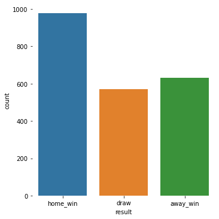
    


Clearly home wins make up the biggest portion of the match results. <br>
The number of draws and away wins are close to each other, with slightly more away wins than draws overall.


```python
summary_table = epl_matches.groupby(['season']).agg({'home_win': ['sum'], 'away_win': ['sum'], 'draw': ['sum']})
summary_table.columns = summary_table.columns.droplevel(1)

for i in range(summary_table.shape[0]):
  summary_table.iloc[i] = summary_table.iloc[i]/np.sum(summary_table.iloc[i])

summary_table.columns = ['home_win_%', 'away_win_%', "draw_%"]

summary_table
```


<div>
<style scoped>
    .dataframe tbody tr th:only-of-type {
        vertical-align: middle;
    }

    .dataframe tbody tr th {
        vertical-align: top;
    }

    .dataframe thead th {
        text-align: right;
    }
</style>
<table border="1" class="dataframe">
  <thead>
    <tr style="text-align: right;">
      <th></th>
      <th>home_win_%</th>
      <th>away_win_%</th>
      <th>draw_%</th>
    </tr>
    <tr>
      <th>season</th>
      <th></th>
      <th></th>
      <th></th>
    </tr>
  </thead>
  <tbody>
    <tr>
      <th>2010/2011</th>
      <td>0.477612</td>
      <td>0.217910</td>
      <td>0.304478</td>
    </tr>
    <tr>
      <th>2011/2012</th>
      <td>0.449591</td>
      <td>0.307902</td>
      <td>0.242507</td>
    </tr>
    <tr>
      <th>2012/2013</th>
      <td>0.436842</td>
      <td>0.278947</td>
      <td>0.284211</td>
    </tr>
    <tr>
      <th>2013/2014</th>
      <td>0.471698</td>
      <td>0.320755</td>
      <td>0.207547</td>
    </tr>
    <tr>
      <th>2014/2015</th>
      <td>0.451429</td>
      <td>0.297143</td>
      <td>0.251429</td>
    </tr>
    <tr>
      <th>2015/2016</th>
      <td>0.412234</td>
      <td>0.308511</td>
      <td>0.279255</td>
    </tr>
  </tbody>
</table>
</div>


```python
fig, ax = plt.subplots()
fig.set_size_inches(10, 5)
ax = sns.lineplot(data=summary_table)
sns.despine(fig=None, ax=None, top=True, right=True, left=True, bottom=True, offset=None, trim=False)
plt.show()
```


    
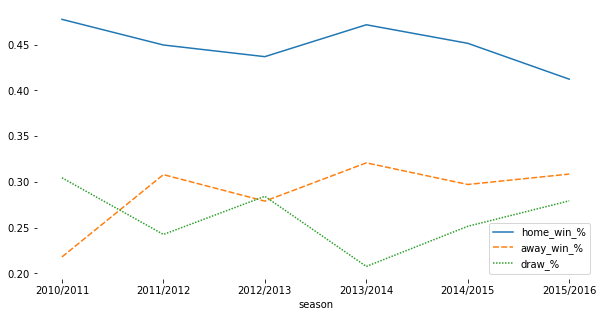
    


The home win % was consistently above the away win and draw % for the seasons in our dataset. <br>

In terms of away wins versus draws, in 4 out of 6 seasons in our data set, the away win % was higher than the draw %.


```python
 fig, ax = plt.subplots()
 fig.set_size_inches(10, 5)
 ax = sns.boxplot(data=summary_table, orient="h")
 plt.show()
```


    
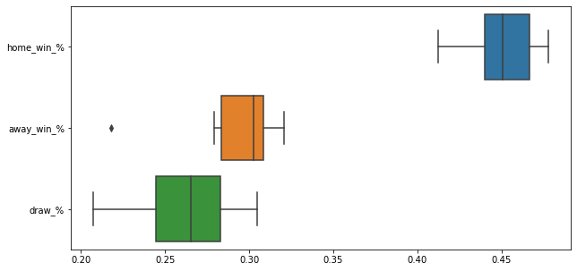
    


The above boxplots show once again, the clear difference between % of games ending in a home win and the other results.

#### Home win percentage
In the next two lines, I calculate the % of games ending in a win, as well as the 95% confidence intervall of the % of games ending in a win. <br>

Using the Central Limit Theorem, we can assume that sample means are normally distribute with large samples. This allows us to calculate the confidence interval of our sample mean with the normal distribution. As the sample is sufficiently large with over 2000 games, I use the z score from the standard normal distribution instead of the t distribution for confidence interval calculations.


```python
home_win_perc = np.sum(epl_matches['home_win'])/epl_matches.shape[0]
print('The home win % in our dataset from the 2010/2011 to the 2015/2016 season was', (home_win_perc*100).round(2),'%')
```

    The home win % in our dataset from the 2010/2011 to the 2015/2016 season was 44.93 %
    


```python
p = home_win_perc # sample proportion
n = epl_matches.shape[0] #sample size

#95% confidence interval and critical probability
confidence_level = 0.95   
alpha = 1-(confidence_level/1)
critical_probability = 1-(alpha/2)  

#z score for 95% confidence interval
z_score = norm.ppf(critical_probability, 0, 1)  

#standard error of a proportion
SE = np.sqrt(p*(1-p)/n)  

#margin in error
ME = z_score*SE  

# confidence interval 99%
lower_boundary = p-ME
upper_boundary = p+ME

print('The 95% confidence interval for our sample home win % of', (home_win_perc*100).round(2), 'is between', (lower_boundary*100).round(2), '% and', (upper_boundary*100).round(2), '%.')
```

    The 95% confidence interval for our sample home win % of 44.93 is between 42.84 % and 47.02 %.
    


```python
summary_table = epl_matches.groupby(['home_team']).agg({'home_win': ['count', 'sum']})
summary_table.columns = summary_table.columns.droplevel(1)
summary_table.columns = ['matches', 'home_wins']
summary_table['home_win_%'] = round(summary_table['home_wins']/summary_table['matches'], 2)
summary_table = summary_table.sort_values(by=['home_win_%'], ascending=False)

fig, ax = plt.subplots()
fig.set_size_inches(10, 15)
ax.set(xlim=(0, 1.1), ylabel="")
ax.set_title('Home Win % by team, Seasons 2010/11 to 2015/16')
sns.despine(fig=None, ax=None, top=True, right=True, left=True, bottom=False, offset=None, trim=False)
ax = sns.barplot(y = summary_table.index, x="home_win_%", data=summary_table, palette="Blues_r_d")

for rect in ax.patches:
  # Get X and Y placement of label from rect.
  y_value = rect.get_y() + rect.get_height() / 2
  x_value = rect.get_width()
  
  label = "{0:.1%}".format(x_value)
  
  ax.annotate(label,(x_value+0.05, y_value),ha='center',va='center')
```


    
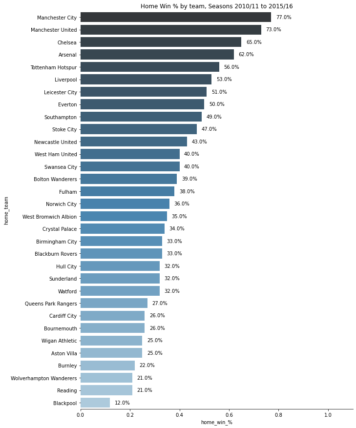
    


Based on above plot showing the home win % for all teams in our dataset, we see that Manchester City is far above average. This is not surprising considering that they won 2 league titles in the 6 seasons considered, and also finished twice as runners up. <br>

Based on above statistics, Manchester City won on average 8 out of 10 home games. <br>
For Manchester United it was 7 out of 10, followed by Chelsea and Arsenal with approx. 6 out of 10 home wins. <br>

Unfortunately, my team Liverpool was still in a slump during the first half of the 2010s, winning only 5 out of 10 home games on average.


```python
fig, ax = plt.subplots()
fig.set_size_inches(10, 5)
ax = sns.histplot(data = summary_table, x="home_win_%", bins=10)
sns.despine(fig=None, ax=None, top=True, right=True, left=True, bottom=True, offset=None, trim=False)
plt.show()
```


    

    


Based on the histogram of home win % by team, we can see that most teams are clustered around the mean of approx. 40%, however, some teams show strong home performances over the time frame, with home win % above 60%.

#### Away win percentage


```python
away_win_perc = np.sum(epl_matches['away_win'])/epl_matches.shape[0]
print('The away win % in our dataset from the 2010/2011 to the 2015/2016 season was', (away_win_perc*100).round(2),'%')
```

    The away win % in our dataset from the 2010/2011 to the 2015/2016 season was 28.96 %
    


```python
p = away_win_perc # sample proportion
n = epl_matches.shape[0] #sample size

#95% confidence interval and critical probability
confidence_level = 0.95   
alpha = 1-(confidence_level/1)
critical_probability = 1-(alpha/2)  

#z score for 95% confidence interval
z_score = norm.ppf(critical_probability, 0, 1)  

#standard error of a proportion
SE = np.sqrt(p*(1-p)/n)  

#margin in error
ME = z_score*SE  

# confidence interval 99%
lower_boundary = p-ME
upper_boundary = p+ME

print('The 95% confidence interval for our sample away win % of', (away_win_perc*100).round(2), 'is between', (lower_boundary*100).round(2), '% and', (upper_boundary*100).round(2), '%.')
```

    The 95% confidence interval for our sample away win % of 28.96 is between 27.05 % and 30.86 %.
    


```python
summary_table = epl_matches.groupby(['away_team']).agg({'away_win': ['count', 'sum']})
summary_table.columns = summary_table.columns.droplevel(1)
summary_table.columns = ['matches', 'away_wins']
summary_table['away_win_%'] = round(summary_table['away_wins']/summary_table['matches'], 2)
summary_table = summary_table.sort_values(by=['away_win_%'], ascending=False)

fig, ax = plt.subplots()
fig.set_size_inches(10, 15)
ax.set(xlim=(0, 1.1), ylabel="")
ax.set_title('Away Win % by team, Seasons 2010/11 to 2015/16')
sns.despine(fig=None, ax=None, top=True, right=True, left=True, bottom=False, offset=None, trim=False)
ax = sns.barplot(y = summary_table.index, x="away_win_%", data=summary_table, palette="Blues_r_d")

for rect in ax.patches:
  # Get X and Y placement of label from rect.
  y_value = rect.get_y() + rect.get_height() / 2
  x_value = rect.get_width()
  
  label = "{0:.1%}".format(x_value)
  
  ax.annotate(label,(x_value+0.05, y_value),ha='center',va='center')
```


    
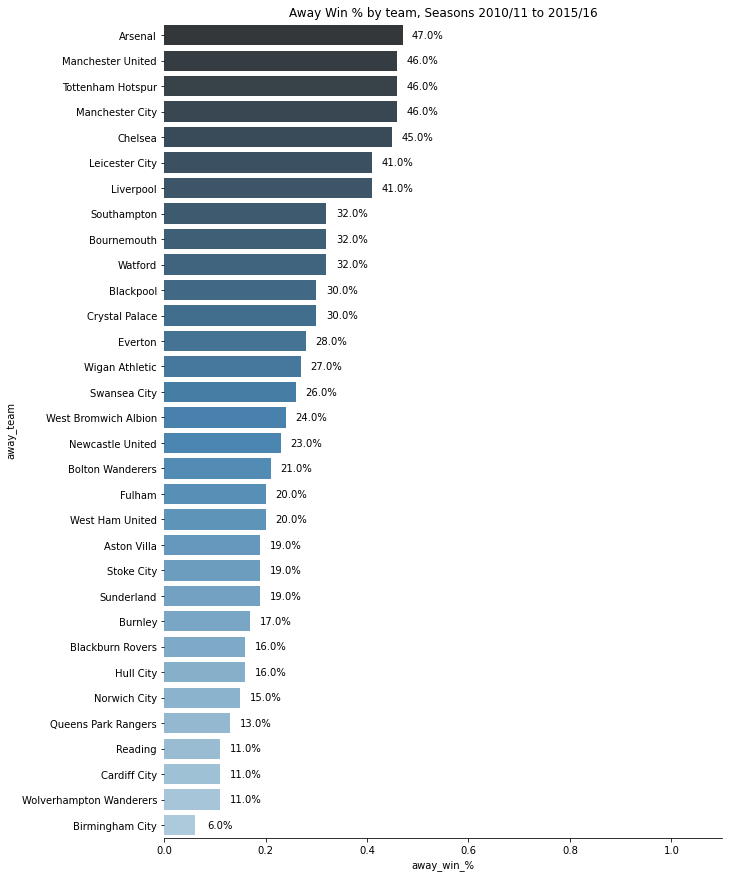
    


In terms of away win %, we see a big drop off versus home win % for the teams on average. <br>

Interestingly at the top, there is a tight range in the away win %, with a difference of only 2% from the first Arsenal with 47% to the fifth Chelsea with 45%.<br>

This indicates that titles and champions league positions were generally decided based on the home win %, as the away performance was even between the top 5.


```python
fig, ax = plt.subplots()
fig.set_size_inches(10, 5)
ax = sns.histplot(data = summary_table, x="away_win_%", bins=10, palette="Blues_d")
sns.despine(fig=None, ax=None, top=True, right=True, left=True, bottom=True, offset=None, trim=False)
plt.show()
```


    
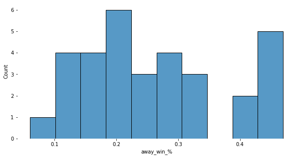
    


As with home win %, we see a clear outlier with the top teams on the right, with away win % of above 40%.

Most teams are around the 20% mark in terms of away win %.

#### Draw percentage


```python
draw_perc = np.sum(epl_matches['draw'])/epl_matches.shape[0]
print('The % of games ending in a draw in our dataset from the 2010/2011 to the 2015/2016 season was', (draw_perc*100).round(2),'%')
```

    The % of games ending in a draw in our dataset from the 2010/2011 to the 2015/2016 season was 26.11 %
    


```python
p = draw_perc # sample proportion
n = epl_matches.shape[0] #sample size

#95% confidence interval and critical probability
confidence_level = 0.95   
alpha = 1-(confidence_level/1)
critical_probability = 1-(alpha/2)  

#z score for 95% confidence interval
z_score = norm.ppf(critical_probability, 0, 1)  

#standard error of a proportion
SE = np.sqrt(p*(1-p)/n)  

#margin in error
ME = z_score*SE  

# confidence interval 99%
lower_boundary = p-ME
upper_boundary = p+ME

print('The 95% confidence interval for our sample of', (draw_perc*100).round(2), '% of games ending in a draw of is between', (lower_boundary*100).round(2), '% and', (upper_boundary*100).round(2), '%.')
```

    The 95% confidence interval for our sample of 26.11 % of games ending in a draw of is between 24.27 % and 27.96 %.
    

### Goals Scored

Goals scored will unfortunately not help us in predicting the outcome of the match, as this information will not be available at time of match prediction before the game. <br>

For reference and out of interest I have added below plots, but will continue with comments from the player section.

#### Home and away goals scored


```python
fig, (ax1, ax2) = plt.subplots(1, 2)
fig.set_size_inches(20, 5)
sns.histplot(data = epl_matches, x="home_team_goal", bins=[0, 1, 2, 3, 4, 5, 6, 7, 8, 9, 10], ax=ax1)
sns.histplot(data = epl_matches, x="away_team_goal", bins=[0, 1, 2, 3, 4, 5, 6, 7, 8, 9, 10], ax=ax2)
sns.despine(fig=None, ax=None, top=True, right=True, left=True, bottom=True, offset=None, trim=False)
```


    
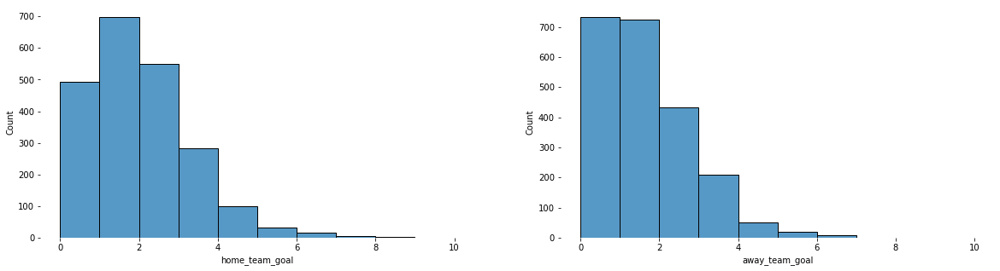
    


```python
epl_matches[['home_team_goal', 'away_team_goal']].describe()
```


<div>
<style scoped>
    .dataframe tbody tr th:only-of-type {
        vertical-align: middle;
    }

    .dataframe tbody tr th {
        vertical-align: top;
    }

    .dataframe thead th {
        text-align: right;
    }
</style>
<table border="1" class="dataframe">
  <thead>
    <tr style="text-align: right;">
      <th></th>
      <th>home_team_goal</th>
      <th>away_team_goal</th>
    </tr>
  </thead>
  <tbody>
    <tr>
      <th>count</th>
      <td>2179.000000</td>
      <td>2179.000000</td>
    </tr>
    <tr>
      <th>mean</th>
      <td>1.541074</td>
      <td>1.176687</td>
    </tr>
    <tr>
      <th>std</th>
      <td>1.296508</td>
      <td>1.150114</td>
    </tr>
    <tr>
      <th>min</th>
      <td>0.000000</td>
      <td>0.000000</td>
    </tr>
    <tr>
      <th>25%</th>
      <td>1.000000</td>
      <td>0.000000</td>
    </tr>
    <tr>
      <th>50%</th>
      <td>1.000000</td>
      <td>1.000000</td>
    </tr>
    <tr>
      <th>75%</th>
      <td>2.000000</td>
      <td>2.000000</td>
    </tr>
    <tr>
      <th>max</th>
      <td>8.000000</td>
      <td>6.000000</td>
    </tr>
  </tbody>
</table>
</div>


```python
summary_table = epl_matches.groupby(['season', 'league_name']).agg({'home_team_goal': ['count', 'sum', 'mean'], 'away_team_goal': ['sum', 'mean']})
summary_table.columns = summary_table.columns.droplevel(1)
summary_table.columns = ['matches', 'total_home_team_goals', 'mean_home_team_goals', 'total_away_team_goals', 'mean_away_team_goals']
summary_table
```


<div>
<style scoped>
    .dataframe tbody tr th:only-of-type {
        vertical-align: middle;
    }

    .dataframe tbody tr th {
        vertical-align: top;
    }

    .dataframe thead th {
        text-align: right;
    }
</style>
<table border="1" class="dataframe">
  <thead>
    <tr style="text-align: right;">
      <th></th>
      <th></th>
      <th>matches</th>
      <th>total_home_team_goals</th>
      <th>mean_home_team_goals</th>
      <th>total_away_team_goals</th>
      <th>mean_away_team_goals</th>
    </tr>
    <tr>
      <th>season</th>
      <th>league_name</th>
      <th></th>
      <th></th>
      <th></th>
      <th></th>
      <th></th>
    </tr>
  </thead>
  <tbody>
    <tr>
      <th>2010/2011</th>
      <th>England Premier League</th>
      <td>335</td>
      <td>539</td>
      <td>1.608955</td>
      <td>375</td>
      <td>1.119403</td>
    </tr>
    <tr>
      <th>2011/2012</th>
      <th>England Premier League</th>
      <td>367</td>
      <td>582</td>
      <td>1.585831</td>
      <td>450</td>
      <td>1.226158</td>
    </tr>
    <tr>
      <th>2012/2013</th>
      <th>England Premier League</th>
      <td>380</td>
      <td>592</td>
      <td>1.557895</td>
      <td>471</td>
      <td>1.239474</td>
    </tr>
    <tr>
      <th>2013/2014</th>
      <th>England Premier League</th>
      <td>371</td>
      <td>578</td>
      <td>1.557951</td>
      <td>439</td>
      <td>1.183288</td>
    </tr>
    <tr>
      <th>2014/2015</th>
      <th>England Premier League</th>
      <td>350</td>
      <td>506</td>
      <td>1.445714</td>
      <td>372</td>
      <td>1.062857</td>
    </tr>
    <tr>
      <th>2015/2016</th>
      <th>England Premier League</th>
      <td>376</td>
      <td>561</td>
      <td>1.492021</td>
      <td>457</td>
      <td>1.215426</td>
    </tr>
  </tbody>
</table>
</div>


### Players

In this section I will analyse the relationship between the player data and the match outcome. <br>

As a proxy for the match outcome, I will use the home win variable, which is one hot encoded to 1, if the home team won the match, and 0 if the match ended in a draw or the away team won.

For all correlation coefficient calculations, I use the pandas [pandas.DataFrame.corr](
https://pandas.pydata.org/pandas-docs/stable/reference/api/pandas.DataFrame.corr.html) function. <br>

This returns by default the Pearson correlation for two continuous variables, and the Point-biserial correlation for a continuous with a one hot encoded variable, which is [mathematically equivalent](https://en.wikipedia.org/wiki/Point-biserial_correlation_coefficient) to the Pearson correlation.

#### Home team starting elevel overall player ratings


```python
home_players = ['home_player_1',	'home_player_2',	'home_player_3',	'home_player_4',	'home_player_5',	'home_player_6',
                   'home_player_7',	'home_player_8',	'home_player_9',	'home_player_10',	'home_player_11']
z = 'overall_rating_'
column_list = []
for player in home_players:
  column_name = z+player
  column_list.append(column_name)
column_list
column_list.append('home_win')

#get correlation matrix
corr = epl_matches[column_list].corr()
mask = np.triu(np.ones_like(corr, dtype=bool))         # Generate a mask for the upper triangle
fig, ax = plt.subplots()
fig.set_size_inches(10, 10)
cmap = sns.diverging_palette(10, 130, s=100, n=5)
# Draw the heatmap with the mask and correct aspect ratio
sns.heatmap(corr, mask=mask, cmap=cmap, vmax=.3, center=0, square=True, linewidths=.5, cbar_kws={"shrink": .5}, annot=True)
```


    <AxesSubplot:>


    
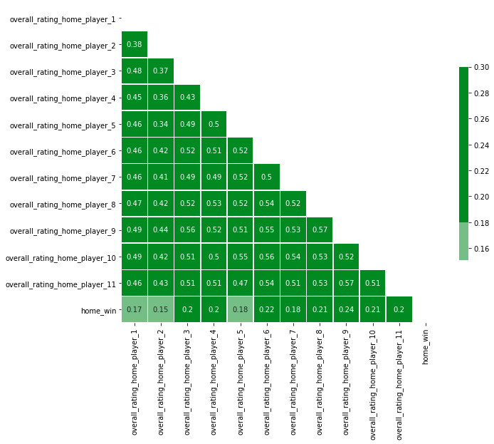
    


Based on the correlation coefficients of the overall eleven home player ratings with the home win variable, referring to the last row in the correlation matrix, we see that all eleven are positive, indicating the possibility that higher home player ratings lead to a higher chance of a home win. <br>

This indicates that the player ratings could possibly be useful in predicting the chance of a home win. <br>

Interestingly the correlation matrix also shows a high correlation of overall home player ratings with other home player ratings. This indicates that in general, players with higher ratings play in the same team, as do players with lower ratings play in the same team.

#### Away team starting elevel overall player ratings


```python
away_players = ['away_player_1',	'away_player_2',	'away_player_3',	'away_player_4',	'away_player_5',	'away_player_6',
                   'away_player_7',	'away_player_8',	'away_player_9',	'away_player_10',	'away_player_11']
z = 'overall_rating_'
column_list = []
for player in away_players:
  column_name = z+player
  column_list.append(column_name)
column_list
column_list.append('home_win')

corr = epl_matches[column_list].corr()
mask = np.triu(np.ones_like(corr, dtype=bool))         # Generate a mask for the upper triangle
fig, ax = plt.subplots()
fig.set_size_inches(10, 10)
cmap = sns.diverging_palette(10, 130, s=100, n=5)
# Draw the heatmap with the mask and correct aspect ratio
sns.heatmap(corr, mask=mask, cmap=cmap, vmax=.3, center=0, square=True, linewidths=.5, cbar_kws={"shrink": .5}, annot=True)
```


    <AxesSubplot:>


    
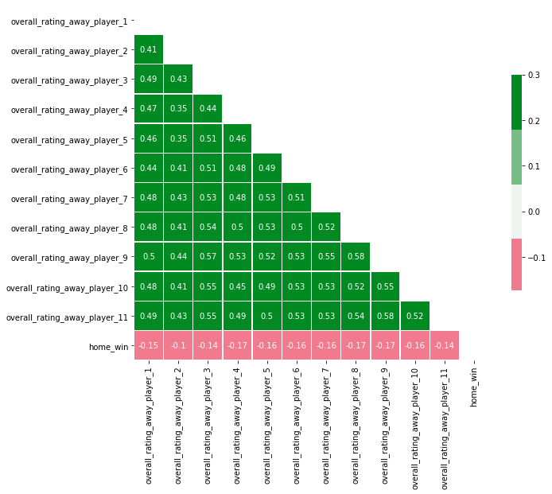
    


Based on the correlation coefficients of the overall eleven away player ratings with the home win variable, referring to the last row in the correlation matrix, we see that all eleven are negative, indicating the possibility that higher away player ratings lead to a lower chance of a home win. <br>

This indicates that the player ratings could possibly be useful in predicting the chance of a home win. <br>

Interestingly the correlation matrix also shows a high correlation of overall away player ratings with other away player ratings. This indicates that in general, players with higher ratings play in the same team, as do players with lower ratings play in the same team.

#### Home team starting eleven detailed player attributes
The following code shows separate correlation matrices of the detailed player attributes and the home win variable, for all eleven home players. I will comment on the overall conclusion after the last correlation matrix.


```python
home_player_1_columns = list(epl_matches.columns[50:88])
home_player_1_columns.append('home_win')

#get correlation matrix
corr = epl_matches[home_player_1_columns].corr()
mask = np.triu(np.ones_like(corr, dtype=bool))         # Generate a mask for the upper triangle
fig, ax = plt.subplots()
fig.set_size_inches(10, 10)
cmap = sns.diverging_palette(10, 130, s=100, n=5)
# Draw the heatmap with the mask and correct aspect ratio
sns.heatmap(corr, mask=mask, cmap=cmap, vmax=.3, center=0, square=True, linewidths=.5, cbar_kws={"shrink": .5}, annot=False)
```


    <AxesSubplot:>


    
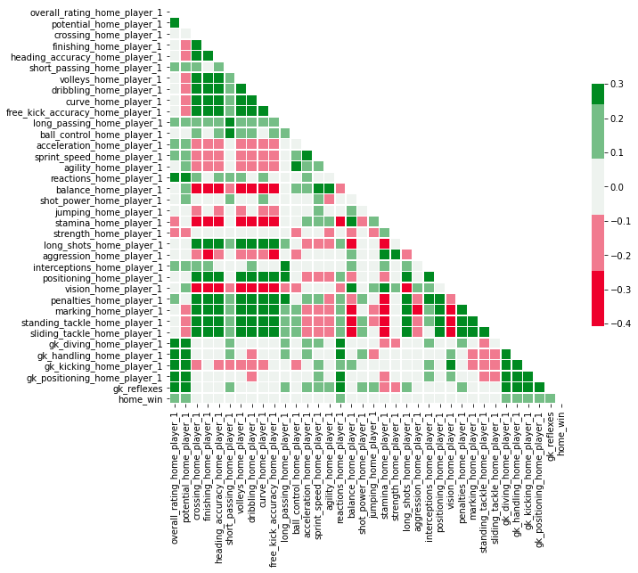
    


```python
home_player_2_columns = list(epl_matches.columns[88:126])
home_player_2_columns.append('home_win')

#get correlation matrix
corr = epl_matches[home_player_2_columns].corr()
mask = np.triu(np.ones_like(corr, dtype=bool))         # Generate a mask for the upper triangle
fig, ax = plt.subplots()
fig.set_size_inches(10, 10)
cmap = sns.diverging_palette(10, 130, s=100, n=5)
# Draw the heatmap with the mask and correct aspect ratio
sns.heatmap(corr, mask=mask, cmap=cmap, vmax=.3, center=0, square=True, linewidths=.5, cbar_kws={"shrink": .5}, annot=False)
```


    <AxesSubplot:>


    
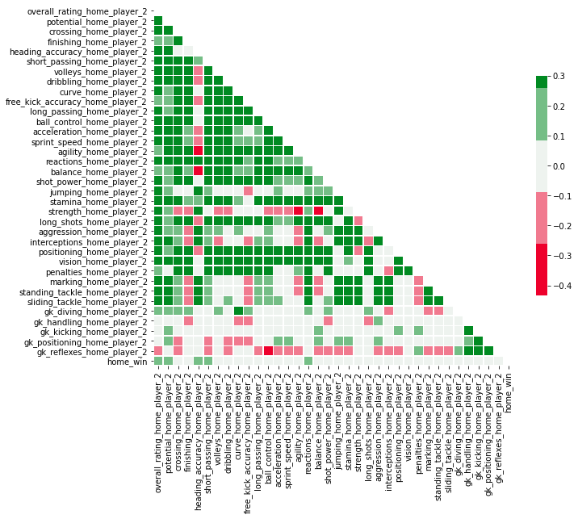
    


```python
home_player_3_columns = list(epl_matches.columns[126:164])
home_player_3_columns.append('home_win')

#get correlation matrix
corr = epl_matches[home_player_3_columns].corr()
mask = np.triu(np.ones_like(corr, dtype=bool))         # Generate a mask for the upper triangle
fig, ax = plt.subplots()
fig.set_size_inches(10, 10)
cmap = sns.diverging_palette(10, 130, s=100, n=5)
# Draw the heatmap with the mask and correct aspect ratio
sns.heatmap(corr, mask=mask, cmap=cmap, vmax=.3, center=0, square=True, linewidths=.5, cbar_kws={"shrink": .5}, annot=False)
```


    <AxesSubplot:>


    
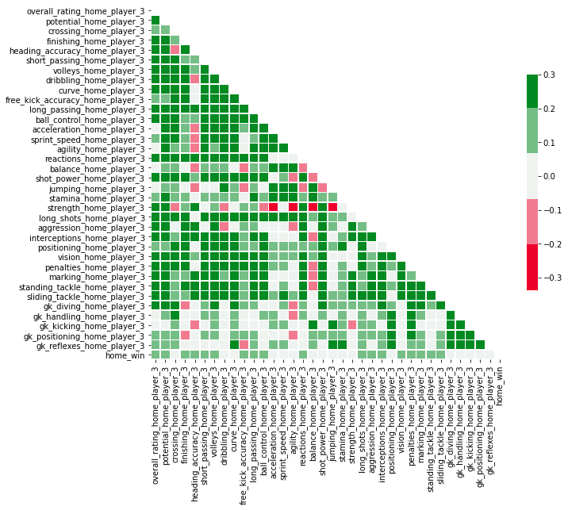
    


```python
home_player_4_columns = list(epl_matches.columns[164:202])
home_player_4_columns.append('home_win')

#get correlation matrix
corr = epl_matches[home_player_4_columns].corr()
mask = np.triu(np.ones_like(corr, dtype=bool))         # Generate a mask for the upper triangle
fig, ax = plt.subplots()
fig.set_size_inches(10, 10)
cmap = sns.diverging_palette(10, 130, s=100, n=5)
# Draw the heatmap with the mask and correct aspect ratio
sns.heatmap(corr, mask=mask, cmap=cmap, vmax=.3, center=0, square=True, linewidths=.5, cbar_kws={"shrink": .5}, annot=False)
```


    <AxesSubplot:>


    
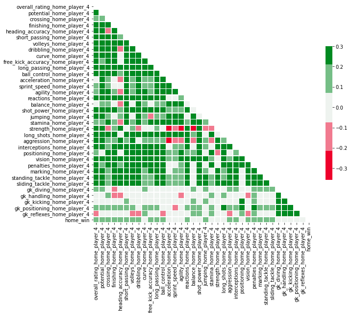
    


```python
home_player_5_columns = list(epl_matches.columns[202:240])
home_player_5_columns.append('home_win')

#get correlation matrix
corr = epl_matches[home_player_5_columns].corr()
mask = np.triu(np.ones_like(corr, dtype=bool))         # Generate a mask for the upper triangle
fig, ax = plt.subplots()
fig.set_size_inches(10, 10)
cmap = sns.diverging_palette(10, 130, s=100, n=5)
# Draw the heatmap with the mask and correct aspect ratio
sns.heatmap(corr, mask=mask, cmap=cmap, vmax=.3, center=0, square=True, linewidths=.5, cbar_kws={"shrink": .5}, annot=False)
```


    <AxesSubplot:>


    
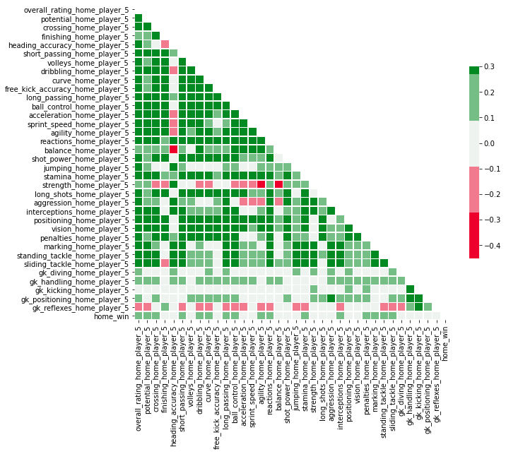
    


```python
home_player_6_columns = list(epl_matches.columns[240:278])
home_player_6_columns.append('home_win')

#get correlation matrix
corr = epl_matches[home_player_6_columns].corr()
mask = np.triu(np.ones_like(corr, dtype=bool))         # Generate a mask for the upper triangle
fig, ax = plt.subplots()
fig.set_size_inches(10, 10)
cmap = sns.diverging_palette(10, 130, s=100, n=5)
# Draw the heatmap with the mask and correct aspect ratio
sns.heatmap(corr, mask=mask, cmap=cmap, vmax=.3, center=0, square=True, linewidths=.5, cbar_kws={"shrink": .5}, annot=False)
```


    <AxesSubplot:>


    
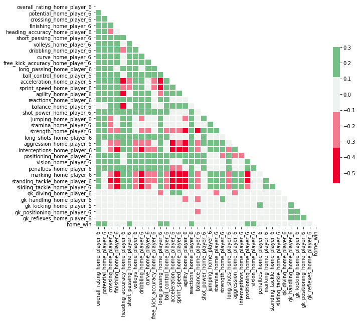
    


```python
home_player_7_columns = list(epl_matches.columns[278:316])
home_player_7_columns.append('home_win')

#get correlation matrix
corr = epl_matches[home_player_7_columns].corr()
mask = np.triu(np.ones_like(corr, dtype=bool))         # Generate a mask for the upper triangle
fig, ax = plt.subplots()
fig.set_size_inches(10, 10)
cmap = sns.diverging_palette(10, 130, s=100, n=5)
# Draw the heatmap with the mask and correct aspect ratio
sns.heatmap(corr, mask=mask, cmap=cmap, vmax=.3, center=0, square=True, linewidths=.5, cbar_kws={"shrink": .5}, annot=False)
```


    <AxesSubplot:>


    
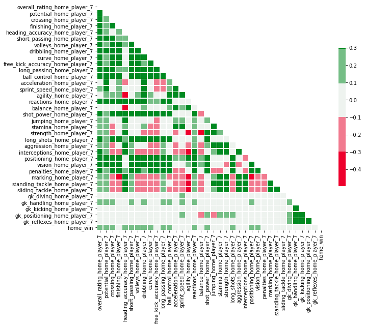
    


```python
home_player_8_columns = list(epl_matches.columns[316:354])
home_player_8_columns.append('home_win')

#get correlation matrix
corr = epl_matches[home_player_8_columns].corr()
mask = np.triu(np.ones_like(corr, dtype=bool))         # Generate a mask for the upper triangle
fig, ax = plt.subplots()
fig.set_size_inches(10, 10)
cmap = sns.diverging_palette(10, 130, s=100, n=5)
# Draw the heatmap with the mask and correct aspect ratio
sns.heatmap(corr, mask=mask, cmap=cmap, vmax=.3, center=0, square=True, linewidths=.5, cbar_kws={"shrink": .5}, annot=False)
```


    <AxesSubplot:>


    
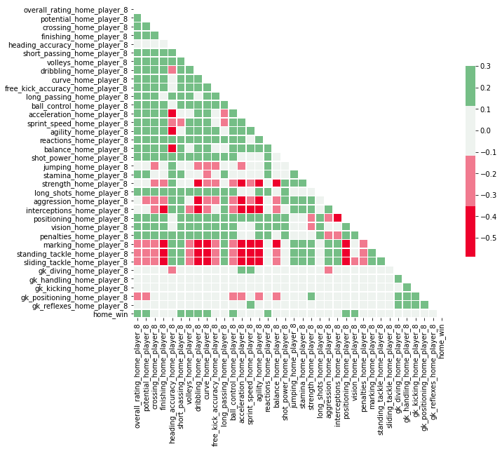
    


```python
home_player_9_columns = list(epl_matches.columns[354:392])
home_player_9_columns.append('home_win')

#get correlation matrix
corr = epl_matches[home_player_9_columns].corr()
mask = np.triu(np.ones_like(corr, dtype=bool))         # Generate a mask for the upper triangle
fig, ax = plt.subplots()
fig.set_size_inches(10, 10)
cmap = sns.diverging_palette(10, 130, s=100, n=5)
# Draw the heatmap with the mask and correct aspect ratio
sns.heatmap(corr, mask=mask, cmap=cmap, vmax=.3, center=0, square=True, linewidths=.5, cbar_kws={"shrink": .5}, annot=False)
```


    <AxesSubplot:>


    
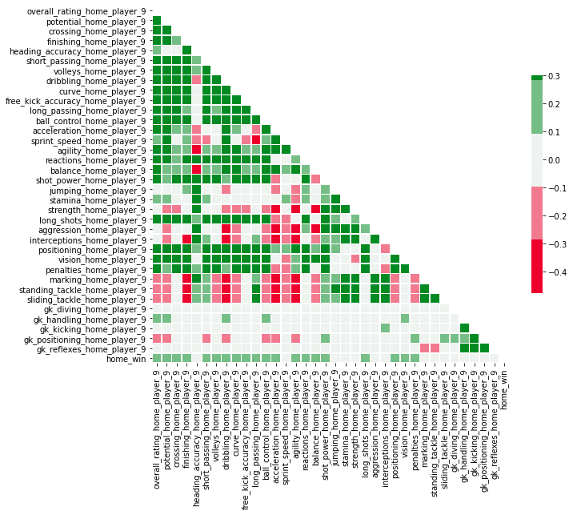
    


```python
home_player_10_columns = list(epl_matches.columns[392:430])
home_player_10_columns.append('home_win')

#get correlation matrix
corr = epl_matches[home_player_10_columns].corr()
mask = np.triu(np.ones_like(corr, dtype=bool))         # Generate a mask for the upper triangle
fig, ax = plt.subplots()
fig.set_size_inches(10, 10)
cmap = sns.diverging_palette(10, 130, s=100, n=5)
# Draw the heatmap with the mask and correct aspect ratio
sns.heatmap(corr, mask=mask, cmap=cmap, vmax=.3, center=0, square=True, linewidths=.5, cbar_kws={"shrink": .5}, annot=False)
```


    <AxesSubplot:>


    
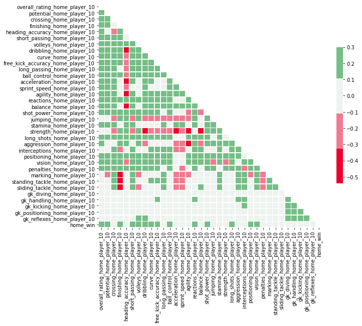
    


```python
home_player_11_columns = list(epl_matches.columns[430:468])
home_player_11_columns.append('home_win')

#get correlation matrix
corr = epl_matches[home_player_11_columns].corr()
mask = np.triu(np.ones_like(corr, dtype=bool))         # Generate a mask for the upper triangle
fig, ax = plt.subplots()
fig.set_size_inches(10, 10)
cmap = sns.diverging_palette(10, 130, s=100, n=5)
# Draw the heatmap with the mask and correct aspect ratio
sns.heatmap(corr, mask=mask, cmap=cmap, vmax=.3, center=0, square=True, linewidths=.5, cbar_kws={"shrink": .5}, annot=False)
```


    <AxesSubplot:>


    
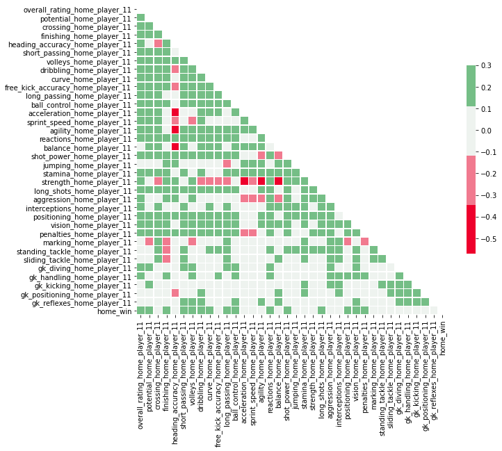
    


Based on the correlation coefficients for all eleven home player attributes with the home win variable, referring to the last row in the correlation matrix, we see that the correlation coefficients are either slightly positive or close to 0. Interestingly, depending on the position of the player, different attributes seem to correlate higher.

Player 1 is clearly the goalkeeper, as here goalkeeping attributes correlate higher with the home win variable, indicating that a stronger goalkeeper could lead to more home wins. <br>

For player 3 and 4, tackling and marking attributes correlate higher with the home win variable, indicating that these players are defenders, and stronger defensive attributes could lead to more home wins.

For players 6, 7, 8, 9, a mixture of vision, passing and dribbling attributes correlate higher with home wins, indicating that these are midfield players.

Players 9, 10, 11 seems to be the main goal scorers, as here the finishing ability correlates higher with the home win variable.

#### Away team starting eleven detailed player attributes
The following code shows separate correlation matrices of the detailed player attributes and the home win variable, for all eleven away players. As with the home players, I will comment on the overall conclusion after the last correlation matrix.


```python
away_player_1_columns = list(epl_matches.columns[468:506])
away_player_1_columns.append('home_win')

#get correlation matrix
corr = epl_matches[away_player_1_columns].corr()
mask = np.triu(np.ones_like(corr, dtype=bool))         # Generate a mask for the upper triangle
fig, ax = plt.subplots()
fig.set_size_inches(10, 10)
cmap = sns.diverging_palette(10, 130, s=100, n=5)
# Draw the heatmap with the mask and correct aspect ratio
sns.heatmap(corr, mask=mask, cmap=cmap, vmax=.3, center=0, square=True, linewidths=.5, cbar_kws={"shrink": .5}, annot=False)
```


    <AxesSubplot:>


    
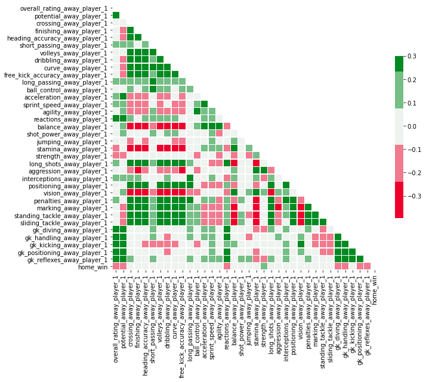
    


```python
away_player_2_columns = list(epl_matches.columns[506:544])
away_player_2_columns.append('home_win')

#get correlation matrix
corr = epl_matches[away_player_2_columns].corr()
mask = np.triu(np.ones_like(corr, dtype=bool))         # Generate a mask for the upper triangle
fig, ax = plt.subplots()
fig.set_size_inches(10, 10)
cmap = sns.diverging_palette(10, 130, s=100, n=5)
# Draw the heatmap with the mask and correct aspect ratio
sns.heatmap(corr, mask=mask, cmap=cmap, vmax=.3, center=0, square=True, linewidths=.5, cbar_kws={"shrink": .5}, annot=False)
```


    <AxesSubplot:>


    

    


```python
away_player_3_columns = list(epl_matches.columns[544:582])
away_player_3_columns.append('home_win')

#get correlation matrix
corr = epl_matches[away_player_3_columns].corr()
mask = np.triu(np.ones_like(corr, dtype=bool))         # Generate a mask for the upper triangle
fig, ax = plt.subplots()
fig.set_size_inches(10, 10)
cmap = sns.diverging_palette(10, 130, s=100, n=5)
# Draw the heatmap with the mask and correct aspect ratio
sns.heatmap(corr, mask=mask, cmap=cmap, vmax=.3, center=0, square=True, linewidths=.5, cbar_kws={"shrink": .5}, annot=False)
```


    <AxesSubplot:>


    

    


```python
away_player_4_columns = list(epl_matches.columns[582:620])
away_player_4_columns.append('home_win')

#get correlation matrix
corr = epl_matches[away_player_4_columns].corr()
mask = np.triu(np.ones_like(corr, dtype=bool))         # Generate a mask for the upper triangle
fig, ax = plt.subplots()
fig.set_size_inches(10, 10)
cmap = sns.diverging_palette(10, 130, s=100, n=5)
# Draw the heatmap with the mask and correct aspect ratio
sns.heatmap(corr, mask=mask, cmap=cmap, vmax=.3, center=0, square=True, linewidths=.5, cbar_kws={"shrink": .5}, annot=False)
```


    <AxesSubplot:>


    
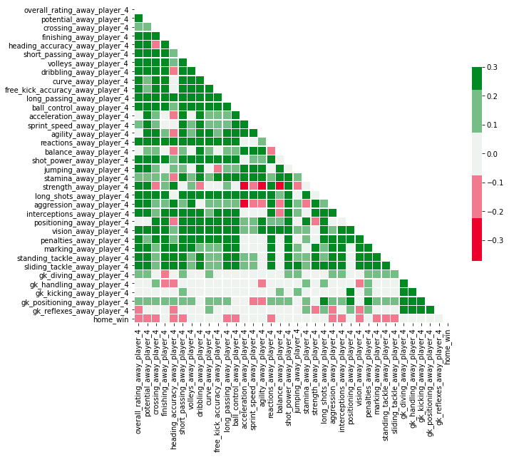
    


```python
away_player_5_columns = list(epl_matches.columns[620:658])
away_player_5_columns.append('home_win')

#get correlation matrix
corr = epl_matches[away_player_5_columns].corr()
mask = np.triu(np.ones_like(corr, dtype=bool))         # Generate a mask for the upper triangle
fig, ax = plt.subplots()
fig.set_size_inches(10, 10)
cmap = sns.diverging_palette(10, 130, s=100, n=5)
# Draw the heatmap with the mask and correct aspect ratio
sns.heatmap(corr, mask=mask, cmap=cmap, vmax=.3, center=0, square=True, linewidths=.5, cbar_kws={"shrink": .5}, annot=False)
```


    <AxesSubplot:>


    

    


```python
away_player_6_columns = list(epl_matches.columns[658:696])
away_player_6_columns.append('home_win')

#get correlation matrix
corr = epl_matches[away_player_6_columns].corr()
mask = np.triu(np.ones_like(corr, dtype=bool))         # Generate a mask for the upper triangle
fig, ax = plt.subplots()
fig.set_size_inches(10, 10)
cmap = sns.diverging_palette(10, 130, s=100, n=5)
# Draw the heatmap with the mask and correct aspect ratio
sns.heatmap(corr, mask=mask, cmap=cmap, vmax=.3, center=0, square=True, linewidths=.5, cbar_kws={"shrink": .5}, annot=False)
```


    <AxesSubplot:>


    
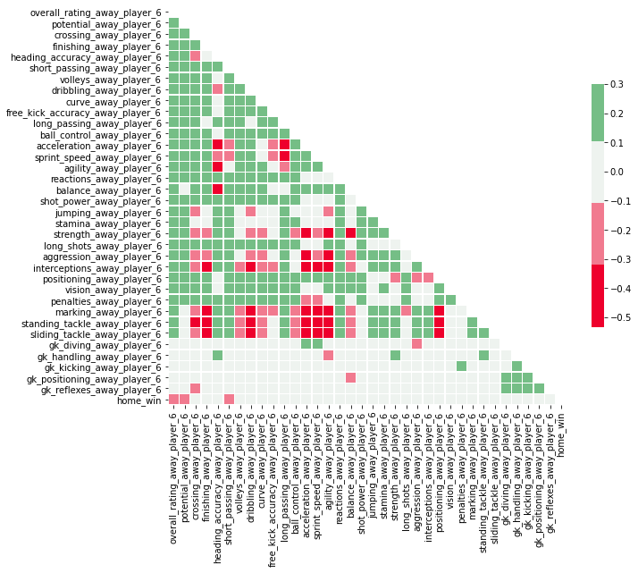
    


```python
away_player_7_columns = list(epl_matches.columns[696:734])
away_player_7_columns.append('home_win')

#get correlation matrix
corr = epl_matches[away_player_7_columns].corr()
mask = np.triu(np.ones_like(corr, dtype=bool))         # Generate a mask for the upper triangle
fig, ax = plt.subplots()
fig.set_size_inches(10, 10)
cmap = sns.diverging_palette(10, 130, s=100, n=5)
# Draw the heatmap with the mask and correct aspect ratio
sns.heatmap(corr, mask=mask, cmap=cmap, vmax=.3, center=0, square=True, linewidths=.5, cbar_kws={"shrink": .5}, annot=False)
```


    <AxesSubplot:>


    
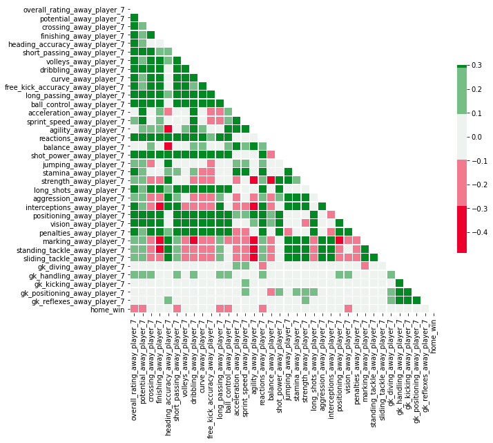
    


```python
away_player_8_columns = list(epl_matches.columns[734:772])
away_player_8_columns.append('home_win')

#get correlation matrix
corr = epl_matches[away_player_8_columns].corr()
mask = np.triu(np.ones_like(corr, dtype=bool))         # Generate a mask for the upper triangle
fig, ax = plt.subplots()
fig.set_size_inches(10, 10)
cmap = sns.diverging_palette(10, 130, s=100, n=5)
# Draw the heatmap with the mask and correct aspect ratio
sns.heatmap(corr, mask=mask, cmap=cmap, vmax=.3, center=0, square=True, linewidths=.5, cbar_kws={"shrink": .5}, annot=False)
```


    <AxesSubplot:>


    
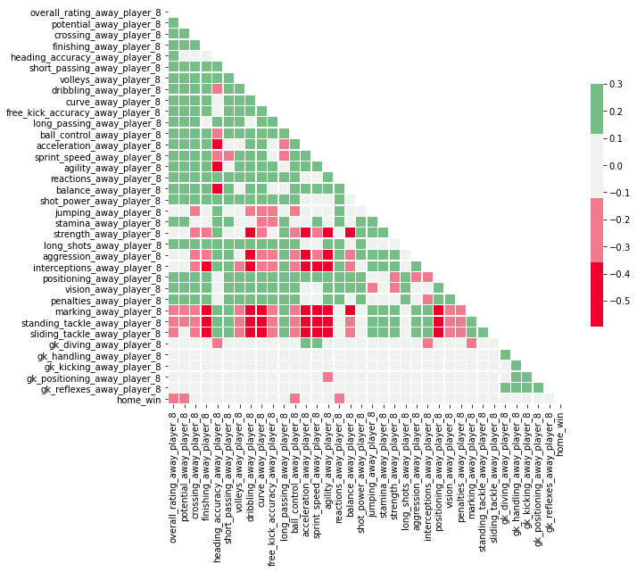
    


```python
away_player_9_columns = list(epl_matches.columns[772:810])
away_player_9_columns.append('home_win')

#get correlation matrix
corr = epl_matches[away_player_9_columns].corr()
mask = np.triu(np.ones_like(corr, dtype=bool))         # Generate a mask for the upper triangle
fig, ax = plt.subplots()
fig.set_size_inches(10, 10)
cmap = sns.diverging_palette(10, 130, s=100, n=5)
# Draw the heatmap with the mask and correct aspect ratio
sns.heatmap(corr, mask=mask, cmap=cmap, vmax=.3, center=0, square=True, linewidths=.5, cbar_kws={"shrink": .5}, annot=False)
```


    <AxesSubplot:>


    
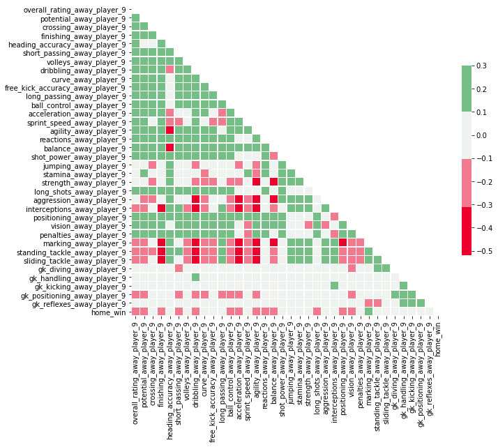
    


```python
away_player_10_columns = list(epl_matches.columns[810:848])
away_player_10_columns.append('home_win')

#get correlation matrix
corr = epl_matches[away_player_10_columns].corr()
mask = np.triu(np.ones_like(corr, dtype=bool))         # Generate a mask for the upper triangle
fig, ax = plt.subplots()
fig.set_size_inches(10, 10)
cmap = sns.diverging_palette(10, 130, s=100, n=5)
# Draw the heatmap with the mask and correct aspect ratio
sns.heatmap(corr, mask=mask, cmap=cmap, vmax=.3, center=0, square=True, linewidths=.5, cbar_kws={"shrink": .5}, annot=False)
```


    <AxesSubplot:>


    
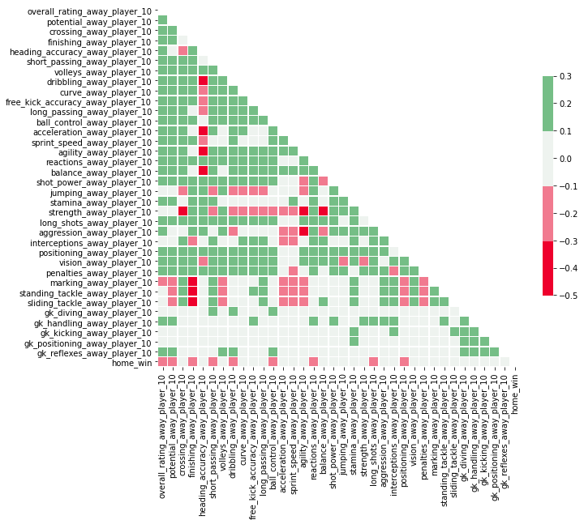
    


```python
away_player_11_columns = list(epl_matches.columns[848:886])
away_player_11_columns.append('home_win')

#get correlation matrix
corr = epl_matches[away_player_11_columns].corr()
mask = np.triu(np.ones_like(corr, dtype=bool))         # Generate a mask for the upper triangle
fig, ax = plt.subplots()
fig.set_size_inches(10, 10)
cmap = sns.diverging_palette(10, 130, s=100, n=5)
# Draw the heatmap with the mask and correct aspect ratio
sns.heatmap(corr, mask=mask, cmap=cmap, vmax=.3, center=0, square=True, linewidths=.5, cbar_kws={"shrink": .5}, annot=False)
```


    <AxesSubplot:>


    
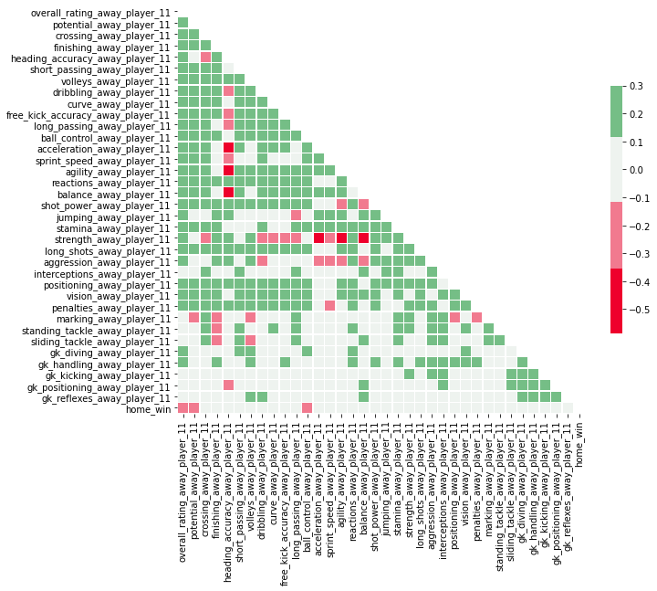
    


As we would expect, we see the opposite picture for the away player attribute correlations with the home win variable.

Based on the correlation coefficients for all eleven away player attributes with the home win variable, referring to the last row in the correlation matrix, we see that the correlation coefficients are either slightly negative or close to 0. As with the home player attributes, depending on the position of the player, different attributes seem to correlate more negative.

Player 1 is clearly the goalkeeper, as here goalkeeping attributes correlate more negative with the home win variable, indicating that a stronger away goalkeeper could lead to less home wins.<br>

For player 3 and 4, tackling and marking attributes correlate more negative with the home win variable, indicating that these players are defenders, and stronger defensive attributes for away players could lead to less home wins.

For players 6, 7, 8, 9, a mixture of vision, passing and dribbling attributes correlate more negative with home wins, indicating that these are midfield players.

Players 9, 10, seem to be the main goal scorers, as here the finishing ability correlates more negative with the home win variable.

### Teams

In the next section I look at the correlation of team attributes with the home win variable. As noted during the data processing part, the very infrequent updates of the team attributes could make them less useful as predictive features. <br>

Also, to note is that unlike for players, there is no overall rating variable, but only team attributes.

#### Home team attributes


```python
home_team_attributes = list(epl_matches.columns[10:30])
home_team_attributes.append('home_win')
epl_matches[home_team_attributes].corr()

corr = epl_matches[home_team_attributes].corr()
mask = np.triu(np.ones_like(corr, dtype=bool))         # Generate a mask for the upper triangle
fig, ax = plt.subplots()
fig.set_size_inches(10, 10)
cmap = sns.diverging_palette(10, 130, s=100, n=5)
# Draw the heatmap with the mask and correct aspect ratio
sns.heatmap(corr, mask=mask, cmap=cmap, vmax=.3, center=0, square=True, linewidths=.5, cbar_kws={"shrink": .5}, annot=True)
```


    <AxesSubplot:>


    
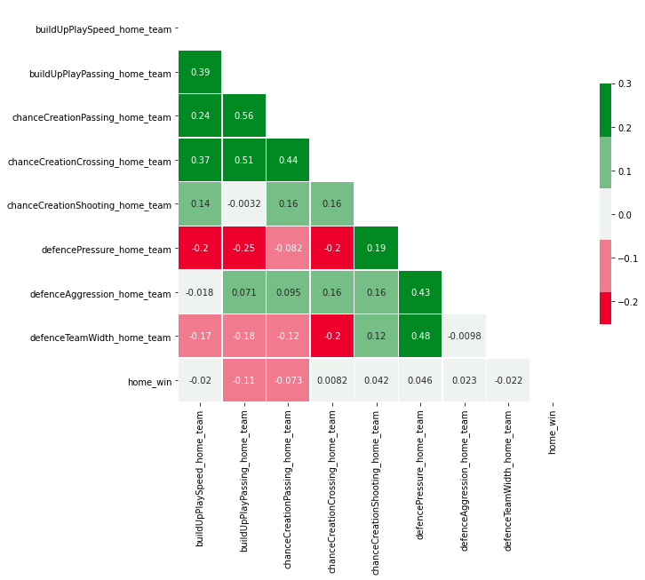
    


Unfortunately, the home team features seem to not correlate at all with the home win variable. There are even some small negative correlations, indicating stronger home team attributes could lead to fewer home wins.

As noted, this contradiction could be due to the issue that the data was not updated very frequently and is therefore not useful for prediction compared to player data, which was updated very frequently.

#### Away team attributes


```python
home_team_attributes = list(epl_matches.columns[30:50])
home_team_attributes.append('home_win')
epl_matches[home_team_attributes].corr()

corr = epl_matches[home_team_attributes].corr()
mask = np.triu(np.ones_like(corr, dtype=bool))         # Generate a mask for the upper triangle
fig, ax = plt.subplots()
fig.set_size_inches(10, 10)
cmap = sns.diverging_palette(10, 130, s=100, n=5)
# Draw the heatmap with the mask and correct aspect ratio
sns.heatmap(corr, mask=mask, cmap=cmap, vmax=.3, center=0, square=True, linewidths=.5, cbar_kws={"shrink": .5}, annot=True)
```


    <AxesSubplot:>


    
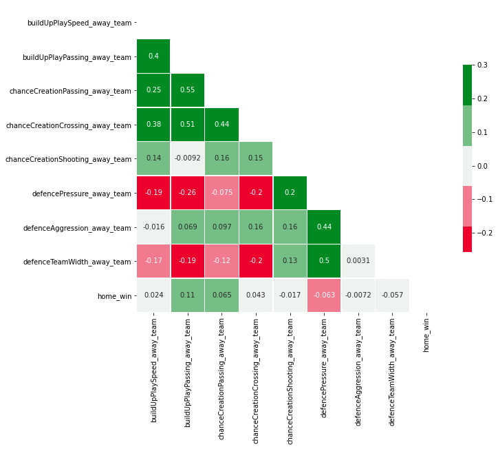
    


Unfortunately, the away team features show the same situation as the home team features.
The away team features seem to not correlate at all with the home win variable. There are even some small positive correlations, indicating stronger away team attributes could lead to more home wins.

As noted, this contradiction could be due to the issue that the data was not updated very frequently, and is therefore not useful for prediction compared to player data, which was updated very frequently.

### Conclusion from Exploratory Data Analysis

Based on the analysis of player and team data, the player data clearly shows the correlations one would expect.
Stronger home team players correlate positively with the home win variable, whereas stronger away team players correlate negatively with the home win variable. Depending on the position of the players, different variables correlate stronger with the home win variable. <br>
Based on above I conclude that we should keep the player data as the correlations indicate they could be useful for predicting the match result.
Some player attributes may be less useful than others, based on the position of the player. To reduce the feature dimension later, I will therefore use Principal Component Analysis, to reduce the feature space but keeping most of the information in the data. <br>

Unfortunately, as feared due to the very infrequent updates, the team attribute data seems to not be especially useful for predicting the match results. Considering the non-existing correlations with the home win variable and our already high feature dimension space, I will remove all team attribute variables from the data set before training machine learning algorithms.

The following code drops all team attribute variables. <br>

In addition, I will also drop all result columns except the home win column. This will be used as a proxy to try to predict the result, in this case a home win.


```python
#remove team colums
team_attribute_columns = list(epl_matches.columns[10:50])
data = epl_matches.drop(labels = team_attribute_columns, axis=1)
data.head(5)
```


<div>
<style scoped>
    .dataframe tbody tr th:only-of-type {
        vertical-align: middle;
    }

    .dataframe tbody tr th {
        vertical-align: top;
    }

    .dataframe thead th {
        text-align: right;
    }
</style>
<table border="1" class="dataframe">
  <thead>
    <tr style="text-align: right;">
      <th></th>
      <th>season</th>
      <th>match_day</th>
      <th>match_date</th>
      <th>country_name</th>
      <th>league_name</th>
      <th>home_team</th>
      <th>away_team</th>
      <th>home_team_goal</th>
      <th>away_team_goal</th>
      <th>match_api_id</th>
      <th>overall_rating_home_player_1</th>
      <th>potential_home_player_1</th>
      <th>preferred_foot_home_player_1</th>
      <th>attacking_work_rate_home_player_1</th>
      <th>defensive_work_rate_home_player_1</th>
      <th>crossing_home_player_1</th>
      <th>finishing_home_player_1</th>
      <th>heading_accuracy_home_player_1</th>
      <th>short_passing_home_player_1</th>
      <th>volleys_home_player_1</th>
      <th>dribbling_home_player_1</th>
      <th>curve_home_player_1</th>
      <th>free_kick_accuracy_home_player_1</th>
      <th>long_passing_home_player_1</th>
      <th>ball_control_home_player_1</th>
      <th>acceleration_home_player_1</th>
      <th>sprint_speed_home_player_1</th>
      <th>agility_home_player_1</th>
      <th>reactions_home_player_1</th>
      <th>balance_home_player_1</th>
      <th>shot_power_home_player_1</th>
      <th>jumping_home_player_1</th>
      <th>stamina_home_player_1</th>
      <th>strength_home_player_1</th>
      <th>long_shots_home_player_1</th>
      <th>aggression_home_player_1</th>
      <th>interceptions_home_player_1</th>
      <th>positioning_home_player_1</th>
      <th>vision_home_player_1</th>
      <th>penalties_home_player_1</th>
      <th>marking_home_player_1</th>
      <th>standing_tackle_home_player_1</th>
      <th>sliding_tackle_home_player_1</th>
      <th>gk_diving_home_player_1</th>
      <th>gk_handling_home_player_1</th>
      <th>gk_kicking_home_player_1</th>
      <th>gk_positioning_home_player_1</th>
      <th>gk_reflexes</th>
      <th>overall_rating_home_player_2</th>
      <th>potential_home_player_2</th>
      <th>preferred_foot_home_player_2</th>
      <th>attacking_work_rate_home_player_2</th>
      <th>defensive_work_rate_home_player_2</th>
      <th>crossing_home_player_2</th>
      <th>finishing_home_player_2</th>
      <th>heading_accuracy_home_player_2</th>
      <th>short_passing_home_player_2</th>
      <th>volleys_home_player_2</th>
      <th>dribbling_home_player_2</th>
      <th>curve_home_player_2</th>
      <th>free_kick_accuracy_home_player_2</th>
      <th>long_passing_home_player_2</th>
      <th>ball_control_home_player_2</th>
      <th>acceleration_home_player_2</th>
      <th>sprint_speed_home_player_2</th>
      <th>agility_home_player_2</th>
      <th>reactions_home_player_2</th>
      <th>balance_home_player_2</th>
      <th>shot_power_home_player_2</th>
      <th>jumping_home_player_2</th>
      <th>stamina_home_player_2</th>
      <th>strength_home_player_2</th>
      <th>long_shots_home_player_2</th>
      <th>aggression_home_player_2</th>
      <th>interceptions_home_player_2</th>
      <th>positioning_home_player_2</th>
      <th>vision_home_player_2</th>
      <th>penalties_home_player_2</th>
      <th>marking_home_player_2</th>
      <th>standing_tackle_home_player_2</th>
      <th>sliding_tackle_home_player_2</th>
      <th>gk_diving_home_player_2</th>
      <th>gk_handling_home_player_2</th>
      <th>gk_kicking_home_player_2</th>
      <th>gk_positioning_home_player_2</th>
      <th>gk_reflexes_home_player_2</th>
      <th>overall_rating_home_player_3</th>
      <th>potential_home_player_3</th>
      <th>preferred_foot_home_player_3</th>
      <th>attacking_work_rate_home_player_3</th>
      <th>defensive_work_rate_home_player_3</th>
      <th>crossing_home_player_3</th>
      <th>finishing_home_player_3</th>
      <th>heading_accuracy_home_player_3</th>
      <th>short_passing_home_player_3</th>
      <th>volleys_home_player_3</th>
      <th>dribbling_home_player_3</th>
      <th>curve_home_player_3</th>
      <th>free_kick_accuracy_home_player_3</th>
      <th>long_passing_home_player_3</th>
      <th>ball_control_home_player_3</th>
      <th>acceleration_home_player_3</th>
      <th>sprint_speed_home_player_3</th>
      <th>agility_home_player_3</th>
      <th>reactions_home_player_3</th>
      <th>balance_home_player_3</th>
      <th>shot_power_home_player_3</th>
      <th>jumping_home_player_3</th>
      <th>stamina_home_player_3</th>
      <th>strength_home_player_3</th>
      <th>long_shots_home_player_3</th>
      <th>aggression_home_player_3</th>
      <th>interceptions_home_player_3</th>
      <th>positioning_home_player_3</th>
      <th>vision_home_player_3</th>
      <th>penalties_home_player_3</th>
      <th>marking_home_player_3</th>
      <th>standing_tackle_home_player_3</th>
      <th>sliding_tackle_home_player_3</th>
      <th>gk_diving_home_player_3</th>
      <th>gk_handling_home_player_3</th>
      <th>gk_kicking_home_player_3</th>
      <th>gk_positioning_home_player_3</th>
      <th>gk_reflexes_home_player_3</th>
      <th>overall_rating_home_player_4</th>
      <th>potential_home_player_4</th>
      <th>preferred_foot_home_player_4</th>
      <th>attacking_work_rate_home_player_4</th>
      <th>defensive_work_rate_home_player_4</th>
      <th>crossing_home_player_4</th>
      <th>finishing_home_player_4</th>
      <th>heading_accuracy_home_player_4</th>
      <th>short_passing_home_player_4</th>
      <th>volleys_home_player_4</th>
      <th>dribbling_home_player_4</th>
      <th>curve_home_player_4</th>
      <th>free_kick_accuracy_home_player_4</th>
      <th>long_passing_home_player_4</th>
      <th>ball_control_home_player_4</th>
      <th>acceleration_home_player_4</th>
      <th>sprint_speed_home_player_4</th>
      <th>agility_home_player_4</th>
      <th>reactions_home_player_4</th>
      <th>balance_home_player_4</th>
      <th>shot_power_home_player_4</th>
      <th>jumping_home_player_4</th>
      <th>stamina_home_player_4</th>
      <th>strength_home_player_4</th>
      <th>long_shots_home_player_4</th>
      <th>aggression_home_player_4</th>
      <th>interceptions_home_player_4</th>
      <th>positioning_home_player_4</th>
      <th>vision_home_player_4</th>
      <th>penalties_home_player_4</th>
      <th>marking_home_player_4</th>
      <th>standing_tackle_home_player_4</th>
      <th>sliding_tackle_home_player_4</th>
      <th>gk_diving_home_player_4</th>
      <th>gk_handling_home_player_4</th>
      <th>gk_kicking_home_player_4</th>
      <th>gk_positioning_home_player_4</th>
      <th>gk_reflexes_home_player_4</th>
      <th>overall_rating_home_player_5</th>
      <th>potential_home_player_5</th>
      <th>preferred_foot_home_player_5</th>
      <th>attacking_work_rate_home_player_5</th>
      <th>defensive_work_rate_home_player_5</th>
      <th>crossing_home_player_5</th>
      <th>finishing_home_player_5</th>
      <th>heading_accuracy_home_player_5</th>
      <th>short_passing_home_player_5</th>
      <th>volleys_home_player_5</th>
      <th>dribbling_home_player_5</th>
      <th>curve_home_player_5</th>
      <th>free_kick_accuracy_home_player_5</th>
      <th>long_passing_home_player_5</th>
      <th>ball_control_home_player_5</th>
      <th>acceleration_home_player_5</th>
      <th>sprint_speed_home_player_5</th>
      <th>agility_home_player_5</th>
      <th>reactions_home_player_5</th>
      <th>balance_home_player_5</th>
      <th>shot_power_home_player_5</th>
      <th>jumping_home_player_5</th>
      <th>stamina_home_player_5</th>
      <th>strength_home_player_5</th>
      <th>long_shots_home_player_5</th>
      <th>aggression_home_player_5</th>
      <th>interceptions_home_player_5</th>
      <th>positioning_home_player_5</th>
      <th>vision_home_player_5</th>
      <th>penalties_home_player_5</th>
      <th>marking_home_player_5</th>
      <th>standing_tackle_home_player_5</th>
      <th>sliding_tackle_home_player_5</th>
      <th>gk_diving_home_player_5</th>
      <th>gk_handling_home_player_5</th>
      <th>gk_kicking_home_player_5</th>
      <th>gk_positioning_home_player_5</th>
      <th>gk_reflexes_home_player_5</th>
      <th>overall_rating_home_player_6</th>
      <th>potential_home_player_6</th>
      <th>preferred_foot_home_player_6</th>
      <th>attacking_work_rate_home_player_6</th>
      <th>defensive_work_rate_home_player_6</th>
      <th>crossing_home_player_6</th>
      <th>finishing_home_player_6</th>
      <th>heading_accuracy_home_player_6</th>
      <th>short_passing_home_player_6</th>
      <th>volleys_home_player_6</th>
      <th>dribbling_home_player_6</th>
      <th>curve_home_player_6</th>
      <th>free_kick_accuracy_home_player_6</th>
      <th>long_passing_home_player_6</th>
      <th>ball_control_home_player_6</th>
      <th>acceleration_home_player_6</th>
      <th>sprint_speed_home_player_6</th>
      <th>agility_home_player_6</th>
      <th>reactions_home_player_6</th>
      <th>balance_home_player_6</th>
      <th>shot_power_home_player_6</th>
      <th>jumping_home_player_6</th>
      <th>stamina_home_player_6</th>
      <th>strength_home_player_6</th>
      <th>long_shots_home_player_6</th>
      <th>aggression_home_player_6</th>
      <th>interceptions_home_player_6</th>
      <th>positioning_home_player_6</th>
      <th>vision_home_player_6</th>
      <th>penalties_home_player_6</th>
      <th>marking_home_player_6</th>
      <th>standing_tackle_home_player_6</th>
      <th>sliding_tackle_home_player_6</th>
      <th>gk_diving_home_player_6</th>
      <th>gk_handling_home_player_6</th>
      <th>gk_kicking_home_player_6</th>
      <th>gk_positioning_home_player_6</th>
      <th>gk_reflexes_home_player_6</th>
      <th>overall_rating_home_player_7</th>
      <th>potential_home_player_7</th>
      <th>preferred_foot_home_player_7</th>
      <th>attacking_work_rate_home_player_7</th>
      <th>defensive_work_rate_home_player_7</th>
      <th>crossing_home_player_7</th>
      <th>finishing_home_player_7</th>
      <th>heading_accuracy_home_player_7</th>
      <th>short_passing_home_player_7</th>
      <th>volleys_home_player_7</th>
      <th>dribbling_home_player_7</th>
      <th>curve_home_player_7</th>
      <th>free_kick_accuracy_home_player_7</th>
      <th>long_passing_home_player_7</th>
      <th>ball_control_home_player_7</th>
      <th>acceleration_home_player_7</th>
      <th>sprint_speed_home_player_7</th>
      <th>agility_home_player_7</th>
      <th>reactions_home_player_7</th>
      <th>balance_home_player_7</th>
      <th>shot_power_home_player_7</th>
      <th>jumping_home_player_7</th>
      <th>stamina_home_player_7</th>
      <th>strength_home_player_7</th>
      <th>long_shots_home_player_7</th>
      <th>aggression_home_player_7</th>
      <th>interceptions_home_player_7</th>
      <th>positioning_home_player_7</th>
      <th>vision_home_player_7</th>
      <th>penalties_home_player_7</th>
      <th>marking_home_player_7</th>
      <th>standing_tackle_home_player_7</th>
      <th>sliding_tackle_home_player_7</th>
      <th>gk_diving_home_player_7</th>
      <th>gk_handling_home_player_7</th>
      <th>gk_kicking_home_player_7</th>
      <th>gk_positioning_home_player_7</th>
      <th>gk_reflexes_home_player_7</th>
      <th>overall_rating_home_player_8</th>
      <th>potential_home_player_8</th>
      <th>preferred_foot_home_player_8</th>
      <th>attacking_work_rate_home_player_8</th>
      <th>defensive_work_rate_home_player_8</th>
      <th>crossing_home_player_8</th>
      <th>finishing_home_player_8</th>
      <th>heading_accuracy_home_player_8</th>
      <th>short_passing_home_player_8</th>
      <th>volleys_home_player_8</th>
      <th>dribbling_home_player_8</th>
      <th>curve_home_player_8</th>
      <th>free_kick_accuracy_home_player_8</th>
      <th>long_passing_home_player_8</th>
      <th>ball_control_home_player_8</th>
      <th>acceleration_home_player_8</th>
      <th>sprint_speed_home_player_8</th>
      <th>agility_home_player_8</th>
      <th>reactions_home_player_8</th>
      <th>balance_home_player_8</th>
      <th>shot_power_home_player_8</th>
      <th>jumping_home_player_8</th>
      <th>stamina_home_player_8</th>
      <th>strength_home_player_8</th>
      <th>long_shots_home_player_8</th>
      <th>aggression_home_player_8</th>
      <th>interceptions_home_player_8</th>
      <th>positioning_home_player_8</th>
      <th>vision_home_player_8</th>
      <th>penalties_home_player_8</th>
      <th>marking_home_player_8</th>
      <th>standing_tackle_home_player_8</th>
      <th>sliding_tackle_home_player_8</th>
      <th>gk_diving_home_player_8</th>
      <th>gk_handling_home_player_8</th>
      <th>gk_kicking_home_player_8</th>
      <th>gk_positioning_home_player_8</th>
      <th>gk_reflexes_home_player_8</th>
      <th>overall_rating_home_player_9</th>
      <th>potential_home_player_9</th>
      <th>preferred_foot_home_player_9</th>
      <th>attacking_work_rate_home_player_9</th>
      <th>defensive_work_rate_home_player_9</th>
      <th>crossing_home_player_9</th>
      <th>finishing_home_player_9</th>
      <th>heading_accuracy_home_player_9</th>
      <th>short_passing_home_player_9</th>
      <th>volleys_home_player_9</th>
      <th>dribbling_home_player_9</th>
      <th>curve_home_player_9</th>
      <th>free_kick_accuracy_home_player_9</th>
      <th>long_passing_home_player_9</th>
      <th>ball_control_home_player_9</th>
      <th>acceleration_home_player_9</th>
      <th>sprint_speed_home_player_9</th>
      <th>agility_home_player_9</th>
      <th>reactions_home_player_9</th>
      <th>balance_home_player_9</th>
      <th>shot_power_home_player_9</th>
      <th>jumping_home_player_9</th>
      <th>stamina_home_player_9</th>
      <th>strength_home_player_9</th>
      <th>long_shots_home_player_9</th>
      <th>aggression_home_player_9</th>
      <th>interceptions_home_player_9</th>
      <th>positioning_home_player_9</th>
      <th>vision_home_player_9</th>
      <th>penalties_home_player_9</th>
      <th>marking_home_player_9</th>
      <th>standing_tackle_home_player_9</th>
      <th>sliding_tackle_home_player_9</th>
      <th>gk_diving_home_player_9</th>
      <th>gk_handling_home_player_9</th>
      <th>gk_kicking_home_player_9</th>
      <th>gk_positioning_home_player_9</th>
      <th>gk_reflexes_home_player_9</th>
      <th>overall_rating_home_player_10</th>
      <th>potential_home_player_10</th>
      <th>preferred_foot_home_player_10</th>
      <th>attacking_work_rate_home_player_10</th>
      <th>defensive_work_rate_home_player_10</th>
      <th>crossing_home_player_10</th>
      <th>finishing_home_player_10</th>
      <th>heading_accuracy_home_player_10</th>
      <th>short_passing_home_player_10</th>
      <th>volleys_home_player_10</th>
      <th>dribbling_home_player_10</th>
      <th>curve_home_player_10</th>
      <th>free_kick_accuracy_home_player_10</th>
      <th>long_passing_home_player_10</th>
      <th>ball_control_home_player_10</th>
      <th>acceleration_home_player_10</th>
      <th>sprint_speed_home_player_10</th>
      <th>agility_home_player_10</th>
      <th>reactions_home_player_10</th>
      <th>balance_home_player_10</th>
      <th>shot_power_home_player_10</th>
      <th>jumping_home_player_10</th>
      <th>stamina_home_player_10</th>
      <th>strength_home_player_10</th>
      <th>long_shots_home_player_10</th>
      <th>aggression_home_player_10</th>
      <th>interceptions_home_player_10</th>
      <th>positioning_home_player_10</th>
      <th>vision_home_player_10</th>
      <th>penalties_home_player_10</th>
      <th>marking_home_player_10</th>
      <th>standing_tackle_home_player_10</th>
      <th>sliding_tackle_home_player_10</th>
      <th>gk_diving_home_player_10</th>
      <th>gk_handling_home_player_10</th>
      <th>gk_kicking_home_player_10</th>
      <th>gk_positioning_home_player_10</th>
      <th>gk_reflexes_home_player_10</th>
      <th>overall_rating_home_player_11</th>
      <th>potential_home_player_11</th>
      <th>preferred_foot_home_player_11</th>
      <th>attacking_work_rate_home_player_11</th>
      <th>defensive_work_rate_home_player_11</th>
      <th>crossing_home_player_11</th>
      <th>finishing_home_player_11</th>
      <th>heading_accuracy_home_player_11</th>
      <th>short_passing_home_player_11</th>
      <th>volleys_home_player_11</th>
      <th>dribbling_home_player_11</th>
      <th>curve_home_player_11</th>
      <th>free_kick_accuracy_home_player_11</th>
      <th>long_passing_home_player_11</th>
      <th>ball_control_home_player_11</th>
      <th>acceleration_home_player_11</th>
      <th>sprint_speed_home_player_11</th>
      <th>agility_home_player_11</th>
      <th>reactions_home_player_11</th>
      <th>balance_home_player_11</th>
      <th>shot_power_home_player_11</th>
      <th>jumping_home_player_11</th>
      <th>stamina_home_player_11</th>
      <th>strength_home_player_11</th>
      <th>long_shots_home_player_11</th>
      <th>aggression_home_player_11</th>
      <th>interceptions_home_player_11</th>
      <th>positioning_home_player_11</th>
      <th>vision_home_player_11</th>
      <th>penalties_home_player_11</th>
      <th>marking_home_player_11</th>
      <th>standing_tackle_home_player_11</th>
      <th>sliding_tackle_home_player_11</th>
      <th>gk_diving_home_player_11</th>
      <th>gk_handling_home_player_11</th>
      <th>gk_kicking_home_player_11</th>
      <th>gk_positioning_home_player_11</th>
      <th>gk_reflexes_home_player_11</th>
      <th>overall_rating_away_player_1</th>
      <th>potential_away_player_1</th>
      <th>preferred_foot_away_player_1</th>
      <th>attacking_work_rate_away_player_1</th>
      <th>defensive_work_rate_away_player_1</th>
      <th>crossing_away_player_1</th>
      <th>finishing_away_player_1</th>
      <th>heading_accuracy_away_player_1</th>
      <th>short_passing_away_player_1</th>
      <th>volleys_away_player_1</th>
      <th>dribbling_away_player_1</th>
      <th>curve_away_player_1</th>
      <th>free_kick_accuracy_away_player_1</th>
      <th>long_passing_away_player_1</th>
      <th>ball_control_away_player_1</th>
      <th>acceleration_away_player_1</th>
      <th>sprint_speed_away_player_1</th>
      <th>agility_away_player_1</th>
      <th>reactions_away_player_1</th>
      <th>balance_away_player_1</th>
      <th>shot_power_away_player_1</th>
      <th>jumping_away_player_1</th>
      <th>stamina_away_player_1</th>
      <th>strength_away_player_1</th>
      <th>long_shots_away_player_1</th>
      <th>aggression_away_player_1</th>
      <th>interceptions_away_player_1</th>
      <th>positioning_away_player_1</th>
      <th>vision_away_player_1</th>
      <th>penalties_away_player_1</th>
      <th>marking_away_player_1</th>
      <th>standing_tackle_away_player_1</th>
      <th>sliding_tackle_away_player_1</th>
      <th>gk_diving_away_player_1</th>
      <th>gk_handling_away_player_1</th>
      <th>gk_kicking_away_player_1</th>
      <th>gk_positioning_away_player_1</th>
      <th>gk_reflexes_away_player_1</th>
      <th>overall_rating_away_player_2</th>
      <th>potential_away_player_2</th>
      <th>preferred_foot_away_player_2</th>
      <th>attacking_work_rate_away_player_2</th>
      <th>defensive_work_rate_away_player_2</th>
      <th>crossing_away_player_2</th>
      <th>finishing_away_player_2</th>
      <th>heading_accuracy_away_player_2</th>
      <th>short_passing_away_player_2</th>
      <th>volleys_away_player_2</th>
      <th>dribbling_away_player_2</th>
      <th>curve_away_player_2</th>
      <th>free_kick_accuracy_away_player_2</th>
      <th>long_passing_away_player_2</th>
      <th>ball_control_away_player_2</th>
      <th>acceleration_away_player_2</th>
      <th>sprint_speed_away_player_2</th>
      <th>agility_away_player_2</th>
      <th>reactions_away_player_2</th>
      <th>balance_away_player_2</th>
      <th>shot_power_away_player_2</th>
      <th>jumping_away_player_2</th>
      <th>stamina_away_player_2</th>
      <th>strength_away_player_2</th>
      <th>long_shots_away_player_2</th>
      <th>aggression_away_player_2</th>
      <th>interceptions_away_player_2</th>
      <th>positioning_away_player_2</th>
      <th>vision_away_player_2</th>
      <th>penalties_away_player_2</th>
      <th>marking_away_player_2</th>
      <th>standing_tackle_away_player_2</th>
      <th>sliding_tackle_away_player_2</th>
      <th>gk_diving_away_player_2</th>
      <th>gk_handling_away_player_2</th>
      <th>gk_kicking_away_player_2</th>
      <th>gk_positioning_away_player_2</th>
      <th>gk_reflexes_away_player_2</th>
      <th>overall_rating_away_player_3</th>
      <th>potential_away_player_3</th>
      <th>preferred_foot_away_player_3</th>
      <th>attacking_work_rate_away_player_3</th>
      <th>defensive_work_rate_away_player_3</th>
      <th>crossing_away_player_3</th>
      <th>finishing_away_player_3</th>
      <th>heading_accuracy_away_player_3</th>
      <th>short_passing_away_player_3</th>
      <th>volleys_away_player_3</th>
      <th>dribbling_away_player_3</th>
      <th>curve_away_player_3</th>
      <th>free_kick_accuracy_away_player_3</th>
      <th>long_passing_away_player_3</th>
      <th>ball_control_away_player_3</th>
      <th>acceleration_away_player_3</th>
      <th>sprint_speed_away_player_3</th>
      <th>agility_away_player_3</th>
      <th>reactions_away_player_3</th>
      <th>balance_away_player_3</th>
      <th>shot_power_away_player_3</th>
      <th>jumping_away_player_3</th>
      <th>stamina_away_player_3</th>
      <th>strength_away_player_3</th>
      <th>long_shots_away_player_3</th>
      <th>aggression_away_player_3</th>
      <th>interceptions_away_player_3</th>
      <th>positioning_away_player_3</th>
      <th>vision_away_player_3</th>
      <th>penalties_away_player_3</th>
      <th>marking_away_player_3</th>
      <th>standing_tackle_away_player_3</th>
      <th>sliding_tackle_away_player_3</th>
      <th>gk_diving_away_player_3</th>
      <th>gk_handling_away_player_3</th>
      <th>gk_kicking_away_player_3</th>
      <th>gk_positioning_away_player_3</th>
      <th>gk_reflexes_away_player_3</th>
      <th>overall_rating_away_player_4</th>
      <th>potential_away_player_4</th>
      <th>preferred_foot_away_player_4</th>
      <th>attacking_work_rate_away_player_4</th>
      <th>defensive_work_rate_away_player_4</th>
      <th>crossing_away_player_4</th>
      <th>finishing_away_player_4</th>
      <th>heading_accuracy_away_player_4</th>
      <th>short_passing_away_player_4</th>
      <th>volleys_away_player_4</th>
      <th>dribbling_away_player_4</th>
      <th>curve_away_player_4</th>
      <th>free_kick_accuracy_away_player_4</th>
      <th>long_passing_away_player_4</th>
      <th>ball_control_away_player_4</th>
      <th>acceleration_away_player_4</th>
      <th>sprint_speed_away_player_4</th>
      <th>agility_away_player_4</th>
      <th>reactions_away_player_4</th>
      <th>balance_away_player_4</th>
      <th>shot_power_away_player_4</th>
      <th>jumping_away_player_4</th>
      <th>stamina_away_player_4</th>
      <th>strength_away_player_4</th>
      <th>long_shots_away_player_4</th>
      <th>aggression_away_player_4</th>
      <th>interceptions_away_player_4</th>
      <th>positioning_away_player_4</th>
      <th>vision_away_player_4</th>
      <th>penalties_away_player_4</th>
      <th>marking_away_player_4</th>
      <th>standing_tackle_away_player_4</th>
      <th>sliding_tackle_away_player_4</th>
      <th>gk_diving_away_player_4</th>
      <th>gk_handling_away_player_4</th>
      <th>gk_kicking_away_player_4</th>
      <th>gk_positioning_away_player_4</th>
      <th>gk_reflexes_away_player_4</th>
      <th>overall_rating_away_player_5</th>
      <th>potential_away_player_5</th>
      <th>preferred_foot_away_player_5</th>
      <th>attacking_work_rate_away_player_5</th>
      <th>defensive_work_rate_away_player_5</th>
      <th>crossing_away_player_5</th>
      <th>finishing_away_player_5</th>
      <th>heading_accuracy_away_player_5</th>
      <th>short_passing_away_player_5</th>
      <th>volleys_away_player_5</th>
      <th>dribbling_away_player_5</th>
      <th>curve_away_player_5</th>
      <th>free_kick_accuracy_away_player_5</th>
      <th>long_passing_away_player_5</th>
      <th>ball_control_away_player_5</th>
      <th>acceleration_away_player_5</th>
      <th>sprint_speed_away_player_5</th>
      <th>agility_away_player_5</th>
      <th>reactions_away_player_5</th>
      <th>balance_away_player_5</th>
      <th>shot_power_away_player_5</th>
      <th>jumping_away_player_5</th>
      <th>stamina_away_player_5</th>
      <th>strength_away_player_5</th>
      <th>long_shots_away_player_5</th>
      <th>aggression_away_player_5</th>
      <th>interceptions_away_player_5</th>
      <th>positioning_away_player_5</th>
      <th>vision_away_player_5</th>
      <th>penalties_away_player_5</th>
      <th>marking_away_player_5</th>
      <th>standing_tackle_away_player_5</th>
      <th>sliding_tackle_away_player_5</th>
      <th>gk_diving_away_player_5</th>
      <th>gk_handling_away_player_5</th>
      <th>gk_kicking_away_player_5</th>
      <th>gk_positioning_away_player_5</th>
      <th>gk_reflexes_away_player_5</th>
      <th>overall_rating_away_player_6</th>
      <th>potential_away_player_6</th>
      <th>preferred_foot_away_player_6</th>
      <th>attacking_work_rate_away_player_6</th>
      <th>defensive_work_rate_away_player_6</th>
      <th>crossing_away_player_6</th>
      <th>finishing_away_player_6</th>
      <th>heading_accuracy_away_player_6</th>
      <th>short_passing_away_player_6</th>
      <th>volleys_away_player_6</th>
      <th>dribbling_away_player_6</th>
      <th>curve_away_player_6</th>
      <th>free_kick_accuracy_away_player_6</th>
      <th>long_passing_away_player_6</th>
      <th>ball_control_away_player_6</th>
      <th>acceleration_away_player_6</th>
      <th>sprint_speed_away_player_6</th>
      <th>agility_away_player_6</th>
      <th>reactions_away_player_6</th>
      <th>balance_away_player_6</th>
      <th>shot_power_away_player_6</th>
      <th>jumping_away_player_6</th>
      <th>stamina_away_player_6</th>
      <th>strength_away_player_6</th>
      <th>long_shots_away_player_6</th>
      <th>aggression_away_player_6</th>
      <th>interceptions_away_player_6</th>
      <th>positioning_away_player_6</th>
      <th>vision_away_player_6</th>
      <th>penalties_away_player_6</th>
      <th>marking_away_player_6</th>
      <th>standing_tackle_away_player_6</th>
      <th>sliding_tackle_away_player_6</th>
      <th>gk_diving_away_player_6</th>
      <th>gk_handling_away_player_6</th>
      <th>gk_kicking_away_player_6</th>
      <th>gk_positioning_away_player_6</th>
      <th>gk_reflexes_away_player_6</th>
      <th>overall_rating_away_player_7</th>
      <th>potential_away_player_7</th>
      <th>preferred_foot_away_player_7</th>
      <th>attacking_work_rate_away_player_7</th>
      <th>defensive_work_rate_away_player_7</th>
      <th>crossing_away_player_7</th>
      <th>finishing_away_player_7</th>
      <th>heading_accuracy_away_player_7</th>
      <th>short_passing_away_player_7</th>
      <th>volleys_away_player_7</th>
      <th>dribbling_away_player_7</th>
      <th>curve_away_player_7</th>
      <th>free_kick_accuracy_away_player_7</th>
      <th>long_passing_away_player_7</th>
      <th>ball_control_away_player_7</th>
      <th>acceleration_away_player_7</th>
      <th>sprint_speed_away_player_7</th>
      <th>agility_away_player_7</th>
      <th>reactions_away_player_7</th>
      <th>balance_away_player_7</th>
      <th>shot_power_away_player_7</th>
      <th>jumping_away_player_7</th>
      <th>stamina_away_player_7</th>
      <th>strength_away_player_7</th>
      <th>long_shots_away_player_7</th>
      <th>aggression_away_player_7</th>
      <th>interceptions_away_player_7</th>
      <th>positioning_away_player_7</th>
      <th>vision_away_player_7</th>
      <th>penalties_away_player_7</th>
      <th>marking_away_player_7</th>
      <th>standing_tackle_away_player_7</th>
      <th>sliding_tackle_away_player_7</th>
      <th>gk_diving_away_player_7</th>
      <th>gk_handling_away_player_7</th>
      <th>gk_kicking_away_player_7</th>
      <th>gk_positioning_away_player_7</th>
      <th>gk_reflexes_away_player_7</th>
      <th>overall_rating_away_player_8</th>
      <th>potential_away_player_8</th>
      <th>preferred_foot_away_player_8</th>
      <th>attacking_work_rate_away_player_8</th>
      <th>defensive_work_rate_away_player_8</th>
      <th>crossing_away_player_8</th>
      <th>finishing_away_player_8</th>
      <th>heading_accuracy_away_player_8</th>
      <th>short_passing_away_player_8</th>
      <th>volleys_away_player_8</th>
      <th>dribbling_away_player_8</th>
      <th>curve_away_player_8</th>
      <th>free_kick_accuracy_away_player_8</th>
      <th>long_passing_away_player_8</th>
      <th>ball_control_away_player_8</th>
      <th>acceleration_away_player_8</th>
      <th>sprint_speed_away_player_8</th>
      <th>agility_away_player_8</th>
      <th>reactions_away_player_8</th>
      <th>balance_away_player_8</th>
      <th>shot_power_away_player_8</th>
      <th>jumping_away_player_8</th>
      <th>stamina_away_player_8</th>
      <th>strength_away_player_8</th>
      <th>long_shots_away_player_8</th>
      <th>aggression_away_player_8</th>
      <th>interceptions_away_player_8</th>
      <th>positioning_away_player_8</th>
      <th>vision_away_player_8</th>
      <th>penalties_away_player_8</th>
      <th>marking_away_player_8</th>
      <th>standing_tackle_away_player_8</th>
      <th>sliding_tackle_away_player_8</th>
      <th>gk_diving_away_player_8</th>
      <th>gk_handling_away_player_8</th>
      <th>gk_kicking_away_player_8</th>
      <th>gk_positioning_away_player_8</th>
      <th>gk_reflexes_away_player_8</th>
      <th>overall_rating_away_player_9</th>
      <th>potential_away_player_9</th>
      <th>preferred_foot_away_player_9</th>
      <th>attacking_work_rate_away_player_9</th>
      <th>defensive_work_rate_away_player_9</th>
      <th>crossing_away_player_9</th>
      <th>finishing_away_player_9</th>
      <th>heading_accuracy_away_player_9</th>
      <th>short_passing_away_player_9</th>
      <th>volleys_away_player_9</th>
      <th>dribbling_away_player_9</th>
      <th>curve_away_player_9</th>
      <th>free_kick_accuracy_away_player_9</th>
      <th>long_passing_away_player_9</th>
      <th>ball_control_away_player_9</th>
      <th>acceleration_away_player_9</th>
      <th>sprint_speed_away_player_9</th>
      <th>agility_away_player_9</th>
      <th>reactions_away_player_9</th>
      <th>balance_away_player_9</th>
      <th>shot_power_away_player_9</th>
      <th>jumping_away_player_9</th>
      <th>stamina_away_player_9</th>
      <th>strength_away_player_9</th>
      <th>long_shots_away_player_9</th>
      <th>aggression_away_player_9</th>
      <th>interceptions_away_player_9</th>
      <th>positioning_away_player_9</th>
      <th>vision_away_player_9</th>
      <th>penalties_away_player_9</th>
      <th>marking_away_player_9</th>
      <th>standing_tackle_away_player_9</th>
      <th>sliding_tackle_away_player_9</th>
      <th>gk_diving_away_player_9</th>
      <th>gk_handling_away_player_9</th>
      <th>gk_kicking_away_player_9</th>
      <th>gk_positioning_away_player_9</th>
      <th>gk_reflexes_away_player_9</th>
      <th>overall_rating_away_player_10</th>
      <th>potential_away_player_10</th>
      <th>preferred_foot_away_player_10</th>
      <th>attacking_work_rate_away_player_10</th>
      <th>defensive_work_rate_away_player_10</th>
      <th>crossing_away_player_10</th>
      <th>finishing_away_player_10</th>
      <th>heading_accuracy_away_player_10</th>
      <th>short_passing_away_player_10</th>
      <th>volleys_away_player_10</th>
      <th>dribbling_away_player_10</th>
      <th>curve_away_player_10</th>
      <th>free_kick_accuracy_away_player_10</th>
      <th>long_passing_away_player_10</th>
      <th>ball_control_away_player_10</th>
      <th>acceleration_away_player_10</th>
      <th>sprint_speed_away_player_10</th>
      <th>agility_away_player_10</th>
      <th>reactions_away_player_10</th>
      <th>balance_away_player_10</th>
      <th>shot_power_away_player_10</th>
      <th>jumping_away_player_10</th>
      <th>stamina_away_player_10</th>
      <th>strength_away_player_10</th>
      <th>long_shots_away_player_10</th>
      <th>aggression_away_player_10</th>
      <th>interceptions_away_player_10</th>
      <th>positioning_away_player_10</th>
      <th>vision_away_player_10</th>
      <th>penalties_away_player_10</th>
      <th>marking_away_player_10</th>
      <th>standing_tackle_away_player_10</th>
      <th>sliding_tackle_away_player_10</th>
      <th>gk_diving_away_player_10</th>
      <th>gk_handling_away_player_10</th>
      <th>gk_kicking_away_player_10</th>
      <th>gk_positioning_away_player_10</th>
      <th>gk_reflexes_away_player_10</th>
      <th>overall_rating_away_player_11</th>
      <th>potential_away_player_11</th>
      <th>preferred_foot_away_player_11</th>
      <th>attacking_work_rate_away_player_11</th>
      <th>defensive_work_rate_away_player_11</th>
      <th>crossing_away_player_11</th>
      <th>finishing_away_player_11</th>
      <th>heading_accuracy_away_player_11</th>
      <th>short_passing_away_player_11</th>
      <th>volleys_away_player_11</th>
      <th>dribbling_away_player_11</th>
      <th>curve_away_player_11</th>
      <th>free_kick_accuracy_away_player_11</th>
      <th>long_passing_away_player_11</th>
      <th>ball_control_away_player_11</th>
      <th>acceleration_away_player_11</th>
      <th>sprint_speed_away_player_11</th>
      <th>agility_away_player_11</th>
      <th>reactions_away_player_11</th>
      <th>balance_away_player_11</th>
      <th>shot_power_away_player_11</th>
      <th>jumping_away_player_11</th>
      <th>stamina_away_player_11</th>
      <th>strength_away_player_11</th>
      <th>long_shots_away_player_11</th>
      <th>aggression_away_player_11</th>
      <th>interceptions_away_player_11</th>
      <th>positioning_away_player_11</th>
      <th>vision_away_player_11</th>
      <th>penalties_away_player_11</th>
      <th>marking_away_player_11</th>
      <th>standing_tackle_away_player_11</th>
      <th>sliding_tackle_away_player_11</th>
      <th>gk_diving_away_player_11</th>
      <th>gk_handling_away_player_11</th>
      <th>gk_kicking_away_player_11</th>
      <th>gk_positioning_away_player_11</th>
      <th>gk_reflexes_away_player_11</th>
      <th>home_win</th>
      <th>away_win</th>
      <th>draw</th>
      <th>result</th>
    </tr>
  </thead>
  <tbody>
    <tr>
      <th>0</th>
      <td>2010/2011</td>
      <td>1</td>
      <td>2010-08-14</td>
      <td>England</td>
      <td>England Premier League</td>
      <td>Aston Villa</td>
      <td>West Ham United</td>
      <td>3</td>
      <td>0</td>
      <td>839796</td>
      <td>82.0</td>
      <td>84.0</td>
      <td>right</td>
      <td>medium</td>
      <td>medium</td>
      <td>23.0</td>
      <td>23.0</td>
      <td>23.0</td>
      <td>24.0</td>
      <td>10.0</td>
      <td>23.0</td>
      <td>18.0</td>
      <td>19.0</td>
      <td>82.0</td>
      <td>22.0</td>
      <td>32.0</td>
      <td>53.0</td>
      <td>45.0</td>
      <td>69.0</td>
      <td>58.0</td>
      <td>22.0</td>
      <td>50.0</td>
      <td>65.0</td>
      <td>74.0</td>
      <td>23.0</td>
      <td>63.0</td>
      <td>65.0</td>
      <td>64.0</td>
      <td>63.0</td>
      <td>67.0</td>
      <td>23.0</td>
      <td>23.0</td>
      <td>11.0</td>
      <td>82.0</td>
      <td>86.0</td>
      <td>82.0</td>
      <td>86.0</td>
      <td>81.0</td>
      <td>78.0</td>
      <td>80.0</td>
      <td>right</td>
      <td>medium</td>
      <td>high</td>
      <td>75.0</td>
      <td>40.0</td>
      <td>70.0</td>
      <td>78.0</td>
      <td>65.0</td>
      <td>63.0</td>
      <td>43.0</td>
      <td>18.0</td>
      <td>77.0</td>
      <td>70.0</td>
      <td>78.0</td>
      <td>77.0</td>
      <td>59.0</td>
      <td>76.0</td>
      <td>76.0</td>
      <td>77.0</td>
      <td>73.0</td>
      <td>82.0</td>
      <td>74.0</td>
      <td>74.0</td>
      <td>80.0</td>
      <td>71.0</td>
      <td>80.0</td>
      <td>57.0</td>
      <td>74.0</td>
      <td>78.0</td>
      <td>82.0</td>
      <td>81.0</td>
      <td>9.0</td>
      <td>20.0</td>
      <td>77.0</td>
      <td>20.0</td>
      <td>20.0</td>
      <td>70.0</td>
      <td>77.0</td>
      <td>right</td>
      <td>medium</td>
      <td>medium</td>
      <td>50.0</td>
      <td>21.0</td>
      <td>66.0</td>
      <td>60.0</td>
      <td>21.0</td>
      <td>24.0</td>
      <td>27.0</td>
      <td>35.0</td>
      <td>56.0</td>
      <td>58.0</td>
      <td>64.0</td>
      <td>72.0</td>
      <td>49.0</td>
      <td>52.0</td>
      <td>60.0</td>
      <td>52.0</td>
      <td>74.0</td>
      <td>70.0</td>
      <td>71.0</td>
      <td>43.0</td>
      <td>72.0</td>
      <td>70.0</td>
      <td>67.0</td>
      <td>48.0</td>
      <td>37.0</td>
      <td>76.0</td>
      <td>74.0</td>
      <td>72.0</td>
      <td>6.0</td>
      <td>21.0</td>
      <td>56.0</td>
      <td>21.0</td>
      <td>21.0</td>
      <td>80.0</td>
      <td>82.0</td>
      <td>right</td>
      <td>low</td>
      <td>medium</td>
      <td>56.0</td>
      <td>31.0</td>
      <td>86.0</td>
      <td>52.0</td>
      <td>30.0</td>
      <td>27.0</td>
      <td>35.0</td>
      <td>24.0</td>
      <td>51.0</td>
      <td>58.0</td>
      <td>73.0</td>
      <td>78.0</td>
      <td>38.0</td>
      <td>75.0</td>
      <td>82.0</td>
      <td>53.0</td>
      <td>85.0</td>
      <td>77.0</td>
      <td>90.0</td>
      <td>25.0</td>
      <td>90.0</td>
      <td>73.0</td>
      <td>77.0</td>
      <td>52.0</td>
      <td>60.0</td>
      <td>75.0</td>
      <td>85.0</td>
      <td>79.0</td>
      <td>14.0</td>
      <td>21.0</td>
      <td>51.0</td>
      <td>21.0</td>
      <td>21.0</td>
      <td>79.0</td>
      <td>83.0</td>
      <td>left</td>
      <td>medium</td>
      <td>high</td>
      <td>79.0</td>
      <td>42.0</td>
      <td>70.0</td>
      <td>76.0</td>
      <td>34.0</td>
      <td>66.0</td>
      <td>34.0</td>
      <td>19.0</td>
      <td>70.0</td>
      <td>71.0</td>
      <td>76.0</td>
      <td>82.0</td>
      <td>57.0</td>
      <td>81.0</td>
      <td>68.0</td>
      <td>61.0</td>
      <td>72.0</td>
      <td>89.0</td>
      <td>77.0</td>
      <td>54.0</td>
      <td>79.0</td>
      <td>77.0</td>
      <td>80.0</td>
      <td>67.0</td>
      <td>71.0</td>
      <td>77.0</td>
      <td>83.0</td>
      <td>81.0</td>
      <td>9.0</td>
      <td>21.0</td>
      <td>70.0</td>
      <td>21.0</td>
      <td>21.0</td>
      <td>74.0</td>
      <td>77.0</td>
      <td>right</td>
      <td>high</td>
      <td>medium</td>
      <td>78.0</td>
      <td>39.0</td>
      <td>40.0</td>
      <td>73.0</td>
      <td>66.0</td>
      <td>78.0</td>
      <td>66.0</td>
      <td>31.0</td>
      <td>54.0</td>
      <td>79.0</td>
      <td>80.0</td>
      <td>82.0</td>
      <td>71.0</td>
      <td>71.0</td>
      <td>56.0</td>
      <td>71.0</td>
      <td>43.0</td>
      <td>77.0</td>
      <td>53.0</td>
      <td>65.0</td>
      <td>36.0</td>
      <td>62.0</td>
      <td>64.0</td>
      <td>76.0</td>
      <td>76.0</td>
      <td>21.0</td>
      <td>21.0</td>
      <td>23.0</td>
      <td>5.0</td>
      <td>21.0</td>
      <td>54.0</td>
      <td>21.0</td>
      <td>21.0</td>
      <td>81.0</td>
      <td>85.0</td>
      <td>left</td>
      <td>medium</td>
      <td>medium</td>
      <td>87.0</td>
      <td>73.0</td>
      <td>71.0</td>
      <td>79.0</td>
      <td>82.0</td>
      <td>84.0</td>
      <td>81.0</td>
      <td>86.0</td>
      <td>74.0</td>
      <td>82.0</td>
      <td>82.0</td>
      <td>80.0</td>
      <td>78.0</td>
      <td>79.0</td>
      <td>77.0</td>
      <td>75.0</td>
      <td>58.0</td>
      <td>77.0</td>
      <td>68.0</td>
      <td>74.0</td>
      <td>48.0</td>
      <td>69.0</td>
      <td>79.0</td>
      <td>82.0</td>
      <td>77.0</td>
      <td>37.0</td>
      <td>38.0</td>
      <td>36.0</td>
      <td>10.0</td>
      <td>21.0</td>
      <td>74.0</td>
      <td>21.0</td>
      <td>21.0</td>
      <td>81.0</td>
      <td>84.0</td>
      <td>right</td>
      <td>medium</td>
      <td>medium</td>
      <td>70.0</td>
      <td>60.0</td>
      <td>68.0</td>
      <td>87.0</td>
      <td>74.0</td>
      <td>76.0</td>
      <td>43.0</td>
      <td>70.0</td>
      <td>83.0</td>
      <td>82.0</td>
      <td>73.0</td>
      <td>74.0</td>
      <td>81.0</td>
      <td>76.0</td>
      <td>71.0</td>
      <td>86.0</td>
      <td>67.0</td>
      <td>80.0</td>
      <td>75.0</td>
      <td>85.0</td>
      <td>78.0</td>
      <td>70.0</td>
      <td>83.0</td>
      <td>84.0</td>
      <td>85.0</td>
      <td>74.0</td>
      <td>77.0</td>
      <td>69.0</td>
      <td>13.0</td>
      <td>21.0</td>
      <td>83.0</td>
      <td>21.0</td>
      <td>21.0</td>
      <td>82.0</td>
      <td>84.0</td>
      <td>right</td>
      <td>high</td>
      <td>high</td>
      <td>84.0</td>
      <td>70.0</td>
      <td>68.0</td>
      <td>82.0</td>
      <td>78.0</td>
      <td>84.0</td>
      <td>81.0</td>
      <td>79.0</td>
      <td>74.0</td>
      <td>79.0</td>
      <td>86.0</td>
      <td>84.0</td>
      <td>78.0</td>
      <td>71.0</td>
      <td>75.0</td>
      <td>83.0</td>
      <td>62.0</td>
      <td>88.0</td>
      <td>74.0</td>
      <td>82.0</td>
      <td>69.0</td>
      <td>77.0</td>
      <td>71.0</td>
      <td>83.0</td>
      <td>75.0</td>
      <td>30.0</td>
      <td>45.0</td>
      <td>74.0</td>
      <td>10.0</td>
      <td>22.0</td>
      <td>74.0</td>
      <td>22.0</td>
      <td>22.0</td>
      <td>84.0</td>
      <td>87.0</td>
      <td>right</td>
      <td>high</td>
      <td>medium</td>
      <td>91.0</td>
      <td>78.0</td>
      <td>40.0</td>
      <td>74.0</td>
      <td>74.0</td>
      <td>88.0</td>
      <td>83.0</td>
      <td>84.0</td>
      <td>71.0</td>
      <td>85.0</td>
      <td>93.0</td>
      <td>92.0</td>
      <td>83.0</td>
      <td>79.0</td>
      <td>62.0</td>
      <td>80.0</td>
      <td>47.0</td>
      <td>77.0</td>
      <td>51.0</td>
      <td>78.0</td>
      <td>41.0</td>
      <td>66.0</td>
      <td>70.0</td>
      <td>76.0</td>
      <td>60.0</td>
      <td>25.0</td>
      <td>30.0</td>
      <td>44.0</td>
      <td>14.0</td>
      <td>25.0</td>
      <td>71.0</td>
      <td>25.0</td>
      <td>25.0</td>
      <td>81.0</td>
      <td>85.0</td>
      <td>right</td>
      <td>medium</td>
      <td>medium</td>
      <td>61.0</td>
      <td>80.0</td>
      <td>92.0</td>
      <td>75.0</td>
      <td>78.0</td>
      <td>79.0</td>
      <td>74.0</td>
      <td>60.0</td>
      <td>41.0</td>
      <td>81.0</td>
      <td>83.0</td>
      <td>84.0</td>
      <td>67.0</td>
      <td>76.0</td>
      <td>90.0</td>
      <td>86.0</td>
      <td>91.0</td>
      <td>70.0</td>
      <td>89.0</td>
      <td>69.0</td>
      <td>77.0</td>
      <td>76.0</td>
      <td>85.0</td>
      <td>72.0</td>
      <td>82.0</td>
      <td>22.0</td>
      <td>30.0</td>
      <td>16.0</td>
      <td>5.0</td>
      <td>22.0</td>
      <td>41.0</td>
      <td>22.0</td>
      <td>22.0</td>
      <td>81.0</td>
      <td>83.0</td>
      <td>right</td>
      <td>medium</td>
      <td>medium</td>
      <td>20.0</td>
      <td>20.0</td>
      <td>20.0</td>
      <td>25.0</td>
      <td>11.0</td>
      <td>20.0</td>
      <td>15.0</td>
      <td>9.0</td>
      <td>78.0</td>
      <td>20.0</td>
      <td>54.0</td>
      <td>45.0</td>
      <td>43.0</td>
      <td>73.0</td>
      <td>61.0</td>
      <td>25.0</td>
      <td>76.0</td>
      <td>65.0</td>
      <td>72.0</td>
      <td>20.0</td>
      <td>56.0</td>
      <td>66.0</td>
      <td>62.0</td>
      <td>50.0</td>
      <td>69.0</td>
      <td>20.0</td>
      <td>20.0</td>
      <td>21.0</td>
      <td>83.0</td>
      <td>78.0</td>
      <td>78.0</td>
      <td>75.0</td>
      <td>87.0</td>
      <td>66.0</td>
      <td>78.0</td>
      <td>right</td>
      <td>medium</td>
      <td>high</td>
      <td>25.0</td>
      <td>27.0</td>
      <td>68.0</td>
      <td>53.0</td>
      <td>26.0</td>
      <td>42.0</td>
      <td>32.0</td>
      <td>37.0</td>
      <td>61.0</td>
      <td>60.0</td>
      <td>68.0</td>
      <td>76.0</td>
      <td>70.0</td>
      <td>59.0</td>
      <td>68.0</td>
      <td>51.0</td>
      <td>75.0</td>
      <td>71.0</td>
      <td>68.0</td>
      <td>42.0</td>
      <td>63.0</td>
      <td>48.0</td>
      <td>74.0</td>
      <td>59.0</td>
      <td>58.0</td>
      <td>64.0</td>
      <td>68.0</td>
      <td>72.0</td>
      <td>1.0</td>
      <td>23.0</td>
      <td>61.0</td>
      <td>23.0</td>
      <td>23.0</td>
      <td>69.0</td>
      <td>78.0</td>
      <td>right</td>
      <td>medium</td>
      <td>medium</td>
      <td>37.0</td>
      <td>30.0</td>
      <td>78.0</td>
      <td>57.0</td>
      <td>27.0</td>
      <td>38.0</td>
      <td>32.0</td>
      <td>29.0</td>
      <td>52.0</td>
      <td>51.0</td>
      <td>64.0</td>
      <td>61.0</td>
      <td>46.0</td>
      <td>61.0</td>
      <td>60.0</td>
      <td>38.0</td>
      <td>88.0</td>
      <td>64.0</td>
      <td>76.0</td>
      <td>27.0</td>
      <td>66.0</td>
      <td>58.0</td>
      <td>61.0</td>
      <td>38.0</td>
      <td>50.0</td>
      <td>66.0</td>
      <td>75.0</td>
      <td>71.0</td>
      <td>2.0</td>
      <td>23.0</td>
      <td>52.0</td>
      <td>23.0</td>
      <td>23.0</td>
      <td>80.0</td>
      <td>81.0</td>
      <td>left</td>
      <td>medium</td>
      <td>medium</td>
      <td>41.0</td>
      <td>20.0</td>
      <td>89.0</td>
      <td>65.0</td>
      <td>40.0</td>
      <td>39.0</td>
      <td>36.0</td>
      <td>21.0</td>
      <td>49.0</td>
      <td>60.0</td>
      <td>73.0</td>
      <td>75.0</td>
      <td>48.0</td>
      <td>74.0</td>
      <td>72.0</td>
      <td>20.0</td>
      <td>86.0</td>
      <td>79.0</td>
      <td>83.0</td>
      <td>30.0</td>
      <td>82.0</td>
      <td>74.0</td>
      <td>77.0</td>
      <td>59.0</td>
      <td>67.0</td>
      <td>79.0</td>
      <td>84.0</td>
      <td>79.0</td>
      <td>10.0</td>
      <td>20.0</td>
      <td>49.0</td>
      <td>20.0</td>
      <td>20.0</td>
      <td>74.0</td>
      <td>79.0</td>
      <td>left</td>
      <td>low</td>
      <td>medium</td>
      <td>70.0</td>
      <td>29.0</td>
      <td>72.0</td>
      <td>74.0</td>
      <td>33.0</td>
      <td>60.0</td>
      <td>64.0</td>
      <td>45.0</td>
      <td>63.0</td>
      <td>73.0</td>
      <td>80.0</td>
      <td>75.0</td>
      <td>70.0</td>
      <td>73.0</td>
      <td>74.0</td>
      <td>67.0</td>
      <td>77.0</td>
      <td>67.0</td>
      <td>77.0</td>
      <td>62.0</td>
      <td>76.0</td>
      <td>71.0</td>
      <td>74.0</td>
      <td>76.0</td>
      <td>77.0</td>
      <td>74.0</td>
      <td>78.0</td>
      <td>78.0</td>
      <td>7.0</td>
      <td>24.0</td>
      <td>63.0</td>
      <td>24.0</td>
      <td>24.0</td>
      <td>69.0</td>
      <td>80.0</td>
      <td>right</td>
      <td>high</td>
      <td>medium</td>
      <td>79.0</td>
      <td>60.0</td>
      <td>58.0</td>
      <td>70.0</td>
      <td>54.0</td>
      <td>77.0</td>
      <td>77.0</td>
      <td>52.0</td>
      <td>59.0</td>
      <td>73.0</td>
      <td>79.0</td>
      <td>81.0</td>
      <td>71.0</td>
      <td>73.0</td>
      <td>74.0</td>
      <td>75.0</td>
      <td>71.0</td>
      <td>68.0</td>
      <td>66.0</td>
      <td>62.0</td>
      <td>63.0</td>
      <td>65.0</td>
      <td>70.0</td>
      <td>75.0</td>
      <td>74.0</td>
      <td>69.0</td>
      <td>72.0</td>
      <td>63.0</td>
      <td>7.0</td>
      <td>20.0</td>
      <td>59.0</td>
      <td>20.0</td>
      <td>20.0</td>
      <td>78.0</td>
      <td>82.0</td>
      <td>right</td>
      <td>high</td>
      <td>high</td>
      <td>66.0</td>
      <td>70.0</td>
      <td>75.0</td>
      <td>85.0</td>
      <td>69.0</td>
      <td>67.0</td>
      <td>75.0</td>
      <td>55.0</td>
      <td>74.0</td>
      <td>79.0</td>
      <td>76.0</td>
      <td>75.0</td>
      <td>65.0</td>
      <td>84.0</td>
      <td>74.0</td>
      <td>74.0</td>
      <td>71.0</td>
      <td>92.0</td>
      <td>76.0</td>
      <td>71.0</td>
      <td>89.0</td>
      <td>83.0</td>
      <td>81.0</td>
      <td>81.0</td>
      <td>79.0</td>
      <td>75.0</td>
      <td>77.0</td>
      <td>85.0</td>
      <td>9.0</td>
      <td>22.0</td>
      <td>74.0</td>
      <td>22.0</td>
      <td>22.0</td>
      <td>74.0</td>
      <td>80.0</td>
      <td>right</td>
      <td>high</td>
      <td>high</td>
      <td>70.0</td>
      <td>58.0</td>
      <td>58.0</td>
      <td>83.0</td>
      <td>78.0</td>
      <td>68.0</td>
      <td>72.0</td>
      <td>61.0</td>
      <td>76.0</td>
      <td>74.0</td>
      <td>66.0</td>
      <td>69.0</td>
      <td>68.0</td>
      <td>78.0</td>
      <td>61.0</td>
      <td>72.0</td>
      <td>59.0</td>
      <td>84.0</td>
      <td>58.0</td>
      <td>67.0</td>
      <td>79.0</td>
      <td>72.0</td>
      <td>77.0</td>
      <td>80.0</td>
      <td>75.0</td>
      <td>61.0</td>
      <td>71.0</td>
      <td>68.0</td>
      <td>14.0</td>
      <td>25.0</td>
      <td>76.0</td>
      <td>25.0</td>
      <td>25.0</td>
      <td>69.0</td>
      <td>75.0</td>
      <td>right</td>
      <td>medium</td>
      <td>medium</td>
      <td>66.0</td>
      <td>71.0</td>
      <td>75.0</td>
      <td>73.0</td>
      <td>49.0</td>
      <td>65.0</td>
      <td>52.0</td>
      <td>60.0</td>
      <td>64.0</td>
      <td>70.0</td>
      <td>60.0</td>
      <td>60.0</td>
      <td>62.0</td>
      <td>57.0</td>
      <td>70.0</td>
      <td>54.0</td>
      <td>60.0</td>
      <td>81.0</td>
      <td>69.0</td>
      <td>56.0</td>
      <td>66.0</td>
      <td>63.0</td>
      <td>72.0</td>
      <td>68.0</td>
      <td>68.0</td>
      <td>70.0</td>
      <td>68.0</td>
      <td>65.0</td>
      <td>7.0</td>
      <td>21.0</td>
      <td>64.0</td>
      <td>21.0</td>
      <td>21.0</td>
      <td>74.0</td>
      <td>81.0</td>
      <td>left</td>
      <td>medium</td>
      <td>low</td>
      <td>73.0</td>
      <td>71.0</td>
      <td>59.0</td>
      <td>71.0</td>
      <td>76.0</td>
      <td>78.0</td>
      <td>67.0</td>
      <td>65.0</td>
      <td>66.0</td>
      <td>77.0</td>
      <td>82.0</td>
      <td>80.0</td>
      <td>84.0</td>
      <td>65.0</td>
      <td>69.0</td>
      <td>74.0</td>
      <td>60.0</td>
      <td>49.0</td>
      <td>73.0</td>
      <td>64.0</td>
      <td>60.0</td>
      <td>58.0</td>
      <td>68.0</td>
      <td>59.0</td>
      <td>75.0</td>
      <td>22.0</td>
      <td>40.0</td>
      <td>26.0</td>
      <td>6.0</td>
      <td>21.0</td>
      <td>66.0</td>
      <td>21.0</td>
      <td>21.0</td>
      <td>77.0</td>
      <td>83.0</td>
      <td>right</td>
      <td>high</td>
      <td>medium</td>
      <td>60.0</td>
      <td>83.0</td>
      <td>81.0</td>
      <td>67.0</td>
      <td>69.0</td>
      <td>73.0</td>
      <td>70.0</td>
      <td>25.0</td>
      <td>47.0</td>
      <td>78.0</td>
      <td>74.0</td>
      <td>76.0</td>
      <td>74.0</td>
      <td>81.0</td>
      <td>85.0</td>
      <td>78.0</td>
      <td>87.0</td>
      <td>78.0</td>
      <td>85.0</td>
      <td>69.0</td>
      <td>82.0</td>
      <td>76.0</td>
      <td>81.0</td>
      <td>70.0</td>
      <td>80.0</td>
      <td>20.0</td>
      <td>21.0</td>
      <td>17.0</td>
      <td>8.0</td>
      <td>20.0</td>
      <td>47.0</td>
      <td>20.0</td>
      <td>20.0</td>
      <td>1</td>
      <td>0</td>
      <td>0</td>
      <td>home_win</td>
    </tr>
    <tr>
      <th>1</th>
      <td>2010/2011</td>
      <td>1</td>
      <td>2010-08-14</td>
      <td>England</td>
      <td>England Premier League</td>
      <td>Bolton Wanderers</td>
      <td>Fulham</td>
      <td>0</td>
      <td>0</td>
      <td>839799</td>
      <td>80.0</td>
      <td>81.0</td>
      <td>right</td>
      <td>medium</td>
      <td>medium</td>
      <td>22.0</td>
      <td>22.0</td>
      <td>22.0</td>
      <td>25.0</td>
      <td>9.0</td>
      <td>22.0</td>
      <td>12.0</td>
      <td>15.0</td>
      <td>78.0</td>
      <td>23.0</td>
      <td>50.0</td>
      <td>52.0</td>
      <td>43.0</td>
      <td>44.0</td>
      <td>54.0</td>
      <td>26.0</td>
      <td>67.0</td>
      <td>68.0</td>
      <td>72.0</td>
      <td>22.0</td>
      <td>44.0</td>
      <td>75.0</td>
      <td>58.0</td>
      <td>70.0</td>
      <td>70.0</td>
      <td>22.0</td>
      <td>22.0</td>
      <td>11.0</td>
      <td>83.0</td>
      <td>81.0</td>
      <td>78.0</td>
      <td>79.0</td>
      <td>86.0</td>
      <td>74.0</td>
      <td>76.0</td>
      <td>right</td>
      <td>medium</td>
      <td>medium</td>
      <td>72.0</td>
      <td>33.0</td>
      <td>73.0</td>
      <td>62.0</td>
      <td>59.0</td>
      <td>60.0</td>
      <td>63.0</td>
      <td>55.0</td>
      <td>74.0</td>
      <td>65.0</td>
      <td>66.0</td>
      <td>64.0</td>
      <td>53.0</td>
      <td>72.0</td>
      <td>68.0</td>
      <td>57.0</td>
      <td>68.0</td>
      <td>74.0</td>
      <td>72.0</td>
      <td>56.0</td>
      <td>86.0</td>
      <td>85.0</td>
      <td>79.0</td>
      <td>78.0</td>
      <td>55.0</td>
      <td>77.0</td>
      <td>76.0</td>
      <td>82.0</td>
      <td>12.0</td>
      <td>20.0</td>
      <td>74.0</td>
      <td>20.0</td>
      <td>20.0</td>
      <td>78.0</td>
      <td>84.0</td>
      <td>right</td>
      <td>high</td>
      <td>medium</td>
      <td>28.0</td>
      <td>60.0</td>
      <td>84.0</td>
      <td>66.0</td>
      <td>66.0</td>
      <td>52.0</td>
      <td>48.0</td>
      <td>27.0</td>
      <td>53.0</td>
      <td>61.0</td>
      <td>68.0</td>
      <td>73.0</td>
      <td>56.0</td>
      <td>76.0</td>
      <td>68.0</td>
      <td>60.0</td>
      <td>75.0</td>
      <td>81.0</td>
      <td>76.0</td>
      <td>59.0</td>
      <td>78.0</td>
      <td>65.0</td>
      <td>71.0</td>
      <td>63.0</td>
      <td>73.0</td>
      <td>81.0</td>
      <td>83.0</td>
      <td>83.0</td>
      <td>13.0</td>
      <td>21.0</td>
      <td>53.0</td>
      <td>21.0</td>
      <td>21.0</td>
      <td>57.0</td>
      <td>65.0</td>
      <td>right</td>
      <td>None</td>
      <td>5</td>
      <td>25.0</td>
      <td>25.0</td>
      <td>55.0</td>
      <td>51.0</td>
      <td>30.0</td>
      <td>40.0</td>
      <td>28.0</td>
      <td>24.0</td>
      <td>36.0</td>
      <td>33.0</td>
      <td>68.0</td>
      <td>64.0</td>
      <td>50.0</td>
      <td>50.0</td>
      <td>60.0</td>
      <td>40.0</td>
      <td>71.0</td>
      <td>65.0</td>
      <td>61.0</td>
      <td>25.0</td>
      <td>38.0</td>
      <td>48.0</td>
      <td>31.0</td>
      <td>31.0</td>
      <td>33.0</td>
      <td>58.0</td>
      <td>70.0</td>
      <td>63.0</td>
      <td>11.0</td>
      <td>10.0</td>
      <td>11.0</td>
      <td>10.0</td>
      <td>14.0</td>
      <td>68.0</td>
      <td>69.0</td>
      <td>left</td>
      <td>medium</td>
      <td>high</td>
      <td>72.0</td>
      <td>29.0</td>
      <td>69.0</td>
      <td>63.0</td>
      <td>51.0</td>
      <td>49.0</td>
      <td>45.0</td>
      <td>43.0</td>
      <td>64.0</td>
      <td>63.0</td>
      <td>67.0</td>
      <td>63.0</td>
      <td>58.0</td>
      <td>70.0</td>
      <td>62.0</td>
      <td>66.0</td>
      <td>63.0</td>
      <td>85.0</td>
      <td>82.0</td>
      <td>46.0</td>
      <td>87.0</td>
      <td>59.0</td>
      <td>59.0</td>
      <td>67.0</td>
      <td>58.0</td>
      <td>61.0</td>
      <td>71.0</td>
      <td>76.0</td>
      <td>5.0</td>
      <td>20.0</td>
      <td>64.0</td>
      <td>20.0</td>
      <td>20.0</td>
      <td>74.0</td>
      <td>78.0</td>
      <td>right</td>
      <td>medium</td>
      <td>medium</td>
      <td>74.0</td>
      <td>69.0</td>
      <td>49.0</td>
      <td>74.0</td>
      <td>65.0</td>
      <td>75.0</td>
      <td>70.0</td>
      <td>60.0</td>
      <td>72.0</td>
      <td>68.0</td>
      <td>83.0</td>
      <td>83.0</td>
      <td>78.0</td>
      <td>71.0</td>
      <td>73.0</td>
      <td>64.0</td>
      <td>56.0</td>
      <td>68.0</td>
      <td>60.0</td>
      <td>59.0</td>
      <td>60.0</td>
      <td>74.0</td>
      <td>70.0</td>
      <td>78.0</td>
      <td>69.0</td>
      <td>41.0</td>
      <td>40.0</td>
      <td>44.0</td>
      <td>8.0</td>
      <td>20.0</td>
      <td>72.0</td>
      <td>20.0</td>
      <td>20.0</td>
      <td>76.0</td>
      <td>84.0</td>
      <td>right</td>
      <td>medium</td>
      <td>medium</td>
      <td>46.0</td>
      <td>41.0</td>
      <td>67.0</td>
      <td>72.0</td>
      <td>45.0</td>
      <td>58.0</td>
      <td>42.0</td>
      <td>37.0</td>
      <td>74.0</td>
      <td>69.0</td>
      <td>78.0</td>
      <td>77.0</td>
      <td>57.0</td>
      <td>82.0</td>
      <td>83.0</td>
      <td>59.0</td>
      <td>73.0</td>
      <td>83.0</td>
      <td>87.0</td>
      <td>54.0</td>
      <td>82.0</td>
      <td>77.0</td>
      <td>77.0</td>
      <td>67.0</td>
      <td>64.0</td>
      <td>73.0</td>
      <td>82.0</td>
      <td>77.0</td>
      <td>13.0</td>
      <td>22.0</td>
      <td>74.0</td>
      <td>22.0</td>
      <td>22.0</td>
      <td>79.0</td>
      <td>83.0</td>
      <td>left</td>
      <td>medium</td>
      <td>low</td>
      <td>85.0</td>
      <td>68.0</td>
      <td>43.0</td>
      <td>78.0</td>
      <td>73.0</td>
      <td>78.0</td>
      <td>77.0</td>
      <td>83.0</td>
      <td>75.0</td>
      <td>77.0</td>
      <td>84.0</td>
      <td>81.0</td>
      <td>72.0</td>
      <td>70.0</td>
      <td>73.0</td>
      <td>89.0</td>
      <td>50.0</td>
      <td>70.0</td>
      <td>64.0</td>
      <td>90.0</td>
      <td>51.0</td>
      <td>60.0</td>
      <td>67.0</td>
      <td>81.0</td>
      <td>75.0</td>
      <td>20.0</td>
      <td>22.0</td>
      <td>24.0</td>
      <td>7.0</td>
      <td>20.0</td>
      <td>75.0</td>
      <td>20.0</td>
      <td>20.0</td>
      <td>70.0</td>
      <td>77.0</td>
      <td>right</td>
      <td>medium</td>
      <td>medium</td>
      <td>73.0</td>
      <td>67.0</td>
      <td>62.0</td>
      <td>70.0</td>
      <td>60.0</td>
      <td>70.0</td>
      <td>83.0</td>
      <td>70.0</td>
      <td>59.0</td>
      <td>72.0</td>
      <td>84.0</td>
      <td>82.0</td>
      <td>74.0</td>
      <td>72.0</td>
      <td>72.0</td>
      <td>74.0</td>
      <td>59.0</td>
      <td>85.0</td>
      <td>61.0</td>
      <td>68.0</td>
      <td>57.0</td>
      <td>72.0</td>
      <td>69.0</td>
      <td>73.0</td>
      <td>73.0</td>
      <td>42.0</td>
      <td>33.0</td>
      <td>51.0</td>
      <td>10.0</td>
      <td>21.0</td>
      <td>59.0</td>
      <td>21.0</td>
      <td>21.0</td>
      <td>76.0</td>
      <td>81.0</td>
      <td>right</td>
      <td>high</td>
      <td>medium</td>
      <td>67.0</td>
      <td>74.0</td>
      <td>76.0</td>
      <td>75.0</td>
      <td>76.0</td>
      <td>76.0</td>
      <td>69.0</td>
      <td>67.0</td>
      <td>49.0</td>
      <td>74.0</td>
      <td>78.0</td>
      <td>80.0</td>
      <td>75.0</td>
      <td>80.0</td>
      <td>79.0</td>
      <td>81.0</td>
      <td>79.0</td>
      <td>70.0</td>
      <td>75.0</td>
      <td>71.0</td>
      <td>71.0</td>
      <td>73.0</td>
      <td>78.0</td>
      <td>77.0</td>
      <td>82.0</td>
      <td>21.0</td>
      <td>28.0</td>
      <td>22.0</td>
      <td>5.0</td>
      <td>21.0</td>
      <td>49.0</td>
      <td>21.0</td>
      <td>21.0</td>
      <td>77.0</td>
      <td>80.0</td>
      <td>right</td>
      <td>medium</td>
      <td>medium</td>
      <td>57.0</td>
      <td>80.0</td>
      <td>91.0</td>
      <td>75.0</td>
      <td>77.0</td>
      <td>69.0</td>
      <td>54.0</td>
      <td>63.0</td>
      <td>49.0</td>
      <td>76.0</td>
      <td>69.0</td>
      <td>70.0</td>
      <td>57.0</td>
      <td>74.0</td>
      <td>83.0</td>
      <td>79.0</td>
      <td>89.0</td>
      <td>85.0</td>
      <td>92.0</td>
      <td>65.0</td>
      <td>92.0</td>
      <td>75.0</td>
      <td>80.0</td>
      <td>75.0</td>
      <td>78.0</td>
      <td>41.0</td>
      <td>50.0</td>
      <td>53.0</td>
      <td>6.0</td>
      <td>23.0</td>
      <td>49.0</td>
      <td>23.0</td>
      <td>23.0</td>
      <td>67.0</td>
      <td>74.0</td>
      <td>right</td>
      <td>medium</td>
      <td>medium</td>
      <td>21.0</td>
      <td>21.0</td>
      <td>21.0</td>
      <td>23.0</td>
      <td>11.0</td>
      <td>21.0</td>
      <td>14.0</td>
      <td>26.0</td>
      <td>71.0</td>
      <td>21.0</td>
      <td>49.0</td>
      <td>54.0</td>
      <td>48.0</td>
      <td>47.0</td>
      <td>46.0</td>
      <td>21.0</td>
      <td>51.0</td>
      <td>49.0</td>
      <td>50.0</td>
      <td>21.0</td>
      <td>21.0</td>
      <td>23.0</td>
      <td>43.0</td>
      <td>23.0</td>
      <td>33.0</td>
      <td>21.0</td>
      <td>21.0</td>
      <td>6.0</td>
      <td>73.0</td>
      <td>62.0</td>
      <td>71.0</td>
      <td>64.0</td>
      <td>71.0</td>
      <td>75.0</td>
      <td>77.0</td>
      <td>right</td>
      <td>medium</td>
      <td>high</td>
      <td>76.0</td>
      <td>51.0</td>
      <td>65.0</td>
      <td>73.0</td>
      <td>68.0</td>
      <td>49.0</td>
      <td>51.0</td>
      <td>52.0</td>
      <td>68.0</td>
      <td>73.0</td>
      <td>78.0</td>
      <td>80.0</td>
      <td>69.0</td>
      <td>67.0</td>
      <td>70.0</td>
      <td>75.0</td>
      <td>74.0</td>
      <td>77.0</td>
      <td>78.0</td>
      <td>55.0</td>
      <td>77.0</td>
      <td>65.0</td>
      <td>72.0</td>
      <td>62.0</td>
      <td>67.0</td>
      <td>75.0</td>
      <td>78.0</td>
      <td>81.0</td>
      <td>14.0</td>
      <td>24.0</td>
      <td>68.0</td>
      <td>24.0</td>
      <td>24.0</td>
      <td>78.0</td>
      <td>81.0</td>
      <td>right</td>
      <td>medium</td>
      <td>medium</td>
      <td>45.0</td>
      <td>57.0</td>
      <td>76.0</td>
      <td>66.0</td>
      <td>32.0</td>
      <td>53.0</td>
      <td>52.0</td>
      <td>24.0</td>
      <td>57.0</td>
      <td>66.0</td>
      <td>75.0</td>
      <td>77.0</td>
      <td>57.0</td>
      <td>70.0</td>
      <td>76.0</td>
      <td>47.0</td>
      <td>78.0</td>
      <td>78.0</td>
      <td>77.0</td>
      <td>25.0</td>
      <td>77.0</td>
      <td>77.0</td>
      <td>81.0</td>
      <td>60.0</td>
      <td>81.0</td>
      <td>82.0</td>
      <td>83.0</td>
      <td>77.0</td>
      <td>12.0</td>
      <td>20.0</td>
      <td>57.0</td>
      <td>20.0</td>
      <td>20.0</td>
      <td>83.0</td>
      <td>86.0</td>
      <td>right</td>
      <td>medium</td>
      <td>medium</td>
      <td>42.0</td>
      <td>40.0</td>
      <td>83.0</td>
      <td>83.0</td>
      <td>59.0</td>
      <td>39.0</td>
      <td>38.0</td>
      <td>59.0</td>
      <td>76.0</td>
      <td>70.0</td>
      <td>68.0</td>
      <td>74.0</td>
      <td>59.0</td>
      <td>81.0</td>
      <td>77.0</td>
      <td>73.0</td>
      <td>89.0</td>
      <td>80.0</td>
      <td>88.0</td>
      <td>58.0</td>
      <td>80.0</td>
      <td>87.0</td>
      <td>89.0</td>
      <td>68.0</td>
      <td>77.0</td>
      <td>85.0</td>
      <td>88.0</td>
      <td>76.0</td>
      <td>14.0</td>
      <td>25.0</td>
      <td>76.0</td>
      <td>25.0</td>
      <td>25.0</td>
      <td>70.0</td>
      <td>74.0</td>
      <td>right</td>
      <td>medium</td>
      <td>medium</td>
      <td>67.0</td>
      <td>34.0</td>
      <td>70.0</td>
      <td>63.0</td>
      <td>43.0</td>
      <td>52.0</td>
      <td>42.0</td>
      <td>41.0</td>
      <td>65.0</td>
      <td>65.0</td>
      <td>72.0</td>
      <td>75.0</td>
      <td>66.0</td>
      <td>74.0</td>
      <td>64.0</td>
      <td>62.0</td>
      <td>70.0</td>
      <td>73.0</td>
      <td>73.0</td>
      <td>51.0</td>
      <td>70.0</td>
      <td>61.0</td>
      <td>66.0</td>
      <td>52.0</td>
      <td>63.0</td>
      <td>71.0</td>
      <td>72.0</td>
      <td>75.0</td>
      <td>11.0</td>
      <td>25.0</td>
      <td>65.0</td>
      <td>25.0</td>
      <td>25.0</td>
      <td>75.0</td>
      <td>79.0</td>
      <td>right</td>
      <td>medium</td>
      <td>medium</td>
      <td>80.0</td>
      <td>58.0</td>
      <td>59.0</td>
      <td>74.0</td>
      <td>81.0</td>
      <td>80.0</td>
      <td>67.0</td>
      <td>72.0</td>
      <td>71.0</td>
      <td>79.0</td>
      <td>75.0</td>
      <td>77.0</td>
      <td>65.0</td>
      <td>64.0</td>
      <td>66.0</td>
      <td>75.0</td>
      <td>69.0</td>
      <td>78.0</td>
      <td>70.0</td>
      <td>68.0</td>
      <td>64.0</td>
      <td>70.0</td>
      <td>71.0</td>
      <td>75.0</td>
      <td>68.0</td>
      <td>30.0</td>
      <td>41.0</td>
      <td>39.0</td>
      <td>7.0</td>
      <td>20.0</td>
      <td>71.0</td>
      <td>20.0</td>
      <td>20.0</td>
      <td>76.0</td>
      <td>79.0</td>
      <td>right</td>
      <td>medium</td>
      <td>high</td>
      <td>47.0</td>
      <td>44.0</td>
      <td>74.0</td>
      <td>76.0</td>
      <td>59.0</td>
      <td>61.0</td>
      <td>39.0</td>
      <td>52.0</td>
      <td>68.0</td>
      <td>73.0</td>
      <td>73.0</td>
      <td>77.0</td>
      <td>58.0</td>
      <td>77.0</td>
      <td>79.0</td>
      <td>74.0</td>
      <td>85.0</td>
      <td>88.0</td>
      <td>87.0</td>
      <td>62.0</td>
      <td>89.0</td>
      <td>78.0</td>
      <td>77.0</td>
      <td>66.0</td>
      <td>63.0</td>
      <td>77.0</td>
      <td>75.0</td>
      <td>70.0</td>
      <td>11.0</td>
      <td>25.0</td>
      <td>68.0</td>
      <td>25.0</td>
      <td>25.0</td>
      <td>76.0</td>
      <td>79.0</td>
      <td>right</td>
      <td>medium</td>
      <td>medium</td>
      <td>80.0</td>
      <td>67.0</td>
      <td>70.0</td>
      <td>85.0</td>
      <td>67.0</td>
      <td>62.0</td>
      <td>79.0</td>
      <td>80.0</td>
      <td>82.0</td>
      <td>76.0</td>
      <td>60.0</td>
      <td>65.0</td>
      <td>56.0</td>
      <td>76.0</td>
      <td>72.0</td>
      <td>81.0</td>
      <td>60.0</td>
      <td>70.0</td>
      <td>74.0</td>
      <td>77.0</td>
      <td>86.0</td>
      <td>80.0</td>
      <td>76.0</td>
      <td>86.0</td>
      <td>69.0</td>
      <td>76.0</td>
      <td>73.0</td>
      <td>70.0</td>
      <td>6.0</td>
      <td>20.0</td>
      <td>82.0</td>
      <td>20.0</td>
      <td>20.0</td>
      <td>79.0</td>
      <td>81.0</td>
      <td>left</td>
      <td>medium</td>
      <td>medium</td>
      <td>83.0</td>
      <td>70.0</td>
      <td>51.0</td>
      <td>77.0</td>
      <td>80.0</td>
      <td>82.0</td>
      <td>68.0</td>
      <td>58.0</td>
      <td>70.0</td>
      <td>79.0</td>
      <td>85.0</td>
      <td>83.0</td>
      <td>83.0</td>
      <td>69.0</td>
      <td>83.0</td>
      <td>77.0</td>
      <td>51.0</td>
      <td>73.0</td>
      <td>64.0</td>
      <td>75.0</td>
      <td>34.0</td>
      <td>68.0</td>
      <td>72.0</td>
      <td>75.0</td>
      <td>73.0</td>
      <td>54.0</td>
      <td>58.0</td>
      <td>42.0</td>
      <td>13.0</td>
      <td>20.0</td>
      <td>70.0</td>
      <td>20.0</td>
      <td>20.0</td>
      <td>75.0</td>
      <td>84.0</td>
      <td>right</td>
      <td>medium</td>
      <td>high</td>
      <td>81.0</td>
      <td>70.0</td>
      <td>70.0</td>
      <td>71.0</td>
      <td>83.0</td>
      <td>79.0</td>
      <td>76.0</td>
      <td>81.0</td>
      <td>64.0</td>
      <td>80.0</td>
      <td>74.0</td>
      <td>78.0</td>
      <td>70.0</td>
      <td>62.0</td>
      <td>67.0</td>
      <td>75.0</td>
      <td>68.0</td>
      <td>76.0</td>
      <td>51.0</td>
      <td>72.0</td>
      <td>64.0</td>
      <td>68.0</td>
      <td>72.0</td>
      <td>74.0</td>
      <td>70.0</td>
      <td>35.0</td>
      <td>44.0</td>
      <td>33.0</td>
      <td>5.0</td>
      <td>22.0</td>
      <td>64.0</td>
      <td>22.0</td>
      <td>22.0</td>
      <td>76.0</td>
      <td>80.0</td>
      <td>left</td>
      <td>high</td>
      <td>medium</td>
      <td>59.0</td>
      <td>80.0</td>
      <td>78.0</td>
      <td>66.0</td>
      <td>76.0</td>
      <td>71.0</td>
      <td>72.0</td>
      <td>60.0</td>
      <td>56.0</td>
      <td>73.0</td>
      <td>77.0</td>
      <td>77.0</td>
      <td>74.0</td>
      <td>74.0</td>
      <td>85.0</td>
      <td>78.0</td>
      <td>86.0</td>
      <td>75.0</td>
      <td>81.0</td>
      <td>74.0</td>
      <td>59.0</td>
      <td>64.0</td>
      <td>74.0</td>
      <td>72.0</td>
      <td>78.0</td>
      <td>37.0</td>
      <td>48.0</td>
      <td>28.0</td>
      <td>5.0</td>
      <td>21.0</td>
      <td>56.0</td>
      <td>21.0</td>
      <td>21.0</td>
      <td>0</td>
      <td>0</td>
      <td>1</td>
      <td>draw</td>
    </tr>
    <tr>
      <th>2</th>
      <td>2010/2011</td>
      <td>1</td>
      <td>2010-08-14</td>
      <td>England</td>
      <td>England Premier League</td>
      <td>Chelsea</td>
      <td>West Bromwich Albion</td>
      <td>6</td>
      <td>0</td>
      <td>839800</td>
      <td>85.0</td>
      <td>90.0</td>
      <td>left</td>
      <td>medium</td>
      <td>medium</td>
      <td>20.0</td>
      <td>20.0</td>
      <td>20.0</td>
      <td>25.0</td>
      <td>17.0</td>
      <td>20.0</td>
      <td>9.0</td>
      <td>19.0</td>
      <td>79.0</td>
      <td>24.0</td>
      <td>39.0</td>
      <td>45.0</td>
      <td>49.0</td>
      <td>77.0</td>
      <td>60.0</td>
      <td>21.0</td>
      <td>79.0</td>
      <td>48.0</td>
      <td>74.0</td>
      <td>20.0</td>
      <td>57.0</td>
      <td>77.0</td>
      <td>40.0</td>
      <td>45.0</td>
      <td>61.0</td>
      <td>20.0</td>
      <td>20.0</td>
      <td>12.0</td>
      <td>88.0</td>
      <td>79.0</td>
      <td>79.0</td>
      <td>86.0</td>
      <td>88.0</td>
      <td>77.0</td>
      <td>80.0</td>
      <td>right</td>
      <td>medium</td>
      <td>medium</td>
      <td>80.0</td>
      <td>32.0</td>
      <td>76.0</td>
      <td>73.0</td>
      <td>47.0</td>
      <td>61.0</td>
      <td>67.0</td>
      <td>28.0</td>
      <td>63.0</td>
      <td>77.0</td>
      <td>76.0</td>
      <td>75.0</td>
      <td>69.0</td>
      <td>76.0</td>
      <td>75.0</td>
      <td>42.0</td>
      <td>73.0</td>
      <td>80.0</td>
      <td>71.0</td>
      <td>31.0</td>
      <td>69.0</td>
      <td>79.0</td>
      <td>81.0</td>
      <td>70.0</td>
      <td>72.0</td>
      <td>77.0</td>
      <td>79.0</td>
      <td>81.0</td>
      <td>8.0</td>
      <td>23.0</td>
      <td>63.0</td>
      <td>23.0</td>
      <td>23.0</td>
      <td>82.0</td>
      <td>84.0</td>
      <td>right</td>
      <td>medium</td>
      <td>medium</td>
      <td>38.0</td>
      <td>41.0</td>
      <td>90.0</td>
      <td>63.0</td>
      <td>63.0</td>
      <td>56.0</td>
      <td>48.0</td>
      <td>83.0</td>
      <td>52.0</td>
      <td>75.0</td>
      <td>68.0</td>
      <td>75.0</td>
      <td>55.0</td>
      <td>72.0</td>
      <td>78.0</td>
      <td>91.0</td>
      <td>89.0</td>
      <td>77.0</td>
      <td>91.0</td>
      <td>81.0</td>
      <td>85.0</td>
      <td>79.0</td>
      <td>84.0</td>
      <td>66.0</td>
      <td>82.0</td>
      <td>79.0</td>
      <td>82.0</td>
      <td>81.0</td>
      <td>12.0</td>
      <td>22.0</td>
      <td>52.0</td>
      <td>22.0</td>
      <td>22.0</td>
      <td>87.0</td>
      <td>90.0</td>
      <td>right</td>
      <td>medium</td>
      <td>high</td>
      <td>52.0</td>
      <td>46.0</td>
      <td>94.0</td>
      <td>68.0</td>
      <td>55.0</td>
      <td>45.0</td>
      <td>44.0</td>
      <td>31.0</td>
      <td>60.0</td>
      <td>60.0</td>
      <td>65.0</td>
      <td>70.0</td>
      <td>49.0</td>
      <td>81.0</td>
      <td>83.0</td>
      <td>61.0</td>
      <td>91.0</td>
      <td>75.0</td>
      <td>92.0</td>
      <td>33.0</td>
      <td>91.0</td>
      <td>84.0</td>
      <td>89.0</td>
      <td>63.0</td>
      <td>84.0</td>
      <td>88.0</td>
      <td>92.0</td>
      <td>87.0</td>
      <td>7.0</td>
      <td>23.0</td>
      <td>60.0</td>
      <td>23.0</td>
      <td>23.0</td>
      <td>84.0</td>
      <td>87.0</td>
      <td>left</td>
      <td>high</td>
      <td>medium</td>
      <td>85.0</td>
      <td>52.0</td>
      <td>69.0</td>
      <td>81.0</td>
      <td>63.0</td>
      <td>82.0</td>
      <td>68.0</td>
      <td>57.0</td>
      <td>79.0</td>
      <td>82.0</td>
      <td>86.0</td>
      <td>88.0</td>
      <td>83.0</td>
      <td>85.0</td>
      <td>73.0</td>
      <td>77.0</td>
      <td>77.0</td>
      <td>90.0</td>
      <td>69.0</td>
      <td>58.0</td>
      <td>78.0</td>
      <td>83.0</td>
      <td>84.0</td>
      <td>73.0</td>
      <td>79.0</td>
      <td>79.0</td>
      <td>87.0</td>
      <td>92.0</td>
      <td>7.0</td>
      <td>23.0</td>
      <td>79.0</td>
      <td>23.0</td>
      <td>23.0</td>
      <td>87.0</td>
      <td>88.0</td>
      <td>right</td>
      <td>high</td>
      <td>medium</td>
      <td>80.0</td>
      <td>90.0</td>
      <td>74.0</td>
      <td>88.0</td>
      <td>87.0</td>
      <td>79.0</td>
      <td>87.0</td>
      <td>86.0</td>
      <td>94.0</td>
      <td>87.0</td>
      <td>73.0</td>
      <td>75.0</td>
      <td>76.0</td>
      <td>87.0</td>
      <td>83.0</td>
      <td>92.0</td>
      <td>67.0</td>
      <td>92.0</td>
      <td>81.0</td>
      <td>93.0</td>
      <td>76.0</td>
      <td>84.0</td>
      <td>91.0</td>
      <td>89.0</td>
      <td>88.0</td>
      <td>53.0</td>
      <td>63.0</td>
      <td>64.0</td>
      <td>8.0</td>
      <td>22.0</td>
      <td>94.0</td>
      <td>22.0</td>
      <td>22.0</td>
      <td>81.0</td>
      <td>86.0</td>
      <td>right</td>
      <td>low</td>
      <td>high</td>
      <td>64.0</td>
      <td>51.0</td>
      <td>72.0</td>
      <td>86.0</td>
      <td>61.0</td>
      <td>70.0</td>
      <td>68.0</td>
      <td>58.0</td>
      <td>76.0</td>
      <td>82.0</td>
      <td>80.0</td>
      <td>81.0</td>
      <td>71.0</td>
      <td>72.0</td>
      <td>82.0</td>
      <td>70.0</td>
      <td>75.0</td>
      <td>89.0</td>
      <td>83.0</td>
      <td>62.0</td>
      <td>90.0</td>
      <td>81.0</td>
      <td>86.0</td>
      <td>78.0</td>
      <td>84.0</td>
      <td>79.0</td>
      <td>84.0</td>
      <td>76.0</td>
      <td>9.0</td>
      <td>21.0</td>
      <td>76.0</td>
      <td>21.0</td>
      <td>21.0</td>
      <td>86.0</td>
      <td>89.0</td>
      <td>right</td>
      <td>high</td>
      <td>high</td>
      <td>74.0</td>
      <td>75.0</td>
      <td>79.0</td>
      <td>90.0</td>
      <td>81.0</td>
      <td>79.0</td>
      <td>68.0</td>
      <td>58.0</td>
      <td>84.0</td>
      <td>85.0</td>
      <td>85.0</td>
      <td>83.0</td>
      <td>75.0</td>
      <td>90.0</td>
      <td>84.0</td>
      <td>86.0</td>
      <td>78.0</td>
      <td>95.0</td>
      <td>88.0</td>
      <td>85.0</td>
      <td>88.0</td>
      <td>86.0</td>
      <td>92.0</td>
      <td>85.0</td>
      <td>87.0</td>
      <td>83.0</td>
      <td>92.0</td>
      <td>88.0</td>
      <td>7.0</td>
      <td>25.0</td>
      <td>84.0</td>
      <td>25.0</td>
      <td>25.0</td>
      <td>85.0</td>
      <td>89.0</td>
      <td>right</td>
      <td>medium</td>
      <td>low</td>
      <td>75.0</td>
      <td>90.0</td>
      <td>81.0</td>
      <td>75.0</td>
      <td>80.0</td>
      <td>84.0</td>
      <td>76.0</td>
      <td>52.0</td>
      <td>40.0</td>
      <td>86.0</td>
      <td>89.0</td>
      <td>87.0</td>
      <td>74.0</td>
      <td>85.0</td>
      <td>80.0</td>
      <td>87.0</td>
      <td>79.0</td>
      <td>72.0</td>
      <td>80.0</td>
      <td>83.0</td>
      <td>57.0</td>
      <td>83.0</td>
      <td>87.0</td>
      <td>83.0</td>
      <td>88.0</td>
      <td>22.0</td>
      <td>32.0</td>
      <td>31.0</td>
      <td>9.0</td>
      <td>22.0</td>
      <td>40.0</td>
      <td>22.0</td>
      <td>22.0</td>
      <td>87.0</td>
      <td>91.0</td>
      <td>right</td>
      <td>high</td>
      <td>high</td>
      <td>74.0</td>
      <td>91.0</td>
      <td>93.0</td>
      <td>74.0</td>
      <td>86.0</td>
      <td>85.0</td>
      <td>75.0</td>
      <td>87.0</td>
      <td>51.0</td>
      <td>86.0</td>
      <td>86.0</td>
      <td>85.0</td>
      <td>73.0</td>
      <td>79.0</td>
      <td>90.0</td>
      <td>92.0</td>
      <td>91.0</td>
      <td>74.0</td>
      <td>94.0</td>
      <td>83.0</td>
      <td>88.0</td>
      <td>82.0</td>
      <td>88.0</td>
      <td>79.0</td>
      <td>88.0</td>
      <td>29.0</td>
      <td>32.0</td>
      <td>29.0</td>
      <td>8.0</td>
      <td>22.0</td>
      <td>51.0</td>
      <td>22.0</td>
      <td>22.0</td>
      <td>82.0</td>
      <td>86.0</td>
      <td>left</td>
      <td>medium</td>
      <td>medium</td>
      <td>83.0</td>
      <td>77.0</td>
      <td>51.0</td>
      <td>82.0</td>
      <td>77.0</td>
      <td>85.0</td>
      <td>83.0</td>
      <td>68.0</td>
      <td>73.0</td>
      <td>87.0</td>
      <td>86.0</td>
      <td>85.0</td>
      <td>82.0</td>
      <td>78.0</td>
      <td>82.0</td>
      <td>77.0</td>
      <td>72.0</td>
      <td>74.0</td>
      <td>80.0</td>
      <td>78.0</td>
      <td>75.0</td>
      <td>79.0</td>
      <td>80.0</td>
      <td>82.0</td>
      <td>77.0</td>
      <td>22.0</td>
      <td>27.0</td>
      <td>25.0</td>
      <td>8.0</td>
      <td>25.0</td>
      <td>73.0</td>
      <td>25.0</td>
      <td>25.0</td>
      <td>74.0</td>
      <td>79.0</td>
      <td>right</td>
      <td>medium</td>
      <td>medium</td>
      <td>20.0</td>
      <td>20.0</td>
      <td>20.0</td>
      <td>24.0</td>
      <td>25.0</td>
      <td>20.0</td>
      <td>25.0</td>
      <td>25.0</td>
      <td>73.0</td>
      <td>21.0</td>
      <td>47.0</td>
      <td>51.0</td>
      <td>33.0</td>
      <td>62.0</td>
      <td>42.0</td>
      <td>22.0</td>
      <td>75.0</td>
      <td>69.0</td>
      <td>71.0</td>
      <td>20.0</td>
      <td>44.0</td>
      <td>68.0</td>
      <td>60.0</td>
      <td>64.0</td>
      <td>72.0</td>
      <td>20.0</td>
      <td>20.0</td>
      <td>25.0</td>
      <td>80.0</td>
      <td>72.0</td>
      <td>73.0</td>
      <td>60.0</td>
      <td>83.0</td>
      <td>67.0</td>
      <td>69.0</td>
      <td>right</td>
      <td>medium</td>
      <td>medium</td>
      <td>58.0</td>
      <td>44.0</td>
      <td>62.0</td>
      <td>67.0</td>
      <td>27.0</td>
      <td>36.0</td>
      <td>27.0</td>
      <td>47.0</td>
      <td>61.0</td>
      <td>64.0</td>
      <td>74.0</td>
      <td>76.0</td>
      <td>61.0</td>
      <td>63.0</td>
      <td>67.0</td>
      <td>57.0</td>
      <td>75.0</td>
      <td>74.0</td>
      <td>71.0</td>
      <td>57.0</td>
      <td>83.0</td>
      <td>67.0</td>
      <td>62.0</td>
      <td>64.0</td>
      <td>66.0</td>
      <td>67.0</td>
      <td>66.0</td>
      <td>64.0</td>
      <td>8.0</td>
      <td>23.0</td>
      <td>61.0</td>
      <td>23.0</td>
      <td>23.0</td>
      <td>75.0</td>
      <td>82.0</td>
      <td>right</td>
      <td>medium</td>
      <td>medium</td>
      <td>55.0</td>
      <td>50.0</td>
      <td>75.0</td>
      <td>59.0</td>
      <td>35.0</td>
      <td>51.0</td>
      <td>52.0</td>
      <td>82.0</td>
      <td>60.0</td>
      <td>62.0</td>
      <td>64.0</td>
      <td>64.0</td>
      <td>56.0</td>
      <td>73.0</td>
      <td>57.0</td>
      <td>88.0</td>
      <td>79.0</td>
      <td>66.0</td>
      <td>81.0</td>
      <td>57.0</td>
      <td>69.0</td>
      <td>58.0</td>
      <td>74.0</td>
      <td>56.0</td>
      <td>59.0</td>
      <td>73.0</td>
      <td>79.0</td>
      <td>87.0</td>
      <td>9.0</td>
      <td>22.0</td>
      <td>60.0</td>
      <td>22.0</td>
      <td>22.0</td>
      <td>74.0</td>
      <td>85.0</td>
      <td>right</td>
      <td>low</td>
      <td>medium</td>
      <td>46.0</td>
      <td>22.0</td>
      <td>74.0</td>
      <td>72.0</td>
      <td>29.0</td>
      <td>44.0</td>
      <td>42.0</td>
      <td>47.0</td>
      <td>54.0</td>
      <td>59.0</td>
      <td>57.0</td>
      <td>58.0</td>
      <td>51.0</td>
      <td>67.0</td>
      <td>72.0</td>
      <td>61.0</td>
      <td>77.0</td>
      <td>70.0</td>
      <td>82.0</td>
      <td>37.0</td>
      <td>81.0</td>
      <td>74.0</td>
      <td>72.0</td>
      <td>65.0</td>
      <td>70.0</td>
      <td>75.0</td>
      <td>76.0</td>
      <td>72.0</td>
      <td>8.0</td>
      <td>22.0</td>
      <td>54.0</td>
      <td>22.0</td>
      <td>22.0</td>
      <td>70.0</td>
      <td>70.0</td>
      <td>left</td>
      <td>high</td>
      <td>medium</td>
      <td>68.0</td>
      <td>70.0</td>
      <td>64.0</td>
      <td>68.0</td>
      <td>57.0</td>
      <td>64.0</td>
      <td>58.0</td>
      <td>61.0</td>
      <td>69.0</td>
      <td>68.0</td>
      <td>78.0</td>
      <td>77.0</td>
      <td>66.0</td>
      <td>69.0</td>
      <td>70.0</td>
      <td>66.0</td>
      <td>70.0</td>
      <td>77.0</td>
      <td>64.0</td>
      <td>68.0</td>
      <td>62.0</td>
      <td>74.0</td>
      <td>70.0</td>
      <td>70.0</td>
      <td>71.0</td>
      <td>70.0</td>
      <td>69.0</td>
      <td>66.0</td>
      <td>7.0</td>
      <td>21.0</td>
      <td>69.0</td>
      <td>21.0</td>
      <td>21.0</td>
      <td>66.0</td>
      <td>76.0</td>
      <td>right</td>
      <td>medium</td>
      <td>medium</td>
      <td>66.0</td>
      <td>45.0</td>
      <td>43.0</td>
      <td>67.0</td>
      <td>74.0</td>
      <td>68.0</td>
      <td>43.0</td>
      <td>44.0</td>
      <td>58.0</td>
      <td>67.0</td>
      <td>74.0</td>
      <td>72.0</td>
      <td>63.0</td>
      <td>59.0</td>
      <td>63.0</td>
      <td>64.0</td>
      <td>51.0</td>
      <td>73.0</td>
      <td>54.0</td>
      <td>44.0</td>
      <td>68.0</td>
      <td>58.0</td>
      <td>62.0</td>
      <td>67.0</td>
      <td>63.0</td>
      <td>54.0</td>
      <td>48.0</td>
      <td>52.0</td>
      <td>5.0</td>
      <td>21.0</td>
      <td>58.0</td>
      <td>21.0</td>
      <td>21.0</td>
      <td>67.0</td>
      <td>77.0</td>
      <td>right</td>
      <td>medium</td>
      <td>high</td>
      <td>57.0</td>
      <td>32.0</td>
      <td>65.0</td>
      <td>70.0</td>
      <td>21.0</td>
      <td>46.0</td>
      <td>43.0</td>
      <td>52.0</td>
      <td>66.0</td>
      <td>62.0</td>
      <td>68.0</td>
      <td>74.0</td>
      <td>65.0</td>
      <td>66.0</td>
      <td>70.0</td>
      <td>71.0</td>
      <td>66.0</td>
      <td>82.0</td>
      <td>73.0</td>
      <td>45.0</td>
      <td>72.0</td>
      <td>55.0</td>
      <td>61.0</td>
      <td>49.0</td>
      <td>64.0</td>
      <td>68.0</td>
      <td>71.0</td>
      <td>69.0</td>
      <td>2.0</td>
      <td>20.0</td>
      <td>66.0</td>
      <td>20.0</td>
      <td>20.0</td>
      <td>68.0</td>
      <td>79.0</td>
      <td>left</td>
      <td>medium</td>
      <td>medium</td>
      <td>76.0</td>
      <td>61.0</td>
      <td>48.0</td>
      <td>76.0</td>
      <td>57.0</td>
      <td>60.0</td>
      <td>73.0</td>
      <td>75.0</td>
      <td>74.0</td>
      <td>69.0</td>
      <td>66.0</td>
      <td>64.0</td>
      <td>67.0</td>
      <td>59.0</td>
      <td>58.0</td>
      <td>82.0</td>
      <td>76.0</td>
      <td>68.0</td>
      <td>58.0</td>
      <td>78.0</td>
      <td>57.0</td>
      <td>59.0</td>
      <td>58.0</td>
      <td>68.0</td>
      <td>59.0</td>
      <td>45.0</td>
      <td>40.0</td>
      <td>25.0</td>
      <td>10.0</td>
      <td>20.0</td>
      <td>74.0</td>
      <td>20.0</td>
      <td>20.0</td>
      <td>71.0</td>
      <td>74.0</td>
      <td>right</td>
      <td>medium</td>
      <td>medium</td>
      <td>69.0</td>
      <td>63.0</td>
      <td>51.0</td>
      <td>64.0</td>
      <td>67.0</td>
      <td>78.0</td>
      <td>70.0</td>
      <td>27.0</td>
      <td>62.0</td>
      <td>74.0</td>
      <td>80.0</td>
      <td>83.0</td>
      <td>69.0</td>
      <td>60.0</td>
      <td>65.0</td>
      <td>68.0</td>
      <td>53.0</td>
      <td>65.0</td>
      <td>64.0</td>
      <td>59.0</td>
      <td>41.0</td>
      <td>49.0</td>
      <td>51.0</td>
      <td>66.0</td>
      <td>64.0</td>
      <td>36.0</td>
      <td>34.0</td>
      <td>33.0</td>
      <td>10.0</td>
      <td>20.0</td>
      <td>62.0</td>
      <td>20.0</td>
      <td>20.0</td>
      <td>74.0</td>
      <td>86.0</td>
      <td>right</td>
      <td>high</td>
      <td>medium</td>
      <td>72.0</td>
      <td>72.0</td>
      <td>68.0</td>
      <td>75.0</td>
      <td>68.0</td>
      <td>73.0</td>
      <td>70.0</td>
      <td>68.0</td>
      <td>72.0</td>
      <td>77.0</td>
      <td>74.0</td>
      <td>68.0</td>
      <td>78.0</td>
      <td>71.0</td>
      <td>61.0</td>
      <td>76.0</td>
      <td>66.0</td>
      <td>81.0</td>
      <td>72.0</td>
      <td>76.0</td>
      <td>74.0</td>
      <td>75.0</td>
      <td>77.0</td>
      <td>81.0</td>
      <td>76.0</td>
      <td>60.0</td>
      <td>68.0</td>
      <td>59.0</td>
      <td>25.0</td>
      <td>25.0</td>
      <td>72.0</td>
      <td>23.0</td>
      <td>23.0</td>
      <td>69.0</td>
      <td>75.0</td>
      <td>right</td>
      <td>medium</td>
      <td>medium</td>
      <td>50.0</td>
      <td>75.0</td>
      <td>76.0</td>
      <td>61.0</td>
      <td>60.0</td>
      <td>65.0</td>
      <td>47.0</td>
      <td>48.0</td>
      <td>53.0</td>
      <td>64.0</td>
      <td>70.0</td>
      <td>69.0</td>
      <td>61.0</td>
      <td>61.0</td>
      <td>59.0</td>
      <td>73.0</td>
      <td>70.0</td>
      <td>70.0</td>
      <td>74.0</td>
      <td>63.0</td>
      <td>73.0</td>
      <td>53.0</td>
      <td>60.0</td>
      <td>65.0</td>
      <td>68.0</td>
      <td>23.0</td>
      <td>23.0</td>
      <td>10.0</td>
      <td>12.0</td>
      <td>23.0</td>
      <td>53.0</td>
      <td>23.0</td>
      <td>23.0</td>
      <td>1</td>
      <td>0</td>
      <td>0</td>
      <td>home_win</td>
    </tr>
    <tr>
      <th>3</th>
      <td>2010/2011</td>
      <td>1</td>
      <td>2010-08-14</td>
      <td>England</td>
      <td>England Premier League</td>
      <td>Wolverhampton Wanderers</td>
      <td>Stoke City</td>
      <td>2</td>
      <td>1</td>
      <td>839805</td>
      <td>73.0</td>
      <td>71.0</td>
      <td>right</td>
      <td>medium</td>
      <td>medium</td>
      <td>21.0</td>
      <td>21.0</td>
      <td>9.0</td>
      <td>29.0</td>
      <td>20.0</td>
      <td>7.0</td>
      <td>19.0</td>
      <td>17.0</td>
      <td>74.0</td>
      <td>22.0</td>
      <td>50.0</td>
      <td>53.0</td>
      <td>49.0</td>
      <td>64.0</td>
      <td>48.0</td>
      <td>25.0</td>
      <td>54.0</td>
      <td>62.0</td>
      <td>77.0</td>
      <td>21.0</td>
      <td>66.0</td>
      <td>56.0</td>
      <td>70.0</td>
      <td>59.0</td>
      <td>60.0</td>
      <td>21.0</td>
      <td>27.0</td>
      <td>24.0</td>
      <td>76.0</td>
      <td>71.0</td>
      <td>74.0</td>
      <td>68.0</td>
      <td>81.0</td>
      <td>67.0</td>
      <td>77.0</td>
      <td>right</td>
      <td>medium</td>
      <td>medium</td>
      <td>70.0</td>
      <td>30.0</td>
      <td>47.0</td>
      <td>65.0</td>
      <td>44.0</td>
      <td>52.0</td>
      <td>56.0</td>
      <td>35.0</td>
      <td>61.0</td>
      <td>63.0</td>
      <td>64.0</td>
      <td>63.0</td>
      <td>66.0</td>
      <td>70.0</td>
      <td>64.0</td>
      <td>62.0</td>
      <td>57.0</td>
      <td>73.0</td>
      <td>66.0</td>
      <td>40.0</td>
      <td>62.0</td>
      <td>68.0</td>
      <td>67.0</td>
      <td>67.0</td>
      <td>66.0</td>
      <td>71.0</td>
      <td>74.0</td>
      <td>71.0</td>
      <td>14.0</td>
      <td>23.0</td>
      <td>61.0</td>
      <td>23.0</td>
      <td>23.0</td>
      <td>72.0</td>
      <td>77.0</td>
      <td>right</td>
      <td>medium</td>
      <td>high</td>
      <td>20.0</td>
      <td>20.0</td>
      <td>76.0</td>
      <td>67.0</td>
      <td>27.0</td>
      <td>41.0</td>
      <td>24.0</td>
      <td>9.0</td>
      <td>65.0</td>
      <td>69.0</td>
      <td>67.0</td>
      <td>67.0</td>
      <td>52.0</td>
      <td>60.0</td>
      <td>60.0</td>
      <td>20.0</td>
      <td>78.0</td>
      <td>73.0</td>
      <td>73.0</td>
      <td>20.0</td>
      <td>66.0</td>
      <td>63.0</td>
      <td>60.0</td>
      <td>58.0</td>
      <td>57.0</td>
      <td>75.0</td>
      <td>77.0</td>
      <td>76.0</td>
      <td>10.0</td>
      <td>20.0</td>
      <td>65.0</td>
      <td>20.0</td>
      <td>20.0</td>
      <td>69.0</td>
      <td>73.0</td>
      <td>left</td>
      <td>medium</td>
      <td>medium</td>
      <td>29.0</td>
      <td>21.0</td>
      <td>71.0</td>
      <td>46.0</td>
      <td>51.0</td>
      <td>39.0</td>
      <td>23.0</td>
      <td>32.0</td>
      <td>57.0</td>
      <td>50.0</td>
      <td>52.0</td>
      <td>59.0</td>
      <td>47.0</td>
      <td>69.0</td>
      <td>73.0</td>
      <td>49.0</td>
      <td>82.0</td>
      <td>69.0</td>
      <td>73.0</td>
      <td>36.0</td>
      <td>77.0</td>
      <td>70.0</td>
      <td>70.0</td>
      <td>45.0</td>
      <td>67.0</td>
      <td>73.0</td>
      <td>69.0</td>
      <td>74.0</td>
      <td>6.0</td>
      <td>21.0</td>
      <td>57.0</td>
      <td>21.0</td>
      <td>21.0</td>
      <td>64.0</td>
      <td>70.0</td>
      <td>right</td>
      <td>high</td>
      <td>medium</td>
      <td>66.0</td>
      <td>69.0</td>
      <td>56.0</td>
      <td>59.0</td>
      <td>65.0</td>
      <td>64.0</td>
      <td>65.0</td>
      <td>46.0</td>
      <td>61.0</td>
      <td>65.0</td>
      <td>73.0</td>
      <td>70.0</td>
      <td>61.0</td>
      <td>67.0</td>
      <td>63.0</td>
      <td>61.0</td>
      <td>61.0</td>
      <td>66.0</td>
      <td>67.0</td>
      <td>55.0</td>
      <td>54.0</td>
      <td>63.0</td>
      <td>66.0</td>
      <td>58.0</td>
      <td>61.0</td>
      <td>63.0</td>
      <td>65.0</td>
      <td>66.0</td>
      <td>14.0</td>
      <td>21.0</td>
      <td>61.0</td>
      <td>21.0</td>
      <td>21.0</td>
      <td>71.0</td>
      <td>74.0</td>
      <td>left</td>
      <td>high</td>
      <td>low</td>
      <td>76.0</td>
      <td>65.0</td>
      <td>53.0</td>
      <td>74.0</td>
      <td>30.0</td>
      <td>74.0</td>
      <td>52.0</td>
      <td>42.0</td>
      <td>67.0</td>
      <td>73.0</td>
      <td>76.0</td>
      <td>77.0</td>
      <td>68.0</td>
      <td>68.0</td>
      <td>59.0</td>
      <td>60.0</td>
      <td>55.0</td>
      <td>66.0</td>
      <td>60.0</td>
      <td>57.0</td>
      <td>50.0</td>
      <td>56.0</td>
      <td>58.0</td>
      <td>65.0</td>
      <td>68.0</td>
      <td>31.0</td>
      <td>40.0</td>
      <td>45.0</td>
      <td>6.0</td>
      <td>21.0</td>
      <td>67.0</td>
      <td>21.0</td>
      <td>21.0</td>
      <td>70.0</td>
      <td>73.0</td>
      <td>right</td>
      <td>medium</td>
      <td>high</td>
      <td>67.0</td>
      <td>55.0</td>
      <td>55.0</td>
      <td>73.0</td>
      <td>45.0</td>
      <td>69.0</td>
      <td>51.0</td>
      <td>40.0</td>
      <td>70.0</td>
      <td>73.0</td>
      <td>64.0</td>
      <td>69.0</td>
      <td>65.0</td>
      <td>68.0</td>
      <td>66.0</td>
      <td>67.0</td>
      <td>62.0</td>
      <td>78.0</td>
      <td>77.0</td>
      <td>59.0</td>
      <td>68.0</td>
      <td>69.0</td>
      <td>70.0</td>
      <td>73.0</td>
      <td>72.0</td>
      <td>68.0</td>
      <td>67.0</td>
      <td>71.0</td>
      <td>11.0</td>
      <td>25.0</td>
      <td>70.0</td>
      <td>25.0</td>
      <td>25.0</td>
      <td>68.0</td>
      <td>77.0</td>
      <td>left</td>
      <td>medium</td>
      <td>high</td>
      <td>72.0</td>
      <td>68.0</td>
      <td>51.0</td>
      <td>73.0</td>
      <td>66.0</td>
      <td>63.0</td>
      <td>60.0</td>
      <td>41.0</td>
      <td>74.0</td>
      <td>73.0</td>
      <td>69.0</td>
      <td>69.0</td>
      <td>64.0</td>
      <td>65.0</td>
      <td>60.0</td>
      <td>60.0</td>
      <td>56.0</td>
      <td>74.0</td>
      <td>55.0</td>
      <td>62.0</td>
      <td>51.0</td>
      <td>69.0</td>
      <td>72.0</td>
      <td>73.0</td>
      <td>70.0</td>
      <td>64.0</td>
      <td>58.0</td>
      <td>58.0</td>
      <td>6.0</td>
      <td>21.0</td>
      <td>74.0</td>
      <td>21.0</td>
      <td>21.0</td>
      <td>72.0</td>
      <td>74.0</td>
      <td>left</td>
      <td>high</td>
      <td>high</td>
      <td>67.0</td>
      <td>57.0</td>
      <td>79.0</td>
      <td>65.0</td>
      <td>63.0</td>
      <td>62.0</td>
      <td>57.0</td>
      <td>51.0</td>
      <td>64.0</td>
      <td>61.0</td>
      <td>61.0</td>
      <td>74.0</td>
      <td>60.0</td>
      <td>65.0</td>
      <td>85.0</td>
      <td>77.0</td>
      <td>72.0</td>
      <td>91.0</td>
      <td>89.0</td>
      <td>56.0</td>
      <td>87.0</td>
      <td>74.0</td>
      <td>67.0</td>
      <td>73.0</td>
      <td>78.0</td>
      <td>67.0</td>
      <td>72.0</td>
      <td>72.0</td>
      <td>14.0</td>
      <td>21.0</td>
      <td>64.0</td>
      <td>21.0</td>
      <td>21.0</td>
      <td>77.0</td>
      <td>84.0</td>
      <td>left</td>
      <td>medium</td>
      <td>low</td>
      <td>54.0</td>
      <td>82.0</td>
      <td>69.0</td>
      <td>67.0</td>
      <td>65.0</td>
      <td>83.0</td>
      <td>35.0</td>
      <td>30.0</td>
      <td>56.0</td>
      <td>80.0</td>
      <td>80.0</td>
      <td>82.0</td>
      <td>77.0</td>
      <td>79.0</td>
      <td>58.0</td>
      <td>79.0</td>
      <td>57.0</td>
      <td>79.0</td>
      <td>74.0</td>
      <td>66.0</td>
      <td>38.0</td>
      <td>67.0</td>
      <td>74.0</td>
      <td>65.0</td>
      <td>74.0</td>
      <td>22.0</td>
      <td>26.0</td>
      <td>13.0</td>
      <td>9.0</td>
      <td>21.0</td>
      <td>56.0</td>
      <td>21.0</td>
      <td>21.0</td>
      <td>75.0</td>
      <td>83.0</td>
      <td>right</td>
      <td>medium</td>
      <td>low</td>
      <td>33.0</td>
      <td>83.0</td>
      <td>66.0</td>
      <td>67.0</td>
      <td>70.0</td>
      <td>75.0</td>
      <td>65.0</td>
      <td>34.0</td>
      <td>37.0</td>
      <td>74.0</td>
      <td>87.0</td>
      <td>85.0</td>
      <td>74.0</td>
      <td>79.0</td>
      <td>64.0</td>
      <td>76.0</td>
      <td>55.0</td>
      <td>70.0</td>
      <td>66.0</td>
      <td>54.0</td>
      <td>40.0</td>
      <td>64.0</td>
      <td>74.0</td>
      <td>59.0</td>
      <td>78.0</td>
      <td>22.0</td>
      <td>22.0</td>
      <td>31.0</td>
      <td>6.0</td>
      <td>22.0</td>
      <td>37.0</td>
      <td>22.0</td>
      <td>22.0</td>
      <td>74.0</td>
      <td>78.0</td>
      <td>right</td>
      <td>medium</td>
      <td>medium</td>
      <td>22.0</td>
      <td>22.0</td>
      <td>22.0</td>
      <td>25.0</td>
      <td>22.0</td>
      <td>22.0</td>
      <td>14.0</td>
      <td>11.0</td>
      <td>67.0</td>
      <td>22.0</td>
      <td>51.0</td>
      <td>52.0</td>
      <td>65.0</td>
      <td>71.0</td>
      <td>74.0</td>
      <td>23.0</td>
      <td>78.0</td>
      <td>64.0</td>
      <td>70.0</td>
      <td>22.0</td>
      <td>64.0</td>
      <td>62.0</td>
      <td>53.0</td>
      <td>51.0</td>
      <td>71.0</td>
      <td>22.0</td>
      <td>22.0</td>
      <td>8.0</td>
      <td>78.0</td>
      <td>74.0</td>
      <td>67.0</td>
      <td>72.0</td>
      <td>78.0</td>
      <td>75.0</td>
      <td>80.0</td>
      <td>right</td>
      <td>medium</td>
      <td>high</td>
      <td>22.0</td>
      <td>29.0</td>
      <td>87.0</td>
      <td>48.0</td>
      <td>45.0</td>
      <td>34.0</td>
      <td>29.0</td>
      <td>35.0</td>
      <td>58.0</td>
      <td>55.0</td>
      <td>62.0</td>
      <td>67.0</td>
      <td>58.0</td>
      <td>62.0</td>
      <td>77.0</td>
      <td>87.0</td>
      <td>80.0</td>
      <td>73.0</td>
      <td>95.0</td>
      <td>57.0</td>
      <td>82.0</td>
      <td>72.0</td>
      <td>69.0</td>
      <td>31.0</td>
      <td>61.0</td>
      <td>73.0</td>
      <td>78.0</td>
      <td>73.0</td>
      <td>5.0</td>
      <td>22.0</td>
      <td>58.0</td>
      <td>22.0</td>
      <td>22.0</td>
      <td>76.0</td>
      <td>80.0</td>
      <td>right</td>
      <td>low</td>
      <td>medium</td>
      <td>36.0</td>
      <td>45.0</td>
      <td>80.0</td>
      <td>57.0</td>
      <td>34.0</td>
      <td>51.0</td>
      <td>30.0</td>
      <td>29.0</td>
      <td>63.0</td>
      <td>50.0</td>
      <td>69.0</td>
      <td>70.0</td>
      <td>58.0</td>
      <td>72.0</td>
      <td>77.0</td>
      <td>50.0</td>
      <td>80.0</td>
      <td>73.0</td>
      <td>83.0</td>
      <td>34.0</td>
      <td>84.0</td>
      <td>65.0</td>
      <td>74.0</td>
      <td>42.0</td>
      <td>58.0</td>
      <td>75.0</td>
      <td>79.0</td>
      <td>76.0</td>
      <td>11.0</td>
      <td>25.0</td>
      <td>63.0</td>
      <td>25.0</td>
      <td>25.0</td>
      <td>77.0</td>
      <td>80.0</td>
      <td>right</td>
      <td>medium</td>
      <td>high</td>
      <td>30.0</td>
      <td>56.0</td>
      <td>85.0</td>
      <td>59.0</td>
      <td>34.0</td>
      <td>31.0</td>
      <td>33.0</td>
      <td>23.0</td>
      <td>56.0</td>
      <td>59.0</td>
      <td>68.0</td>
      <td>66.0</td>
      <td>64.0</td>
      <td>79.0</td>
      <td>77.0</td>
      <td>55.0</td>
      <td>81.0</td>
      <td>73.0</td>
      <td>79.0</td>
      <td>42.0</td>
      <td>83.0</td>
      <td>76.0</td>
      <td>75.0</td>
      <td>41.0</td>
      <td>65.0</td>
      <td>77.0</td>
      <td>80.0</td>
      <td>79.0</td>
      <td>10.0</td>
      <td>22.0</td>
      <td>56.0</td>
      <td>22.0</td>
      <td>22.0</td>
      <td>74.0</td>
      <td>75.0</td>
      <td>left</td>
      <td>medium</td>
      <td>medium</td>
      <td>65.0</td>
      <td>34.0</td>
      <td>73.0</td>
      <td>64.0</td>
      <td>38.0</td>
      <td>61.0</td>
      <td>60.0</td>
      <td>55.0</td>
      <td>63.0</td>
      <td>66.0</td>
      <td>72.0</td>
      <td>71.0</td>
      <td>67.0</td>
      <td>68.0</td>
      <td>69.0</td>
      <td>63.0</td>
      <td>72.0</td>
      <td>73.0</td>
      <td>77.0</td>
      <td>31.0</td>
      <td>76.0</td>
      <td>68.0</td>
      <td>72.0</td>
      <td>46.0</td>
      <td>67.0</td>
      <td>76.0</td>
      <td>77.0</td>
      <td>75.0</td>
      <td>7.0</td>
      <td>21.0</td>
      <td>63.0</td>
      <td>21.0</td>
      <td>21.0</td>
      <td>72.0</td>
      <td>75.0</td>
      <td>right</td>
      <td>medium</td>
      <td>medium</td>
      <td>73.0</td>
      <td>64.0</td>
      <td>70.0</td>
      <td>75.0</td>
      <td>56.0</td>
      <td>68.0</td>
      <td>68.0</td>
      <td>60.0</td>
      <td>73.0</td>
      <td>72.0</td>
      <td>73.0</td>
      <td>72.0</td>
      <td>69.0</td>
      <td>69.0</td>
      <td>74.0</td>
      <td>70.0</td>
      <td>76.0</td>
      <td>77.0</td>
      <td>74.0</td>
      <td>68.0</td>
      <td>75.0</td>
      <td>68.0</td>
      <td>71.0</td>
      <td>69.0</td>
      <td>66.0</td>
      <td>64.0</td>
      <td>73.0</td>
      <td>69.0</td>
      <td>5.0</td>
      <td>21.0</td>
      <td>73.0</td>
      <td>21.0</td>
      <td>21.0</td>
      <td>72.0</td>
      <td>79.0</td>
      <td>right</td>
      <td>medium</td>
      <td>medium</td>
      <td>70.0</td>
      <td>59.0</td>
      <td>63.0</td>
      <td>75.0</td>
      <td>54.0</td>
      <td>65.0</td>
      <td>70.0</td>
      <td>77.0</td>
      <td>69.0</td>
      <td>75.0</td>
      <td>77.0</td>
      <td>74.0</td>
      <td>69.0</td>
      <td>70.0</td>
      <td>72.0</td>
      <td>80.0</td>
      <td>72.0</td>
      <td>81.0</td>
      <td>76.0</td>
      <td>79.0</td>
      <td>70.0</td>
      <td>67.0</td>
      <td>69.0</td>
      <td>74.0</td>
      <td>75.0</td>
      <td>47.0</td>
      <td>62.0</td>
      <td>68.0</td>
      <td>5.0</td>
      <td>20.0</td>
      <td>69.0</td>
      <td>20.0</td>
      <td>20.0</td>
      <td>72.0</td>
      <td>75.0</td>
      <td>right</td>
      <td>medium</td>
      <td>medium</td>
      <td>66.0</td>
      <td>68.0</td>
      <td>56.0</td>
      <td>78.0</td>
      <td>54.0</td>
      <td>67.0</td>
      <td>70.0</td>
      <td>73.0</td>
      <td>76.0</td>
      <td>74.0</td>
      <td>68.0</td>
      <td>67.0</td>
      <td>69.0</td>
      <td>66.0</td>
      <td>69.0</td>
      <td>71.0</td>
      <td>68.0</td>
      <td>72.0</td>
      <td>67.0</td>
      <td>72.0</td>
      <td>68.0</td>
      <td>68.0</td>
      <td>70.0</td>
      <td>76.0</td>
      <td>74.0</td>
      <td>56.0</td>
      <td>71.0</td>
      <td>63.0</td>
      <td>6.0</td>
      <td>21.0</td>
      <td>76.0</td>
      <td>21.0</td>
      <td>21.0</td>
      <td>74.0</td>
      <td>80.0</td>
      <td>left</td>
      <td>medium</td>
      <td>medium</td>
      <td>79.0</td>
      <td>66.0</td>
      <td>41.0</td>
      <td>73.0</td>
      <td>58.0</td>
      <td>79.0</td>
      <td>78.0</td>
      <td>79.0</td>
      <td>64.0</td>
      <td>77.0</td>
      <td>76.0</td>
      <td>75.0</td>
      <td>79.0</td>
      <td>62.0</td>
      <td>66.0</td>
      <td>64.0</td>
      <td>66.0</td>
      <td>73.0</td>
      <td>57.0</td>
      <td>55.0</td>
      <td>55.0</td>
      <td>64.0</td>
      <td>68.0</td>
      <td>74.0</td>
      <td>66.0</td>
      <td>45.0</td>
      <td>53.0</td>
      <td>36.0</td>
      <td>11.0</td>
      <td>20.0</td>
      <td>64.0</td>
      <td>20.0</td>
      <td>20.0</td>
      <td>78.0</td>
      <td>81.0</td>
      <td>right</td>
      <td>low</td>
      <td>medium</td>
      <td>39.0</td>
      <td>80.0</td>
      <td>91.0</td>
      <td>64.0</td>
      <td>70.0</td>
      <td>71.0</td>
      <td>55.0</td>
      <td>13.0</td>
      <td>36.0</td>
      <td>75.0</td>
      <td>82.0</td>
      <td>89.0</td>
      <td>71.0</td>
      <td>79.0</td>
      <td>80.0</td>
      <td>74.0</td>
      <td>86.0</td>
      <td>84.0</td>
      <td>90.0</td>
      <td>70.0</td>
      <td>86.0</td>
      <td>64.0</td>
      <td>78.0</td>
      <td>71.0</td>
      <td>74.0</td>
      <td>40.0</td>
      <td>24.0</td>
      <td>30.0</td>
      <td>12.0</td>
      <td>20.0</td>
      <td>36.0</td>
      <td>20.0</td>
      <td>20.0</td>
      <td>74.0</td>
      <td>78.0</td>
      <td>right</td>
      <td>medium</td>
      <td>low</td>
      <td>53.0</td>
      <td>79.0</td>
      <td>73.0</td>
      <td>64.0</td>
      <td>74.0</td>
      <td>81.0</td>
      <td>56.0</td>
      <td>56.0</td>
      <td>51.0</td>
      <td>77.0</td>
      <td>73.0</td>
      <td>72.0</td>
      <td>70.0</td>
      <td>65.0</td>
      <td>73.0</td>
      <td>79.0</td>
      <td>73.0</td>
      <td>65.0</td>
      <td>80.0</td>
      <td>67.0</td>
      <td>76.0</td>
      <td>57.0</td>
      <td>68.0</td>
      <td>71.0</td>
      <td>74.0</td>
      <td>31.0</td>
      <td>36.0</td>
      <td>29.0</td>
      <td>6.0</td>
      <td>22.0</td>
      <td>51.0</td>
      <td>22.0</td>
      <td>22.0</td>
      <td>1</td>
      <td>0</td>
      <td>0</td>
      <td>home_win</td>
    </tr>
    <tr>
      <th>4</th>
      <td>2010/2011</td>
      <td>1</td>
      <td>2010-08-14</td>
      <td>England</td>
      <td>England Premier League</td>
      <td>Wigan Athletic</td>
      <td>Blackpool</td>
      <td>0</td>
      <td>4</td>
      <td>840184</td>
      <td>77.0</td>
      <td>83.0</td>
      <td>right</td>
      <td>medium</td>
      <td>medium</td>
      <td>23.0</td>
      <td>23.0</td>
      <td>23.0</td>
      <td>26.0</td>
      <td>12.0</td>
      <td>23.0</td>
      <td>12.0</td>
      <td>10.0</td>
      <td>80.0</td>
      <td>22.0</td>
      <td>50.0</td>
      <td>51.0</td>
      <td>54.0</td>
      <td>67.0</td>
      <td>49.0</td>
      <td>22.0</td>
      <td>78.0</td>
      <td>67.0</td>
      <td>70.0</td>
      <td>23.0</td>
      <td>59.0</td>
      <td>77.0</td>
      <td>49.0</td>
      <td>69.0</td>
      <td>67.0</td>
      <td>23.0</td>
      <td>27.0</td>
      <td>23.0</td>
      <td>80.0</td>
      <td>78.0</td>
      <td>80.0</td>
      <td>73.0</td>
      <td>78.0</td>
      <td>73.0</td>
      <td>75.0</td>
      <td>right</td>
      <td>low</td>
      <td>medium</td>
      <td>63.0</td>
      <td>22.0</td>
      <td>66.0</td>
      <td>56.0</td>
      <td>20.0</td>
      <td>57.0</td>
      <td>22.0</td>
      <td>37.0</td>
      <td>45.0</td>
      <td>65.0</td>
      <td>68.0</td>
      <td>73.0</td>
      <td>46.0</td>
      <td>66.0</td>
      <td>62.0</td>
      <td>59.0</td>
      <td>75.0</td>
      <td>78.0</td>
      <td>77.0</td>
      <td>40.0</td>
      <td>65.0</td>
      <td>76.0</td>
      <td>77.0</td>
      <td>61.0</td>
      <td>64.0</td>
      <td>78.0</td>
      <td>77.0</td>
      <td>75.0</td>
      <td>12.0</td>
      <td>23.0</td>
      <td>45.0</td>
      <td>23.0</td>
      <td>23.0</td>
      <td>70.0</td>
      <td>72.0</td>
      <td>right</td>
      <td>medium</td>
      <td>medium</td>
      <td>47.0</td>
      <td>38.0</td>
      <td>72.0</td>
      <td>67.0</td>
      <td>34.0</td>
      <td>46.0</td>
      <td>20.0</td>
      <td>35.0</td>
      <td>65.0</td>
      <td>63.0</td>
      <td>53.0</td>
      <td>60.0</td>
      <td>53.0</td>
      <td>68.0</td>
      <td>71.0</td>
      <td>54.0</td>
      <td>65.0</td>
      <td>67.0</td>
      <td>75.0</td>
      <td>42.0</td>
      <td>69.0</td>
      <td>68.0</td>
      <td>76.0</td>
      <td>63.0</td>
      <td>77.0</td>
      <td>69.0</td>
      <td>74.0</td>
      <td>70.0</td>
      <td>6.0</td>
      <td>23.0</td>
      <td>65.0</td>
      <td>23.0</td>
      <td>23.0</td>
      <td>71.0</td>
      <td>75.0</td>
      <td>left</td>
      <td>None</td>
      <td>7</td>
      <td>39.0</td>
      <td>43.0</td>
      <td>71.0</td>
      <td>54.0</td>
      <td>37.0</td>
      <td>39.0</td>
      <td>23.0</td>
      <td>34.0</td>
      <td>43.0</td>
      <td>47.0</td>
      <td>74.0</td>
      <td>67.0</td>
      <td>58.0</td>
      <td>64.0</td>
      <td>70.0</td>
      <td>63.0</td>
      <td>76.0</td>
      <td>68.0</td>
      <td>74.0</td>
      <td>48.0</td>
      <td>73.0</td>
      <td>47.0</td>
      <td>69.0</td>
      <td>34.0</td>
      <td>50.0</td>
      <td>73.0</td>
      <td>75.0</td>
      <td>72.0</td>
      <td>12.0</td>
      <td>20.0</td>
      <td>43.0</td>
      <td>20.0</td>
      <td>20.0</td>
      <td>73.0</td>
      <td>78.0</td>
      <td>left</td>
      <td>medium</td>
      <td>medium</td>
      <td>77.0</td>
      <td>57.0</td>
      <td>50.0</td>
      <td>67.0</td>
      <td>66.0</td>
      <td>68.0</td>
      <td>47.0</td>
      <td>79.0</td>
      <td>62.0</td>
      <td>69.0</td>
      <td>83.0</td>
      <td>82.0</td>
      <td>63.0</td>
      <td>70.0</td>
      <td>60.0</td>
      <td>78.0</td>
      <td>69.0</td>
      <td>82.0</td>
      <td>78.0</td>
      <td>76.0</td>
      <td>72.0</td>
      <td>64.0</td>
      <td>71.0</td>
      <td>62.0</td>
      <td>64.0</td>
      <td>80.0</td>
      <td>77.0</td>
      <td>76.0</td>
      <td>12.0</td>
      <td>23.0</td>
      <td>62.0</td>
      <td>23.0</td>
      <td>23.0</td>
      <td>71.0</td>
      <td>86.0</td>
      <td>right</td>
      <td>medium</td>
      <td>medium</td>
      <td>76.0</td>
      <td>66.0</td>
      <td>33.0</td>
      <td>74.0</td>
      <td>61.0</td>
      <td>83.0</td>
      <td>64.0</td>
      <td>58.0</td>
      <td>74.0</td>
      <td>78.0</td>
      <td>64.0</td>
      <td>68.0</td>
      <td>66.0</td>
      <td>63.0</td>
      <td>72.0</td>
      <td>63.0</td>
      <td>66.0</td>
      <td>69.0</td>
      <td>49.0</td>
      <td>64.0</td>
      <td>46.0</td>
      <td>54.0</td>
      <td>69.0</td>
      <td>74.0</td>
      <td>74.0</td>
      <td>22.0</td>
      <td>22.0</td>
      <td>61.0</td>
      <td>2.0</td>
      <td>22.0</td>
      <td>74.0</td>
      <td>22.0</td>
      <td>22.0</td>
      <td>72.0</td>
      <td>77.0</td>
      <td>right</td>
      <td>high</td>
      <td>high</td>
      <td>57.0</td>
      <td>40.0</td>
      <td>74.0</td>
      <td>76.0</td>
      <td>42.0</td>
      <td>62.0</td>
      <td>40.0</td>
      <td>29.0</td>
      <td>59.0</td>
      <td>69.0</td>
      <td>75.0</td>
      <td>76.0</td>
      <td>63.0</td>
      <td>65.0</td>
      <td>72.0</td>
      <td>65.0</td>
      <td>80.0</td>
      <td>79.0</td>
      <td>86.0</td>
      <td>46.0</td>
      <td>77.0</td>
      <td>76.0</td>
      <td>73.0</td>
      <td>62.0</td>
      <td>60.0</td>
      <td>69.0</td>
      <td>76.0</td>
      <td>74.0</td>
      <td>3.0</td>
      <td>22.0</td>
      <td>59.0</td>
      <td>22.0</td>
      <td>22.0</td>
      <td>73.0</td>
      <td>83.0</td>
      <td>right</td>
      <td>high</td>
      <td>low</td>
      <td>69.0</td>
      <td>72.0</td>
      <td>56.0</td>
      <td>58.0</td>
      <td>60.0</td>
      <td>83.0</td>
      <td>74.0</td>
      <td>61.0</td>
      <td>56.0</td>
      <td>82.0</td>
      <td>84.0</td>
      <td>80.0</td>
      <td>72.0</td>
      <td>60.0</td>
      <td>68.0</td>
      <td>68.0</td>
      <td>62.0</td>
      <td>67.0</td>
      <td>74.0</td>
      <td>60.0</td>
      <td>42.0</td>
      <td>52.0</td>
      <td>52.0</td>
      <td>60.0</td>
      <td>66.0</td>
      <td>35.0</td>
      <td>29.0</td>
      <td>32.0</td>
      <td>6.0</td>
      <td>23.0</td>
      <td>56.0</td>
      <td>23.0</td>
      <td>23.0</td>
      <td>72.0</td>
      <td>76.0</td>
      <td>right</td>
      <td>medium</td>
      <td>high</td>
      <td>69.0</td>
      <td>67.0</td>
      <td>58.0</td>
      <td>77.0</td>
      <td>58.0</td>
      <td>69.0</td>
      <td>70.0</td>
      <td>75.0</td>
      <td>72.0</td>
      <td>73.0</td>
      <td>72.0</td>
      <td>69.0</td>
      <td>63.0</td>
      <td>70.0</td>
      <td>67.0</td>
      <td>73.0</td>
      <td>65.0</td>
      <td>74.0</td>
      <td>66.0</td>
      <td>68.0</td>
      <td>64.0</td>
      <td>67.0</td>
      <td>75.0</td>
      <td>72.0</td>
      <td>71.0</td>
      <td>56.0</td>
      <td>72.0</td>
      <td>67.0</td>
      <td>9.0</td>
      <td>21.0</td>
      <td>72.0</td>
      <td>21.0</td>
      <td>21.0</td>
      <td>77.0</td>
      <td>80.0</td>
      <td>right</td>
      <td>high</td>
      <td>medium</td>
      <td>75.0</td>
      <td>79.0</td>
      <td>78.0</td>
      <td>67.0</td>
      <td>76.0</td>
      <td>78.0</td>
      <td>68.0</td>
      <td>69.0</td>
      <td>63.0</td>
      <td>77.0</td>
      <td>79.0</td>
      <td>77.0</td>
      <td>78.0</td>
      <td>74.0</td>
      <td>74.0</td>
      <td>78.0</td>
      <td>80.0</td>
      <td>72.0</td>
      <td>75.0</td>
      <td>78.0</td>
      <td>71.0</td>
      <td>69.0</td>
      <td>73.0</td>
      <td>71.0</td>
      <td>78.0</td>
      <td>53.0</td>
      <td>55.0</td>
      <td>35.0</td>
      <td>11.0</td>
      <td>22.0</td>
      <td>63.0</td>
      <td>22.0</td>
      <td>22.0</td>
      <td>69.0</td>
      <td>78.0</td>
      <td>right</td>
      <td>medium</td>
      <td>medium</td>
      <td>53.0</td>
      <td>75.0</td>
      <td>82.0</td>
      <td>64.0</td>
      <td>61.0</td>
      <td>60.0</td>
      <td>57.0</td>
      <td>53.0</td>
      <td>55.0</td>
      <td>70.0</td>
      <td>64.0</td>
      <td>69.0</td>
      <td>67.0</td>
      <td>62.0</td>
      <td>69.0</td>
      <td>74.0</td>
      <td>80.0</td>
      <td>68.0</td>
      <td>68.0</td>
      <td>66.0</td>
      <td>47.0</td>
      <td>23.0</td>
      <td>70.0</td>
      <td>58.0</td>
      <td>68.0</td>
      <td>20.0</td>
      <td>32.0</td>
      <td>22.0</td>
      <td>6.0</td>
      <td>13.0</td>
      <td>5.0</td>
      <td>6.0</td>
      <td>13.0</td>
      <td>63.0</td>
      <td>65.0</td>
      <td>right</td>
      <td>None</td>
      <td>9</td>
      <td>23.0</td>
      <td>23.0</td>
      <td>23.0</td>
      <td>23.0</td>
      <td>17.0</td>
      <td>23.0</td>
      <td>11.0</td>
      <td>13.0</td>
      <td>62.0</td>
      <td>23.0</td>
      <td>35.0</td>
      <td>37.0</td>
      <td>57.0</td>
      <td>32.0</td>
      <td>59.0</td>
      <td>23.0</td>
      <td>64.0</td>
      <td>39.0</td>
      <td>46.0</td>
      <td>23.0</td>
      <td>49.0</td>
      <td>38.0</td>
      <td>12.0</td>
      <td>36.0</td>
      <td>27.0</td>
      <td>23.0</td>
      <td>23.0</td>
      <td>28.0</td>
      <td>65.0</td>
      <td>63.0</td>
      <td>62.0</td>
      <td>64.0</td>
      <td>66.0</td>
      <td>68.0</td>
      <td>79.0</td>
      <td>right</td>
      <td>high</td>
      <td>medium</td>
      <td>27.0</td>
      <td>23.0</td>
      <td>56.0</td>
      <td>40.0</td>
      <td>23.0</td>
      <td>23.0</td>
      <td>26.0</td>
      <td>15.0</td>
      <td>32.0</td>
      <td>49.0</td>
      <td>76.0</td>
      <td>75.0</td>
      <td>65.0</td>
      <td>71.0</td>
      <td>71.0</td>
      <td>27.0</td>
      <td>74.0</td>
      <td>66.0</td>
      <td>74.0</td>
      <td>23.0</td>
      <td>68.0</td>
      <td>74.0</td>
      <td>67.0</td>
      <td>53.0</td>
      <td>62.0</td>
      <td>68.0</td>
      <td>76.0</td>
      <td>75.0</td>
      <td>13.0</td>
      <td>23.0</td>
      <td>32.0</td>
      <td>23.0</td>
      <td>23.0</td>
      <td>66.0</td>
      <td>72.0</td>
      <td>right</td>
      <td>medium</td>
      <td>medium</td>
      <td>44.0</td>
      <td>42.0</td>
      <td>65.0</td>
      <td>52.0</td>
      <td>22.0</td>
      <td>38.0</td>
      <td>31.0</td>
      <td>41.0</td>
      <td>44.0</td>
      <td>56.0</td>
      <td>63.0</td>
      <td>53.0</td>
      <td>62.0</td>
      <td>59.0</td>
      <td>69.0</td>
      <td>47.0</td>
      <td>77.0</td>
      <td>64.0</td>
      <td>80.0</td>
      <td>29.0</td>
      <td>56.0</td>
      <td>55.0</td>
      <td>57.0</td>
      <td>51.0</td>
      <td>53.0</td>
      <td>73.0</td>
      <td>68.0</td>
      <td>66.0</td>
      <td>10.0</td>
      <td>23.0</td>
      <td>44.0</td>
      <td>23.0</td>
      <td>23.0</td>
      <td>65.0</td>
      <td>78.0</td>
      <td>right</td>
      <td>low</td>
      <td>medium</td>
      <td>38.0</td>
      <td>23.0</td>
      <td>67.0</td>
      <td>51.0</td>
      <td>29.0</td>
      <td>30.0</td>
      <td>38.0</td>
      <td>38.0</td>
      <td>26.0</td>
      <td>59.0</td>
      <td>60.0</td>
      <td>65.0</td>
      <td>57.0</td>
      <td>66.0</td>
      <td>54.0</td>
      <td>38.0</td>
      <td>68.0</td>
      <td>64.0</td>
      <td>57.0</td>
      <td>35.0</td>
      <td>64.0</td>
      <td>58.0</td>
      <td>53.0</td>
      <td>48.0</td>
      <td>58.0</td>
      <td>64.0</td>
      <td>70.0</td>
      <td>74.0</td>
      <td>4.0</td>
      <td>20.0</td>
      <td>26.0</td>
      <td>20.0</td>
      <td>20.0</td>
      <td>64.0</td>
      <td>68.0</td>
      <td>left</td>
      <td>medium</td>
      <td>medium</td>
      <td>68.0</td>
      <td>54.0</td>
      <td>60.0</td>
      <td>51.0</td>
      <td>48.0</td>
      <td>49.0</td>
      <td>59.0</td>
      <td>54.0</td>
      <td>54.0</td>
      <td>62.0</td>
      <td>63.0</td>
      <td>69.0</td>
      <td>67.0</td>
      <td>64.0</td>
      <td>62.0</td>
      <td>56.0</td>
      <td>58.0</td>
      <td>63.0</td>
      <td>70.0</td>
      <td>31.0</td>
      <td>61.0</td>
      <td>62.0</td>
      <td>60.0</td>
      <td>63.0</td>
      <td>55.0</td>
      <td>69.0</td>
      <td>65.0</td>
      <td>68.0</td>
      <td>7.0</td>
      <td>22.0</td>
      <td>54.0</td>
      <td>22.0</td>
      <td>22.0</td>
      <td>74.0</td>
      <td>83.0</td>
      <td>left</td>
      <td>medium</td>
      <td>low</td>
      <td>74.0</td>
      <td>76.0</td>
      <td>72.0</td>
      <td>75.0</td>
      <td>69.0</td>
      <td>68.0</td>
      <td>77.0</td>
      <td>77.0</td>
      <td>77.0</td>
      <td>73.0</td>
      <td>70.0</td>
      <td>72.0</td>
      <td>66.0</td>
      <td>76.0</td>
      <td>72.0</td>
      <td>77.0</td>
      <td>73.0</td>
      <td>73.0</td>
      <td>72.0</td>
      <td>78.0</td>
      <td>66.0</td>
      <td>64.0</td>
      <td>76.0</td>
      <td>80.0</td>
      <td>74.0</td>
      <td>26.0</td>
      <td>64.0</td>
      <td>60.0</td>
      <td>8.0</td>
      <td>20.0</td>
      <td>77.0</td>
      <td>20.0</td>
      <td>20.0</td>
      <td>65.0</td>
      <td>74.0</td>
      <td>left</td>
      <td>medium</td>
      <td>high</td>
      <td>66.0</td>
      <td>61.0</td>
      <td>57.0</td>
      <td>68.0</td>
      <td>62.0</td>
      <td>70.0</td>
      <td>64.0</td>
      <td>60.0</td>
      <td>58.0</td>
      <td>66.0</td>
      <td>68.0</td>
      <td>70.0</td>
      <td>72.0</td>
      <td>62.0</td>
      <td>70.0</td>
      <td>62.0</td>
      <td>66.0</td>
      <td>73.0</td>
      <td>64.0</td>
      <td>64.0</td>
      <td>67.0</td>
      <td>65.0</td>
      <td>63.0</td>
      <td>69.0</td>
      <td>64.0</td>
      <td>61.0</td>
      <td>63.0</td>
      <td>69.0</td>
      <td>8.0</td>
      <td>21.0</td>
      <td>58.0</td>
      <td>21.0</td>
      <td>21.0</td>
      <td>69.0</td>
      <td>76.0</td>
      <td>right</td>
      <td>medium</td>
      <td>medium</td>
      <td>67.0</td>
      <td>70.0</td>
      <td>68.0</td>
      <td>66.0</td>
      <td>75.0</td>
      <td>75.0</td>
      <td>69.0</td>
      <td>46.0</td>
      <td>54.0</td>
      <td>72.0</td>
      <td>76.0</td>
      <td>74.0</td>
      <td>70.0</td>
      <td>74.0</td>
      <td>62.0</td>
      <td>73.0</td>
      <td>70.0</td>
      <td>61.0</td>
      <td>53.0</td>
      <td>44.0</td>
      <td>38.0</td>
      <td>60.0</td>
      <td>66.0</td>
      <td>73.0</td>
      <td>63.0</td>
      <td>23.0</td>
      <td>29.0</td>
      <td>26.0</td>
      <td>3.0</td>
      <td>22.0</td>
      <td>54.0</td>
      <td>22.0</td>
      <td>22.0</td>
      <td>65.0</td>
      <td>68.0</td>
      <td>right</td>
      <td>medium</td>
      <td>medium</td>
      <td>69.0</td>
      <td>65.0</td>
      <td>66.0</td>
      <td>65.0</td>
      <td>62.0</td>
      <td>60.0</td>
      <td>51.0</td>
      <td>48.0</td>
      <td>52.0</td>
      <td>59.0</td>
      <td>69.0</td>
      <td>81.0</td>
      <td>66.0</td>
      <td>66.0</td>
      <td>57.0</td>
      <td>59.0</td>
      <td>61.0</td>
      <td>73.0</td>
      <td>56.0</td>
      <td>67.0</td>
      <td>50.0</td>
      <td>55.0</td>
      <td>58.0</td>
      <td>65.0</td>
      <td>57.0</td>
      <td>28.0</td>
      <td>29.0</td>
      <td>43.0</td>
      <td>6.0</td>
      <td>20.0</td>
      <td>52.0</td>
      <td>20.0</td>
      <td>20.0</td>
      <td>71.0</td>
      <td>74.0</td>
      <td>right</td>
      <td>medium</td>
      <td>low</td>
      <td>44.0</td>
      <td>62.0</td>
      <td>71.0</td>
      <td>58.0</td>
      <td>57.0</td>
      <td>70.0</td>
      <td>44.0</td>
      <td>56.0</td>
      <td>25.0</td>
      <td>61.0</td>
      <td>81.0</td>
      <td>85.0</td>
      <td>52.0</td>
      <td>64.0</td>
      <td>51.0</td>
      <td>75.0</td>
      <td>71.0</td>
      <td>65.0</td>
      <td>86.0</td>
      <td>49.0</td>
      <td>78.0</td>
      <td>51.0</td>
      <td>59.0</td>
      <td>47.0</td>
      <td>58.0</td>
      <td>20.0</td>
      <td>31.0</td>
      <td>25.0</td>
      <td>5.0</td>
      <td>20.0</td>
      <td>25.0</td>
      <td>20.0</td>
      <td>20.0</td>
      <td>65.0</td>
      <td>70.0</td>
      <td>right</td>
      <td>medium</td>
      <td>medium</td>
      <td>45.0</td>
      <td>64.0</td>
      <td>70.0</td>
      <td>63.0</td>
      <td>63.0</td>
      <td>62.0</td>
      <td>53.0</td>
      <td>51.0</td>
      <td>25.0</td>
      <td>66.0</td>
      <td>70.0</td>
      <td>69.0</td>
      <td>66.0</td>
      <td>65.0</td>
      <td>64.0</td>
      <td>71.0</td>
      <td>68.0</td>
      <td>77.0</td>
      <td>70.0</td>
      <td>54.0</td>
      <td>70.0</td>
      <td>71.0</td>
      <td>68.0</td>
      <td>67.0</td>
      <td>64.0</td>
      <td>41.0</td>
      <td>32.0</td>
      <td>21.0</td>
      <td>9.0</td>
      <td>20.0</td>
      <td>25.0</td>
      <td>20.0</td>
      <td>20.0</td>
      <td>0</td>
      <td>1</td>
      <td>0</td>
      <td>away_win</td>
    </tr>
  </tbody>
</table>
</div>


```python
#remove remaining id columns
columns_to_drop = list(data.columns[0:10])
data = data.drop(labels = columns_to_drop, axis=1)
data.head(5)
```


<div>
<style scoped>
    .dataframe tbody tr th:only-of-type {
        vertical-align: middle;
    }

    .dataframe tbody tr th {
        vertical-align: top;
    }

    .dataframe thead th {
        text-align: right;
    }
</style>
<table border="1" class="dataframe">
  <thead>
    <tr style="text-align: right;">
      <th></th>
      <th>overall_rating_home_player_1</th>
      <th>potential_home_player_1</th>
      <th>preferred_foot_home_player_1</th>
      <th>attacking_work_rate_home_player_1</th>
      <th>defensive_work_rate_home_player_1</th>
      <th>crossing_home_player_1</th>
      <th>finishing_home_player_1</th>
      <th>heading_accuracy_home_player_1</th>
      <th>short_passing_home_player_1</th>
      <th>volleys_home_player_1</th>
      <th>dribbling_home_player_1</th>
      <th>curve_home_player_1</th>
      <th>free_kick_accuracy_home_player_1</th>
      <th>long_passing_home_player_1</th>
      <th>ball_control_home_player_1</th>
      <th>acceleration_home_player_1</th>
      <th>sprint_speed_home_player_1</th>
      <th>agility_home_player_1</th>
      <th>reactions_home_player_1</th>
      <th>balance_home_player_1</th>
      <th>shot_power_home_player_1</th>
      <th>jumping_home_player_1</th>
      <th>stamina_home_player_1</th>
      <th>strength_home_player_1</th>
      <th>long_shots_home_player_1</th>
      <th>aggression_home_player_1</th>
      <th>interceptions_home_player_1</th>
      <th>positioning_home_player_1</th>
      <th>vision_home_player_1</th>
      <th>penalties_home_player_1</th>
      <th>marking_home_player_1</th>
      <th>standing_tackle_home_player_1</th>
      <th>sliding_tackle_home_player_1</th>
      <th>gk_diving_home_player_1</th>
      <th>gk_handling_home_player_1</th>
      <th>gk_kicking_home_player_1</th>
      <th>gk_positioning_home_player_1</th>
      <th>gk_reflexes</th>
      <th>overall_rating_home_player_2</th>
      <th>potential_home_player_2</th>
      <th>preferred_foot_home_player_2</th>
      <th>attacking_work_rate_home_player_2</th>
      <th>defensive_work_rate_home_player_2</th>
      <th>crossing_home_player_2</th>
      <th>finishing_home_player_2</th>
      <th>heading_accuracy_home_player_2</th>
      <th>short_passing_home_player_2</th>
      <th>volleys_home_player_2</th>
      <th>dribbling_home_player_2</th>
      <th>curve_home_player_2</th>
      <th>free_kick_accuracy_home_player_2</th>
      <th>long_passing_home_player_2</th>
      <th>ball_control_home_player_2</th>
      <th>acceleration_home_player_2</th>
      <th>sprint_speed_home_player_2</th>
      <th>agility_home_player_2</th>
      <th>reactions_home_player_2</th>
      <th>balance_home_player_2</th>
      <th>shot_power_home_player_2</th>
      <th>jumping_home_player_2</th>
      <th>stamina_home_player_2</th>
      <th>strength_home_player_2</th>
      <th>long_shots_home_player_2</th>
      <th>aggression_home_player_2</th>
      <th>interceptions_home_player_2</th>
      <th>positioning_home_player_2</th>
      <th>vision_home_player_2</th>
      <th>penalties_home_player_2</th>
      <th>marking_home_player_2</th>
      <th>standing_tackle_home_player_2</th>
      <th>sliding_tackle_home_player_2</th>
      <th>gk_diving_home_player_2</th>
      <th>gk_handling_home_player_2</th>
      <th>gk_kicking_home_player_2</th>
      <th>gk_positioning_home_player_2</th>
      <th>gk_reflexes_home_player_2</th>
      <th>overall_rating_home_player_3</th>
      <th>potential_home_player_3</th>
      <th>preferred_foot_home_player_3</th>
      <th>attacking_work_rate_home_player_3</th>
      <th>defensive_work_rate_home_player_3</th>
      <th>crossing_home_player_3</th>
      <th>finishing_home_player_3</th>
      <th>heading_accuracy_home_player_3</th>
      <th>short_passing_home_player_3</th>
      <th>volleys_home_player_3</th>
      <th>dribbling_home_player_3</th>
      <th>curve_home_player_3</th>
      <th>free_kick_accuracy_home_player_3</th>
      <th>long_passing_home_player_3</th>
      <th>ball_control_home_player_3</th>
      <th>acceleration_home_player_3</th>
      <th>sprint_speed_home_player_3</th>
      <th>agility_home_player_3</th>
      <th>reactions_home_player_3</th>
      <th>balance_home_player_3</th>
      <th>shot_power_home_player_3</th>
      <th>jumping_home_player_3</th>
      <th>stamina_home_player_3</th>
      <th>strength_home_player_3</th>
      <th>long_shots_home_player_3</th>
      <th>aggression_home_player_3</th>
      <th>interceptions_home_player_3</th>
      <th>positioning_home_player_3</th>
      <th>vision_home_player_3</th>
      <th>penalties_home_player_3</th>
      <th>marking_home_player_3</th>
      <th>standing_tackle_home_player_3</th>
      <th>sliding_tackle_home_player_3</th>
      <th>gk_diving_home_player_3</th>
      <th>gk_handling_home_player_3</th>
      <th>gk_kicking_home_player_3</th>
      <th>gk_positioning_home_player_3</th>
      <th>gk_reflexes_home_player_3</th>
      <th>overall_rating_home_player_4</th>
      <th>potential_home_player_4</th>
      <th>preferred_foot_home_player_4</th>
      <th>attacking_work_rate_home_player_4</th>
      <th>defensive_work_rate_home_player_4</th>
      <th>crossing_home_player_4</th>
      <th>finishing_home_player_4</th>
      <th>heading_accuracy_home_player_4</th>
      <th>short_passing_home_player_4</th>
      <th>volleys_home_player_4</th>
      <th>dribbling_home_player_4</th>
      <th>curve_home_player_4</th>
      <th>free_kick_accuracy_home_player_4</th>
      <th>long_passing_home_player_4</th>
      <th>ball_control_home_player_4</th>
      <th>acceleration_home_player_4</th>
      <th>sprint_speed_home_player_4</th>
      <th>agility_home_player_4</th>
      <th>reactions_home_player_4</th>
      <th>balance_home_player_4</th>
      <th>shot_power_home_player_4</th>
      <th>jumping_home_player_4</th>
      <th>stamina_home_player_4</th>
      <th>strength_home_player_4</th>
      <th>long_shots_home_player_4</th>
      <th>aggression_home_player_4</th>
      <th>interceptions_home_player_4</th>
      <th>positioning_home_player_4</th>
      <th>vision_home_player_4</th>
      <th>penalties_home_player_4</th>
      <th>marking_home_player_4</th>
      <th>standing_tackle_home_player_4</th>
      <th>sliding_tackle_home_player_4</th>
      <th>gk_diving_home_player_4</th>
      <th>gk_handling_home_player_4</th>
      <th>gk_kicking_home_player_4</th>
      <th>gk_positioning_home_player_4</th>
      <th>gk_reflexes_home_player_4</th>
      <th>overall_rating_home_player_5</th>
      <th>potential_home_player_5</th>
      <th>preferred_foot_home_player_5</th>
      <th>attacking_work_rate_home_player_5</th>
      <th>defensive_work_rate_home_player_5</th>
      <th>crossing_home_player_5</th>
      <th>finishing_home_player_5</th>
      <th>heading_accuracy_home_player_5</th>
      <th>short_passing_home_player_5</th>
      <th>volleys_home_player_5</th>
      <th>dribbling_home_player_5</th>
      <th>curve_home_player_5</th>
      <th>free_kick_accuracy_home_player_5</th>
      <th>long_passing_home_player_5</th>
      <th>ball_control_home_player_5</th>
      <th>acceleration_home_player_5</th>
      <th>sprint_speed_home_player_5</th>
      <th>agility_home_player_5</th>
      <th>reactions_home_player_5</th>
      <th>balance_home_player_5</th>
      <th>shot_power_home_player_5</th>
      <th>jumping_home_player_5</th>
      <th>stamina_home_player_5</th>
      <th>strength_home_player_5</th>
      <th>long_shots_home_player_5</th>
      <th>aggression_home_player_5</th>
      <th>interceptions_home_player_5</th>
      <th>positioning_home_player_5</th>
      <th>vision_home_player_5</th>
      <th>penalties_home_player_5</th>
      <th>marking_home_player_5</th>
      <th>standing_tackle_home_player_5</th>
      <th>sliding_tackle_home_player_5</th>
      <th>gk_diving_home_player_5</th>
      <th>gk_handling_home_player_5</th>
      <th>gk_kicking_home_player_5</th>
      <th>gk_positioning_home_player_5</th>
      <th>gk_reflexes_home_player_5</th>
      <th>overall_rating_home_player_6</th>
      <th>potential_home_player_6</th>
      <th>preferred_foot_home_player_6</th>
      <th>attacking_work_rate_home_player_6</th>
      <th>defensive_work_rate_home_player_6</th>
      <th>crossing_home_player_6</th>
      <th>finishing_home_player_6</th>
      <th>heading_accuracy_home_player_6</th>
      <th>short_passing_home_player_6</th>
      <th>volleys_home_player_6</th>
      <th>dribbling_home_player_6</th>
      <th>curve_home_player_6</th>
      <th>free_kick_accuracy_home_player_6</th>
      <th>long_passing_home_player_6</th>
      <th>ball_control_home_player_6</th>
      <th>acceleration_home_player_6</th>
      <th>sprint_speed_home_player_6</th>
      <th>agility_home_player_6</th>
      <th>reactions_home_player_6</th>
      <th>balance_home_player_6</th>
      <th>shot_power_home_player_6</th>
      <th>jumping_home_player_6</th>
      <th>stamina_home_player_6</th>
      <th>strength_home_player_6</th>
      <th>long_shots_home_player_6</th>
      <th>aggression_home_player_6</th>
      <th>interceptions_home_player_6</th>
      <th>positioning_home_player_6</th>
      <th>vision_home_player_6</th>
      <th>penalties_home_player_6</th>
      <th>marking_home_player_6</th>
      <th>standing_tackle_home_player_6</th>
      <th>sliding_tackle_home_player_6</th>
      <th>gk_diving_home_player_6</th>
      <th>gk_handling_home_player_6</th>
      <th>gk_kicking_home_player_6</th>
      <th>gk_positioning_home_player_6</th>
      <th>gk_reflexes_home_player_6</th>
      <th>overall_rating_home_player_7</th>
      <th>potential_home_player_7</th>
      <th>preferred_foot_home_player_7</th>
      <th>attacking_work_rate_home_player_7</th>
      <th>defensive_work_rate_home_player_7</th>
      <th>crossing_home_player_7</th>
      <th>finishing_home_player_7</th>
      <th>heading_accuracy_home_player_7</th>
      <th>short_passing_home_player_7</th>
      <th>volleys_home_player_7</th>
      <th>dribbling_home_player_7</th>
      <th>curve_home_player_7</th>
      <th>free_kick_accuracy_home_player_7</th>
      <th>long_passing_home_player_7</th>
      <th>ball_control_home_player_7</th>
      <th>acceleration_home_player_7</th>
      <th>sprint_speed_home_player_7</th>
      <th>agility_home_player_7</th>
      <th>reactions_home_player_7</th>
      <th>balance_home_player_7</th>
      <th>shot_power_home_player_7</th>
      <th>jumping_home_player_7</th>
      <th>stamina_home_player_7</th>
      <th>strength_home_player_7</th>
      <th>long_shots_home_player_7</th>
      <th>aggression_home_player_7</th>
      <th>interceptions_home_player_7</th>
      <th>positioning_home_player_7</th>
      <th>vision_home_player_7</th>
      <th>penalties_home_player_7</th>
      <th>marking_home_player_7</th>
      <th>standing_tackle_home_player_7</th>
      <th>sliding_tackle_home_player_7</th>
      <th>gk_diving_home_player_7</th>
      <th>gk_handling_home_player_7</th>
      <th>gk_kicking_home_player_7</th>
      <th>gk_positioning_home_player_7</th>
      <th>gk_reflexes_home_player_7</th>
      <th>overall_rating_home_player_8</th>
      <th>potential_home_player_8</th>
      <th>preferred_foot_home_player_8</th>
      <th>attacking_work_rate_home_player_8</th>
      <th>defensive_work_rate_home_player_8</th>
      <th>crossing_home_player_8</th>
      <th>finishing_home_player_8</th>
      <th>heading_accuracy_home_player_8</th>
      <th>short_passing_home_player_8</th>
      <th>volleys_home_player_8</th>
      <th>dribbling_home_player_8</th>
      <th>curve_home_player_8</th>
      <th>free_kick_accuracy_home_player_8</th>
      <th>long_passing_home_player_8</th>
      <th>ball_control_home_player_8</th>
      <th>acceleration_home_player_8</th>
      <th>sprint_speed_home_player_8</th>
      <th>agility_home_player_8</th>
      <th>reactions_home_player_8</th>
      <th>balance_home_player_8</th>
      <th>shot_power_home_player_8</th>
      <th>jumping_home_player_8</th>
      <th>stamina_home_player_8</th>
      <th>strength_home_player_8</th>
      <th>long_shots_home_player_8</th>
      <th>aggression_home_player_8</th>
      <th>interceptions_home_player_8</th>
      <th>positioning_home_player_8</th>
      <th>vision_home_player_8</th>
      <th>penalties_home_player_8</th>
      <th>marking_home_player_8</th>
      <th>standing_tackle_home_player_8</th>
      <th>sliding_tackle_home_player_8</th>
      <th>gk_diving_home_player_8</th>
      <th>gk_handling_home_player_8</th>
      <th>gk_kicking_home_player_8</th>
      <th>gk_positioning_home_player_8</th>
      <th>gk_reflexes_home_player_8</th>
      <th>overall_rating_home_player_9</th>
      <th>potential_home_player_9</th>
      <th>preferred_foot_home_player_9</th>
      <th>attacking_work_rate_home_player_9</th>
      <th>defensive_work_rate_home_player_9</th>
      <th>crossing_home_player_9</th>
      <th>finishing_home_player_9</th>
      <th>heading_accuracy_home_player_9</th>
      <th>short_passing_home_player_9</th>
      <th>volleys_home_player_9</th>
      <th>dribbling_home_player_9</th>
      <th>curve_home_player_9</th>
      <th>free_kick_accuracy_home_player_9</th>
      <th>long_passing_home_player_9</th>
      <th>ball_control_home_player_9</th>
      <th>acceleration_home_player_9</th>
      <th>sprint_speed_home_player_9</th>
      <th>agility_home_player_9</th>
      <th>reactions_home_player_9</th>
      <th>balance_home_player_9</th>
      <th>shot_power_home_player_9</th>
      <th>jumping_home_player_9</th>
      <th>stamina_home_player_9</th>
      <th>strength_home_player_9</th>
      <th>long_shots_home_player_9</th>
      <th>aggression_home_player_9</th>
      <th>interceptions_home_player_9</th>
      <th>positioning_home_player_9</th>
      <th>vision_home_player_9</th>
      <th>penalties_home_player_9</th>
      <th>marking_home_player_9</th>
      <th>standing_tackle_home_player_9</th>
      <th>sliding_tackle_home_player_9</th>
      <th>gk_diving_home_player_9</th>
      <th>gk_handling_home_player_9</th>
      <th>gk_kicking_home_player_9</th>
      <th>gk_positioning_home_player_9</th>
      <th>gk_reflexes_home_player_9</th>
      <th>overall_rating_home_player_10</th>
      <th>potential_home_player_10</th>
      <th>preferred_foot_home_player_10</th>
      <th>attacking_work_rate_home_player_10</th>
      <th>defensive_work_rate_home_player_10</th>
      <th>crossing_home_player_10</th>
      <th>finishing_home_player_10</th>
      <th>heading_accuracy_home_player_10</th>
      <th>short_passing_home_player_10</th>
      <th>volleys_home_player_10</th>
      <th>dribbling_home_player_10</th>
      <th>curve_home_player_10</th>
      <th>free_kick_accuracy_home_player_10</th>
      <th>long_passing_home_player_10</th>
      <th>ball_control_home_player_10</th>
      <th>acceleration_home_player_10</th>
      <th>sprint_speed_home_player_10</th>
      <th>agility_home_player_10</th>
      <th>reactions_home_player_10</th>
      <th>balance_home_player_10</th>
      <th>shot_power_home_player_10</th>
      <th>jumping_home_player_10</th>
      <th>stamina_home_player_10</th>
      <th>strength_home_player_10</th>
      <th>long_shots_home_player_10</th>
      <th>aggression_home_player_10</th>
      <th>interceptions_home_player_10</th>
      <th>positioning_home_player_10</th>
      <th>vision_home_player_10</th>
      <th>penalties_home_player_10</th>
      <th>marking_home_player_10</th>
      <th>standing_tackle_home_player_10</th>
      <th>sliding_tackle_home_player_10</th>
      <th>gk_diving_home_player_10</th>
      <th>gk_handling_home_player_10</th>
      <th>gk_kicking_home_player_10</th>
      <th>gk_positioning_home_player_10</th>
      <th>gk_reflexes_home_player_10</th>
      <th>overall_rating_home_player_11</th>
      <th>potential_home_player_11</th>
      <th>preferred_foot_home_player_11</th>
      <th>attacking_work_rate_home_player_11</th>
      <th>defensive_work_rate_home_player_11</th>
      <th>crossing_home_player_11</th>
      <th>finishing_home_player_11</th>
      <th>heading_accuracy_home_player_11</th>
      <th>short_passing_home_player_11</th>
      <th>volleys_home_player_11</th>
      <th>dribbling_home_player_11</th>
      <th>curve_home_player_11</th>
      <th>free_kick_accuracy_home_player_11</th>
      <th>long_passing_home_player_11</th>
      <th>ball_control_home_player_11</th>
      <th>acceleration_home_player_11</th>
      <th>sprint_speed_home_player_11</th>
      <th>agility_home_player_11</th>
      <th>reactions_home_player_11</th>
      <th>balance_home_player_11</th>
      <th>shot_power_home_player_11</th>
      <th>jumping_home_player_11</th>
      <th>stamina_home_player_11</th>
      <th>strength_home_player_11</th>
      <th>long_shots_home_player_11</th>
      <th>aggression_home_player_11</th>
      <th>interceptions_home_player_11</th>
      <th>positioning_home_player_11</th>
      <th>vision_home_player_11</th>
      <th>penalties_home_player_11</th>
      <th>marking_home_player_11</th>
      <th>standing_tackle_home_player_11</th>
      <th>sliding_tackle_home_player_11</th>
      <th>gk_diving_home_player_11</th>
      <th>gk_handling_home_player_11</th>
      <th>gk_kicking_home_player_11</th>
      <th>gk_positioning_home_player_11</th>
      <th>gk_reflexes_home_player_11</th>
      <th>overall_rating_away_player_1</th>
      <th>potential_away_player_1</th>
      <th>preferred_foot_away_player_1</th>
      <th>attacking_work_rate_away_player_1</th>
      <th>defensive_work_rate_away_player_1</th>
      <th>crossing_away_player_1</th>
      <th>finishing_away_player_1</th>
      <th>heading_accuracy_away_player_1</th>
      <th>short_passing_away_player_1</th>
      <th>volleys_away_player_1</th>
      <th>dribbling_away_player_1</th>
      <th>curve_away_player_1</th>
      <th>free_kick_accuracy_away_player_1</th>
      <th>long_passing_away_player_1</th>
      <th>ball_control_away_player_1</th>
      <th>acceleration_away_player_1</th>
      <th>sprint_speed_away_player_1</th>
      <th>agility_away_player_1</th>
      <th>reactions_away_player_1</th>
      <th>balance_away_player_1</th>
      <th>shot_power_away_player_1</th>
      <th>jumping_away_player_1</th>
      <th>stamina_away_player_1</th>
      <th>strength_away_player_1</th>
      <th>long_shots_away_player_1</th>
      <th>aggression_away_player_1</th>
      <th>interceptions_away_player_1</th>
      <th>positioning_away_player_1</th>
      <th>vision_away_player_1</th>
      <th>penalties_away_player_1</th>
      <th>marking_away_player_1</th>
      <th>standing_tackle_away_player_1</th>
      <th>sliding_tackle_away_player_1</th>
      <th>gk_diving_away_player_1</th>
      <th>gk_handling_away_player_1</th>
      <th>gk_kicking_away_player_1</th>
      <th>gk_positioning_away_player_1</th>
      <th>gk_reflexes_away_player_1</th>
      <th>overall_rating_away_player_2</th>
      <th>potential_away_player_2</th>
      <th>preferred_foot_away_player_2</th>
      <th>attacking_work_rate_away_player_2</th>
      <th>defensive_work_rate_away_player_2</th>
      <th>crossing_away_player_2</th>
      <th>finishing_away_player_2</th>
      <th>heading_accuracy_away_player_2</th>
      <th>short_passing_away_player_2</th>
      <th>volleys_away_player_2</th>
      <th>dribbling_away_player_2</th>
      <th>curve_away_player_2</th>
      <th>free_kick_accuracy_away_player_2</th>
      <th>long_passing_away_player_2</th>
      <th>ball_control_away_player_2</th>
      <th>acceleration_away_player_2</th>
      <th>sprint_speed_away_player_2</th>
      <th>agility_away_player_2</th>
      <th>reactions_away_player_2</th>
      <th>balance_away_player_2</th>
      <th>shot_power_away_player_2</th>
      <th>jumping_away_player_2</th>
      <th>stamina_away_player_2</th>
      <th>strength_away_player_2</th>
      <th>long_shots_away_player_2</th>
      <th>aggression_away_player_2</th>
      <th>interceptions_away_player_2</th>
      <th>positioning_away_player_2</th>
      <th>vision_away_player_2</th>
      <th>penalties_away_player_2</th>
      <th>marking_away_player_2</th>
      <th>standing_tackle_away_player_2</th>
      <th>sliding_tackle_away_player_2</th>
      <th>gk_diving_away_player_2</th>
      <th>gk_handling_away_player_2</th>
      <th>gk_kicking_away_player_2</th>
      <th>gk_positioning_away_player_2</th>
      <th>gk_reflexes_away_player_2</th>
      <th>overall_rating_away_player_3</th>
      <th>potential_away_player_3</th>
      <th>preferred_foot_away_player_3</th>
      <th>attacking_work_rate_away_player_3</th>
      <th>defensive_work_rate_away_player_3</th>
      <th>crossing_away_player_3</th>
      <th>finishing_away_player_3</th>
      <th>heading_accuracy_away_player_3</th>
      <th>short_passing_away_player_3</th>
      <th>volleys_away_player_3</th>
      <th>dribbling_away_player_3</th>
      <th>curve_away_player_3</th>
      <th>free_kick_accuracy_away_player_3</th>
      <th>long_passing_away_player_3</th>
      <th>ball_control_away_player_3</th>
      <th>acceleration_away_player_3</th>
      <th>sprint_speed_away_player_3</th>
      <th>agility_away_player_3</th>
      <th>reactions_away_player_3</th>
      <th>balance_away_player_3</th>
      <th>shot_power_away_player_3</th>
      <th>jumping_away_player_3</th>
      <th>stamina_away_player_3</th>
      <th>strength_away_player_3</th>
      <th>long_shots_away_player_3</th>
      <th>aggression_away_player_3</th>
      <th>interceptions_away_player_3</th>
      <th>positioning_away_player_3</th>
      <th>vision_away_player_3</th>
      <th>penalties_away_player_3</th>
      <th>marking_away_player_3</th>
      <th>standing_tackle_away_player_3</th>
      <th>sliding_tackle_away_player_3</th>
      <th>gk_diving_away_player_3</th>
      <th>gk_handling_away_player_3</th>
      <th>gk_kicking_away_player_3</th>
      <th>gk_positioning_away_player_3</th>
      <th>gk_reflexes_away_player_3</th>
      <th>overall_rating_away_player_4</th>
      <th>potential_away_player_4</th>
      <th>preferred_foot_away_player_4</th>
      <th>attacking_work_rate_away_player_4</th>
      <th>defensive_work_rate_away_player_4</th>
      <th>crossing_away_player_4</th>
      <th>finishing_away_player_4</th>
      <th>heading_accuracy_away_player_4</th>
      <th>short_passing_away_player_4</th>
      <th>volleys_away_player_4</th>
      <th>dribbling_away_player_4</th>
      <th>curve_away_player_4</th>
      <th>free_kick_accuracy_away_player_4</th>
      <th>long_passing_away_player_4</th>
      <th>ball_control_away_player_4</th>
      <th>acceleration_away_player_4</th>
      <th>sprint_speed_away_player_4</th>
      <th>agility_away_player_4</th>
      <th>reactions_away_player_4</th>
      <th>balance_away_player_4</th>
      <th>shot_power_away_player_4</th>
      <th>jumping_away_player_4</th>
      <th>stamina_away_player_4</th>
      <th>strength_away_player_4</th>
      <th>long_shots_away_player_4</th>
      <th>aggression_away_player_4</th>
      <th>interceptions_away_player_4</th>
      <th>positioning_away_player_4</th>
      <th>vision_away_player_4</th>
      <th>penalties_away_player_4</th>
      <th>marking_away_player_4</th>
      <th>standing_tackle_away_player_4</th>
      <th>sliding_tackle_away_player_4</th>
      <th>gk_diving_away_player_4</th>
      <th>gk_handling_away_player_4</th>
      <th>gk_kicking_away_player_4</th>
      <th>gk_positioning_away_player_4</th>
      <th>gk_reflexes_away_player_4</th>
      <th>overall_rating_away_player_5</th>
      <th>potential_away_player_5</th>
      <th>preferred_foot_away_player_5</th>
      <th>attacking_work_rate_away_player_5</th>
      <th>defensive_work_rate_away_player_5</th>
      <th>crossing_away_player_5</th>
      <th>finishing_away_player_5</th>
      <th>heading_accuracy_away_player_5</th>
      <th>short_passing_away_player_5</th>
      <th>volleys_away_player_5</th>
      <th>dribbling_away_player_5</th>
      <th>curve_away_player_5</th>
      <th>free_kick_accuracy_away_player_5</th>
      <th>long_passing_away_player_5</th>
      <th>ball_control_away_player_5</th>
      <th>acceleration_away_player_5</th>
      <th>sprint_speed_away_player_5</th>
      <th>agility_away_player_5</th>
      <th>reactions_away_player_5</th>
      <th>balance_away_player_5</th>
      <th>shot_power_away_player_5</th>
      <th>jumping_away_player_5</th>
      <th>stamina_away_player_5</th>
      <th>strength_away_player_5</th>
      <th>long_shots_away_player_5</th>
      <th>aggression_away_player_5</th>
      <th>interceptions_away_player_5</th>
      <th>positioning_away_player_5</th>
      <th>vision_away_player_5</th>
      <th>penalties_away_player_5</th>
      <th>marking_away_player_5</th>
      <th>standing_tackle_away_player_5</th>
      <th>sliding_tackle_away_player_5</th>
      <th>gk_diving_away_player_5</th>
      <th>gk_handling_away_player_5</th>
      <th>gk_kicking_away_player_5</th>
      <th>gk_positioning_away_player_5</th>
      <th>gk_reflexes_away_player_5</th>
      <th>overall_rating_away_player_6</th>
      <th>potential_away_player_6</th>
      <th>preferred_foot_away_player_6</th>
      <th>attacking_work_rate_away_player_6</th>
      <th>defensive_work_rate_away_player_6</th>
      <th>crossing_away_player_6</th>
      <th>finishing_away_player_6</th>
      <th>heading_accuracy_away_player_6</th>
      <th>short_passing_away_player_6</th>
      <th>volleys_away_player_6</th>
      <th>dribbling_away_player_6</th>
      <th>curve_away_player_6</th>
      <th>free_kick_accuracy_away_player_6</th>
      <th>long_passing_away_player_6</th>
      <th>ball_control_away_player_6</th>
      <th>acceleration_away_player_6</th>
      <th>sprint_speed_away_player_6</th>
      <th>agility_away_player_6</th>
      <th>reactions_away_player_6</th>
      <th>balance_away_player_6</th>
      <th>shot_power_away_player_6</th>
      <th>jumping_away_player_6</th>
      <th>stamina_away_player_6</th>
      <th>strength_away_player_6</th>
      <th>long_shots_away_player_6</th>
      <th>aggression_away_player_6</th>
      <th>interceptions_away_player_6</th>
      <th>positioning_away_player_6</th>
      <th>vision_away_player_6</th>
      <th>penalties_away_player_6</th>
      <th>marking_away_player_6</th>
      <th>standing_tackle_away_player_6</th>
      <th>sliding_tackle_away_player_6</th>
      <th>gk_diving_away_player_6</th>
      <th>gk_handling_away_player_6</th>
      <th>gk_kicking_away_player_6</th>
      <th>gk_positioning_away_player_6</th>
      <th>gk_reflexes_away_player_6</th>
      <th>overall_rating_away_player_7</th>
      <th>potential_away_player_7</th>
      <th>preferred_foot_away_player_7</th>
      <th>attacking_work_rate_away_player_7</th>
      <th>defensive_work_rate_away_player_7</th>
      <th>crossing_away_player_7</th>
      <th>finishing_away_player_7</th>
      <th>heading_accuracy_away_player_7</th>
      <th>short_passing_away_player_7</th>
      <th>volleys_away_player_7</th>
      <th>dribbling_away_player_7</th>
      <th>curve_away_player_7</th>
      <th>free_kick_accuracy_away_player_7</th>
      <th>long_passing_away_player_7</th>
      <th>ball_control_away_player_7</th>
      <th>acceleration_away_player_7</th>
      <th>sprint_speed_away_player_7</th>
      <th>agility_away_player_7</th>
      <th>reactions_away_player_7</th>
      <th>balance_away_player_7</th>
      <th>shot_power_away_player_7</th>
      <th>jumping_away_player_7</th>
      <th>stamina_away_player_7</th>
      <th>strength_away_player_7</th>
      <th>long_shots_away_player_7</th>
      <th>aggression_away_player_7</th>
      <th>interceptions_away_player_7</th>
      <th>positioning_away_player_7</th>
      <th>vision_away_player_7</th>
      <th>penalties_away_player_7</th>
      <th>marking_away_player_7</th>
      <th>standing_tackle_away_player_7</th>
      <th>sliding_tackle_away_player_7</th>
      <th>gk_diving_away_player_7</th>
      <th>gk_handling_away_player_7</th>
      <th>gk_kicking_away_player_7</th>
      <th>gk_positioning_away_player_7</th>
      <th>gk_reflexes_away_player_7</th>
      <th>overall_rating_away_player_8</th>
      <th>potential_away_player_8</th>
      <th>preferred_foot_away_player_8</th>
      <th>attacking_work_rate_away_player_8</th>
      <th>defensive_work_rate_away_player_8</th>
      <th>crossing_away_player_8</th>
      <th>finishing_away_player_8</th>
      <th>heading_accuracy_away_player_8</th>
      <th>short_passing_away_player_8</th>
      <th>volleys_away_player_8</th>
      <th>dribbling_away_player_8</th>
      <th>curve_away_player_8</th>
      <th>free_kick_accuracy_away_player_8</th>
      <th>long_passing_away_player_8</th>
      <th>ball_control_away_player_8</th>
      <th>acceleration_away_player_8</th>
      <th>sprint_speed_away_player_8</th>
      <th>agility_away_player_8</th>
      <th>reactions_away_player_8</th>
      <th>balance_away_player_8</th>
      <th>shot_power_away_player_8</th>
      <th>jumping_away_player_8</th>
      <th>stamina_away_player_8</th>
      <th>strength_away_player_8</th>
      <th>long_shots_away_player_8</th>
      <th>aggression_away_player_8</th>
      <th>interceptions_away_player_8</th>
      <th>positioning_away_player_8</th>
      <th>vision_away_player_8</th>
      <th>penalties_away_player_8</th>
      <th>marking_away_player_8</th>
      <th>standing_tackle_away_player_8</th>
      <th>sliding_tackle_away_player_8</th>
      <th>gk_diving_away_player_8</th>
      <th>gk_handling_away_player_8</th>
      <th>gk_kicking_away_player_8</th>
      <th>gk_positioning_away_player_8</th>
      <th>gk_reflexes_away_player_8</th>
      <th>overall_rating_away_player_9</th>
      <th>potential_away_player_9</th>
      <th>preferred_foot_away_player_9</th>
      <th>attacking_work_rate_away_player_9</th>
      <th>defensive_work_rate_away_player_9</th>
      <th>crossing_away_player_9</th>
      <th>finishing_away_player_9</th>
      <th>heading_accuracy_away_player_9</th>
      <th>short_passing_away_player_9</th>
      <th>volleys_away_player_9</th>
      <th>dribbling_away_player_9</th>
      <th>curve_away_player_9</th>
      <th>free_kick_accuracy_away_player_9</th>
      <th>long_passing_away_player_9</th>
      <th>ball_control_away_player_9</th>
      <th>acceleration_away_player_9</th>
      <th>sprint_speed_away_player_9</th>
      <th>agility_away_player_9</th>
      <th>reactions_away_player_9</th>
      <th>balance_away_player_9</th>
      <th>shot_power_away_player_9</th>
      <th>jumping_away_player_9</th>
      <th>stamina_away_player_9</th>
      <th>strength_away_player_9</th>
      <th>long_shots_away_player_9</th>
      <th>aggression_away_player_9</th>
      <th>interceptions_away_player_9</th>
      <th>positioning_away_player_9</th>
      <th>vision_away_player_9</th>
      <th>penalties_away_player_9</th>
      <th>marking_away_player_9</th>
      <th>standing_tackle_away_player_9</th>
      <th>sliding_tackle_away_player_9</th>
      <th>gk_diving_away_player_9</th>
      <th>gk_handling_away_player_9</th>
      <th>gk_kicking_away_player_9</th>
      <th>gk_positioning_away_player_9</th>
      <th>gk_reflexes_away_player_9</th>
      <th>overall_rating_away_player_10</th>
      <th>potential_away_player_10</th>
      <th>preferred_foot_away_player_10</th>
      <th>attacking_work_rate_away_player_10</th>
      <th>defensive_work_rate_away_player_10</th>
      <th>crossing_away_player_10</th>
      <th>finishing_away_player_10</th>
      <th>heading_accuracy_away_player_10</th>
      <th>short_passing_away_player_10</th>
      <th>volleys_away_player_10</th>
      <th>dribbling_away_player_10</th>
      <th>curve_away_player_10</th>
      <th>free_kick_accuracy_away_player_10</th>
      <th>long_passing_away_player_10</th>
      <th>ball_control_away_player_10</th>
      <th>acceleration_away_player_10</th>
      <th>sprint_speed_away_player_10</th>
      <th>agility_away_player_10</th>
      <th>reactions_away_player_10</th>
      <th>balance_away_player_10</th>
      <th>shot_power_away_player_10</th>
      <th>jumping_away_player_10</th>
      <th>stamina_away_player_10</th>
      <th>strength_away_player_10</th>
      <th>long_shots_away_player_10</th>
      <th>aggression_away_player_10</th>
      <th>interceptions_away_player_10</th>
      <th>positioning_away_player_10</th>
      <th>vision_away_player_10</th>
      <th>penalties_away_player_10</th>
      <th>marking_away_player_10</th>
      <th>standing_tackle_away_player_10</th>
      <th>sliding_tackle_away_player_10</th>
      <th>gk_diving_away_player_10</th>
      <th>gk_handling_away_player_10</th>
      <th>gk_kicking_away_player_10</th>
      <th>gk_positioning_away_player_10</th>
      <th>gk_reflexes_away_player_10</th>
      <th>overall_rating_away_player_11</th>
      <th>potential_away_player_11</th>
      <th>preferred_foot_away_player_11</th>
      <th>attacking_work_rate_away_player_11</th>
      <th>defensive_work_rate_away_player_11</th>
      <th>crossing_away_player_11</th>
      <th>finishing_away_player_11</th>
      <th>heading_accuracy_away_player_11</th>
      <th>short_passing_away_player_11</th>
      <th>volleys_away_player_11</th>
      <th>dribbling_away_player_11</th>
      <th>curve_away_player_11</th>
      <th>free_kick_accuracy_away_player_11</th>
      <th>long_passing_away_player_11</th>
      <th>ball_control_away_player_11</th>
      <th>acceleration_away_player_11</th>
      <th>sprint_speed_away_player_11</th>
      <th>agility_away_player_11</th>
      <th>reactions_away_player_11</th>
      <th>balance_away_player_11</th>
      <th>shot_power_away_player_11</th>
      <th>jumping_away_player_11</th>
      <th>stamina_away_player_11</th>
      <th>strength_away_player_11</th>
      <th>long_shots_away_player_11</th>
      <th>aggression_away_player_11</th>
      <th>interceptions_away_player_11</th>
      <th>positioning_away_player_11</th>
      <th>vision_away_player_11</th>
      <th>penalties_away_player_11</th>
      <th>marking_away_player_11</th>
      <th>standing_tackle_away_player_11</th>
      <th>sliding_tackle_away_player_11</th>
      <th>gk_diving_away_player_11</th>
      <th>gk_handling_away_player_11</th>
      <th>gk_kicking_away_player_11</th>
      <th>gk_positioning_away_player_11</th>
      <th>gk_reflexes_away_player_11</th>
      <th>home_win</th>
      <th>away_win</th>
      <th>draw</th>
      <th>result</th>
    </tr>
  </thead>
  <tbody>
    <tr>
      <th>0</th>
      <td>82.0</td>
      <td>84.0</td>
      <td>right</td>
      <td>medium</td>
      <td>medium</td>
      <td>23.0</td>
      <td>23.0</td>
      <td>23.0</td>
      <td>24.0</td>
      <td>10.0</td>
      <td>23.0</td>
      <td>18.0</td>
      <td>19.0</td>
      <td>82.0</td>
      <td>22.0</td>
      <td>32.0</td>
      <td>53.0</td>
      <td>45.0</td>
      <td>69.0</td>
      <td>58.0</td>
      <td>22.0</td>
      <td>50.0</td>
      <td>65.0</td>
      <td>74.0</td>
      <td>23.0</td>
      <td>63.0</td>
      <td>65.0</td>
      <td>64.0</td>
      <td>63.0</td>
      <td>67.0</td>
      <td>23.0</td>
      <td>23.0</td>
      <td>11.0</td>
      <td>82.0</td>
      <td>86.0</td>
      <td>82.0</td>
      <td>86.0</td>
      <td>81.0</td>
      <td>78.0</td>
      <td>80.0</td>
      <td>right</td>
      <td>medium</td>
      <td>high</td>
      <td>75.0</td>
      <td>40.0</td>
      <td>70.0</td>
      <td>78.0</td>
      <td>65.0</td>
      <td>63.0</td>
      <td>43.0</td>
      <td>18.0</td>
      <td>77.0</td>
      <td>70.0</td>
      <td>78.0</td>
      <td>77.0</td>
      <td>59.0</td>
      <td>76.0</td>
      <td>76.0</td>
      <td>77.0</td>
      <td>73.0</td>
      <td>82.0</td>
      <td>74.0</td>
      <td>74.0</td>
      <td>80.0</td>
      <td>71.0</td>
      <td>80.0</td>
      <td>57.0</td>
      <td>74.0</td>
      <td>78.0</td>
      <td>82.0</td>
      <td>81.0</td>
      <td>9.0</td>
      <td>20.0</td>
      <td>77.0</td>
      <td>20.0</td>
      <td>20.0</td>
      <td>70.0</td>
      <td>77.0</td>
      <td>right</td>
      <td>medium</td>
      <td>medium</td>
      <td>50.0</td>
      <td>21.0</td>
      <td>66.0</td>
      <td>60.0</td>
      <td>21.0</td>
      <td>24.0</td>
      <td>27.0</td>
      <td>35.0</td>
      <td>56.0</td>
      <td>58.0</td>
      <td>64.0</td>
      <td>72.0</td>
      <td>49.0</td>
      <td>52.0</td>
      <td>60.0</td>
      <td>52.0</td>
      <td>74.0</td>
      <td>70.0</td>
      <td>71.0</td>
      <td>43.0</td>
      <td>72.0</td>
      <td>70.0</td>
      <td>67.0</td>
      <td>48.0</td>
      <td>37.0</td>
      <td>76.0</td>
      <td>74.0</td>
      <td>72.0</td>
      <td>6.0</td>
      <td>21.0</td>
      <td>56.0</td>
      <td>21.0</td>
      <td>21.0</td>
      <td>80.0</td>
      <td>82.0</td>
      <td>right</td>
      <td>low</td>
      <td>medium</td>
      <td>56.0</td>
      <td>31.0</td>
      <td>86.0</td>
      <td>52.0</td>
      <td>30.0</td>
      <td>27.0</td>
      <td>35.0</td>
      <td>24.0</td>
      <td>51.0</td>
      <td>58.0</td>
      <td>73.0</td>
      <td>78.0</td>
      <td>38.0</td>
      <td>75.0</td>
      <td>82.0</td>
      <td>53.0</td>
      <td>85.0</td>
      <td>77.0</td>
      <td>90.0</td>
      <td>25.0</td>
      <td>90.0</td>
      <td>73.0</td>
      <td>77.0</td>
      <td>52.0</td>
      <td>60.0</td>
      <td>75.0</td>
      <td>85.0</td>
      <td>79.0</td>
      <td>14.0</td>
      <td>21.0</td>
      <td>51.0</td>
      <td>21.0</td>
      <td>21.0</td>
      <td>79.0</td>
      <td>83.0</td>
      <td>left</td>
      <td>medium</td>
      <td>high</td>
      <td>79.0</td>
      <td>42.0</td>
      <td>70.0</td>
      <td>76.0</td>
      <td>34.0</td>
      <td>66.0</td>
      <td>34.0</td>
      <td>19.0</td>
      <td>70.0</td>
      <td>71.0</td>
      <td>76.0</td>
      <td>82.0</td>
      <td>57.0</td>
      <td>81.0</td>
      <td>68.0</td>
      <td>61.0</td>
      <td>72.0</td>
      <td>89.0</td>
      <td>77.0</td>
      <td>54.0</td>
      <td>79.0</td>
      <td>77.0</td>
      <td>80.0</td>
      <td>67.0</td>
      <td>71.0</td>
      <td>77.0</td>
      <td>83.0</td>
      <td>81.0</td>
      <td>9.0</td>
      <td>21.0</td>
      <td>70.0</td>
      <td>21.0</td>
      <td>21.0</td>
      <td>74.0</td>
      <td>77.0</td>
      <td>right</td>
      <td>high</td>
      <td>medium</td>
      <td>78.0</td>
      <td>39.0</td>
      <td>40.0</td>
      <td>73.0</td>
      <td>66.0</td>
      <td>78.0</td>
      <td>66.0</td>
      <td>31.0</td>
      <td>54.0</td>
      <td>79.0</td>
      <td>80.0</td>
      <td>82.0</td>
      <td>71.0</td>
      <td>71.0</td>
      <td>56.0</td>
      <td>71.0</td>
      <td>43.0</td>
      <td>77.0</td>
      <td>53.0</td>
      <td>65.0</td>
      <td>36.0</td>
      <td>62.0</td>
      <td>64.0</td>
      <td>76.0</td>
      <td>76.0</td>
      <td>21.0</td>
      <td>21.0</td>
      <td>23.0</td>
      <td>5.0</td>
      <td>21.0</td>
      <td>54.0</td>
      <td>21.0</td>
      <td>21.0</td>
      <td>81.0</td>
      <td>85.0</td>
      <td>left</td>
      <td>medium</td>
      <td>medium</td>
      <td>87.0</td>
      <td>73.0</td>
      <td>71.0</td>
      <td>79.0</td>
      <td>82.0</td>
      <td>84.0</td>
      <td>81.0</td>
      <td>86.0</td>
      <td>74.0</td>
      <td>82.0</td>
      <td>82.0</td>
      <td>80.0</td>
      <td>78.0</td>
      <td>79.0</td>
      <td>77.0</td>
      <td>75.0</td>
      <td>58.0</td>
      <td>77.0</td>
      <td>68.0</td>
      <td>74.0</td>
      <td>48.0</td>
      <td>69.0</td>
      <td>79.0</td>
      <td>82.0</td>
      <td>77.0</td>
      <td>37.0</td>
      <td>38.0</td>
      <td>36.0</td>
      <td>10.0</td>
      <td>21.0</td>
      <td>74.0</td>
      <td>21.0</td>
      <td>21.0</td>
      <td>81.0</td>
      <td>84.0</td>
      <td>right</td>
      <td>medium</td>
      <td>medium</td>
      <td>70.0</td>
      <td>60.0</td>
      <td>68.0</td>
      <td>87.0</td>
      <td>74.0</td>
      <td>76.0</td>
      <td>43.0</td>
      <td>70.0</td>
      <td>83.0</td>
      <td>82.0</td>
      <td>73.0</td>
      <td>74.0</td>
      <td>81.0</td>
      <td>76.0</td>
      <td>71.0</td>
      <td>86.0</td>
      <td>67.0</td>
      <td>80.0</td>
      <td>75.0</td>
      <td>85.0</td>
      <td>78.0</td>
      <td>70.0</td>
      <td>83.0</td>
      <td>84.0</td>
      <td>85.0</td>
      <td>74.0</td>
      <td>77.0</td>
      <td>69.0</td>
      <td>13.0</td>
      <td>21.0</td>
      <td>83.0</td>
      <td>21.0</td>
      <td>21.0</td>
      <td>82.0</td>
      <td>84.0</td>
      <td>right</td>
      <td>high</td>
      <td>high</td>
      <td>84.0</td>
      <td>70.0</td>
      <td>68.0</td>
      <td>82.0</td>
      <td>78.0</td>
      <td>84.0</td>
      <td>81.0</td>
      <td>79.0</td>
      <td>74.0</td>
      <td>79.0</td>
      <td>86.0</td>
      <td>84.0</td>
      <td>78.0</td>
      <td>71.0</td>
      <td>75.0</td>
      <td>83.0</td>
      <td>62.0</td>
      <td>88.0</td>
      <td>74.0</td>
      <td>82.0</td>
      <td>69.0</td>
      <td>77.0</td>
      <td>71.0</td>
      <td>83.0</td>
      <td>75.0</td>
      <td>30.0</td>
      <td>45.0</td>
      <td>74.0</td>
      <td>10.0</td>
      <td>22.0</td>
      <td>74.0</td>
      <td>22.0</td>
      <td>22.0</td>
      <td>84.0</td>
      <td>87.0</td>
      <td>right</td>
      <td>high</td>
      <td>medium</td>
      <td>91.0</td>
      <td>78.0</td>
      <td>40.0</td>
      <td>74.0</td>
      <td>74.0</td>
      <td>88.0</td>
      <td>83.0</td>
      <td>84.0</td>
      <td>71.0</td>
      <td>85.0</td>
      <td>93.0</td>
      <td>92.0</td>
      <td>83.0</td>
      <td>79.0</td>
      <td>62.0</td>
      <td>80.0</td>
      <td>47.0</td>
      <td>77.0</td>
      <td>51.0</td>
      <td>78.0</td>
      <td>41.0</td>
      <td>66.0</td>
      <td>70.0</td>
      <td>76.0</td>
      <td>60.0</td>
      <td>25.0</td>
      <td>30.0</td>
      <td>44.0</td>
      <td>14.0</td>
      <td>25.0</td>
      <td>71.0</td>
      <td>25.0</td>
      <td>25.0</td>
      <td>81.0</td>
      <td>85.0</td>
      <td>right</td>
      <td>medium</td>
      <td>medium</td>
      <td>61.0</td>
      <td>80.0</td>
      <td>92.0</td>
      <td>75.0</td>
      <td>78.0</td>
      <td>79.0</td>
      <td>74.0</td>
      <td>60.0</td>
      <td>41.0</td>
      <td>81.0</td>
      <td>83.0</td>
      <td>84.0</td>
      <td>67.0</td>
      <td>76.0</td>
      <td>90.0</td>
      <td>86.0</td>
      <td>91.0</td>
      <td>70.0</td>
      <td>89.0</td>
      <td>69.0</td>
      <td>77.0</td>
      <td>76.0</td>
      <td>85.0</td>
      <td>72.0</td>
      <td>82.0</td>
      <td>22.0</td>
      <td>30.0</td>
      <td>16.0</td>
      <td>5.0</td>
      <td>22.0</td>
      <td>41.0</td>
      <td>22.0</td>
      <td>22.0</td>
      <td>81.0</td>
      <td>83.0</td>
      <td>right</td>
      <td>medium</td>
      <td>medium</td>
      <td>20.0</td>
      <td>20.0</td>
      <td>20.0</td>
      <td>25.0</td>
      <td>11.0</td>
      <td>20.0</td>
      <td>15.0</td>
      <td>9.0</td>
      <td>78.0</td>
      <td>20.0</td>
      <td>54.0</td>
      <td>45.0</td>
      <td>43.0</td>
      <td>73.0</td>
      <td>61.0</td>
      <td>25.0</td>
      <td>76.0</td>
      <td>65.0</td>
      <td>72.0</td>
      <td>20.0</td>
      <td>56.0</td>
      <td>66.0</td>
      <td>62.0</td>
      <td>50.0</td>
      <td>69.0</td>
      <td>20.0</td>
      <td>20.0</td>
      <td>21.0</td>
      <td>83.0</td>
      <td>78.0</td>
      <td>78.0</td>
      <td>75.0</td>
      <td>87.0</td>
      <td>66.0</td>
      <td>78.0</td>
      <td>right</td>
      <td>medium</td>
      <td>high</td>
      <td>25.0</td>
      <td>27.0</td>
      <td>68.0</td>
      <td>53.0</td>
      <td>26.0</td>
      <td>42.0</td>
      <td>32.0</td>
      <td>37.0</td>
      <td>61.0</td>
      <td>60.0</td>
      <td>68.0</td>
      <td>76.0</td>
      <td>70.0</td>
      <td>59.0</td>
      <td>68.0</td>
      <td>51.0</td>
      <td>75.0</td>
      <td>71.0</td>
      <td>68.0</td>
      <td>42.0</td>
      <td>63.0</td>
      <td>48.0</td>
      <td>74.0</td>
      <td>59.0</td>
      <td>58.0</td>
      <td>64.0</td>
      <td>68.0</td>
      <td>72.0</td>
      <td>1.0</td>
      <td>23.0</td>
      <td>61.0</td>
      <td>23.0</td>
      <td>23.0</td>
      <td>69.0</td>
      <td>78.0</td>
      <td>right</td>
      <td>medium</td>
      <td>medium</td>
      <td>37.0</td>
      <td>30.0</td>
      <td>78.0</td>
      <td>57.0</td>
      <td>27.0</td>
      <td>38.0</td>
      <td>32.0</td>
      <td>29.0</td>
      <td>52.0</td>
      <td>51.0</td>
      <td>64.0</td>
      <td>61.0</td>
      <td>46.0</td>
      <td>61.0</td>
      <td>60.0</td>
      <td>38.0</td>
      <td>88.0</td>
      <td>64.0</td>
      <td>76.0</td>
      <td>27.0</td>
      <td>66.0</td>
      <td>58.0</td>
      <td>61.0</td>
      <td>38.0</td>
      <td>50.0</td>
      <td>66.0</td>
      <td>75.0</td>
      <td>71.0</td>
      <td>2.0</td>
      <td>23.0</td>
      <td>52.0</td>
      <td>23.0</td>
      <td>23.0</td>
      <td>80.0</td>
      <td>81.0</td>
      <td>left</td>
      <td>medium</td>
      <td>medium</td>
      <td>41.0</td>
      <td>20.0</td>
      <td>89.0</td>
      <td>65.0</td>
      <td>40.0</td>
      <td>39.0</td>
      <td>36.0</td>
      <td>21.0</td>
      <td>49.0</td>
      <td>60.0</td>
      <td>73.0</td>
      <td>75.0</td>
      <td>48.0</td>
      <td>74.0</td>
      <td>72.0</td>
      <td>20.0</td>
      <td>86.0</td>
      <td>79.0</td>
      <td>83.0</td>
      <td>30.0</td>
      <td>82.0</td>
      <td>74.0</td>
      <td>77.0</td>
      <td>59.0</td>
      <td>67.0</td>
      <td>79.0</td>
      <td>84.0</td>
      <td>79.0</td>
      <td>10.0</td>
      <td>20.0</td>
      <td>49.0</td>
      <td>20.0</td>
      <td>20.0</td>
      <td>74.0</td>
      <td>79.0</td>
      <td>left</td>
      <td>low</td>
      <td>medium</td>
      <td>70.0</td>
      <td>29.0</td>
      <td>72.0</td>
      <td>74.0</td>
      <td>33.0</td>
      <td>60.0</td>
      <td>64.0</td>
      <td>45.0</td>
      <td>63.0</td>
      <td>73.0</td>
      <td>80.0</td>
      <td>75.0</td>
      <td>70.0</td>
      <td>73.0</td>
      <td>74.0</td>
      <td>67.0</td>
      <td>77.0</td>
      <td>67.0</td>
      <td>77.0</td>
      <td>62.0</td>
      <td>76.0</td>
      <td>71.0</td>
      <td>74.0</td>
      <td>76.0</td>
      <td>77.0</td>
      <td>74.0</td>
      <td>78.0</td>
      <td>78.0</td>
      <td>7.0</td>
      <td>24.0</td>
      <td>63.0</td>
      <td>24.0</td>
      <td>24.0</td>
      <td>69.0</td>
      <td>80.0</td>
      <td>right</td>
      <td>high</td>
      <td>medium</td>
      <td>79.0</td>
      <td>60.0</td>
      <td>58.0</td>
      <td>70.0</td>
      <td>54.0</td>
      <td>77.0</td>
      <td>77.0</td>
      <td>52.0</td>
      <td>59.0</td>
      <td>73.0</td>
      <td>79.0</td>
      <td>81.0</td>
      <td>71.0</td>
      <td>73.0</td>
      <td>74.0</td>
      <td>75.0</td>
      <td>71.0</td>
      <td>68.0</td>
      <td>66.0</td>
      <td>62.0</td>
      <td>63.0</td>
      <td>65.0</td>
      <td>70.0</td>
      <td>75.0</td>
      <td>74.0</td>
      <td>69.0</td>
      <td>72.0</td>
      <td>63.0</td>
      <td>7.0</td>
      <td>20.0</td>
      <td>59.0</td>
      <td>20.0</td>
      <td>20.0</td>
      <td>78.0</td>
      <td>82.0</td>
      <td>right</td>
      <td>high</td>
      <td>high</td>
      <td>66.0</td>
      <td>70.0</td>
      <td>75.0</td>
      <td>85.0</td>
      <td>69.0</td>
      <td>67.0</td>
      <td>75.0</td>
      <td>55.0</td>
      <td>74.0</td>
      <td>79.0</td>
      <td>76.0</td>
      <td>75.0</td>
      <td>65.0</td>
      <td>84.0</td>
      <td>74.0</td>
      <td>74.0</td>
      <td>71.0</td>
      <td>92.0</td>
      <td>76.0</td>
      <td>71.0</td>
      <td>89.0</td>
      <td>83.0</td>
      <td>81.0</td>
      <td>81.0</td>
      <td>79.0</td>
      <td>75.0</td>
      <td>77.0</td>
      <td>85.0</td>
      <td>9.0</td>
      <td>22.0</td>
      <td>74.0</td>
      <td>22.0</td>
      <td>22.0</td>
      <td>74.0</td>
      <td>80.0</td>
      <td>right</td>
      <td>high</td>
      <td>high</td>
      <td>70.0</td>
      <td>58.0</td>
      <td>58.0</td>
      <td>83.0</td>
      <td>78.0</td>
      <td>68.0</td>
      <td>72.0</td>
      <td>61.0</td>
      <td>76.0</td>
      <td>74.0</td>
      <td>66.0</td>
      <td>69.0</td>
      <td>68.0</td>
      <td>78.0</td>
      <td>61.0</td>
      <td>72.0</td>
      <td>59.0</td>
      <td>84.0</td>
      <td>58.0</td>
      <td>67.0</td>
      <td>79.0</td>
      <td>72.0</td>
      <td>77.0</td>
      <td>80.0</td>
      <td>75.0</td>
      <td>61.0</td>
      <td>71.0</td>
      <td>68.0</td>
      <td>14.0</td>
      <td>25.0</td>
      <td>76.0</td>
      <td>25.0</td>
      <td>25.0</td>
      <td>69.0</td>
      <td>75.0</td>
      <td>right</td>
      <td>medium</td>
      <td>medium</td>
      <td>66.0</td>
      <td>71.0</td>
      <td>75.0</td>
      <td>73.0</td>
      <td>49.0</td>
      <td>65.0</td>
      <td>52.0</td>
      <td>60.0</td>
      <td>64.0</td>
      <td>70.0</td>
      <td>60.0</td>
      <td>60.0</td>
      <td>62.0</td>
      <td>57.0</td>
      <td>70.0</td>
      <td>54.0</td>
      <td>60.0</td>
      <td>81.0</td>
      <td>69.0</td>
      <td>56.0</td>
      <td>66.0</td>
      <td>63.0</td>
      <td>72.0</td>
      <td>68.0</td>
      <td>68.0</td>
      <td>70.0</td>
      <td>68.0</td>
      <td>65.0</td>
      <td>7.0</td>
      <td>21.0</td>
      <td>64.0</td>
      <td>21.0</td>
      <td>21.0</td>
      <td>74.0</td>
      <td>81.0</td>
      <td>left</td>
      <td>medium</td>
      <td>low</td>
      <td>73.0</td>
      <td>71.0</td>
      <td>59.0</td>
      <td>71.0</td>
      <td>76.0</td>
      <td>78.0</td>
      <td>67.0</td>
      <td>65.0</td>
      <td>66.0</td>
      <td>77.0</td>
      <td>82.0</td>
      <td>80.0</td>
      <td>84.0</td>
      <td>65.0</td>
      <td>69.0</td>
      <td>74.0</td>
      <td>60.0</td>
      <td>49.0</td>
      <td>73.0</td>
      <td>64.0</td>
      <td>60.0</td>
      <td>58.0</td>
      <td>68.0</td>
      <td>59.0</td>
      <td>75.0</td>
      <td>22.0</td>
      <td>40.0</td>
      <td>26.0</td>
      <td>6.0</td>
      <td>21.0</td>
      <td>66.0</td>
      <td>21.0</td>
      <td>21.0</td>
      <td>77.0</td>
      <td>83.0</td>
      <td>right</td>
      <td>high</td>
      <td>medium</td>
      <td>60.0</td>
      <td>83.0</td>
      <td>81.0</td>
      <td>67.0</td>
      <td>69.0</td>
      <td>73.0</td>
      <td>70.0</td>
      <td>25.0</td>
      <td>47.0</td>
      <td>78.0</td>
      <td>74.0</td>
      <td>76.0</td>
      <td>74.0</td>
      <td>81.0</td>
      <td>85.0</td>
      <td>78.0</td>
      <td>87.0</td>
      <td>78.0</td>
      <td>85.0</td>
      <td>69.0</td>
      <td>82.0</td>
      <td>76.0</td>
      <td>81.0</td>
      <td>70.0</td>
      <td>80.0</td>
      <td>20.0</td>
      <td>21.0</td>
      <td>17.0</td>
      <td>8.0</td>
      <td>20.0</td>
      <td>47.0</td>
      <td>20.0</td>
      <td>20.0</td>
      <td>1</td>
      <td>0</td>
      <td>0</td>
      <td>home_win</td>
    </tr>
    <tr>
      <th>1</th>
      <td>80.0</td>
      <td>81.0</td>
      <td>right</td>
      <td>medium</td>
      <td>medium</td>
      <td>22.0</td>
      <td>22.0</td>
      <td>22.0</td>
      <td>25.0</td>
      <td>9.0</td>
      <td>22.0</td>
      <td>12.0</td>
      <td>15.0</td>
      <td>78.0</td>
      <td>23.0</td>
      <td>50.0</td>
      <td>52.0</td>
      <td>43.0</td>
      <td>44.0</td>
      <td>54.0</td>
      <td>26.0</td>
      <td>67.0</td>
      <td>68.0</td>
      <td>72.0</td>
      <td>22.0</td>
      <td>44.0</td>
      <td>75.0</td>
      <td>58.0</td>
      <td>70.0</td>
      <td>70.0</td>
      <td>22.0</td>
      <td>22.0</td>
      <td>11.0</td>
      <td>83.0</td>
      <td>81.0</td>
      <td>78.0</td>
      <td>79.0</td>
      <td>86.0</td>
      <td>74.0</td>
      <td>76.0</td>
      <td>right</td>
      <td>medium</td>
      <td>medium</td>
      <td>72.0</td>
      <td>33.0</td>
      <td>73.0</td>
      <td>62.0</td>
      <td>59.0</td>
      <td>60.0</td>
      <td>63.0</td>
      <td>55.0</td>
      <td>74.0</td>
      <td>65.0</td>
      <td>66.0</td>
      <td>64.0</td>
      <td>53.0</td>
      <td>72.0</td>
      <td>68.0</td>
      <td>57.0</td>
      <td>68.0</td>
      <td>74.0</td>
      <td>72.0</td>
      <td>56.0</td>
      <td>86.0</td>
      <td>85.0</td>
      <td>79.0</td>
      <td>78.0</td>
      <td>55.0</td>
      <td>77.0</td>
      <td>76.0</td>
      <td>82.0</td>
      <td>12.0</td>
      <td>20.0</td>
      <td>74.0</td>
      <td>20.0</td>
      <td>20.0</td>
      <td>78.0</td>
      <td>84.0</td>
      <td>right</td>
      <td>high</td>
      <td>medium</td>
      <td>28.0</td>
      <td>60.0</td>
      <td>84.0</td>
      <td>66.0</td>
      <td>66.0</td>
      <td>52.0</td>
      <td>48.0</td>
      <td>27.0</td>
      <td>53.0</td>
      <td>61.0</td>
      <td>68.0</td>
      <td>73.0</td>
      <td>56.0</td>
      <td>76.0</td>
      <td>68.0</td>
      <td>60.0</td>
      <td>75.0</td>
      <td>81.0</td>
      <td>76.0</td>
      <td>59.0</td>
      <td>78.0</td>
      <td>65.0</td>
      <td>71.0</td>
      <td>63.0</td>
      <td>73.0</td>
      <td>81.0</td>
      <td>83.0</td>
      <td>83.0</td>
      <td>13.0</td>
      <td>21.0</td>
      <td>53.0</td>
      <td>21.0</td>
      <td>21.0</td>
      <td>57.0</td>
      <td>65.0</td>
      <td>right</td>
      <td>None</td>
      <td>5</td>
      <td>25.0</td>
      <td>25.0</td>
      <td>55.0</td>
      <td>51.0</td>
      <td>30.0</td>
      <td>40.0</td>
      <td>28.0</td>
      <td>24.0</td>
      <td>36.0</td>
      <td>33.0</td>
      <td>68.0</td>
      <td>64.0</td>
      <td>50.0</td>
      <td>50.0</td>
      <td>60.0</td>
      <td>40.0</td>
      <td>71.0</td>
      <td>65.0</td>
      <td>61.0</td>
      <td>25.0</td>
      <td>38.0</td>
      <td>48.0</td>
      <td>31.0</td>
      <td>31.0</td>
      <td>33.0</td>
      <td>58.0</td>
      <td>70.0</td>
      <td>63.0</td>
      <td>11.0</td>
      <td>10.0</td>
      <td>11.0</td>
      <td>10.0</td>
      <td>14.0</td>
      <td>68.0</td>
      <td>69.0</td>
      <td>left</td>
      <td>medium</td>
      <td>high</td>
      <td>72.0</td>
      <td>29.0</td>
      <td>69.0</td>
      <td>63.0</td>
      <td>51.0</td>
      <td>49.0</td>
      <td>45.0</td>
      <td>43.0</td>
      <td>64.0</td>
      <td>63.0</td>
      <td>67.0</td>
      <td>63.0</td>
      <td>58.0</td>
      <td>70.0</td>
      <td>62.0</td>
      <td>66.0</td>
      <td>63.0</td>
      <td>85.0</td>
      <td>82.0</td>
      <td>46.0</td>
      <td>87.0</td>
      <td>59.0</td>
      <td>59.0</td>
      <td>67.0</td>
      <td>58.0</td>
      <td>61.0</td>
      <td>71.0</td>
      <td>76.0</td>
      <td>5.0</td>
      <td>20.0</td>
      <td>64.0</td>
      <td>20.0</td>
      <td>20.0</td>
      <td>74.0</td>
      <td>78.0</td>
      <td>right</td>
      <td>medium</td>
      <td>medium</td>
      <td>74.0</td>
      <td>69.0</td>
      <td>49.0</td>
      <td>74.0</td>
      <td>65.0</td>
      <td>75.0</td>
      <td>70.0</td>
      <td>60.0</td>
      <td>72.0</td>
      <td>68.0</td>
      <td>83.0</td>
      <td>83.0</td>
      <td>78.0</td>
      <td>71.0</td>
      <td>73.0</td>
      <td>64.0</td>
      <td>56.0</td>
      <td>68.0</td>
      <td>60.0</td>
      <td>59.0</td>
      <td>60.0</td>
      <td>74.0</td>
      <td>70.0</td>
      <td>78.0</td>
      <td>69.0</td>
      <td>41.0</td>
      <td>40.0</td>
      <td>44.0</td>
      <td>8.0</td>
      <td>20.0</td>
      <td>72.0</td>
      <td>20.0</td>
      <td>20.0</td>
      <td>76.0</td>
      <td>84.0</td>
      <td>right</td>
      <td>medium</td>
      <td>medium</td>
      <td>46.0</td>
      <td>41.0</td>
      <td>67.0</td>
      <td>72.0</td>
      <td>45.0</td>
      <td>58.0</td>
      <td>42.0</td>
      <td>37.0</td>
      <td>74.0</td>
      <td>69.0</td>
      <td>78.0</td>
      <td>77.0</td>
      <td>57.0</td>
      <td>82.0</td>
      <td>83.0</td>
      <td>59.0</td>
      <td>73.0</td>
      <td>83.0</td>
      <td>87.0</td>
      <td>54.0</td>
      <td>82.0</td>
      <td>77.0</td>
      <td>77.0</td>
      <td>67.0</td>
      <td>64.0</td>
      <td>73.0</td>
      <td>82.0</td>
      <td>77.0</td>
      <td>13.0</td>
      <td>22.0</td>
      <td>74.0</td>
      <td>22.0</td>
      <td>22.0</td>
      <td>79.0</td>
      <td>83.0</td>
      <td>left</td>
      <td>medium</td>
      <td>low</td>
      <td>85.0</td>
      <td>68.0</td>
      <td>43.0</td>
      <td>78.0</td>
      <td>73.0</td>
      <td>78.0</td>
      <td>77.0</td>
      <td>83.0</td>
      <td>75.0</td>
      <td>77.0</td>
      <td>84.0</td>
      <td>81.0</td>
      <td>72.0</td>
      <td>70.0</td>
      <td>73.0</td>
      <td>89.0</td>
      <td>50.0</td>
      <td>70.0</td>
      <td>64.0</td>
      <td>90.0</td>
      <td>51.0</td>
      <td>60.0</td>
      <td>67.0</td>
      <td>81.0</td>
      <td>75.0</td>
      <td>20.0</td>
      <td>22.0</td>
      <td>24.0</td>
      <td>7.0</td>
      <td>20.0</td>
      <td>75.0</td>
      <td>20.0</td>
      <td>20.0</td>
      <td>70.0</td>
      <td>77.0</td>
      <td>right</td>
      <td>medium</td>
      <td>medium</td>
      <td>73.0</td>
      <td>67.0</td>
      <td>62.0</td>
      <td>70.0</td>
      <td>60.0</td>
      <td>70.0</td>
      <td>83.0</td>
      <td>70.0</td>
      <td>59.0</td>
      <td>72.0</td>
      <td>84.0</td>
      <td>82.0</td>
      <td>74.0</td>
      <td>72.0</td>
      <td>72.0</td>
      <td>74.0</td>
      <td>59.0</td>
      <td>85.0</td>
      <td>61.0</td>
      <td>68.0</td>
      <td>57.0</td>
      <td>72.0</td>
      <td>69.0</td>
      <td>73.0</td>
      <td>73.0</td>
      <td>42.0</td>
      <td>33.0</td>
      <td>51.0</td>
      <td>10.0</td>
      <td>21.0</td>
      <td>59.0</td>
      <td>21.0</td>
      <td>21.0</td>
      <td>76.0</td>
      <td>81.0</td>
      <td>right</td>
      <td>high</td>
      <td>medium</td>
      <td>67.0</td>
      <td>74.0</td>
      <td>76.0</td>
      <td>75.0</td>
      <td>76.0</td>
      <td>76.0</td>
      <td>69.0</td>
      <td>67.0</td>
      <td>49.0</td>
      <td>74.0</td>
      <td>78.0</td>
      <td>80.0</td>
      <td>75.0</td>
      <td>80.0</td>
      <td>79.0</td>
      <td>81.0</td>
      <td>79.0</td>
      <td>70.0</td>
      <td>75.0</td>
      <td>71.0</td>
      <td>71.0</td>
      <td>73.0</td>
      <td>78.0</td>
      <td>77.0</td>
      <td>82.0</td>
      <td>21.0</td>
      <td>28.0</td>
      <td>22.0</td>
      <td>5.0</td>
      <td>21.0</td>
      <td>49.0</td>
      <td>21.0</td>
      <td>21.0</td>
      <td>77.0</td>
      <td>80.0</td>
      <td>right</td>
      <td>medium</td>
      <td>medium</td>
      <td>57.0</td>
      <td>80.0</td>
      <td>91.0</td>
      <td>75.0</td>
      <td>77.0</td>
      <td>69.0</td>
      <td>54.0</td>
      <td>63.0</td>
      <td>49.0</td>
      <td>76.0</td>
      <td>69.0</td>
      <td>70.0</td>
      <td>57.0</td>
      <td>74.0</td>
      <td>83.0</td>
      <td>79.0</td>
      <td>89.0</td>
      <td>85.0</td>
      <td>92.0</td>
      <td>65.0</td>
      <td>92.0</td>
      <td>75.0</td>
      <td>80.0</td>
      <td>75.0</td>
      <td>78.0</td>
      <td>41.0</td>
      <td>50.0</td>
      <td>53.0</td>
      <td>6.0</td>
      <td>23.0</td>
      <td>49.0</td>
      <td>23.0</td>
      <td>23.0</td>
      <td>67.0</td>
      <td>74.0</td>
      <td>right</td>
      <td>medium</td>
      <td>medium</td>
      <td>21.0</td>
      <td>21.0</td>
      <td>21.0</td>
      <td>23.0</td>
      <td>11.0</td>
      <td>21.0</td>
      <td>14.0</td>
      <td>26.0</td>
      <td>71.0</td>
      <td>21.0</td>
      <td>49.0</td>
      <td>54.0</td>
      <td>48.0</td>
      <td>47.0</td>
      <td>46.0</td>
      <td>21.0</td>
      <td>51.0</td>
      <td>49.0</td>
      <td>50.0</td>
      <td>21.0</td>
      <td>21.0</td>
      <td>23.0</td>
      <td>43.0</td>
      <td>23.0</td>
      <td>33.0</td>
      <td>21.0</td>
      <td>21.0</td>
      <td>6.0</td>
      <td>73.0</td>
      <td>62.0</td>
      <td>71.0</td>
      <td>64.0</td>
      <td>71.0</td>
      <td>75.0</td>
      <td>77.0</td>
      <td>right</td>
      <td>medium</td>
      <td>high</td>
      <td>76.0</td>
      <td>51.0</td>
      <td>65.0</td>
      <td>73.0</td>
      <td>68.0</td>
      <td>49.0</td>
      <td>51.0</td>
      <td>52.0</td>
      <td>68.0</td>
      <td>73.0</td>
      <td>78.0</td>
      <td>80.0</td>
      <td>69.0</td>
      <td>67.0</td>
      <td>70.0</td>
      <td>75.0</td>
      <td>74.0</td>
      <td>77.0</td>
      <td>78.0</td>
      <td>55.0</td>
      <td>77.0</td>
      <td>65.0</td>
      <td>72.0</td>
      <td>62.0</td>
      <td>67.0</td>
      <td>75.0</td>
      <td>78.0</td>
      <td>81.0</td>
      <td>14.0</td>
      <td>24.0</td>
      <td>68.0</td>
      <td>24.0</td>
      <td>24.0</td>
      <td>78.0</td>
      <td>81.0</td>
      <td>right</td>
      <td>medium</td>
      <td>medium</td>
      <td>45.0</td>
      <td>57.0</td>
      <td>76.0</td>
      <td>66.0</td>
      <td>32.0</td>
      <td>53.0</td>
      <td>52.0</td>
      <td>24.0</td>
      <td>57.0</td>
      <td>66.0</td>
      <td>75.0</td>
      <td>77.0</td>
      <td>57.0</td>
      <td>70.0</td>
      <td>76.0</td>
      <td>47.0</td>
      <td>78.0</td>
      <td>78.0</td>
      <td>77.0</td>
      <td>25.0</td>
      <td>77.0</td>
      <td>77.0</td>
      <td>81.0</td>
      <td>60.0</td>
      <td>81.0</td>
      <td>82.0</td>
      <td>83.0</td>
      <td>77.0</td>
      <td>12.0</td>
      <td>20.0</td>
      <td>57.0</td>
      <td>20.0</td>
      <td>20.0</td>
      <td>83.0</td>
      <td>86.0</td>
      <td>right</td>
      <td>medium</td>
      <td>medium</td>
      <td>42.0</td>
      <td>40.0</td>
      <td>83.0</td>
      <td>83.0</td>
      <td>59.0</td>
      <td>39.0</td>
      <td>38.0</td>
      <td>59.0</td>
      <td>76.0</td>
      <td>70.0</td>
      <td>68.0</td>
      <td>74.0</td>
      <td>59.0</td>
      <td>81.0</td>
      <td>77.0</td>
      <td>73.0</td>
      <td>89.0</td>
      <td>80.0</td>
      <td>88.0</td>
      <td>58.0</td>
      <td>80.0</td>
      <td>87.0</td>
      <td>89.0</td>
      <td>68.0</td>
      <td>77.0</td>
      <td>85.0</td>
      <td>88.0</td>
      <td>76.0</td>
      <td>14.0</td>
      <td>25.0</td>
      <td>76.0</td>
      <td>25.0</td>
      <td>25.0</td>
      <td>70.0</td>
      <td>74.0</td>
      <td>right</td>
      <td>medium</td>
      <td>medium</td>
      <td>67.0</td>
      <td>34.0</td>
      <td>70.0</td>
      <td>63.0</td>
      <td>43.0</td>
      <td>52.0</td>
      <td>42.0</td>
      <td>41.0</td>
      <td>65.0</td>
      <td>65.0</td>
      <td>72.0</td>
      <td>75.0</td>
      <td>66.0</td>
      <td>74.0</td>
      <td>64.0</td>
      <td>62.0</td>
      <td>70.0</td>
      <td>73.0</td>
      <td>73.0</td>
      <td>51.0</td>
      <td>70.0</td>
      <td>61.0</td>
      <td>66.0</td>
      <td>52.0</td>
      <td>63.0</td>
      <td>71.0</td>
      <td>72.0</td>
      <td>75.0</td>
      <td>11.0</td>
      <td>25.0</td>
      <td>65.0</td>
      <td>25.0</td>
      <td>25.0</td>
      <td>75.0</td>
      <td>79.0</td>
      <td>right</td>
      <td>medium</td>
      <td>medium</td>
      <td>80.0</td>
      <td>58.0</td>
      <td>59.0</td>
      <td>74.0</td>
      <td>81.0</td>
      <td>80.0</td>
      <td>67.0</td>
      <td>72.0</td>
      <td>71.0</td>
      <td>79.0</td>
      <td>75.0</td>
      <td>77.0</td>
      <td>65.0</td>
      <td>64.0</td>
      <td>66.0</td>
      <td>75.0</td>
      <td>69.0</td>
      <td>78.0</td>
      <td>70.0</td>
      <td>68.0</td>
      <td>64.0</td>
      <td>70.0</td>
      <td>71.0</td>
      <td>75.0</td>
      <td>68.0</td>
      <td>30.0</td>
      <td>41.0</td>
      <td>39.0</td>
      <td>7.0</td>
      <td>20.0</td>
      <td>71.0</td>
      <td>20.0</td>
      <td>20.0</td>
      <td>76.0</td>
      <td>79.0</td>
      <td>right</td>
      <td>medium</td>
      <td>high</td>
      <td>47.0</td>
      <td>44.0</td>
      <td>74.0</td>
      <td>76.0</td>
      <td>59.0</td>
      <td>61.0</td>
      <td>39.0</td>
      <td>52.0</td>
      <td>68.0</td>
      <td>73.0</td>
      <td>73.0</td>
      <td>77.0</td>
      <td>58.0</td>
      <td>77.0</td>
      <td>79.0</td>
      <td>74.0</td>
      <td>85.0</td>
      <td>88.0</td>
      <td>87.0</td>
      <td>62.0</td>
      <td>89.0</td>
      <td>78.0</td>
      <td>77.0</td>
      <td>66.0</td>
      <td>63.0</td>
      <td>77.0</td>
      <td>75.0</td>
      <td>70.0</td>
      <td>11.0</td>
      <td>25.0</td>
      <td>68.0</td>
      <td>25.0</td>
      <td>25.0</td>
      <td>76.0</td>
      <td>79.0</td>
      <td>right</td>
      <td>medium</td>
      <td>medium</td>
      <td>80.0</td>
      <td>67.0</td>
      <td>70.0</td>
      <td>85.0</td>
      <td>67.0</td>
      <td>62.0</td>
      <td>79.0</td>
      <td>80.0</td>
      <td>82.0</td>
      <td>76.0</td>
      <td>60.0</td>
      <td>65.0</td>
      <td>56.0</td>
      <td>76.0</td>
      <td>72.0</td>
      <td>81.0</td>
      <td>60.0</td>
      <td>70.0</td>
      <td>74.0</td>
      <td>77.0</td>
      <td>86.0</td>
      <td>80.0</td>
      <td>76.0</td>
      <td>86.0</td>
      <td>69.0</td>
      <td>76.0</td>
      <td>73.0</td>
      <td>70.0</td>
      <td>6.0</td>
      <td>20.0</td>
      <td>82.0</td>
      <td>20.0</td>
      <td>20.0</td>
      <td>79.0</td>
      <td>81.0</td>
      <td>left</td>
      <td>medium</td>
      <td>medium</td>
      <td>83.0</td>
      <td>70.0</td>
      <td>51.0</td>
      <td>77.0</td>
      <td>80.0</td>
      <td>82.0</td>
      <td>68.0</td>
      <td>58.0</td>
      <td>70.0</td>
      <td>79.0</td>
      <td>85.0</td>
      <td>83.0</td>
      <td>83.0</td>
      <td>69.0</td>
      <td>83.0</td>
      <td>77.0</td>
      <td>51.0</td>
      <td>73.0</td>
      <td>64.0</td>
      <td>75.0</td>
      <td>34.0</td>
      <td>68.0</td>
      <td>72.0</td>
      <td>75.0</td>
      <td>73.0</td>
      <td>54.0</td>
      <td>58.0</td>
      <td>42.0</td>
      <td>13.0</td>
      <td>20.0</td>
      <td>70.0</td>
      <td>20.0</td>
      <td>20.0</td>
      <td>75.0</td>
      <td>84.0</td>
      <td>right</td>
      <td>medium</td>
      <td>high</td>
      <td>81.0</td>
      <td>70.0</td>
      <td>70.0</td>
      <td>71.0</td>
      <td>83.0</td>
      <td>79.0</td>
      <td>76.0</td>
      <td>81.0</td>
      <td>64.0</td>
      <td>80.0</td>
      <td>74.0</td>
      <td>78.0</td>
      <td>70.0</td>
      <td>62.0</td>
      <td>67.0</td>
      <td>75.0</td>
      <td>68.0</td>
      <td>76.0</td>
      <td>51.0</td>
      <td>72.0</td>
      <td>64.0</td>
      <td>68.0</td>
      <td>72.0</td>
      <td>74.0</td>
      <td>70.0</td>
      <td>35.0</td>
      <td>44.0</td>
      <td>33.0</td>
      <td>5.0</td>
      <td>22.0</td>
      <td>64.0</td>
      <td>22.0</td>
      <td>22.0</td>
      <td>76.0</td>
      <td>80.0</td>
      <td>left</td>
      <td>high</td>
      <td>medium</td>
      <td>59.0</td>
      <td>80.0</td>
      <td>78.0</td>
      <td>66.0</td>
      <td>76.0</td>
      <td>71.0</td>
      <td>72.0</td>
      <td>60.0</td>
      <td>56.0</td>
      <td>73.0</td>
      <td>77.0</td>
      <td>77.0</td>
      <td>74.0</td>
      <td>74.0</td>
      <td>85.0</td>
      <td>78.0</td>
      <td>86.0</td>
      <td>75.0</td>
      <td>81.0</td>
      <td>74.0</td>
      <td>59.0</td>
      <td>64.0</td>
      <td>74.0</td>
      <td>72.0</td>
      <td>78.0</td>
      <td>37.0</td>
      <td>48.0</td>
      <td>28.0</td>
      <td>5.0</td>
      <td>21.0</td>
      <td>56.0</td>
      <td>21.0</td>
      <td>21.0</td>
      <td>0</td>
      <td>0</td>
      <td>1</td>
      <td>draw</td>
    </tr>
    <tr>
      <th>2</th>
      <td>85.0</td>
      <td>90.0</td>
      <td>left</td>
      <td>medium</td>
      <td>medium</td>
      <td>20.0</td>
      <td>20.0</td>
      <td>20.0</td>
      <td>25.0</td>
      <td>17.0</td>
      <td>20.0</td>
      <td>9.0</td>
      <td>19.0</td>
      <td>79.0</td>
      <td>24.0</td>
      <td>39.0</td>
      <td>45.0</td>
      <td>49.0</td>
      <td>77.0</td>
      <td>60.0</td>
      <td>21.0</td>
      <td>79.0</td>
      <td>48.0</td>
      <td>74.0</td>
      <td>20.0</td>
      <td>57.0</td>
      <td>77.0</td>
      <td>40.0</td>
      <td>45.0</td>
      <td>61.0</td>
      <td>20.0</td>
      <td>20.0</td>
      <td>12.0</td>
      <td>88.0</td>
      <td>79.0</td>
      <td>79.0</td>
      <td>86.0</td>
      <td>88.0</td>
      <td>77.0</td>
      <td>80.0</td>
      <td>right</td>
      <td>medium</td>
      <td>medium</td>
      <td>80.0</td>
      <td>32.0</td>
      <td>76.0</td>
      <td>73.0</td>
      <td>47.0</td>
      <td>61.0</td>
      <td>67.0</td>
      <td>28.0</td>
      <td>63.0</td>
      <td>77.0</td>
      <td>76.0</td>
      <td>75.0</td>
      <td>69.0</td>
      <td>76.0</td>
      <td>75.0</td>
      <td>42.0</td>
      <td>73.0</td>
      <td>80.0</td>
      <td>71.0</td>
      <td>31.0</td>
      <td>69.0</td>
      <td>79.0</td>
      <td>81.0</td>
      <td>70.0</td>
      <td>72.0</td>
      <td>77.0</td>
      <td>79.0</td>
      <td>81.0</td>
      <td>8.0</td>
      <td>23.0</td>
      <td>63.0</td>
      <td>23.0</td>
      <td>23.0</td>
      <td>82.0</td>
      <td>84.0</td>
      <td>right</td>
      <td>medium</td>
      <td>medium</td>
      <td>38.0</td>
      <td>41.0</td>
      <td>90.0</td>
      <td>63.0</td>
      <td>63.0</td>
      <td>56.0</td>
      <td>48.0</td>
      <td>83.0</td>
      <td>52.0</td>
      <td>75.0</td>
      <td>68.0</td>
      <td>75.0</td>
      <td>55.0</td>
      <td>72.0</td>
      <td>78.0</td>
      <td>91.0</td>
      <td>89.0</td>
      <td>77.0</td>
      <td>91.0</td>
      <td>81.0</td>
      <td>85.0</td>
      <td>79.0</td>
      <td>84.0</td>
      <td>66.0</td>
      <td>82.0</td>
      <td>79.0</td>
      <td>82.0</td>
      <td>81.0</td>
      <td>12.0</td>
      <td>22.0</td>
      <td>52.0</td>
      <td>22.0</td>
      <td>22.0</td>
      <td>87.0</td>
      <td>90.0</td>
      <td>right</td>
      <td>medium</td>
      <td>high</td>
      <td>52.0</td>
      <td>46.0</td>
      <td>94.0</td>
      <td>68.0</td>
      <td>55.0</td>
      <td>45.0</td>
      <td>44.0</td>
      <td>31.0</td>
      <td>60.0</td>
      <td>60.0</td>
      <td>65.0</td>
      <td>70.0</td>
      <td>49.0</td>
      <td>81.0</td>
      <td>83.0</td>
      <td>61.0</td>
      <td>91.0</td>
      <td>75.0</td>
      <td>92.0</td>
      <td>33.0</td>
      <td>91.0</td>
      <td>84.0</td>
      <td>89.0</td>
      <td>63.0</td>
      <td>84.0</td>
      <td>88.0</td>
      <td>92.0</td>
      <td>87.0</td>
      <td>7.0</td>
      <td>23.0</td>
      <td>60.0</td>
      <td>23.0</td>
      <td>23.0</td>
      <td>84.0</td>
      <td>87.0</td>
      <td>left</td>
      <td>high</td>
      <td>medium</td>
      <td>85.0</td>
      <td>52.0</td>
      <td>69.0</td>
      <td>81.0</td>
      <td>63.0</td>
      <td>82.0</td>
      <td>68.0</td>
      <td>57.0</td>
      <td>79.0</td>
      <td>82.0</td>
      <td>86.0</td>
      <td>88.0</td>
      <td>83.0</td>
      <td>85.0</td>
      <td>73.0</td>
      <td>77.0</td>
      <td>77.0</td>
      <td>90.0</td>
      <td>69.0</td>
      <td>58.0</td>
      <td>78.0</td>
      <td>83.0</td>
      <td>84.0</td>
      <td>73.0</td>
      <td>79.0</td>
      <td>79.0</td>
      <td>87.0</td>
      <td>92.0</td>
      <td>7.0</td>
      <td>23.0</td>
      <td>79.0</td>
      <td>23.0</td>
      <td>23.0</td>
      <td>87.0</td>
      <td>88.0</td>
      <td>right</td>
      <td>high</td>
      <td>medium</td>
      <td>80.0</td>
      <td>90.0</td>
      <td>74.0</td>
      <td>88.0</td>
      <td>87.0</td>
      <td>79.0</td>
      <td>87.0</td>
      <td>86.0</td>
      <td>94.0</td>
      <td>87.0</td>
      <td>73.0</td>
      <td>75.0</td>
      <td>76.0</td>
      <td>87.0</td>
      <td>83.0</td>
      <td>92.0</td>
      <td>67.0</td>
      <td>92.0</td>
      <td>81.0</td>
      <td>93.0</td>
      <td>76.0</td>
      <td>84.0</td>
      <td>91.0</td>
      <td>89.0</td>
      <td>88.0</td>
      <td>53.0</td>
      <td>63.0</td>
      <td>64.0</td>
      <td>8.0</td>
      <td>22.0</td>
      <td>94.0</td>
      <td>22.0</td>
      <td>22.0</td>
      <td>81.0</td>
      <td>86.0</td>
      <td>right</td>
      <td>low</td>
      <td>high</td>
      <td>64.0</td>
      <td>51.0</td>
      <td>72.0</td>
      <td>86.0</td>
      <td>61.0</td>
      <td>70.0</td>
      <td>68.0</td>
      <td>58.0</td>
      <td>76.0</td>
      <td>82.0</td>
      <td>80.0</td>
      <td>81.0</td>
      <td>71.0</td>
      <td>72.0</td>
      <td>82.0</td>
      <td>70.0</td>
      <td>75.0</td>
      <td>89.0</td>
      <td>83.0</td>
      <td>62.0</td>
      <td>90.0</td>
      <td>81.0</td>
      <td>86.0</td>
      <td>78.0</td>
      <td>84.0</td>
      <td>79.0</td>
      <td>84.0</td>
      <td>76.0</td>
      <td>9.0</td>
      <td>21.0</td>
      <td>76.0</td>
      <td>21.0</td>
      <td>21.0</td>
      <td>86.0</td>
      <td>89.0</td>
      <td>right</td>
      <td>high</td>
      <td>high</td>
      <td>74.0</td>
      <td>75.0</td>
      <td>79.0</td>
      <td>90.0</td>
      <td>81.0</td>
      <td>79.0</td>
      <td>68.0</td>
      <td>58.0</td>
      <td>84.0</td>
      <td>85.0</td>
      <td>85.0</td>
      <td>83.0</td>
      <td>75.0</td>
      <td>90.0</td>
      <td>84.0</td>
      <td>86.0</td>
      <td>78.0</td>
      <td>95.0</td>
      <td>88.0</td>
      <td>85.0</td>
      <td>88.0</td>
      <td>86.0</td>
      <td>92.0</td>
      <td>85.0</td>
      <td>87.0</td>
      <td>83.0</td>
      <td>92.0</td>
      <td>88.0</td>
      <td>7.0</td>
      <td>25.0</td>
      <td>84.0</td>
      <td>25.0</td>
      <td>25.0</td>
      <td>85.0</td>
      <td>89.0</td>
      <td>right</td>
      <td>medium</td>
      <td>low</td>
      <td>75.0</td>
      <td>90.0</td>
      <td>81.0</td>
      <td>75.0</td>
      <td>80.0</td>
      <td>84.0</td>
      <td>76.0</td>
      <td>52.0</td>
      <td>40.0</td>
      <td>86.0</td>
      <td>89.0</td>
      <td>87.0</td>
      <td>74.0</td>
      <td>85.0</td>
      <td>80.0</td>
      <td>87.0</td>
      <td>79.0</td>
      <td>72.0</td>
      <td>80.0</td>
      <td>83.0</td>
      <td>57.0</td>
      <td>83.0</td>
      <td>87.0</td>
      <td>83.0</td>
      <td>88.0</td>
      <td>22.0</td>
      <td>32.0</td>
      <td>31.0</td>
      <td>9.0</td>
      <td>22.0</td>
      <td>40.0</td>
      <td>22.0</td>
      <td>22.0</td>
      <td>87.0</td>
      <td>91.0</td>
      <td>right</td>
      <td>high</td>
      <td>high</td>
      <td>74.0</td>
      <td>91.0</td>
      <td>93.0</td>
      <td>74.0</td>
      <td>86.0</td>
      <td>85.0</td>
      <td>75.0</td>
      <td>87.0</td>
      <td>51.0</td>
      <td>86.0</td>
      <td>86.0</td>
      <td>85.0</td>
      <td>73.0</td>
      <td>79.0</td>
      <td>90.0</td>
      <td>92.0</td>
      <td>91.0</td>
      <td>74.0</td>
      <td>94.0</td>
      <td>83.0</td>
      <td>88.0</td>
      <td>82.0</td>
      <td>88.0</td>
      <td>79.0</td>
      <td>88.0</td>
      <td>29.0</td>
      <td>32.0</td>
      <td>29.0</td>
      <td>8.0</td>
      <td>22.0</td>
      <td>51.0</td>
      <td>22.0</td>
      <td>22.0</td>
      <td>82.0</td>
      <td>86.0</td>
      <td>left</td>
      <td>medium</td>
      <td>medium</td>
      <td>83.0</td>
      <td>77.0</td>
      <td>51.0</td>
      <td>82.0</td>
      <td>77.0</td>
      <td>85.0</td>
      <td>83.0</td>
      <td>68.0</td>
      <td>73.0</td>
      <td>87.0</td>
      <td>86.0</td>
      <td>85.0</td>
      <td>82.0</td>
      <td>78.0</td>
      <td>82.0</td>
      <td>77.0</td>
      <td>72.0</td>
      <td>74.0</td>
      <td>80.0</td>
      <td>78.0</td>
      <td>75.0</td>
      <td>79.0</td>
      <td>80.0</td>
      <td>82.0</td>
      <td>77.0</td>
      <td>22.0</td>
      <td>27.0</td>
      <td>25.0</td>
      <td>8.0</td>
      <td>25.0</td>
      <td>73.0</td>
      <td>25.0</td>
      <td>25.0</td>
      <td>74.0</td>
      <td>79.0</td>
      <td>right</td>
      <td>medium</td>
      <td>medium</td>
      <td>20.0</td>
      <td>20.0</td>
      <td>20.0</td>
      <td>24.0</td>
      <td>25.0</td>
      <td>20.0</td>
      <td>25.0</td>
      <td>25.0</td>
      <td>73.0</td>
      <td>21.0</td>
      <td>47.0</td>
      <td>51.0</td>
      <td>33.0</td>
      <td>62.0</td>
      <td>42.0</td>
      <td>22.0</td>
      <td>75.0</td>
      <td>69.0</td>
      <td>71.0</td>
      <td>20.0</td>
      <td>44.0</td>
      <td>68.0</td>
      <td>60.0</td>
      <td>64.0</td>
      <td>72.0</td>
      <td>20.0</td>
      <td>20.0</td>
      <td>25.0</td>
      <td>80.0</td>
      <td>72.0</td>
      <td>73.0</td>
      <td>60.0</td>
      <td>83.0</td>
      <td>67.0</td>
      <td>69.0</td>
      <td>right</td>
      <td>medium</td>
      <td>medium</td>
      <td>58.0</td>
      <td>44.0</td>
      <td>62.0</td>
      <td>67.0</td>
      <td>27.0</td>
      <td>36.0</td>
      <td>27.0</td>
      <td>47.0</td>
      <td>61.0</td>
      <td>64.0</td>
      <td>74.0</td>
      <td>76.0</td>
      <td>61.0</td>
      <td>63.0</td>
      <td>67.0</td>
      <td>57.0</td>
      <td>75.0</td>
      <td>74.0</td>
      <td>71.0</td>
      <td>57.0</td>
      <td>83.0</td>
      <td>67.0</td>
      <td>62.0</td>
      <td>64.0</td>
      <td>66.0</td>
      <td>67.0</td>
      <td>66.0</td>
      <td>64.0</td>
      <td>8.0</td>
      <td>23.0</td>
      <td>61.0</td>
      <td>23.0</td>
      <td>23.0</td>
      <td>75.0</td>
      <td>82.0</td>
      <td>right</td>
      <td>medium</td>
      <td>medium</td>
      <td>55.0</td>
      <td>50.0</td>
      <td>75.0</td>
      <td>59.0</td>
      <td>35.0</td>
      <td>51.0</td>
      <td>52.0</td>
      <td>82.0</td>
      <td>60.0</td>
      <td>62.0</td>
      <td>64.0</td>
      <td>64.0</td>
      <td>56.0</td>
      <td>73.0</td>
      <td>57.0</td>
      <td>88.0</td>
      <td>79.0</td>
      <td>66.0</td>
      <td>81.0</td>
      <td>57.0</td>
      <td>69.0</td>
      <td>58.0</td>
      <td>74.0</td>
      <td>56.0</td>
      <td>59.0</td>
      <td>73.0</td>
      <td>79.0</td>
      <td>87.0</td>
      <td>9.0</td>
      <td>22.0</td>
      <td>60.0</td>
      <td>22.0</td>
      <td>22.0</td>
      <td>74.0</td>
      <td>85.0</td>
      <td>right</td>
      <td>low</td>
      <td>medium</td>
      <td>46.0</td>
      <td>22.0</td>
      <td>74.0</td>
      <td>72.0</td>
      <td>29.0</td>
      <td>44.0</td>
      <td>42.0</td>
      <td>47.0</td>
      <td>54.0</td>
      <td>59.0</td>
      <td>57.0</td>
      <td>58.0</td>
      <td>51.0</td>
      <td>67.0</td>
      <td>72.0</td>
      <td>61.0</td>
      <td>77.0</td>
      <td>70.0</td>
      <td>82.0</td>
      <td>37.0</td>
      <td>81.0</td>
      <td>74.0</td>
      <td>72.0</td>
      <td>65.0</td>
      <td>70.0</td>
      <td>75.0</td>
      <td>76.0</td>
      <td>72.0</td>
      <td>8.0</td>
      <td>22.0</td>
      <td>54.0</td>
      <td>22.0</td>
      <td>22.0</td>
      <td>70.0</td>
      <td>70.0</td>
      <td>left</td>
      <td>high</td>
      <td>medium</td>
      <td>68.0</td>
      <td>70.0</td>
      <td>64.0</td>
      <td>68.0</td>
      <td>57.0</td>
      <td>64.0</td>
      <td>58.0</td>
      <td>61.0</td>
      <td>69.0</td>
      <td>68.0</td>
      <td>78.0</td>
      <td>77.0</td>
      <td>66.0</td>
      <td>69.0</td>
      <td>70.0</td>
      <td>66.0</td>
      <td>70.0</td>
      <td>77.0</td>
      <td>64.0</td>
      <td>68.0</td>
      <td>62.0</td>
      <td>74.0</td>
      <td>70.0</td>
      <td>70.0</td>
      <td>71.0</td>
      <td>70.0</td>
      <td>69.0</td>
      <td>66.0</td>
      <td>7.0</td>
      <td>21.0</td>
      <td>69.0</td>
      <td>21.0</td>
      <td>21.0</td>
      <td>66.0</td>
      <td>76.0</td>
      <td>right</td>
      <td>medium</td>
      <td>medium</td>
      <td>66.0</td>
      <td>45.0</td>
      <td>43.0</td>
      <td>67.0</td>
      <td>74.0</td>
      <td>68.0</td>
      <td>43.0</td>
      <td>44.0</td>
      <td>58.0</td>
      <td>67.0</td>
      <td>74.0</td>
      <td>72.0</td>
      <td>63.0</td>
      <td>59.0</td>
      <td>63.0</td>
      <td>64.0</td>
      <td>51.0</td>
      <td>73.0</td>
      <td>54.0</td>
      <td>44.0</td>
      <td>68.0</td>
      <td>58.0</td>
      <td>62.0</td>
      <td>67.0</td>
      <td>63.0</td>
      <td>54.0</td>
      <td>48.0</td>
      <td>52.0</td>
      <td>5.0</td>
      <td>21.0</td>
      <td>58.0</td>
      <td>21.0</td>
      <td>21.0</td>
      <td>67.0</td>
      <td>77.0</td>
      <td>right</td>
      <td>medium</td>
      <td>high</td>
      <td>57.0</td>
      <td>32.0</td>
      <td>65.0</td>
      <td>70.0</td>
      <td>21.0</td>
      <td>46.0</td>
      <td>43.0</td>
      <td>52.0</td>
      <td>66.0</td>
      <td>62.0</td>
      <td>68.0</td>
      <td>74.0</td>
      <td>65.0</td>
      <td>66.0</td>
      <td>70.0</td>
      <td>71.0</td>
      <td>66.0</td>
      <td>82.0</td>
      <td>73.0</td>
      <td>45.0</td>
      <td>72.0</td>
      <td>55.0</td>
      <td>61.0</td>
      <td>49.0</td>
      <td>64.0</td>
      <td>68.0</td>
      <td>71.0</td>
      <td>69.0</td>
      <td>2.0</td>
      <td>20.0</td>
      <td>66.0</td>
      <td>20.0</td>
      <td>20.0</td>
      <td>68.0</td>
      <td>79.0</td>
      <td>left</td>
      <td>medium</td>
      <td>medium</td>
      <td>76.0</td>
      <td>61.0</td>
      <td>48.0</td>
      <td>76.0</td>
      <td>57.0</td>
      <td>60.0</td>
      <td>73.0</td>
      <td>75.0</td>
      <td>74.0</td>
      <td>69.0</td>
      <td>66.0</td>
      <td>64.0</td>
      <td>67.0</td>
      <td>59.0</td>
      <td>58.0</td>
      <td>82.0</td>
      <td>76.0</td>
      <td>68.0</td>
      <td>58.0</td>
      <td>78.0</td>
      <td>57.0</td>
      <td>59.0</td>
      <td>58.0</td>
      <td>68.0</td>
      <td>59.0</td>
      <td>45.0</td>
      <td>40.0</td>
      <td>25.0</td>
      <td>10.0</td>
      <td>20.0</td>
      <td>74.0</td>
      <td>20.0</td>
      <td>20.0</td>
      <td>71.0</td>
      <td>74.0</td>
      <td>right</td>
      <td>medium</td>
      <td>medium</td>
      <td>69.0</td>
      <td>63.0</td>
      <td>51.0</td>
      <td>64.0</td>
      <td>67.0</td>
      <td>78.0</td>
      <td>70.0</td>
      <td>27.0</td>
      <td>62.0</td>
      <td>74.0</td>
      <td>80.0</td>
      <td>83.0</td>
      <td>69.0</td>
      <td>60.0</td>
      <td>65.0</td>
      <td>68.0</td>
      <td>53.0</td>
      <td>65.0</td>
      <td>64.0</td>
      <td>59.0</td>
      <td>41.0</td>
      <td>49.0</td>
      <td>51.0</td>
      <td>66.0</td>
      <td>64.0</td>
      <td>36.0</td>
      <td>34.0</td>
      <td>33.0</td>
      <td>10.0</td>
      <td>20.0</td>
      <td>62.0</td>
      <td>20.0</td>
      <td>20.0</td>
      <td>74.0</td>
      <td>86.0</td>
      <td>right</td>
      <td>high</td>
      <td>medium</td>
      <td>72.0</td>
      <td>72.0</td>
      <td>68.0</td>
      <td>75.0</td>
      <td>68.0</td>
      <td>73.0</td>
      <td>70.0</td>
      <td>68.0</td>
      <td>72.0</td>
      <td>77.0</td>
      <td>74.0</td>
      <td>68.0</td>
      <td>78.0</td>
      <td>71.0</td>
      <td>61.0</td>
      <td>76.0</td>
      <td>66.0</td>
      <td>81.0</td>
      <td>72.0</td>
      <td>76.0</td>
      <td>74.0</td>
      <td>75.0</td>
      <td>77.0</td>
      <td>81.0</td>
      <td>76.0</td>
      <td>60.0</td>
      <td>68.0</td>
      <td>59.0</td>
      <td>25.0</td>
      <td>25.0</td>
      <td>72.0</td>
      <td>23.0</td>
      <td>23.0</td>
      <td>69.0</td>
      <td>75.0</td>
      <td>right</td>
      <td>medium</td>
      <td>medium</td>
      <td>50.0</td>
      <td>75.0</td>
      <td>76.0</td>
      <td>61.0</td>
      <td>60.0</td>
      <td>65.0</td>
      <td>47.0</td>
      <td>48.0</td>
      <td>53.0</td>
      <td>64.0</td>
      <td>70.0</td>
      <td>69.0</td>
      <td>61.0</td>
      <td>61.0</td>
      <td>59.0</td>
      <td>73.0</td>
      <td>70.0</td>
      <td>70.0</td>
      <td>74.0</td>
      <td>63.0</td>
      <td>73.0</td>
      <td>53.0</td>
      <td>60.0</td>
      <td>65.0</td>
      <td>68.0</td>
      <td>23.0</td>
      <td>23.0</td>
      <td>10.0</td>
      <td>12.0</td>
      <td>23.0</td>
      <td>53.0</td>
      <td>23.0</td>
      <td>23.0</td>
      <td>1</td>
      <td>0</td>
      <td>0</td>
      <td>home_win</td>
    </tr>
    <tr>
      <th>3</th>
      <td>73.0</td>
      <td>71.0</td>
      <td>right</td>
      <td>medium</td>
      <td>medium</td>
      <td>21.0</td>
      <td>21.0</td>
      <td>9.0</td>
      <td>29.0</td>
      <td>20.0</td>
      <td>7.0</td>
      <td>19.0</td>
      <td>17.0</td>
      <td>74.0</td>
      <td>22.0</td>
      <td>50.0</td>
      <td>53.0</td>
      <td>49.0</td>
      <td>64.0</td>
      <td>48.0</td>
      <td>25.0</td>
      <td>54.0</td>
      <td>62.0</td>
      <td>77.0</td>
      <td>21.0</td>
      <td>66.0</td>
      <td>56.0</td>
      <td>70.0</td>
      <td>59.0</td>
      <td>60.0</td>
      <td>21.0</td>
      <td>27.0</td>
      <td>24.0</td>
      <td>76.0</td>
      <td>71.0</td>
      <td>74.0</td>
      <td>68.0</td>
      <td>81.0</td>
      <td>67.0</td>
      <td>77.0</td>
      <td>right</td>
      <td>medium</td>
      <td>medium</td>
      <td>70.0</td>
      <td>30.0</td>
      <td>47.0</td>
      <td>65.0</td>
      <td>44.0</td>
      <td>52.0</td>
      <td>56.0</td>
      <td>35.0</td>
      <td>61.0</td>
      <td>63.0</td>
      <td>64.0</td>
      <td>63.0</td>
      <td>66.0</td>
      <td>70.0</td>
      <td>64.0</td>
      <td>62.0</td>
      <td>57.0</td>
      <td>73.0</td>
      <td>66.0</td>
      <td>40.0</td>
      <td>62.0</td>
      <td>68.0</td>
      <td>67.0</td>
      <td>67.0</td>
      <td>66.0</td>
      <td>71.0</td>
      <td>74.0</td>
      <td>71.0</td>
      <td>14.0</td>
      <td>23.0</td>
      <td>61.0</td>
      <td>23.0</td>
      <td>23.0</td>
      <td>72.0</td>
      <td>77.0</td>
      <td>right</td>
      <td>medium</td>
      <td>high</td>
      <td>20.0</td>
      <td>20.0</td>
      <td>76.0</td>
      <td>67.0</td>
      <td>27.0</td>
      <td>41.0</td>
      <td>24.0</td>
      <td>9.0</td>
      <td>65.0</td>
      <td>69.0</td>
      <td>67.0</td>
      <td>67.0</td>
      <td>52.0</td>
      <td>60.0</td>
      <td>60.0</td>
      <td>20.0</td>
      <td>78.0</td>
      <td>73.0</td>
      <td>73.0</td>
      <td>20.0</td>
      <td>66.0</td>
      <td>63.0</td>
      <td>60.0</td>
      <td>58.0</td>
      <td>57.0</td>
      <td>75.0</td>
      <td>77.0</td>
      <td>76.0</td>
      <td>10.0</td>
      <td>20.0</td>
      <td>65.0</td>
      <td>20.0</td>
      <td>20.0</td>
      <td>69.0</td>
      <td>73.0</td>
      <td>left</td>
      <td>medium</td>
      <td>medium</td>
      <td>29.0</td>
      <td>21.0</td>
      <td>71.0</td>
      <td>46.0</td>
      <td>51.0</td>
      <td>39.0</td>
      <td>23.0</td>
      <td>32.0</td>
      <td>57.0</td>
      <td>50.0</td>
      <td>52.0</td>
      <td>59.0</td>
      <td>47.0</td>
      <td>69.0</td>
      <td>73.0</td>
      <td>49.0</td>
      <td>82.0</td>
      <td>69.0</td>
      <td>73.0</td>
      <td>36.0</td>
      <td>77.0</td>
      <td>70.0</td>
      <td>70.0</td>
      <td>45.0</td>
      <td>67.0</td>
      <td>73.0</td>
      <td>69.0</td>
      <td>74.0</td>
      <td>6.0</td>
      <td>21.0</td>
      <td>57.0</td>
      <td>21.0</td>
      <td>21.0</td>
      <td>64.0</td>
      <td>70.0</td>
      <td>right</td>
      <td>high</td>
      <td>medium</td>
      <td>66.0</td>
      <td>69.0</td>
      <td>56.0</td>
      <td>59.0</td>
      <td>65.0</td>
      <td>64.0</td>
      <td>65.0</td>
      <td>46.0</td>
      <td>61.0</td>
      <td>65.0</td>
      <td>73.0</td>
      <td>70.0</td>
      <td>61.0</td>
      <td>67.0</td>
      <td>63.0</td>
      <td>61.0</td>
      <td>61.0</td>
      <td>66.0</td>
      <td>67.0</td>
      <td>55.0</td>
      <td>54.0</td>
      <td>63.0</td>
      <td>66.0</td>
      <td>58.0</td>
      <td>61.0</td>
      <td>63.0</td>
      <td>65.0</td>
      <td>66.0</td>
      <td>14.0</td>
      <td>21.0</td>
      <td>61.0</td>
      <td>21.0</td>
      <td>21.0</td>
      <td>71.0</td>
      <td>74.0</td>
      <td>left</td>
      <td>high</td>
      <td>low</td>
      <td>76.0</td>
      <td>65.0</td>
      <td>53.0</td>
      <td>74.0</td>
      <td>30.0</td>
      <td>74.0</td>
      <td>52.0</td>
      <td>42.0</td>
      <td>67.0</td>
      <td>73.0</td>
      <td>76.0</td>
      <td>77.0</td>
      <td>68.0</td>
      <td>68.0</td>
      <td>59.0</td>
      <td>60.0</td>
      <td>55.0</td>
      <td>66.0</td>
      <td>60.0</td>
      <td>57.0</td>
      <td>50.0</td>
      <td>56.0</td>
      <td>58.0</td>
      <td>65.0</td>
      <td>68.0</td>
      <td>31.0</td>
      <td>40.0</td>
      <td>45.0</td>
      <td>6.0</td>
      <td>21.0</td>
      <td>67.0</td>
      <td>21.0</td>
      <td>21.0</td>
      <td>70.0</td>
      <td>73.0</td>
      <td>right</td>
      <td>medium</td>
      <td>high</td>
      <td>67.0</td>
      <td>55.0</td>
      <td>55.0</td>
      <td>73.0</td>
      <td>45.0</td>
      <td>69.0</td>
      <td>51.0</td>
      <td>40.0</td>
      <td>70.0</td>
      <td>73.0</td>
      <td>64.0</td>
      <td>69.0</td>
      <td>65.0</td>
      <td>68.0</td>
      <td>66.0</td>
      <td>67.0</td>
      <td>62.0</td>
      <td>78.0</td>
      <td>77.0</td>
      <td>59.0</td>
      <td>68.0</td>
      <td>69.0</td>
      <td>70.0</td>
      <td>73.0</td>
      <td>72.0</td>
      <td>68.0</td>
      <td>67.0</td>
      <td>71.0</td>
      <td>11.0</td>
      <td>25.0</td>
      <td>70.0</td>
      <td>25.0</td>
      <td>25.0</td>
      <td>68.0</td>
      <td>77.0</td>
      <td>left</td>
      <td>medium</td>
      <td>high</td>
      <td>72.0</td>
      <td>68.0</td>
      <td>51.0</td>
      <td>73.0</td>
      <td>66.0</td>
      <td>63.0</td>
      <td>60.0</td>
      <td>41.0</td>
      <td>74.0</td>
      <td>73.0</td>
      <td>69.0</td>
      <td>69.0</td>
      <td>64.0</td>
      <td>65.0</td>
      <td>60.0</td>
      <td>60.0</td>
      <td>56.0</td>
      <td>74.0</td>
      <td>55.0</td>
      <td>62.0</td>
      <td>51.0</td>
      <td>69.0</td>
      <td>72.0</td>
      <td>73.0</td>
      <td>70.0</td>
      <td>64.0</td>
      <td>58.0</td>
      <td>58.0</td>
      <td>6.0</td>
      <td>21.0</td>
      <td>74.0</td>
      <td>21.0</td>
      <td>21.0</td>
      <td>72.0</td>
      <td>74.0</td>
      <td>left</td>
      <td>high</td>
      <td>high</td>
      <td>67.0</td>
      <td>57.0</td>
      <td>79.0</td>
      <td>65.0</td>
      <td>63.0</td>
      <td>62.0</td>
      <td>57.0</td>
      <td>51.0</td>
      <td>64.0</td>
      <td>61.0</td>
      <td>61.0</td>
      <td>74.0</td>
      <td>60.0</td>
      <td>65.0</td>
      <td>85.0</td>
      <td>77.0</td>
      <td>72.0</td>
      <td>91.0</td>
      <td>89.0</td>
      <td>56.0</td>
      <td>87.0</td>
      <td>74.0</td>
      <td>67.0</td>
      <td>73.0</td>
      <td>78.0</td>
      <td>67.0</td>
      <td>72.0</td>
      <td>72.0</td>
      <td>14.0</td>
      <td>21.0</td>
      <td>64.0</td>
      <td>21.0</td>
      <td>21.0</td>
      <td>77.0</td>
      <td>84.0</td>
      <td>left</td>
      <td>medium</td>
      <td>low</td>
      <td>54.0</td>
      <td>82.0</td>
      <td>69.0</td>
      <td>67.0</td>
      <td>65.0</td>
      <td>83.0</td>
      <td>35.0</td>
      <td>30.0</td>
      <td>56.0</td>
      <td>80.0</td>
      <td>80.0</td>
      <td>82.0</td>
      <td>77.0</td>
      <td>79.0</td>
      <td>58.0</td>
      <td>79.0</td>
      <td>57.0</td>
      <td>79.0</td>
      <td>74.0</td>
      <td>66.0</td>
      <td>38.0</td>
      <td>67.0</td>
      <td>74.0</td>
      <td>65.0</td>
      <td>74.0</td>
      <td>22.0</td>
      <td>26.0</td>
      <td>13.0</td>
      <td>9.0</td>
      <td>21.0</td>
      <td>56.0</td>
      <td>21.0</td>
      <td>21.0</td>
      <td>75.0</td>
      <td>83.0</td>
      <td>right</td>
      <td>medium</td>
      <td>low</td>
      <td>33.0</td>
      <td>83.0</td>
      <td>66.0</td>
      <td>67.0</td>
      <td>70.0</td>
      <td>75.0</td>
      <td>65.0</td>
      <td>34.0</td>
      <td>37.0</td>
      <td>74.0</td>
      <td>87.0</td>
      <td>85.0</td>
      <td>74.0</td>
      <td>79.0</td>
      <td>64.0</td>
      <td>76.0</td>
      <td>55.0</td>
      <td>70.0</td>
      <td>66.0</td>
      <td>54.0</td>
      <td>40.0</td>
      <td>64.0</td>
      <td>74.0</td>
      <td>59.0</td>
      <td>78.0</td>
      <td>22.0</td>
      <td>22.0</td>
      <td>31.0</td>
      <td>6.0</td>
      <td>22.0</td>
      <td>37.0</td>
      <td>22.0</td>
      <td>22.0</td>
      <td>74.0</td>
      <td>78.0</td>
      <td>right</td>
      <td>medium</td>
      <td>medium</td>
      <td>22.0</td>
      <td>22.0</td>
      <td>22.0</td>
      <td>25.0</td>
      <td>22.0</td>
      <td>22.0</td>
      <td>14.0</td>
      <td>11.0</td>
      <td>67.0</td>
      <td>22.0</td>
      <td>51.0</td>
      <td>52.0</td>
      <td>65.0</td>
      <td>71.0</td>
      <td>74.0</td>
      <td>23.0</td>
      <td>78.0</td>
      <td>64.0</td>
      <td>70.0</td>
      <td>22.0</td>
      <td>64.0</td>
      <td>62.0</td>
      <td>53.0</td>
      <td>51.0</td>
      <td>71.0</td>
      <td>22.0</td>
      <td>22.0</td>
      <td>8.0</td>
      <td>78.0</td>
      <td>74.0</td>
      <td>67.0</td>
      <td>72.0</td>
      <td>78.0</td>
      <td>75.0</td>
      <td>80.0</td>
      <td>right</td>
      <td>medium</td>
      <td>high</td>
      <td>22.0</td>
      <td>29.0</td>
      <td>87.0</td>
      <td>48.0</td>
      <td>45.0</td>
      <td>34.0</td>
      <td>29.0</td>
      <td>35.0</td>
      <td>58.0</td>
      <td>55.0</td>
      <td>62.0</td>
      <td>67.0</td>
      <td>58.0</td>
      <td>62.0</td>
      <td>77.0</td>
      <td>87.0</td>
      <td>80.0</td>
      <td>73.0</td>
      <td>95.0</td>
      <td>57.0</td>
      <td>82.0</td>
      <td>72.0</td>
      <td>69.0</td>
      <td>31.0</td>
      <td>61.0</td>
      <td>73.0</td>
      <td>78.0</td>
      <td>73.0</td>
      <td>5.0</td>
      <td>22.0</td>
      <td>58.0</td>
      <td>22.0</td>
      <td>22.0</td>
      <td>76.0</td>
      <td>80.0</td>
      <td>right</td>
      <td>low</td>
      <td>medium</td>
      <td>36.0</td>
      <td>45.0</td>
      <td>80.0</td>
      <td>57.0</td>
      <td>34.0</td>
      <td>51.0</td>
      <td>30.0</td>
      <td>29.0</td>
      <td>63.0</td>
      <td>50.0</td>
      <td>69.0</td>
      <td>70.0</td>
      <td>58.0</td>
      <td>72.0</td>
      <td>77.0</td>
      <td>50.0</td>
      <td>80.0</td>
      <td>73.0</td>
      <td>83.0</td>
      <td>34.0</td>
      <td>84.0</td>
      <td>65.0</td>
      <td>74.0</td>
      <td>42.0</td>
      <td>58.0</td>
      <td>75.0</td>
      <td>79.0</td>
      <td>76.0</td>
      <td>11.0</td>
      <td>25.0</td>
      <td>63.0</td>
      <td>25.0</td>
      <td>25.0</td>
      <td>77.0</td>
      <td>80.0</td>
      <td>right</td>
      <td>medium</td>
      <td>high</td>
      <td>30.0</td>
      <td>56.0</td>
      <td>85.0</td>
      <td>59.0</td>
      <td>34.0</td>
      <td>31.0</td>
      <td>33.0</td>
      <td>23.0</td>
      <td>56.0</td>
      <td>59.0</td>
      <td>68.0</td>
      <td>66.0</td>
      <td>64.0</td>
      <td>79.0</td>
      <td>77.0</td>
      <td>55.0</td>
      <td>81.0</td>
      <td>73.0</td>
      <td>79.0</td>
      <td>42.0</td>
      <td>83.0</td>
      <td>76.0</td>
      <td>75.0</td>
      <td>41.0</td>
      <td>65.0</td>
      <td>77.0</td>
      <td>80.0</td>
      <td>79.0</td>
      <td>10.0</td>
      <td>22.0</td>
      <td>56.0</td>
      <td>22.0</td>
      <td>22.0</td>
      <td>74.0</td>
      <td>75.0</td>
      <td>left</td>
      <td>medium</td>
      <td>medium</td>
      <td>65.0</td>
      <td>34.0</td>
      <td>73.0</td>
      <td>64.0</td>
      <td>38.0</td>
      <td>61.0</td>
      <td>60.0</td>
      <td>55.0</td>
      <td>63.0</td>
      <td>66.0</td>
      <td>72.0</td>
      <td>71.0</td>
      <td>67.0</td>
      <td>68.0</td>
      <td>69.0</td>
      <td>63.0</td>
      <td>72.0</td>
      <td>73.0</td>
      <td>77.0</td>
      <td>31.0</td>
      <td>76.0</td>
      <td>68.0</td>
      <td>72.0</td>
      <td>46.0</td>
      <td>67.0</td>
      <td>76.0</td>
      <td>77.0</td>
      <td>75.0</td>
      <td>7.0</td>
      <td>21.0</td>
      <td>63.0</td>
      <td>21.0</td>
      <td>21.0</td>
      <td>72.0</td>
      <td>75.0</td>
      <td>right</td>
      <td>medium</td>
      <td>medium</td>
      <td>73.0</td>
      <td>64.0</td>
      <td>70.0</td>
      <td>75.0</td>
      <td>56.0</td>
      <td>68.0</td>
      <td>68.0</td>
      <td>60.0</td>
      <td>73.0</td>
      <td>72.0</td>
      <td>73.0</td>
      <td>72.0</td>
      <td>69.0</td>
      <td>69.0</td>
      <td>74.0</td>
      <td>70.0</td>
      <td>76.0</td>
      <td>77.0</td>
      <td>74.0</td>
      <td>68.0</td>
      <td>75.0</td>
      <td>68.0</td>
      <td>71.0</td>
      <td>69.0</td>
      <td>66.0</td>
      <td>64.0</td>
      <td>73.0</td>
      <td>69.0</td>
      <td>5.0</td>
      <td>21.0</td>
      <td>73.0</td>
      <td>21.0</td>
      <td>21.0</td>
      <td>72.0</td>
      <td>79.0</td>
      <td>right</td>
      <td>medium</td>
      <td>medium</td>
      <td>70.0</td>
      <td>59.0</td>
      <td>63.0</td>
      <td>75.0</td>
      <td>54.0</td>
      <td>65.0</td>
      <td>70.0</td>
      <td>77.0</td>
      <td>69.0</td>
      <td>75.0</td>
      <td>77.0</td>
      <td>74.0</td>
      <td>69.0</td>
      <td>70.0</td>
      <td>72.0</td>
      <td>80.0</td>
      <td>72.0</td>
      <td>81.0</td>
      <td>76.0</td>
      <td>79.0</td>
      <td>70.0</td>
      <td>67.0</td>
      <td>69.0</td>
      <td>74.0</td>
      <td>75.0</td>
      <td>47.0</td>
      <td>62.0</td>
      <td>68.0</td>
      <td>5.0</td>
      <td>20.0</td>
      <td>69.0</td>
      <td>20.0</td>
      <td>20.0</td>
      <td>72.0</td>
      <td>75.0</td>
      <td>right</td>
      <td>medium</td>
      <td>medium</td>
      <td>66.0</td>
      <td>68.0</td>
      <td>56.0</td>
      <td>78.0</td>
      <td>54.0</td>
      <td>67.0</td>
      <td>70.0</td>
      <td>73.0</td>
      <td>76.0</td>
      <td>74.0</td>
      <td>68.0</td>
      <td>67.0</td>
      <td>69.0</td>
      <td>66.0</td>
      <td>69.0</td>
      <td>71.0</td>
      <td>68.0</td>
      <td>72.0</td>
      <td>67.0</td>
      <td>72.0</td>
      <td>68.0</td>
      <td>68.0</td>
      <td>70.0</td>
      <td>76.0</td>
      <td>74.0</td>
      <td>56.0</td>
      <td>71.0</td>
      <td>63.0</td>
      <td>6.0</td>
      <td>21.0</td>
      <td>76.0</td>
      <td>21.0</td>
      <td>21.0</td>
      <td>74.0</td>
      <td>80.0</td>
      <td>left</td>
      <td>medium</td>
      <td>medium</td>
      <td>79.0</td>
      <td>66.0</td>
      <td>41.0</td>
      <td>73.0</td>
      <td>58.0</td>
      <td>79.0</td>
      <td>78.0</td>
      <td>79.0</td>
      <td>64.0</td>
      <td>77.0</td>
      <td>76.0</td>
      <td>75.0</td>
      <td>79.0</td>
      <td>62.0</td>
      <td>66.0</td>
      <td>64.0</td>
      <td>66.0</td>
      <td>73.0</td>
      <td>57.0</td>
      <td>55.0</td>
      <td>55.0</td>
      <td>64.0</td>
      <td>68.0</td>
      <td>74.0</td>
      <td>66.0</td>
      <td>45.0</td>
      <td>53.0</td>
      <td>36.0</td>
      <td>11.0</td>
      <td>20.0</td>
      <td>64.0</td>
      <td>20.0</td>
      <td>20.0</td>
      <td>78.0</td>
      <td>81.0</td>
      <td>right</td>
      <td>low</td>
      <td>medium</td>
      <td>39.0</td>
      <td>80.0</td>
      <td>91.0</td>
      <td>64.0</td>
      <td>70.0</td>
      <td>71.0</td>
      <td>55.0</td>
      <td>13.0</td>
      <td>36.0</td>
      <td>75.0</td>
      <td>82.0</td>
      <td>89.0</td>
      <td>71.0</td>
      <td>79.0</td>
      <td>80.0</td>
      <td>74.0</td>
      <td>86.0</td>
      <td>84.0</td>
      <td>90.0</td>
      <td>70.0</td>
      <td>86.0</td>
      <td>64.0</td>
      <td>78.0</td>
      <td>71.0</td>
      <td>74.0</td>
      <td>40.0</td>
      <td>24.0</td>
      <td>30.0</td>
      <td>12.0</td>
      <td>20.0</td>
      <td>36.0</td>
      <td>20.0</td>
      <td>20.0</td>
      <td>74.0</td>
      <td>78.0</td>
      <td>right</td>
      <td>medium</td>
      <td>low</td>
      <td>53.0</td>
      <td>79.0</td>
      <td>73.0</td>
      <td>64.0</td>
      <td>74.0</td>
      <td>81.0</td>
      <td>56.0</td>
      <td>56.0</td>
      <td>51.0</td>
      <td>77.0</td>
      <td>73.0</td>
      <td>72.0</td>
      <td>70.0</td>
      <td>65.0</td>
      <td>73.0</td>
      <td>79.0</td>
      <td>73.0</td>
      <td>65.0</td>
      <td>80.0</td>
      <td>67.0</td>
      <td>76.0</td>
      <td>57.0</td>
      <td>68.0</td>
      <td>71.0</td>
      <td>74.0</td>
      <td>31.0</td>
      <td>36.0</td>
      <td>29.0</td>
      <td>6.0</td>
      <td>22.0</td>
      <td>51.0</td>
      <td>22.0</td>
      <td>22.0</td>
      <td>1</td>
      <td>0</td>
      <td>0</td>
      <td>home_win</td>
    </tr>
    <tr>
      <th>4</th>
      <td>77.0</td>
      <td>83.0</td>
      <td>right</td>
      <td>medium</td>
      <td>medium</td>
      <td>23.0</td>
      <td>23.0</td>
      <td>23.0</td>
      <td>26.0</td>
      <td>12.0</td>
      <td>23.0</td>
      <td>12.0</td>
      <td>10.0</td>
      <td>80.0</td>
      <td>22.0</td>
      <td>50.0</td>
      <td>51.0</td>
      <td>54.0</td>
      <td>67.0</td>
      <td>49.0</td>
      <td>22.0</td>
      <td>78.0</td>
      <td>67.0</td>
      <td>70.0</td>
      <td>23.0</td>
      <td>59.0</td>
      <td>77.0</td>
      <td>49.0</td>
      <td>69.0</td>
      <td>67.0</td>
      <td>23.0</td>
      <td>27.0</td>
      <td>23.0</td>
      <td>80.0</td>
      <td>78.0</td>
      <td>80.0</td>
      <td>73.0</td>
      <td>78.0</td>
      <td>73.0</td>
      <td>75.0</td>
      <td>right</td>
      <td>low</td>
      <td>medium</td>
      <td>63.0</td>
      <td>22.0</td>
      <td>66.0</td>
      <td>56.0</td>
      <td>20.0</td>
      <td>57.0</td>
      <td>22.0</td>
      <td>37.0</td>
      <td>45.0</td>
      <td>65.0</td>
      <td>68.0</td>
      <td>73.0</td>
      <td>46.0</td>
      <td>66.0</td>
      <td>62.0</td>
      <td>59.0</td>
      <td>75.0</td>
      <td>78.0</td>
      <td>77.0</td>
      <td>40.0</td>
      <td>65.0</td>
      <td>76.0</td>
      <td>77.0</td>
      <td>61.0</td>
      <td>64.0</td>
      <td>78.0</td>
      <td>77.0</td>
      <td>75.0</td>
      <td>12.0</td>
      <td>23.0</td>
      <td>45.0</td>
      <td>23.0</td>
      <td>23.0</td>
      <td>70.0</td>
      <td>72.0</td>
      <td>right</td>
      <td>medium</td>
      <td>medium</td>
      <td>47.0</td>
      <td>38.0</td>
      <td>72.0</td>
      <td>67.0</td>
      <td>34.0</td>
      <td>46.0</td>
      <td>20.0</td>
      <td>35.0</td>
      <td>65.0</td>
      <td>63.0</td>
      <td>53.0</td>
      <td>60.0</td>
      <td>53.0</td>
      <td>68.0</td>
      <td>71.0</td>
      <td>54.0</td>
      <td>65.0</td>
      <td>67.0</td>
      <td>75.0</td>
      <td>42.0</td>
      <td>69.0</td>
      <td>68.0</td>
      <td>76.0</td>
      <td>63.0</td>
      <td>77.0</td>
      <td>69.0</td>
      <td>74.0</td>
      <td>70.0</td>
      <td>6.0</td>
      <td>23.0</td>
      <td>65.0</td>
      <td>23.0</td>
      <td>23.0</td>
      <td>71.0</td>
      <td>75.0</td>
      <td>left</td>
      <td>None</td>
      <td>7</td>
      <td>39.0</td>
      <td>43.0</td>
      <td>71.0</td>
      <td>54.0</td>
      <td>37.0</td>
      <td>39.0</td>
      <td>23.0</td>
      <td>34.0</td>
      <td>43.0</td>
      <td>47.0</td>
      <td>74.0</td>
      <td>67.0</td>
      <td>58.0</td>
      <td>64.0</td>
      <td>70.0</td>
      <td>63.0</td>
      <td>76.0</td>
      <td>68.0</td>
      <td>74.0</td>
      <td>48.0</td>
      <td>73.0</td>
      <td>47.0</td>
      <td>69.0</td>
      <td>34.0</td>
      <td>50.0</td>
      <td>73.0</td>
      <td>75.0</td>
      <td>72.0</td>
      <td>12.0</td>
      <td>20.0</td>
      <td>43.0</td>
      <td>20.0</td>
      <td>20.0</td>
      <td>73.0</td>
      <td>78.0</td>
      <td>left</td>
      <td>medium</td>
      <td>medium</td>
      <td>77.0</td>
      <td>57.0</td>
      <td>50.0</td>
      <td>67.0</td>
      <td>66.0</td>
      <td>68.0</td>
      <td>47.0</td>
      <td>79.0</td>
      <td>62.0</td>
      <td>69.0</td>
      <td>83.0</td>
      <td>82.0</td>
      <td>63.0</td>
      <td>70.0</td>
      <td>60.0</td>
      <td>78.0</td>
      <td>69.0</td>
      <td>82.0</td>
      <td>78.0</td>
      <td>76.0</td>
      <td>72.0</td>
      <td>64.0</td>
      <td>71.0</td>
      <td>62.0</td>
      <td>64.0</td>
      <td>80.0</td>
      <td>77.0</td>
      <td>76.0</td>
      <td>12.0</td>
      <td>23.0</td>
      <td>62.0</td>
      <td>23.0</td>
      <td>23.0</td>
      <td>71.0</td>
      <td>86.0</td>
      <td>right</td>
      <td>medium</td>
      <td>medium</td>
      <td>76.0</td>
      <td>66.0</td>
      <td>33.0</td>
      <td>74.0</td>
      <td>61.0</td>
      <td>83.0</td>
      <td>64.0</td>
      <td>58.0</td>
      <td>74.0</td>
      <td>78.0</td>
      <td>64.0</td>
      <td>68.0</td>
      <td>66.0</td>
      <td>63.0</td>
      <td>72.0</td>
      <td>63.0</td>
      <td>66.0</td>
      <td>69.0</td>
      <td>49.0</td>
      <td>64.0</td>
      <td>46.0</td>
      <td>54.0</td>
      <td>69.0</td>
      <td>74.0</td>
      <td>74.0</td>
      <td>22.0</td>
      <td>22.0</td>
      <td>61.0</td>
      <td>2.0</td>
      <td>22.0</td>
      <td>74.0</td>
      <td>22.0</td>
      <td>22.0</td>
      <td>72.0</td>
      <td>77.0</td>
      <td>right</td>
      <td>high</td>
      <td>high</td>
      <td>57.0</td>
      <td>40.0</td>
      <td>74.0</td>
      <td>76.0</td>
      <td>42.0</td>
      <td>62.0</td>
      <td>40.0</td>
      <td>29.0</td>
      <td>59.0</td>
      <td>69.0</td>
      <td>75.0</td>
      <td>76.0</td>
      <td>63.0</td>
      <td>65.0</td>
      <td>72.0</td>
      <td>65.0</td>
      <td>80.0</td>
      <td>79.0</td>
      <td>86.0</td>
      <td>46.0</td>
      <td>77.0</td>
      <td>76.0</td>
      <td>73.0</td>
      <td>62.0</td>
      <td>60.0</td>
      <td>69.0</td>
      <td>76.0</td>
      <td>74.0</td>
      <td>3.0</td>
      <td>22.0</td>
      <td>59.0</td>
      <td>22.0</td>
      <td>22.0</td>
      <td>73.0</td>
      <td>83.0</td>
      <td>right</td>
      <td>high</td>
      <td>low</td>
      <td>69.0</td>
      <td>72.0</td>
      <td>56.0</td>
      <td>58.0</td>
      <td>60.0</td>
      <td>83.0</td>
      <td>74.0</td>
      <td>61.0</td>
      <td>56.0</td>
      <td>82.0</td>
      <td>84.0</td>
      <td>80.0</td>
      <td>72.0</td>
      <td>60.0</td>
      <td>68.0</td>
      <td>68.0</td>
      <td>62.0</td>
      <td>67.0</td>
      <td>74.0</td>
      <td>60.0</td>
      <td>42.0</td>
      <td>52.0</td>
      <td>52.0</td>
      <td>60.0</td>
      <td>66.0</td>
      <td>35.0</td>
      <td>29.0</td>
      <td>32.0</td>
      <td>6.0</td>
      <td>23.0</td>
      <td>56.0</td>
      <td>23.0</td>
      <td>23.0</td>
      <td>72.0</td>
      <td>76.0</td>
      <td>right</td>
      <td>medium</td>
      <td>high</td>
      <td>69.0</td>
      <td>67.0</td>
      <td>58.0</td>
      <td>77.0</td>
      <td>58.0</td>
      <td>69.0</td>
      <td>70.0</td>
      <td>75.0</td>
      <td>72.0</td>
      <td>73.0</td>
      <td>72.0</td>
      <td>69.0</td>
      <td>63.0</td>
      <td>70.0</td>
      <td>67.0</td>
      <td>73.0</td>
      <td>65.0</td>
      <td>74.0</td>
      <td>66.0</td>
      <td>68.0</td>
      <td>64.0</td>
      <td>67.0</td>
      <td>75.0</td>
      <td>72.0</td>
      <td>71.0</td>
      <td>56.0</td>
      <td>72.0</td>
      <td>67.0</td>
      <td>9.0</td>
      <td>21.0</td>
      <td>72.0</td>
      <td>21.0</td>
      <td>21.0</td>
      <td>77.0</td>
      <td>80.0</td>
      <td>right</td>
      <td>high</td>
      <td>medium</td>
      <td>75.0</td>
      <td>79.0</td>
      <td>78.0</td>
      <td>67.0</td>
      <td>76.0</td>
      <td>78.0</td>
      <td>68.0</td>
      <td>69.0</td>
      <td>63.0</td>
      <td>77.0</td>
      <td>79.0</td>
      <td>77.0</td>
      <td>78.0</td>
      <td>74.0</td>
      <td>74.0</td>
      <td>78.0</td>
      <td>80.0</td>
      <td>72.0</td>
      <td>75.0</td>
      <td>78.0</td>
      <td>71.0</td>
      <td>69.0</td>
      <td>73.0</td>
      <td>71.0</td>
      <td>78.0</td>
      <td>53.0</td>
      <td>55.0</td>
      <td>35.0</td>
      <td>11.0</td>
      <td>22.0</td>
      <td>63.0</td>
      <td>22.0</td>
      <td>22.0</td>
      <td>69.0</td>
      <td>78.0</td>
      <td>right</td>
      <td>medium</td>
      <td>medium</td>
      <td>53.0</td>
      <td>75.0</td>
      <td>82.0</td>
      <td>64.0</td>
      <td>61.0</td>
      <td>60.0</td>
      <td>57.0</td>
      <td>53.0</td>
      <td>55.0</td>
      <td>70.0</td>
      <td>64.0</td>
      <td>69.0</td>
      <td>67.0</td>
      <td>62.0</td>
      <td>69.0</td>
      <td>74.0</td>
      <td>80.0</td>
      <td>68.0</td>
      <td>68.0</td>
      <td>66.0</td>
      <td>47.0</td>
      <td>23.0</td>
      <td>70.0</td>
      <td>58.0</td>
      <td>68.0</td>
      <td>20.0</td>
      <td>32.0</td>
      <td>22.0</td>
      <td>6.0</td>
      <td>13.0</td>
      <td>5.0</td>
      <td>6.0</td>
      <td>13.0</td>
      <td>63.0</td>
      <td>65.0</td>
      <td>right</td>
      <td>None</td>
      <td>9</td>
      <td>23.0</td>
      <td>23.0</td>
      <td>23.0</td>
      <td>23.0</td>
      <td>17.0</td>
      <td>23.0</td>
      <td>11.0</td>
      <td>13.0</td>
      <td>62.0</td>
      <td>23.0</td>
      <td>35.0</td>
      <td>37.0</td>
      <td>57.0</td>
      <td>32.0</td>
      <td>59.0</td>
      <td>23.0</td>
      <td>64.0</td>
      <td>39.0</td>
      <td>46.0</td>
      <td>23.0</td>
      <td>49.0</td>
      <td>38.0</td>
      <td>12.0</td>
      <td>36.0</td>
      <td>27.0</td>
      <td>23.0</td>
      <td>23.0</td>
      <td>28.0</td>
      <td>65.0</td>
      <td>63.0</td>
      <td>62.0</td>
      <td>64.0</td>
      <td>66.0</td>
      <td>68.0</td>
      <td>79.0</td>
      <td>right</td>
      <td>high</td>
      <td>medium</td>
      <td>27.0</td>
      <td>23.0</td>
      <td>56.0</td>
      <td>40.0</td>
      <td>23.0</td>
      <td>23.0</td>
      <td>26.0</td>
      <td>15.0</td>
      <td>32.0</td>
      <td>49.0</td>
      <td>76.0</td>
      <td>75.0</td>
      <td>65.0</td>
      <td>71.0</td>
      <td>71.0</td>
      <td>27.0</td>
      <td>74.0</td>
      <td>66.0</td>
      <td>74.0</td>
      <td>23.0</td>
      <td>68.0</td>
      <td>74.0</td>
      <td>67.0</td>
      <td>53.0</td>
      <td>62.0</td>
      <td>68.0</td>
      <td>76.0</td>
      <td>75.0</td>
      <td>13.0</td>
      <td>23.0</td>
      <td>32.0</td>
      <td>23.0</td>
      <td>23.0</td>
      <td>66.0</td>
      <td>72.0</td>
      <td>right</td>
      <td>medium</td>
      <td>medium</td>
      <td>44.0</td>
      <td>42.0</td>
      <td>65.0</td>
      <td>52.0</td>
      <td>22.0</td>
      <td>38.0</td>
      <td>31.0</td>
      <td>41.0</td>
      <td>44.0</td>
      <td>56.0</td>
      <td>63.0</td>
      <td>53.0</td>
      <td>62.0</td>
      <td>59.0</td>
      <td>69.0</td>
      <td>47.0</td>
      <td>77.0</td>
      <td>64.0</td>
      <td>80.0</td>
      <td>29.0</td>
      <td>56.0</td>
      <td>55.0</td>
      <td>57.0</td>
      <td>51.0</td>
      <td>53.0</td>
      <td>73.0</td>
      <td>68.0</td>
      <td>66.0</td>
      <td>10.0</td>
      <td>23.0</td>
      <td>44.0</td>
      <td>23.0</td>
      <td>23.0</td>
      <td>65.0</td>
      <td>78.0</td>
      <td>right</td>
      <td>low</td>
      <td>medium</td>
      <td>38.0</td>
      <td>23.0</td>
      <td>67.0</td>
      <td>51.0</td>
      <td>29.0</td>
      <td>30.0</td>
      <td>38.0</td>
      <td>38.0</td>
      <td>26.0</td>
      <td>59.0</td>
      <td>60.0</td>
      <td>65.0</td>
      <td>57.0</td>
      <td>66.0</td>
      <td>54.0</td>
      <td>38.0</td>
      <td>68.0</td>
      <td>64.0</td>
      <td>57.0</td>
      <td>35.0</td>
      <td>64.0</td>
      <td>58.0</td>
      <td>53.0</td>
      <td>48.0</td>
      <td>58.0</td>
      <td>64.0</td>
      <td>70.0</td>
      <td>74.0</td>
      <td>4.0</td>
      <td>20.0</td>
      <td>26.0</td>
      <td>20.0</td>
      <td>20.0</td>
      <td>64.0</td>
      <td>68.0</td>
      <td>left</td>
      <td>medium</td>
      <td>medium</td>
      <td>68.0</td>
      <td>54.0</td>
      <td>60.0</td>
      <td>51.0</td>
      <td>48.0</td>
      <td>49.0</td>
      <td>59.0</td>
      <td>54.0</td>
      <td>54.0</td>
      <td>62.0</td>
      <td>63.0</td>
      <td>69.0</td>
      <td>67.0</td>
      <td>64.0</td>
      <td>62.0</td>
      <td>56.0</td>
      <td>58.0</td>
      <td>63.0</td>
      <td>70.0</td>
      <td>31.0</td>
      <td>61.0</td>
      <td>62.0</td>
      <td>60.0</td>
      <td>63.0</td>
      <td>55.0</td>
      <td>69.0</td>
      <td>65.0</td>
      <td>68.0</td>
      <td>7.0</td>
      <td>22.0</td>
      <td>54.0</td>
      <td>22.0</td>
      <td>22.0</td>
      <td>74.0</td>
      <td>83.0</td>
      <td>left</td>
      <td>medium</td>
      <td>low</td>
      <td>74.0</td>
      <td>76.0</td>
      <td>72.0</td>
      <td>75.0</td>
      <td>69.0</td>
      <td>68.0</td>
      <td>77.0</td>
      <td>77.0</td>
      <td>77.0</td>
      <td>73.0</td>
      <td>70.0</td>
      <td>72.0</td>
      <td>66.0</td>
      <td>76.0</td>
      <td>72.0</td>
      <td>77.0</td>
      <td>73.0</td>
      <td>73.0</td>
      <td>72.0</td>
      <td>78.0</td>
      <td>66.0</td>
      <td>64.0</td>
      <td>76.0</td>
      <td>80.0</td>
      <td>74.0</td>
      <td>26.0</td>
      <td>64.0</td>
      <td>60.0</td>
      <td>8.0</td>
      <td>20.0</td>
      <td>77.0</td>
      <td>20.0</td>
      <td>20.0</td>
      <td>65.0</td>
      <td>74.0</td>
      <td>left</td>
      <td>medium</td>
      <td>high</td>
      <td>66.0</td>
      <td>61.0</td>
      <td>57.0</td>
      <td>68.0</td>
      <td>62.0</td>
      <td>70.0</td>
      <td>64.0</td>
      <td>60.0</td>
      <td>58.0</td>
      <td>66.0</td>
      <td>68.0</td>
      <td>70.0</td>
      <td>72.0</td>
      <td>62.0</td>
      <td>70.0</td>
      <td>62.0</td>
      <td>66.0</td>
      <td>73.0</td>
      <td>64.0</td>
      <td>64.0</td>
      <td>67.0</td>
      <td>65.0</td>
      <td>63.0</td>
      <td>69.0</td>
      <td>64.0</td>
      <td>61.0</td>
      <td>63.0</td>
      <td>69.0</td>
      <td>8.0</td>
      <td>21.0</td>
      <td>58.0</td>
      <td>21.0</td>
      <td>21.0</td>
      <td>69.0</td>
      <td>76.0</td>
      <td>right</td>
      <td>medium</td>
      <td>medium</td>
      <td>67.0</td>
      <td>70.0</td>
      <td>68.0</td>
      <td>66.0</td>
      <td>75.0</td>
      <td>75.0</td>
      <td>69.0</td>
      <td>46.0</td>
      <td>54.0</td>
      <td>72.0</td>
      <td>76.0</td>
      <td>74.0</td>
      <td>70.0</td>
      <td>74.0</td>
      <td>62.0</td>
      <td>73.0</td>
      <td>70.0</td>
      <td>61.0</td>
      <td>53.0</td>
      <td>44.0</td>
      <td>38.0</td>
      <td>60.0</td>
      <td>66.0</td>
      <td>73.0</td>
      <td>63.0</td>
      <td>23.0</td>
      <td>29.0</td>
      <td>26.0</td>
      <td>3.0</td>
      <td>22.0</td>
      <td>54.0</td>
      <td>22.0</td>
      <td>22.0</td>
      <td>65.0</td>
      <td>68.0</td>
      <td>right</td>
      <td>medium</td>
      <td>medium</td>
      <td>69.0</td>
      <td>65.0</td>
      <td>66.0</td>
      <td>65.0</td>
      <td>62.0</td>
      <td>60.0</td>
      <td>51.0</td>
      <td>48.0</td>
      <td>52.0</td>
      <td>59.0</td>
      <td>69.0</td>
      <td>81.0</td>
      <td>66.0</td>
      <td>66.0</td>
      <td>57.0</td>
      <td>59.0</td>
      <td>61.0</td>
      <td>73.0</td>
      <td>56.0</td>
      <td>67.0</td>
      <td>50.0</td>
      <td>55.0</td>
      <td>58.0</td>
      <td>65.0</td>
      <td>57.0</td>
      <td>28.0</td>
      <td>29.0</td>
      <td>43.0</td>
      <td>6.0</td>
      <td>20.0</td>
      <td>52.0</td>
      <td>20.0</td>
      <td>20.0</td>
      <td>71.0</td>
      <td>74.0</td>
      <td>right</td>
      <td>medium</td>
      <td>low</td>
      <td>44.0</td>
      <td>62.0</td>
      <td>71.0</td>
      <td>58.0</td>
      <td>57.0</td>
      <td>70.0</td>
      <td>44.0</td>
      <td>56.0</td>
      <td>25.0</td>
      <td>61.0</td>
      <td>81.0</td>
      <td>85.0</td>
      <td>52.0</td>
      <td>64.0</td>
      <td>51.0</td>
      <td>75.0</td>
      <td>71.0</td>
      <td>65.0</td>
      <td>86.0</td>
      <td>49.0</td>
      <td>78.0</td>
      <td>51.0</td>
      <td>59.0</td>
      <td>47.0</td>
      <td>58.0</td>
      <td>20.0</td>
      <td>31.0</td>
      <td>25.0</td>
      <td>5.0</td>
      <td>20.0</td>
      <td>25.0</td>
      <td>20.0</td>
      <td>20.0</td>
      <td>65.0</td>
      <td>70.0</td>
      <td>right</td>
      <td>medium</td>
      <td>medium</td>
      <td>45.0</td>
      <td>64.0</td>
      <td>70.0</td>
      <td>63.0</td>
      <td>63.0</td>
      <td>62.0</td>
      <td>53.0</td>
      <td>51.0</td>
      <td>25.0</td>
      <td>66.0</td>
      <td>70.0</td>
      <td>69.0</td>
      <td>66.0</td>
      <td>65.0</td>
      <td>64.0</td>
      <td>71.0</td>
      <td>68.0</td>
      <td>77.0</td>
      <td>70.0</td>
      <td>54.0</td>
      <td>70.0</td>
      <td>71.0</td>
      <td>68.0</td>
      <td>67.0</td>
      <td>64.0</td>
      <td>41.0</td>
      <td>32.0</td>
      <td>21.0</td>
      <td>9.0</td>
      <td>20.0</td>
      <td>25.0</td>
      <td>20.0</td>
      <td>20.0</td>
      <td>0</td>
      <td>1</td>
      <td>0</td>
      <td>away_win</td>
    </tr>
  </tbody>
</table>
</div>


```python
#drop labels other than home win
columns_to_drop = data.columns[-3:]
data = data.drop(labels = columns_to_drop, axis=1)
data.head(5)
```


<div>
<style scoped>
    .dataframe tbody tr th:only-of-type {
        vertical-align: middle;
    }

    .dataframe tbody tr th {
        vertical-align: top;
    }

    .dataframe thead th {
        text-align: right;
    }
</style>
<table border="1" class="dataframe">
  <thead>
    <tr style="text-align: right;">
      <th></th>
      <th>overall_rating_home_player_1</th>
      <th>potential_home_player_1</th>
      <th>preferred_foot_home_player_1</th>
      <th>attacking_work_rate_home_player_1</th>
      <th>defensive_work_rate_home_player_1</th>
      <th>crossing_home_player_1</th>
      <th>finishing_home_player_1</th>
      <th>heading_accuracy_home_player_1</th>
      <th>short_passing_home_player_1</th>
      <th>volleys_home_player_1</th>
      <th>dribbling_home_player_1</th>
      <th>curve_home_player_1</th>
      <th>free_kick_accuracy_home_player_1</th>
      <th>long_passing_home_player_1</th>
      <th>ball_control_home_player_1</th>
      <th>acceleration_home_player_1</th>
      <th>sprint_speed_home_player_1</th>
      <th>agility_home_player_1</th>
      <th>reactions_home_player_1</th>
      <th>balance_home_player_1</th>
      <th>shot_power_home_player_1</th>
      <th>jumping_home_player_1</th>
      <th>stamina_home_player_1</th>
      <th>strength_home_player_1</th>
      <th>long_shots_home_player_1</th>
      <th>aggression_home_player_1</th>
      <th>interceptions_home_player_1</th>
      <th>positioning_home_player_1</th>
      <th>vision_home_player_1</th>
      <th>penalties_home_player_1</th>
      <th>marking_home_player_1</th>
      <th>standing_tackle_home_player_1</th>
      <th>sliding_tackle_home_player_1</th>
      <th>gk_diving_home_player_1</th>
      <th>gk_handling_home_player_1</th>
      <th>gk_kicking_home_player_1</th>
      <th>gk_positioning_home_player_1</th>
      <th>gk_reflexes</th>
      <th>overall_rating_home_player_2</th>
      <th>potential_home_player_2</th>
      <th>preferred_foot_home_player_2</th>
      <th>attacking_work_rate_home_player_2</th>
      <th>defensive_work_rate_home_player_2</th>
      <th>crossing_home_player_2</th>
      <th>finishing_home_player_2</th>
      <th>heading_accuracy_home_player_2</th>
      <th>short_passing_home_player_2</th>
      <th>volleys_home_player_2</th>
      <th>dribbling_home_player_2</th>
      <th>curve_home_player_2</th>
      <th>free_kick_accuracy_home_player_2</th>
      <th>long_passing_home_player_2</th>
      <th>ball_control_home_player_2</th>
      <th>acceleration_home_player_2</th>
      <th>sprint_speed_home_player_2</th>
      <th>agility_home_player_2</th>
      <th>reactions_home_player_2</th>
      <th>balance_home_player_2</th>
      <th>shot_power_home_player_2</th>
      <th>jumping_home_player_2</th>
      <th>stamina_home_player_2</th>
      <th>strength_home_player_2</th>
      <th>long_shots_home_player_2</th>
      <th>aggression_home_player_2</th>
      <th>interceptions_home_player_2</th>
      <th>positioning_home_player_2</th>
      <th>vision_home_player_2</th>
      <th>penalties_home_player_2</th>
      <th>marking_home_player_2</th>
      <th>standing_tackle_home_player_2</th>
      <th>sliding_tackle_home_player_2</th>
      <th>gk_diving_home_player_2</th>
      <th>gk_handling_home_player_2</th>
      <th>gk_kicking_home_player_2</th>
      <th>gk_positioning_home_player_2</th>
      <th>gk_reflexes_home_player_2</th>
      <th>overall_rating_home_player_3</th>
      <th>potential_home_player_3</th>
      <th>preferred_foot_home_player_3</th>
      <th>attacking_work_rate_home_player_3</th>
      <th>defensive_work_rate_home_player_3</th>
      <th>crossing_home_player_3</th>
      <th>finishing_home_player_3</th>
      <th>heading_accuracy_home_player_3</th>
      <th>short_passing_home_player_3</th>
      <th>volleys_home_player_3</th>
      <th>dribbling_home_player_3</th>
      <th>curve_home_player_3</th>
      <th>free_kick_accuracy_home_player_3</th>
      <th>long_passing_home_player_3</th>
      <th>ball_control_home_player_3</th>
      <th>acceleration_home_player_3</th>
      <th>sprint_speed_home_player_3</th>
      <th>agility_home_player_3</th>
      <th>reactions_home_player_3</th>
      <th>balance_home_player_3</th>
      <th>shot_power_home_player_3</th>
      <th>jumping_home_player_3</th>
      <th>stamina_home_player_3</th>
      <th>strength_home_player_3</th>
      <th>long_shots_home_player_3</th>
      <th>aggression_home_player_3</th>
      <th>interceptions_home_player_3</th>
      <th>positioning_home_player_3</th>
      <th>vision_home_player_3</th>
      <th>penalties_home_player_3</th>
      <th>marking_home_player_3</th>
      <th>standing_tackle_home_player_3</th>
      <th>sliding_tackle_home_player_3</th>
      <th>gk_diving_home_player_3</th>
      <th>gk_handling_home_player_3</th>
      <th>gk_kicking_home_player_3</th>
      <th>gk_positioning_home_player_3</th>
      <th>gk_reflexes_home_player_3</th>
      <th>overall_rating_home_player_4</th>
      <th>potential_home_player_4</th>
      <th>preferred_foot_home_player_4</th>
      <th>attacking_work_rate_home_player_4</th>
      <th>defensive_work_rate_home_player_4</th>
      <th>crossing_home_player_4</th>
      <th>finishing_home_player_4</th>
      <th>heading_accuracy_home_player_4</th>
      <th>short_passing_home_player_4</th>
      <th>volleys_home_player_4</th>
      <th>dribbling_home_player_4</th>
      <th>curve_home_player_4</th>
      <th>free_kick_accuracy_home_player_4</th>
      <th>long_passing_home_player_4</th>
      <th>ball_control_home_player_4</th>
      <th>acceleration_home_player_4</th>
      <th>sprint_speed_home_player_4</th>
      <th>agility_home_player_4</th>
      <th>reactions_home_player_4</th>
      <th>balance_home_player_4</th>
      <th>shot_power_home_player_4</th>
      <th>jumping_home_player_4</th>
      <th>stamina_home_player_4</th>
      <th>strength_home_player_4</th>
      <th>long_shots_home_player_4</th>
      <th>aggression_home_player_4</th>
      <th>interceptions_home_player_4</th>
      <th>positioning_home_player_4</th>
      <th>vision_home_player_4</th>
      <th>penalties_home_player_4</th>
      <th>marking_home_player_4</th>
      <th>standing_tackle_home_player_4</th>
      <th>sliding_tackle_home_player_4</th>
      <th>gk_diving_home_player_4</th>
      <th>gk_handling_home_player_4</th>
      <th>gk_kicking_home_player_4</th>
      <th>gk_positioning_home_player_4</th>
      <th>gk_reflexes_home_player_4</th>
      <th>overall_rating_home_player_5</th>
      <th>potential_home_player_5</th>
      <th>preferred_foot_home_player_5</th>
      <th>attacking_work_rate_home_player_5</th>
      <th>defensive_work_rate_home_player_5</th>
      <th>crossing_home_player_5</th>
      <th>finishing_home_player_5</th>
      <th>heading_accuracy_home_player_5</th>
      <th>short_passing_home_player_5</th>
      <th>volleys_home_player_5</th>
      <th>dribbling_home_player_5</th>
      <th>curve_home_player_5</th>
      <th>free_kick_accuracy_home_player_5</th>
      <th>long_passing_home_player_5</th>
      <th>ball_control_home_player_5</th>
      <th>acceleration_home_player_5</th>
      <th>sprint_speed_home_player_5</th>
      <th>agility_home_player_5</th>
      <th>reactions_home_player_5</th>
      <th>balance_home_player_5</th>
      <th>shot_power_home_player_5</th>
      <th>jumping_home_player_5</th>
      <th>stamina_home_player_5</th>
      <th>strength_home_player_5</th>
      <th>long_shots_home_player_5</th>
      <th>aggression_home_player_5</th>
      <th>interceptions_home_player_5</th>
      <th>positioning_home_player_5</th>
      <th>vision_home_player_5</th>
      <th>penalties_home_player_5</th>
      <th>marking_home_player_5</th>
      <th>standing_tackle_home_player_5</th>
      <th>sliding_tackle_home_player_5</th>
      <th>gk_diving_home_player_5</th>
      <th>gk_handling_home_player_5</th>
      <th>gk_kicking_home_player_5</th>
      <th>gk_positioning_home_player_5</th>
      <th>gk_reflexes_home_player_5</th>
      <th>overall_rating_home_player_6</th>
      <th>potential_home_player_6</th>
      <th>preferred_foot_home_player_6</th>
      <th>attacking_work_rate_home_player_6</th>
      <th>defensive_work_rate_home_player_6</th>
      <th>crossing_home_player_6</th>
      <th>finishing_home_player_6</th>
      <th>heading_accuracy_home_player_6</th>
      <th>short_passing_home_player_6</th>
      <th>volleys_home_player_6</th>
      <th>dribbling_home_player_6</th>
      <th>curve_home_player_6</th>
      <th>free_kick_accuracy_home_player_6</th>
      <th>long_passing_home_player_6</th>
      <th>ball_control_home_player_6</th>
      <th>acceleration_home_player_6</th>
      <th>sprint_speed_home_player_6</th>
      <th>agility_home_player_6</th>
      <th>reactions_home_player_6</th>
      <th>balance_home_player_6</th>
      <th>shot_power_home_player_6</th>
      <th>jumping_home_player_6</th>
      <th>stamina_home_player_6</th>
      <th>strength_home_player_6</th>
      <th>long_shots_home_player_6</th>
      <th>aggression_home_player_6</th>
      <th>interceptions_home_player_6</th>
      <th>positioning_home_player_6</th>
      <th>vision_home_player_6</th>
      <th>penalties_home_player_6</th>
      <th>marking_home_player_6</th>
      <th>standing_tackle_home_player_6</th>
      <th>sliding_tackle_home_player_6</th>
      <th>gk_diving_home_player_6</th>
      <th>gk_handling_home_player_6</th>
      <th>gk_kicking_home_player_6</th>
      <th>gk_positioning_home_player_6</th>
      <th>gk_reflexes_home_player_6</th>
      <th>overall_rating_home_player_7</th>
      <th>potential_home_player_7</th>
      <th>preferred_foot_home_player_7</th>
      <th>attacking_work_rate_home_player_7</th>
      <th>defensive_work_rate_home_player_7</th>
      <th>crossing_home_player_7</th>
      <th>finishing_home_player_7</th>
      <th>heading_accuracy_home_player_7</th>
      <th>short_passing_home_player_7</th>
      <th>volleys_home_player_7</th>
      <th>dribbling_home_player_7</th>
      <th>curve_home_player_7</th>
      <th>free_kick_accuracy_home_player_7</th>
      <th>long_passing_home_player_7</th>
      <th>ball_control_home_player_7</th>
      <th>acceleration_home_player_7</th>
      <th>sprint_speed_home_player_7</th>
      <th>agility_home_player_7</th>
      <th>reactions_home_player_7</th>
      <th>balance_home_player_7</th>
      <th>shot_power_home_player_7</th>
      <th>jumping_home_player_7</th>
      <th>stamina_home_player_7</th>
      <th>strength_home_player_7</th>
      <th>long_shots_home_player_7</th>
      <th>aggression_home_player_7</th>
      <th>interceptions_home_player_7</th>
      <th>positioning_home_player_7</th>
      <th>vision_home_player_7</th>
      <th>penalties_home_player_7</th>
      <th>marking_home_player_7</th>
      <th>standing_tackle_home_player_7</th>
      <th>sliding_tackle_home_player_7</th>
      <th>gk_diving_home_player_7</th>
      <th>gk_handling_home_player_7</th>
      <th>gk_kicking_home_player_7</th>
      <th>gk_positioning_home_player_7</th>
      <th>gk_reflexes_home_player_7</th>
      <th>overall_rating_home_player_8</th>
      <th>potential_home_player_8</th>
      <th>preferred_foot_home_player_8</th>
      <th>attacking_work_rate_home_player_8</th>
      <th>defensive_work_rate_home_player_8</th>
      <th>crossing_home_player_8</th>
      <th>finishing_home_player_8</th>
      <th>heading_accuracy_home_player_8</th>
      <th>short_passing_home_player_8</th>
      <th>volleys_home_player_8</th>
      <th>dribbling_home_player_8</th>
      <th>curve_home_player_8</th>
      <th>free_kick_accuracy_home_player_8</th>
      <th>long_passing_home_player_8</th>
      <th>ball_control_home_player_8</th>
      <th>acceleration_home_player_8</th>
      <th>sprint_speed_home_player_8</th>
      <th>agility_home_player_8</th>
      <th>reactions_home_player_8</th>
      <th>balance_home_player_8</th>
      <th>shot_power_home_player_8</th>
      <th>jumping_home_player_8</th>
      <th>stamina_home_player_8</th>
      <th>strength_home_player_8</th>
      <th>long_shots_home_player_8</th>
      <th>aggression_home_player_8</th>
      <th>interceptions_home_player_8</th>
      <th>positioning_home_player_8</th>
      <th>vision_home_player_8</th>
      <th>penalties_home_player_8</th>
      <th>marking_home_player_8</th>
      <th>standing_tackle_home_player_8</th>
      <th>sliding_tackle_home_player_8</th>
      <th>gk_diving_home_player_8</th>
      <th>gk_handling_home_player_8</th>
      <th>gk_kicking_home_player_8</th>
      <th>gk_positioning_home_player_8</th>
      <th>gk_reflexes_home_player_8</th>
      <th>overall_rating_home_player_9</th>
      <th>potential_home_player_9</th>
      <th>preferred_foot_home_player_9</th>
      <th>attacking_work_rate_home_player_9</th>
      <th>defensive_work_rate_home_player_9</th>
      <th>crossing_home_player_9</th>
      <th>finishing_home_player_9</th>
      <th>heading_accuracy_home_player_9</th>
      <th>short_passing_home_player_9</th>
      <th>volleys_home_player_9</th>
      <th>dribbling_home_player_9</th>
      <th>curve_home_player_9</th>
      <th>free_kick_accuracy_home_player_9</th>
      <th>long_passing_home_player_9</th>
      <th>ball_control_home_player_9</th>
      <th>acceleration_home_player_9</th>
      <th>sprint_speed_home_player_9</th>
      <th>agility_home_player_9</th>
      <th>reactions_home_player_9</th>
      <th>balance_home_player_9</th>
      <th>shot_power_home_player_9</th>
      <th>jumping_home_player_9</th>
      <th>stamina_home_player_9</th>
      <th>strength_home_player_9</th>
      <th>long_shots_home_player_9</th>
      <th>aggression_home_player_9</th>
      <th>interceptions_home_player_9</th>
      <th>positioning_home_player_9</th>
      <th>vision_home_player_9</th>
      <th>penalties_home_player_9</th>
      <th>marking_home_player_9</th>
      <th>standing_tackle_home_player_9</th>
      <th>sliding_tackle_home_player_9</th>
      <th>gk_diving_home_player_9</th>
      <th>gk_handling_home_player_9</th>
      <th>gk_kicking_home_player_9</th>
      <th>gk_positioning_home_player_9</th>
      <th>gk_reflexes_home_player_9</th>
      <th>overall_rating_home_player_10</th>
      <th>potential_home_player_10</th>
      <th>preferred_foot_home_player_10</th>
      <th>attacking_work_rate_home_player_10</th>
      <th>defensive_work_rate_home_player_10</th>
      <th>crossing_home_player_10</th>
      <th>finishing_home_player_10</th>
      <th>heading_accuracy_home_player_10</th>
      <th>short_passing_home_player_10</th>
      <th>volleys_home_player_10</th>
      <th>dribbling_home_player_10</th>
      <th>curve_home_player_10</th>
      <th>free_kick_accuracy_home_player_10</th>
      <th>long_passing_home_player_10</th>
      <th>ball_control_home_player_10</th>
      <th>acceleration_home_player_10</th>
      <th>sprint_speed_home_player_10</th>
      <th>agility_home_player_10</th>
      <th>reactions_home_player_10</th>
      <th>balance_home_player_10</th>
      <th>shot_power_home_player_10</th>
      <th>jumping_home_player_10</th>
      <th>stamina_home_player_10</th>
      <th>strength_home_player_10</th>
      <th>long_shots_home_player_10</th>
      <th>aggression_home_player_10</th>
      <th>interceptions_home_player_10</th>
      <th>positioning_home_player_10</th>
      <th>vision_home_player_10</th>
      <th>penalties_home_player_10</th>
      <th>marking_home_player_10</th>
      <th>standing_tackle_home_player_10</th>
      <th>sliding_tackle_home_player_10</th>
      <th>gk_diving_home_player_10</th>
      <th>gk_handling_home_player_10</th>
      <th>gk_kicking_home_player_10</th>
      <th>gk_positioning_home_player_10</th>
      <th>gk_reflexes_home_player_10</th>
      <th>overall_rating_home_player_11</th>
      <th>potential_home_player_11</th>
      <th>preferred_foot_home_player_11</th>
      <th>attacking_work_rate_home_player_11</th>
      <th>defensive_work_rate_home_player_11</th>
      <th>crossing_home_player_11</th>
      <th>finishing_home_player_11</th>
      <th>heading_accuracy_home_player_11</th>
      <th>short_passing_home_player_11</th>
      <th>volleys_home_player_11</th>
      <th>dribbling_home_player_11</th>
      <th>curve_home_player_11</th>
      <th>free_kick_accuracy_home_player_11</th>
      <th>long_passing_home_player_11</th>
      <th>ball_control_home_player_11</th>
      <th>acceleration_home_player_11</th>
      <th>sprint_speed_home_player_11</th>
      <th>agility_home_player_11</th>
      <th>reactions_home_player_11</th>
      <th>balance_home_player_11</th>
      <th>shot_power_home_player_11</th>
      <th>jumping_home_player_11</th>
      <th>stamina_home_player_11</th>
      <th>strength_home_player_11</th>
      <th>long_shots_home_player_11</th>
      <th>aggression_home_player_11</th>
      <th>interceptions_home_player_11</th>
      <th>positioning_home_player_11</th>
      <th>vision_home_player_11</th>
      <th>penalties_home_player_11</th>
      <th>marking_home_player_11</th>
      <th>standing_tackle_home_player_11</th>
      <th>sliding_tackle_home_player_11</th>
      <th>gk_diving_home_player_11</th>
      <th>gk_handling_home_player_11</th>
      <th>gk_kicking_home_player_11</th>
      <th>gk_positioning_home_player_11</th>
      <th>gk_reflexes_home_player_11</th>
      <th>overall_rating_away_player_1</th>
      <th>potential_away_player_1</th>
      <th>preferred_foot_away_player_1</th>
      <th>attacking_work_rate_away_player_1</th>
      <th>defensive_work_rate_away_player_1</th>
      <th>crossing_away_player_1</th>
      <th>finishing_away_player_1</th>
      <th>heading_accuracy_away_player_1</th>
      <th>short_passing_away_player_1</th>
      <th>volleys_away_player_1</th>
      <th>dribbling_away_player_1</th>
      <th>curve_away_player_1</th>
      <th>free_kick_accuracy_away_player_1</th>
      <th>long_passing_away_player_1</th>
      <th>ball_control_away_player_1</th>
      <th>acceleration_away_player_1</th>
      <th>sprint_speed_away_player_1</th>
      <th>agility_away_player_1</th>
      <th>reactions_away_player_1</th>
      <th>balance_away_player_1</th>
      <th>shot_power_away_player_1</th>
      <th>jumping_away_player_1</th>
      <th>stamina_away_player_1</th>
      <th>strength_away_player_1</th>
      <th>long_shots_away_player_1</th>
      <th>aggression_away_player_1</th>
      <th>interceptions_away_player_1</th>
      <th>positioning_away_player_1</th>
      <th>vision_away_player_1</th>
      <th>penalties_away_player_1</th>
      <th>marking_away_player_1</th>
      <th>standing_tackle_away_player_1</th>
      <th>sliding_tackle_away_player_1</th>
      <th>gk_diving_away_player_1</th>
      <th>gk_handling_away_player_1</th>
      <th>gk_kicking_away_player_1</th>
      <th>gk_positioning_away_player_1</th>
      <th>gk_reflexes_away_player_1</th>
      <th>overall_rating_away_player_2</th>
      <th>potential_away_player_2</th>
      <th>preferred_foot_away_player_2</th>
      <th>attacking_work_rate_away_player_2</th>
      <th>defensive_work_rate_away_player_2</th>
      <th>crossing_away_player_2</th>
      <th>finishing_away_player_2</th>
      <th>heading_accuracy_away_player_2</th>
      <th>short_passing_away_player_2</th>
      <th>volleys_away_player_2</th>
      <th>dribbling_away_player_2</th>
      <th>curve_away_player_2</th>
      <th>free_kick_accuracy_away_player_2</th>
      <th>long_passing_away_player_2</th>
      <th>ball_control_away_player_2</th>
      <th>acceleration_away_player_2</th>
      <th>sprint_speed_away_player_2</th>
      <th>agility_away_player_2</th>
      <th>reactions_away_player_2</th>
      <th>balance_away_player_2</th>
      <th>shot_power_away_player_2</th>
      <th>jumping_away_player_2</th>
      <th>stamina_away_player_2</th>
      <th>strength_away_player_2</th>
      <th>long_shots_away_player_2</th>
      <th>aggression_away_player_2</th>
      <th>interceptions_away_player_2</th>
      <th>positioning_away_player_2</th>
      <th>vision_away_player_2</th>
      <th>penalties_away_player_2</th>
      <th>marking_away_player_2</th>
      <th>standing_tackle_away_player_2</th>
      <th>sliding_tackle_away_player_2</th>
      <th>gk_diving_away_player_2</th>
      <th>gk_handling_away_player_2</th>
      <th>gk_kicking_away_player_2</th>
      <th>gk_positioning_away_player_2</th>
      <th>gk_reflexes_away_player_2</th>
      <th>overall_rating_away_player_3</th>
      <th>potential_away_player_3</th>
      <th>preferred_foot_away_player_3</th>
      <th>attacking_work_rate_away_player_3</th>
      <th>defensive_work_rate_away_player_3</th>
      <th>crossing_away_player_3</th>
      <th>finishing_away_player_3</th>
      <th>heading_accuracy_away_player_3</th>
      <th>short_passing_away_player_3</th>
      <th>volleys_away_player_3</th>
      <th>dribbling_away_player_3</th>
      <th>curve_away_player_3</th>
      <th>free_kick_accuracy_away_player_3</th>
      <th>long_passing_away_player_3</th>
      <th>ball_control_away_player_3</th>
      <th>acceleration_away_player_3</th>
      <th>sprint_speed_away_player_3</th>
      <th>agility_away_player_3</th>
      <th>reactions_away_player_3</th>
      <th>balance_away_player_3</th>
      <th>shot_power_away_player_3</th>
      <th>jumping_away_player_3</th>
      <th>stamina_away_player_3</th>
      <th>strength_away_player_3</th>
      <th>long_shots_away_player_3</th>
      <th>aggression_away_player_3</th>
      <th>interceptions_away_player_3</th>
      <th>positioning_away_player_3</th>
      <th>vision_away_player_3</th>
      <th>penalties_away_player_3</th>
      <th>marking_away_player_3</th>
      <th>standing_tackle_away_player_3</th>
      <th>sliding_tackle_away_player_3</th>
      <th>gk_diving_away_player_3</th>
      <th>gk_handling_away_player_3</th>
      <th>gk_kicking_away_player_3</th>
      <th>gk_positioning_away_player_3</th>
      <th>gk_reflexes_away_player_3</th>
      <th>overall_rating_away_player_4</th>
      <th>potential_away_player_4</th>
      <th>preferred_foot_away_player_4</th>
      <th>attacking_work_rate_away_player_4</th>
      <th>defensive_work_rate_away_player_4</th>
      <th>crossing_away_player_4</th>
      <th>finishing_away_player_4</th>
      <th>heading_accuracy_away_player_4</th>
      <th>short_passing_away_player_4</th>
      <th>volleys_away_player_4</th>
      <th>dribbling_away_player_4</th>
      <th>curve_away_player_4</th>
      <th>free_kick_accuracy_away_player_4</th>
      <th>long_passing_away_player_4</th>
      <th>ball_control_away_player_4</th>
      <th>acceleration_away_player_4</th>
      <th>sprint_speed_away_player_4</th>
      <th>agility_away_player_4</th>
      <th>reactions_away_player_4</th>
      <th>balance_away_player_4</th>
      <th>shot_power_away_player_4</th>
      <th>jumping_away_player_4</th>
      <th>stamina_away_player_4</th>
      <th>strength_away_player_4</th>
      <th>long_shots_away_player_4</th>
      <th>aggression_away_player_4</th>
      <th>interceptions_away_player_4</th>
      <th>positioning_away_player_4</th>
      <th>vision_away_player_4</th>
      <th>penalties_away_player_4</th>
      <th>marking_away_player_4</th>
      <th>standing_tackle_away_player_4</th>
      <th>sliding_tackle_away_player_4</th>
      <th>gk_diving_away_player_4</th>
      <th>gk_handling_away_player_4</th>
      <th>gk_kicking_away_player_4</th>
      <th>gk_positioning_away_player_4</th>
      <th>gk_reflexes_away_player_4</th>
      <th>overall_rating_away_player_5</th>
      <th>potential_away_player_5</th>
      <th>preferred_foot_away_player_5</th>
      <th>attacking_work_rate_away_player_5</th>
      <th>defensive_work_rate_away_player_5</th>
      <th>crossing_away_player_5</th>
      <th>finishing_away_player_5</th>
      <th>heading_accuracy_away_player_5</th>
      <th>short_passing_away_player_5</th>
      <th>volleys_away_player_5</th>
      <th>dribbling_away_player_5</th>
      <th>curve_away_player_5</th>
      <th>free_kick_accuracy_away_player_5</th>
      <th>long_passing_away_player_5</th>
      <th>ball_control_away_player_5</th>
      <th>acceleration_away_player_5</th>
      <th>sprint_speed_away_player_5</th>
      <th>agility_away_player_5</th>
      <th>reactions_away_player_5</th>
      <th>balance_away_player_5</th>
      <th>shot_power_away_player_5</th>
      <th>jumping_away_player_5</th>
      <th>stamina_away_player_5</th>
      <th>strength_away_player_5</th>
      <th>long_shots_away_player_5</th>
      <th>aggression_away_player_5</th>
      <th>interceptions_away_player_5</th>
      <th>positioning_away_player_5</th>
      <th>vision_away_player_5</th>
      <th>penalties_away_player_5</th>
      <th>marking_away_player_5</th>
      <th>standing_tackle_away_player_5</th>
      <th>sliding_tackle_away_player_5</th>
      <th>gk_diving_away_player_5</th>
      <th>gk_handling_away_player_5</th>
      <th>gk_kicking_away_player_5</th>
      <th>gk_positioning_away_player_5</th>
      <th>gk_reflexes_away_player_5</th>
      <th>overall_rating_away_player_6</th>
      <th>potential_away_player_6</th>
      <th>preferred_foot_away_player_6</th>
      <th>attacking_work_rate_away_player_6</th>
      <th>defensive_work_rate_away_player_6</th>
      <th>crossing_away_player_6</th>
      <th>finishing_away_player_6</th>
      <th>heading_accuracy_away_player_6</th>
      <th>short_passing_away_player_6</th>
      <th>volleys_away_player_6</th>
      <th>dribbling_away_player_6</th>
      <th>curve_away_player_6</th>
      <th>free_kick_accuracy_away_player_6</th>
      <th>long_passing_away_player_6</th>
      <th>ball_control_away_player_6</th>
      <th>acceleration_away_player_6</th>
      <th>sprint_speed_away_player_6</th>
      <th>agility_away_player_6</th>
      <th>reactions_away_player_6</th>
      <th>balance_away_player_6</th>
      <th>shot_power_away_player_6</th>
      <th>jumping_away_player_6</th>
      <th>stamina_away_player_6</th>
      <th>strength_away_player_6</th>
      <th>long_shots_away_player_6</th>
      <th>aggression_away_player_6</th>
      <th>interceptions_away_player_6</th>
      <th>positioning_away_player_6</th>
      <th>vision_away_player_6</th>
      <th>penalties_away_player_6</th>
      <th>marking_away_player_6</th>
      <th>standing_tackle_away_player_6</th>
      <th>sliding_tackle_away_player_6</th>
      <th>gk_diving_away_player_6</th>
      <th>gk_handling_away_player_6</th>
      <th>gk_kicking_away_player_6</th>
      <th>gk_positioning_away_player_6</th>
      <th>gk_reflexes_away_player_6</th>
      <th>overall_rating_away_player_7</th>
      <th>potential_away_player_7</th>
      <th>preferred_foot_away_player_7</th>
      <th>attacking_work_rate_away_player_7</th>
      <th>defensive_work_rate_away_player_7</th>
      <th>crossing_away_player_7</th>
      <th>finishing_away_player_7</th>
      <th>heading_accuracy_away_player_7</th>
      <th>short_passing_away_player_7</th>
      <th>volleys_away_player_7</th>
      <th>dribbling_away_player_7</th>
      <th>curve_away_player_7</th>
      <th>free_kick_accuracy_away_player_7</th>
      <th>long_passing_away_player_7</th>
      <th>ball_control_away_player_7</th>
      <th>acceleration_away_player_7</th>
      <th>sprint_speed_away_player_7</th>
      <th>agility_away_player_7</th>
      <th>reactions_away_player_7</th>
      <th>balance_away_player_7</th>
      <th>shot_power_away_player_7</th>
      <th>jumping_away_player_7</th>
      <th>stamina_away_player_7</th>
      <th>strength_away_player_7</th>
      <th>long_shots_away_player_7</th>
      <th>aggression_away_player_7</th>
      <th>interceptions_away_player_7</th>
      <th>positioning_away_player_7</th>
      <th>vision_away_player_7</th>
      <th>penalties_away_player_7</th>
      <th>marking_away_player_7</th>
      <th>standing_tackle_away_player_7</th>
      <th>sliding_tackle_away_player_7</th>
      <th>gk_diving_away_player_7</th>
      <th>gk_handling_away_player_7</th>
      <th>gk_kicking_away_player_7</th>
      <th>gk_positioning_away_player_7</th>
      <th>gk_reflexes_away_player_7</th>
      <th>overall_rating_away_player_8</th>
      <th>potential_away_player_8</th>
      <th>preferred_foot_away_player_8</th>
      <th>attacking_work_rate_away_player_8</th>
      <th>defensive_work_rate_away_player_8</th>
      <th>crossing_away_player_8</th>
      <th>finishing_away_player_8</th>
      <th>heading_accuracy_away_player_8</th>
      <th>short_passing_away_player_8</th>
      <th>volleys_away_player_8</th>
      <th>dribbling_away_player_8</th>
      <th>curve_away_player_8</th>
      <th>free_kick_accuracy_away_player_8</th>
      <th>long_passing_away_player_8</th>
      <th>ball_control_away_player_8</th>
      <th>acceleration_away_player_8</th>
      <th>sprint_speed_away_player_8</th>
      <th>agility_away_player_8</th>
      <th>reactions_away_player_8</th>
      <th>balance_away_player_8</th>
      <th>shot_power_away_player_8</th>
      <th>jumping_away_player_8</th>
      <th>stamina_away_player_8</th>
      <th>strength_away_player_8</th>
      <th>long_shots_away_player_8</th>
      <th>aggression_away_player_8</th>
      <th>interceptions_away_player_8</th>
      <th>positioning_away_player_8</th>
      <th>vision_away_player_8</th>
      <th>penalties_away_player_8</th>
      <th>marking_away_player_8</th>
      <th>standing_tackle_away_player_8</th>
      <th>sliding_tackle_away_player_8</th>
      <th>gk_diving_away_player_8</th>
      <th>gk_handling_away_player_8</th>
      <th>gk_kicking_away_player_8</th>
      <th>gk_positioning_away_player_8</th>
      <th>gk_reflexes_away_player_8</th>
      <th>overall_rating_away_player_9</th>
      <th>potential_away_player_9</th>
      <th>preferred_foot_away_player_9</th>
      <th>attacking_work_rate_away_player_9</th>
      <th>defensive_work_rate_away_player_9</th>
      <th>crossing_away_player_9</th>
      <th>finishing_away_player_9</th>
      <th>heading_accuracy_away_player_9</th>
      <th>short_passing_away_player_9</th>
      <th>volleys_away_player_9</th>
      <th>dribbling_away_player_9</th>
      <th>curve_away_player_9</th>
      <th>free_kick_accuracy_away_player_9</th>
      <th>long_passing_away_player_9</th>
      <th>ball_control_away_player_9</th>
      <th>acceleration_away_player_9</th>
      <th>sprint_speed_away_player_9</th>
      <th>agility_away_player_9</th>
      <th>reactions_away_player_9</th>
      <th>balance_away_player_9</th>
      <th>shot_power_away_player_9</th>
      <th>jumping_away_player_9</th>
      <th>stamina_away_player_9</th>
      <th>strength_away_player_9</th>
      <th>long_shots_away_player_9</th>
      <th>aggression_away_player_9</th>
      <th>interceptions_away_player_9</th>
      <th>positioning_away_player_9</th>
      <th>vision_away_player_9</th>
      <th>penalties_away_player_9</th>
      <th>marking_away_player_9</th>
      <th>standing_tackle_away_player_9</th>
      <th>sliding_tackle_away_player_9</th>
      <th>gk_diving_away_player_9</th>
      <th>gk_handling_away_player_9</th>
      <th>gk_kicking_away_player_9</th>
      <th>gk_positioning_away_player_9</th>
      <th>gk_reflexes_away_player_9</th>
      <th>overall_rating_away_player_10</th>
      <th>potential_away_player_10</th>
      <th>preferred_foot_away_player_10</th>
      <th>attacking_work_rate_away_player_10</th>
      <th>defensive_work_rate_away_player_10</th>
      <th>crossing_away_player_10</th>
      <th>finishing_away_player_10</th>
      <th>heading_accuracy_away_player_10</th>
      <th>short_passing_away_player_10</th>
      <th>volleys_away_player_10</th>
      <th>dribbling_away_player_10</th>
      <th>curve_away_player_10</th>
      <th>free_kick_accuracy_away_player_10</th>
      <th>long_passing_away_player_10</th>
      <th>ball_control_away_player_10</th>
      <th>acceleration_away_player_10</th>
      <th>sprint_speed_away_player_10</th>
      <th>agility_away_player_10</th>
      <th>reactions_away_player_10</th>
      <th>balance_away_player_10</th>
      <th>shot_power_away_player_10</th>
      <th>jumping_away_player_10</th>
      <th>stamina_away_player_10</th>
      <th>strength_away_player_10</th>
      <th>long_shots_away_player_10</th>
      <th>aggression_away_player_10</th>
      <th>interceptions_away_player_10</th>
      <th>positioning_away_player_10</th>
      <th>vision_away_player_10</th>
      <th>penalties_away_player_10</th>
      <th>marking_away_player_10</th>
      <th>standing_tackle_away_player_10</th>
      <th>sliding_tackle_away_player_10</th>
      <th>gk_diving_away_player_10</th>
      <th>gk_handling_away_player_10</th>
      <th>gk_kicking_away_player_10</th>
      <th>gk_positioning_away_player_10</th>
      <th>gk_reflexes_away_player_10</th>
      <th>overall_rating_away_player_11</th>
      <th>potential_away_player_11</th>
      <th>preferred_foot_away_player_11</th>
      <th>attacking_work_rate_away_player_11</th>
      <th>defensive_work_rate_away_player_11</th>
      <th>crossing_away_player_11</th>
      <th>finishing_away_player_11</th>
      <th>heading_accuracy_away_player_11</th>
      <th>short_passing_away_player_11</th>
      <th>volleys_away_player_11</th>
      <th>dribbling_away_player_11</th>
      <th>curve_away_player_11</th>
      <th>free_kick_accuracy_away_player_11</th>
      <th>long_passing_away_player_11</th>
      <th>ball_control_away_player_11</th>
      <th>acceleration_away_player_11</th>
      <th>sprint_speed_away_player_11</th>
      <th>agility_away_player_11</th>
      <th>reactions_away_player_11</th>
      <th>balance_away_player_11</th>
      <th>shot_power_away_player_11</th>
      <th>jumping_away_player_11</th>
      <th>stamina_away_player_11</th>
      <th>strength_away_player_11</th>
      <th>long_shots_away_player_11</th>
      <th>aggression_away_player_11</th>
      <th>interceptions_away_player_11</th>
      <th>positioning_away_player_11</th>
      <th>vision_away_player_11</th>
      <th>penalties_away_player_11</th>
      <th>marking_away_player_11</th>
      <th>standing_tackle_away_player_11</th>
      <th>sliding_tackle_away_player_11</th>
      <th>gk_diving_away_player_11</th>
      <th>gk_handling_away_player_11</th>
      <th>gk_kicking_away_player_11</th>
      <th>gk_positioning_away_player_11</th>
      <th>gk_reflexes_away_player_11</th>
      <th>home_win</th>
    </tr>
  </thead>
  <tbody>
    <tr>
      <th>0</th>
      <td>82.0</td>
      <td>84.0</td>
      <td>right</td>
      <td>medium</td>
      <td>medium</td>
      <td>23.0</td>
      <td>23.0</td>
      <td>23.0</td>
      <td>24.0</td>
      <td>10.0</td>
      <td>23.0</td>
      <td>18.0</td>
      <td>19.0</td>
      <td>82.0</td>
      <td>22.0</td>
      <td>32.0</td>
      <td>53.0</td>
      <td>45.0</td>
      <td>69.0</td>
      <td>58.0</td>
      <td>22.0</td>
      <td>50.0</td>
      <td>65.0</td>
      <td>74.0</td>
      <td>23.0</td>
      <td>63.0</td>
      <td>65.0</td>
      <td>64.0</td>
      <td>63.0</td>
      <td>67.0</td>
      <td>23.0</td>
      <td>23.0</td>
      <td>11.0</td>
      <td>82.0</td>
      <td>86.0</td>
      <td>82.0</td>
      <td>86.0</td>
      <td>81.0</td>
      <td>78.0</td>
      <td>80.0</td>
      <td>right</td>
      <td>medium</td>
      <td>high</td>
      <td>75.0</td>
      <td>40.0</td>
      <td>70.0</td>
      <td>78.0</td>
      <td>65.0</td>
      <td>63.0</td>
      <td>43.0</td>
      <td>18.0</td>
      <td>77.0</td>
      <td>70.0</td>
      <td>78.0</td>
      <td>77.0</td>
      <td>59.0</td>
      <td>76.0</td>
      <td>76.0</td>
      <td>77.0</td>
      <td>73.0</td>
      <td>82.0</td>
      <td>74.0</td>
      <td>74.0</td>
      <td>80.0</td>
      <td>71.0</td>
      <td>80.0</td>
      <td>57.0</td>
      <td>74.0</td>
      <td>78.0</td>
      <td>82.0</td>
      <td>81.0</td>
      <td>9.0</td>
      <td>20.0</td>
      <td>77.0</td>
      <td>20.0</td>
      <td>20.0</td>
      <td>70.0</td>
      <td>77.0</td>
      <td>right</td>
      <td>medium</td>
      <td>medium</td>
      <td>50.0</td>
      <td>21.0</td>
      <td>66.0</td>
      <td>60.0</td>
      <td>21.0</td>
      <td>24.0</td>
      <td>27.0</td>
      <td>35.0</td>
      <td>56.0</td>
      <td>58.0</td>
      <td>64.0</td>
      <td>72.0</td>
      <td>49.0</td>
      <td>52.0</td>
      <td>60.0</td>
      <td>52.0</td>
      <td>74.0</td>
      <td>70.0</td>
      <td>71.0</td>
      <td>43.0</td>
      <td>72.0</td>
      <td>70.0</td>
      <td>67.0</td>
      <td>48.0</td>
      <td>37.0</td>
      <td>76.0</td>
      <td>74.0</td>
      <td>72.0</td>
      <td>6.0</td>
      <td>21.0</td>
      <td>56.0</td>
      <td>21.0</td>
      <td>21.0</td>
      <td>80.0</td>
      <td>82.0</td>
      <td>right</td>
      <td>low</td>
      <td>medium</td>
      <td>56.0</td>
      <td>31.0</td>
      <td>86.0</td>
      <td>52.0</td>
      <td>30.0</td>
      <td>27.0</td>
      <td>35.0</td>
      <td>24.0</td>
      <td>51.0</td>
      <td>58.0</td>
      <td>73.0</td>
      <td>78.0</td>
      <td>38.0</td>
      <td>75.0</td>
      <td>82.0</td>
      <td>53.0</td>
      <td>85.0</td>
      <td>77.0</td>
      <td>90.0</td>
      <td>25.0</td>
      <td>90.0</td>
      <td>73.0</td>
      <td>77.0</td>
      <td>52.0</td>
      <td>60.0</td>
      <td>75.0</td>
      <td>85.0</td>
      <td>79.0</td>
      <td>14.0</td>
      <td>21.0</td>
      <td>51.0</td>
      <td>21.0</td>
      <td>21.0</td>
      <td>79.0</td>
      <td>83.0</td>
      <td>left</td>
      <td>medium</td>
      <td>high</td>
      <td>79.0</td>
      <td>42.0</td>
      <td>70.0</td>
      <td>76.0</td>
      <td>34.0</td>
      <td>66.0</td>
      <td>34.0</td>
      <td>19.0</td>
      <td>70.0</td>
      <td>71.0</td>
      <td>76.0</td>
      <td>82.0</td>
      <td>57.0</td>
      <td>81.0</td>
      <td>68.0</td>
      <td>61.0</td>
      <td>72.0</td>
      <td>89.0</td>
      <td>77.0</td>
      <td>54.0</td>
      <td>79.0</td>
      <td>77.0</td>
      <td>80.0</td>
      <td>67.0</td>
      <td>71.0</td>
      <td>77.0</td>
      <td>83.0</td>
      <td>81.0</td>
      <td>9.0</td>
      <td>21.0</td>
      <td>70.0</td>
      <td>21.0</td>
      <td>21.0</td>
      <td>74.0</td>
      <td>77.0</td>
      <td>right</td>
      <td>high</td>
      <td>medium</td>
      <td>78.0</td>
      <td>39.0</td>
      <td>40.0</td>
      <td>73.0</td>
      <td>66.0</td>
      <td>78.0</td>
      <td>66.0</td>
      <td>31.0</td>
      <td>54.0</td>
      <td>79.0</td>
      <td>80.0</td>
      <td>82.0</td>
      <td>71.0</td>
      <td>71.0</td>
      <td>56.0</td>
      <td>71.0</td>
      <td>43.0</td>
      <td>77.0</td>
      <td>53.0</td>
      <td>65.0</td>
      <td>36.0</td>
      <td>62.0</td>
      <td>64.0</td>
      <td>76.0</td>
      <td>76.0</td>
      <td>21.0</td>
      <td>21.0</td>
      <td>23.0</td>
      <td>5.0</td>
      <td>21.0</td>
      <td>54.0</td>
      <td>21.0</td>
      <td>21.0</td>
      <td>81.0</td>
      <td>85.0</td>
      <td>left</td>
      <td>medium</td>
      <td>medium</td>
      <td>87.0</td>
      <td>73.0</td>
      <td>71.0</td>
      <td>79.0</td>
      <td>82.0</td>
      <td>84.0</td>
      <td>81.0</td>
      <td>86.0</td>
      <td>74.0</td>
      <td>82.0</td>
      <td>82.0</td>
      <td>80.0</td>
      <td>78.0</td>
      <td>79.0</td>
      <td>77.0</td>
      <td>75.0</td>
      <td>58.0</td>
      <td>77.0</td>
      <td>68.0</td>
      <td>74.0</td>
      <td>48.0</td>
      <td>69.0</td>
      <td>79.0</td>
      <td>82.0</td>
      <td>77.0</td>
      <td>37.0</td>
      <td>38.0</td>
      <td>36.0</td>
      <td>10.0</td>
      <td>21.0</td>
      <td>74.0</td>
      <td>21.0</td>
      <td>21.0</td>
      <td>81.0</td>
      <td>84.0</td>
      <td>right</td>
      <td>medium</td>
      <td>medium</td>
      <td>70.0</td>
      <td>60.0</td>
      <td>68.0</td>
      <td>87.0</td>
      <td>74.0</td>
      <td>76.0</td>
      <td>43.0</td>
      <td>70.0</td>
      <td>83.0</td>
      <td>82.0</td>
      <td>73.0</td>
      <td>74.0</td>
      <td>81.0</td>
      <td>76.0</td>
      <td>71.0</td>
      <td>86.0</td>
      <td>67.0</td>
      <td>80.0</td>
      <td>75.0</td>
      <td>85.0</td>
      <td>78.0</td>
      <td>70.0</td>
      <td>83.0</td>
      <td>84.0</td>
      <td>85.0</td>
      <td>74.0</td>
      <td>77.0</td>
      <td>69.0</td>
      <td>13.0</td>
      <td>21.0</td>
      <td>83.0</td>
      <td>21.0</td>
      <td>21.0</td>
      <td>82.0</td>
      <td>84.0</td>
      <td>right</td>
      <td>high</td>
      <td>high</td>
      <td>84.0</td>
      <td>70.0</td>
      <td>68.0</td>
      <td>82.0</td>
      <td>78.0</td>
      <td>84.0</td>
      <td>81.0</td>
      <td>79.0</td>
      <td>74.0</td>
      <td>79.0</td>
      <td>86.0</td>
      <td>84.0</td>
      <td>78.0</td>
      <td>71.0</td>
      <td>75.0</td>
      <td>83.0</td>
      <td>62.0</td>
      <td>88.0</td>
      <td>74.0</td>
      <td>82.0</td>
      <td>69.0</td>
      <td>77.0</td>
      <td>71.0</td>
      <td>83.0</td>
      <td>75.0</td>
      <td>30.0</td>
      <td>45.0</td>
      <td>74.0</td>
      <td>10.0</td>
      <td>22.0</td>
      <td>74.0</td>
      <td>22.0</td>
      <td>22.0</td>
      <td>84.0</td>
      <td>87.0</td>
      <td>right</td>
      <td>high</td>
      <td>medium</td>
      <td>91.0</td>
      <td>78.0</td>
      <td>40.0</td>
      <td>74.0</td>
      <td>74.0</td>
      <td>88.0</td>
      <td>83.0</td>
      <td>84.0</td>
      <td>71.0</td>
      <td>85.0</td>
      <td>93.0</td>
      <td>92.0</td>
      <td>83.0</td>
      <td>79.0</td>
      <td>62.0</td>
      <td>80.0</td>
      <td>47.0</td>
      <td>77.0</td>
      <td>51.0</td>
      <td>78.0</td>
      <td>41.0</td>
      <td>66.0</td>
      <td>70.0</td>
      <td>76.0</td>
      <td>60.0</td>
      <td>25.0</td>
      <td>30.0</td>
      <td>44.0</td>
      <td>14.0</td>
      <td>25.0</td>
      <td>71.0</td>
      <td>25.0</td>
      <td>25.0</td>
      <td>81.0</td>
      <td>85.0</td>
      <td>right</td>
      <td>medium</td>
      <td>medium</td>
      <td>61.0</td>
      <td>80.0</td>
      <td>92.0</td>
      <td>75.0</td>
      <td>78.0</td>
      <td>79.0</td>
      <td>74.0</td>
      <td>60.0</td>
      <td>41.0</td>
      <td>81.0</td>
      <td>83.0</td>
      <td>84.0</td>
      <td>67.0</td>
      <td>76.0</td>
      <td>90.0</td>
      <td>86.0</td>
      <td>91.0</td>
      <td>70.0</td>
      <td>89.0</td>
      <td>69.0</td>
      <td>77.0</td>
      <td>76.0</td>
      <td>85.0</td>
      <td>72.0</td>
      <td>82.0</td>
      <td>22.0</td>
      <td>30.0</td>
      <td>16.0</td>
      <td>5.0</td>
      <td>22.0</td>
      <td>41.0</td>
      <td>22.0</td>
      <td>22.0</td>
      <td>81.0</td>
      <td>83.0</td>
      <td>right</td>
      <td>medium</td>
      <td>medium</td>
      <td>20.0</td>
      <td>20.0</td>
      <td>20.0</td>
      <td>25.0</td>
      <td>11.0</td>
      <td>20.0</td>
      <td>15.0</td>
      <td>9.0</td>
      <td>78.0</td>
      <td>20.0</td>
      <td>54.0</td>
      <td>45.0</td>
      <td>43.0</td>
      <td>73.0</td>
      <td>61.0</td>
      <td>25.0</td>
      <td>76.0</td>
      <td>65.0</td>
      <td>72.0</td>
      <td>20.0</td>
      <td>56.0</td>
      <td>66.0</td>
      <td>62.0</td>
      <td>50.0</td>
      <td>69.0</td>
      <td>20.0</td>
      <td>20.0</td>
      <td>21.0</td>
      <td>83.0</td>
      <td>78.0</td>
      <td>78.0</td>
      <td>75.0</td>
      <td>87.0</td>
      <td>66.0</td>
      <td>78.0</td>
      <td>right</td>
      <td>medium</td>
      <td>high</td>
      <td>25.0</td>
      <td>27.0</td>
      <td>68.0</td>
      <td>53.0</td>
      <td>26.0</td>
      <td>42.0</td>
      <td>32.0</td>
      <td>37.0</td>
      <td>61.0</td>
      <td>60.0</td>
      <td>68.0</td>
      <td>76.0</td>
      <td>70.0</td>
      <td>59.0</td>
      <td>68.0</td>
      <td>51.0</td>
      <td>75.0</td>
      <td>71.0</td>
      <td>68.0</td>
      <td>42.0</td>
      <td>63.0</td>
      <td>48.0</td>
      <td>74.0</td>
      <td>59.0</td>
      <td>58.0</td>
      <td>64.0</td>
      <td>68.0</td>
      <td>72.0</td>
      <td>1.0</td>
      <td>23.0</td>
      <td>61.0</td>
      <td>23.0</td>
      <td>23.0</td>
      <td>69.0</td>
      <td>78.0</td>
      <td>right</td>
      <td>medium</td>
      <td>medium</td>
      <td>37.0</td>
      <td>30.0</td>
      <td>78.0</td>
      <td>57.0</td>
      <td>27.0</td>
      <td>38.0</td>
      <td>32.0</td>
      <td>29.0</td>
      <td>52.0</td>
      <td>51.0</td>
      <td>64.0</td>
      <td>61.0</td>
      <td>46.0</td>
      <td>61.0</td>
      <td>60.0</td>
      <td>38.0</td>
      <td>88.0</td>
      <td>64.0</td>
      <td>76.0</td>
      <td>27.0</td>
      <td>66.0</td>
      <td>58.0</td>
      <td>61.0</td>
      <td>38.0</td>
      <td>50.0</td>
      <td>66.0</td>
      <td>75.0</td>
      <td>71.0</td>
      <td>2.0</td>
      <td>23.0</td>
      <td>52.0</td>
      <td>23.0</td>
      <td>23.0</td>
      <td>80.0</td>
      <td>81.0</td>
      <td>left</td>
      <td>medium</td>
      <td>medium</td>
      <td>41.0</td>
      <td>20.0</td>
      <td>89.0</td>
      <td>65.0</td>
      <td>40.0</td>
      <td>39.0</td>
      <td>36.0</td>
      <td>21.0</td>
      <td>49.0</td>
      <td>60.0</td>
      <td>73.0</td>
      <td>75.0</td>
      <td>48.0</td>
      <td>74.0</td>
      <td>72.0</td>
      <td>20.0</td>
      <td>86.0</td>
      <td>79.0</td>
      <td>83.0</td>
      <td>30.0</td>
      <td>82.0</td>
      <td>74.0</td>
      <td>77.0</td>
      <td>59.0</td>
      <td>67.0</td>
      <td>79.0</td>
      <td>84.0</td>
      <td>79.0</td>
      <td>10.0</td>
      <td>20.0</td>
      <td>49.0</td>
      <td>20.0</td>
      <td>20.0</td>
      <td>74.0</td>
      <td>79.0</td>
      <td>left</td>
      <td>low</td>
      <td>medium</td>
      <td>70.0</td>
      <td>29.0</td>
      <td>72.0</td>
      <td>74.0</td>
      <td>33.0</td>
      <td>60.0</td>
      <td>64.0</td>
      <td>45.0</td>
      <td>63.0</td>
      <td>73.0</td>
      <td>80.0</td>
      <td>75.0</td>
      <td>70.0</td>
      <td>73.0</td>
      <td>74.0</td>
      <td>67.0</td>
      <td>77.0</td>
      <td>67.0</td>
      <td>77.0</td>
      <td>62.0</td>
      <td>76.0</td>
      <td>71.0</td>
      <td>74.0</td>
      <td>76.0</td>
      <td>77.0</td>
      <td>74.0</td>
      <td>78.0</td>
      <td>78.0</td>
      <td>7.0</td>
      <td>24.0</td>
      <td>63.0</td>
      <td>24.0</td>
      <td>24.0</td>
      <td>69.0</td>
      <td>80.0</td>
      <td>right</td>
      <td>high</td>
      <td>medium</td>
      <td>79.0</td>
      <td>60.0</td>
      <td>58.0</td>
      <td>70.0</td>
      <td>54.0</td>
      <td>77.0</td>
      <td>77.0</td>
      <td>52.0</td>
      <td>59.0</td>
      <td>73.0</td>
      <td>79.0</td>
      <td>81.0</td>
      <td>71.0</td>
      <td>73.0</td>
      <td>74.0</td>
      <td>75.0</td>
      <td>71.0</td>
      <td>68.0</td>
      <td>66.0</td>
      <td>62.0</td>
      <td>63.0</td>
      <td>65.0</td>
      <td>70.0</td>
      <td>75.0</td>
      <td>74.0</td>
      <td>69.0</td>
      <td>72.0</td>
      <td>63.0</td>
      <td>7.0</td>
      <td>20.0</td>
      <td>59.0</td>
      <td>20.0</td>
      <td>20.0</td>
      <td>78.0</td>
      <td>82.0</td>
      <td>right</td>
      <td>high</td>
      <td>high</td>
      <td>66.0</td>
      <td>70.0</td>
      <td>75.0</td>
      <td>85.0</td>
      <td>69.0</td>
      <td>67.0</td>
      <td>75.0</td>
      <td>55.0</td>
      <td>74.0</td>
      <td>79.0</td>
      <td>76.0</td>
      <td>75.0</td>
      <td>65.0</td>
      <td>84.0</td>
      <td>74.0</td>
      <td>74.0</td>
      <td>71.0</td>
      <td>92.0</td>
      <td>76.0</td>
      <td>71.0</td>
      <td>89.0</td>
      <td>83.0</td>
      <td>81.0</td>
      <td>81.0</td>
      <td>79.0</td>
      <td>75.0</td>
      <td>77.0</td>
      <td>85.0</td>
      <td>9.0</td>
      <td>22.0</td>
      <td>74.0</td>
      <td>22.0</td>
      <td>22.0</td>
      <td>74.0</td>
      <td>80.0</td>
      <td>right</td>
      <td>high</td>
      <td>high</td>
      <td>70.0</td>
      <td>58.0</td>
      <td>58.0</td>
      <td>83.0</td>
      <td>78.0</td>
      <td>68.0</td>
      <td>72.0</td>
      <td>61.0</td>
      <td>76.0</td>
      <td>74.0</td>
      <td>66.0</td>
      <td>69.0</td>
      <td>68.0</td>
      <td>78.0</td>
      <td>61.0</td>
      <td>72.0</td>
      <td>59.0</td>
      <td>84.0</td>
      <td>58.0</td>
      <td>67.0</td>
      <td>79.0</td>
      <td>72.0</td>
      <td>77.0</td>
      <td>80.0</td>
      <td>75.0</td>
      <td>61.0</td>
      <td>71.0</td>
      <td>68.0</td>
      <td>14.0</td>
      <td>25.0</td>
      <td>76.0</td>
      <td>25.0</td>
      <td>25.0</td>
      <td>69.0</td>
      <td>75.0</td>
      <td>right</td>
      <td>medium</td>
      <td>medium</td>
      <td>66.0</td>
      <td>71.0</td>
      <td>75.0</td>
      <td>73.0</td>
      <td>49.0</td>
      <td>65.0</td>
      <td>52.0</td>
      <td>60.0</td>
      <td>64.0</td>
      <td>70.0</td>
      <td>60.0</td>
      <td>60.0</td>
      <td>62.0</td>
      <td>57.0</td>
      <td>70.0</td>
      <td>54.0</td>
      <td>60.0</td>
      <td>81.0</td>
      <td>69.0</td>
      <td>56.0</td>
      <td>66.0</td>
      <td>63.0</td>
      <td>72.0</td>
      <td>68.0</td>
      <td>68.0</td>
      <td>70.0</td>
      <td>68.0</td>
      <td>65.0</td>
      <td>7.0</td>
      <td>21.0</td>
      <td>64.0</td>
      <td>21.0</td>
      <td>21.0</td>
      <td>74.0</td>
      <td>81.0</td>
      <td>left</td>
      <td>medium</td>
      <td>low</td>
      <td>73.0</td>
      <td>71.0</td>
      <td>59.0</td>
      <td>71.0</td>
      <td>76.0</td>
      <td>78.0</td>
      <td>67.0</td>
      <td>65.0</td>
      <td>66.0</td>
      <td>77.0</td>
      <td>82.0</td>
      <td>80.0</td>
      <td>84.0</td>
      <td>65.0</td>
      <td>69.0</td>
      <td>74.0</td>
      <td>60.0</td>
      <td>49.0</td>
      <td>73.0</td>
      <td>64.0</td>
      <td>60.0</td>
      <td>58.0</td>
      <td>68.0</td>
      <td>59.0</td>
      <td>75.0</td>
      <td>22.0</td>
      <td>40.0</td>
      <td>26.0</td>
      <td>6.0</td>
      <td>21.0</td>
      <td>66.0</td>
      <td>21.0</td>
      <td>21.0</td>
      <td>77.0</td>
      <td>83.0</td>
      <td>right</td>
      <td>high</td>
      <td>medium</td>
      <td>60.0</td>
      <td>83.0</td>
      <td>81.0</td>
      <td>67.0</td>
      <td>69.0</td>
      <td>73.0</td>
      <td>70.0</td>
      <td>25.0</td>
      <td>47.0</td>
      <td>78.0</td>
      <td>74.0</td>
      <td>76.0</td>
      <td>74.0</td>
      <td>81.0</td>
      <td>85.0</td>
      <td>78.0</td>
      <td>87.0</td>
      <td>78.0</td>
      <td>85.0</td>
      <td>69.0</td>
      <td>82.0</td>
      <td>76.0</td>
      <td>81.0</td>
      <td>70.0</td>
      <td>80.0</td>
      <td>20.0</td>
      <td>21.0</td>
      <td>17.0</td>
      <td>8.0</td>
      <td>20.0</td>
      <td>47.0</td>
      <td>20.0</td>
      <td>20.0</td>
      <td>1</td>
    </tr>
    <tr>
      <th>1</th>
      <td>80.0</td>
      <td>81.0</td>
      <td>right</td>
      <td>medium</td>
      <td>medium</td>
      <td>22.0</td>
      <td>22.0</td>
      <td>22.0</td>
      <td>25.0</td>
      <td>9.0</td>
      <td>22.0</td>
      <td>12.0</td>
      <td>15.0</td>
      <td>78.0</td>
      <td>23.0</td>
      <td>50.0</td>
      <td>52.0</td>
      <td>43.0</td>
      <td>44.0</td>
      <td>54.0</td>
      <td>26.0</td>
      <td>67.0</td>
      <td>68.0</td>
      <td>72.0</td>
      <td>22.0</td>
      <td>44.0</td>
      <td>75.0</td>
      <td>58.0</td>
      <td>70.0</td>
      <td>70.0</td>
      <td>22.0</td>
      <td>22.0</td>
      <td>11.0</td>
      <td>83.0</td>
      <td>81.0</td>
      <td>78.0</td>
      <td>79.0</td>
      <td>86.0</td>
      <td>74.0</td>
      <td>76.0</td>
      <td>right</td>
      <td>medium</td>
      <td>medium</td>
      <td>72.0</td>
      <td>33.0</td>
      <td>73.0</td>
      <td>62.0</td>
      <td>59.0</td>
      <td>60.0</td>
      <td>63.0</td>
      <td>55.0</td>
      <td>74.0</td>
      <td>65.0</td>
      <td>66.0</td>
      <td>64.0</td>
      <td>53.0</td>
      <td>72.0</td>
      <td>68.0</td>
      <td>57.0</td>
      <td>68.0</td>
      <td>74.0</td>
      <td>72.0</td>
      <td>56.0</td>
      <td>86.0</td>
      <td>85.0</td>
      <td>79.0</td>
      <td>78.0</td>
      <td>55.0</td>
      <td>77.0</td>
      <td>76.0</td>
      <td>82.0</td>
      <td>12.0</td>
      <td>20.0</td>
      <td>74.0</td>
      <td>20.0</td>
      <td>20.0</td>
      <td>78.0</td>
      <td>84.0</td>
      <td>right</td>
      <td>high</td>
      <td>medium</td>
      <td>28.0</td>
      <td>60.0</td>
      <td>84.0</td>
      <td>66.0</td>
      <td>66.0</td>
      <td>52.0</td>
      <td>48.0</td>
      <td>27.0</td>
      <td>53.0</td>
      <td>61.0</td>
      <td>68.0</td>
      <td>73.0</td>
      <td>56.0</td>
      <td>76.0</td>
      <td>68.0</td>
      <td>60.0</td>
      <td>75.0</td>
      <td>81.0</td>
      <td>76.0</td>
      <td>59.0</td>
      <td>78.0</td>
      <td>65.0</td>
      <td>71.0</td>
      <td>63.0</td>
      <td>73.0</td>
      <td>81.0</td>
      <td>83.0</td>
      <td>83.0</td>
      <td>13.0</td>
      <td>21.0</td>
      <td>53.0</td>
      <td>21.0</td>
      <td>21.0</td>
      <td>57.0</td>
      <td>65.0</td>
      <td>right</td>
      <td>None</td>
      <td>5</td>
      <td>25.0</td>
      <td>25.0</td>
      <td>55.0</td>
      <td>51.0</td>
      <td>30.0</td>
      <td>40.0</td>
      <td>28.0</td>
      <td>24.0</td>
      <td>36.0</td>
      <td>33.0</td>
      <td>68.0</td>
      <td>64.0</td>
      <td>50.0</td>
      <td>50.0</td>
      <td>60.0</td>
      <td>40.0</td>
      <td>71.0</td>
      <td>65.0</td>
      <td>61.0</td>
      <td>25.0</td>
      <td>38.0</td>
      <td>48.0</td>
      <td>31.0</td>
      <td>31.0</td>
      <td>33.0</td>
      <td>58.0</td>
      <td>70.0</td>
      <td>63.0</td>
      <td>11.0</td>
      <td>10.0</td>
      <td>11.0</td>
      <td>10.0</td>
      <td>14.0</td>
      <td>68.0</td>
      <td>69.0</td>
      <td>left</td>
      <td>medium</td>
      <td>high</td>
      <td>72.0</td>
      <td>29.0</td>
      <td>69.0</td>
      <td>63.0</td>
      <td>51.0</td>
      <td>49.0</td>
      <td>45.0</td>
      <td>43.0</td>
      <td>64.0</td>
      <td>63.0</td>
      <td>67.0</td>
      <td>63.0</td>
      <td>58.0</td>
      <td>70.0</td>
      <td>62.0</td>
      <td>66.0</td>
      <td>63.0</td>
      <td>85.0</td>
      <td>82.0</td>
      <td>46.0</td>
      <td>87.0</td>
      <td>59.0</td>
      <td>59.0</td>
      <td>67.0</td>
      <td>58.0</td>
      <td>61.0</td>
      <td>71.0</td>
      <td>76.0</td>
      <td>5.0</td>
      <td>20.0</td>
      <td>64.0</td>
      <td>20.0</td>
      <td>20.0</td>
      <td>74.0</td>
      <td>78.0</td>
      <td>right</td>
      <td>medium</td>
      <td>medium</td>
      <td>74.0</td>
      <td>69.0</td>
      <td>49.0</td>
      <td>74.0</td>
      <td>65.0</td>
      <td>75.0</td>
      <td>70.0</td>
      <td>60.0</td>
      <td>72.0</td>
      <td>68.0</td>
      <td>83.0</td>
      <td>83.0</td>
      <td>78.0</td>
      <td>71.0</td>
      <td>73.0</td>
      <td>64.0</td>
      <td>56.0</td>
      <td>68.0</td>
      <td>60.0</td>
      <td>59.0</td>
      <td>60.0</td>
      <td>74.0</td>
      <td>70.0</td>
      <td>78.0</td>
      <td>69.0</td>
      <td>41.0</td>
      <td>40.0</td>
      <td>44.0</td>
      <td>8.0</td>
      <td>20.0</td>
      <td>72.0</td>
      <td>20.0</td>
      <td>20.0</td>
      <td>76.0</td>
      <td>84.0</td>
      <td>right</td>
      <td>medium</td>
      <td>medium</td>
      <td>46.0</td>
      <td>41.0</td>
      <td>67.0</td>
      <td>72.0</td>
      <td>45.0</td>
      <td>58.0</td>
      <td>42.0</td>
      <td>37.0</td>
      <td>74.0</td>
      <td>69.0</td>
      <td>78.0</td>
      <td>77.0</td>
      <td>57.0</td>
      <td>82.0</td>
      <td>83.0</td>
      <td>59.0</td>
      <td>73.0</td>
      <td>83.0</td>
      <td>87.0</td>
      <td>54.0</td>
      <td>82.0</td>
      <td>77.0</td>
      <td>77.0</td>
      <td>67.0</td>
      <td>64.0</td>
      <td>73.0</td>
      <td>82.0</td>
      <td>77.0</td>
      <td>13.0</td>
      <td>22.0</td>
      <td>74.0</td>
      <td>22.0</td>
      <td>22.0</td>
      <td>79.0</td>
      <td>83.0</td>
      <td>left</td>
      <td>medium</td>
      <td>low</td>
      <td>85.0</td>
      <td>68.0</td>
      <td>43.0</td>
      <td>78.0</td>
      <td>73.0</td>
      <td>78.0</td>
      <td>77.0</td>
      <td>83.0</td>
      <td>75.0</td>
      <td>77.0</td>
      <td>84.0</td>
      <td>81.0</td>
      <td>72.0</td>
      <td>70.0</td>
      <td>73.0</td>
      <td>89.0</td>
      <td>50.0</td>
      <td>70.0</td>
      <td>64.0</td>
      <td>90.0</td>
      <td>51.0</td>
      <td>60.0</td>
      <td>67.0</td>
      <td>81.0</td>
      <td>75.0</td>
      <td>20.0</td>
      <td>22.0</td>
      <td>24.0</td>
      <td>7.0</td>
      <td>20.0</td>
      <td>75.0</td>
      <td>20.0</td>
      <td>20.0</td>
      <td>70.0</td>
      <td>77.0</td>
      <td>right</td>
      <td>medium</td>
      <td>medium</td>
      <td>73.0</td>
      <td>67.0</td>
      <td>62.0</td>
      <td>70.0</td>
      <td>60.0</td>
      <td>70.0</td>
      <td>83.0</td>
      <td>70.0</td>
      <td>59.0</td>
      <td>72.0</td>
      <td>84.0</td>
      <td>82.0</td>
      <td>74.0</td>
      <td>72.0</td>
      <td>72.0</td>
      <td>74.0</td>
      <td>59.0</td>
      <td>85.0</td>
      <td>61.0</td>
      <td>68.0</td>
      <td>57.0</td>
      <td>72.0</td>
      <td>69.0</td>
      <td>73.0</td>
      <td>73.0</td>
      <td>42.0</td>
      <td>33.0</td>
      <td>51.0</td>
      <td>10.0</td>
      <td>21.0</td>
      <td>59.0</td>
      <td>21.0</td>
      <td>21.0</td>
      <td>76.0</td>
      <td>81.0</td>
      <td>right</td>
      <td>high</td>
      <td>medium</td>
      <td>67.0</td>
      <td>74.0</td>
      <td>76.0</td>
      <td>75.0</td>
      <td>76.0</td>
      <td>76.0</td>
      <td>69.0</td>
      <td>67.0</td>
      <td>49.0</td>
      <td>74.0</td>
      <td>78.0</td>
      <td>80.0</td>
      <td>75.0</td>
      <td>80.0</td>
      <td>79.0</td>
      <td>81.0</td>
      <td>79.0</td>
      <td>70.0</td>
      <td>75.0</td>
      <td>71.0</td>
      <td>71.0</td>
      <td>73.0</td>
      <td>78.0</td>
      <td>77.0</td>
      <td>82.0</td>
      <td>21.0</td>
      <td>28.0</td>
      <td>22.0</td>
      <td>5.0</td>
      <td>21.0</td>
      <td>49.0</td>
      <td>21.0</td>
      <td>21.0</td>
      <td>77.0</td>
      <td>80.0</td>
      <td>right</td>
      <td>medium</td>
      <td>medium</td>
      <td>57.0</td>
      <td>80.0</td>
      <td>91.0</td>
      <td>75.0</td>
      <td>77.0</td>
      <td>69.0</td>
      <td>54.0</td>
      <td>63.0</td>
      <td>49.0</td>
      <td>76.0</td>
      <td>69.0</td>
      <td>70.0</td>
      <td>57.0</td>
      <td>74.0</td>
      <td>83.0</td>
      <td>79.0</td>
      <td>89.0</td>
      <td>85.0</td>
      <td>92.0</td>
      <td>65.0</td>
      <td>92.0</td>
      <td>75.0</td>
      <td>80.0</td>
      <td>75.0</td>
      <td>78.0</td>
      <td>41.0</td>
      <td>50.0</td>
      <td>53.0</td>
      <td>6.0</td>
      <td>23.0</td>
      <td>49.0</td>
      <td>23.0</td>
      <td>23.0</td>
      <td>67.0</td>
      <td>74.0</td>
      <td>right</td>
      <td>medium</td>
      <td>medium</td>
      <td>21.0</td>
      <td>21.0</td>
      <td>21.0</td>
      <td>23.0</td>
      <td>11.0</td>
      <td>21.0</td>
      <td>14.0</td>
      <td>26.0</td>
      <td>71.0</td>
      <td>21.0</td>
      <td>49.0</td>
      <td>54.0</td>
      <td>48.0</td>
      <td>47.0</td>
      <td>46.0</td>
      <td>21.0</td>
      <td>51.0</td>
      <td>49.0</td>
      <td>50.0</td>
      <td>21.0</td>
      <td>21.0</td>
      <td>23.0</td>
      <td>43.0</td>
      <td>23.0</td>
      <td>33.0</td>
      <td>21.0</td>
      <td>21.0</td>
      <td>6.0</td>
      <td>73.0</td>
      <td>62.0</td>
      <td>71.0</td>
      <td>64.0</td>
      <td>71.0</td>
      <td>75.0</td>
      <td>77.0</td>
      <td>right</td>
      <td>medium</td>
      <td>high</td>
      <td>76.0</td>
      <td>51.0</td>
      <td>65.0</td>
      <td>73.0</td>
      <td>68.0</td>
      <td>49.0</td>
      <td>51.0</td>
      <td>52.0</td>
      <td>68.0</td>
      <td>73.0</td>
      <td>78.0</td>
      <td>80.0</td>
      <td>69.0</td>
      <td>67.0</td>
      <td>70.0</td>
      <td>75.0</td>
      <td>74.0</td>
      <td>77.0</td>
      <td>78.0</td>
      <td>55.0</td>
      <td>77.0</td>
      <td>65.0</td>
      <td>72.0</td>
      <td>62.0</td>
      <td>67.0</td>
      <td>75.0</td>
      <td>78.0</td>
      <td>81.0</td>
      <td>14.0</td>
      <td>24.0</td>
      <td>68.0</td>
      <td>24.0</td>
      <td>24.0</td>
      <td>78.0</td>
      <td>81.0</td>
      <td>right</td>
      <td>medium</td>
      <td>medium</td>
      <td>45.0</td>
      <td>57.0</td>
      <td>76.0</td>
      <td>66.0</td>
      <td>32.0</td>
      <td>53.0</td>
      <td>52.0</td>
      <td>24.0</td>
      <td>57.0</td>
      <td>66.0</td>
      <td>75.0</td>
      <td>77.0</td>
      <td>57.0</td>
      <td>70.0</td>
      <td>76.0</td>
      <td>47.0</td>
      <td>78.0</td>
      <td>78.0</td>
      <td>77.0</td>
      <td>25.0</td>
      <td>77.0</td>
      <td>77.0</td>
      <td>81.0</td>
      <td>60.0</td>
      <td>81.0</td>
      <td>82.0</td>
      <td>83.0</td>
      <td>77.0</td>
      <td>12.0</td>
      <td>20.0</td>
      <td>57.0</td>
      <td>20.0</td>
      <td>20.0</td>
      <td>83.0</td>
      <td>86.0</td>
      <td>right</td>
      <td>medium</td>
      <td>medium</td>
      <td>42.0</td>
      <td>40.0</td>
      <td>83.0</td>
      <td>83.0</td>
      <td>59.0</td>
      <td>39.0</td>
      <td>38.0</td>
      <td>59.0</td>
      <td>76.0</td>
      <td>70.0</td>
      <td>68.0</td>
      <td>74.0</td>
      <td>59.0</td>
      <td>81.0</td>
      <td>77.0</td>
      <td>73.0</td>
      <td>89.0</td>
      <td>80.0</td>
      <td>88.0</td>
      <td>58.0</td>
      <td>80.0</td>
      <td>87.0</td>
      <td>89.0</td>
      <td>68.0</td>
      <td>77.0</td>
      <td>85.0</td>
      <td>88.0</td>
      <td>76.0</td>
      <td>14.0</td>
      <td>25.0</td>
      <td>76.0</td>
      <td>25.0</td>
      <td>25.0</td>
      <td>70.0</td>
      <td>74.0</td>
      <td>right</td>
      <td>medium</td>
      <td>medium</td>
      <td>67.0</td>
      <td>34.0</td>
      <td>70.0</td>
      <td>63.0</td>
      <td>43.0</td>
      <td>52.0</td>
      <td>42.0</td>
      <td>41.0</td>
      <td>65.0</td>
      <td>65.0</td>
      <td>72.0</td>
      <td>75.0</td>
      <td>66.0</td>
      <td>74.0</td>
      <td>64.0</td>
      <td>62.0</td>
      <td>70.0</td>
      <td>73.0</td>
      <td>73.0</td>
      <td>51.0</td>
      <td>70.0</td>
      <td>61.0</td>
      <td>66.0</td>
      <td>52.0</td>
      <td>63.0</td>
      <td>71.0</td>
      <td>72.0</td>
      <td>75.0</td>
      <td>11.0</td>
      <td>25.0</td>
      <td>65.0</td>
      <td>25.0</td>
      <td>25.0</td>
      <td>75.0</td>
      <td>79.0</td>
      <td>right</td>
      <td>medium</td>
      <td>medium</td>
      <td>80.0</td>
      <td>58.0</td>
      <td>59.0</td>
      <td>74.0</td>
      <td>81.0</td>
      <td>80.0</td>
      <td>67.0</td>
      <td>72.0</td>
      <td>71.0</td>
      <td>79.0</td>
      <td>75.0</td>
      <td>77.0</td>
      <td>65.0</td>
      <td>64.0</td>
      <td>66.0</td>
      <td>75.0</td>
      <td>69.0</td>
      <td>78.0</td>
      <td>70.0</td>
      <td>68.0</td>
      <td>64.0</td>
      <td>70.0</td>
      <td>71.0</td>
      <td>75.0</td>
      <td>68.0</td>
      <td>30.0</td>
      <td>41.0</td>
      <td>39.0</td>
      <td>7.0</td>
      <td>20.0</td>
      <td>71.0</td>
      <td>20.0</td>
      <td>20.0</td>
      <td>76.0</td>
      <td>79.0</td>
      <td>right</td>
      <td>medium</td>
      <td>high</td>
      <td>47.0</td>
      <td>44.0</td>
      <td>74.0</td>
      <td>76.0</td>
      <td>59.0</td>
      <td>61.0</td>
      <td>39.0</td>
      <td>52.0</td>
      <td>68.0</td>
      <td>73.0</td>
      <td>73.0</td>
      <td>77.0</td>
      <td>58.0</td>
      <td>77.0</td>
      <td>79.0</td>
      <td>74.0</td>
      <td>85.0</td>
      <td>88.0</td>
      <td>87.0</td>
      <td>62.0</td>
      <td>89.0</td>
      <td>78.0</td>
      <td>77.0</td>
      <td>66.0</td>
      <td>63.0</td>
      <td>77.0</td>
      <td>75.0</td>
      <td>70.0</td>
      <td>11.0</td>
      <td>25.0</td>
      <td>68.0</td>
      <td>25.0</td>
      <td>25.0</td>
      <td>76.0</td>
      <td>79.0</td>
      <td>right</td>
      <td>medium</td>
      <td>medium</td>
      <td>80.0</td>
      <td>67.0</td>
      <td>70.0</td>
      <td>85.0</td>
      <td>67.0</td>
      <td>62.0</td>
      <td>79.0</td>
      <td>80.0</td>
      <td>82.0</td>
      <td>76.0</td>
      <td>60.0</td>
      <td>65.0</td>
      <td>56.0</td>
      <td>76.0</td>
      <td>72.0</td>
      <td>81.0</td>
      <td>60.0</td>
      <td>70.0</td>
      <td>74.0</td>
      <td>77.0</td>
      <td>86.0</td>
      <td>80.0</td>
      <td>76.0</td>
      <td>86.0</td>
      <td>69.0</td>
      <td>76.0</td>
      <td>73.0</td>
      <td>70.0</td>
      <td>6.0</td>
      <td>20.0</td>
      <td>82.0</td>
      <td>20.0</td>
      <td>20.0</td>
      <td>79.0</td>
      <td>81.0</td>
      <td>left</td>
      <td>medium</td>
      <td>medium</td>
      <td>83.0</td>
      <td>70.0</td>
      <td>51.0</td>
      <td>77.0</td>
      <td>80.0</td>
      <td>82.0</td>
      <td>68.0</td>
      <td>58.0</td>
      <td>70.0</td>
      <td>79.0</td>
      <td>85.0</td>
      <td>83.0</td>
      <td>83.0</td>
      <td>69.0</td>
      <td>83.0</td>
      <td>77.0</td>
      <td>51.0</td>
      <td>73.0</td>
      <td>64.0</td>
      <td>75.0</td>
      <td>34.0</td>
      <td>68.0</td>
      <td>72.0</td>
      <td>75.0</td>
      <td>73.0</td>
      <td>54.0</td>
      <td>58.0</td>
      <td>42.0</td>
      <td>13.0</td>
      <td>20.0</td>
      <td>70.0</td>
      <td>20.0</td>
      <td>20.0</td>
      <td>75.0</td>
      <td>84.0</td>
      <td>right</td>
      <td>medium</td>
      <td>high</td>
      <td>81.0</td>
      <td>70.0</td>
      <td>70.0</td>
      <td>71.0</td>
      <td>83.0</td>
      <td>79.0</td>
      <td>76.0</td>
      <td>81.0</td>
      <td>64.0</td>
      <td>80.0</td>
      <td>74.0</td>
      <td>78.0</td>
      <td>70.0</td>
      <td>62.0</td>
      <td>67.0</td>
      <td>75.0</td>
      <td>68.0</td>
      <td>76.0</td>
      <td>51.0</td>
      <td>72.0</td>
      <td>64.0</td>
      <td>68.0</td>
      <td>72.0</td>
      <td>74.0</td>
      <td>70.0</td>
      <td>35.0</td>
      <td>44.0</td>
      <td>33.0</td>
      <td>5.0</td>
      <td>22.0</td>
      <td>64.0</td>
      <td>22.0</td>
      <td>22.0</td>
      <td>76.0</td>
      <td>80.0</td>
      <td>left</td>
      <td>high</td>
      <td>medium</td>
      <td>59.0</td>
      <td>80.0</td>
      <td>78.0</td>
      <td>66.0</td>
      <td>76.0</td>
      <td>71.0</td>
      <td>72.0</td>
      <td>60.0</td>
      <td>56.0</td>
      <td>73.0</td>
      <td>77.0</td>
      <td>77.0</td>
      <td>74.0</td>
      <td>74.0</td>
      <td>85.0</td>
      <td>78.0</td>
      <td>86.0</td>
      <td>75.0</td>
      <td>81.0</td>
      <td>74.0</td>
      <td>59.0</td>
      <td>64.0</td>
      <td>74.0</td>
      <td>72.0</td>
      <td>78.0</td>
      <td>37.0</td>
      <td>48.0</td>
      <td>28.0</td>
      <td>5.0</td>
      <td>21.0</td>
      <td>56.0</td>
      <td>21.0</td>
      <td>21.0</td>
      <td>0</td>
    </tr>
    <tr>
      <th>2</th>
      <td>85.0</td>
      <td>90.0</td>
      <td>left</td>
      <td>medium</td>
      <td>medium</td>
      <td>20.0</td>
      <td>20.0</td>
      <td>20.0</td>
      <td>25.0</td>
      <td>17.0</td>
      <td>20.0</td>
      <td>9.0</td>
      <td>19.0</td>
      <td>79.0</td>
      <td>24.0</td>
      <td>39.0</td>
      <td>45.0</td>
      <td>49.0</td>
      <td>77.0</td>
      <td>60.0</td>
      <td>21.0</td>
      <td>79.0</td>
      <td>48.0</td>
      <td>74.0</td>
      <td>20.0</td>
      <td>57.0</td>
      <td>77.0</td>
      <td>40.0</td>
      <td>45.0</td>
      <td>61.0</td>
      <td>20.0</td>
      <td>20.0</td>
      <td>12.0</td>
      <td>88.0</td>
      <td>79.0</td>
      <td>79.0</td>
      <td>86.0</td>
      <td>88.0</td>
      <td>77.0</td>
      <td>80.0</td>
      <td>right</td>
      <td>medium</td>
      <td>medium</td>
      <td>80.0</td>
      <td>32.0</td>
      <td>76.0</td>
      <td>73.0</td>
      <td>47.0</td>
      <td>61.0</td>
      <td>67.0</td>
      <td>28.0</td>
      <td>63.0</td>
      <td>77.0</td>
      <td>76.0</td>
      <td>75.0</td>
      <td>69.0</td>
      <td>76.0</td>
      <td>75.0</td>
      <td>42.0</td>
      <td>73.0</td>
      <td>80.0</td>
      <td>71.0</td>
      <td>31.0</td>
      <td>69.0</td>
      <td>79.0</td>
      <td>81.0</td>
      <td>70.0</td>
      <td>72.0</td>
      <td>77.0</td>
      <td>79.0</td>
      <td>81.0</td>
      <td>8.0</td>
      <td>23.0</td>
      <td>63.0</td>
      <td>23.0</td>
      <td>23.0</td>
      <td>82.0</td>
      <td>84.0</td>
      <td>right</td>
      <td>medium</td>
      <td>medium</td>
      <td>38.0</td>
      <td>41.0</td>
      <td>90.0</td>
      <td>63.0</td>
      <td>63.0</td>
      <td>56.0</td>
      <td>48.0</td>
      <td>83.0</td>
      <td>52.0</td>
      <td>75.0</td>
      <td>68.0</td>
      <td>75.0</td>
      <td>55.0</td>
      <td>72.0</td>
      <td>78.0</td>
      <td>91.0</td>
      <td>89.0</td>
      <td>77.0</td>
      <td>91.0</td>
      <td>81.0</td>
      <td>85.0</td>
      <td>79.0</td>
      <td>84.0</td>
      <td>66.0</td>
      <td>82.0</td>
      <td>79.0</td>
      <td>82.0</td>
      <td>81.0</td>
      <td>12.0</td>
      <td>22.0</td>
      <td>52.0</td>
      <td>22.0</td>
      <td>22.0</td>
      <td>87.0</td>
      <td>90.0</td>
      <td>right</td>
      <td>medium</td>
      <td>high</td>
      <td>52.0</td>
      <td>46.0</td>
      <td>94.0</td>
      <td>68.0</td>
      <td>55.0</td>
      <td>45.0</td>
      <td>44.0</td>
      <td>31.0</td>
      <td>60.0</td>
      <td>60.0</td>
      <td>65.0</td>
      <td>70.0</td>
      <td>49.0</td>
      <td>81.0</td>
      <td>83.0</td>
      <td>61.0</td>
      <td>91.0</td>
      <td>75.0</td>
      <td>92.0</td>
      <td>33.0</td>
      <td>91.0</td>
      <td>84.0</td>
      <td>89.0</td>
      <td>63.0</td>
      <td>84.0</td>
      <td>88.0</td>
      <td>92.0</td>
      <td>87.0</td>
      <td>7.0</td>
      <td>23.0</td>
      <td>60.0</td>
      <td>23.0</td>
      <td>23.0</td>
      <td>84.0</td>
      <td>87.0</td>
      <td>left</td>
      <td>high</td>
      <td>medium</td>
      <td>85.0</td>
      <td>52.0</td>
      <td>69.0</td>
      <td>81.0</td>
      <td>63.0</td>
      <td>82.0</td>
      <td>68.0</td>
      <td>57.0</td>
      <td>79.0</td>
      <td>82.0</td>
      <td>86.0</td>
      <td>88.0</td>
      <td>83.0</td>
      <td>85.0</td>
      <td>73.0</td>
      <td>77.0</td>
      <td>77.0</td>
      <td>90.0</td>
      <td>69.0</td>
      <td>58.0</td>
      <td>78.0</td>
      <td>83.0</td>
      <td>84.0</td>
      <td>73.0</td>
      <td>79.0</td>
      <td>79.0</td>
      <td>87.0</td>
      <td>92.0</td>
      <td>7.0</td>
      <td>23.0</td>
      <td>79.0</td>
      <td>23.0</td>
      <td>23.0</td>
      <td>87.0</td>
      <td>88.0</td>
      <td>right</td>
      <td>high</td>
      <td>medium</td>
      <td>80.0</td>
      <td>90.0</td>
      <td>74.0</td>
      <td>88.0</td>
      <td>87.0</td>
      <td>79.0</td>
      <td>87.0</td>
      <td>86.0</td>
      <td>94.0</td>
      <td>87.0</td>
      <td>73.0</td>
      <td>75.0</td>
      <td>76.0</td>
      <td>87.0</td>
      <td>83.0</td>
      <td>92.0</td>
      <td>67.0</td>
      <td>92.0</td>
      <td>81.0</td>
      <td>93.0</td>
      <td>76.0</td>
      <td>84.0</td>
      <td>91.0</td>
      <td>89.0</td>
      <td>88.0</td>
      <td>53.0</td>
      <td>63.0</td>
      <td>64.0</td>
      <td>8.0</td>
      <td>22.0</td>
      <td>94.0</td>
      <td>22.0</td>
      <td>22.0</td>
      <td>81.0</td>
      <td>86.0</td>
      <td>right</td>
      <td>low</td>
      <td>high</td>
      <td>64.0</td>
      <td>51.0</td>
      <td>72.0</td>
      <td>86.0</td>
      <td>61.0</td>
      <td>70.0</td>
      <td>68.0</td>
      <td>58.0</td>
      <td>76.0</td>
      <td>82.0</td>
      <td>80.0</td>
      <td>81.0</td>
      <td>71.0</td>
      <td>72.0</td>
      <td>82.0</td>
      <td>70.0</td>
      <td>75.0</td>
      <td>89.0</td>
      <td>83.0</td>
      <td>62.0</td>
      <td>90.0</td>
      <td>81.0</td>
      <td>86.0</td>
      <td>78.0</td>
      <td>84.0</td>
      <td>79.0</td>
      <td>84.0</td>
      <td>76.0</td>
      <td>9.0</td>
      <td>21.0</td>
      <td>76.0</td>
      <td>21.0</td>
      <td>21.0</td>
      <td>86.0</td>
      <td>89.0</td>
      <td>right</td>
      <td>high</td>
      <td>high</td>
      <td>74.0</td>
      <td>75.0</td>
      <td>79.0</td>
      <td>90.0</td>
      <td>81.0</td>
      <td>79.0</td>
      <td>68.0</td>
      <td>58.0</td>
      <td>84.0</td>
      <td>85.0</td>
      <td>85.0</td>
      <td>83.0</td>
      <td>75.0</td>
      <td>90.0</td>
      <td>84.0</td>
      <td>86.0</td>
      <td>78.0</td>
      <td>95.0</td>
      <td>88.0</td>
      <td>85.0</td>
      <td>88.0</td>
      <td>86.0</td>
      <td>92.0</td>
      <td>85.0</td>
      <td>87.0</td>
      <td>83.0</td>
      <td>92.0</td>
      <td>88.0</td>
      <td>7.0</td>
      <td>25.0</td>
      <td>84.0</td>
      <td>25.0</td>
      <td>25.0</td>
      <td>85.0</td>
      <td>89.0</td>
      <td>right</td>
      <td>medium</td>
      <td>low</td>
      <td>75.0</td>
      <td>90.0</td>
      <td>81.0</td>
      <td>75.0</td>
      <td>80.0</td>
      <td>84.0</td>
      <td>76.0</td>
      <td>52.0</td>
      <td>40.0</td>
      <td>86.0</td>
      <td>89.0</td>
      <td>87.0</td>
      <td>74.0</td>
      <td>85.0</td>
      <td>80.0</td>
      <td>87.0</td>
      <td>79.0</td>
      <td>72.0</td>
      <td>80.0</td>
      <td>83.0</td>
      <td>57.0</td>
      <td>83.0</td>
      <td>87.0</td>
      <td>83.0</td>
      <td>88.0</td>
      <td>22.0</td>
      <td>32.0</td>
      <td>31.0</td>
      <td>9.0</td>
      <td>22.0</td>
      <td>40.0</td>
      <td>22.0</td>
      <td>22.0</td>
      <td>87.0</td>
      <td>91.0</td>
      <td>right</td>
      <td>high</td>
      <td>high</td>
      <td>74.0</td>
      <td>91.0</td>
      <td>93.0</td>
      <td>74.0</td>
      <td>86.0</td>
      <td>85.0</td>
      <td>75.0</td>
      <td>87.0</td>
      <td>51.0</td>
      <td>86.0</td>
      <td>86.0</td>
      <td>85.0</td>
      <td>73.0</td>
      <td>79.0</td>
      <td>90.0</td>
      <td>92.0</td>
      <td>91.0</td>
      <td>74.0</td>
      <td>94.0</td>
      <td>83.0</td>
      <td>88.0</td>
      <td>82.0</td>
      <td>88.0</td>
      <td>79.0</td>
      <td>88.0</td>
      <td>29.0</td>
      <td>32.0</td>
      <td>29.0</td>
      <td>8.0</td>
      <td>22.0</td>
      <td>51.0</td>
      <td>22.0</td>
      <td>22.0</td>
      <td>82.0</td>
      <td>86.0</td>
      <td>left</td>
      <td>medium</td>
      <td>medium</td>
      <td>83.0</td>
      <td>77.0</td>
      <td>51.0</td>
      <td>82.0</td>
      <td>77.0</td>
      <td>85.0</td>
      <td>83.0</td>
      <td>68.0</td>
      <td>73.0</td>
      <td>87.0</td>
      <td>86.0</td>
      <td>85.0</td>
      <td>82.0</td>
      <td>78.0</td>
      <td>82.0</td>
      <td>77.0</td>
      <td>72.0</td>
      <td>74.0</td>
      <td>80.0</td>
      <td>78.0</td>
      <td>75.0</td>
      <td>79.0</td>
      <td>80.0</td>
      <td>82.0</td>
      <td>77.0</td>
      <td>22.0</td>
      <td>27.0</td>
      <td>25.0</td>
      <td>8.0</td>
      <td>25.0</td>
      <td>73.0</td>
      <td>25.0</td>
      <td>25.0</td>
      <td>74.0</td>
      <td>79.0</td>
      <td>right</td>
      <td>medium</td>
      <td>medium</td>
      <td>20.0</td>
      <td>20.0</td>
      <td>20.0</td>
      <td>24.0</td>
      <td>25.0</td>
      <td>20.0</td>
      <td>25.0</td>
      <td>25.0</td>
      <td>73.0</td>
      <td>21.0</td>
      <td>47.0</td>
      <td>51.0</td>
      <td>33.0</td>
      <td>62.0</td>
      <td>42.0</td>
      <td>22.0</td>
      <td>75.0</td>
      <td>69.0</td>
      <td>71.0</td>
      <td>20.0</td>
      <td>44.0</td>
      <td>68.0</td>
      <td>60.0</td>
      <td>64.0</td>
      <td>72.0</td>
      <td>20.0</td>
      <td>20.0</td>
      <td>25.0</td>
      <td>80.0</td>
      <td>72.0</td>
      <td>73.0</td>
      <td>60.0</td>
      <td>83.0</td>
      <td>67.0</td>
      <td>69.0</td>
      <td>right</td>
      <td>medium</td>
      <td>medium</td>
      <td>58.0</td>
      <td>44.0</td>
      <td>62.0</td>
      <td>67.0</td>
      <td>27.0</td>
      <td>36.0</td>
      <td>27.0</td>
      <td>47.0</td>
      <td>61.0</td>
      <td>64.0</td>
      <td>74.0</td>
      <td>76.0</td>
      <td>61.0</td>
      <td>63.0</td>
      <td>67.0</td>
      <td>57.0</td>
      <td>75.0</td>
      <td>74.0</td>
      <td>71.0</td>
      <td>57.0</td>
      <td>83.0</td>
      <td>67.0</td>
      <td>62.0</td>
      <td>64.0</td>
      <td>66.0</td>
      <td>67.0</td>
      <td>66.0</td>
      <td>64.0</td>
      <td>8.0</td>
      <td>23.0</td>
      <td>61.0</td>
      <td>23.0</td>
      <td>23.0</td>
      <td>75.0</td>
      <td>82.0</td>
      <td>right</td>
      <td>medium</td>
      <td>medium</td>
      <td>55.0</td>
      <td>50.0</td>
      <td>75.0</td>
      <td>59.0</td>
      <td>35.0</td>
      <td>51.0</td>
      <td>52.0</td>
      <td>82.0</td>
      <td>60.0</td>
      <td>62.0</td>
      <td>64.0</td>
      <td>64.0</td>
      <td>56.0</td>
      <td>73.0</td>
      <td>57.0</td>
      <td>88.0</td>
      <td>79.0</td>
      <td>66.0</td>
      <td>81.0</td>
      <td>57.0</td>
      <td>69.0</td>
      <td>58.0</td>
      <td>74.0</td>
      <td>56.0</td>
      <td>59.0</td>
      <td>73.0</td>
      <td>79.0</td>
      <td>87.0</td>
      <td>9.0</td>
      <td>22.0</td>
      <td>60.0</td>
      <td>22.0</td>
      <td>22.0</td>
      <td>74.0</td>
      <td>85.0</td>
      <td>right</td>
      <td>low</td>
      <td>medium</td>
      <td>46.0</td>
      <td>22.0</td>
      <td>74.0</td>
      <td>72.0</td>
      <td>29.0</td>
      <td>44.0</td>
      <td>42.0</td>
      <td>47.0</td>
      <td>54.0</td>
      <td>59.0</td>
      <td>57.0</td>
      <td>58.0</td>
      <td>51.0</td>
      <td>67.0</td>
      <td>72.0</td>
      <td>61.0</td>
      <td>77.0</td>
      <td>70.0</td>
      <td>82.0</td>
      <td>37.0</td>
      <td>81.0</td>
      <td>74.0</td>
      <td>72.0</td>
      <td>65.0</td>
      <td>70.0</td>
      <td>75.0</td>
      <td>76.0</td>
      <td>72.0</td>
      <td>8.0</td>
      <td>22.0</td>
      <td>54.0</td>
      <td>22.0</td>
      <td>22.0</td>
      <td>70.0</td>
      <td>70.0</td>
      <td>left</td>
      <td>high</td>
      <td>medium</td>
      <td>68.0</td>
      <td>70.0</td>
      <td>64.0</td>
      <td>68.0</td>
      <td>57.0</td>
      <td>64.0</td>
      <td>58.0</td>
      <td>61.0</td>
      <td>69.0</td>
      <td>68.0</td>
      <td>78.0</td>
      <td>77.0</td>
      <td>66.0</td>
      <td>69.0</td>
      <td>70.0</td>
      <td>66.0</td>
      <td>70.0</td>
      <td>77.0</td>
      <td>64.0</td>
      <td>68.0</td>
      <td>62.0</td>
      <td>74.0</td>
      <td>70.0</td>
      <td>70.0</td>
      <td>71.0</td>
      <td>70.0</td>
      <td>69.0</td>
      <td>66.0</td>
      <td>7.0</td>
      <td>21.0</td>
      <td>69.0</td>
      <td>21.0</td>
      <td>21.0</td>
      <td>66.0</td>
      <td>76.0</td>
      <td>right</td>
      <td>medium</td>
      <td>medium</td>
      <td>66.0</td>
      <td>45.0</td>
      <td>43.0</td>
      <td>67.0</td>
      <td>74.0</td>
      <td>68.0</td>
      <td>43.0</td>
      <td>44.0</td>
      <td>58.0</td>
      <td>67.0</td>
      <td>74.0</td>
      <td>72.0</td>
      <td>63.0</td>
      <td>59.0</td>
      <td>63.0</td>
      <td>64.0</td>
      <td>51.0</td>
      <td>73.0</td>
      <td>54.0</td>
      <td>44.0</td>
      <td>68.0</td>
      <td>58.0</td>
      <td>62.0</td>
      <td>67.0</td>
      <td>63.0</td>
      <td>54.0</td>
      <td>48.0</td>
      <td>52.0</td>
      <td>5.0</td>
      <td>21.0</td>
      <td>58.0</td>
      <td>21.0</td>
      <td>21.0</td>
      <td>67.0</td>
      <td>77.0</td>
      <td>right</td>
      <td>medium</td>
      <td>high</td>
      <td>57.0</td>
      <td>32.0</td>
      <td>65.0</td>
      <td>70.0</td>
      <td>21.0</td>
      <td>46.0</td>
      <td>43.0</td>
      <td>52.0</td>
      <td>66.0</td>
      <td>62.0</td>
      <td>68.0</td>
      <td>74.0</td>
      <td>65.0</td>
      <td>66.0</td>
      <td>70.0</td>
      <td>71.0</td>
      <td>66.0</td>
      <td>82.0</td>
      <td>73.0</td>
      <td>45.0</td>
      <td>72.0</td>
      <td>55.0</td>
      <td>61.0</td>
      <td>49.0</td>
      <td>64.0</td>
      <td>68.0</td>
      <td>71.0</td>
      <td>69.0</td>
      <td>2.0</td>
      <td>20.0</td>
      <td>66.0</td>
      <td>20.0</td>
      <td>20.0</td>
      <td>68.0</td>
      <td>79.0</td>
      <td>left</td>
      <td>medium</td>
      <td>medium</td>
      <td>76.0</td>
      <td>61.0</td>
      <td>48.0</td>
      <td>76.0</td>
      <td>57.0</td>
      <td>60.0</td>
      <td>73.0</td>
      <td>75.0</td>
      <td>74.0</td>
      <td>69.0</td>
      <td>66.0</td>
      <td>64.0</td>
      <td>67.0</td>
      <td>59.0</td>
      <td>58.0</td>
      <td>82.0</td>
      <td>76.0</td>
      <td>68.0</td>
      <td>58.0</td>
      <td>78.0</td>
      <td>57.0</td>
      <td>59.0</td>
      <td>58.0</td>
      <td>68.0</td>
      <td>59.0</td>
      <td>45.0</td>
      <td>40.0</td>
      <td>25.0</td>
      <td>10.0</td>
      <td>20.0</td>
      <td>74.0</td>
      <td>20.0</td>
      <td>20.0</td>
      <td>71.0</td>
      <td>74.0</td>
      <td>right</td>
      <td>medium</td>
      <td>medium</td>
      <td>69.0</td>
      <td>63.0</td>
      <td>51.0</td>
      <td>64.0</td>
      <td>67.0</td>
      <td>78.0</td>
      <td>70.0</td>
      <td>27.0</td>
      <td>62.0</td>
      <td>74.0</td>
      <td>80.0</td>
      <td>83.0</td>
      <td>69.0</td>
      <td>60.0</td>
      <td>65.0</td>
      <td>68.0</td>
      <td>53.0</td>
      <td>65.0</td>
      <td>64.0</td>
      <td>59.0</td>
      <td>41.0</td>
      <td>49.0</td>
      <td>51.0</td>
      <td>66.0</td>
      <td>64.0</td>
      <td>36.0</td>
      <td>34.0</td>
      <td>33.0</td>
      <td>10.0</td>
      <td>20.0</td>
      <td>62.0</td>
      <td>20.0</td>
      <td>20.0</td>
      <td>74.0</td>
      <td>86.0</td>
      <td>right</td>
      <td>high</td>
      <td>medium</td>
      <td>72.0</td>
      <td>72.0</td>
      <td>68.0</td>
      <td>75.0</td>
      <td>68.0</td>
      <td>73.0</td>
      <td>70.0</td>
      <td>68.0</td>
      <td>72.0</td>
      <td>77.0</td>
      <td>74.0</td>
      <td>68.0</td>
      <td>78.0</td>
      <td>71.0</td>
      <td>61.0</td>
      <td>76.0</td>
      <td>66.0</td>
      <td>81.0</td>
      <td>72.0</td>
      <td>76.0</td>
      <td>74.0</td>
      <td>75.0</td>
      <td>77.0</td>
      <td>81.0</td>
      <td>76.0</td>
      <td>60.0</td>
      <td>68.0</td>
      <td>59.0</td>
      <td>25.0</td>
      <td>25.0</td>
      <td>72.0</td>
      <td>23.0</td>
      <td>23.0</td>
      <td>69.0</td>
      <td>75.0</td>
      <td>right</td>
      <td>medium</td>
      <td>medium</td>
      <td>50.0</td>
      <td>75.0</td>
      <td>76.0</td>
      <td>61.0</td>
      <td>60.0</td>
      <td>65.0</td>
      <td>47.0</td>
      <td>48.0</td>
      <td>53.0</td>
      <td>64.0</td>
      <td>70.0</td>
      <td>69.0</td>
      <td>61.0</td>
      <td>61.0</td>
      <td>59.0</td>
      <td>73.0</td>
      <td>70.0</td>
      <td>70.0</td>
      <td>74.0</td>
      <td>63.0</td>
      <td>73.0</td>
      <td>53.0</td>
      <td>60.0</td>
      <td>65.0</td>
      <td>68.0</td>
      <td>23.0</td>
      <td>23.0</td>
      <td>10.0</td>
      <td>12.0</td>
      <td>23.0</td>
      <td>53.0</td>
      <td>23.0</td>
      <td>23.0</td>
      <td>1</td>
    </tr>
    <tr>
      <th>3</th>
      <td>73.0</td>
      <td>71.0</td>
      <td>right</td>
      <td>medium</td>
      <td>medium</td>
      <td>21.0</td>
      <td>21.0</td>
      <td>9.0</td>
      <td>29.0</td>
      <td>20.0</td>
      <td>7.0</td>
      <td>19.0</td>
      <td>17.0</td>
      <td>74.0</td>
      <td>22.0</td>
      <td>50.0</td>
      <td>53.0</td>
      <td>49.0</td>
      <td>64.0</td>
      <td>48.0</td>
      <td>25.0</td>
      <td>54.0</td>
      <td>62.0</td>
      <td>77.0</td>
      <td>21.0</td>
      <td>66.0</td>
      <td>56.0</td>
      <td>70.0</td>
      <td>59.0</td>
      <td>60.0</td>
      <td>21.0</td>
      <td>27.0</td>
      <td>24.0</td>
      <td>76.0</td>
      <td>71.0</td>
      <td>74.0</td>
      <td>68.0</td>
      <td>81.0</td>
      <td>67.0</td>
      <td>77.0</td>
      <td>right</td>
      <td>medium</td>
      <td>medium</td>
      <td>70.0</td>
      <td>30.0</td>
      <td>47.0</td>
      <td>65.0</td>
      <td>44.0</td>
      <td>52.0</td>
      <td>56.0</td>
      <td>35.0</td>
      <td>61.0</td>
      <td>63.0</td>
      <td>64.0</td>
      <td>63.0</td>
      <td>66.0</td>
      <td>70.0</td>
      <td>64.0</td>
      <td>62.0</td>
      <td>57.0</td>
      <td>73.0</td>
      <td>66.0</td>
      <td>40.0</td>
      <td>62.0</td>
      <td>68.0</td>
      <td>67.0</td>
      <td>67.0</td>
      <td>66.0</td>
      <td>71.0</td>
      <td>74.0</td>
      <td>71.0</td>
      <td>14.0</td>
      <td>23.0</td>
      <td>61.0</td>
      <td>23.0</td>
      <td>23.0</td>
      <td>72.0</td>
      <td>77.0</td>
      <td>right</td>
      <td>medium</td>
      <td>high</td>
      <td>20.0</td>
      <td>20.0</td>
      <td>76.0</td>
      <td>67.0</td>
      <td>27.0</td>
      <td>41.0</td>
      <td>24.0</td>
      <td>9.0</td>
      <td>65.0</td>
      <td>69.0</td>
      <td>67.0</td>
      <td>67.0</td>
      <td>52.0</td>
      <td>60.0</td>
      <td>60.0</td>
      <td>20.0</td>
      <td>78.0</td>
      <td>73.0</td>
      <td>73.0</td>
      <td>20.0</td>
      <td>66.0</td>
      <td>63.0</td>
      <td>60.0</td>
      <td>58.0</td>
      <td>57.0</td>
      <td>75.0</td>
      <td>77.0</td>
      <td>76.0</td>
      <td>10.0</td>
      <td>20.0</td>
      <td>65.0</td>
      <td>20.0</td>
      <td>20.0</td>
      <td>69.0</td>
      <td>73.0</td>
      <td>left</td>
      <td>medium</td>
      <td>medium</td>
      <td>29.0</td>
      <td>21.0</td>
      <td>71.0</td>
      <td>46.0</td>
      <td>51.0</td>
      <td>39.0</td>
      <td>23.0</td>
      <td>32.0</td>
      <td>57.0</td>
      <td>50.0</td>
      <td>52.0</td>
      <td>59.0</td>
      <td>47.0</td>
      <td>69.0</td>
      <td>73.0</td>
      <td>49.0</td>
      <td>82.0</td>
      <td>69.0</td>
      <td>73.0</td>
      <td>36.0</td>
      <td>77.0</td>
      <td>70.0</td>
      <td>70.0</td>
      <td>45.0</td>
      <td>67.0</td>
      <td>73.0</td>
      <td>69.0</td>
      <td>74.0</td>
      <td>6.0</td>
      <td>21.0</td>
      <td>57.0</td>
      <td>21.0</td>
      <td>21.0</td>
      <td>64.0</td>
      <td>70.0</td>
      <td>right</td>
      <td>high</td>
      <td>medium</td>
      <td>66.0</td>
      <td>69.0</td>
      <td>56.0</td>
      <td>59.0</td>
      <td>65.0</td>
      <td>64.0</td>
      <td>65.0</td>
      <td>46.0</td>
      <td>61.0</td>
      <td>65.0</td>
      <td>73.0</td>
      <td>70.0</td>
      <td>61.0</td>
      <td>67.0</td>
      <td>63.0</td>
      <td>61.0</td>
      <td>61.0</td>
      <td>66.0</td>
      <td>67.0</td>
      <td>55.0</td>
      <td>54.0</td>
      <td>63.0</td>
      <td>66.0</td>
      <td>58.0</td>
      <td>61.0</td>
      <td>63.0</td>
      <td>65.0</td>
      <td>66.0</td>
      <td>14.0</td>
      <td>21.0</td>
      <td>61.0</td>
      <td>21.0</td>
      <td>21.0</td>
      <td>71.0</td>
      <td>74.0</td>
      <td>left</td>
      <td>high</td>
      <td>low</td>
      <td>76.0</td>
      <td>65.0</td>
      <td>53.0</td>
      <td>74.0</td>
      <td>30.0</td>
      <td>74.0</td>
      <td>52.0</td>
      <td>42.0</td>
      <td>67.0</td>
      <td>73.0</td>
      <td>76.0</td>
      <td>77.0</td>
      <td>68.0</td>
      <td>68.0</td>
      <td>59.0</td>
      <td>60.0</td>
      <td>55.0</td>
      <td>66.0</td>
      <td>60.0</td>
      <td>57.0</td>
      <td>50.0</td>
      <td>56.0</td>
      <td>58.0</td>
      <td>65.0</td>
      <td>68.0</td>
      <td>31.0</td>
      <td>40.0</td>
      <td>45.0</td>
      <td>6.0</td>
      <td>21.0</td>
      <td>67.0</td>
      <td>21.0</td>
      <td>21.0</td>
      <td>70.0</td>
      <td>73.0</td>
      <td>right</td>
      <td>medium</td>
      <td>high</td>
      <td>67.0</td>
      <td>55.0</td>
      <td>55.0</td>
      <td>73.0</td>
      <td>45.0</td>
      <td>69.0</td>
      <td>51.0</td>
      <td>40.0</td>
      <td>70.0</td>
      <td>73.0</td>
      <td>64.0</td>
      <td>69.0</td>
      <td>65.0</td>
      <td>68.0</td>
      <td>66.0</td>
      <td>67.0</td>
      <td>62.0</td>
      <td>78.0</td>
      <td>77.0</td>
      <td>59.0</td>
      <td>68.0</td>
      <td>69.0</td>
      <td>70.0</td>
      <td>73.0</td>
      <td>72.0</td>
      <td>68.0</td>
      <td>67.0</td>
      <td>71.0</td>
      <td>11.0</td>
      <td>25.0</td>
      <td>70.0</td>
      <td>25.0</td>
      <td>25.0</td>
      <td>68.0</td>
      <td>77.0</td>
      <td>left</td>
      <td>medium</td>
      <td>high</td>
      <td>72.0</td>
      <td>68.0</td>
      <td>51.0</td>
      <td>73.0</td>
      <td>66.0</td>
      <td>63.0</td>
      <td>60.0</td>
      <td>41.0</td>
      <td>74.0</td>
      <td>73.0</td>
      <td>69.0</td>
      <td>69.0</td>
      <td>64.0</td>
      <td>65.0</td>
      <td>60.0</td>
      <td>60.0</td>
      <td>56.0</td>
      <td>74.0</td>
      <td>55.0</td>
      <td>62.0</td>
      <td>51.0</td>
      <td>69.0</td>
      <td>72.0</td>
      <td>73.0</td>
      <td>70.0</td>
      <td>64.0</td>
      <td>58.0</td>
      <td>58.0</td>
      <td>6.0</td>
      <td>21.0</td>
      <td>74.0</td>
      <td>21.0</td>
      <td>21.0</td>
      <td>72.0</td>
      <td>74.0</td>
      <td>left</td>
      <td>high</td>
      <td>high</td>
      <td>67.0</td>
      <td>57.0</td>
      <td>79.0</td>
      <td>65.0</td>
      <td>63.0</td>
      <td>62.0</td>
      <td>57.0</td>
      <td>51.0</td>
      <td>64.0</td>
      <td>61.0</td>
      <td>61.0</td>
      <td>74.0</td>
      <td>60.0</td>
      <td>65.0</td>
      <td>85.0</td>
      <td>77.0</td>
      <td>72.0</td>
      <td>91.0</td>
      <td>89.0</td>
      <td>56.0</td>
      <td>87.0</td>
      <td>74.0</td>
      <td>67.0</td>
      <td>73.0</td>
      <td>78.0</td>
      <td>67.0</td>
      <td>72.0</td>
      <td>72.0</td>
      <td>14.0</td>
      <td>21.0</td>
      <td>64.0</td>
      <td>21.0</td>
      <td>21.0</td>
      <td>77.0</td>
      <td>84.0</td>
      <td>left</td>
      <td>medium</td>
      <td>low</td>
      <td>54.0</td>
      <td>82.0</td>
      <td>69.0</td>
      <td>67.0</td>
      <td>65.0</td>
      <td>83.0</td>
      <td>35.0</td>
      <td>30.0</td>
      <td>56.0</td>
      <td>80.0</td>
      <td>80.0</td>
      <td>82.0</td>
      <td>77.0</td>
      <td>79.0</td>
      <td>58.0</td>
      <td>79.0</td>
      <td>57.0</td>
      <td>79.0</td>
      <td>74.0</td>
      <td>66.0</td>
      <td>38.0</td>
      <td>67.0</td>
      <td>74.0</td>
      <td>65.0</td>
      <td>74.0</td>
      <td>22.0</td>
      <td>26.0</td>
      <td>13.0</td>
      <td>9.0</td>
      <td>21.0</td>
      <td>56.0</td>
      <td>21.0</td>
      <td>21.0</td>
      <td>75.0</td>
      <td>83.0</td>
      <td>right</td>
      <td>medium</td>
      <td>low</td>
      <td>33.0</td>
      <td>83.0</td>
      <td>66.0</td>
      <td>67.0</td>
      <td>70.0</td>
      <td>75.0</td>
      <td>65.0</td>
      <td>34.0</td>
      <td>37.0</td>
      <td>74.0</td>
      <td>87.0</td>
      <td>85.0</td>
      <td>74.0</td>
      <td>79.0</td>
      <td>64.0</td>
      <td>76.0</td>
      <td>55.0</td>
      <td>70.0</td>
      <td>66.0</td>
      <td>54.0</td>
      <td>40.0</td>
      <td>64.0</td>
      <td>74.0</td>
      <td>59.0</td>
      <td>78.0</td>
      <td>22.0</td>
      <td>22.0</td>
      <td>31.0</td>
      <td>6.0</td>
      <td>22.0</td>
      <td>37.0</td>
      <td>22.0</td>
      <td>22.0</td>
      <td>74.0</td>
      <td>78.0</td>
      <td>right</td>
      <td>medium</td>
      <td>medium</td>
      <td>22.0</td>
      <td>22.0</td>
      <td>22.0</td>
      <td>25.0</td>
      <td>22.0</td>
      <td>22.0</td>
      <td>14.0</td>
      <td>11.0</td>
      <td>67.0</td>
      <td>22.0</td>
      <td>51.0</td>
      <td>52.0</td>
      <td>65.0</td>
      <td>71.0</td>
      <td>74.0</td>
      <td>23.0</td>
      <td>78.0</td>
      <td>64.0</td>
      <td>70.0</td>
      <td>22.0</td>
      <td>64.0</td>
      <td>62.0</td>
      <td>53.0</td>
      <td>51.0</td>
      <td>71.0</td>
      <td>22.0</td>
      <td>22.0</td>
      <td>8.0</td>
      <td>78.0</td>
      <td>74.0</td>
      <td>67.0</td>
      <td>72.0</td>
      <td>78.0</td>
      <td>75.0</td>
      <td>80.0</td>
      <td>right</td>
      <td>medium</td>
      <td>high</td>
      <td>22.0</td>
      <td>29.0</td>
      <td>87.0</td>
      <td>48.0</td>
      <td>45.0</td>
      <td>34.0</td>
      <td>29.0</td>
      <td>35.0</td>
      <td>58.0</td>
      <td>55.0</td>
      <td>62.0</td>
      <td>67.0</td>
      <td>58.0</td>
      <td>62.0</td>
      <td>77.0</td>
      <td>87.0</td>
      <td>80.0</td>
      <td>73.0</td>
      <td>95.0</td>
      <td>57.0</td>
      <td>82.0</td>
      <td>72.0</td>
      <td>69.0</td>
      <td>31.0</td>
      <td>61.0</td>
      <td>73.0</td>
      <td>78.0</td>
      <td>73.0</td>
      <td>5.0</td>
      <td>22.0</td>
      <td>58.0</td>
      <td>22.0</td>
      <td>22.0</td>
      <td>76.0</td>
      <td>80.0</td>
      <td>right</td>
      <td>low</td>
      <td>medium</td>
      <td>36.0</td>
      <td>45.0</td>
      <td>80.0</td>
      <td>57.0</td>
      <td>34.0</td>
      <td>51.0</td>
      <td>30.0</td>
      <td>29.0</td>
      <td>63.0</td>
      <td>50.0</td>
      <td>69.0</td>
      <td>70.0</td>
      <td>58.0</td>
      <td>72.0</td>
      <td>77.0</td>
      <td>50.0</td>
      <td>80.0</td>
      <td>73.0</td>
      <td>83.0</td>
      <td>34.0</td>
      <td>84.0</td>
      <td>65.0</td>
      <td>74.0</td>
      <td>42.0</td>
      <td>58.0</td>
      <td>75.0</td>
      <td>79.0</td>
      <td>76.0</td>
      <td>11.0</td>
      <td>25.0</td>
      <td>63.0</td>
      <td>25.0</td>
      <td>25.0</td>
      <td>77.0</td>
      <td>80.0</td>
      <td>right</td>
      <td>medium</td>
      <td>high</td>
      <td>30.0</td>
      <td>56.0</td>
      <td>85.0</td>
      <td>59.0</td>
      <td>34.0</td>
      <td>31.0</td>
      <td>33.0</td>
      <td>23.0</td>
      <td>56.0</td>
      <td>59.0</td>
      <td>68.0</td>
      <td>66.0</td>
      <td>64.0</td>
      <td>79.0</td>
      <td>77.0</td>
      <td>55.0</td>
      <td>81.0</td>
      <td>73.0</td>
      <td>79.0</td>
      <td>42.0</td>
      <td>83.0</td>
      <td>76.0</td>
      <td>75.0</td>
      <td>41.0</td>
      <td>65.0</td>
      <td>77.0</td>
      <td>80.0</td>
      <td>79.0</td>
      <td>10.0</td>
      <td>22.0</td>
      <td>56.0</td>
      <td>22.0</td>
      <td>22.0</td>
      <td>74.0</td>
      <td>75.0</td>
      <td>left</td>
      <td>medium</td>
      <td>medium</td>
      <td>65.0</td>
      <td>34.0</td>
      <td>73.0</td>
      <td>64.0</td>
      <td>38.0</td>
      <td>61.0</td>
      <td>60.0</td>
      <td>55.0</td>
      <td>63.0</td>
      <td>66.0</td>
      <td>72.0</td>
      <td>71.0</td>
      <td>67.0</td>
      <td>68.0</td>
      <td>69.0</td>
      <td>63.0</td>
      <td>72.0</td>
      <td>73.0</td>
      <td>77.0</td>
      <td>31.0</td>
      <td>76.0</td>
      <td>68.0</td>
      <td>72.0</td>
      <td>46.0</td>
      <td>67.0</td>
      <td>76.0</td>
      <td>77.0</td>
      <td>75.0</td>
      <td>7.0</td>
      <td>21.0</td>
      <td>63.0</td>
      <td>21.0</td>
      <td>21.0</td>
      <td>72.0</td>
      <td>75.0</td>
      <td>right</td>
      <td>medium</td>
      <td>medium</td>
      <td>73.0</td>
      <td>64.0</td>
      <td>70.0</td>
      <td>75.0</td>
      <td>56.0</td>
      <td>68.0</td>
      <td>68.0</td>
      <td>60.0</td>
      <td>73.0</td>
      <td>72.0</td>
      <td>73.0</td>
      <td>72.0</td>
      <td>69.0</td>
      <td>69.0</td>
      <td>74.0</td>
      <td>70.0</td>
      <td>76.0</td>
      <td>77.0</td>
      <td>74.0</td>
      <td>68.0</td>
      <td>75.0</td>
      <td>68.0</td>
      <td>71.0</td>
      <td>69.0</td>
      <td>66.0</td>
      <td>64.0</td>
      <td>73.0</td>
      <td>69.0</td>
      <td>5.0</td>
      <td>21.0</td>
      <td>73.0</td>
      <td>21.0</td>
      <td>21.0</td>
      <td>72.0</td>
      <td>79.0</td>
      <td>right</td>
      <td>medium</td>
      <td>medium</td>
      <td>70.0</td>
      <td>59.0</td>
      <td>63.0</td>
      <td>75.0</td>
      <td>54.0</td>
      <td>65.0</td>
      <td>70.0</td>
      <td>77.0</td>
      <td>69.0</td>
      <td>75.0</td>
      <td>77.0</td>
      <td>74.0</td>
      <td>69.0</td>
      <td>70.0</td>
      <td>72.0</td>
      <td>80.0</td>
      <td>72.0</td>
      <td>81.0</td>
      <td>76.0</td>
      <td>79.0</td>
      <td>70.0</td>
      <td>67.0</td>
      <td>69.0</td>
      <td>74.0</td>
      <td>75.0</td>
      <td>47.0</td>
      <td>62.0</td>
      <td>68.0</td>
      <td>5.0</td>
      <td>20.0</td>
      <td>69.0</td>
      <td>20.0</td>
      <td>20.0</td>
      <td>72.0</td>
      <td>75.0</td>
      <td>right</td>
      <td>medium</td>
      <td>medium</td>
      <td>66.0</td>
      <td>68.0</td>
      <td>56.0</td>
      <td>78.0</td>
      <td>54.0</td>
      <td>67.0</td>
      <td>70.0</td>
      <td>73.0</td>
      <td>76.0</td>
      <td>74.0</td>
      <td>68.0</td>
      <td>67.0</td>
      <td>69.0</td>
      <td>66.0</td>
      <td>69.0</td>
      <td>71.0</td>
      <td>68.0</td>
      <td>72.0</td>
      <td>67.0</td>
      <td>72.0</td>
      <td>68.0</td>
      <td>68.0</td>
      <td>70.0</td>
      <td>76.0</td>
      <td>74.0</td>
      <td>56.0</td>
      <td>71.0</td>
      <td>63.0</td>
      <td>6.0</td>
      <td>21.0</td>
      <td>76.0</td>
      <td>21.0</td>
      <td>21.0</td>
      <td>74.0</td>
      <td>80.0</td>
      <td>left</td>
      <td>medium</td>
      <td>medium</td>
      <td>79.0</td>
      <td>66.0</td>
      <td>41.0</td>
      <td>73.0</td>
      <td>58.0</td>
      <td>79.0</td>
      <td>78.0</td>
      <td>79.0</td>
      <td>64.0</td>
      <td>77.0</td>
      <td>76.0</td>
      <td>75.0</td>
      <td>79.0</td>
      <td>62.0</td>
      <td>66.0</td>
      <td>64.0</td>
      <td>66.0</td>
      <td>73.0</td>
      <td>57.0</td>
      <td>55.0</td>
      <td>55.0</td>
      <td>64.0</td>
      <td>68.0</td>
      <td>74.0</td>
      <td>66.0</td>
      <td>45.0</td>
      <td>53.0</td>
      <td>36.0</td>
      <td>11.0</td>
      <td>20.0</td>
      <td>64.0</td>
      <td>20.0</td>
      <td>20.0</td>
      <td>78.0</td>
      <td>81.0</td>
      <td>right</td>
      <td>low</td>
      <td>medium</td>
      <td>39.0</td>
      <td>80.0</td>
      <td>91.0</td>
      <td>64.0</td>
      <td>70.0</td>
      <td>71.0</td>
      <td>55.0</td>
      <td>13.0</td>
      <td>36.0</td>
      <td>75.0</td>
      <td>82.0</td>
      <td>89.0</td>
      <td>71.0</td>
      <td>79.0</td>
      <td>80.0</td>
      <td>74.0</td>
      <td>86.0</td>
      <td>84.0</td>
      <td>90.0</td>
      <td>70.0</td>
      <td>86.0</td>
      <td>64.0</td>
      <td>78.0</td>
      <td>71.0</td>
      <td>74.0</td>
      <td>40.0</td>
      <td>24.0</td>
      <td>30.0</td>
      <td>12.0</td>
      <td>20.0</td>
      <td>36.0</td>
      <td>20.0</td>
      <td>20.0</td>
      <td>74.0</td>
      <td>78.0</td>
      <td>right</td>
      <td>medium</td>
      <td>low</td>
      <td>53.0</td>
      <td>79.0</td>
      <td>73.0</td>
      <td>64.0</td>
      <td>74.0</td>
      <td>81.0</td>
      <td>56.0</td>
      <td>56.0</td>
      <td>51.0</td>
      <td>77.0</td>
      <td>73.0</td>
      <td>72.0</td>
      <td>70.0</td>
      <td>65.0</td>
      <td>73.0</td>
      <td>79.0</td>
      <td>73.0</td>
      <td>65.0</td>
      <td>80.0</td>
      <td>67.0</td>
      <td>76.0</td>
      <td>57.0</td>
      <td>68.0</td>
      <td>71.0</td>
      <td>74.0</td>
      <td>31.0</td>
      <td>36.0</td>
      <td>29.0</td>
      <td>6.0</td>
      <td>22.0</td>
      <td>51.0</td>
      <td>22.0</td>
      <td>22.0</td>
      <td>1</td>
    </tr>
    <tr>
      <th>4</th>
      <td>77.0</td>
      <td>83.0</td>
      <td>right</td>
      <td>medium</td>
      <td>medium</td>
      <td>23.0</td>
      <td>23.0</td>
      <td>23.0</td>
      <td>26.0</td>
      <td>12.0</td>
      <td>23.0</td>
      <td>12.0</td>
      <td>10.0</td>
      <td>80.0</td>
      <td>22.0</td>
      <td>50.0</td>
      <td>51.0</td>
      <td>54.0</td>
      <td>67.0</td>
      <td>49.0</td>
      <td>22.0</td>
      <td>78.0</td>
      <td>67.0</td>
      <td>70.0</td>
      <td>23.0</td>
      <td>59.0</td>
      <td>77.0</td>
      <td>49.0</td>
      <td>69.0</td>
      <td>67.0</td>
      <td>23.0</td>
      <td>27.0</td>
      <td>23.0</td>
      <td>80.0</td>
      <td>78.0</td>
      <td>80.0</td>
      <td>73.0</td>
      <td>78.0</td>
      <td>73.0</td>
      <td>75.0</td>
      <td>right</td>
      <td>low</td>
      <td>medium</td>
      <td>63.0</td>
      <td>22.0</td>
      <td>66.0</td>
      <td>56.0</td>
      <td>20.0</td>
      <td>57.0</td>
      <td>22.0</td>
      <td>37.0</td>
      <td>45.0</td>
      <td>65.0</td>
      <td>68.0</td>
      <td>73.0</td>
      <td>46.0</td>
      <td>66.0</td>
      <td>62.0</td>
      <td>59.0</td>
      <td>75.0</td>
      <td>78.0</td>
      <td>77.0</td>
      <td>40.0</td>
      <td>65.0</td>
      <td>76.0</td>
      <td>77.0</td>
      <td>61.0</td>
      <td>64.0</td>
      <td>78.0</td>
      <td>77.0</td>
      <td>75.0</td>
      <td>12.0</td>
      <td>23.0</td>
      <td>45.0</td>
      <td>23.0</td>
      <td>23.0</td>
      <td>70.0</td>
      <td>72.0</td>
      <td>right</td>
      <td>medium</td>
      <td>medium</td>
      <td>47.0</td>
      <td>38.0</td>
      <td>72.0</td>
      <td>67.0</td>
      <td>34.0</td>
      <td>46.0</td>
      <td>20.0</td>
      <td>35.0</td>
      <td>65.0</td>
      <td>63.0</td>
      <td>53.0</td>
      <td>60.0</td>
      <td>53.0</td>
      <td>68.0</td>
      <td>71.0</td>
      <td>54.0</td>
      <td>65.0</td>
      <td>67.0</td>
      <td>75.0</td>
      <td>42.0</td>
      <td>69.0</td>
      <td>68.0</td>
      <td>76.0</td>
      <td>63.0</td>
      <td>77.0</td>
      <td>69.0</td>
      <td>74.0</td>
      <td>70.0</td>
      <td>6.0</td>
      <td>23.0</td>
      <td>65.0</td>
      <td>23.0</td>
      <td>23.0</td>
      <td>71.0</td>
      <td>75.0</td>
      <td>left</td>
      <td>None</td>
      <td>7</td>
      <td>39.0</td>
      <td>43.0</td>
      <td>71.0</td>
      <td>54.0</td>
      <td>37.0</td>
      <td>39.0</td>
      <td>23.0</td>
      <td>34.0</td>
      <td>43.0</td>
      <td>47.0</td>
      <td>74.0</td>
      <td>67.0</td>
      <td>58.0</td>
      <td>64.0</td>
      <td>70.0</td>
      <td>63.0</td>
      <td>76.0</td>
      <td>68.0</td>
      <td>74.0</td>
      <td>48.0</td>
      <td>73.0</td>
      <td>47.0</td>
      <td>69.0</td>
      <td>34.0</td>
      <td>50.0</td>
      <td>73.0</td>
      <td>75.0</td>
      <td>72.0</td>
      <td>12.0</td>
      <td>20.0</td>
      <td>43.0</td>
      <td>20.0</td>
      <td>20.0</td>
      <td>73.0</td>
      <td>78.0</td>
      <td>left</td>
      <td>medium</td>
      <td>medium</td>
      <td>77.0</td>
      <td>57.0</td>
      <td>50.0</td>
      <td>67.0</td>
      <td>66.0</td>
      <td>68.0</td>
      <td>47.0</td>
      <td>79.0</td>
      <td>62.0</td>
      <td>69.0</td>
      <td>83.0</td>
      <td>82.0</td>
      <td>63.0</td>
      <td>70.0</td>
      <td>60.0</td>
      <td>78.0</td>
      <td>69.0</td>
      <td>82.0</td>
      <td>78.0</td>
      <td>76.0</td>
      <td>72.0</td>
      <td>64.0</td>
      <td>71.0</td>
      <td>62.0</td>
      <td>64.0</td>
      <td>80.0</td>
      <td>77.0</td>
      <td>76.0</td>
      <td>12.0</td>
      <td>23.0</td>
      <td>62.0</td>
      <td>23.0</td>
      <td>23.0</td>
      <td>71.0</td>
      <td>86.0</td>
      <td>right</td>
      <td>medium</td>
      <td>medium</td>
      <td>76.0</td>
      <td>66.0</td>
      <td>33.0</td>
      <td>74.0</td>
      <td>61.0</td>
      <td>83.0</td>
      <td>64.0</td>
      <td>58.0</td>
      <td>74.0</td>
      <td>78.0</td>
      <td>64.0</td>
      <td>68.0</td>
      <td>66.0</td>
      <td>63.0</td>
      <td>72.0</td>
      <td>63.0</td>
      <td>66.0</td>
      <td>69.0</td>
      <td>49.0</td>
      <td>64.0</td>
      <td>46.0</td>
      <td>54.0</td>
      <td>69.0</td>
      <td>74.0</td>
      <td>74.0</td>
      <td>22.0</td>
      <td>22.0</td>
      <td>61.0</td>
      <td>2.0</td>
      <td>22.0</td>
      <td>74.0</td>
      <td>22.0</td>
      <td>22.0</td>
      <td>72.0</td>
      <td>77.0</td>
      <td>right</td>
      <td>high</td>
      <td>high</td>
      <td>57.0</td>
      <td>40.0</td>
      <td>74.0</td>
      <td>76.0</td>
      <td>42.0</td>
      <td>62.0</td>
      <td>40.0</td>
      <td>29.0</td>
      <td>59.0</td>
      <td>69.0</td>
      <td>75.0</td>
      <td>76.0</td>
      <td>63.0</td>
      <td>65.0</td>
      <td>72.0</td>
      <td>65.0</td>
      <td>80.0</td>
      <td>79.0</td>
      <td>86.0</td>
      <td>46.0</td>
      <td>77.0</td>
      <td>76.0</td>
      <td>73.0</td>
      <td>62.0</td>
      <td>60.0</td>
      <td>69.0</td>
      <td>76.0</td>
      <td>74.0</td>
      <td>3.0</td>
      <td>22.0</td>
      <td>59.0</td>
      <td>22.0</td>
      <td>22.0</td>
      <td>73.0</td>
      <td>83.0</td>
      <td>right</td>
      <td>high</td>
      <td>low</td>
      <td>69.0</td>
      <td>72.0</td>
      <td>56.0</td>
      <td>58.0</td>
      <td>60.0</td>
      <td>83.0</td>
      <td>74.0</td>
      <td>61.0</td>
      <td>56.0</td>
      <td>82.0</td>
      <td>84.0</td>
      <td>80.0</td>
      <td>72.0</td>
      <td>60.0</td>
      <td>68.0</td>
      <td>68.0</td>
      <td>62.0</td>
      <td>67.0</td>
      <td>74.0</td>
      <td>60.0</td>
      <td>42.0</td>
      <td>52.0</td>
      <td>52.0</td>
      <td>60.0</td>
      <td>66.0</td>
      <td>35.0</td>
      <td>29.0</td>
      <td>32.0</td>
      <td>6.0</td>
      <td>23.0</td>
      <td>56.0</td>
      <td>23.0</td>
      <td>23.0</td>
      <td>72.0</td>
      <td>76.0</td>
      <td>right</td>
      <td>medium</td>
      <td>high</td>
      <td>69.0</td>
      <td>67.0</td>
      <td>58.0</td>
      <td>77.0</td>
      <td>58.0</td>
      <td>69.0</td>
      <td>70.0</td>
      <td>75.0</td>
      <td>72.0</td>
      <td>73.0</td>
      <td>72.0</td>
      <td>69.0</td>
      <td>63.0</td>
      <td>70.0</td>
      <td>67.0</td>
      <td>73.0</td>
      <td>65.0</td>
      <td>74.0</td>
      <td>66.0</td>
      <td>68.0</td>
      <td>64.0</td>
      <td>67.0</td>
      <td>75.0</td>
      <td>72.0</td>
      <td>71.0</td>
      <td>56.0</td>
      <td>72.0</td>
      <td>67.0</td>
      <td>9.0</td>
      <td>21.0</td>
      <td>72.0</td>
      <td>21.0</td>
      <td>21.0</td>
      <td>77.0</td>
      <td>80.0</td>
      <td>right</td>
      <td>high</td>
      <td>medium</td>
      <td>75.0</td>
      <td>79.0</td>
      <td>78.0</td>
      <td>67.0</td>
      <td>76.0</td>
      <td>78.0</td>
      <td>68.0</td>
      <td>69.0</td>
      <td>63.0</td>
      <td>77.0</td>
      <td>79.0</td>
      <td>77.0</td>
      <td>78.0</td>
      <td>74.0</td>
      <td>74.0</td>
      <td>78.0</td>
      <td>80.0</td>
      <td>72.0</td>
      <td>75.0</td>
      <td>78.0</td>
      <td>71.0</td>
      <td>69.0</td>
      <td>73.0</td>
      <td>71.0</td>
      <td>78.0</td>
      <td>53.0</td>
      <td>55.0</td>
      <td>35.0</td>
      <td>11.0</td>
      <td>22.0</td>
      <td>63.0</td>
      <td>22.0</td>
      <td>22.0</td>
      <td>69.0</td>
      <td>78.0</td>
      <td>right</td>
      <td>medium</td>
      <td>medium</td>
      <td>53.0</td>
      <td>75.0</td>
      <td>82.0</td>
      <td>64.0</td>
      <td>61.0</td>
      <td>60.0</td>
      <td>57.0</td>
      <td>53.0</td>
      <td>55.0</td>
      <td>70.0</td>
      <td>64.0</td>
      <td>69.0</td>
      <td>67.0</td>
      <td>62.0</td>
      <td>69.0</td>
      <td>74.0</td>
      <td>80.0</td>
      <td>68.0</td>
      <td>68.0</td>
      <td>66.0</td>
      <td>47.0</td>
      <td>23.0</td>
      <td>70.0</td>
      <td>58.0</td>
      <td>68.0</td>
      <td>20.0</td>
      <td>32.0</td>
      <td>22.0</td>
      <td>6.0</td>
      <td>13.0</td>
      <td>5.0</td>
      <td>6.0</td>
      <td>13.0</td>
      <td>63.0</td>
      <td>65.0</td>
      <td>right</td>
      <td>None</td>
      <td>9</td>
      <td>23.0</td>
      <td>23.0</td>
      <td>23.0</td>
      <td>23.0</td>
      <td>17.0</td>
      <td>23.0</td>
      <td>11.0</td>
      <td>13.0</td>
      <td>62.0</td>
      <td>23.0</td>
      <td>35.0</td>
      <td>37.0</td>
      <td>57.0</td>
      <td>32.0</td>
      <td>59.0</td>
      <td>23.0</td>
      <td>64.0</td>
      <td>39.0</td>
      <td>46.0</td>
      <td>23.0</td>
      <td>49.0</td>
      <td>38.0</td>
      <td>12.0</td>
      <td>36.0</td>
      <td>27.0</td>
      <td>23.0</td>
      <td>23.0</td>
      <td>28.0</td>
      <td>65.0</td>
      <td>63.0</td>
      <td>62.0</td>
      <td>64.0</td>
      <td>66.0</td>
      <td>68.0</td>
      <td>79.0</td>
      <td>right</td>
      <td>high</td>
      <td>medium</td>
      <td>27.0</td>
      <td>23.0</td>
      <td>56.0</td>
      <td>40.0</td>
      <td>23.0</td>
      <td>23.0</td>
      <td>26.0</td>
      <td>15.0</td>
      <td>32.0</td>
      <td>49.0</td>
      <td>76.0</td>
      <td>75.0</td>
      <td>65.0</td>
      <td>71.0</td>
      <td>71.0</td>
      <td>27.0</td>
      <td>74.0</td>
      <td>66.0</td>
      <td>74.0</td>
      <td>23.0</td>
      <td>68.0</td>
      <td>74.0</td>
      <td>67.0</td>
      <td>53.0</td>
      <td>62.0</td>
      <td>68.0</td>
      <td>76.0</td>
      <td>75.0</td>
      <td>13.0</td>
      <td>23.0</td>
      <td>32.0</td>
      <td>23.0</td>
      <td>23.0</td>
      <td>66.0</td>
      <td>72.0</td>
      <td>right</td>
      <td>medium</td>
      <td>medium</td>
      <td>44.0</td>
      <td>42.0</td>
      <td>65.0</td>
      <td>52.0</td>
      <td>22.0</td>
      <td>38.0</td>
      <td>31.0</td>
      <td>41.0</td>
      <td>44.0</td>
      <td>56.0</td>
      <td>63.0</td>
      <td>53.0</td>
      <td>62.0</td>
      <td>59.0</td>
      <td>69.0</td>
      <td>47.0</td>
      <td>77.0</td>
      <td>64.0</td>
      <td>80.0</td>
      <td>29.0</td>
      <td>56.0</td>
      <td>55.0</td>
      <td>57.0</td>
      <td>51.0</td>
      <td>53.0</td>
      <td>73.0</td>
      <td>68.0</td>
      <td>66.0</td>
      <td>10.0</td>
      <td>23.0</td>
      <td>44.0</td>
      <td>23.0</td>
      <td>23.0</td>
      <td>65.0</td>
      <td>78.0</td>
      <td>right</td>
      <td>low</td>
      <td>medium</td>
      <td>38.0</td>
      <td>23.0</td>
      <td>67.0</td>
      <td>51.0</td>
      <td>29.0</td>
      <td>30.0</td>
      <td>38.0</td>
      <td>38.0</td>
      <td>26.0</td>
      <td>59.0</td>
      <td>60.0</td>
      <td>65.0</td>
      <td>57.0</td>
      <td>66.0</td>
      <td>54.0</td>
      <td>38.0</td>
      <td>68.0</td>
      <td>64.0</td>
      <td>57.0</td>
      <td>35.0</td>
      <td>64.0</td>
      <td>58.0</td>
      <td>53.0</td>
      <td>48.0</td>
      <td>58.0</td>
      <td>64.0</td>
      <td>70.0</td>
      <td>74.0</td>
      <td>4.0</td>
      <td>20.0</td>
      <td>26.0</td>
      <td>20.0</td>
      <td>20.0</td>
      <td>64.0</td>
      <td>68.0</td>
      <td>left</td>
      <td>medium</td>
      <td>medium</td>
      <td>68.0</td>
      <td>54.0</td>
      <td>60.0</td>
      <td>51.0</td>
      <td>48.0</td>
      <td>49.0</td>
      <td>59.0</td>
      <td>54.0</td>
      <td>54.0</td>
      <td>62.0</td>
      <td>63.0</td>
      <td>69.0</td>
      <td>67.0</td>
      <td>64.0</td>
      <td>62.0</td>
      <td>56.0</td>
      <td>58.0</td>
      <td>63.0</td>
      <td>70.0</td>
      <td>31.0</td>
      <td>61.0</td>
      <td>62.0</td>
      <td>60.0</td>
      <td>63.0</td>
      <td>55.0</td>
      <td>69.0</td>
      <td>65.0</td>
      <td>68.0</td>
      <td>7.0</td>
      <td>22.0</td>
      <td>54.0</td>
      <td>22.0</td>
      <td>22.0</td>
      <td>74.0</td>
      <td>83.0</td>
      <td>left</td>
      <td>medium</td>
      <td>low</td>
      <td>74.0</td>
      <td>76.0</td>
      <td>72.0</td>
      <td>75.0</td>
      <td>69.0</td>
      <td>68.0</td>
      <td>77.0</td>
      <td>77.0</td>
      <td>77.0</td>
      <td>73.0</td>
      <td>70.0</td>
      <td>72.0</td>
      <td>66.0</td>
      <td>76.0</td>
      <td>72.0</td>
      <td>77.0</td>
      <td>73.0</td>
      <td>73.0</td>
      <td>72.0</td>
      <td>78.0</td>
      <td>66.0</td>
      <td>64.0</td>
      <td>76.0</td>
      <td>80.0</td>
      <td>74.0</td>
      <td>26.0</td>
      <td>64.0</td>
      <td>60.0</td>
      <td>8.0</td>
      <td>20.0</td>
      <td>77.0</td>
      <td>20.0</td>
      <td>20.0</td>
      <td>65.0</td>
      <td>74.0</td>
      <td>left</td>
      <td>medium</td>
      <td>high</td>
      <td>66.0</td>
      <td>61.0</td>
      <td>57.0</td>
      <td>68.0</td>
      <td>62.0</td>
      <td>70.0</td>
      <td>64.0</td>
      <td>60.0</td>
      <td>58.0</td>
      <td>66.0</td>
      <td>68.0</td>
      <td>70.0</td>
      <td>72.0</td>
      <td>62.0</td>
      <td>70.0</td>
      <td>62.0</td>
      <td>66.0</td>
      <td>73.0</td>
      <td>64.0</td>
      <td>64.0</td>
      <td>67.0</td>
      <td>65.0</td>
      <td>63.0</td>
      <td>69.0</td>
      <td>64.0</td>
      <td>61.0</td>
      <td>63.0</td>
      <td>69.0</td>
      <td>8.0</td>
      <td>21.0</td>
      <td>58.0</td>
      <td>21.0</td>
      <td>21.0</td>
      <td>69.0</td>
      <td>76.0</td>
      <td>right</td>
      <td>medium</td>
      <td>medium</td>
      <td>67.0</td>
      <td>70.0</td>
      <td>68.0</td>
      <td>66.0</td>
      <td>75.0</td>
      <td>75.0</td>
      <td>69.0</td>
      <td>46.0</td>
      <td>54.0</td>
      <td>72.0</td>
      <td>76.0</td>
      <td>74.0</td>
      <td>70.0</td>
      <td>74.0</td>
      <td>62.0</td>
      <td>73.0</td>
      <td>70.0</td>
      <td>61.0</td>
      <td>53.0</td>
      <td>44.0</td>
      <td>38.0</td>
      <td>60.0</td>
      <td>66.0</td>
      <td>73.0</td>
      <td>63.0</td>
      <td>23.0</td>
      <td>29.0</td>
      <td>26.0</td>
      <td>3.0</td>
      <td>22.0</td>
      <td>54.0</td>
      <td>22.0</td>
      <td>22.0</td>
      <td>65.0</td>
      <td>68.0</td>
      <td>right</td>
      <td>medium</td>
      <td>medium</td>
      <td>69.0</td>
      <td>65.0</td>
      <td>66.0</td>
      <td>65.0</td>
      <td>62.0</td>
      <td>60.0</td>
      <td>51.0</td>
      <td>48.0</td>
      <td>52.0</td>
      <td>59.0</td>
      <td>69.0</td>
      <td>81.0</td>
      <td>66.0</td>
      <td>66.0</td>
      <td>57.0</td>
      <td>59.0</td>
      <td>61.0</td>
      <td>73.0</td>
      <td>56.0</td>
      <td>67.0</td>
      <td>50.0</td>
      <td>55.0</td>
      <td>58.0</td>
      <td>65.0</td>
      <td>57.0</td>
      <td>28.0</td>
      <td>29.0</td>
      <td>43.0</td>
      <td>6.0</td>
      <td>20.0</td>
      <td>52.0</td>
      <td>20.0</td>
      <td>20.0</td>
      <td>71.0</td>
      <td>74.0</td>
      <td>right</td>
      <td>medium</td>
      <td>low</td>
      <td>44.0</td>
      <td>62.0</td>
      <td>71.0</td>
      <td>58.0</td>
      <td>57.0</td>
      <td>70.0</td>
      <td>44.0</td>
      <td>56.0</td>
      <td>25.0</td>
      <td>61.0</td>
      <td>81.0</td>
      <td>85.0</td>
      <td>52.0</td>
      <td>64.0</td>
      <td>51.0</td>
      <td>75.0</td>
      <td>71.0</td>
      <td>65.0</td>
      <td>86.0</td>
      <td>49.0</td>
      <td>78.0</td>
      <td>51.0</td>
      <td>59.0</td>
      <td>47.0</td>
      <td>58.0</td>
      <td>20.0</td>
      <td>31.0</td>
      <td>25.0</td>
      <td>5.0</td>
      <td>20.0</td>
      <td>25.0</td>
      <td>20.0</td>
      <td>20.0</td>
      <td>65.0</td>
      <td>70.0</td>
      <td>right</td>
      <td>medium</td>
      <td>medium</td>
      <td>45.0</td>
      <td>64.0</td>
      <td>70.0</td>
      <td>63.0</td>
      <td>63.0</td>
      <td>62.0</td>
      <td>53.0</td>
      <td>51.0</td>
      <td>25.0</td>
      <td>66.0</td>
      <td>70.0</td>
      <td>69.0</td>
      <td>66.0</td>
      <td>65.0</td>
      <td>64.0</td>
      <td>71.0</td>
      <td>68.0</td>
      <td>77.0</td>
      <td>70.0</td>
      <td>54.0</td>
      <td>70.0</td>
      <td>71.0</td>
      <td>68.0</td>
      <td>67.0</td>
      <td>64.0</td>
      <td>41.0</td>
      <td>32.0</td>
      <td>21.0</td>
      <td>9.0</td>
      <td>20.0</td>
      <td>25.0</td>
      <td>20.0</td>
      <td>20.0</td>
      <td>0</td>
    </tr>
  </tbody>
</table>
</div>


```python
#check final data shape
data.shape
```


    (2179, 837)


```python
#check final data for missing values
data.isna().sum().sum()
```


    0


## Part 2.2 Machine Learning
In the final part of this notebook, I will train several classifiers to predict the home win variable based on player data of the 11 starting players in both the home and away teams. The home win outcome variable is one hot encoded, with 1 if the home team won and 0 in case the game ended in a draw or the away team won.

In the next few lines of code, the data is split into features and labels, and after split into training and test data. The test data will be put aside and only used at the very end, to get an out of sample error estimation for the final selected model.

All model training and hyper parameter tuning is done on the training set with cross validation.


```python
# split data into independant variables X (player attributes) and dependant variable y (home win)
X_data = data.drop(columns=['home_win'])
y_data = data['home_win']
```


```python
#split data into train and test data
from sklearn.model_selection import train_test_split
X_train, X_test, y_train, y_test = train_test_split(X_data, y_data, shuffle=True, test_size=0.3, random_state=42, stratify = y_data)
```


```python
# overview X train
X_train.head(5)
```


<div>
<style scoped>
    .dataframe tbody tr th:only-of-type {
        vertical-align: middle;
    }

    .dataframe tbody tr th {
        vertical-align: top;
    }

    .dataframe thead th {
        text-align: right;
    }
</style>
<table border="1" class="dataframe">
  <thead>
    <tr style="text-align: right;">
      <th></th>
      <th>overall_rating_home_player_1</th>
      <th>potential_home_player_1</th>
      <th>preferred_foot_home_player_1</th>
      <th>attacking_work_rate_home_player_1</th>
      <th>defensive_work_rate_home_player_1</th>
      <th>crossing_home_player_1</th>
      <th>finishing_home_player_1</th>
      <th>heading_accuracy_home_player_1</th>
      <th>short_passing_home_player_1</th>
      <th>volleys_home_player_1</th>
      <th>dribbling_home_player_1</th>
      <th>curve_home_player_1</th>
      <th>free_kick_accuracy_home_player_1</th>
      <th>long_passing_home_player_1</th>
      <th>ball_control_home_player_1</th>
      <th>acceleration_home_player_1</th>
      <th>sprint_speed_home_player_1</th>
      <th>agility_home_player_1</th>
      <th>reactions_home_player_1</th>
      <th>balance_home_player_1</th>
      <th>shot_power_home_player_1</th>
      <th>jumping_home_player_1</th>
      <th>stamina_home_player_1</th>
      <th>strength_home_player_1</th>
      <th>long_shots_home_player_1</th>
      <th>aggression_home_player_1</th>
      <th>interceptions_home_player_1</th>
      <th>positioning_home_player_1</th>
      <th>vision_home_player_1</th>
      <th>penalties_home_player_1</th>
      <th>marking_home_player_1</th>
      <th>standing_tackle_home_player_1</th>
      <th>sliding_tackle_home_player_1</th>
      <th>gk_diving_home_player_1</th>
      <th>gk_handling_home_player_1</th>
      <th>gk_kicking_home_player_1</th>
      <th>gk_positioning_home_player_1</th>
      <th>gk_reflexes</th>
      <th>overall_rating_home_player_2</th>
      <th>potential_home_player_2</th>
      <th>preferred_foot_home_player_2</th>
      <th>attacking_work_rate_home_player_2</th>
      <th>defensive_work_rate_home_player_2</th>
      <th>crossing_home_player_2</th>
      <th>finishing_home_player_2</th>
      <th>heading_accuracy_home_player_2</th>
      <th>short_passing_home_player_2</th>
      <th>volleys_home_player_2</th>
      <th>dribbling_home_player_2</th>
      <th>curve_home_player_2</th>
      <th>free_kick_accuracy_home_player_2</th>
      <th>long_passing_home_player_2</th>
      <th>ball_control_home_player_2</th>
      <th>acceleration_home_player_2</th>
      <th>sprint_speed_home_player_2</th>
      <th>agility_home_player_2</th>
      <th>reactions_home_player_2</th>
      <th>balance_home_player_2</th>
      <th>shot_power_home_player_2</th>
      <th>jumping_home_player_2</th>
      <th>stamina_home_player_2</th>
      <th>strength_home_player_2</th>
      <th>long_shots_home_player_2</th>
      <th>aggression_home_player_2</th>
      <th>interceptions_home_player_2</th>
      <th>positioning_home_player_2</th>
      <th>vision_home_player_2</th>
      <th>penalties_home_player_2</th>
      <th>marking_home_player_2</th>
      <th>standing_tackle_home_player_2</th>
      <th>sliding_tackle_home_player_2</th>
      <th>gk_diving_home_player_2</th>
      <th>gk_handling_home_player_2</th>
      <th>gk_kicking_home_player_2</th>
      <th>gk_positioning_home_player_2</th>
      <th>gk_reflexes_home_player_2</th>
      <th>overall_rating_home_player_3</th>
      <th>potential_home_player_3</th>
      <th>preferred_foot_home_player_3</th>
      <th>attacking_work_rate_home_player_3</th>
      <th>defensive_work_rate_home_player_3</th>
      <th>crossing_home_player_3</th>
      <th>finishing_home_player_3</th>
      <th>heading_accuracy_home_player_3</th>
      <th>short_passing_home_player_3</th>
      <th>volleys_home_player_3</th>
      <th>dribbling_home_player_3</th>
      <th>curve_home_player_3</th>
      <th>free_kick_accuracy_home_player_3</th>
      <th>long_passing_home_player_3</th>
      <th>ball_control_home_player_3</th>
      <th>acceleration_home_player_3</th>
      <th>sprint_speed_home_player_3</th>
      <th>agility_home_player_3</th>
      <th>reactions_home_player_3</th>
      <th>balance_home_player_3</th>
      <th>shot_power_home_player_3</th>
      <th>jumping_home_player_3</th>
      <th>stamina_home_player_3</th>
      <th>strength_home_player_3</th>
      <th>long_shots_home_player_3</th>
      <th>aggression_home_player_3</th>
      <th>interceptions_home_player_3</th>
      <th>positioning_home_player_3</th>
      <th>vision_home_player_3</th>
      <th>penalties_home_player_3</th>
      <th>marking_home_player_3</th>
      <th>standing_tackle_home_player_3</th>
      <th>sliding_tackle_home_player_3</th>
      <th>gk_diving_home_player_3</th>
      <th>gk_handling_home_player_3</th>
      <th>gk_kicking_home_player_3</th>
      <th>gk_positioning_home_player_3</th>
      <th>gk_reflexes_home_player_3</th>
      <th>overall_rating_home_player_4</th>
      <th>potential_home_player_4</th>
      <th>preferred_foot_home_player_4</th>
      <th>attacking_work_rate_home_player_4</th>
      <th>defensive_work_rate_home_player_4</th>
      <th>crossing_home_player_4</th>
      <th>finishing_home_player_4</th>
      <th>heading_accuracy_home_player_4</th>
      <th>short_passing_home_player_4</th>
      <th>volleys_home_player_4</th>
      <th>dribbling_home_player_4</th>
      <th>curve_home_player_4</th>
      <th>free_kick_accuracy_home_player_4</th>
      <th>long_passing_home_player_4</th>
      <th>ball_control_home_player_4</th>
      <th>acceleration_home_player_4</th>
      <th>sprint_speed_home_player_4</th>
      <th>agility_home_player_4</th>
      <th>reactions_home_player_4</th>
      <th>balance_home_player_4</th>
      <th>shot_power_home_player_4</th>
      <th>jumping_home_player_4</th>
      <th>stamina_home_player_4</th>
      <th>strength_home_player_4</th>
      <th>long_shots_home_player_4</th>
      <th>aggression_home_player_4</th>
      <th>interceptions_home_player_4</th>
      <th>positioning_home_player_4</th>
      <th>vision_home_player_4</th>
      <th>penalties_home_player_4</th>
      <th>marking_home_player_4</th>
      <th>standing_tackle_home_player_4</th>
      <th>sliding_tackle_home_player_4</th>
      <th>gk_diving_home_player_4</th>
      <th>gk_handling_home_player_4</th>
      <th>gk_kicking_home_player_4</th>
      <th>gk_positioning_home_player_4</th>
      <th>gk_reflexes_home_player_4</th>
      <th>overall_rating_home_player_5</th>
      <th>potential_home_player_5</th>
      <th>preferred_foot_home_player_5</th>
      <th>attacking_work_rate_home_player_5</th>
      <th>defensive_work_rate_home_player_5</th>
      <th>crossing_home_player_5</th>
      <th>finishing_home_player_5</th>
      <th>heading_accuracy_home_player_5</th>
      <th>short_passing_home_player_5</th>
      <th>volleys_home_player_5</th>
      <th>dribbling_home_player_5</th>
      <th>curve_home_player_5</th>
      <th>free_kick_accuracy_home_player_5</th>
      <th>long_passing_home_player_5</th>
      <th>ball_control_home_player_5</th>
      <th>acceleration_home_player_5</th>
      <th>sprint_speed_home_player_5</th>
      <th>agility_home_player_5</th>
      <th>reactions_home_player_5</th>
      <th>balance_home_player_5</th>
      <th>shot_power_home_player_5</th>
      <th>jumping_home_player_5</th>
      <th>stamina_home_player_5</th>
      <th>strength_home_player_5</th>
      <th>long_shots_home_player_5</th>
      <th>aggression_home_player_5</th>
      <th>interceptions_home_player_5</th>
      <th>positioning_home_player_5</th>
      <th>vision_home_player_5</th>
      <th>penalties_home_player_5</th>
      <th>marking_home_player_5</th>
      <th>standing_tackle_home_player_5</th>
      <th>sliding_tackle_home_player_5</th>
      <th>gk_diving_home_player_5</th>
      <th>gk_handling_home_player_5</th>
      <th>gk_kicking_home_player_5</th>
      <th>gk_positioning_home_player_5</th>
      <th>gk_reflexes_home_player_5</th>
      <th>overall_rating_home_player_6</th>
      <th>potential_home_player_6</th>
      <th>preferred_foot_home_player_6</th>
      <th>attacking_work_rate_home_player_6</th>
      <th>defensive_work_rate_home_player_6</th>
      <th>crossing_home_player_6</th>
      <th>finishing_home_player_6</th>
      <th>heading_accuracy_home_player_6</th>
      <th>short_passing_home_player_6</th>
      <th>volleys_home_player_6</th>
      <th>dribbling_home_player_6</th>
      <th>curve_home_player_6</th>
      <th>free_kick_accuracy_home_player_6</th>
      <th>long_passing_home_player_6</th>
      <th>ball_control_home_player_6</th>
      <th>acceleration_home_player_6</th>
      <th>sprint_speed_home_player_6</th>
      <th>agility_home_player_6</th>
      <th>reactions_home_player_6</th>
      <th>balance_home_player_6</th>
      <th>shot_power_home_player_6</th>
      <th>jumping_home_player_6</th>
      <th>stamina_home_player_6</th>
      <th>strength_home_player_6</th>
      <th>long_shots_home_player_6</th>
      <th>aggression_home_player_6</th>
      <th>interceptions_home_player_6</th>
      <th>positioning_home_player_6</th>
      <th>vision_home_player_6</th>
      <th>penalties_home_player_6</th>
      <th>marking_home_player_6</th>
      <th>standing_tackle_home_player_6</th>
      <th>sliding_tackle_home_player_6</th>
      <th>gk_diving_home_player_6</th>
      <th>gk_handling_home_player_6</th>
      <th>gk_kicking_home_player_6</th>
      <th>gk_positioning_home_player_6</th>
      <th>gk_reflexes_home_player_6</th>
      <th>overall_rating_home_player_7</th>
      <th>potential_home_player_7</th>
      <th>preferred_foot_home_player_7</th>
      <th>attacking_work_rate_home_player_7</th>
      <th>defensive_work_rate_home_player_7</th>
      <th>crossing_home_player_7</th>
      <th>finishing_home_player_7</th>
      <th>heading_accuracy_home_player_7</th>
      <th>short_passing_home_player_7</th>
      <th>volleys_home_player_7</th>
      <th>dribbling_home_player_7</th>
      <th>curve_home_player_7</th>
      <th>free_kick_accuracy_home_player_7</th>
      <th>long_passing_home_player_7</th>
      <th>ball_control_home_player_7</th>
      <th>acceleration_home_player_7</th>
      <th>sprint_speed_home_player_7</th>
      <th>agility_home_player_7</th>
      <th>reactions_home_player_7</th>
      <th>balance_home_player_7</th>
      <th>shot_power_home_player_7</th>
      <th>jumping_home_player_7</th>
      <th>stamina_home_player_7</th>
      <th>strength_home_player_7</th>
      <th>long_shots_home_player_7</th>
      <th>aggression_home_player_7</th>
      <th>interceptions_home_player_7</th>
      <th>positioning_home_player_7</th>
      <th>vision_home_player_7</th>
      <th>penalties_home_player_7</th>
      <th>marking_home_player_7</th>
      <th>standing_tackle_home_player_7</th>
      <th>sliding_tackle_home_player_7</th>
      <th>gk_diving_home_player_7</th>
      <th>gk_handling_home_player_7</th>
      <th>gk_kicking_home_player_7</th>
      <th>gk_positioning_home_player_7</th>
      <th>gk_reflexes_home_player_7</th>
      <th>overall_rating_home_player_8</th>
      <th>potential_home_player_8</th>
      <th>preferred_foot_home_player_8</th>
      <th>attacking_work_rate_home_player_8</th>
      <th>defensive_work_rate_home_player_8</th>
      <th>crossing_home_player_8</th>
      <th>finishing_home_player_8</th>
      <th>heading_accuracy_home_player_8</th>
      <th>short_passing_home_player_8</th>
      <th>volleys_home_player_8</th>
      <th>dribbling_home_player_8</th>
      <th>curve_home_player_8</th>
      <th>free_kick_accuracy_home_player_8</th>
      <th>long_passing_home_player_8</th>
      <th>ball_control_home_player_8</th>
      <th>acceleration_home_player_8</th>
      <th>sprint_speed_home_player_8</th>
      <th>agility_home_player_8</th>
      <th>reactions_home_player_8</th>
      <th>balance_home_player_8</th>
      <th>shot_power_home_player_8</th>
      <th>jumping_home_player_8</th>
      <th>stamina_home_player_8</th>
      <th>strength_home_player_8</th>
      <th>long_shots_home_player_8</th>
      <th>aggression_home_player_8</th>
      <th>interceptions_home_player_8</th>
      <th>positioning_home_player_8</th>
      <th>vision_home_player_8</th>
      <th>penalties_home_player_8</th>
      <th>marking_home_player_8</th>
      <th>standing_tackle_home_player_8</th>
      <th>sliding_tackle_home_player_8</th>
      <th>gk_diving_home_player_8</th>
      <th>gk_handling_home_player_8</th>
      <th>gk_kicking_home_player_8</th>
      <th>gk_positioning_home_player_8</th>
      <th>gk_reflexes_home_player_8</th>
      <th>overall_rating_home_player_9</th>
      <th>potential_home_player_9</th>
      <th>preferred_foot_home_player_9</th>
      <th>attacking_work_rate_home_player_9</th>
      <th>defensive_work_rate_home_player_9</th>
      <th>crossing_home_player_9</th>
      <th>finishing_home_player_9</th>
      <th>heading_accuracy_home_player_9</th>
      <th>short_passing_home_player_9</th>
      <th>volleys_home_player_9</th>
      <th>dribbling_home_player_9</th>
      <th>curve_home_player_9</th>
      <th>free_kick_accuracy_home_player_9</th>
      <th>long_passing_home_player_9</th>
      <th>ball_control_home_player_9</th>
      <th>acceleration_home_player_9</th>
      <th>sprint_speed_home_player_9</th>
      <th>agility_home_player_9</th>
      <th>reactions_home_player_9</th>
      <th>balance_home_player_9</th>
      <th>shot_power_home_player_9</th>
      <th>jumping_home_player_9</th>
      <th>stamina_home_player_9</th>
      <th>strength_home_player_9</th>
      <th>long_shots_home_player_9</th>
      <th>aggression_home_player_9</th>
      <th>interceptions_home_player_9</th>
      <th>positioning_home_player_9</th>
      <th>vision_home_player_9</th>
      <th>penalties_home_player_9</th>
      <th>marking_home_player_9</th>
      <th>standing_tackle_home_player_9</th>
      <th>sliding_tackle_home_player_9</th>
      <th>gk_diving_home_player_9</th>
      <th>gk_handling_home_player_9</th>
      <th>gk_kicking_home_player_9</th>
      <th>gk_positioning_home_player_9</th>
      <th>gk_reflexes_home_player_9</th>
      <th>overall_rating_home_player_10</th>
      <th>potential_home_player_10</th>
      <th>preferred_foot_home_player_10</th>
      <th>attacking_work_rate_home_player_10</th>
      <th>defensive_work_rate_home_player_10</th>
      <th>crossing_home_player_10</th>
      <th>finishing_home_player_10</th>
      <th>heading_accuracy_home_player_10</th>
      <th>short_passing_home_player_10</th>
      <th>volleys_home_player_10</th>
      <th>dribbling_home_player_10</th>
      <th>curve_home_player_10</th>
      <th>free_kick_accuracy_home_player_10</th>
      <th>long_passing_home_player_10</th>
      <th>ball_control_home_player_10</th>
      <th>acceleration_home_player_10</th>
      <th>sprint_speed_home_player_10</th>
      <th>agility_home_player_10</th>
      <th>reactions_home_player_10</th>
      <th>balance_home_player_10</th>
      <th>shot_power_home_player_10</th>
      <th>jumping_home_player_10</th>
      <th>stamina_home_player_10</th>
      <th>strength_home_player_10</th>
      <th>long_shots_home_player_10</th>
      <th>aggression_home_player_10</th>
      <th>interceptions_home_player_10</th>
      <th>positioning_home_player_10</th>
      <th>vision_home_player_10</th>
      <th>penalties_home_player_10</th>
      <th>marking_home_player_10</th>
      <th>standing_tackle_home_player_10</th>
      <th>sliding_tackle_home_player_10</th>
      <th>gk_diving_home_player_10</th>
      <th>gk_handling_home_player_10</th>
      <th>gk_kicking_home_player_10</th>
      <th>gk_positioning_home_player_10</th>
      <th>gk_reflexes_home_player_10</th>
      <th>overall_rating_home_player_11</th>
      <th>potential_home_player_11</th>
      <th>preferred_foot_home_player_11</th>
      <th>attacking_work_rate_home_player_11</th>
      <th>defensive_work_rate_home_player_11</th>
      <th>crossing_home_player_11</th>
      <th>finishing_home_player_11</th>
      <th>heading_accuracy_home_player_11</th>
      <th>short_passing_home_player_11</th>
      <th>volleys_home_player_11</th>
      <th>dribbling_home_player_11</th>
      <th>curve_home_player_11</th>
      <th>free_kick_accuracy_home_player_11</th>
      <th>long_passing_home_player_11</th>
      <th>ball_control_home_player_11</th>
      <th>acceleration_home_player_11</th>
      <th>sprint_speed_home_player_11</th>
      <th>agility_home_player_11</th>
      <th>reactions_home_player_11</th>
      <th>balance_home_player_11</th>
      <th>shot_power_home_player_11</th>
      <th>jumping_home_player_11</th>
      <th>stamina_home_player_11</th>
      <th>strength_home_player_11</th>
      <th>long_shots_home_player_11</th>
      <th>aggression_home_player_11</th>
      <th>interceptions_home_player_11</th>
      <th>positioning_home_player_11</th>
      <th>vision_home_player_11</th>
      <th>penalties_home_player_11</th>
      <th>marking_home_player_11</th>
      <th>standing_tackle_home_player_11</th>
      <th>sliding_tackle_home_player_11</th>
      <th>gk_diving_home_player_11</th>
      <th>gk_handling_home_player_11</th>
      <th>gk_kicking_home_player_11</th>
      <th>gk_positioning_home_player_11</th>
      <th>gk_reflexes_home_player_11</th>
      <th>overall_rating_away_player_1</th>
      <th>potential_away_player_1</th>
      <th>preferred_foot_away_player_1</th>
      <th>attacking_work_rate_away_player_1</th>
      <th>defensive_work_rate_away_player_1</th>
      <th>crossing_away_player_1</th>
      <th>finishing_away_player_1</th>
      <th>heading_accuracy_away_player_1</th>
      <th>short_passing_away_player_1</th>
      <th>volleys_away_player_1</th>
      <th>dribbling_away_player_1</th>
      <th>curve_away_player_1</th>
      <th>free_kick_accuracy_away_player_1</th>
      <th>long_passing_away_player_1</th>
      <th>ball_control_away_player_1</th>
      <th>acceleration_away_player_1</th>
      <th>sprint_speed_away_player_1</th>
      <th>agility_away_player_1</th>
      <th>reactions_away_player_1</th>
      <th>balance_away_player_1</th>
      <th>shot_power_away_player_1</th>
      <th>jumping_away_player_1</th>
      <th>stamina_away_player_1</th>
      <th>strength_away_player_1</th>
      <th>long_shots_away_player_1</th>
      <th>aggression_away_player_1</th>
      <th>interceptions_away_player_1</th>
      <th>positioning_away_player_1</th>
      <th>vision_away_player_1</th>
      <th>penalties_away_player_1</th>
      <th>marking_away_player_1</th>
      <th>standing_tackle_away_player_1</th>
      <th>sliding_tackle_away_player_1</th>
      <th>gk_diving_away_player_1</th>
      <th>gk_handling_away_player_1</th>
      <th>gk_kicking_away_player_1</th>
      <th>gk_positioning_away_player_1</th>
      <th>gk_reflexes_away_player_1</th>
      <th>overall_rating_away_player_2</th>
      <th>potential_away_player_2</th>
      <th>preferred_foot_away_player_2</th>
      <th>attacking_work_rate_away_player_2</th>
      <th>defensive_work_rate_away_player_2</th>
      <th>crossing_away_player_2</th>
      <th>finishing_away_player_2</th>
      <th>heading_accuracy_away_player_2</th>
      <th>short_passing_away_player_2</th>
      <th>volleys_away_player_2</th>
      <th>dribbling_away_player_2</th>
      <th>curve_away_player_2</th>
      <th>free_kick_accuracy_away_player_2</th>
      <th>long_passing_away_player_2</th>
      <th>ball_control_away_player_2</th>
      <th>acceleration_away_player_2</th>
      <th>sprint_speed_away_player_2</th>
      <th>agility_away_player_2</th>
      <th>reactions_away_player_2</th>
      <th>balance_away_player_2</th>
      <th>shot_power_away_player_2</th>
      <th>jumping_away_player_2</th>
      <th>stamina_away_player_2</th>
      <th>strength_away_player_2</th>
      <th>long_shots_away_player_2</th>
      <th>aggression_away_player_2</th>
      <th>interceptions_away_player_2</th>
      <th>positioning_away_player_2</th>
      <th>vision_away_player_2</th>
      <th>penalties_away_player_2</th>
      <th>marking_away_player_2</th>
      <th>standing_tackle_away_player_2</th>
      <th>sliding_tackle_away_player_2</th>
      <th>gk_diving_away_player_2</th>
      <th>gk_handling_away_player_2</th>
      <th>gk_kicking_away_player_2</th>
      <th>gk_positioning_away_player_2</th>
      <th>gk_reflexes_away_player_2</th>
      <th>overall_rating_away_player_3</th>
      <th>potential_away_player_3</th>
      <th>preferred_foot_away_player_3</th>
      <th>attacking_work_rate_away_player_3</th>
      <th>defensive_work_rate_away_player_3</th>
      <th>crossing_away_player_3</th>
      <th>finishing_away_player_3</th>
      <th>heading_accuracy_away_player_3</th>
      <th>short_passing_away_player_3</th>
      <th>volleys_away_player_3</th>
      <th>dribbling_away_player_3</th>
      <th>curve_away_player_3</th>
      <th>free_kick_accuracy_away_player_3</th>
      <th>long_passing_away_player_3</th>
      <th>ball_control_away_player_3</th>
      <th>acceleration_away_player_3</th>
      <th>sprint_speed_away_player_3</th>
      <th>agility_away_player_3</th>
      <th>reactions_away_player_3</th>
      <th>balance_away_player_3</th>
      <th>shot_power_away_player_3</th>
      <th>jumping_away_player_3</th>
      <th>stamina_away_player_3</th>
      <th>strength_away_player_3</th>
      <th>long_shots_away_player_3</th>
      <th>aggression_away_player_3</th>
      <th>interceptions_away_player_3</th>
      <th>positioning_away_player_3</th>
      <th>vision_away_player_3</th>
      <th>penalties_away_player_3</th>
      <th>marking_away_player_3</th>
      <th>standing_tackle_away_player_3</th>
      <th>sliding_tackle_away_player_3</th>
      <th>gk_diving_away_player_3</th>
      <th>gk_handling_away_player_3</th>
      <th>gk_kicking_away_player_3</th>
      <th>gk_positioning_away_player_3</th>
      <th>gk_reflexes_away_player_3</th>
      <th>overall_rating_away_player_4</th>
      <th>potential_away_player_4</th>
      <th>preferred_foot_away_player_4</th>
      <th>attacking_work_rate_away_player_4</th>
      <th>defensive_work_rate_away_player_4</th>
      <th>crossing_away_player_4</th>
      <th>finishing_away_player_4</th>
      <th>heading_accuracy_away_player_4</th>
      <th>short_passing_away_player_4</th>
      <th>volleys_away_player_4</th>
      <th>dribbling_away_player_4</th>
      <th>curve_away_player_4</th>
      <th>free_kick_accuracy_away_player_4</th>
      <th>long_passing_away_player_4</th>
      <th>ball_control_away_player_4</th>
      <th>acceleration_away_player_4</th>
      <th>sprint_speed_away_player_4</th>
      <th>agility_away_player_4</th>
      <th>reactions_away_player_4</th>
      <th>balance_away_player_4</th>
      <th>shot_power_away_player_4</th>
      <th>jumping_away_player_4</th>
      <th>stamina_away_player_4</th>
      <th>strength_away_player_4</th>
      <th>long_shots_away_player_4</th>
      <th>aggression_away_player_4</th>
      <th>interceptions_away_player_4</th>
      <th>positioning_away_player_4</th>
      <th>vision_away_player_4</th>
      <th>penalties_away_player_4</th>
      <th>marking_away_player_4</th>
      <th>standing_tackle_away_player_4</th>
      <th>sliding_tackle_away_player_4</th>
      <th>gk_diving_away_player_4</th>
      <th>gk_handling_away_player_4</th>
      <th>gk_kicking_away_player_4</th>
      <th>gk_positioning_away_player_4</th>
      <th>gk_reflexes_away_player_4</th>
      <th>overall_rating_away_player_5</th>
      <th>potential_away_player_5</th>
      <th>preferred_foot_away_player_5</th>
      <th>attacking_work_rate_away_player_5</th>
      <th>defensive_work_rate_away_player_5</th>
      <th>crossing_away_player_5</th>
      <th>finishing_away_player_5</th>
      <th>heading_accuracy_away_player_5</th>
      <th>short_passing_away_player_5</th>
      <th>volleys_away_player_5</th>
      <th>dribbling_away_player_5</th>
      <th>curve_away_player_5</th>
      <th>free_kick_accuracy_away_player_5</th>
      <th>long_passing_away_player_5</th>
      <th>ball_control_away_player_5</th>
      <th>acceleration_away_player_5</th>
      <th>sprint_speed_away_player_5</th>
      <th>agility_away_player_5</th>
      <th>reactions_away_player_5</th>
      <th>balance_away_player_5</th>
      <th>shot_power_away_player_5</th>
      <th>jumping_away_player_5</th>
      <th>stamina_away_player_5</th>
      <th>strength_away_player_5</th>
      <th>long_shots_away_player_5</th>
      <th>aggression_away_player_5</th>
      <th>interceptions_away_player_5</th>
      <th>positioning_away_player_5</th>
      <th>vision_away_player_5</th>
      <th>penalties_away_player_5</th>
      <th>marking_away_player_5</th>
      <th>standing_tackle_away_player_5</th>
      <th>sliding_tackle_away_player_5</th>
      <th>gk_diving_away_player_5</th>
      <th>gk_handling_away_player_5</th>
      <th>gk_kicking_away_player_5</th>
      <th>gk_positioning_away_player_5</th>
      <th>gk_reflexes_away_player_5</th>
      <th>overall_rating_away_player_6</th>
      <th>potential_away_player_6</th>
      <th>preferred_foot_away_player_6</th>
      <th>attacking_work_rate_away_player_6</th>
      <th>defensive_work_rate_away_player_6</th>
      <th>crossing_away_player_6</th>
      <th>finishing_away_player_6</th>
      <th>heading_accuracy_away_player_6</th>
      <th>short_passing_away_player_6</th>
      <th>volleys_away_player_6</th>
      <th>dribbling_away_player_6</th>
      <th>curve_away_player_6</th>
      <th>free_kick_accuracy_away_player_6</th>
      <th>long_passing_away_player_6</th>
      <th>ball_control_away_player_6</th>
      <th>acceleration_away_player_6</th>
      <th>sprint_speed_away_player_6</th>
      <th>agility_away_player_6</th>
      <th>reactions_away_player_6</th>
      <th>balance_away_player_6</th>
      <th>shot_power_away_player_6</th>
      <th>jumping_away_player_6</th>
      <th>stamina_away_player_6</th>
      <th>strength_away_player_6</th>
      <th>long_shots_away_player_6</th>
      <th>aggression_away_player_6</th>
      <th>interceptions_away_player_6</th>
      <th>positioning_away_player_6</th>
      <th>vision_away_player_6</th>
      <th>penalties_away_player_6</th>
      <th>marking_away_player_6</th>
      <th>standing_tackle_away_player_6</th>
      <th>sliding_tackle_away_player_6</th>
      <th>gk_diving_away_player_6</th>
      <th>gk_handling_away_player_6</th>
      <th>gk_kicking_away_player_6</th>
      <th>gk_positioning_away_player_6</th>
      <th>gk_reflexes_away_player_6</th>
      <th>overall_rating_away_player_7</th>
      <th>potential_away_player_7</th>
      <th>preferred_foot_away_player_7</th>
      <th>attacking_work_rate_away_player_7</th>
      <th>defensive_work_rate_away_player_7</th>
      <th>crossing_away_player_7</th>
      <th>finishing_away_player_7</th>
      <th>heading_accuracy_away_player_7</th>
      <th>short_passing_away_player_7</th>
      <th>volleys_away_player_7</th>
      <th>dribbling_away_player_7</th>
      <th>curve_away_player_7</th>
      <th>free_kick_accuracy_away_player_7</th>
      <th>long_passing_away_player_7</th>
      <th>ball_control_away_player_7</th>
      <th>acceleration_away_player_7</th>
      <th>sprint_speed_away_player_7</th>
      <th>agility_away_player_7</th>
      <th>reactions_away_player_7</th>
      <th>balance_away_player_7</th>
      <th>shot_power_away_player_7</th>
      <th>jumping_away_player_7</th>
      <th>stamina_away_player_7</th>
      <th>strength_away_player_7</th>
      <th>long_shots_away_player_7</th>
      <th>aggression_away_player_7</th>
      <th>interceptions_away_player_7</th>
      <th>positioning_away_player_7</th>
      <th>vision_away_player_7</th>
      <th>penalties_away_player_7</th>
      <th>marking_away_player_7</th>
      <th>standing_tackle_away_player_7</th>
      <th>sliding_tackle_away_player_7</th>
      <th>gk_diving_away_player_7</th>
      <th>gk_handling_away_player_7</th>
      <th>gk_kicking_away_player_7</th>
      <th>gk_positioning_away_player_7</th>
      <th>gk_reflexes_away_player_7</th>
      <th>overall_rating_away_player_8</th>
      <th>potential_away_player_8</th>
      <th>preferred_foot_away_player_8</th>
      <th>attacking_work_rate_away_player_8</th>
      <th>defensive_work_rate_away_player_8</th>
      <th>crossing_away_player_8</th>
      <th>finishing_away_player_8</th>
      <th>heading_accuracy_away_player_8</th>
      <th>short_passing_away_player_8</th>
      <th>volleys_away_player_8</th>
      <th>dribbling_away_player_8</th>
      <th>curve_away_player_8</th>
      <th>free_kick_accuracy_away_player_8</th>
      <th>long_passing_away_player_8</th>
      <th>ball_control_away_player_8</th>
      <th>acceleration_away_player_8</th>
      <th>sprint_speed_away_player_8</th>
      <th>agility_away_player_8</th>
      <th>reactions_away_player_8</th>
      <th>balance_away_player_8</th>
      <th>shot_power_away_player_8</th>
      <th>jumping_away_player_8</th>
      <th>stamina_away_player_8</th>
      <th>strength_away_player_8</th>
      <th>long_shots_away_player_8</th>
      <th>aggression_away_player_8</th>
      <th>interceptions_away_player_8</th>
      <th>positioning_away_player_8</th>
      <th>vision_away_player_8</th>
      <th>penalties_away_player_8</th>
      <th>marking_away_player_8</th>
      <th>standing_tackle_away_player_8</th>
      <th>sliding_tackle_away_player_8</th>
      <th>gk_diving_away_player_8</th>
      <th>gk_handling_away_player_8</th>
      <th>gk_kicking_away_player_8</th>
      <th>gk_positioning_away_player_8</th>
      <th>gk_reflexes_away_player_8</th>
      <th>overall_rating_away_player_9</th>
      <th>potential_away_player_9</th>
      <th>preferred_foot_away_player_9</th>
      <th>attacking_work_rate_away_player_9</th>
      <th>defensive_work_rate_away_player_9</th>
      <th>crossing_away_player_9</th>
      <th>finishing_away_player_9</th>
      <th>heading_accuracy_away_player_9</th>
      <th>short_passing_away_player_9</th>
      <th>volleys_away_player_9</th>
      <th>dribbling_away_player_9</th>
      <th>curve_away_player_9</th>
      <th>free_kick_accuracy_away_player_9</th>
      <th>long_passing_away_player_9</th>
      <th>ball_control_away_player_9</th>
      <th>acceleration_away_player_9</th>
      <th>sprint_speed_away_player_9</th>
      <th>agility_away_player_9</th>
      <th>reactions_away_player_9</th>
      <th>balance_away_player_9</th>
      <th>shot_power_away_player_9</th>
      <th>jumping_away_player_9</th>
      <th>stamina_away_player_9</th>
      <th>strength_away_player_9</th>
      <th>long_shots_away_player_9</th>
      <th>aggression_away_player_9</th>
      <th>interceptions_away_player_9</th>
      <th>positioning_away_player_9</th>
      <th>vision_away_player_9</th>
      <th>penalties_away_player_9</th>
      <th>marking_away_player_9</th>
      <th>standing_tackle_away_player_9</th>
      <th>sliding_tackle_away_player_9</th>
      <th>gk_diving_away_player_9</th>
      <th>gk_handling_away_player_9</th>
      <th>gk_kicking_away_player_9</th>
      <th>gk_positioning_away_player_9</th>
      <th>gk_reflexes_away_player_9</th>
      <th>overall_rating_away_player_10</th>
      <th>potential_away_player_10</th>
      <th>preferred_foot_away_player_10</th>
      <th>attacking_work_rate_away_player_10</th>
      <th>defensive_work_rate_away_player_10</th>
      <th>crossing_away_player_10</th>
      <th>finishing_away_player_10</th>
      <th>heading_accuracy_away_player_10</th>
      <th>short_passing_away_player_10</th>
      <th>volleys_away_player_10</th>
      <th>dribbling_away_player_10</th>
      <th>curve_away_player_10</th>
      <th>free_kick_accuracy_away_player_10</th>
      <th>long_passing_away_player_10</th>
      <th>ball_control_away_player_10</th>
      <th>acceleration_away_player_10</th>
      <th>sprint_speed_away_player_10</th>
      <th>agility_away_player_10</th>
      <th>reactions_away_player_10</th>
      <th>balance_away_player_10</th>
      <th>shot_power_away_player_10</th>
      <th>jumping_away_player_10</th>
      <th>stamina_away_player_10</th>
      <th>strength_away_player_10</th>
      <th>long_shots_away_player_10</th>
      <th>aggression_away_player_10</th>
      <th>interceptions_away_player_10</th>
      <th>positioning_away_player_10</th>
      <th>vision_away_player_10</th>
      <th>penalties_away_player_10</th>
      <th>marking_away_player_10</th>
      <th>standing_tackle_away_player_10</th>
      <th>sliding_tackle_away_player_10</th>
      <th>gk_diving_away_player_10</th>
      <th>gk_handling_away_player_10</th>
      <th>gk_kicking_away_player_10</th>
      <th>gk_positioning_away_player_10</th>
      <th>gk_reflexes_away_player_10</th>
      <th>overall_rating_away_player_11</th>
      <th>potential_away_player_11</th>
      <th>preferred_foot_away_player_11</th>
      <th>attacking_work_rate_away_player_11</th>
      <th>defensive_work_rate_away_player_11</th>
      <th>crossing_away_player_11</th>
      <th>finishing_away_player_11</th>
      <th>heading_accuracy_away_player_11</th>
      <th>short_passing_away_player_11</th>
      <th>volleys_away_player_11</th>
      <th>dribbling_away_player_11</th>
      <th>curve_away_player_11</th>
      <th>free_kick_accuracy_away_player_11</th>
      <th>long_passing_away_player_11</th>
      <th>ball_control_away_player_11</th>
      <th>acceleration_away_player_11</th>
      <th>sprint_speed_away_player_11</th>
      <th>agility_away_player_11</th>
      <th>reactions_away_player_11</th>
      <th>balance_away_player_11</th>
      <th>shot_power_away_player_11</th>
      <th>jumping_away_player_11</th>
      <th>stamina_away_player_11</th>
      <th>strength_away_player_11</th>
      <th>long_shots_away_player_11</th>
      <th>aggression_away_player_11</th>
      <th>interceptions_away_player_11</th>
      <th>positioning_away_player_11</th>
      <th>vision_away_player_11</th>
      <th>penalties_away_player_11</th>
      <th>marking_away_player_11</th>
      <th>standing_tackle_away_player_11</th>
      <th>sliding_tackle_away_player_11</th>
      <th>gk_diving_away_player_11</th>
      <th>gk_handling_away_player_11</th>
      <th>gk_kicking_away_player_11</th>
      <th>gk_positioning_away_player_11</th>
      <th>gk_reflexes_away_player_11</th>
    </tr>
  </thead>
  <tbody>
    <tr>
      <th>1752</th>
      <td>77.0</td>
      <td>82.0</td>
      <td>right</td>
      <td>medium</td>
      <td>medium</td>
      <td>25.0</td>
      <td>25.0</td>
      <td>25.0</td>
      <td>35.0</td>
      <td>25.0</td>
      <td>25.0</td>
      <td>25.0</td>
      <td>25.0</td>
      <td>31.0</td>
      <td>31.0</td>
      <td>34.0</td>
      <td>34.0</td>
      <td>44.0</td>
      <td>69.0</td>
      <td>50.0</td>
      <td>34.0</td>
      <td>75.0</td>
      <td>29.0</td>
      <td>38.0</td>
      <td>25.0</td>
      <td>25.0</td>
      <td>24.0</td>
      <td>25.0</td>
      <td>25.0</td>
      <td>25.0</td>
      <td>25.0</td>
      <td>25.0</td>
      <td>25.0</td>
      <td>82.0</td>
      <td>70.0</td>
      <td>77.0</td>
      <td>75.0</td>
      <td>83.0</td>
      <td>64.0</td>
      <td>78.0</td>
      <td>right</td>
      <td>medium</td>
      <td>medium</td>
      <td>67.0</td>
      <td>45.0</td>
      <td>53.0</td>
      <td>64.0</td>
      <td>40.0</td>
      <td>64.0</td>
      <td>58.0</td>
      <td>49.0</td>
      <td>53.0</td>
      <td>63.0</td>
      <td>89.0</td>
      <td>92.0</td>
      <td>84.0</td>
      <td>66.0</td>
      <td>77.0</td>
      <td>51.0</td>
      <td>62.0</td>
      <td>68.0</td>
      <td>61.0</td>
      <td>42.0</td>
      <td>61.0</td>
      <td>61.0</td>
      <td>38.0</td>
      <td>49.0</td>
      <td>61.0</td>
      <td>59.0</td>
      <td>66.0</td>
      <td>64.0</td>
      <td>7.0</td>
      <td>13.0</td>
      <td>13.0</td>
      <td>12.0</td>
      <td>11.0</td>
      <td>77.0</td>
      <td>82.0</td>
      <td>right</td>
      <td>low</td>
      <td>high</td>
      <td>66.0</td>
      <td>50.0</td>
      <td>72.0</td>
      <td>68.0</td>
      <td>47.0</td>
      <td>59.0</td>
      <td>54.0</td>
      <td>45.0</td>
      <td>68.0</td>
      <td>64.0</td>
      <td>68.0</td>
      <td>74.0</td>
      <td>69.0</td>
      <td>77.0</td>
      <td>71.0</td>
      <td>60.0</td>
      <td>75.0</td>
      <td>74.0</td>
      <td>77.0</td>
      <td>56.0</td>
      <td>73.0</td>
      <td>81.0</td>
      <td>50.0</td>
      <td>60.0</td>
      <td>50.0</td>
      <td>80.0</td>
      <td>83.0</td>
      <td>77.0</td>
      <td>14.0</td>
      <td>5.0</td>
      <td>14.0</td>
      <td>14.0</td>
      <td>6.0</td>
      <td>82.0</td>
      <td>82.0</td>
      <td>right</td>
      <td>medium</td>
      <td>high</td>
      <td>54.0</td>
      <td>32.0</td>
      <td>81.0</td>
      <td>75.0</td>
      <td>35.0</td>
      <td>62.0</td>
      <td>22.0</td>
      <td>49.0</td>
      <td>67.0</td>
      <td>67.0</td>
      <td>79.0</td>
      <td>82.0</td>
      <td>70.0</td>
      <td>78.0</td>
      <td>62.0</td>
      <td>54.0</td>
      <td>86.0</td>
      <td>73.0</td>
      <td>71.0</td>
      <td>47.0</td>
      <td>86.0</td>
      <td>83.0</td>
      <td>31.0</td>
      <td>56.0</td>
      <td>51.0</td>
      <td>81.0</td>
      <td>85.0</td>
      <td>83.0</td>
      <td>13.0</td>
      <td>11.0</td>
      <td>9.0</td>
      <td>11.0</td>
      <td>7.0</td>
      <td>78.0</td>
      <td>80.0</td>
      <td>left</td>
      <td>high</td>
      <td>medium</td>
      <td>75.0</td>
      <td>46.0</td>
      <td>67.0</td>
      <td>78.0</td>
      <td>46.0</td>
      <td>77.0</td>
      <td>63.0</td>
      <td>51.0</td>
      <td>64.0</td>
      <td>75.0</td>
      <td>79.0</td>
      <td>84.0</td>
      <td>73.0</td>
      <td>80.0</td>
      <td>74.0</td>
      <td>71.0</td>
      <td>69.0</td>
      <td>77.0</td>
      <td>68.0</td>
      <td>64.0</td>
      <td>71.0</td>
      <td>81.0</td>
      <td>65.0</td>
      <td>68.0</td>
      <td>62.0</td>
      <td>77.0</td>
      <td>82.0</td>
      <td>81.0</td>
      <td>5.0</td>
      <td>10.0</td>
      <td>7.0</td>
      <td>8.0</td>
      <td>14.0</td>
      <td>72.0</td>
      <td>76.0</td>
      <td>right</td>
      <td>medium</td>
      <td>medium</td>
      <td>59.0</td>
      <td>44.0</td>
      <td>48.0</td>
      <td>77.0</td>
      <td>42.0</td>
      <td>72.0</td>
      <td>54.0</td>
      <td>40.0</td>
      <td>70.0</td>
      <td>76.0</td>
      <td>71.0</td>
      <td>67.0</td>
      <td>76.0</td>
      <td>69.0</td>
      <td>78.0</td>
      <td>70.0</td>
      <td>69.0</td>
      <td>76.0</td>
      <td>63.0</td>
      <td>58.0</td>
      <td>73.0</td>
      <td>72.0</td>
      <td>63.0</td>
      <td>72.0</td>
      <td>51.0</td>
      <td>70.0</td>
      <td>74.0</td>
      <td>72.0</td>
      <td>8.0</td>
      <td>8.0</td>
      <td>7.0</td>
      <td>9.0</td>
      <td>14.0</td>
      <td>85.0</td>
      <td>85.0</td>
      <td>right</td>
      <td>medium</td>
      <td>medium</td>
      <td>83.0</td>
      <td>77.0</td>
      <td>53.0</td>
      <td>86.0</td>
      <td>67.0</td>
      <td>87.0</td>
      <td>86.0</td>
      <td>78.0</td>
      <td>84.0</td>
      <td>86.0</td>
      <td>79.0</td>
      <td>68.0</td>
      <td>86.0</td>
      <td>85.0</td>
      <td>91.0</td>
      <td>78.0</td>
      <td>71.0</td>
      <td>65.0</td>
      <td>60.0</td>
      <td>82.0</td>
      <td>57.0</td>
      <td>48.0</td>
      <td>82.0</td>
      <td>85.0</td>
      <td>80.0</td>
      <td>40.0</td>
      <td>43.0</td>
      <td>34.0</td>
      <td>6.0</td>
      <td>9.0</td>
      <td>5.0</td>
      <td>7.0</td>
      <td>15.0</td>
      <td>78.0</td>
      <td>86.0</td>
      <td>right</td>
      <td>high</td>
      <td>medium</td>
      <td>72.0</td>
      <td>69.0</td>
      <td>33.0</td>
      <td>76.0</td>
      <td>58.0</td>
      <td>85.0</td>
      <td>66.0</td>
      <td>52.0</td>
      <td>69.0</td>
      <td>82.0</td>
      <td>89.0</td>
      <td>89.0</td>
      <td>84.0</td>
      <td>74.0</td>
      <td>88.0</td>
      <td>74.0</td>
      <td>65.0</td>
      <td>75.0</td>
      <td>68.0</td>
      <td>76.0</td>
      <td>65.0</td>
      <td>40.0</td>
      <td>73.0</td>
      <td>70.0</td>
      <td>68.0</td>
      <td>36.0</td>
      <td>47.0</td>
      <td>43.0</td>
      <td>15.0</td>
      <td>8.0</td>
      <td>5.0</td>
      <td>8.0</td>
      <td>8.0</td>
      <td>86.0</td>
      <td>87.0</td>
      <td>left</td>
      <td>medium</td>
      <td>low</td>
      <td>83.0</td>
      <td>74.0</td>
      <td>54.0</td>
      <td>88.0</td>
      <td>77.0</td>
      <td>87.0</td>
      <td>84.0</td>
      <td>79.0</td>
      <td>80.0</td>
      <td>91.0</td>
      <td>77.0</td>
      <td>71.0</td>
      <td>84.0</td>
      <td>87.0</td>
      <td>76.0</td>
      <td>70.0</td>
      <td>53.0</td>
      <td>64.0</td>
      <td>55.0</td>
      <td>75.0</td>
      <td>54.0</td>
      <td>24.0</td>
      <td>81.0</td>
      <td>92.0</td>
      <td>76.0</td>
      <td>22.0</td>
      <td>25.0</td>
      <td>25.0</td>
      <td>6.0</td>
      <td>14.0</td>
      <td>10.0</td>
      <td>6.0</td>
      <td>14.0</td>
      <td>79.0</td>
      <td>79.0</td>
      <td>left</td>
      <td>medium</td>
      <td>medium</td>
      <td>63.0</td>
      <td>78.0</td>
      <td>84.0</td>
      <td>76.0</td>
      <td>80.0</td>
      <td>68.0</td>
      <td>70.0</td>
      <td>65.0</td>
      <td>56.0</td>
      <td>75.0</td>
      <td>61.0</td>
      <td>63.0</td>
      <td>58.0</td>
      <td>81.0</td>
      <td>45.0</td>
      <td>84.0</td>
      <td>76.0</td>
      <td>79.0</td>
      <td>87.0</td>
      <td>75.0</td>
      <td>76.0</td>
      <td>41.0</td>
      <td>84.0</td>
      <td>75.0</td>
      <td>81.0</td>
      <td>26.0</td>
      <td>37.0</td>
      <td>20.0</td>
      <td>12.0</td>
      <td>15.0</td>
      <td>11.0</td>
      <td>6.0</td>
      <td>5.0</td>
      <td>85.0</td>
      <td>87.0</td>
      <td>right</td>
      <td>high</td>
      <td>high</td>
      <td>76.0</td>
      <td>85.0</td>
      <td>60.0</td>
      <td>80.0</td>
      <td>78.0</td>
      <td>88.0</td>
      <td>78.0</td>
      <td>77.0</td>
      <td>73.0</td>
      <td>87.0</td>
      <td>90.0</td>
      <td>85.0</td>
      <td>91.0</td>
      <td>84.0</td>
      <td>87.0</td>
      <td>82.0</td>
      <td>72.0</td>
      <td>86.0</td>
      <td>64.0</td>
      <td>80.0</td>
      <td>76.0</td>
      <td>42.0</td>
      <td>83.0</td>
      <td>78.0</td>
      <td>73.0</td>
      <td>30.0</td>
      <td>39.0</td>
      <td>35.0</td>
      <td>10.0</td>
      <td>10.0</td>
      <td>15.0</td>
      <td>12.0</td>
      <td>13.0</td>
      <td>80.0</td>
      <td>80.0</td>
      <td>right</td>
      <td>medium</td>
      <td>medium</td>
      <td>25.0</td>
      <td>25.0</td>
      <td>25.0</td>
      <td>32.0</td>
      <td>25.0</td>
      <td>25.0</td>
      <td>25.0</td>
      <td>25.0</td>
      <td>29.0</td>
      <td>25.0</td>
      <td>50.0</td>
      <td>48.0</td>
      <td>48.0</td>
      <td>82.0</td>
      <td>50.0</td>
      <td>25.0</td>
      <td>75.0</td>
      <td>26.0</td>
      <td>71.0</td>
      <td>25.0</td>
      <td>31.0</td>
      <td>21.0</td>
      <td>25.0</td>
      <td>25.0</td>
      <td>42.0</td>
      <td>25.0</td>
      <td>25.0</td>
      <td>25.0</td>
      <td>82.0</td>
      <td>76.0</td>
      <td>76.0</td>
      <td>80.0</td>
      <td>81.0</td>
      <td>80.0</td>
      <td>83.0</td>
      <td>right</td>
      <td>high</td>
      <td>high</td>
      <td>81.0</td>
      <td>66.0</td>
      <td>67.0</td>
      <td>77.0</td>
      <td>64.0</td>
      <td>77.0</td>
      <td>43.0</td>
      <td>36.0</td>
      <td>69.0</td>
      <td>78.0</td>
      <td>79.0</td>
      <td>83.0</td>
      <td>76.0</td>
      <td>81.0</td>
      <td>74.0</td>
      <td>75.0</td>
      <td>72.0</td>
      <td>90.0</td>
      <td>73.0</td>
      <td>66.0</td>
      <td>78.0</td>
      <td>76.0</td>
      <td>76.0</td>
      <td>70.0</td>
      <td>52.0</td>
      <td>80.0</td>
      <td>82.0</td>
      <td>80.0</td>
      <td>5.0</td>
      <td>15.0</td>
      <td>10.0</td>
      <td>13.0</td>
      <td>7.0</td>
      <td>75.0</td>
      <td>84.0</td>
      <td>right</td>
      <td>high</td>
      <td>medium</td>
      <td>61.0</td>
      <td>28.0</td>
      <td>73.0</td>
      <td>76.0</td>
      <td>26.0</td>
      <td>65.0</td>
      <td>25.0</td>
      <td>28.0</td>
      <td>63.0</td>
      <td>74.0</td>
      <td>72.0</td>
      <td>73.0</td>
      <td>69.0</td>
      <td>75.0</td>
      <td>69.0</td>
      <td>45.0</td>
      <td>69.0</td>
      <td>76.0</td>
      <td>74.0</td>
      <td>40.0</td>
      <td>69.0</td>
      <td>74.0</td>
      <td>47.0</td>
      <td>58.0</td>
      <td>36.0</td>
      <td>75.0</td>
      <td>77.0</td>
      <td>77.0</td>
      <td>6.0</td>
      <td>14.0</td>
      <td>10.0</td>
      <td>9.0</td>
      <td>7.0</td>
      <td>79.0</td>
      <td>79.0</td>
      <td>right</td>
      <td>medium</td>
      <td>high</td>
      <td>55.0</td>
      <td>30.0</td>
      <td>78.0</td>
      <td>71.0</td>
      <td>44.0</td>
      <td>49.0</td>
      <td>55.0</td>
      <td>31.0</td>
      <td>66.0</td>
      <td>62.0</td>
      <td>66.0</td>
      <td>69.0</td>
      <td>49.0</td>
      <td>74.0</td>
      <td>62.0</td>
      <td>69.0</td>
      <td>87.0</td>
      <td>78.0</td>
      <td>83.0</td>
      <td>54.0</td>
      <td>79.0</td>
      <td>82.0</td>
      <td>51.0</td>
      <td>39.0</td>
      <td>59.0</td>
      <td>80.0</td>
      <td>83.0</td>
      <td>81.0</td>
      <td>32.0</td>
      <td>33.0</td>
      <td>38.0</td>
      <td>32.0</td>
      <td>34.0</td>
      <td>64.0</td>
      <td>72.0</td>
      <td>left</td>
      <td>high</td>
      <td>medium</td>
      <td>68.0</td>
      <td>44.0</td>
      <td>56.0</td>
      <td>65.0</td>
      <td>43.0</td>
      <td>61.0</td>
      <td>66.0</td>
      <td>62.0</td>
      <td>59.0</td>
      <td>63.0</td>
      <td>71.0</td>
      <td>71.0</td>
      <td>61.0</td>
      <td>63.0</td>
      <td>66.0</td>
      <td>57.0</td>
      <td>68.0</td>
      <td>74.0</td>
      <td>63.0</td>
      <td>62.0</td>
      <td>65.0</td>
      <td>59.0</td>
      <td>51.0</td>
      <td>53.0</td>
      <td>42.0</td>
      <td>61.0</td>
      <td>61.0</td>
      <td>64.0</td>
      <td>13.0</td>
      <td>8.0</td>
      <td>5.0</td>
      <td>14.0</td>
      <td>9.0</td>
      <td>80.0</td>
      <td>83.0</td>
      <td>right</td>
      <td>medium</td>
      <td>high</td>
      <td>68.0</td>
      <td>65.0</td>
      <td>63.0</td>
      <td>82.0</td>
      <td>61.0</td>
      <td>78.0</td>
      <td>64.0</td>
      <td>64.0</td>
      <td>83.0</td>
      <td>77.0</td>
      <td>75.0</td>
      <td>72.0</td>
      <td>66.0</td>
      <td>75.0</td>
      <td>71.0</td>
      <td>67.0</td>
      <td>66.0</td>
      <td>91.0</td>
      <td>78.0</td>
      <td>73.0</td>
      <td>79.0</td>
      <td>79.0</td>
      <td>74.0</td>
      <td>75.0</td>
      <td>51.0</td>
      <td>81.0</td>
      <td>82.0</td>
      <td>82.0</td>
      <td>12.0</td>
      <td>11.0</td>
      <td>8.0</td>
      <td>10.0</td>
      <td>13.0</td>
      <td>80.0</td>
      <td>80.0</td>
      <td>left</td>
      <td>medium</td>
      <td>high</td>
      <td>80.0</td>
      <td>63.0</td>
      <td>74.0</td>
      <td>85.0</td>
      <td>65.0</td>
      <td>67.0</td>
      <td>80.0</td>
      <td>78.0</td>
      <td>81.0</td>
      <td>76.0</td>
      <td>33.0</td>
      <td>51.0</td>
      <td>52.0</td>
      <td>81.0</td>
      <td>63.0</td>
      <td>77.0</td>
      <td>69.0</td>
      <td>79.0</td>
      <td>77.0</td>
      <td>71.0</td>
      <td>80.0</td>
      <td>85.0</td>
      <td>61.0</td>
      <td>74.0</td>
      <td>72.0</td>
      <td>79.0</td>
      <td>80.0</td>
      <td>80.0</td>
      <td>7.0</td>
      <td>13.0</td>
      <td>9.0</td>
      <td>7.0</td>
      <td>12.0</td>
      <td>73.0</td>
      <td>82.0</td>
      <td>right</td>
      <td>medium</td>
      <td>high</td>
      <td>44.0</td>
      <td>50.0</td>
      <td>66.0</td>
      <td>74.0</td>
      <td>40.0</td>
      <td>70.0</td>
      <td>51.0</td>
      <td>56.0</td>
      <td>68.0</td>
      <td>77.0</td>
      <td>73.0</td>
      <td>77.0</td>
      <td>78.0</td>
      <td>71.0</td>
      <td>74.0</td>
      <td>54.0</td>
      <td>81.0</td>
      <td>69.0</td>
      <td>77.0</td>
      <td>47.0</td>
      <td>82.0</td>
      <td>74.0</td>
      <td>45.0</td>
      <td>60.0</td>
      <td>47.0</td>
      <td>73.0</td>
      <td>76.0</td>
      <td>80.0</td>
      <td>13.0</td>
      <td>6.0</td>
      <td>12.0</td>
      <td>6.0</td>
      <td>11.0</td>
      <td>80.0</td>
      <td>80.0</td>
      <td>right</td>
      <td>high</td>
      <td>medium</td>
      <td>82.0</td>
      <td>78.0</td>
      <td>64.0</td>
      <td>80.0</td>
      <td>76.0</td>
      <td>84.0</td>
      <td>77.0</td>
      <td>74.0</td>
      <td>77.0</td>
      <td>82.0</td>
      <td>89.0</td>
      <td>87.0</td>
      <td>86.0</td>
      <td>76.0</td>
      <td>74.0</td>
      <td>77.0</td>
      <td>73.0</td>
      <td>76.0</td>
      <td>61.0</td>
      <td>76.0</td>
      <td>48.0</td>
      <td>35.0</td>
      <td>80.0</td>
      <td>67.0</td>
      <td>75.0</td>
      <td>40.0</td>
      <td>55.0</td>
      <td>53.0</td>
      <td>8.0</td>
      <td>10.0</td>
      <td>14.0</td>
      <td>13.0</td>
      <td>15.0</td>
      <td>80.0</td>
      <td>86.0</td>
      <td>left</td>
      <td>medium</td>
      <td>medium</td>
      <td>68.0</td>
      <td>83.0</td>
      <td>78.0</td>
      <td>67.0</td>
      <td>69.0</td>
      <td>77.0</td>
      <td>56.0</td>
      <td>51.0</td>
      <td>58.0</td>
      <td>80.0</td>
      <td>79.0</td>
      <td>86.0</td>
      <td>64.0</td>
      <td>73.0</td>
      <td>48.0</td>
      <td>84.0</td>
      <td>70.0</td>
      <td>73.0</td>
      <td>90.0</td>
      <td>72.0</td>
      <td>72.0</td>
      <td>27.0</td>
      <td>77.0</td>
      <td>69.0</td>
      <td>75.0</td>
      <td>25.0</td>
      <td>25.0</td>
      <td>22.0</td>
      <td>8.0</td>
      <td>15.0</td>
      <td>14.0</td>
      <td>7.0</td>
      <td>10.0</td>
      <td>78.0</td>
      <td>86.0</td>
      <td>right</td>
      <td>medium</td>
      <td>medium</td>
      <td>62.0</td>
      <td>69.0</td>
      <td>64.0</td>
      <td>83.0</td>
      <td>60.0</td>
      <td>84.0</td>
      <td>53.0</td>
      <td>55.0</td>
      <td>76.0</td>
      <td>83.0</td>
      <td>82.0</td>
      <td>79.0</td>
      <td>70.0</td>
      <td>76.0</td>
      <td>56.0</td>
      <td>77.0</td>
      <td>63.0</td>
      <td>74.0</td>
      <td>76.0</td>
      <td>75.0</td>
      <td>72.0</td>
      <td>44.0</td>
      <td>70.0</td>
      <td>80.0</td>
      <td>57.0</td>
      <td>55.0</td>
      <td>59.0</td>
      <td>51.0</td>
      <td>8.0</td>
      <td>13.0</td>
      <td>11.0</td>
      <td>5.0</td>
      <td>9.0</td>
    </tr>
    <tr>
      <th>1908</th>
      <td>86.0</td>
      <td>89.0</td>
      <td>right</td>
      <td>medium</td>
      <td>medium</td>
      <td>25.0</td>
      <td>25.0</td>
      <td>21.0</td>
      <td>31.0</td>
      <td>25.0</td>
      <td>25.0</td>
      <td>21.0</td>
      <td>25.0</td>
      <td>32.0</td>
      <td>31.0</td>
      <td>51.0</td>
      <td>55.0</td>
      <td>57.0</td>
      <td>79.0</td>
      <td>43.0</td>
      <td>31.0</td>
      <td>67.0</td>
      <td>25.0</td>
      <td>64.0</td>
      <td>25.0</td>
      <td>38.0</td>
      <td>30.0</td>
      <td>25.0</td>
      <td>25.0</td>
      <td>40.0</td>
      <td>25.0</td>
      <td>21.0</td>
      <td>25.0</td>
      <td>88.0</td>
      <td>81.0</td>
      <td>86.0</td>
      <td>81.0</td>
      <td>89.0</td>
      <td>74.0</td>
      <td>78.0</td>
      <td>right</td>
      <td>high</td>
      <td>high</td>
      <td>78.0</td>
      <td>37.0</td>
      <td>73.0</td>
      <td>74.0</td>
      <td>59.0</td>
      <td>69.0</td>
      <td>69.0</td>
      <td>35.0</td>
      <td>69.0</td>
      <td>75.0</td>
      <td>79.0</td>
      <td>83.0</td>
      <td>78.0</td>
      <td>78.0</td>
      <td>73.0</td>
      <td>70.0</td>
      <td>69.0</td>
      <td>89.0</td>
      <td>69.0</td>
      <td>54.0</td>
      <td>83.0</td>
      <td>78.0</td>
      <td>64.0</td>
      <td>61.0</td>
      <td>45.0</td>
      <td>78.0</td>
      <td>78.0</td>
      <td>80.0</td>
      <td>6.0</td>
      <td>7.0</td>
      <td>7.0</td>
      <td>12.0</td>
      <td>7.0</td>
      <td>78.0</td>
      <td>83.0</td>
      <td>right</td>
      <td>medium</td>
      <td>medium</td>
      <td>51.0</td>
      <td>22.0</td>
      <td>81.0</td>
      <td>71.0</td>
      <td>23.0</td>
      <td>63.0</td>
      <td>25.0</td>
      <td>21.0</td>
      <td>55.0</td>
      <td>65.0</td>
      <td>75.0</td>
      <td>78.0</td>
      <td>51.0</td>
      <td>80.0</td>
      <td>45.0</td>
      <td>41.0</td>
      <td>73.0</td>
      <td>75.0</td>
      <td>77.0</td>
      <td>25.0</td>
      <td>75.0</td>
      <td>78.0</td>
      <td>21.0</td>
      <td>48.0</td>
      <td>51.0</td>
      <td>79.0</td>
      <td>82.0</td>
      <td>80.0</td>
      <td>9.0</td>
      <td>14.0</td>
      <td>15.0</td>
      <td>14.0</td>
      <td>14.0</td>
      <td>79.0</td>
      <td>83.0</td>
      <td>left</td>
      <td>medium</td>
      <td>high</td>
      <td>62.0</td>
      <td>41.0</td>
      <td>66.0</td>
      <td>82.0</td>
      <td>60.0</td>
      <td>72.0</td>
      <td>64.0</td>
      <td>54.0</td>
      <td>75.0</td>
      <td>79.0</td>
      <td>68.0</td>
      <td>64.0</td>
      <td>73.0</td>
      <td>83.0</td>
      <td>72.0</td>
      <td>67.0</td>
      <td>66.0</td>
      <td>92.0</td>
      <td>73.0</td>
      <td>63.0</td>
      <td>73.0</td>
      <td>79.0</td>
      <td>67.0</td>
      <td>74.0</td>
      <td>55.0</td>
      <td>68.0</td>
      <td>79.0</td>
      <td>76.0</td>
      <td>11.0</td>
      <td>8.0</td>
      <td>9.0</td>
      <td>13.0</td>
      <td>9.0</td>
      <td>75.0</td>
      <td>86.0</td>
      <td>left</td>
      <td>high</td>
      <td>medium</td>
      <td>75.0</td>
      <td>31.0</td>
      <td>64.0</td>
      <td>74.0</td>
      <td>30.0</td>
      <td>78.0</td>
      <td>62.0</td>
      <td>57.0</td>
      <td>63.0</td>
      <td>75.0</td>
      <td>79.0</td>
      <td>84.0</td>
      <td>79.0</td>
      <td>74.0</td>
      <td>64.0</td>
      <td>49.0</td>
      <td>63.0</td>
      <td>75.0</td>
      <td>77.0</td>
      <td>41.0</td>
      <td>63.0</td>
      <td>76.0</td>
      <td>63.0</td>
      <td>60.0</td>
      <td>52.0</td>
      <td>75.0</td>
      <td>78.0</td>
      <td>76.0</td>
      <td>9.0</td>
      <td>11.0</td>
      <td>12.0</td>
      <td>6.0</td>
      <td>6.0</td>
      <td>79.0</td>
      <td>79.0</td>
      <td>right</td>
      <td>low</td>
      <td>medium</td>
      <td>72.0</td>
      <td>63.0</td>
      <td>73.0</td>
      <td>86.0</td>
      <td>67.0</td>
      <td>71.0</td>
      <td>64.0</td>
      <td>75.0</td>
      <td>85.0</td>
      <td>79.0</td>
      <td>53.0</td>
      <td>55.0</td>
      <td>58.0</td>
      <td>80.0</td>
      <td>63.0</td>
      <td>78.0</td>
      <td>72.0</td>
      <td>74.0</td>
      <td>64.0</td>
      <td>73.0</td>
      <td>67.0</td>
      <td>83.0</td>
      <td>61.0</td>
      <td>76.0</td>
      <td>77.0</td>
      <td>71.0</td>
      <td>74.0</td>
      <td>72.0</td>
      <td>13.0</td>
      <td>12.0</td>
      <td>11.0</td>
      <td>15.0</td>
      <td>9.0</td>
      <td>88.0</td>
      <td>88.0</td>
      <td>right</td>
      <td>high</td>
      <td>high</td>
      <td>81.0</td>
      <td>76.0</td>
      <td>79.0</td>
      <td>88.0</td>
      <td>83.0</td>
      <td>81.0</td>
      <td>82.0</td>
      <td>78.0</td>
      <td>87.0</td>
      <td>86.0</td>
      <td>58.0</td>
      <td>64.0</td>
      <td>74.0</td>
      <td>91.0</td>
      <td>75.0</td>
      <td>86.0</td>
      <td>82.0</td>
      <td>86.0</td>
      <td>78.0</td>
      <td>83.0</td>
      <td>80.0</td>
      <td>86.0</td>
      <td>82.0</td>
      <td>86.0</td>
      <td>81.0</td>
      <td>69.0</td>
      <td>80.0</td>
      <td>77.0</td>
      <td>14.0</td>
      <td>14.0</td>
      <td>13.0</td>
      <td>13.0</td>
      <td>11.0</td>
      <td>85.0</td>
      <td>85.0</td>
      <td>left</td>
      <td>medium</td>
      <td>medium</td>
      <td>83.0</td>
      <td>77.0</td>
      <td>66.0</td>
      <td>86.0</td>
      <td>71.0</td>
      <td>85.0</td>
      <td>82.0</td>
      <td>81.0</td>
      <td>78.0</td>
      <td>88.0</td>
      <td>83.0</td>
      <td>66.0</td>
      <td>90.0</td>
      <td>87.0</td>
      <td>89.0</td>
      <td>74.0</td>
      <td>72.0</td>
      <td>79.0</td>
      <td>41.0</td>
      <td>72.0</td>
      <td>52.0</td>
      <td>39.0</td>
      <td>84.0</td>
      <td>88.0</td>
      <td>71.0</td>
      <td>25.0</td>
      <td>22.0</td>
      <td>25.0</td>
      <td>9.0</td>
      <td>10.0</td>
      <td>14.0</td>
      <td>5.0</td>
      <td>8.0</td>
      <td>79.0</td>
      <td>84.0</td>
      <td>right</td>
      <td>high</td>
      <td>medium</td>
      <td>60.0</td>
      <td>67.0</td>
      <td>38.0</td>
      <td>88.0</td>
      <td>60.0</td>
      <td>83.0</td>
      <td>72.0</td>
      <td>70.0</td>
      <td>81.0</td>
      <td>87.0</td>
      <td>78.0</td>
      <td>75.0</td>
      <td>84.0</td>
      <td>81.0</td>
      <td>78.0</td>
      <td>64.0</td>
      <td>63.0</td>
      <td>68.0</td>
      <td>59.0</td>
      <td>68.0</td>
      <td>77.0</td>
      <td>66.0</td>
      <td>80.0</td>
      <td>85.0</td>
      <td>57.0</td>
      <td>47.0</td>
      <td>60.0</td>
      <td>48.0</td>
      <td>9.0</td>
      <td>12.0</td>
      <td>15.0</td>
      <td>9.0</td>
      <td>8.0</td>
      <td>79.0</td>
      <td>87.0</td>
      <td>right</td>
      <td>high</td>
      <td>medium</td>
      <td>65.0</td>
      <td>74.0</td>
      <td>60.0</td>
      <td>74.0</td>
      <td>74.0</td>
      <td>86.0</td>
      <td>85.0</td>
      <td>90.0</td>
      <td>68.0</td>
      <td>82.0</td>
      <td>92.0</td>
      <td>90.0</td>
      <td>82.0</td>
      <td>82.0</td>
      <td>86.0</td>
      <td>88.0</td>
      <td>79.0</td>
      <td>82.0</td>
      <td>74.0</td>
      <td>81.0</td>
      <td>62.0</td>
      <td>21.0</td>
      <td>80.0</td>
      <td>75.0</td>
      <td>66.0</td>
      <td>24.0</td>
      <td>31.0</td>
      <td>20.0</td>
      <td>8.0</td>
      <td>14.0</td>
      <td>6.0</td>
      <td>12.0</td>
      <td>10.0</td>
      <td>77.0</td>
      <td>77.0</td>
      <td>right</td>
      <td>medium</td>
      <td>medium</td>
      <td>68.0</td>
      <td>71.0</td>
      <td>85.0</td>
      <td>78.0</td>
      <td>70.0</td>
      <td>73.0</td>
      <td>60.0</td>
      <td>45.0</td>
      <td>72.0</td>
      <td>75.0</td>
      <td>55.0</td>
      <td>71.0</td>
      <td>57.0</td>
      <td>79.0</td>
      <td>52.0</td>
      <td>73.0</td>
      <td>71.0</td>
      <td>86.0</td>
      <td>91.0</td>
      <td>71.0</td>
      <td>87.0</td>
      <td>74.0</td>
      <td>74.0</td>
      <td>78.0</td>
      <td>63.0</td>
      <td>71.0</td>
      <td>76.0</td>
      <td>67.0</td>
      <td>7.0</td>
      <td>5.0</td>
      <td>8.0</td>
      <td>14.0</td>
      <td>15.0</td>
      <td>80.0</td>
      <td>80.0</td>
      <td>right</td>
      <td>medium</td>
      <td>medium</td>
      <td>25.0</td>
      <td>25.0</td>
      <td>25.0</td>
      <td>38.0</td>
      <td>25.0</td>
      <td>25.0</td>
      <td>25.0</td>
      <td>25.0</td>
      <td>33.0</td>
      <td>23.0</td>
      <td>55.0</td>
      <td>59.0</td>
      <td>28.0</td>
      <td>74.0</td>
      <td>42.0</td>
      <td>44.0</td>
      <td>69.0</td>
      <td>31.0</td>
      <td>72.0</td>
      <td>25.0</td>
      <td>33.0</td>
      <td>20.0</td>
      <td>25.0</td>
      <td>25.0</td>
      <td>40.0</td>
      <td>25.0</td>
      <td>25.0</td>
      <td>25.0</td>
      <td>82.0</td>
      <td>75.0</td>
      <td>72.0</td>
      <td>76.0</td>
      <td>84.0</td>
      <td>76.0</td>
      <td>80.0</td>
      <td>right</td>
      <td>high</td>
      <td>medium</td>
      <td>79.0</td>
      <td>49.0</td>
      <td>65.0</td>
      <td>73.0</td>
      <td>44.0</td>
      <td>75.0</td>
      <td>63.0</td>
      <td>38.0</td>
      <td>66.0</td>
      <td>75.0</td>
      <td>87.0</td>
      <td>86.0</td>
      <td>79.0</td>
      <td>72.0</td>
      <td>83.0</td>
      <td>71.0</td>
      <td>73.0</td>
      <td>87.0</td>
      <td>70.0</td>
      <td>61.0</td>
      <td>75.0</td>
      <td>72.0</td>
      <td>63.0</td>
      <td>63.0</td>
      <td>45.0</td>
      <td>71.0</td>
      <td>80.0</td>
      <td>80.0</td>
      <td>9.0</td>
      <td>10.0</td>
      <td>12.0</td>
      <td>14.0</td>
      <td>6.0</td>
      <td>80.0</td>
      <td>80.0</td>
      <td>right</td>
      <td>medium</td>
      <td>high</td>
      <td>39.0</td>
      <td>35.0</td>
      <td>86.0</td>
      <td>65.0</td>
      <td>43.0</td>
      <td>46.0</td>
      <td>33.0</td>
      <td>27.0</td>
      <td>62.0</td>
      <td>60.0</td>
      <td>54.0</td>
      <td>69.0</td>
      <td>62.0</td>
      <td>73.0</td>
      <td>60.0</td>
      <td>46.0</td>
      <td>75.0</td>
      <td>75.0</td>
      <td>85.0</td>
      <td>35.0</td>
      <td>84.0</td>
      <td>80.0</td>
      <td>33.0</td>
      <td>28.0</td>
      <td>52.0</td>
      <td>77.0</td>
      <td>83.0</td>
      <td>81.0</td>
      <td>15.0</td>
      <td>5.0</td>
      <td>7.0</td>
      <td>6.0</td>
      <td>11.0</td>
      <td>79.0</td>
      <td>81.0</td>
      <td>right</td>
      <td>high</td>
      <td>high</td>
      <td>58.0</td>
      <td>32.0</td>
      <td>74.0</td>
      <td>69.0</td>
      <td>41.0</td>
      <td>63.0</td>
      <td>25.0</td>
      <td>25.0</td>
      <td>67.0</td>
      <td>66.0</td>
      <td>56.0</td>
      <td>61.0</td>
      <td>49.0</td>
      <td>74.0</td>
      <td>41.0</td>
      <td>62.0</td>
      <td>76.0</td>
      <td>70.0</td>
      <td>81.0</td>
      <td>33.0</td>
      <td>86.0</td>
      <td>78.0</td>
      <td>20.0</td>
      <td>55.0</td>
      <td>51.0</td>
      <td>80.0</td>
      <td>82.0</td>
      <td>83.0</td>
      <td>13.0</td>
      <td>13.0</td>
      <td>12.0</td>
      <td>9.0</td>
      <td>6.0</td>
      <td>57.0</td>
      <td>76.0</td>
      <td>right</td>
      <td>medium</td>
      <td>medium</td>
      <td>46.0</td>
      <td>25.0</td>
      <td>56.0</td>
      <td>42.0</td>
      <td>23.0</td>
      <td>55.0</td>
      <td>40.0</td>
      <td>28.0</td>
      <td>31.0</td>
      <td>42.0</td>
      <td>70.0</td>
      <td>75.0</td>
      <td>64.0</td>
      <td>56.0</td>
      <td>70.0</td>
      <td>40.0</td>
      <td>52.0</td>
      <td>58.0</td>
      <td>74.0</td>
      <td>25.0</td>
      <td>50.0</td>
      <td>56.0</td>
      <td>50.0</td>
      <td>38.0</td>
      <td>25.0</td>
      <td>57.0</td>
      <td>60.0</td>
      <td>60.0</td>
      <td>7.0</td>
      <td>12.0</td>
      <td>13.0</td>
      <td>6.0</td>
      <td>6.0</td>
      <td>79.0</td>
      <td>79.0</td>
      <td>right</td>
      <td>high</td>
      <td>high</td>
      <td>85.0</td>
      <td>67.0</td>
      <td>68.0</td>
      <td>84.0</td>
      <td>78.0</td>
      <td>76.0</td>
      <td>80.0</td>
      <td>78.0</td>
      <td>81.0</td>
      <td>77.0</td>
      <td>72.0</td>
      <td>66.0</td>
      <td>71.0</td>
      <td>83.0</td>
      <td>73.0</td>
      <td>86.0</td>
      <td>64.0</td>
      <td>91.0</td>
      <td>70.0</td>
      <td>80.0</td>
      <td>70.0</td>
      <td>71.0</td>
      <td>76.0</td>
      <td>77.0</td>
      <td>78.0</td>
      <td>66.0</td>
      <td>67.0</td>
      <td>69.0</td>
      <td>8.0</td>
      <td>5.0</td>
      <td>11.0</td>
      <td>9.0</td>
      <td>5.0</td>
      <td>79.0</td>
      <td>79.0</td>
      <td>right</td>
      <td>low</td>
      <td>high</td>
      <td>63.0</td>
      <td>23.0</td>
      <td>65.0</td>
      <td>80.0</td>
      <td>47.0</td>
      <td>69.0</td>
      <td>66.0</td>
      <td>47.0</td>
      <td>76.0</td>
      <td>75.0</td>
      <td>57.0</td>
      <td>63.0</td>
      <td>70.0</td>
      <td>78.0</td>
      <td>73.0</td>
      <td>71.0</td>
      <td>81.0</td>
      <td>77.0</td>
      <td>73.0</td>
      <td>35.0</td>
      <td>83.0</td>
      <td>83.0</td>
      <td>52.0</td>
      <td>69.0</td>
      <td>61.0</td>
      <td>80.0</td>
      <td>80.0</td>
      <td>78.0</td>
      <td>10.0</td>
      <td>8.0</td>
      <td>8.0</td>
      <td>5.0</td>
      <td>6.0</td>
      <td>73.0</td>
      <td>86.0</td>
      <td>right</td>
      <td>medium</td>
      <td>medium</td>
      <td>70.0</td>
      <td>54.0</td>
      <td>65.0</td>
      <td>77.0</td>
      <td>60.0</td>
      <td>78.0</td>
      <td>65.0</td>
      <td>60.0</td>
      <td>74.0</td>
      <td>76.0</td>
      <td>78.0</td>
      <td>79.0</td>
      <td>75.0</td>
      <td>75.0</td>
      <td>73.0</td>
      <td>77.0</td>
      <td>65.0</td>
      <td>76.0</td>
      <td>83.0</td>
      <td>69.0</td>
      <td>79.0</td>
      <td>71.0</td>
      <td>69.0</td>
      <td>73.0</td>
      <td>59.0</td>
      <td>70.0</td>
      <td>74.0</td>
      <td>72.0</td>
      <td>13.0</td>
      <td>7.0</td>
      <td>7.0</td>
      <td>12.0</td>
      <td>10.0</td>
      <td>81.0</td>
      <td>86.0</td>
      <td>right</td>
      <td>high</td>
      <td>medium</td>
      <td>70.0</td>
      <td>78.0</td>
      <td>72.0</td>
      <td>84.0</td>
      <td>80.0</td>
      <td>87.0</td>
      <td>74.0</td>
      <td>67.0</td>
      <td>72.0</td>
      <td>83.0</td>
      <td>78.0</td>
      <td>77.0</td>
      <td>84.0</td>
      <td>79.0</td>
      <td>78.0</td>
      <td>73.0</td>
      <td>80.0</td>
      <td>76.0</td>
      <td>72.0</td>
      <td>74.0</td>
      <td>41.0</td>
      <td>33.0</td>
      <td>80.0</td>
      <td>83.0</td>
      <td>63.0</td>
      <td>24.0</td>
      <td>30.0</td>
      <td>31.0</td>
      <td>8.0</td>
      <td>11.0</td>
      <td>9.0</td>
      <td>6.0</td>
      <td>10.0</td>
      <td>81.0</td>
      <td>84.0</td>
      <td>right</td>
      <td>medium</td>
      <td>medium</td>
      <td>58.0</td>
      <td>83.0</td>
      <td>84.0</td>
      <td>72.0</td>
      <td>72.0</td>
      <td>75.0</td>
      <td>60.0</td>
      <td>67.0</td>
      <td>48.0</td>
      <td>80.0</td>
      <td>77.0</td>
      <td>78.0</td>
      <td>74.0</td>
      <td>68.0</td>
      <td>48.0</td>
      <td>85.0</td>
      <td>81.0</td>
      <td>77.0</td>
      <td>91.0</td>
      <td>76.0</td>
      <td>76.0</td>
      <td>29.0</td>
      <td>81.0</td>
      <td>73.0</td>
      <td>81.0</td>
      <td>25.0</td>
      <td>30.0</td>
      <td>25.0</td>
      <td>14.0</td>
      <td>5.0</td>
      <td>12.0</td>
      <td>8.0</td>
      <td>5.0</td>
      <td>74.0</td>
      <td>81.0</td>
      <td>right</td>
      <td>high</td>
      <td>high</td>
      <td>61.0</td>
      <td>77.0</td>
      <td>70.0</td>
      <td>68.0</td>
      <td>65.0</td>
      <td>77.0</td>
      <td>44.0</td>
      <td>35.0</td>
      <td>60.0</td>
      <td>76.0</td>
      <td>89.0</td>
      <td>89.0</td>
      <td>79.0</td>
      <td>66.0</td>
      <td>82.0</td>
      <td>69.0</td>
      <td>80.0</td>
      <td>80.0</td>
      <td>72.0</td>
      <td>66.0</td>
      <td>51.0</td>
      <td>38.0</td>
      <td>73.0</td>
      <td>67.0</td>
      <td>67.0</td>
      <td>32.0</td>
      <td>23.0</td>
      <td>26.0</td>
      <td>9.0</td>
      <td>12.0</td>
      <td>11.0</td>
      <td>15.0</td>
      <td>5.0</td>
    </tr>
    <tr>
      <th>561</th>
      <td>82.0</td>
      <td>82.0</td>
      <td>right</td>
      <td>medium</td>
      <td>medium</td>
      <td>11.0</td>
      <td>13.0</td>
      <td>12.0</td>
      <td>37.0</td>
      <td>19.0</td>
      <td>12.0</td>
      <td>19.0</td>
      <td>12.0</td>
      <td>32.0</td>
      <td>21.0</td>
      <td>40.0</td>
      <td>50.0</td>
      <td>43.0</td>
      <td>66.0</td>
      <td>63.0</td>
      <td>41.0</td>
      <td>77.0</td>
      <td>53.0</td>
      <td>56.0</td>
      <td>11.0</td>
      <td>75.0</td>
      <td>27.0</td>
      <td>12.0</td>
      <td>41.0</td>
      <td>15.0</td>
      <td>13.0</td>
      <td>10.0</td>
      <td>11.0</td>
      <td>87.0</td>
      <td>74.0</td>
      <td>68.0</td>
      <td>80.0</td>
      <td>88.0</td>
      <td>76.0</td>
      <td>78.0</td>
      <td>right</td>
      <td>high</td>
      <td>medium</td>
      <td>76.0</td>
      <td>37.0</td>
      <td>72.0</td>
      <td>68.0</td>
      <td>52.0</td>
      <td>73.0</td>
      <td>66.0</td>
      <td>52.0</td>
      <td>70.0</td>
      <td>75.0</td>
      <td>77.0</td>
      <td>80.0</td>
      <td>71.0</td>
      <td>75.0</td>
      <td>64.0</td>
      <td>54.0</td>
      <td>72.0</td>
      <td>87.0</td>
      <td>75.0</td>
      <td>44.0</td>
      <td>82.0</td>
      <td>73.0</td>
      <td>51.0</td>
      <td>48.0</td>
      <td>41.0</td>
      <td>74.0</td>
      <td>78.0</td>
      <td>76.0</td>
      <td>11.0</td>
      <td>8.0</td>
      <td>14.0</td>
      <td>14.0</td>
      <td>7.0</td>
      <td>78.0</td>
      <td>78.0</td>
      <td>right</td>
      <td>low</td>
      <td>medium</td>
      <td>23.0</td>
      <td>40.0</td>
      <td>76.0</td>
      <td>50.0</td>
      <td>16.0</td>
      <td>29.0</td>
      <td>32.0</td>
      <td>21.0</td>
      <td>39.0</td>
      <td>47.0</td>
      <td>52.0</td>
      <td>55.0</td>
      <td>30.0</td>
      <td>68.0</td>
      <td>40.0</td>
      <td>69.0</td>
      <td>76.0</td>
      <td>55.0</td>
      <td>90.0</td>
      <td>26.0</td>
      <td>84.0</td>
      <td>79.0</td>
      <td>27.0</td>
      <td>40.0</td>
      <td>39.0</td>
      <td>75.0</td>
      <td>81.0</td>
      <td>83.0</td>
      <td>13.0</td>
      <td>6.0</td>
      <td>14.0</td>
      <td>9.0</td>
      <td>14.0</td>
      <td>76.0</td>
      <td>77.0</td>
      <td>right</td>
      <td>low</td>
      <td>high</td>
      <td>37.0</td>
      <td>37.0</td>
      <td>79.0</td>
      <td>60.0</td>
      <td>35.0</td>
      <td>38.0</td>
      <td>28.0</td>
      <td>63.0</td>
      <td>70.0</td>
      <td>60.0</td>
      <td>65.0</td>
      <td>60.0</td>
      <td>34.0</td>
      <td>75.0</td>
      <td>31.0</td>
      <td>79.0</td>
      <td>71.0</td>
      <td>65.0</td>
      <td>85.0</td>
      <td>55.0</td>
      <td>87.0</td>
      <td>75.0</td>
      <td>35.0</td>
      <td>59.0</td>
      <td>50.0</td>
      <td>69.0</td>
      <td>77.0</td>
      <td>78.0</td>
      <td>14.0</td>
      <td>11.0</td>
      <td>9.0</td>
      <td>14.0</td>
      <td>10.0</td>
      <td>75.0</td>
      <td>75.0</td>
      <td>left</td>
      <td>medium</td>
      <td>high</td>
      <td>70.0</td>
      <td>42.0</td>
      <td>70.0</td>
      <td>70.0</td>
      <td>34.0</td>
      <td>60.0</td>
      <td>34.0</td>
      <td>19.0</td>
      <td>62.0</td>
      <td>70.0</td>
      <td>75.0</td>
      <td>64.0</td>
      <td>56.0</td>
      <td>66.0</td>
      <td>71.0</td>
      <td>60.0</td>
      <td>69.0</td>
      <td>86.0</td>
      <td>75.0</td>
      <td>54.0</td>
      <td>81.0</td>
      <td>77.0</td>
      <td>55.0</td>
      <td>51.0</td>
      <td>39.0</td>
      <td>76.0</td>
      <td>80.0</td>
      <td>77.0</td>
      <td>13.0</td>
      <td>14.0</td>
      <td>10.0</td>
      <td>13.0</td>
      <td>10.0</td>
      <td>75.0</td>
      <td>83.0</td>
      <td>left</td>
      <td>medium</td>
      <td>medium</td>
      <td>41.0</td>
      <td>55.0</td>
      <td>81.0</td>
      <td>71.0</td>
      <td>61.0</td>
      <td>57.0</td>
      <td>58.0</td>
      <td>35.0</td>
      <td>55.0</td>
      <td>71.0</td>
      <td>74.0</td>
      <td>69.0</td>
      <td>63.0</td>
      <td>74.0</td>
      <td>57.0</td>
      <td>71.0</td>
      <td>75.0</td>
      <td>70.0</td>
      <td>77.0</td>
      <td>60.0</td>
      <td>75.0</td>
      <td>74.0</td>
      <td>56.0</td>
      <td>59.0</td>
      <td>65.0</td>
      <td>75.0</td>
      <td>77.0</td>
      <td>73.0</td>
      <td>13.0</td>
      <td>6.0</td>
      <td>11.0</td>
      <td>13.0</td>
      <td>11.0</td>
      <td>77.0</td>
      <td>77.0</td>
      <td>right</td>
      <td>medium</td>
      <td>medium</td>
      <td>61.0</td>
      <td>65.0</td>
      <td>70.0</td>
      <td>83.0</td>
      <td>72.0</td>
      <td>69.0</td>
      <td>45.0</td>
      <td>62.0</td>
      <td>79.0</td>
      <td>83.0</td>
      <td>53.0</td>
      <td>49.0</td>
      <td>62.0</td>
      <td>77.0</td>
      <td>68.0</td>
      <td>79.0</td>
      <td>69.0</td>
      <td>57.0</td>
      <td>72.0</td>
      <td>75.0</td>
      <td>76.0</td>
      <td>79.0</td>
      <td>70.0</td>
      <td>76.0</td>
      <td>67.0</td>
      <td>60.0</td>
      <td>72.0</td>
      <td>70.0</td>
      <td>9.0</td>
      <td>9.0</td>
      <td>7.0</td>
      <td>9.0</td>
      <td>15.0</td>
      <td>75.0</td>
      <td>82.0</td>
      <td>right</td>
      <td>high</td>
      <td>medium</td>
      <td>82.0</td>
      <td>71.0</td>
      <td>39.0</td>
      <td>70.0</td>
      <td>74.0</td>
      <td>82.0</td>
      <td>78.0</td>
      <td>36.0</td>
      <td>60.0</td>
      <td>78.0</td>
      <td>86.0</td>
      <td>85.0</td>
      <td>87.0</td>
      <td>73.0</td>
      <td>80.0</td>
      <td>74.0</td>
      <td>49.0</td>
      <td>75.0</td>
      <td>52.0</td>
      <td>70.0</td>
      <td>77.0</td>
      <td>44.0</td>
      <td>68.0</td>
      <td>63.0</td>
      <td>50.0</td>
      <td>18.0</td>
      <td>21.0</td>
      <td>23.0</td>
      <td>14.0</td>
      <td>8.0</td>
      <td>7.0</td>
      <td>14.0</td>
      <td>13.0</td>
      <td>77.0</td>
      <td>80.0</td>
      <td>right</td>
      <td>high</td>
      <td>low</td>
      <td>69.0</td>
      <td>73.0</td>
      <td>41.0</td>
      <td>78.0</td>
      <td>80.0</td>
      <td>75.0</td>
      <td>70.0</td>
      <td>62.0</td>
      <td>71.0</td>
      <td>78.0</td>
      <td>75.0</td>
      <td>75.0</td>
      <td>80.0</td>
      <td>75.0</td>
      <td>82.0</td>
      <td>75.0</td>
      <td>65.0</td>
      <td>79.0</td>
      <td>63.0</td>
      <td>73.0</td>
      <td>58.0</td>
      <td>54.0</td>
      <td>79.0</td>
      <td>82.0</td>
      <td>60.0</td>
      <td>36.0</td>
      <td>50.0</td>
      <td>49.0</td>
      <td>15.0</td>
      <td>8.0</td>
      <td>9.0</td>
      <td>10.0</td>
      <td>13.0</td>
      <td>75.0</td>
      <td>80.0</td>
      <td>right</td>
      <td>medium</td>
      <td>low</td>
      <td>69.0</td>
      <td>79.0</td>
      <td>77.0</td>
      <td>71.0</td>
      <td>69.0</td>
      <td>72.0</td>
      <td>76.0</td>
      <td>50.0</td>
      <td>58.0</td>
      <td>77.0</td>
      <td>91.0</td>
      <td>95.0</td>
      <td>77.0</td>
      <td>59.0</td>
      <td>65.0</td>
      <td>77.0</td>
      <td>72.0</td>
      <td>77.0</td>
      <td>80.0</td>
      <td>72.0</td>
      <td>66.0</td>
      <td>19.0</td>
      <td>66.0</td>
      <td>63.0</td>
      <td>57.0</td>
      <td>44.0</td>
      <td>33.0</td>
      <td>19.0</td>
      <td>11.0</td>
      <td>5.0</td>
      <td>10.0</td>
      <td>6.0</td>
      <td>8.0</td>
      <td>82.0</td>
      <td>83.0</td>
      <td>right</td>
      <td>medium</td>
      <td>low</td>
      <td>65.0</td>
      <td>90.0</td>
      <td>79.0</td>
      <td>63.0</td>
      <td>75.0</td>
      <td>71.0</td>
      <td>69.0</td>
      <td>69.0</td>
      <td>31.0</td>
      <td>72.0</td>
      <td>84.0</td>
      <td>92.0</td>
      <td>78.0</td>
      <td>83.0</td>
      <td>70.0</td>
      <td>83.0</td>
      <td>78.0</td>
      <td>67.0</td>
      <td>69.0</td>
      <td>72.0</td>
      <td>55.0</td>
      <td>22.0</td>
      <td>85.0</td>
      <td>57.0</td>
      <td>76.0</td>
      <td>22.0</td>
      <td>38.0</td>
      <td>33.0</td>
      <td>7.0</td>
      <td>8.0</td>
      <td>12.0</td>
      <td>5.0</td>
      <td>7.0</td>
      <td>81.0</td>
      <td>82.0</td>
      <td>right</td>
      <td>medium</td>
      <td>medium</td>
      <td>15.0</td>
      <td>12.0</td>
      <td>11.0</td>
      <td>32.0</td>
      <td>11.0</td>
      <td>12.0</td>
      <td>13.0</td>
      <td>13.0</td>
      <td>29.0</td>
      <td>18.0</td>
      <td>50.0</td>
      <td>48.0</td>
      <td>48.0</td>
      <td>73.0</td>
      <td>50.0</td>
      <td>25.0</td>
      <td>75.0</td>
      <td>42.0</td>
      <td>71.0</td>
      <td>14.0</td>
      <td>45.0</td>
      <td>21.0</td>
      <td>12.0</td>
      <td>42.0</td>
      <td>25.0</td>
      <td>10.0</td>
      <td>11.0</td>
      <td>13.0</td>
      <td>81.0</td>
      <td>80.0</td>
      <td>73.0</td>
      <td>80.0</td>
      <td>84.0</td>
      <td>75.0</td>
      <td>75.0</td>
      <td>right</td>
      <td>medium</td>
      <td>high</td>
      <td>76.0</td>
      <td>36.0</td>
      <td>69.0</td>
      <td>77.0</td>
      <td>63.0</td>
      <td>53.0</td>
      <td>45.0</td>
      <td>41.0</td>
      <td>76.0</td>
      <td>73.0</td>
      <td>55.0</td>
      <td>62.0</td>
      <td>65.0</td>
      <td>78.0</td>
      <td>68.0</td>
      <td>77.0</td>
      <td>71.0</td>
      <td>71.0</td>
      <td>77.0</td>
      <td>64.0</td>
      <td>78.0</td>
      <td>83.0</td>
      <td>48.0</td>
      <td>68.0</td>
      <td>69.0</td>
      <td>77.0</td>
      <td>75.0</td>
      <td>72.0</td>
      <td>10.0</td>
      <td>7.0</td>
      <td>12.0</td>
      <td>5.0</td>
      <td>7.0</td>
      <td>76.0</td>
      <td>81.0</td>
      <td>right</td>
      <td>medium</td>
      <td>high</td>
      <td>71.0</td>
      <td>46.0</td>
      <td>72.0</td>
      <td>75.0</td>
      <td>53.0</td>
      <td>52.0</td>
      <td>42.0</td>
      <td>72.0</td>
      <td>74.0</td>
      <td>68.0</td>
      <td>76.0</td>
      <td>72.0</td>
      <td>69.0</td>
      <td>81.0</td>
      <td>71.0</td>
      <td>79.0</td>
      <td>85.0</td>
      <td>72.0</td>
      <td>78.0</td>
      <td>69.0</td>
      <td>83.0</td>
      <td>78.0</td>
      <td>43.0</td>
      <td>57.0</td>
      <td>66.0</td>
      <td>79.0</td>
      <td>78.0</td>
      <td>78.0</td>
      <td>13.0</td>
      <td>11.0</td>
      <td>15.0</td>
      <td>7.0</td>
      <td>8.0</td>
      <td>64.0</td>
      <td>72.0</td>
      <td>right</td>
      <td>medium</td>
      <td>medium</td>
      <td>37.0</td>
      <td>22.0</td>
      <td>55.0</td>
      <td>55.0</td>
      <td>29.0</td>
      <td>20.0</td>
      <td>36.0</td>
      <td>32.0</td>
      <td>42.0</td>
      <td>56.0</td>
      <td>53.0</td>
      <td>52.0</td>
      <td>44.0</td>
      <td>57.0</td>
      <td>42.0</td>
      <td>45.0</td>
      <td>77.0</td>
      <td>61.0</td>
      <td>73.0</td>
      <td>31.0</td>
      <td>63.0</td>
      <td>64.0</td>
      <td>54.0</td>
      <td>37.0</td>
      <td>54.0</td>
      <td>64.0</td>
      <td>64.0</td>
      <td>66.0</td>
      <td>8.0</td>
      <td>10.0</td>
      <td>15.0</td>
      <td>7.0</td>
      <td>11.0</td>
      <td>80.0</td>
      <td>82.0</td>
      <td>left</td>
      <td>high</td>
      <td>medium</td>
      <td>86.0</td>
      <td>61.0</td>
      <td>68.0</td>
      <td>78.0</td>
      <td>63.0</td>
      <td>78.0</td>
      <td>73.0</td>
      <td>80.0</td>
      <td>73.0</td>
      <td>81.0</td>
      <td>78.0</td>
      <td>79.0</td>
      <td>72.0</td>
      <td>77.0</td>
      <td>85.0</td>
      <td>83.0</td>
      <td>72.0</td>
      <td>86.0</td>
      <td>66.0</td>
      <td>78.0</td>
      <td>74.0</td>
      <td>77.0</td>
      <td>68.0</td>
      <td>59.0</td>
      <td>75.0</td>
      <td>81.0</td>
      <td>81.0</td>
      <td>79.0</td>
      <td>8.0</td>
      <td>15.0</td>
      <td>10.0</td>
      <td>13.0</td>
      <td>12.0</td>
      <td>81.0</td>
      <td>81.0</td>
      <td>right</td>
      <td>high</td>
      <td>high</td>
      <td>80.0</td>
      <td>77.0</td>
      <td>66.0</td>
      <td>83.0</td>
      <td>79.0</td>
      <td>79.0</td>
      <td>79.0</td>
      <td>74.0</td>
      <td>74.0</td>
      <td>83.0</td>
      <td>91.0</td>
      <td>85.0</td>
      <td>84.0</td>
      <td>82.0</td>
      <td>82.0</td>
      <td>78.0</td>
      <td>65.0</td>
      <td>91.0</td>
      <td>61.0</td>
      <td>74.0</td>
      <td>66.0</td>
      <td>46.0</td>
      <td>83.0</td>
      <td>81.0</td>
      <td>81.0</td>
      <td>53.0</td>
      <td>43.0</td>
      <td>32.0</td>
      <td>10.0</td>
      <td>7.0</td>
      <td>9.0</td>
      <td>8.0</td>
      <td>15.0</td>
      <td>74.0</td>
      <td>81.0</td>
      <td>right</td>
      <td>medium</td>
      <td>medium</td>
      <td>78.0</td>
      <td>56.0</td>
      <td>64.0</td>
      <td>79.0</td>
      <td>65.0</td>
      <td>68.0</td>
      <td>60.0</td>
      <td>64.0</td>
      <td>77.0</td>
      <td>75.0</td>
      <td>63.0</td>
      <td>75.0</td>
      <td>64.0</td>
      <td>76.0</td>
      <td>61.0</td>
      <td>81.0</td>
      <td>72.0</td>
      <td>82.0</td>
      <td>74.0</td>
      <td>77.0</td>
      <td>73.0</td>
      <td>74.0</td>
      <td>69.0</td>
      <td>76.0</td>
      <td>62.0</td>
      <td>52.0</td>
      <td>51.0</td>
      <td>49.0</td>
      <td>14.0</td>
      <td>6.0</td>
      <td>11.0</td>
      <td>14.0</td>
      <td>5.0</td>
      <td>79.0</td>
      <td>83.0</td>
      <td>right</td>
      <td>medium</td>
      <td>high</td>
      <td>68.0</td>
      <td>62.0</td>
      <td>87.0</td>
      <td>82.0</td>
      <td>73.0</td>
      <td>73.0</td>
      <td>55.0</td>
      <td>30.0</td>
      <td>78.0</td>
      <td>76.0</td>
      <td>64.0</td>
      <td>76.0</td>
      <td>61.0</td>
      <td>76.0</td>
      <td>34.0</td>
      <td>76.0</td>
      <td>67.0</td>
      <td>76.0</td>
      <td>90.0</td>
      <td>76.0</td>
      <td>79.0</td>
      <td>82.0</td>
      <td>72.0</td>
      <td>83.0</td>
      <td>45.0</td>
      <td>74.0</td>
      <td>75.0</td>
      <td>66.0</td>
      <td>7.0</td>
      <td>5.0</td>
      <td>8.0</td>
      <td>14.0</td>
      <td>15.0</td>
      <td>73.0</td>
      <td>76.0</td>
      <td>left</td>
      <td>high</td>
      <td>high</td>
      <td>72.0</td>
      <td>57.0</td>
      <td>57.0</td>
      <td>71.0</td>
      <td>57.0</td>
      <td>78.0</td>
      <td>79.0</td>
      <td>75.0</td>
      <td>64.0</td>
      <td>81.0</td>
      <td>89.0</td>
      <td>90.0</td>
      <td>91.0</td>
      <td>66.0</td>
      <td>88.0</td>
      <td>82.0</td>
      <td>92.0</td>
      <td>47.0</td>
      <td>73.0</td>
      <td>74.0</td>
      <td>82.0</td>
      <td>60.0</td>
      <td>71.0</td>
      <td>58.0</td>
      <td>43.0</td>
      <td>51.0</td>
      <td>57.0</td>
      <td>69.0</td>
      <td>13.0</td>
      <td>5.0</td>
      <td>12.0</td>
      <td>13.0</td>
      <td>14.0</td>
      <td>80.0</td>
      <td>80.0</td>
      <td>right</td>
      <td>high</td>
      <td>medium</td>
      <td>79.0</td>
      <td>78.0</td>
      <td>94.0</td>
      <td>82.0</td>
      <td>84.0</td>
      <td>76.0</td>
      <td>66.0</td>
      <td>69.0</td>
      <td>75.0</td>
      <td>84.0</td>
      <td>67.0</td>
      <td>68.0</td>
      <td>70.0</td>
      <td>86.0</td>
      <td>78.0</td>
      <td>79.0</td>
      <td>94.0</td>
      <td>72.0</td>
      <td>73.0</td>
      <td>78.0</td>
      <td>87.0</td>
      <td>62.0</td>
      <td>88.0</td>
      <td>74.0</td>
      <td>66.0</td>
      <td>61.0</td>
      <td>61.0</td>
      <td>59.0</td>
      <td>12.0</td>
      <td>10.0</td>
      <td>6.0</td>
      <td>6.0</td>
      <td>5.0</td>
      <td>79.0</td>
      <td>79.0</td>
      <td>left</td>
      <td>medium</td>
      <td>medium</td>
      <td>60.0</td>
      <td>81.0</td>
      <td>81.0</td>
      <td>68.0</td>
      <td>76.0</td>
      <td>77.0</td>
      <td>75.0</td>
      <td>60.0</td>
      <td>41.0</td>
      <td>81.0</td>
      <td>79.0</td>
      <td>79.0</td>
      <td>76.0</td>
      <td>74.0</td>
      <td>55.0</td>
      <td>86.0</td>
      <td>74.0</td>
      <td>49.0</td>
      <td>75.0</td>
      <td>82.0</td>
      <td>60.0</td>
      <td>41.0</td>
      <td>75.0</td>
      <td>66.0</td>
      <td>77.0</td>
      <td>38.0</td>
      <td>41.0</td>
      <td>42.0</td>
      <td>12.0</td>
      <td>12.0</td>
      <td>13.0</td>
      <td>13.0</td>
      <td>9.0</td>
    </tr>
    <tr>
      <th>292</th>
      <td>80.0</td>
      <td>84.0</td>
      <td>left</td>
      <td>medium</td>
      <td>medium</td>
      <td>14.0</td>
      <td>17.0</td>
      <td>13.0</td>
      <td>35.0</td>
      <td>13.0</td>
      <td>13.0</td>
      <td>14.0</td>
      <td>16.0</td>
      <td>31.0</td>
      <td>36.0</td>
      <td>50.0</td>
      <td>48.0</td>
      <td>45.0</td>
      <td>63.0</td>
      <td>60.0</td>
      <td>26.0</td>
      <td>75.0</td>
      <td>47.0</td>
      <td>66.0</td>
      <td>13.0</td>
      <td>54.0</td>
      <td>22.0</td>
      <td>21.0</td>
      <td>44.0</td>
      <td>17.0</td>
      <td>14.0</td>
      <td>14.0</td>
      <td>13.0</td>
      <td>82.0</td>
      <td>80.0</td>
      <td>74.0</td>
      <td>78.0</td>
      <td>84.0</td>
      <td>76.0</td>
      <td>78.0</td>
      <td>right</td>
      <td>high</td>
      <td>high</td>
      <td>76.0</td>
      <td>33.0</td>
      <td>56.0</td>
      <td>72.0</td>
      <td>41.0</td>
      <td>70.0</td>
      <td>73.0</td>
      <td>42.0</td>
      <td>59.0</td>
      <td>73.0</td>
      <td>67.0</td>
      <td>71.0</td>
      <td>68.0</td>
      <td>77.0</td>
      <td>63.0</td>
      <td>71.0</td>
      <td>71.0</td>
      <td>75.0</td>
      <td>75.0</td>
      <td>72.0</td>
      <td>84.0</td>
      <td>70.0</td>
      <td>65.0</td>
      <td>65.0</td>
      <td>51.0</td>
      <td>83.0</td>
      <td>80.0</td>
      <td>79.0</td>
      <td>11.0</td>
      <td>7.0</td>
      <td>13.0</td>
      <td>11.0</td>
      <td>5.0</td>
      <td>77.0</td>
      <td>79.0</td>
      <td>right</td>
      <td>medium</td>
      <td>high</td>
      <td>33.0</td>
      <td>21.0</td>
      <td>81.0</td>
      <td>70.0</td>
      <td>19.0</td>
      <td>33.0</td>
      <td>29.0</td>
      <td>45.0</td>
      <td>59.0</td>
      <td>62.0</td>
      <td>64.0</td>
      <td>69.0</td>
      <td>64.0</td>
      <td>70.0</td>
      <td>72.0</td>
      <td>47.0</td>
      <td>80.0</td>
      <td>74.0</td>
      <td>81.0</td>
      <td>23.0</td>
      <td>75.0</td>
      <td>80.0</td>
      <td>33.0</td>
      <td>64.0</td>
      <td>18.0</td>
      <td>79.0</td>
      <td>80.0</td>
      <td>79.0</td>
      <td>10.0</td>
      <td>6.0</td>
      <td>12.0</td>
      <td>11.0</td>
      <td>12.0</td>
      <td>76.0</td>
      <td>78.0</td>
      <td>left</td>
      <td>medium</td>
      <td>medium</td>
      <td>55.0</td>
      <td>40.0</td>
      <td>82.0</td>
      <td>63.0</td>
      <td>48.0</td>
      <td>27.0</td>
      <td>34.0</td>
      <td>30.0</td>
      <td>60.0</td>
      <td>55.0</td>
      <td>67.0</td>
      <td>68.0</td>
      <td>53.0</td>
      <td>72.0</td>
      <td>69.0</td>
      <td>53.0</td>
      <td>84.0</td>
      <td>74.0</td>
      <td>79.0</td>
      <td>41.0</td>
      <td>82.0</td>
      <td>72.0</td>
      <td>35.0</td>
      <td>61.0</td>
      <td>52.0</td>
      <td>76.0</td>
      <td>78.0</td>
      <td>75.0</td>
      <td>12.0</td>
      <td>8.0</td>
      <td>11.0</td>
      <td>5.0</td>
      <td>14.0</td>
      <td>67.0</td>
      <td>67.0</td>
      <td>right</td>
      <td>medium</td>
      <td>medium</td>
      <td>60.0</td>
      <td>35.0</td>
      <td>70.0</td>
      <td>61.0</td>
      <td>36.0</td>
      <td>55.0</td>
      <td>32.0</td>
      <td>27.0</td>
      <td>50.0</td>
      <td>63.0</td>
      <td>68.0</td>
      <td>74.0</td>
      <td>50.0</td>
      <td>67.0</td>
      <td>69.0</td>
      <td>65.0</td>
      <td>74.0</td>
      <td>69.0</td>
      <td>69.0</td>
      <td>51.0</td>
      <td>74.0</td>
      <td>68.0</td>
      <td>55.0</td>
      <td>59.0</td>
      <td>48.0</td>
      <td>61.0</td>
      <td>65.0</td>
      <td>70.0</td>
      <td>12.0</td>
      <td>15.0</td>
      <td>15.0</td>
      <td>10.0</td>
      <td>9.0</td>
      <td>78.0</td>
      <td>83.0</td>
      <td>right</td>
      <td>high</td>
      <td>medium</td>
      <td>88.0</td>
      <td>60.0</td>
      <td>58.0</td>
      <td>79.0</td>
      <td>73.0</td>
      <td>79.0</td>
      <td>81.0</td>
      <td>87.0</td>
      <td>74.0</td>
      <td>81.0</td>
      <td>67.0</td>
      <td>65.0</td>
      <td>73.0</td>
      <td>77.0</td>
      <td>72.0</td>
      <td>82.0</td>
      <td>68.0</td>
      <td>79.0</td>
      <td>71.0</td>
      <td>83.0</td>
      <td>67.0</td>
      <td>54.0</td>
      <td>78.0</td>
      <td>84.0</td>
      <td>61.0</td>
      <td>31.0</td>
      <td>33.0</td>
      <td>41.0</td>
      <td>6.0</td>
      <td>10.0</td>
      <td>13.0</td>
      <td>13.0</td>
      <td>7.0</td>
      <td>78.0</td>
      <td>83.0</td>
      <td>right</td>
      <td>medium</td>
      <td>high</td>
      <td>83.0</td>
      <td>69.0</td>
      <td>56.0</td>
      <td>85.0</td>
      <td>72.0</td>
      <td>71.0</td>
      <td>68.0</td>
      <td>73.0</td>
      <td>83.0</td>
      <td>83.0</td>
      <td>74.0</td>
      <td>64.0</td>
      <td>68.0</td>
      <td>77.0</td>
      <td>71.0</td>
      <td>81.0</td>
      <td>65.0</td>
      <td>85.0</td>
      <td>68.0</td>
      <td>82.0</td>
      <td>84.0</td>
      <td>81.0</td>
      <td>75.0</td>
      <td>83.0</td>
      <td>72.0</td>
      <td>60.0</td>
      <td>69.0</td>
      <td>62.0</td>
      <td>11.0</td>
      <td>11.0</td>
      <td>10.0</td>
      <td>15.0</td>
      <td>11.0</td>
      <td>75.0</td>
      <td>79.0</td>
      <td>right</td>
      <td>high</td>
      <td>high</td>
      <td>75.0</td>
      <td>71.0</td>
      <td>67.0</td>
      <td>78.0</td>
      <td>76.0</td>
      <td>68.0</td>
      <td>65.0</td>
      <td>77.0</td>
      <td>74.0</td>
      <td>75.0</td>
      <td>71.0</td>
      <td>72.0</td>
      <td>68.0</td>
      <td>78.0</td>
      <td>72.0</td>
      <td>87.0</td>
      <td>64.0</td>
      <td>87.0</td>
      <td>71.0</td>
      <td>86.0</td>
      <td>82.0</td>
      <td>71.0</td>
      <td>78.0</td>
      <td>70.0</td>
      <td>65.0</td>
      <td>68.0</td>
      <td>70.0</td>
      <td>71.0</td>
      <td>11.0</td>
      <td>8.0</td>
      <td>8.0</td>
      <td>15.0</td>
      <td>13.0</td>
      <td>75.0</td>
      <td>79.0</td>
      <td>right</td>
      <td>medium</td>
      <td>medium</td>
      <td>76.0</td>
      <td>68.0</td>
      <td>65.0</td>
      <td>77.0</td>
      <td>66.0</td>
      <td>79.0</td>
      <td>67.0</td>
      <td>42.0</td>
      <td>75.0</td>
      <td>77.0</td>
      <td>70.0</td>
      <td>66.0</td>
      <td>68.0</td>
      <td>76.0</td>
      <td>76.0</td>
      <td>73.0</td>
      <td>58.0</td>
      <td>86.0</td>
      <td>72.0</td>
      <td>71.0</td>
      <td>94.0</td>
      <td>75.0</td>
      <td>79.0</td>
      <td>76.0</td>
      <td>50.0</td>
      <td>58.0</td>
      <td>72.0</td>
      <td>68.0</td>
      <td>13.0</td>
      <td>12.0</td>
      <td>8.0</td>
      <td>11.0</td>
      <td>15.0</td>
      <td>73.0</td>
      <td>83.0</td>
      <td>right</td>
      <td>high</td>
      <td>low</td>
      <td>60.0</td>
      <td>86.0</td>
      <td>78.0</td>
      <td>60.0</td>
      <td>74.0</td>
      <td>61.0</td>
      <td>64.0</td>
      <td>59.0</td>
      <td>51.0</td>
      <td>76.0</td>
      <td>64.0</td>
      <td>64.0</td>
      <td>69.0</td>
      <td>74.0</td>
      <td>74.0</td>
      <td>76.0</td>
      <td>67.0</td>
      <td>63.0</td>
      <td>60.0</td>
      <td>77.0</td>
      <td>58.0</td>
      <td>40.0</td>
      <td>77.0</td>
      <td>68.0</td>
      <td>84.0</td>
      <td>15.0</td>
      <td>20.0</td>
      <td>23.0</td>
      <td>15.0</td>
      <td>5.0</td>
      <td>7.0</td>
      <td>15.0</td>
      <td>13.0</td>
      <td>77.0</td>
      <td>83.0</td>
      <td>right</td>
      <td>high</td>
      <td>medium</td>
      <td>65.0</td>
      <td>74.0</td>
      <td>78.0</td>
      <td>69.0</td>
      <td>78.0</td>
      <td>76.0</td>
      <td>64.0</td>
      <td>68.0</td>
      <td>45.0</td>
      <td>70.0</td>
      <td>90.0</td>
      <td>90.0</td>
      <td>74.0</td>
      <td>77.0</td>
      <td>75.0</td>
      <td>79.0</td>
      <td>85.0</td>
      <td>76.0</td>
      <td>84.0</td>
      <td>68.0</td>
      <td>72.0</td>
      <td>37.0</td>
      <td>79.0</td>
      <td>57.0</td>
      <td>74.0</td>
      <td>14.0</td>
      <td>10.0</td>
      <td>34.0</td>
      <td>12.0</td>
      <td>15.0</td>
      <td>15.0</td>
      <td>15.0</td>
      <td>12.0</td>
      <td>79.0</td>
      <td>81.0</td>
      <td>right</td>
      <td>medium</td>
      <td>medium</td>
      <td>12.0</td>
      <td>18.0</td>
      <td>10.0</td>
      <td>25.0</td>
      <td>10.0</td>
      <td>10.0</td>
      <td>12.0</td>
      <td>15.0</td>
      <td>23.0</td>
      <td>23.0</td>
      <td>50.0</td>
      <td>52.0</td>
      <td>43.0</td>
      <td>44.0</td>
      <td>54.0</td>
      <td>26.0</td>
      <td>67.0</td>
      <td>50.0</td>
      <td>72.0</td>
      <td>11.0</td>
      <td>44.0</td>
      <td>25.0</td>
      <td>12.0</td>
      <td>43.0</td>
      <td>26.0</td>
      <td>11.0</td>
      <td>12.0</td>
      <td>11.0</td>
      <td>82.0</td>
      <td>79.0</td>
      <td>78.0</td>
      <td>80.0</td>
      <td>82.0</td>
      <td>76.0</td>
      <td>77.0</td>
      <td>right</td>
      <td>medium</td>
      <td>medium</td>
      <td>74.0</td>
      <td>33.0</td>
      <td>73.0</td>
      <td>76.0</td>
      <td>59.0</td>
      <td>60.0</td>
      <td>63.0</td>
      <td>55.0</td>
      <td>74.0</td>
      <td>65.0</td>
      <td>68.0</td>
      <td>63.0</td>
      <td>53.0</td>
      <td>75.0</td>
      <td>68.0</td>
      <td>57.0</td>
      <td>72.0</td>
      <td>76.0</td>
      <td>76.0</td>
      <td>56.0</td>
      <td>86.0</td>
      <td>73.0</td>
      <td>50.0</td>
      <td>78.0</td>
      <td>52.0</td>
      <td>78.0</td>
      <td>79.0</td>
      <td>82.0</td>
      <td>6.0</td>
      <td>11.0</td>
      <td>14.0</td>
      <td>7.0</td>
      <td>14.0</td>
      <td>78.0</td>
      <td>85.0</td>
      <td>right</td>
      <td>high</td>
      <td>medium</td>
      <td>28.0</td>
      <td>54.0</td>
      <td>84.0</td>
      <td>66.0</td>
      <td>47.0</td>
      <td>52.0</td>
      <td>48.0</td>
      <td>27.0</td>
      <td>53.0</td>
      <td>61.0</td>
      <td>68.0</td>
      <td>75.0</td>
      <td>52.0</td>
      <td>77.0</td>
      <td>72.0</td>
      <td>60.0</td>
      <td>81.0</td>
      <td>73.0</td>
      <td>80.0</td>
      <td>59.0</td>
      <td>78.0</td>
      <td>81.0</td>
      <td>45.0</td>
      <td>63.0</td>
      <td>37.0</td>
      <td>77.0</td>
      <td>82.0</td>
      <td>81.0</td>
      <td>5.0</td>
      <td>12.0</td>
      <td>9.0</td>
      <td>5.0</td>
      <td>12.0</td>
      <td>71.0</td>
      <td>81.0</td>
      <td>right</td>
      <td>medium</td>
      <td>medium</td>
      <td>28.0</td>
      <td>43.0</td>
      <td>74.0</td>
      <td>61.0</td>
      <td>54.0</td>
      <td>43.0</td>
      <td>41.0</td>
      <td>25.0</td>
      <td>66.0</td>
      <td>59.0</td>
      <td>66.0</td>
      <td>71.0</td>
      <td>52.0</td>
      <td>70.0</td>
      <td>73.0</td>
      <td>63.0</td>
      <td>76.0</td>
      <td>72.0</td>
      <td>79.0</td>
      <td>26.0</td>
      <td>81.0</td>
      <td>70.0</td>
      <td>47.0</td>
      <td>57.0</td>
      <td>22.0</td>
      <td>66.0</td>
      <td>72.0</td>
      <td>64.0</td>
      <td>12.0</td>
      <td>14.0</td>
      <td>6.0</td>
      <td>11.0</td>
      <td>10.0</td>
      <td>69.0</td>
      <td>80.0</td>
      <td>left</td>
      <td>medium</td>
      <td>medium</td>
      <td>70.0</td>
      <td>38.0</td>
      <td>54.0</td>
      <td>65.0</td>
      <td>41.0</td>
      <td>69.0</td>
      <td>61.0</td>
      <td>71.0</td>
      <td>53.0</td>
      <td>72.0</td>
      <td>75.0</td>
      <td>78.0</td>
      <td>66.0</td>
      <td>72.0</td>
      <td>59.0</td>
      <td>76.0</td>
      <td>66.0</td>
      <td>72.0</td>
      <td>66.0</td>
      <td>62.0</td>
      <td>64.0</td>
      <td>68.0</td>
      <td>63.0</td>
      <td>59.0</td>
      <td>51.0</td>
      <td>64.0</td>
      <td>70.0</td>
      <td>65.0</td>
      <td>9.0</td>
      <td>7.0</td>
      <td>13.0</td>
      <td>9.0</td>
      <td>12.0</td>
      <td>77.0</td>
      <td>81.0</td>
      <td>right</td>
      <td>high</td>
      <td>medium</td>
      <td>67.0</td>
      <td>78.0</td>
      <td>73.0</td>
      <td>75.0</td>
      <td>76.0</td>
      <td>73.0</td>
      <td>69.0</td>
      <td>68.0</td>
      <td>59.0</td>
      <td>76.0</td>
      <td>79.0</td>
      <td>78.0</td>
      <td>72.0</td>
      <td>85.0</td>
      <td>80.0</td>
      <td>83.0</td>
      <td>84.0</td>
      <td>78.0</td>
      <td>81.0</td>
      <td>70.0</td>
      <td>75.0</td>
      <td>34.0</td>
      <td>81.0</td>
      <td>77.0</td>
      <td>52.0</td>
      <td>19.0</td>
      <td>28.0</td>
      <td>22.0</td>
      <td>12.0</td>
      <td>11.0</td>
      <td>10.0</td>
      <td>9.0</td>
      <td>10.0</td>
      <td>78.0</td>
      <td>84.0</td>
      <td>right</td>
      <td>medium</td>
      <td>medium</td>
      <td>51.0</td>
      <td>41.0</td>
      <td>67.0</td>
      <td>77.0</td>
      <td>45.0</td>
      <td>62.0</td>
      <td>42.0</td>
      <td>37.0</td>
      <td>76.0</td>
      <td>69.0</td>
      <td>75.0</td>
      <td>74.0</td>
      <td>57.0</td>
      <td>82.0</td>
      <td>83.0</td>
      <td>59.0</td>
      <td>73.0</td>
      <td>86.0</td>
      <td>87.0</td>
      <td>54.0</td>
      <td>83.0</td>
      <td>84.0</td>
      <td>74.0</td>
      <td>70.0</td>
      <td>34.0</td>
      <td>73.0</td>
      <td>82.0</td>
      <td>77.0</td>
      <td>15.0</td>
      <td>11.0</td>
      <td>15.0</td>
      <td>10.0</td>
      <td>13.0</td>
      <td>73.0</td>
      <td>77.0</td>
      <td>right</td>
      <td>None</td>
      <td>o</td>
      <td>68.0</td>
      <td>74.0</td>
      <td>69.0</td>
      <td>73.0</td>
      <td>62.0</td>
      <td>70.0</td>
      <td>65.0</td>
      <td>75.0</td>
      <td>70.0</td>
      <td>78.0</td>
      <td>70.0</td>
      <td>73.0</td>
      <td>65.0</td>
      <td>74.0</td>
      <td>70.0</td>
      <td>81.0</td>
      <td>59.0</td>
      <td>75.0</td>
      <td>73.0</td>
      <td>77.0</td>
      <td>82.0</td>
      <td>69.0</td>
      <td>76.0</td>
      <td>75.0</td>
      <td>70.0</td>
      <td>75.0</td>
      <td>72.0</td>
      <td>68.0</td>
      <td>8.0</td>
      <td>6.0</td>
      <td>14.0</td>
      <td>9.0</td>
      <td>6.0</td>
      <td>77.0</td>
      <td>83.0</td>
      <td>left</td>
      <td>medium</td>
      <td>low</td>
      <td>82.0</td>
      <td>68.0</td>
      <td>43.0</td>
      <td>78.0</td>
      <td>73.0</td>
      <td>77.0</td>
      <td>77.0</td>
      <td>83.0</td>
      <td>75.0</td>
      <td>77.0</td>
      <td>79.0</td>
      <td>78.0</td>
      <td>72.0</td>
      <td>72.0</td>
      <td>73.0</td>
      <td>87.0</td>
      <td>50.0</td>
      <td>67.0</td>
      <td>63.0</td>
      <td>82.0</td>
      <td>51.0</td>
      <td>48.0</td>
      <td>75.0</td>
      <td>81.0</td>
      <td>83.0</td>
      <td>14.0</td>
      <td>22.0</td>
      <td>24.0</td>
      <td>11.0</td>
      <td>6.0</td>
      <td>8.0</td>
      <td>13.0</td>
      <td>14.0</td>
      <td>78.0</td>
      <td>80.0</td>
      <td>right</td>
      <td>medium</td>
      <td>medium</td>
      <td>57.0</td>
      <td>82.0</td>
      <td>91.0</td>
      <td>75.0</td>
      <td>77.0</td>
      <td>72.0</td>
      <td>54.0</td>
      <td>63.0</td>
      <td>49.0</td>
      <td>78.0</td>
      <td>72.0</td>
      <td>67.0</td>
      <td>57.0</td>
      <td>78.0</td>
      <td>83.0</td>
      <td>79.0</td>
      <td>89.0</td>
      <td>84.0</td>
      <td>92.0</td>
      <td>65.0</td>
      <td>92.0</td>
      <td>37.0</td>
      <td>80.0</td>
      <td>76.0</td>
      <td>77.0</td>
      <td>41.0</td>
      <td>50.0</td>
      <td>53.0</td>
      <td>8.0</td>
      <td>15.0</td>
      <td>13.0</td>
      <td>6.0</td>
      <td>7.0</td>
      <td>76.0</td>
      <td>83.0</td>
      <td>left</td>
      <td>high</td>
      <td>low</td>
      <td>62.0</td>
      <td>77.0</td>
      <td>74.0</td>
      <td>59.0</td>
      <td>76.0</td>
      <td>77.0</td>
      <td>56.0</td>
      <td>68.0</td>
      <td>30.0</td>
      <td>79.0</td>
      <td>85.0</td>
      <td>83.0</td>
      <td>74.0</td>
      <td>75.0</td>
      <td>68.0</td>
      <td>77.0</td>
      <td>76.0</td>
      <td>71.0</td>
      <td>72.0</td>
      <td>70.0</td>
      <td>60.0</td>
      <td>22.0</td>
      <td>68.0</td>
      <td>57.0</td>
      <td>67.0</td>
      <td>21.0</td>
      <td>31.0</td>
      <td>12.0</td>
      <td>7.0</td>
      <td>15.0</td>
      <td>9.0</td>
      <td>5.0</td>
      <td>13.0</td>
    </tr>
    <tr>
      <th>1252</th>
      <td>81.0</td>
      <td>83.0</td>
      <td>right</td>
      <td>medium</td>
      <td>medium</td>
      <td>25.0</td>
      <td>25.0</td>
      <td>25.0</td>
      <td>38.0</td>
      <td>25.0</td>
      <td>25.0</td>
      <td>25.0</td>
      <td>25.0</td>
      <td>33.0</td>
      <td>23.0</td>
      <td>55.0</td>
      <td>59.0</td>
      <td>28.0</td>
      <td>69.0</td>
      <td>42.0</td>
      <td>44.0</td>
      <td>69.0</td>
      <td>54.0</td>
      <td>72.0</td>
      <td>25.0</td>
      <td>47.0</td>
      <td>20.0</td>
      <td>25.0</td>
      <td>25.0</td>
      <td>40.0</td>
      <td>25.0</td>
      <td>25.0</td>
      <td>25.0</td>
      <td>84.0</td>
      <td>79.0</td>
      <td>72.0</td>
      <td>80.0</td>
      <td>84.0</td>
      <td>79.0</td>
      <td>79.0</td>
      <td>right</td>
      <td>high</td>
      <td>medium</td>
      <td>77.0</td>
      <td>57.0</td>
      <td>74.0</td>
      <td>75.0</td>
      <td>55.0</td>
      <td>77.0</td>
      <td>68.0</td>
      <td>53.0</td>
      <td>69.0</td>
      <td>74.0</td>
      <td>83.0</td>
      <td>86.0</td>
      <td>73.0</td>
      <td>74.0</td>
      <td>68.0</td>
      <td>74.0</td>
      <td>77.0</td>
      <td>84.0</td>
      <td>72.0</td>
      <td>69.0</td>
      <td>74.0</td>
      <td>71.0</td>
      <td>67.0</td>
      <td>67.0</td>
      <td>61.0</td>
      <td>77.0</td>
      <td>82.0</td>
      <td>82.0</td>
      <td>12.0</td>
      <td>6.0</td>
      <td>6.0</td>
      <td>5.0</td>
      <td>6.0</td>
      <td>81.0</td>
      <td>83.0</td>
      <td>right</td>
      <td>medium</td>
      <td>high</td>
      <td>39.0</td>
      <td>35.0</td>
      <td>86.0</td>
      <td>65.0</td>
      <td>43.0</td>
      <td>46.0</td>
      <td>33.0</td>
      <td>27.0</td>
      <td>62.0</td>
      <td>61.0</td>
      <td>54.0</td>
      <td>66.0</td>
      <td>62.0</td>
      <td>73.0</td>
      <td>60.0</td>
      <td>46.0</td>
      <td>75.0</td>
      <td>75.0</td>
      <td>85.0</td>
      <td>35.0</td>
      <td>84.0</td>
      <td>81.0</td>
      <td>33.0</td>
      <td>28.0</td>
      <td>52.0</td>
      <td>81.0</td>
      <td>83.0</td>
      <td>81.0</td>
      <td>15.0</td>
      <td>5.0</td>
      <td>7.0</td>
      <td>6.0</td>
      <td>11.0</td>
      <td>82.0</td>
      <td>83.0</td>
      <td>left</td>
      <td>high</td>
      <td>medium</td>
      <td>54.0</td>
      <td>58.0</td>
      <td>83.0</td>
      <td>76.0</td>
      <td>38.0</td>
      <td>61.0</td>
      <td>52.0</td>
      <td>72.0</td>
      <td>72.0</td>
      <td>74.0</td>
      <td>65.0</td>
      <td>69.0</td>
      <td>53.0</td>
      <td>75.0</td>
      <td>47.0</td>
      <td>86.0</td>
      <td>70.0</td>
      <td>76.0</td>
      <td>79.0</td>
      <td>73.0</td>
      <td>79.0</td>
      <td>84.0</td>
      <td>42.0</td>
      <td>59.0</td>
      <td>67.0</td>
      <td>83.0</td>
      <td>86.0</td>
      <td>84.0</td>
      <td>13.0</td>
      <td>9.0</td>
      <td>13.0</td>
      <td>14.0</td>
      <td>13.0</td>
      <td>63.0</td>
      <td>78.0</td>
      <td>right</td>
      <td>medium</td>
      <td>medium</td>
      <td>60.0</td>
      <td>28.0</td>
      <td>56.0</td>
      <td>59.0</td>
      <td>29.0</td>
      <td>59.0</td>
      <td>33.0</td>
      <td>25.0</td>
      <td>56.0</td>
      <td>57.0</td>
      <td>74.0</td>
      <td>74.0</td>
      <td>71.0</td>
      <td>59.0</td>
      <td>69.0</td>
      <td>34.0</td>
      <td>65.0</td>
      <td>66.0</td>
      <td>67.0</td>
      <td>31.0</td>
      <td>81.0</td>
      <td>62.0</td>
      <td>48.0</td>
      <td>47.0</td>
      <td>46.0</td>
      <td>65.0</td>
      <td>65.0</td>
      <td>64.0</td>
      <td>6.0</td>
      <td>12.0</td>
      <td>14.0</td>
      <td>12.0</td>
      <td>14.0</td>
      <td>77.0</td>
      <td>81.0</td>
      <td>right</td>
      <td>medium</td>
      <td>medium</td>
      <td>67.0</td>
      <td>57.0</td>
      <td>43.0</td>
      <td>86.0</td>
      <td>37.0</td>
      <td>76.0</td>
      <td>57.0</td>
      <td>49.0</td>
      <td>76.0</td>
      <td>83.0</td>
      <td>74.0</td>
      <td>69.0</td>
      <td>83.0</td>
      <td>81.0</td>
      <td>91.0</td>
      <td>62.0</td>
      <td>78.0</td>
      <td>82.0</td>
      <td>48.0</td>
      <td>59.0</td>
      <td>62.0</td>
      <td>74.0</td>
      <td>66.0</td>
      <td>77.0</td>
      <td>51.0</td>
      <td>59.0</td>
      <td>73.0</td>
      <td>65.0</td>
      <td>9.0</td>
      <td>12.0</td>
      <td>11.0</td>
      <td>5.0</td>
      <td>7.0</td>
      <td>83.0</td>
      <td>83.0</td>
      <td>right</td>
      <td>high</td>
      <td>high</td>
      <td>86.0</td>
      <td>79.0</td>
      <td>73.0</td>
      <td>86.0</td>
      <td>80.0</td>
      <td>77.0</td>
      <td>84.0</td>
      <td>80.0</td>
      <td>85.0</td>
      <td>83.0</td>
      <td>62.0</td>
      <td>66.0</td>
      <td>59.0</td>
      <td>86.0</td>
      <td>60.0</td>
      <td>95.0</td>
      <td>71.0</td>
      <td>78.0</td>
      <td>82.0</td>
      <td>86.0</td>
      <td>85.0</td>
      <td>65.0</td>
      <td>82.0</td>
      <td>84.0</td>
      <td>87.0</td>
      <td>62.0</td>
      <td>69.0</td>
      <td>67.0</td>
      <td>13.0</td>
      <td>15.0</td>
      <td>13.0</td>
      <td>5.0</td>
      <td>10.0</td>
      <td>75.0</td>
      <td>84.0</td>
      <td>right</td>
      <td>medium</td>
      <td>medium</td>
      <td>72.0</td>
      <td>67.0</td>
      <td>38.0</td>
      <td>68.0</td>
      <td>59.0</td>
      <td>82.0</td>
      <td>64.0</td>
      <td>49.0</td>
      <td>56.0</td>
      <td>76.0</td>
      <td>92.0</td>
      <td>91.0</td>
      <td>88.0</td>
      <td>74.0</td>
      <td>85.0</td>
      <td>60.0</td>
      <td>49.0</td>
      <td>73.0</td>
      <td>54.0</td>
      <td>55.0</td>
      <td>34.0</td>
      <td>26.0</td>
      <td>68.0</td>
      <td>67.0</td>
      <td>63.0</td>
      <td>48.0</td>
      <td>58.0</td>
      <td>54.0</td>
      <td>15.0</td>
      <td>12.0</td>
      <td>12.0</td>
      <td>15.0</td>
      <td>9.0</td>
      <td>80.0</td>
      <td>86.0</td>
      <td>right</td>
      <td>medium</td>
      <td>medium</td>
      <td>74.0</td>
      <td>65.0</td>
      <td>47.0</td>
      <td>83.0</td>
      <td>75.0</td>
      <td>88.0</td>
      <td>84.0</td>
      <td>72.0</td>
      <td>74.0</td>
      <td>86.0</td>
      <td>90.0</td>
      <td>79.0</td>
      <td>91.0</td>
      <td>68.0</td>
      <td>91.0</td>
      <td>69.0</td>
      <td>59.0</td>
      <td>63.0</td>
      <td>49.0</td>
      <td>68.0</td>
      <td>35.0</td>
      <td>30.0</td>
      <td>74.0</td>
      <td>85.0</td>
      <td>64.0</td>
      <td>24.0</td>
      <td>38.0</td>
      <td>35.0</td>
      <td>12.0</td>
      <td>7.0</td>
      <td>9.0</td>
      <td>14.0</td>
      <td>6.0</td>
      <td>76.0</td>
      <td>82.0</td>
      <td>right</td>
      <td>high</td>
      <td>high</td>
      <td>66.0</td>
      <td>64.0</td>
      <td>65.0</td>
      <td>82.0</td>
      <td>72.0</td>
      <td>76.0</td>
      <td>67.0</td>
      <td>71.0</td>
      <td>78.0</td>
      <td>72.0</td>
      <td>76.0</td>
      <td>75.0</td>
      <td>74.0</td>
      <td>75.0</td>
      <td>71.0</td>
      <td>79.0</td>
      <td>80.0</td>
      <td>87.0</td>
      <td>69.0</td>
      <td>68.0</td>
      <td>71.0</td>
      <td>74.0</td>
      <td>72.0</td>
      <td>75.0</td>
      <td>58.0</td>
      <td>64.0</td>
      <td>71.0</td>
      <td>64.0</td>
      <td>6.0</td>
      <td>12.0</td>
      <td>6.0</td>
      <td>8.0</td>
      <td>12.0</td>
      <td>87.0</td>
      <td>87.0</td>
      <td>right</td>
      <td>high</td>
      <td>medium</td>
      <td>77.0</td>
      <td>85.0</td>
      <td>72.0</td>
      <td>82.0</td>
      <td>81.0</td>
      <td>91.0</td>
      <td>84.0</td>
      <td>84.0</td>
      <td>64.0</td>
      <td>88.0</td>
      <td>86.0</td>
      <td>78.0</td>
      <td>86.0</td>
      <td>88.0</td>
      <td>85.0</td>
      <td>82.0</td>
      <td>69.0</td>
      <td>86.0</td>
      <td>76.0</td>
      <td>82.0</td>
      <td>78.0</td>
      <td>41.0</td>
      <td>86.0</td>
      <td>82.0</td>
      <td>85.0</td>
      <td>30.0</td>
      <td>45.0</td>
      <td>38.0</td>
      <td>27.0</td>
      <td>25.0</td>
      <td>31.0</td>
      <td>33.0</td>
      <td>37.0</td>
      <td>78.0</td>
      <td>81.0</td>
      <td>right</td>
      <td>medium</td>
      <td>medium</td>
      <td>25.0</td>
      <td>25.0</td>
      <td>25.0</td>
      <td>24.0</td>
      <td>25.0</td>
      <td>25.0</td>
      <td>25.0</td>
      <td>25.0</td>
      <td>22.0</td>
      <td>23.0</td>
      <td>43.0</td>
      <td>51.0</td>
      <td>52.0</td>
      <td>79.0</td>
      <td>34.0</td>
      <td>23.0</td>
      <td>77.0</td>
      <td>56.0</td>
      <td>76.0</td>
      <td>25.0</td>
      <td>46.0</td>
      <td>21.0</td>
      <td>25.0</td>
      <td>33.0</td>
      <td>42.0</td>
      <td>25.0</td>
      <td>25.0</td>
      <td>25.0</td>
      <td>80.0</td>
      <td>76.0</td>
      <td>74.0</td>
      <td>77.0</td>
      <td>81.0</td>
      <td>73.0</td>
      <td>77.0</td>
      <td>right</td>
      <td>high</td>
      <td>medium</td>
      <td>74.0</td>
      <td>65.0</td>
      <td>69.0</td>
      <td>73.0</td>
      <td>55.0</td>
      <td>71.0</td>
      <td>46.0</td>
      <td>44.0</td>
      <td>68.0</td>
      <td>71.0</td>
      <td>74.0</td>
      <td>71.0</td>
      <td>71.0</td>
      <td>73.0</td>
      <td>67.0</td>
      <td>69.0</td>
      <td>72.0</td>
      <td>80.0</td>
      <td>68.0</td>
      <td>58.0</td>
      <td>64.0</td>
      <td>71.0</td>
      <td>68.0</td>
      <td>60.0</td>
      <td>65.0</td>
      <td>75.0</td>
      <td>78.0</td>
      <td>74.0</td>
      <td>7.0</td>
      <td>6.0</td>
      <td>10.0</td>
      <td>15.0</td>
      <td>15.0</td>
      <td>70.0</td>
      <td>75.0</td>
      <td>right</td>
      <td>medium</td>
      <td>medium</td>
      <td>20.0</td>
      <td>23.0</td>
      <td>76.0</td>
      <td>63.0</td>
      <td>25.0</td>
      <td>28.0</td>
      <td>21.0</td>
      <td>24.0</td>
      <td>57.0</td>
      <td>64.0</td>
      <td>69.0</td>
      <td>54.0</td>
      <td>64.0</td>
      <td>66.0</td>
      <td>61.0</td>
      <td>25.0</td>
      <td>83.0</td>
      <td>69.0</td>
      <td>74.0</td>
      <td>20.0</td>
      <td>63.0</td>
      <td>68.0</td>
      <td>41.0</td>
      <td>27.0</td>
      <td>47.0</td>
      <td>72.0</td>
      <td>73.0</td>
      <td>68.0</td>
      <td>5.0</td>
      <td>15.0</td>
      <td>11.0</td>
      <td>7.0</td>
      <td>11.0</td>
      <td>76.0</td>
      <td>78.0</td>
      <td>left</td>
      <td>medium</td>
      <td>medium</td>
      <td>55.0</td>
      <td>23.0</td>
      <td>81.0</td>
      <td>58.0</td>
      <td>27.0</td>
      <td>31.0</td>
      <td>57.0</td>
      <td>36.0</td>
      <td>49.0</td>
      <td>66.0</td>
      <td>69.0</td>
      <td>76.0</td>
      <td>59.0</td>
      <td>67.0</td>
      <td>61.0</td>
      <td>63.0</td>
      <td>74.0</td>
      <td>76.0</td>
      <td>86.0</td>
      <td>39.0</td>
      <td>78.0</td>
      <td>73.0</td>
      <td>25.0</td>
      <td>57.0</td>
      <td>49.0</td>
      <td>75.0</td>
      <td>80.0</td>
      <td>74.0</td>
      <td>9.0</td>
      <td>8.0</td>
      <td>10.0</td>
      <td>7.0</td>
      <td>5.0</td>
      <td>74.0</td>
      <td>77.0</td>
      <td>left</td>
      <td>high</td>
      <td>medium</td>
      <td>77.0</td>
      <td>62.0</td>
      <td>63.0</td>
      <td>73.0</td>
      <td>64.0</td>
      <td>71.0</td>
      <td>56.0</td>
      <td>52.0</td>
      <td>65.0</td>
      <td>74.0</td>
      <td>82.0</td>
      <td>86.0</td>
      <td>71.0</td>
      <td>72.0</td>
      <td>68.0</td>
      <td>74.0</td>
      <td>73.0</td>
      <td>90.0</td>
      <td>72.0</td>
      <td>67.0</td>
      <td>62.0</td>
      <td>68.0</td>
      <td>73.0</td>
      <td>65.0</td>
      <td>48.0</td>
      <td>68.0</td>
      <td>76.0</td>
      <td>75.0</td>
      <td>10.0</td>
      <td>8.0</td>
      <td>6.0</td>
      <td>8.0</td>
      <td>11.0</td>
      <td>73.0</td>
      <td>78.0</td>
      <td>right</td>
      <td>medium</td>
      <td>medium</td>
      <td>59.0</td>
      <td>69.0</td>
      <td>38.0</td>
      <td>76.0</td>
      <td>59.0</td>
      <td>76.0</td>
      <td>65.0</td>
      <td>62.0</td>
      <td>73.0</td>
      <td>75.0</td>
      <td>68.0</td>
      <td>68.0</td>
      <td>72.0</td>
      <td>73.0</td>
      <td>68.0</td>
      <td>70.0</td>
      <td>34.0</td>
      <td>85.0</td>
      <td>64.0</td>
      <td>77.0</td>
      <td>68.0</td>
      <td>60.0</td>
      <td>68.0</td>
      <td>75.0</td>
      <td>70.0</td>
      <td>42.0</td>
      <td>69.0</td>
      <td>63.0</td>
      <td>15.0</td>
      <td>8.0</td>
      <td>11.0</td>
      <td>10.0</td>
      <td>11.0</td>
      <td>73.0</td>
      <td>76.0</td>
      <td>left</td>
      <td>medium</td>
      <td>medium</td>
      <td>68.0</td>
      <td>60.0</td>
      <td>74.0</td>
      <td>78.0</td>
      <td>64.0</td>
      <td>67.0</td>
      <td>52.0</td>
      <td>65.0</td>
      <td>77.0</td>
      <td>73.0</td>
      <td>69.0</td>
      <td>68.0</td>
      <td>72.0</td>
      <td>69.0</td>
      <td>73.0</td>
      <td>86.0</td>
      <td>77.0</td>
      <td>80.0</td>
      <td>79.0</td>
      <td>74.0</td>
      <td>85.0</td>
      <td>72.0</td>
      <td>68.0</td>
      <td>69.0</td>
      <td>71.0</td>
      <td>55.0</td>
      <td>74.0</td>
      <td>65.0</td>
      <td>10.0</td>
      <td>5.0</td>
      <td>6.0</td>
      <td>14.0</td>
      <td>10.0</td>
      <td>76.0</td>
      <td>83.0</td>
      <td>right</td>
      <td>high</td>
      <td>high</td>
      <td>67.0</td>
      <td>71.0</td>
      <td>84.0</td>
      <td>78.0</td>
      <td>65.0</td>
      <td>72.0</td>
      <td>48.0</td>
      <td>43.0</td>
      <td>75.0</td>
      <td>75.0</td>
      <td>74.0</td>
      <td>76.0</td>
      <td>73.0</td>
      <td>76.0</td>
      <td>70.0</td>
      <td>84.0</td>
      <td>84.0</td>
      <td>91.0</td>
      <td>87.0</td>
      <td>75.0</td>
      <td>79.0</td>
      <td>77.0</td>
      <td>77.0</td>
      <td>70.0</td>
      <td>74.0</td>
      <td>65.0</td>
      <td>77.0</td>
      <td>75.0</td>
      <td>8.0</td>
      <td>7.0</td>
      <td>13.0</td>
      <td>15.0</td>
      <td>13.0</td>
      <td>72.0</td>
      <td>81.0</td>
      <td>right</td>
      <td>high</td>
      <td>medium</td>
      <td>68.0</td>
      <td>65.0</td>
      <td>32.0</td>
      <td>69.0</td>
      <td>37.0</td>
      <td>77.0</td>
      <td>66.0</td>
      <td>54.0</td>
      <td>60.0</td>
      <td>75.0</td>
      <td>89.0</td>
      <td>84.0</td>
      <td>85.0</td>
      <td>62.0</td>
      <td>84.0</td>
      <td>70.0</td>
      <td>64.0</td>
      <td>76.0</td>
      <td>41.0</td>
      <td>73.0</td>
      <td>37.0</td>
      <td>21.0</td>
      <td>68.0</td>
      <td>68.0</td>
      <td>59.0</td>
      <td>25.0</td>
      <td>25.0</td>
      <td>25.0</td>
      <td>11.0</td>
      <td>13.0</td>
      <td>15.0</td>
      <td>5.0</td>
      <td>9.0</td>
      <td>75.0</td>
      <td>75.0</td>
      <td>left</td>
      <td>high</td>
      <td>low</td>
      <td>72.0</td>
      <td>65.0</td>
      <td>58.0</td>
      <td>75.0</td>
      <td>61.0</td>
      <td>81.0</td>
      <td>64.0</td>
      <td>66.0</td>
      <td>65.0</td>
      <td>81.0</td>
      <td>73.0</td>
      <td>69.0</td>
      <td>79.0</td>
      <td>73.0</td>
      <td>85.0</td>
      <td>65.0</td>
      <td>70.0</td>
      <td>69.0</td>
      <td>46.0</td>
      <td>70.0</td>
      <td>38.0</td>
      <td>34.0</td>
      <td>75.0</td>
      <td>75.0</td>
      <td>77.0</td>
      <td>43.0</td>
      <td>53.0</td>
      <td>44.0</td>
      <td>12.0</td>
      <td>6.0</td>
      <td>15.0</td>
      <td>10.0</td>
      <td>15.0</td>
      <td>74.0</td>
      <td>74.0</td>
      <td>right</td>
      <td>medium</td>
      <td>high</td>
      <td>64.0</td>
      <td>73.0</td>
      <td>74.0</td>
      <td>72.0</td>
      <td>74.0</td>
      <td>70.0</td>
      <td>65.0</td>
      <td>60.0</td>
      <td>62.0</td>
      <td>72.0</td>
      <td>66.0</td>
      <td>73.0</td>
      <td>71.0</td>
      <td>73.0</td>
      <td>47.0</td>
      <td>82.0</td>
      <td>71.0</td>
      <td>76.0</td>
      <td>82.0</td>
      <td>75.0</td>
      <td>65.0</td>
      <td>34.0</td>
      <td>66.0</td>
      <td>70.0</td>
      <td>52.0</td>
      <td>30.0</td>
      <td>38.0</td>
      <td>22.0</td>
      <td>12.0</td>
      <td>11.0</td>
      <td>10.0</td>
      <td>9.0</td>
      <td>10.0</td>
    </tr>
  </tbody>
</table>
</div>


### Model training
For Machine Learning I will use the standard classical ML library sklearn. This offers all functionality required.

For each model being trained, the training data will be passed through a pre-processing pipeline, in which the categorical columns are converted with the OneHotEncoder, numerical columns are transformed to range between 0 and 1 with the MinMaxScaler, after which the data dimension is reduced with the PCA algorithm. Using the data pipeline instead of transforming the training data before using cross validation ensures that there is no data leakage between train and validation folds. During cross validation, only the folds in the training set are used to fit the pipeline before transforming both train folds and the held-out validation fold, without incorporating information from the held-out validation fold during the fitting.<br>

Only after passing through the above pipeline, does the model training begin.
For hyperparameter tuning for several models, 5-fold cross validation is used in combination with grid search, to find the best hyperparameters measured by the highest average accuracy on the validation sets. 

After all models are trained, the model with the highest average cross validation error is chosen.

To get a true out of sample error estimation, the best model is then used to predict the unseen test set data.


```python
#ML dependancies

#data preprocessing pipeline to preprocess data table
from sklearn.pipeline import Pipeline
from sklearn.compose import ColumnTransformer
from sklearn.preprocessing import OneHotEncoder
from sklearn.preprocessing import MinMaxScaler
from sklearn.decomposition import PCA

#Grid search cross validation to find best hyper parameters
from sklearn.model_selection import GridSearchCV

#baseline model
from sklearn.dummy import DummyClassifier

#models considered
from sklearn.naive_bayes import GaussianNB
from sklearn.discriminant_analysis import LinearDiscriminantAnalysis
from sklearn.discriminant_analysis import QuadraticDiscriminantAnalysis
from sklearn.linear_model import LogisticRegression
from sklearn.neighbors import KNeighborsClassifier
from sklearn.svm import SVC
from sklearn.tree import DecisionTreeClassifier
from sklearn.ensemble import RandomForestClassifier
from sklearn.ensemble import VotingClassifier

#model evaluation
from sklearn.model_selection import cross_val_score
from sklearn.metrics import precision_score
from sklearn.metrics import recall_score
from sklearn.metrics import accuracy_score
from sklearn.metrics import confusion_matrix
```


```python
# define categorical columns for transformation
categorical_variables = ['preferred_foot_home_player_1',	'attacking_work_rate_home_player_1',	'defensive_work_rate_home_player_1',
                         'preferred_foot_home_player_2',	'attacking_work_rate_home_player_2',	'defensive_work_rate_home_player_2',
                         'preferred_foot_home_player_3',	'attacking_work_rate_home_player_3',	'defensive_work_rate_home_player_3',
                         'preferred_foot_home_player_4',	'attacking_work_rate_home_player_4',	'defensive_work_rate_home_player_4',
                         'preferred_foot_home_player_5',	'attacking_work_rate_home_player_5',	'defensive_work_rate_home_player_5',
                         'preferred_foot_home_player_6',	'attacking_work_rate_home_player_6',	'defensive_work_rate_home_player_6',
                         'preferred_foot_home_player_7',	'attacking_work_rate_home_player_7',	'defensive_work_rate_home_player_7',
                         'preferred_foot_home_player_8',	'attacking_work_rate_home_player_8',	'defensive_work_rate_home_player_8',
                         'preferred_foot_home_player_9',	'attacking_work_rate_home_player_9',	'defensive_work_rate_home_player_9',
                         'preferred_foot_home_player_10',	'attacking_work_rate_home_player_10',	'defensive_work_rate_home_player_10',
                         'preferred_foot_home_player_11',	'attacking_work_rate_home_player_11',	'defensive_work_rate_home_player_11',

                         'preferred_foot_away_player_1',	'attacking_work_rate_away_player_1',	'defensive_work_rate_away_player_1',
                         'preferred_foot_away_player_2',	'attacking_work_rate_away_player_2',	'defensive_work_rate_away_player_2',
                         'preferred_foot_away_player_3',	'attacking_work_rate_away_player_3',	'defensive_work_rate_away_player_3',
                         'preferred_foot_away_player_4',	'attacking_work_rate_away_player_4',	'defensive_work_rate_away_player_4',
                         'preferred_foot_away_player_5',	'attacking_work_rate_away_player_5',	'defensive_work_rate_away_player_5',
                         'preferred_foot_away_player_6',	'attacking_work_rate_away_player_6',	'defensive_work_rate_away_player_6',
                         'preferred_foot_away_player_7',	'attacking_work_rate_away_player_7',	'defensive_work_rate_away_player_7',
                         'preferred_foot_away_player_8',	'attacking_work_rate_away_player_8',	'defensive_work_rate_away_player_8',
                         'preferred_foot_away_player_9',	'attacking_work_rate_away_player_9',	'defensive_work_rate_away_player_9',
                         'preferred_foot_away_player_10',	'attacking_work_rate_away_player_10',	'defensive_work_rate_away_player_10',
                         'preferred_foot_away_player_11',	'attacking_work_rate_away_player_11',	'defensive_work_rate_away_player_11',
                         ]

# define numerical columns for transformation
numerical_variables = list(X_train.drop(columns=categorical_variables).columns)

# define column transformation for data preprocessing pipeline
column_transformer = ColumnTransformer(transformers=[
                                                 ('categorical_columns', OneHotEncoder(handle_unknown='ignore'), categorical_variables),
                                                 ('numeric_columns', MinMaxScaler(), numerical_variables)])
```


```python
#baseline classifier predicting majority class

clf = Pipeline([('01_column_transformer', column_transformer),
                ('02_dimensionality_reduction', PCA(0.95)),
                ('03_classifier', DummyClassifier(strategy = 'most_frequent'))])
clf_cross_val_score = cross_val_score(clf, X_train, y_train, cv=5).mean().round(3)
clf_cross_val_score
```


    0.551


The baseline classifier is a good refence to see how well our models are doing. Just by prediction the majority class 0, which is no home win, results in an average cross validation accuracy of 55%. We would hope that good models would reach an accuracy far higher than 55%.

In the next few lines of code, I train ten different models, after which I compare the validation accuracy of all models.


```python
#GaussianNB model

clf1 = Pipeline([('01_column_transformer', column_transformer),
                ('02_dimensionality_reduction', PCA(0.95)),
                ('03_classifier', GaussianNB())])
clf1_cross_val_score = cross_val_score(clf1, X_train, y_train, cv=5).mean().round(3)
clf1_cross_val_score
```


    0.579


```python
#LinearDiscriminantAnalysis model

clf2 = Pipeline([('01_column_transformer', column_transformer),
                ('02_dimensionality_reduction', PCA(0.95)),
                ('03_classifier', LinearDiscriminantAnalysis())])
clf2_cross_val_score = cross_val_score(clf2, X_train, y_train, cv=5).mean().round(3)
clf2_cross_val_score
```


    0.607


```python
#QuadraticDiscriminantAnalysis model

clf3 = Pipeline([('01_column_transformer', column_transformer),
                ('02_dimensionality_reduction', PCA(0.95)),
                ('03_classifier', QuadraticDiscriminantAnalysis())])
clf3_cross_val_score = cross_val_score(clf3, X_train, y_train, cv=5).mean().round(3)
clf3_cross_val_score
```


    0.603


```python
#LogisticRegression model

clf4 = Pipeline([('01_column_transformer', column_transformer),
                ('02_dimensionality_reduction', PCA(0.95)),
                ('03_classifier', LogisticRegression(max_iter=100000))])

grid_values = {'03_classifier__C': [0.0001, 0.001, 0.01, 0.1, 1, 10, 100]}

grid_clf4 = GridSearchCV(clf4, param_grid = grid_values, cv=5, scoring = 'accuracy')
grid_clf4 = grid_clf4.fit(X_train, y_train);
print('Grid best parameter: ', grid_clf4.best_params_)
print('Grid best accuracy score: ', grid_clf4.best_score_.round(3))
```

    Grid best parameter:  {'03_classifier__C': 0.01}
    Grid best accuracy score:  0.638
    


```python
#KNeighborsClassifier

clf5 = Pipeline([('01_column_transformer', column_transformer),
                ('02_dimensionality_reduction', PCA(0.95)),
                ('03_classifier', KNeighborsClassifier())])

grid_values = {'03_classifier__n_neighbors': [1, 3, 5, 7, 9, 11, 13, 15]}

grid_clf5 = GridSearchCV(clf5, param_grid = grid_values, cv=5, scoring = 'accuracy')
grid_clf5 = grid_clf5.fit(X_train, y_train);
print('Grid best parameter: ', grid_clf5.best_params_)
print('Grid best accuracy score: ', grid_clf5.best_score_.round(3))
```

    Grid best parameter:  {'03_classifier__n_neighbors': 15}
    Grid best accuracy score:  0.607
    


```python
#SVM linear model

clf6 = Pipeline([('01_column_transformer', column_transformer),
                ('02_dimensionality_reduction', PCA(0.95)),
                ('03_classifier', SVC(kernel='linear'))])

grid_values = {'03_classifier__C': [0.001 , 0.01, 0.1, 1, 10]}

grid_clf6 = GridSearchCV(clf6, param_grid = grid_values, cv=5, scoring = 'accuracy')
grid_clf6 = grid_clf6.fit(X_train, y_train);
print('Grid best parameter: ', grid_clf6.best_params_)
print('Grid best accuracy score: ', grid_clf6.best_score_.round(3))
```

    Grid best parameter:  {'03_classifier__C': 0.01}
    Grid best accuracy score:  0.632
    


```python
#SVM Gaussian model

clf7 = Pipeline([('01_column_transformer', column_transformer),
                ('02_dimensionality_reduction', PCA(0.95)),
                ('03_classifier', SVC(kernel='rbf'))])

grid_values = {'03_classifier__gamma': [0.001 , 0.01, 0.1, 1, 10], 
               '03_classifier__C': [0.01, 0.1, 1, 10]}

grid_clf7 = GridSearchCV(clf7, param_grid = grid_values, cv=5, scoring = 'accuracy')
grid_clf7 = grid_clf7.fit(X_train, y_train);
print('Grid best parameter: ', grid_clf7.best_params_)
print('Grid best accuracy score: ', grid_clf7.best_score_.round(3))
```

    Grid best parameter:  {'03_classifier__C': 1, '03_classifier__gamma': 0.001}
    Grid best accuracy score:  0.638
    


```python
# DecisionTreeClassifier model

clf8 = Pipeline([('01_column_transformer', column_transformer),
                ('02_dimensionality_reduction', PCA(0.95)),
                ('03_classifier', DecisionTreeClassifier())])

grid_values = {'03_classifier__max_depth': [1, 3, 5, 7, 9, 11, 13, 15]}

grid_clf8 = GridSearchCV(clf8, param_grid = grid_values, cv=5, scoring = 'accuracy')
grid_clf8 = grid_clf8.fit(X_train, y_train);
print('Grid best parameter: ', grid_clf8.best_params_)
print('Grid best accuracy score: ', grid_clf8.best_score_.round(3))
```

    Grid best parameter:  {'03_classifier__max_depth': 1}
    Grid best accuracy score:  0.599
    


```python
# RandomForestClassifier model

clf9 = Pipeline([('01_column_transformer', column_transformer),
                ('02_dimensionality_reduction', PCA(0.95)),
                ('03_classifier', RandomForestClassifier())])

grid_values = {'03_classifier__max_depth': [1, 3, 5, 7, 9, 11, 13, 15], 
               '03_classifier__n_estimators': [50, 75, 100, 150, 200]}

grid_clf9 = GridSearchCV(clf9, param_grid = grid_values, cv=5, scoring = 'accuracy')
grid_clf9 = grid_clf9.fit(X_train, y_train);
print('Grid best parameter: ', grid_clf9.best_params_)
print('Grid best accuracy score: ', grid_clf9.best_score_.round(3))
```

    Grid best parameter:  {'03_classifier__max_depth': 13, '03_classifier__n_estimators': 100}
    Grid best accuracy score:  0.617
    


```python
# VotingClassifier (ensemble of all previously trained models)

eclf = VotingClassifier(estimators=[('GNB', clf1), ('LDA', clf2), ('QDA', clf3),
                                    ('log_reg', clf4),('KNN', clf5), ('SVC_linear', clf6), 
                                    ('SVC_rfb', clf7), ('tree', clf8), ('rf', clf9)],
                         voting='hard')
    
eclf_cross_val_score = cross_val_score(eclf, X_train, y_train, cv=5).mean().round(3)
eclf_cross_val_score
```


    0.625


### Model evaluation


```python
#summary of model performance

classifiers = ['GaussianNB',
               'LinearDiscriminantAnalysis' ,
               'QuadraticDiscriminantAnalysis',
               'LogisticRegression',
               'KNeighborsClassifier',
               'SVC_linear',
               'SVC_rbf',
               'DecisionTreeClassifier',
               'RandomForestClassifier', 
               'VotingClassifier']

scores = [clf1_cross_val_score.round(3), 
          clf2_cross_val_score.round(3), 
          clf3_cross_val_score.round(3),
          grid_clf4.best_score_.round(3), 
          grid_clf5.best_score_.round(3),
          grid_clf6.best_score_.round(3),
          grid_clf7.best_score_.round(3),
          grid_clf8.best_score_.round(3),
          grid_clf9.best_score_.round(3),
          eclf_cross_val_score.round(3)]


model_scores = pd.DataFrame(data= scores, columns = ['CV_Accuracy'], index = classifiers)
print('Summray Cross Validation Accuracies')
model_scores
```

    Summray Cross Validation Accuracies
    


<div>
<style scoped>
    .dataframe tbody tr th:only-of-type {
        vertical-align: middle;
    }

    .dataframe tbody tr th {
        vertical-align: top;
    }

    .dataframe thead th {
        text-align: right;
    }
</style>
<table border="1" class="dataframe">
  <thead>
    <tr style="text-align: right;">
      <th></th>
      <th>CV_Accuracy</th>
    </tr>
  </thead>
  <tbody>
    <tr>
      <th>GaussianNB</th>
      <td>0.579</td>
    </tr>
    <tr>
      <th>LinearDiscriminantAnalysis</th>
      <td>0.607</td>
    </tr>
    <tr>
      <th>QuadraticDiscriminantAnalysis</th>
      <td>0.603</td>
    </tr>
    <tr>
      <th>LogisticRegression</th>
      <td>0.638</td>
    </tr>
    <tr>
      <th>KNeighborsClassifier</th>
      <td>0.607</td>
    </tr>
    <tr>
      <th>SVC_linear</th>
      <td>0.632</td>
    </tr>
    <tr>
      <th>SVC_rbf</th>
      <td>0.638</td>
    </tr>
    <tr>
      <th>DecisionTreeClassifier</th>
      <td>0.599</td>
    </tr>
    <tr>
      <th>RandomForestClassifier</th>
      <td>0.617</td>
    </tr>
    <tr>
      <th>VotingClassifier</th>
      <td>0.625</td>
    </tr>
  </tbody>
</table>
</div>


```python
#print the model with the highes cross validation accuracy
print('The highest Cross Validation Accuracy was achieved by:')
model_scores.iloc[[np.argmax(model_scores.CV_Accuracy)]]
```

    The highest Cross Validation Accuracy was achieved by:
    


<div>
<style scoped>
    .dataframe tbody tr th:only-of-type {
        vertical-align: middle;
    }

    .dataframe tbody tr th {
        vertical-align: top;
    }

    .dataframe thead th {
        text-align: right;
    }
</style>
<table border="1" class="dataframe">
  <thead>
    <tr style="text-align: right;">
      <th></th>
      <th>CV_Accuracy</th>
    </tr>
  </thead>
  <tbody>
    <tr>
      <th>LogisticRegression</th>
      <td>0.638</td>
    </tr>
  </tbody>
</table>
</div>


### Out of sample error estimation


```python
#get test set predictions for best model
y_test_pred =  grid_clf4.predict(X_test)

#print performance metrics on test set
print('Precision score:', precision_score(y_test, y_test_pred).round(3))
print('Recall score:', recall_score(y_test, y_test_pred).round(3))
print('Accuracy score:', accuracy_score(y_test, y_test_pred).round(3))

#print confusion matrix on test set
conf_matrix = confusion_matrix(y_test, y_test_pred)
fig, ax = plt.subplots()
ax = sns.heatmap(conf_matrix, annot=True, fmt="d", cmap='Blues');
ax.set_title('Confusion Matrix', fontsize = 14, fontweight ='bold')
ax.set_xlabel('Predicted Class', fontweight ='bold') 
ax.set_ylabel('True Class', fontweight ='bold')
```

    Precision score: 0.645
    Recall score: 0.507
    Accuracy score: 0.653
    


    Text(33.0, 0.5, 'True Class')


    
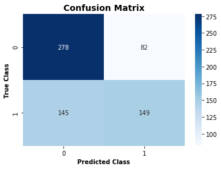
    


Based on the highest cross validation accuracy, the Logistic Regression model was chosen as the best model.

The out of sample accuracy achieved was 65.3%.

## Part 2.3 Conclusion
The goal of the project was to see whether one could use the FIFA game data to predict match outcomes. In my analysis I used the home win variable as a proxy for the match outcome.
The baseline model simply predicting the majority class reaches about 55% accuracy. The final model trained best on the highest average cross validation accuracy, in this case a logistic regression model, reached an out of sample accuracy of 65% on the test set.

This is 10% better than simple predicting the majority class, but lower than hoped for. <br>

Potential improvements for future research would be to get better and more frequently updated team specific data, as this was unfortunately not the case in this dataset.

Other improvements could come from using other data sources in combination with the FIFA data, or training more complex models on the challenge such as Neural Networks to achieve a higher accuracy.
